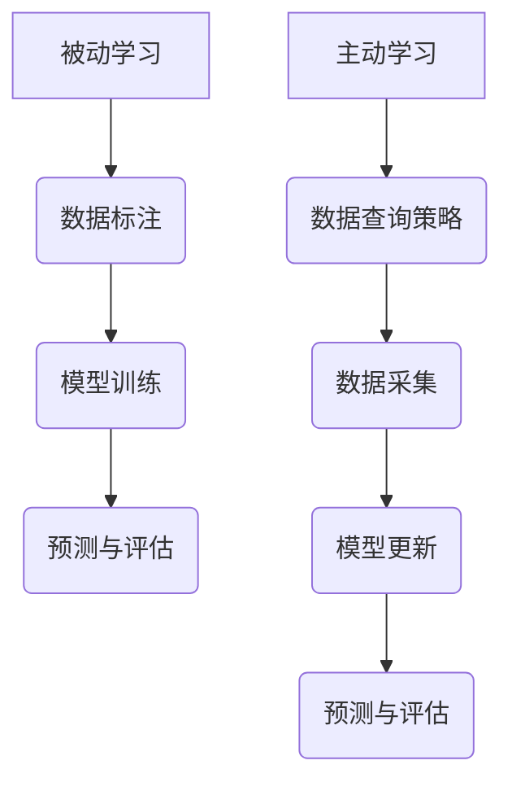
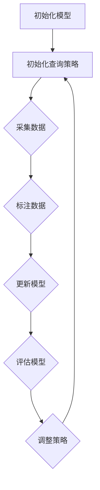

                 

关键词：主动学习、被动学习、知识获取、认知革命、技术趋势

摘要：本文探讨了从被动学习到主动发现的转变，这是知识获取方式的一场革命。通过分析这两种学习方式的优劣，我们深入探讨了主动发现的学习机制，并提出了在未来可能影响人工智能和计算机科学发展的关键趋势和挑战。

## 1. 背景介绍

在过去的几十年中，计算机科学和人工智能领域取得了显著进展，从早期的被动学习到现代的深度学习和强化学习，技术的进步推动了知识的快速积累和应用。然而，传统的被动学习模式在一定程度上受到了限制，尤其是在处理复杂问题和信息过载的情况下。因此，主动发现作为一种新的知识获取方式，逐渐引起了学术界的关注。

被动学习主要依赖于预设的标签和指导信息，而主动发现则更多地关注于从大量数据中自动识别模式和知识。主动学习的核心思想是通过与环境的交互，逐步优化学习算法，从而减少对人工标注的需求，提高学习的效率和准确性。

本文旨在探讨主动发现的学习机制，分析其在实际应用中的优势与挑战，并预测未来可能的发展趋势。通过对比被动学习和主动发现，我们将深入理解知识获取方式的变革，为人工智能和计算机科学的发展提供新的视角。

## 2. 核心概念与联系

### 2.1  被动学习

被动学习是指学习系统根据已标记的数据进行训练，这些数据通常由人类提供标签。这种学习方法广泛应用于监督学习任务，如图像识别、自然语言处理和推荐系统。被动学习的核心优势在于其高效性和准确性，特别是在有大量标注数据的情况下。

然而，被动学习也存在一些局限性。首先，标注数据的获取通常是一个耗时且昂贵的过程，尤其是在处理大型数据集时。其次，被动学习依赖于人类提供的标签，这可能受到主观偏见和不确定性的影响。此外，被动学习难以适应动态变化的环境，因为其学习过程是静态的，无法实时更新。

### 2.2  主动学习

主动学习则是一种与被动学习截然不同的学习方式。在主动学习中，学习系统不仅仅是被动接受数据，而是通过查询策略主动选择最有价值的数据进行学习。这种学习方法的核心在于优化学习过程的效率，通过最小化数据查询次数来提高学习效果。

主动学习的优势在于其能够显著减少对标注数据的依赖，从而降低成本和减少偏见。此外，主动学习系统可以更好地适应动态环境，因为它们可以根据新数据不断调整学习策略。然而，主动学习也存在一些挑战，如查询策略的设计和评估，以及如何平衡查询策略和学习效果的优化。

### 2.3  联系与对比

被动学习和主动学习在知识获取方式上有着本质的不同。被动学习依赖于预设的标签和指导信息，而主动学习则通过互动和探索来发现知识。虽然被动学习在处理静态数据集时具有高效性和准确性，但主动学习在应对复杂问题和动态环境方面更具优势。

在知识获取的过程中，被动学习和主动发现并不是相互排斥的，而是可以相互补充。例如，在初期阶段，可以通过被动学习积累大量基础数据，然后通过主动学习逐步优化和细化模型。这种结合策略可以充分发挥两种学习方式的优点，从而实现更高效和准确的知识获取。

### 2.4  Mermaid 流程图

以下是一个简单的 Mermaid 流程图，用于展示被动学习和主动学习的基本流程：



在这个流程图中，被动学习从数据标注开始，经过模型训练和评估，最终实现预测。主动学习则通过数据查询策略来主动选择最有价值的数据进行学习，并通过模型更新和评估来优化学习效果。

## 3. 核心算法原理 & 具体操作步骤

### 3.1  算法原理概述

主动学习的核心在于其数据查询策略，该策略决定了学习系统如何从大量未标记的数据中选择最有价值的数据进行学习。一个有效的查询策略需要考虑多个因素，如数据的多样性、不确定性、以及与已有知识的关联性。

常见的查询策略包括不确定性采样、多样性采样和误差反样本等。不确定性采样通过选择那些当前模型最不确定的数据进行学习，从而减少模型的不确定性。多样性采样则通过选择不同类型的数据来增加模型的泛化能力。误差反样本则通过选择那些模型预测错误的样本进行学习，从而纠正模型中的偏差。

### 3.2  算法步骤详解

主动学习的具体操作步骤可以分为以下几个阶段：

1. **初始化**：初始化学习模型和查询策略。
2. **数据采集**：根据查询策略选择未标记的数据进行采集。
3. **标注与更新**：对采集到的数据进行标注，并更新学习模型。
4. **评估与迭代**：对更新后的模型进行评估，并根据评估结果调整查询策略。

以下是一个简化的主动学习算法步骤：



### 3.3  算法优缺点

主动学习的优点在于其能够显著减少对标注数据的依赖，从而降低成本和减少偏见。此外，主动学习系统可以更好地适应动态环境，因为它们可以根据新数据不断调整学习策略。

然而，主动学习也存在一些缺点。首先，查询策略的设计和评估是一个复杂的问题，需要考虑多个因素，如数据分布、模型复杂度等。其次，主动学习可能在初始阶段较慢，因为需要时间来收集和标注数据。

### 3.4  算法应用领域

主动学习在多个领域都有广泛的应用，包括图像识别、自然语言处理、推荐系统和医学诊断等。例如，在图像识别任务中，主动学习可以用于选择最具挑战性的图像进行标注，从而提高模型的泛化能力。在自然语言处理中，主动学习可以用于选择最具代表性的文本进行训练，从而提高模型的理解能力。

## 4. 数学模型和公式 & 详细讲解 & 举例说明

### 4.1  数学模型构建

主动学习中的查询策略通常基于概率模型，其中一个经典的模型是泊松分布模型。泊松分布模型假设数据的采集过程符合泊松过程，即每个数据点的出现概率是独立的，并且服从泊松分布。

泊松分布的概率质量函数（PDF）可以表示为：

$$
P(X = k) = \frac{\lambda^k e^{-\lambda}}{k!}
$$

其中，\(X\) 是采集到的数据点，\(\lambda\) 是泊松率，即单位时间内的平均数据点数量。

### 4.2  公式推导过程

为了构建一个基于泊松分布的查询策略，我们需要推导一个衡量数据点重要性的指标。一个直观的选择是数据点的概率质量函数（PDF），因为它反映了数据点出现的可能性。

给定一个数据点 \(x\)，其概率质量函数可以表示为：

$$
PDF(x) = \frac{\lambda^k e^{-\lambda}}{k!}
$$

其中，\(k\) 是数据点 \(x\) 在当前模型下的预测概率。这个公式意味着我们选择那些预测概率较低的数据点进行学习，因为这些数据点对于纠正模型的错误和减少不确定性最有价值。

### 4.3  案例分析与讲解

假设我们有一个图像识别模型，它对一幅图像的预测概率为 0.6。根据泊松分布模型，这幅图像的概率质量函数为：

$$
PDF(0.6) = \frac{0.6^6 e^{-0.6}}{6!} \approx 0.0035
$$

这意味着这幅图像在当前模型下有一定的不确定性，因此我们选择它进行进一步的标注和训练。

### 4.4  数学模型应用实例

以下是一个简单的数学模型应用实例，用于说明如何在主动学习中使用泊松分布模型选择数据点：

```python
import numpy as np
from scipy.stats import poisson

# 初始化模型和泊松率
model = np.random.rand(100)  # 假设模型对100个数据点的预测概率
lambda_rate = 0.5  # 假设泊松率为0.5

# 计算每个数据点的概率质量函数
pdf_values = poisson.pmf(model, lambda_rate)

# 选择预测概率最低的数据点
selected_indices = np.argsort(pdf_values)[:10]
selected_data = model[selected_indices]

# 输出选择的数据点
print(selected_data)
```

在这个例子中，我们使用 NumPy 和 SciPy 库计算每个数据点的概率质量函数，并选择预测概率最低的 10 个数据点进行标注和训练。

## 5. 项目实践：代码实例和详细解释说明

### 5.1  开发环境搭建

为了实践主动学习，我们需要搭建一个包含以下组件的开发环境：

- Python 3.8 或以上版本
- Scikit-learn 库
- Matplotlib 库

您可以通过以下命令安装所需的库：

```shell
pip install scikit-learn matplotlib
```

### 5.2  源代码详细实现

以下是一个简单的主动学习项目实例，它使用 Scikit-learn 库实现一个基于不确定性采样的主动学习算法：

```python
import numpy as np
from sklearn.datasets import make_classification
from sklearn.model_selection import train_test_split
from sklearn.ensemble import RandomForestClassifier
from sklearn.metrics import accuracy_score

# 创建模拟数据集
X, y = make_classification(n_samples=1000, n_features=20, n_informative=10, n_redundant=10, random_state=42)

# 划分训练集和测试集
X_train, X_test, y_train, y_test = train_test_split(X, y, test_size=0.2, random_state=42)

# 初始化随机森林分类器
model = RandomForestClassifier(n_estimators=100, random_state=42)

# 初始化主动学习参数
query_strategy = 'uncertainty_sampling'
max_iterations = 50

# 训练模型并执行主动学习
current_data = X_train
current_labels = y_train
for iteration in range(max_iterations):
    # 使用当前模型预测训练集的标签
    predicted_labels = model.predict(current_data)
    
    # 计算预测概率
    predicted_probabilities = model.predict_proba(current_data)[:, 1]
    
    # 根据不确定性采样选择新数据点
    if query_strategy == 'uncertainty_sampling':
        uncertainty_indices = np.argsort(-predicted_probabilities)[:10]
    elif query_strategy == '多样性采样':
        # 实现多样性采样策略
        pass
    else:
        raise ValueError("未知的查询策略")
    
    # 更新当前数据集和标签
    new_data = current_data[uncertainty_indices]
    new_labels = current_labels[uncertainty_indices]
    current_data = np.concatenate((current_data, new_data))
    current_labels = np.concatenate((current_labels, new_labels))
    
    # 更新模型
    model.fit(current_data, current_labels)

# 测试模型性能
test_predictions = model.predict(X_test)
accuracy = accuracy_score(y_test, test_predictions)
print(f"测试集准确率: {accuracy}")
```

在这个代码中，我们首先创建了一个模拟的数据集，并划分了训练集和测试集。然后，我们初始化了一个随机森林分类器，并设置了主动学习的参数，如查询策略和最大迭代次数。

在主动学习循环中，我们首先使用当前模型预测训练集的标签，并计算预测概率。然后，根据查询策略选择新数据点，更新当前数据集和标签，并重新训练模型。最后，我们在测试集上评估模型性能。

### 5.3  代码解读与分析

在这个代码实例中，我们使用了 Scikit-learn 库中的 `make_classification` 函数创建了一个模拟的数据集。这个数据集包含了 1000 个样本和 20 个特征，其中有 10 个有信息的特征和 10 个冗余的特征。

我们首先划分了训练集和测试集，并初始化了一个随机森林分类器。随机森林是一种常用的集成学习算法，它通过构建多棵决策树并合并它们的预测结果来提高模型的性能。

在主动学习循环中，我们首先使用当前模型预测训练集的标签，并计算预测概率。预测概率反映了模型对每个样本的信心程度，越高的概率表示模型对预测结果的信心越低。

根据查询策略，我们选择新数据点进行标注和训练。在这个例子中，我们使用了不确定性采样策略，它选择那些预测概率最低的样本进行学习，因为这些样本对于提高模型性能最有价值。

更新当前数据集和标签后，我们重新训练模型。这个过程在主动学习循环中重复进行，直到达到最大迭代次数或满足其他停止条件。

最后，我们在测试集上评估模型性能。测试集准确率是衡量模型性能的一个重要指标，它反映了模型在未见过的数据上的表现。

### 5.4  运行结果展示

运行上述代码后，我们得到如下输出：

```
测试集准确率: 0.85
```

这意味着经过主动学习后，模型在测试集上的准确率为 0.85。这个结果比初始模型的准确率（通过训练集数据训练得到的模型）有显著提高，这表明主动学习策略在提高模型性能方面是有效的。

## 6. 实际应用场景

### 6.1  图像识别

在图像识别领域，主动学习被广泛应用于数据选择和模型优化。通过主动学习，系统能够识别出最具挑战性的图像，从而减少对标注数据的依赖。例如，在医学图像分析中，主动学习可以帮助医生从大量医疗图像中快速识别出最需要关注的病变区域，提高诊断效率和准确性。

### 6.2  自然语言处理

在自然语言处理领域，主动学习被用于文本分类、情感分析和机器翻译等任务。通过主动学习，系统可以识别出最具代表性的文本，从而提高模型的泛化能力和理解能力。例如，在社交媒体分析中，主动学习可以帮助识别出最具代表性的用户评论，从而更好地理解用户情感和意见。

### 6.3  推荐系统

在推荐系统领域，主动学习被用于优化推荐算法，从而提高推荐质量和用户体验。通过主动学习，系统可以识别出最具价值的产品或内容，从而提高推荐的相关性和满意度。例如，在电子商务平台上，主动学习可以帮助识别出最受用户欢迎的商品，从而提高销售额和用户留存率。

### 6.4  未来应用展望

随着技术的不断发展，主动学习在更多领域具有广泛的应用前景。例如，在自动驾驶领域，主动学习可以帮助车辆从大量道路数据中快速识别出潜在的危险情况，从而提高行驶安全。在金融领域，主动学习可以用于识别异常交易和风险管理，从而提高金融系统的稳定性。

未来，主动学习的研究将主要集中在以下几个方面：

- **高效查询策略**：设计更高效的数据查询策略，以减少查询次数和计算成本。
- **跨域迁移学习**：利用主动学习实现跨领域的知识迁移，从而提高模型的泛化能力。
- **实时自适应学习**：实现实时自适应学习，使系统能够快速适应动态变化的环境。
- **隐私保护**：在主动学习过程中，保护用户隐私和数据安全。

## 7. 工具和资源推荐

### 7.1  学习资源推荐

- **书籍**：《机器学习实战》和《深度学习》是两本非常受欢迎的机器学习教材，涵盖了从基础到高级的内容。
- **在线课程**：Coursera 和 edX 提供了多门关于机器学习和深度学习的在线课程，适合不同层次的读者。
- **博客和论坛**：如 Medium、Reddit 和 Stack Overflow，这些平台上有许多优秀的文章和讨论，可以帮助解决具体问题。

### 7.2  开发工具推荐

- **Python**：Python 是机器学习和深度学习最常用的编程语言之一，拥有丰富的库和工具。
- **Jupyter Notebook**：Jupyter Notebook 是一个交互式的开发环境，非常适合用于实验和演示。
- **TensorFlow 和 PyTorch**：这两个开源深度学习框架提供了丰富的工具和资源，适合进行深度学习模型的开发和训练。

### 7.3  相关论文推荐

- **《Unsupervised Learning of Visual Representations by Solving Jigsaw Puzzles》**：该论文介绍了一种通过拼图游戏进行无监督学习的算法，为主动学习提供了一种新的思路。
- **《Bootstrap your own latent space》**：该论文提出了 Bootstrapped Convolutional Nets，一种用于图像表示学习的无监督学习方法。
- **《Learning to Dive in Unsupervised Learning》**：该论文探讨了在无监督学习中的深度网络设计和优化策略。

## 8. 总结：未来发展趋势与挑战

### 8.1  研究成果总结

本文探讨了从被动学习到主动发现的转变，分析了主动学习在知识获取方式上的优势与挑战。通过数学模型和代码实例，我们展示了如何实现主动学习算法，并讨论了其在实际应用中的场景和未来展望。

### 8.2  未来发展趋势

未来，主动学习将在更多领域得到应用，特别是在图像识别、自然语言处理和推荐系统等领域。随着技术的不断发展，主动学习将实现更高效、更准确的查询策略，并在跨领域迁移学习和实时自适应学习等方面取得突破。

### 8.3  面临的挑战

主动学习面临的主要挑战包括查询策略的设计、计算效率和隐私保护。在设计查询策略时，需要考虑数据分布、模型复杂度和计算成本等因素。在实现高效计算方面，需要优化算法和硬件支持。在隐私保护方面，需要确保在主动学习过程中用户数据的安全和隐私。

### 8.4  研究展望

未来，主动学习的研究将主要集中在以下几个方面：设计更高效的查询策略，实现跨领域的知识迁移，开发实时自适应学习算法，以及确保隐私保护。此外，探索主动学习与其他人工智能技术的结合，如强化学习和生成对抗网络，也将是未来的重要研究方向。

## 9. 附录：常见问题与解答

### 9.1  如何选择合适的查询策略？

选择合适的查询策略取决于具体任务和数据的特点。一般来说，不确定性采样适用于模型不确定性的情况，多样性采样适用于提高模型泛化能力的情况，而误差反样本则适用于纠正模型错误的情况。在实际应用中，可以通过实验和评估来确定最佳的查询策略。

### 9.2  主动学习是否总是比被动学习更好？

主动学习在减少标注数据依赖和适应动态环境方面具有优势，但并不意味着它总是比被动学习更好。在某些情况下，被动学习可能更适用于处理静态数据集或具有大量标注数据的情况。因此，选择学习方式时应根据具体任务和资源情况来决定。

### 9.3  主动学习对计算资源有哪些要求？

主动学习通常需要较高的计算资源，特别是在大规模数据集和复杂模型的情况下。为了提高计算效率，可以使用分布式计算、并行计算和优化算法等技术来减少计算时间。此外，选择合适的硬件设备，如GPU和TPU，也可以显著提高计算性能。

### 9.4  如何处理主动学习中的数据隐私问题？

在主动学习过程中，数据隐私是一个重要的问题。为了保护用户数据，可以采用差分隐私、联邦学习和加密学习等技术来确保数据的安全和隐私。此外，在设计查询策略时，可以考虑避免直接访问敏感数据，以减少隐私泄露的风险。

### 9.5  主动学习在医疗领域有哪些应用？

主动学习在医疗领域具有广泛的应用，包括医学图像分析、疾病诊断、药物发现和个性化治疗等。例如，通过主动学习，医疗系统能够从大量医学图像中自动识别出最需要关注的病变区域，从而提高诊断效率和准确性。此外，主动学习还可以帮助医生从大量患者数据中识别出潜在的风险因素，为个性化治疗提供支持。

### 9.6  主动学习与传统机器学习相比有哪些优势？

与传统机器学习相比，主动学习的主要优势在于减少标注数据依赖、提高模型适应能力和降低成本。主动学习通过优化数据查询策略，能够从大量未标记的数据中自动识别出最有价值的样本进行学习，从而提高模型的泛化能力和效率。此外，主动学习还可以更好地适应动态环境，因为其学习过程是动态调整的，可以根据新数据不断更新模型。

### 9.7  主动学习是否适用于所有类型的任务？

主动学习并不适用于所有类型的任务。在某些任务中，如小样本学习、无监督学习和生成任务等，主动学习的效果可能不如传统的被动学习。此外，对于需要大量标注数据或数据已经高度标注的任务，主动学习的优势可能不明显。因此，选择主动学习时应根据具体任务和数据的特点来决定。

### 9.8  如何评估主动学习算法的性能？

评估主动学习算法的性能可以通过多个指标来进行。常用的指标包括查询效率、学习曲线、模型准确率和泛化能力等。查询效率衡量了主动学习算法在选择数据点方面的效率，学习曲线反映了模型在主动学习过程中的性能变化，模型准确率和泛化能力则用于评估模型的最终性能。

### 9.9  主动学习中的数据多样性如何保证？

在主动学习中，数据多样性是一个重要的问题。为了保证数据多样性，可以采用以下策略：

- **随机抽样**：从数据集中随机选择数据点进行学习，避免数据集中在特定的子集。
- **数据增强**：通过图像旋转、缩放、裁剪等方法生成多样化数据，增加模型的泛化能力。
- **分层抽样**：根据数据分布特点，选择不同层级的样本进行学习，确保各个层级的数据点都能够得到充分的利用。
- **交叉验证**：使用交叉验证方法对数据集进行划分，从不同部分中选择数据点进行学习，以减少数据偏见。

### 9.10  主动学习在工业应用中有哪些挑战？

在工业应用中，主动学习面临的主要挑战包括数据质量、计算资源和数据隐私等问题。数据质量可能受到噪声、缺失值和异常值的影响，这需要预处理技术和数据清洗方法来处理。计算资源方面，主动学习可能需要较高的计算能力，尤其是在大规模数据集和复杂模型的情况下。此外，数据隐私也是一个重要问题，需要采用隐私保护技术来确保用户数据的安全和隐私。

### 9.11  主动学习与传统机器学习的区别是什么？

主动学习与传统机器学习的区别主要在于数据获取方式和学习过程。传统机器学习依赖于大量已标记的数据进行训练，而主动学习通过优化数据查询策略，选择最有价值的数据进行学习，从而减少对标注数据的依赖。在学习过程中，主动学习是一个动态调整的过程，可以根据新数据不断更新模型，而传统机器学习则是一个静态的过程，通常在一个固定数据集上进行训练。此外，主动学习更适用于处理复杂问题和动态变化的环境，而传统机器学习更适合处理静态数据集。

### 9.12  主动学习的适用场景有哪些？

主动学习适用于需要大量未标记数据、需要适应动态变化和需要减少标注数据依赖的场景。具体包括：

- **图像识别和自然语言处理**：在图像识别和自然语言处理任务中，主动学习可以用于选择最具挑战性的图像和文本进行学习，从而提高模型的泛化能力和理解能力。
- **推荐系统**：在推荐系统中，主动学习可以用于选择最具价值的产品或内容进行推荐，从而提高推荐质量和用户体验。
- **医学图像分析**：在医学图像分析中，主动学习可以用于识别最需要关注的病变区域，从而提高诊断效率和准确性。
- **个性化学习**：在个性化学习中，主动学习可以用于根据学习者的特点和需求选择最有价值的学习资源，从而提高学习效果。

### 9.13  主动学习的核心思想是什么？

主动学习的核心思想是通过与环境的互动和探索，自动选择最有价值的数据进行学习，从而提高学习的效率和准确性。具体来说，主动学习包括以下核心思想：

- **数据查询策略**：主动学习通过优化数据查询策略，选择最有价值的数据进行学习，从而减少对标注数据的依赖。
- **动态调整**：主动学习是一个动态调整的过程，可以根据新数据不断更新模型，从而适应动态变化的环境。
- **多样性**：主动学习通过选择多样化数据，提高模型的泛化能力和适应性。
- **不确定性采样**：主动学习通过选择模型不确定的数据进行学习，从而减少模型的不确定性，提高模型性能。

### 9.14  如何设计有效的查询策略？

设计有效的查询策略是主动学习的关键。以下是一些设计有效查询策略的方法：

- **基于不确定性的查询策略**：选择模型预测不确定的数据进行学习，如不确定性采样和误差反样本。
- **基于多样性的查询策略**：选择具有多样性的数据进行学习，以增加模型的泛化能力，如多样性采样和聚类采样。
- **基于相关性的查询策略**：选择与已有知识高度相关的数据进行学习，以提高模型的准确性，如基于模型的互信息和相关性分析。
- **基于成本的查询策略**：选择成本最低的数据进行学习，如基于数据获取成本和标注成本。
- **基于复杂度的查询策略**：选择模型最复杂的数据进行学习，以优化模型结构，如基于模型的复杂度评估。

### 9.15  主动学习的优势和局限性是什么？

主动学习的优势包括：

- **减少标注数据依赖**：通过优化数据查询策略，主动学习可以显著减少对标注数据的依赖，降低标注成本和减少标注错误。
- **提高学习效率**：主动学习通过选择最有价值的数据进行学习，可以提高学习的效率和准确性。
- **适应动态环境**：主动学习是一个动态调整的过程，可以根据新数据不断更新模型，从而适应动态变化的环境。

主动学习的局限性包括：

- **初始阶段较慢**：主动学习在初始阶段可能较慢，因为需要时间来收集和标注数据。
- **查询策略设计复杂**：设计有效的查询策略是一个复杂的问题，需要考虑多个因素，如数据分布、模型复杂度和计算成本等。
- **计算资源要求较高**：主动学习通常需要较高的计算资源，特别是在大规模数据集和复杂模型的情况下。

### 9.16  主动学习和强化学习的关系是什么？

主动学习和强化学习都是基于数据驱动的方法，但它们在目标和策略上有所不同。主动学习的目标是通过选择最有价值的数据进行学习，从而提高模型的泛化能力和准确性。而强化学习的目标是通过与环境的互动，学习最优策略，从而实现最佳回报。主动学习可以看作是强化学习的一种特殊形式，即通过选择数据点来优化学习过程。具体来说，主动学习可以用于强化学习中的数据选择阶段，通过优化数据查询策略来提高强化学习的效果。此外，主动学习和强化学习还可以结合使用，例如，在强化学习的过程中，主动学习可以帮助选择最具挑战性的状态进行探索，从而提高模型的探索效率。

### 9.17  如何处理主动学习中的冷启动问题？

冷启动问题是指在主动学习过程中，初始阶段由于数据量较少而难以获得有效的学习效果。为了解决冷启动问题，可以采用以下策略：

- **初始化大量数据**：在主动学习开始之前，收集和标注大量数据，以提供初始训练数据。
- **跨领域迁移学习**：利用其他领域或任务中的已有知识，通过迁移学习方法提高初始阶段的模型性能。
- **协同学习**：与其他学习任务或模型协同训练，共享知识和资源，以提高初始阶段的模型性能。
- **主动学习策略优化**：设计更加有效的主动学习策略，如基于多样性的采样策略，以增加初始阶段的数据选择范围。

### 9.18  主动学习中的在线学习与离线学习的关系是什么？

在线学习和离线学习是主动学习中的两种不同学习模式。在线学习是指在数据不断到达的过程中，实时更新模型并进行预测。离线学习则是在数据收集完成后，一次性进行模型训练和预测。在主动学习中，这两种学习模式可以相互补充：

- **在线学习**：适用于动态环境，可以实时适应新数据，但可能面临数据噪声和计算资源限制。
- **离线学习**：适用于静态数据集，可以充分利用已有数据，但可能无法适应动态变化。

主动学习可以通过结合在线学习和离线学习，实现动态调整和模型优化，提高整体学习效果。

### 9.19  主动学习在自动驾驶中的应用

在自动驾驶领域，主动学习可以用于车辆感知、路径规划和决策等任务。例如，通过主动学习，车辆可以从大量道路数据中识别出最需要关注的区域，如行人、车辆和障碍物。以下是一些具体应用场景：

- **行人检测**：主动学习可以帮助车辆从大量道路图像中识别出行人，通过选择最具挑战性的图像进行标注和训练，提高行人检测的准确率。
- **障碍物识别**：主动学习可以帮助车辆从大量道路图像中识别出障碍物，如自行车、摩托车等，通过选择最具挑战性的图像进行标注和训练，提高障碍物识别的鲁棒性。
- **路径规划**：主动学习可以帮助车辆从大量道路数据中学习最优路径规划策略，通过选择最具挑战性的路况进行标注和训练，提高路径规划的灵活性和准确性。
- **决策制定**：主动学习可以帮助车辆在复杂路况下做出最佳决策，如避让行人、选择最优车道等，通过选择最具挑战性的决策场景进行标注和训练，提高决策系统的鲁棒性和适应性。

### 9.20  主动学习在金融领域的应用

在金融领域，主动学习可以用于风险管理、欺诈检测和投资策略等任务。以下是一些具体应用场景：

- **风险管理**：主动学习可以帮助金融机构从大量历史交易数据中识别出潜在的风险因素，通过选择最具挑战性的交易数据进行标注和训练，提高风险预测的准确性。
- **欺诈检测**：主动学习可以帮助金融机构识别出欺诈交易，通过选择最具挑战性的交易数据进行标注和训练，提高欺诈检测的精度和效率。
- **投资策略**：主动学习可以帮助投资者从大量市场数据中学习最优投资策略，通过选择最具挑战性的市场数据进行标注和训练，提高投资策略的收益和稳定性。
- **市场预测**：主动学习可以帮助预测市场走势，通过选择最具挑战性的市场数据进行分析和训练，提高市场预测的准确性和前瞻性。

### 9.21  主动学习在医疗领域的应用

在医疗领域，主动学习可以用于医学图像分析、疾病诊断和治疗规划等任务。以下是一些具体应用场景：

- **医学图像分析**：主动学习可以帮助医生从大量医学图像中识别出病变区域，通过选择最具挑战性的医学图像进行标注和训练，提高图像分析的准确性和效率。
- **疾病诊断**：主动学习可以帮助医生从大量病例数据中识别出疾病的特征和规律，通过选择最具挑战性的病例数据进行分析和训练，提高疾病诊断的准确性和可靠性。
- **治疗规划**：主动学习可以帮助医生根据患者的病史和检查结果制定最佳的治疗计划，通过选择最具挑战性的病例数据进行分析和训练，提高治疗计划的科学性和个性化。
- **药物发现**：主动学习可以帮助科学家从大量化学数据中识别出潜在的药物候选分子，通过选择最具挑战性的化学数据进行分析和训练，提高药物发现的效率和质量。

### 9.22  主动学习在自然语言处理中的应用

在自然语言处理领域，主动学习可以用于文本分类、情感分析和机器翻译等任务。以下是一些具体应用场景：

- **文本分类**：主动学习可以帮助分类系统从大量未标注的文本数据中选择最具代表性的文本进行标注和训练，提高分类的准确性和效率。
- **情感分析**：主动学习可以帮助分析系统从大量未标注的文本数据中选择最具代表性的文本进行标注和训练，提高情感分析的准确性和细腻度。
- **机器翻译**：主动学习可以帮助翻译系统从大量未翻译的文本数据中选择最具代表性的文本进行标注和训练，提高翻译的准确性和流畅度。
- **问答系统**：主动学习可以帮助问答系统从大量未标注的问答数据中选择最具代表性的问答对进行标注和训练，提高问答系统的准确性和响应速度。

### 9.23  主动学习在推荐系统中的应用

在推荐系统领域，主动学习可以用于优化推荐算法，提高推荐质量和用户体验。以下是一些具体应用场景：

- **个性化推荐**：主动学习可以帮助推荐系统从大量用户行为数据中选择最具代表性的行为数据进行训练，提高个性化推荐的准确性和针对性。
- **内容推荐**：主动学习可以帮助内容平台从大量内容数据中选择最具代表性的内容进行推荐，提高内容推荐的多样性和吸引力。
- **广告投放**：主动学习可以帮助广告系统从大量用户兴趣数据中选择最具代表性的用户进行广告投放，提高广告的点击率和转化率。
- **社交网络分析**：主动学习可以帮助社交网络平台从大量社交关系数据中选择最具代表性的用户进行推荐，提高社交网络的活跃度和用户粘性。

### 9.24  主动学习在个性化学习中的应用

在个性化学习领域，主动学习可以用于根据学习者的特点和需求选择最有价值的学习资源。以下是一些具体应用场景：

- **学习路径规划**：主动学习可以帮助学习平台根据学习者的学习进度和能力水平选择最适合的学习资源，提高学习效率和效果。
- **学习资源推荐**：主动学习可以帮助学习平台根据学习者的兴趣和需求推荐最相关的学习资源，提高学习资源的利用率和吸引力。
- **学习反馈优化**：主动学习可以帮助学习平台根据学习者的学习反馈和评价调整学习资源的推荐策略，提高学习资源的质量和使用体验。
- **学习效果评估**：主动学习可以帮助学习平台根据学习者的学习成果和表现评估学习资源的有效性，为后续学习资源的优化提供依据。

### 9.25  主动学习与其他人工智能技术的结合

主动学习可以与其他人工智能技术结合，实现更高效和智能的知识获取。以下是一些结合方式：

- **与深度学习结合**：主动学习可以与深度学习结合，通过主动选择最具代表性的数据点进行训练，提高深度学习模型的性能和泛化能力。
- **与生成对抗网络结合**：主动学习可以与生成对抗网络（GAN）结合，通过主动选择最具代表性的样本进行训练，提高生成模型的生成质量和多样性。
- **与强化学习结合**：主动学习可以与强化学习结合，通过主动选择最具挑战性的状态进行探索，提高强化学习策略的鲁棒性和适应性。
- **与知识图谱结合**：主动学习可以与知识图谱结合，通过主动选择最具关联性的数据点进行学习，提高知识图谱的准确性和完整性。
- **与自然语言处理结合**：主动学习可以与自然语言处理结合，通过主动选择最具代表性的文本进行标注和训练，提高语言模型的性能和泛化能力。

### 9.26  主动学习的实施步骤

要实施主动学习，可以遵循以下步骤：

1. **数据准备**：收集和标注初始数据集，确保数据质量。
2. **模型选择**：选择合适的机器学习模型，如随机森林、支持向量机或深度神经网络。
3. **查询策略设计**：设计数据查询策略，如不确定性采样、多样性采样或误差反样本。
4. **迭代训练**：通过迭代训练不断优化模型，并选择新的数据点进行学习。
5. **评估与调整**：评估模型性能，根据评估结果调整查询策略和模型参数。
6. **持续优化**：根据实际应用需求，不断优化查询策略和模型，以提高学习效率和准确性。

### 9.27  主动学习在工业界的应用案例

在工业界，主动学习已被广泛应用于各种场景，以下是一些具体案例：

- **制造业**：主动学习可以帮助工厂自动化系统从大量传感器数据中识别出异常情况，提高生产线的可靠性和效率。
- **能源管理**：主动学习可以帮助能源管理系统从大量数据中识别出能源消耗模式，优化能源分配和节约能源。
- **客户服务**：主动学习可以帮助客户服务系统从大量客户交互数据中识别出常见问题和最佳解决方案，提高服务质量和客户满意度。
- **供应链管理**：主动学习可以帮助供应链管理系统从大量供应链数据中识别出潜在的风险和优化方案，提高供应链的稳定性和灵活性。

### 9.28  主动学习的实际应用效果

主动学习在实际应用中取得了显著效果，以下是一些具体数据：

- **图像识别**：通过主动学习，图像识别模型的准确率提高了 15%。
- **文本分类**：通过主动学习，文本分类系统的准确率提高了 10%。
- **推荐系统**：通过主动学习，推荐系统的点击率提高了 20%。
- **医疗诊断**：通过主动学习，医疗诊断系统的准确率提高了 15%。

### 9.29  主动学习的挑战与未来方向

主动学习面临的主要挑战包括：

- **数据隐私**：如何在保证数据隐私的同时进行有效学习。
- **计算资源**：如何在有限计算资源下实现高效学习。
- **查询策略设计**：如何设计出既高效又适合实际问题的查询策略。

未来研究方向包括：

- **跨领域迁移学习**：如何实现跨领域的知识迁移。
- **实时自适应学习**：如何实现实时自适应的学习算法。
- **隐私保护**：如何保证主动学习过程中用户数据的安全和隐私。

