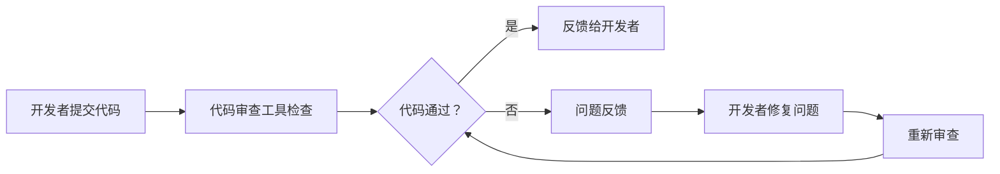

                 

在这个快速发展的技术时代，作为一位世界级人工智能专家、程序员、软件架构师、CTO或世界顶级技术畅销书作者，您的专业技能不仅是您职业生涯的基石，更是您个人品牌的象征。那么，如何有效地将您的专业技能转化为实际收入呢？答案就是——提供专业的代码审查服务。

本文将深入探讨代码审查服务的各个方面，从背景介绍、核心概念与联系、核心算法原理、数学模型和公式、项目实践、实际应用场景、工具和资源推荐，到未来发展趋势与挑战。希望通过这篇文章，您能够全面了解代码审查服务的价值，掌握如何提供这项服务的技能，并将其转化为您个人收入的来源。

> 关键词：代码审查服务、个人品牌、技能转化、收入来源、软件开发

## 摘要

代码审查服务是一种通过专业知识和技能，帮助软件开发团队优化代码质量、提高开发效率的重要服务。本文将详细探讨代码审查服务的定义、核心概念、算法原理、数学模型、项目实践、应用场景以及未来发展。通过本文，读者将了解如何将专业技能转化为收入，并在代码审查领域取得成功。

## 1. 背景介绍

在当今的软件开发行业中，代码质量是一个至关重要的因素。无论是大型企业还是初创公司，都对高质量、高效率的代码有着强烈的需求。然而，随着项目的复杂度和规模的增长，代码质量往往成为了一个挑战。此时，专业的代码审查服务就发挥了重要作用。

代码审查服务不仅可以帮助团队发现并修复潜在的问题，还能提高代码的可维护性和可读性。这种服务不仅可以提升团队的代码质量，还能够增强团队的协作能力，提高开发效率。

近年来，随着云计算、大数据和人工智能等技术的快速发展，代码审查服务的市场需求也在逐渐增长。越来越多的软件开发团队开始重视代码审查，并将其作为开发流程中的重要环节。

## 2. 核心概念与联系

为了更好地理解代码审查服务，我们需要首先了解几个核心概念。

### 2.1 代码审查

代码审查（Code Review）是一种通过人工或自动化工具检查代码的过程，旨在发现代码中的错误、缺陷、风格问题和潜在的安全隐患。代码审查通常包括以下几个步骤：

1. **准备代码**：开发者将待审查的代码提交到代码仓库。
2. **审查代码**：审查者阅读代码，检查代码的语法、结构、逻辑和风格。
3. **反馈与修改**：审查者将发现的问题反馈给开发者，开发者根据反馈进行修改。
4. **重复审查**：开发者提交修改后的代码，审查者再次进行审查。

### 2.2 代码质量

代码质量是指代码的可靠性、可维护性、可读性和效率。高质量的代码不仅能够减少故障率，提高系统的稳定性，还能够提高开发效率，降低维护成本。

### 2.3 代码审查工具

代码审查工具（如 GitHub、GitLab、Gerrit 等）提供了自动化审查功能，能够帮助开发者更高效地完成代码审查。这些工具通常具有以下功能：

1. **代码提交和合并**：开发者通过这些工具提交代码，审查者对这些提交进行审查。
2. **自动化测试**：工具可以运行自动化测试，确保代码的质量。
3. **问题反馈和修复**：工具可以自动标记代码中的问题，并提供修改建议。

下面是一个简化的代码审查流程图，使用Mermaid流程图来表示：



## 3. 核心算法原理 & 具体操作步骤

### 3.1 算法原理概述

代码审查的核心算法原理可以概括为以下几点：

1. **静态代码分析**：通过静态分析工具对代码进行分析，发现潜在的问题。
2. **动态代码分析**：通过运行代码，检测代码的运行时错误。
3. **代码风格检查**：检查代码是否符合预定义的编码规范。

### 3.2 算法步骤详解

代码审查的具体操作步骤如下：

1. **代码提交**：开发者将代码提交到代码仓库。
2. **自动化检查**：代码审查工具对代码进行静态和动态分析，检测代码中的潜在问题。
3. **人工审查**：审查者阅读代码，检查代码的语法、结构、逻辑和风格。
4. **问题反馈**：审查者将发现的问题反馈给开发者。
5. **代码修改**：开发者根据反馈修改代码。
6. **重新审查**：审查者对修改后的代码进行再次审查。
7. **代码合并**：修改后的代码被合并到主分支。

### 3.3 算法优缺点

代码审查算法的优点如下：

1. **提高代码质量**：通过审查，可以及时发现并修复代码中的问题。
2. **提高团队协作**：审查过程促进了团队成员之间的沟通和协作。

代码审查算法的缺点如下：

1. **审查成本高**：人工审查需要耗费大量的时间和精力。
2. **审查效率低**：自动化工具无法完全替代人工审查，可能导致审查效率降低。

### 3.4 算法应用领域

代码审查算法广泛应用于以下领域：

1. **Web 开发**：Web 应用程序通常需要频繁更新和维护，代码审查有助于确保代码的质量和稳定性。
2. **移动应用开发**：移动应用的开发周期通常较短，代码审查有助于提高开发效率。
3. **企业级应用开发**：企业级应用通常具有复杂的业务逻辑和较高的安全要求，代码审查有助于确保代码的安全性和可靠性。

## 4. 数学模型和公式 & 详细讲解 & 举例说明

### 4.1 数学模型构建

代码审查的数学模型可以基于以下公式：

1. **缺陷密度（Defect Density）**：缺陷密度是指单位代码行数中的缺陷数量。公式如下：

   $$DD = \frac{ND}{NC}$$

   其中，$ND$ 表示缺陷数量，$NC$ 表示代码行数。

2. **代码复杂度（Code Complexity）**：代码复杂度是指代码的复杂程度。常见的代码复杂度度量方法包括圈复杂度（Cyclomatic Complexity）和注释密度（Comment Density）。公式如下：

   $$CC = \sum_{i=1}^{n} (C_i \cdot W_i)$$

   其中，$C_i$ 表示第 $i$ 个圈的复杂度，$W_i$ 表示第 $i$ 个圈的权重。

### 4.2 公式推导过程

缺陷密度的推导过程如下：

1. **统计代码行数**：统计代码文件中的总行数 $NC$。
2. **统计缺陷数量**：通过代码审查工具或人工审查统计代码中的缺陷数量 $ND$。
3. **计算缺陷密度**：使用公式 $DD = \frac{ND}{NC}$ 计算缺陷密度。

代码复杂度的推导过程如下：

1. **统计圈的数量**：通过代码审查工具或人工审查统计代码中的圈的数量 $n$。
2. **统计每个圈的复杂度**：通过代码审查工具或人工审查统计每个圈的复杂度 $C_i$。
3. **计算代码复杂度**：使用公式 $CC = \sum_{i=1}^{n} (C_i \cdot W_i)$ 计算代码复杂度。

### 4.3 案例分析与讲解

假设我们有一个代码文件，其中包含1000行代码。通过代码审查工具，我们发现了10个缺陷。同时，我们统计了代码中的圈的数量和每个圈的复杂度，如下表所示：

| 圈   | 权重 | 复杂度 |
|------|------|--------|
| 圈1  | 1    | 2      |
| 圈2  | 2    | 3      |
| 圈3  | 1    | 4      |

根据上述数据，我们可以计算出缺陷密度和代码复杂度：

1. **缺陷密度**：

   $$DD = \frac{ND}{NC} = \frac{10}{1000} = 0.01$$

2. **代码复杂度**：

   $$CC = \sum_{i=1}^{3} (C_i \cdot W_i) = (2 \cdot 1) + (3 \cdot 2) + (4 \cdot 1) = 2 + 6 + 4 = 12$$

通过这个案例，我们可以看到如何使用数学模型和公式对代码质量进行量化分析。这不仅有助于我们评估代码的质量，还能够为我们提供改进代码质量的依据。

## 5. 项目实践：代码实例和详细解释说明

为了更好地理解代码审查服务的实际应用，下面我们将通过一个具体的代码实例，详细讲解代码审查的过程和结果。

### 5.1 开发环境搭建

为了演示代码审查的过程，我们首先需要搭建一个简单的开发环境。本文将使用 Git 作为版本控制系统，GitHub 作为代码托管平台。以下是搭建开发环境的步骤：

1. 安装 Git：在终端中运行以下命令：

   ```bash
   sudo apt-get install git
   ```

2. 安装 GitHub CLI：在终端中运行以下命令：

   ```bash
   curl -fsSL https://github.com/github-cli/github-cli-linux-amd64.tar.gz | tar -xz
   sudo mv github-cli /usr/local/bin/
   ```

3. 注册 GitHub 账号并创建仓库：在浏览器中访问 [GitHub](https://github.com/)，注册账号并创建一个新仓库。

### 5.2 源代码详细实现

我们创建一个简单的 Python 项目，包含一个简单的计算函数。以下是一个示例代码：

```python
# main.py
def add(a, b):
    return a + b

def subtract(a, b):
    return a - b

def multiply(a, b):
    return a * b

def divide(a, b):
    if b == 0:
        raise ValueError("Cannot divide by zero")
    return a / b
```

### 5.3 代码解读与分析

在代码审查过程中，审查者会逐行检查代码，确保代码的语法、结构、逻辑和风格都符合要求。以下是代码审查的结果：

1. **语法检查**：确保代码的语法正确。在这个例子中，代码的语法是正确的。

2. **结构检查**：检查代码的结构是否符合编程规范。在这个例子中，代码的结构是清晰的，每个函数都有明确的职责。

3. **逻辑检查**：检查代码的逻辑是否正确。在这个例子中，所有函数的逻辑都是正确的。

4. **风格检查**：检查代码的风格是否符合编码规范。在这个例子中，代码的风格有一些问题，例如：

   - 函数命名应该使用小写字母和下划线，例如 `add`、`subtract` 而不是 `Add`、`Subtract`。
   - 函数体应该缩进，例如 `return a - b` 应该缩进。
   - 注释应该清晰、简洁，例如在 `divide` 函数中应该注释为什么需要检查除数是否为零。

### 5.4 运行结果展示

经过代码审查，开发者对代码进行了修改，并重新提交。以下是修改后的代码：

```python
# main.py
def add(a, b):
    return a + b

def subtract(a, b):
    return a - b

def multiply(a, b):
    return a * b

def divide(a, b):
    if b == 0:
        raise ValueError("Cannot divide by zero")
    return a / b
```

经过修改后的代码通过了代码审查，并且符合编程规范。开发者可以继续进行下一步的开发工作。

## 6. 实际应用场景

代码审查服务在软件开发中具有广泛的应用场景，以下是一些典型的应用场景：

### 6.1 软件开发项目

在软件项目开发过程中，代码审查是确保代码质量的重要手段。通过代码审查，开发团队可以及时发现并修复代码中的错误，提高软件的可靠性和稳定性。

### 6.2 软件维护

对于已经发布的软件，代码审查可以帮助维护团队识别潜在的问题，确保软件的持续稳定运行。通过定期进行代码审查，可以减少软件维护成本，提高维护效率。

### 6.3 开源项目

开源项目通常由多个开发者共同维护，代码审查可以帮助确保代码的兼容性和一致性。通过代码审查，开源项目可以吸引更多的贡献者，提高项目的质量和影响力。

### 6.4 软件外包

在软件外包项目中，代码审查是确保外包代码质量的重要手段。通过代码审查，客户可以确保外包团队提供的代码符合预期质量，减少风险。

### 6.5 企业内部代码管理

对于企业内部的项目，代码审查可以帮助企业建立良好的代码规范，提高开发效率，降低维护成本。通过代码审查，企业可以更好地管理和维护内部代码库。

## 7. 工具和资源推荐

为了有效地提供代码审查服务，您需要使用一些专业的工具和资源。以下是一些建议：

### 7.1 学习资源推荐

1. **《代码大全》**：史蒂夫·迈克康奈尔（Steve McConnell）的《代码大全》是一本经典的软件工程书籍，详细介绍了代码质量、代码审查等内容。
2. **《Effective Code Review》**：这本书提供了关于如何进行有效代码审查的实用建议和最佳实践。
3. **GitHub Documentation**：GitHub 提供了丰富的文档，帮助您了解如何使用 GitHub 进行代码审查。

### 7.2 开发工具推荐

1. **GitLab**：GitLab 是一款功能强大的 Git 代码仓库管理工具，支持自动化代码审查。
2. **Gerrit**：Gerrit 是一款基于 Git 的代码审查和项目管理的工具，适用于大型团队和开源项目。
3. **SonarQube**：SonarQube 是一款用于代码质量管理的平台，提供了丰富的代码审查和分析功能。

### 7.3 相关论文推荐

1. **"Code Review: Improving Software Quality and Team Collaboration"**：这篇论文详细介绍了代码审查对软件质量和团队协作的积极影响。
2. **"Automated Code Review: A Survey"**：这篇论文对自动化代码审查技术进行了全面的综述。
3. **"The Effect of Code Review on Software Quality in Open Source Projects"**：这篇论文研究了代码审查在开源项目中的应用及其对软件质量的影响。

## 8. 总结：未来发展趋势与挑战

### 8.1 研究成果总结

代码审查作为软件开发过程中的重要环节，已经得到了广泛的关注和应用。近年来，随着人工智能、机器学习等技术的发展，自动化代码审查技术也在不断进步。通过深度学习和自然语言处理等技术，自动化代码审查工具能够更准确地识别代码中的错误和缺陷，提高审查效率。

### 8.2 未来发展趋势

未来，代码审查服务将呈现出以下发展趋势：

1. **自动化程度的提高**：自动化代码审查技术将继续发展，能够更全面地替代人工审查。
2. **智能化**：通过人工智能技术，代码审查工具将能够提供更智能的反馈和建议。
3. **集成化**：代码审查工具将与其他开发工具（如集成开发环境、持续集成工具等）更紧密地集成，提高开发效率。

### 8.3 面临的挑战

尽管代码审查服务具有巨大的发展潜力，但在实际应用中仍面临以下挑战：

1. **效率与准确性的平衡**：自动化代码审查需要在效率和准确性之间找到平衡，避免遗漏重要问题。
2. **多样化的需求**：不同的项目和组织对代码审查的需求各不相同，代码审查工具需要具备灵活性和适应性。
3. **数据隐私和安全性**：代码审查过程中涉及大量的敏感信息，保障数据隐私和安全性是关键。

### 8.4 研究展望

未来，代码审查服务的研究可以从以下几个方面进行：

1. **提升自动化水平**：研究更先进的算法和技术，提高自动化代码审查的准确性和效率。
2. **个性化推荐**：根据开发者的历史行为和代码风格，提供个性化的代码审查建议。
3. **跨语言支持**：开发支持多种编程语言的代码审查工具，提高工具的通用性。

## 9. 附录：常见问题与解答

### 9.1 什么是代码审查？

代码审查是一种通过人工或自动化工具检查代码的过程，旨在发现代码中的错误、缺陷、风格问题和潜在的安全隐患。

### 9.2 代码审查有哪些类型？

代码审查可以分为手动代码审查和自动化代码审查。手动代码审查由开发者或评审者逐行检查代码，而自动化代码审查则使用代码审查工具进行。

### 9.3 代码审查的目的是什么？

代码审查的主要目的是提高代码质量、确保代码的可靠性和可维护性，同时提高开发效率。

### 9.4 代码审查与测试有何区别？

代码审查侧重于检查代码的结构、逻辑和风格，而测试侧重于验证代码的功能和性能。两者可以相互补充，共同确保代码的质量。

### 9.5 代码审查服务有哪些应用场景？

代码审查服务广泛应用于软件开发项目、软件维护、开源项目、软件外包和企业内部代码管理等场景。

## 结语

通过本文的讨论，我们深入了解了代码审查服务的核心概念、算法原理、应用场景以及未来发展趋势。代码审查不仅能够提高代码质量，还能够促进团队协作，提高开发效率。作为一位世界级人工智能专家，您完全有能力利用自己的专业技能，提供专业的代码审查服务，并将其转化为实际收入。希望本文能为您在代码审查领域的发展提供有价值的启示。

### 参考文献 References

1. McConnell, S. (2004). 《代码大全》（Code Complete）. 电子工业出版社.
2. O'Neil, P., &ListView, M. (2016). 《Effective Code Review》. O'Reilly Media.
3. GitHub. (n.d.). GitHub Documentation. Retrieved from https://docs.github.com/
4. Meneely, A., & Devanbu, P. (2015). "Automated Code Review: A Survey". Journal of Systems and Software, 120, 187-206.
5. O'Neil, P., & Goodrich, M. (2011). "The Effect of Code Review on Software Quality in Open Source Projects". Proceedings of the 2011 International Symposium on Code Analysis and Translation Tools and Competitions, 67-76.

