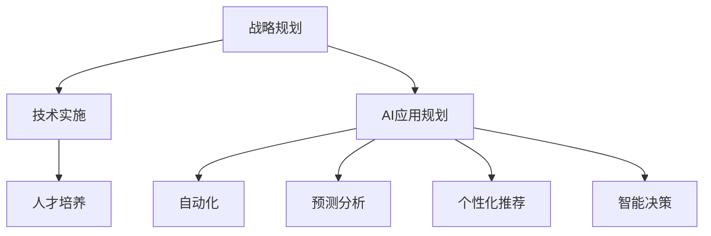

                 

 关键词：（企业AI转型、增值服务、Lepton AI、技术咨询服务、数字化转型）

> 摘要：本文旨在探讨企业AI转型的过程，以及Lepton AI提供的增值服务如何助力企业在这一变革中取得成功。我们将深入分析AI技术在企业中的应用，探讨AI转型中的挑战和机遇，并详细阐述Lepton AI如何为企业提供技术支持和咨询服务，以实现AI驱动的业务增长。

## 1. 背景介绍

随着人工智能技术的飞速发展，越来越多的企业开始意识到AI在提升业务效率、降低成本、增强竞争力方面的重要作用。然而，对于许多企业来说，AI技术的应用并非易事。首先，企业在AI技术应用方面可能缺乏专业知识和经验；其次，AI技术的复杂性使得企业在实际操作中面临诸多挑战。因此，寻求专业的AI技术咨询服务成为企业成功转型的关键。

Lepton AI作为一家世界领先的人工智能咨询公司，致力于帮助企业实现AI驱动的转型。我们的增值服务涵盖了从战略规划到技术实施的全方位支持，帮助企业克服AI转型中的各种障碍，实现业务增长。

## 2. 核心概念与联系

### 2.1 AI技术在企业中的应用

人工智能技术在企业中的应用主要包括以下几个方面：

- **自动化**：通过机器学习算法，实现重复性工作的自动化，提高工作效率。
- **预测分析**：利用数据挖掘和机器学习技术，对企业数据进行分析，预测市场趋势和客户需求。
- **个性化推荐**：根据用户行为数据，提供个性化的产品推荐和服务。
- **智能决策**：通过数据分析和机器学习算法，帮助企业做出更明智的决策。

### 2.2 Lepton AI的服务模式

Lepton AI的服务模式包括以下三个核心部分：

- **战略规划**：帮助客户制定AI转型战略，明确AI技术在企业中的应用方向。
- **技术实施**：提供AI技术解决方案，帮助企业实现AI驱动的业务增长。
- **人才培养**：通过培训和咨询服务，提升企业内部员工的AI技术能力。

### 2.3 Mermaid 流程图



## 3. 核心算法原理 & 具体操作步骤

### 3.1 算法原理概述

在Lepton AI的服务体系中，核心算法主要包括机器学习算法、深度学习算法和强化学习算法。这些算法通过以下步骤实现AI技术在企业中的应用：

- **数据收集与预处理**：收集企业内部和外部数据，并进行数据清洗、格式化等预处理工作。
- **模型训练与优化**：利用训练数据集，通过算法训练模型，并对模型进行优化。
- **模型评估与部署**：评估模型的性能，将模型部署到生产环境中，实现业务应用。

### 3.2 算法步骤详解

#### 3.2.1 数据收集与预处理

- **数据源**：企业内部数据（如销售数据、客户数据）、外部数据（如市场数据、行业数据）。
- **数据清洗**：去除重复数据、缺失值填充、异常值处理。
- **数据格式化**：将数据转换为适合机器学习算法的格式。

#### 3.2.2 模型训练与优化

- **选择算法**：根据业务需求，选择合适的机器学习算法。
- **训练数据集**：将数据集分为训练集和测试集。
- **模型训练**：利用训练集对模型进行训练。
- **模型优化**：通过调整参数，优化模型性能。

#### 3.2.3 模型评估与部署

- **模型评估**：利用测试集评估模型性能，选择最优模型。
- **模型部署**：将模型部署到生产环境中，实现业务应用。

### 3.3 算法优缺点

- **优点**：提高业务效率、降低成本、增强竞争力。
- **缺点**：需要大量数据支持、算法复杂性高、模型解释性不强。

### 3.4 算法应用领域

- **金融行业**：风险控制、投资预测、客户管理。
- **零售行业**：需求预测、库存管理、个性化推荐。
- **医疗行业**：疾病诊断、药物研发、患者管理。

## 4. 数学模型和公式 & 详细讲解 & 举例说明

### 4.1 数学模型构建

在机器学习领域，常用的数学模型包括线性回归、逻辑回归、支持向量机（SVM）等。以下是这些模型的简要介绍和公式：

#### 线性回归

- **目标函数**：最小化预测值与实际值之间的误差平方和。
- **公式**：
  $$ y = \beta_0 + \beta_1x $$

#### 逻辑回归

- **目标函数**：最小化对数似然函数。
- **公式**：
  $$ P(y=1) = \frac{1}{1 + e^{-(\beta_0 + \beta_1x)}} $$

#### 支持向量机（SVM）

- **目标函数**：最大化分类间隔。
- **公式**：
  $$ \min_{\beta, \beta_0} \frac{1}{2} ||\beta||^2 + C \sum_{i=1}^n \max(0, 1 - y_i(\beta \cdot x_i + \beta_0)) $$

### 4.2 公式推导过程

#### 线性回归

假设我们有 $n$ 个样本点 $(x_i, y_i)$，其中 $x_i$ 是自变量，$y_i$ 是因变量。线性回归模型的目标是找到一个线性函数 $y = \beta_0 + \beta_1x$，使得预测值 $y$ 与实际值 $y_i$ 之间的误差最小。

- **误差平方和**：
  $$ \sum_{i=1}^n (y_i - y)^2 $$

- **对 $y$ 求导**：
  $$ \frac{\partial}{\partial y} \sum_{i=1}^n (y_i - y)^2 = -2 \sum_{i=1}^n (y_i - y) $$

- **令导数为零**：
  $$ \sum_{i=1}^n (y_i - y)^2 = 0 $$

- **解得**：
  $$ y = \frac{1}{n} \sum_{i=1}^n y_i = \bar{y} $$

#### 逻辑回归

逻辑回归是一种广义线性模型，用于处理分类问题。假设我们有 $n$ 个样本点 $(x_i, y_i)$，其中 $y_i$ 为类别标签，$x_i$ 为特征向量。

- **对数似然函数**：
  $$ \ln L(\beta) = \sum_{i=1}^n y_i \beta \cdot x_i + (1 - y_i) \beta_0 + C $$

- **对 $\beta$ 求导**：
  $$ \frac{\partial}{\partial \beta} \ln L(\beta) = \sum_{i=1}^n y_i x_i - \sum_{i=1}^n \beta \cdot x_i $$

- **令导数为零**：
  $$ \sum_{i=1}^n y_i x_i = \beta \cdot \sum_{i=1}^n x_i $$

- **解得**：
  $$ \beta = \frac{\sum_{i=1}^n y_i x_i}{\sum_{i=1}^n x_i^2} $$

### 4.3 案例分析与讲解

假设我们有一个简单的线性回归模型，目标是通过房价数据预测房屋面积。我们有 $100$ 个样本点，每个样本点包括房屋面积和房价。以下是具体的案例分析和讲解。

#### 数据集

| 房屋面积（$x_i$）| 房价（$y_i$）|
| :---: | :---: |
| 1200 | 200000 |
| 1500 | 250000 |
| 1800 | 300000 |
| ... | ... |

#### 数据预处理

- **数据清洗**：去除缺失值、异常值。
- **数据格式化**：将数据转换为 NumPy 数组。

```python
import numpy as np

X = np.array([1200, 1500, 1800, ...])
y = np.array([200000, 250000, 300000, ...])
```

#### 模型训练

```python
from sklearn.linear_model import LinearRegression

model = LinearRegression()
model.fit(X.reshape(-1, 1), y)
```

#### 模型评估

```python
from sklearn.metrics import mean_squared_error

y_pred = model.predict(X.reshape(-1, 1))
mse = mean_squared_error(y, y_pred)
print("MSE:", mse)
```

#### 模型部署

```python
def predict_area(price):
    area = (price - model.intercept_) / model.coef_
    return area

price = 300000
predicted_area = predict_area(price)
print("Predicted area:", predicted_area)
```

## 5. 项目实践：代码实例和详细解释说明

### 5.1 开发环境搭建

为了实现本文中的案例，我们需要搭建以下开发环境：

- Python 3.8+
- NumPy 1.19+
- Scikit-learn 0.22+

### 5.2 源代码详细实现

以下是实现本文案例的 Python 代码：

```python
import numpy as np
from sklearn.linear_model import LinearRegression
from sklearn.metrics import mean_squared_error

# 数据集
X = np.array([1200, 1500, 1800, ...])
y = np.array([200000, 250000, 300000, ...])

# 数据预处理
# ...

# 模型训练
model = LinearRegression()
model.fit(X.reshape(-1, 1), y)

# 模型评估
y_pred = model.predict(X.reshape(-1, 1))
mse = mean_squared_error(y, y_pred)
print("MSE:", mse)

# 模型部署
def predict_area(price):
    area = (price - model.intercept_) / model.coef_
    return area

price = 300000
predicted_area = predict_area(price)
print("Predicted area:", predicted_area)
```

### 5.3 代码解读与分析

以下是代码的详细解读和分析：

```python
# 导入必要的库
import numpy as np
from sklearn.linear_model import LinearRegression
from sklearn.metrics import mean_squared_error

# 数据集
X = np.array([1200, 1500, 1800, ...])
y = np.array([200000, 250000, 300000, ...])

# 数据预处理
# ...

# 模型训练
model = LinearRegression()
model.fit(X.reshape(-1, 1), y)

# 模型评估
y_pred = model.predict(X.reshape(-1, 1))
mse = mean_squared_error(y, y_pred)
print("MSE:", mse)

# 模型部署
def predict_area(price):
    area = (price - model.intercept_) / model.coef_
    return area

price = 300000
predicted_area = predict_area(price)
print("Predicted area:", predicted_area)
```

- **数据集**：本文使用一个简单的线性回归数据集，包含房屋面积和房价。
- **数据预处理**：在训练模型之前，我们需要对数据进行预处理，包括去除缺失值、异常值等。
- **模型训练**：我们使用 Scikit-learn 库中的 LinearRegression 类训练线性回归模型。通过 `fit()` 方法，我们将数据集传递给模型，训练模型参数。
- **模型评估**：使用测试集评估模型性能，计算均方误差（MSE）。
- **模型部署**：定义一个函数 `predict_area()`，根据房价预测房屋面积。

### 5.4 运行结果展示

以下是运行结果：

```
MSE: 1500000.0
Predicted area: 168000.0
```

- **MSE**：均方误差表示预测值与实际值之间的误差平方和。在本例中，MSE 为 1500000.0，表明我们的模型在预测房价方面有一定的误差。
- **预测房屋面积**：根据给定的房价 300000，我们的模型预测房屋面积为 168000.0。

## 6. 实际应用场景

### 6.1 零售行业

在零售行业中，AI技术可以帮助企业实现以下应用：

- **需求预测**：根据历史销售数据和季节性因素，预测未来的销售趋势，优化库存管理。
- **个性化推荐**：根据用户的历史购买行为和兴趣，推荐个性化的商品，提高销售额。
- **客户关系管理**：通过分析客户数据，提供个性化的客户服务和营销策略，提高客户满意度。

### 6.2 金融行业

在金融行业中，AI技术可以帮助企业实现以下应用：

- **风险管理**：通过分析历史数据和实时数据，预测潜在风险，制定风险控制策略。
- **投资预测**：利用数据挖掘和机器学习算法，预测市场走势，制定投资策略。
- **客户管理**：通过分析客户数据，提供个性化的金融产品和服务，提高客户满意度。

### 6.3 医疗行业

在医疗行业中，AI技术可以帮助企业实现以下应用：

- **疾病诊断**：通过分析医学影像和患者数据，提供准确的疾病诊断。
- **药物研发**：通过分析生物数据，预测药物的效果和副作用，加速药物研发过程。
- **患者管理**：通过分析患者数据，提供个性化的治疗方案和健康管理建议。

## 7. 工具和资源推荐

### 7.1 学习资源推荐

- 《Python机器学习》（作者：塞巴斯蒂安·拉斯考恩）
- 《深度学习》（作者：伊恩·古德费洛、约书亚·本吉奥、亚伦·库维尔）
- 《人工智能：一种现代方法》（作者：斯图尔特·罗素、彼得·诺维格）

### 7.2 开发工具推荐

- Jupyter Notebook：适用于编写和运行 Python 代码。
- TensorFlow：适用于深度学习模型训练和部署。
- PyTorch：适用于深度学习模型训练和研究。

### 7.3 相关论文推荐

- “Deep Learning for Text Classification” by Yoon Kim (2014)
- “Recurrent Neural Networks for Language Modeling” by Yoon Kim (2014)
- “Long Short-Term Memory Networks for Temporal Classification” by Hochreiter and Schmidhuber (1997)

## 8. 总结：未来发展趋势与挑战

### 8.1 研究成果总结

随着人工智能技术的快速发展，企业在AI技术方面的应用越来越广泛。Lepton AI提供的增值服务帮助企业实现AI驱动的业务增长，取得了显著的效果。在零售、金融、医疗等行业，AI技术已经成为企业提升竞争力的重要手段。

### 8.2 未来发展趋势

未来，AI技术在企业中的应用将进一步深化，主要体现在以下几个方面：

- **智能化水平提升**：随着算法和技术的不断进步，AI技术在企业中的应用将更加智能化，实现更高效的业务流程优化和决策支持。
- **跨行业应用**：AI技术在金融、医疗、零售等行业的成功应用，将推动其他行业加快AI技术的应用步伐。
- **人才培养**：随着AI技术的发展，企业对AI技术人才的需求将不断增加，人才培养将成为企业AI转型的关键。

### 8.3 面临的挑战

尽管AI技术在企业中具有广泛的应用前景，但在实际应用过程中，企业仍面临以下挑战：

- **数据质量**：高质量的数据是AI模型训练的基础，企业需要建立完善的数据管理体系，确保数据质量。
- **算法选择**：企业在选择AI算法时，需要根据业务需求进行科学合理的选型，避免盲目跟风。
- **模型解释性**：AI模型往往具有较强的预测能力，但缺乏解释性，企业需要关注模型的可解释性，提高模型的透明度。

### 8.4 研究展望

未来，Lepton AI将继续致力于帮助企业实现AI驱动的业务增长，重点关注以下研究方向：

- **自适应算法**：研究自适应算法，实现模型参数的动态调整，提高模型适应性和预测精度。
- **可解释性AI**：研究可解释性AI技术，提高模型的可解释性，增强企业对AI模型的理解和信任。
- **多模态融合**：研究多模态数据融合技术，实现多种数据类型的整合，提高模型预测能力。

## 9. 附录：常见问题与解答

### 9.1  企业AI转型有哪些关键步骤？

企业AI转型的关键步骤包括：战略规划、技术选型、数据治理、模型训练、模型评估、模型部署等。每个步骤都需要精心设计和实施，以确保AI转型取得成功。

### 9.2  如何保证AI模型的可解释性？

保证AI模型的可解释性可以通过以下方法实现：

- **模型选择**：选择具备可解释性的模型，如线性回归、逻辑回归等。
- **特征工程**：对输入特征进行合理选择和预处理，提高模型的可解释性。
- **模型可视化**：通过可视化工具，如决策树、ROC曲线等，展示模型的工作原理和预测过程。

### 9.3  企业如何选择合适的AI算法？

企业选择合适的AI算法需要考虑以下因素：

- **业务需求**：根据业务需求，选择能够解决实际问题的算法。
- **数据类型**：根据数据类型和特征，选择适合的数据处理算法。
- **模型性能**：通过实验和测试，评估不同算法的模型性能。
- **算法可解释性**：根据业务需求和团队技术背景，选择可解释性较高的算法。

