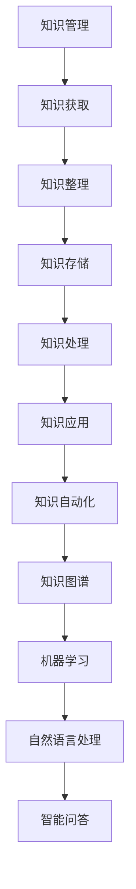

                 

关键词：企业知识管理、人工智能、AI化转型、知识图谱、机器学习、自然语言处理、知识自动化

> 摘要：随着人工智能技术的不断进步，企业知识管理的AI化转型已经成为提升企业竞争力和创新能力的关键途径。本文将探讨企业知识管理AI化转型的核心概念、算法原理、数学模型、项目实践、实际应用场景以及未来发展趋势，为企业提供一套系统化的AI化转型策略。

## 1. 背景介绍

在当今信息爆炸的时代，知识已经成为企业最重要的资产。传统的知识管理方法往往依赖于人工收集、整理和存储，效率低下且容易出错。随着人工智能技术的快速发展，企业知识管理迎来了AI化的变革。AI化转型不仅能够提升知识管理的效率，还能挖掘出知识中的潜在价值，为企业提供更加精准和智能的支持。

企业知识管理的AI化转型主要涉及以下几个方面：

- **知识自动化**：利用自然语言处理技术实现知识的自动化获取、整理、存储和分享。
- **知识图谱**：构建企业知识图谱，以可视化方式呈现知识结构，提高知识检索和利用的效率。
- **机器学习**：通过机器学习算法对知识进行分类、分析和预测，为企业的决策提供数据支持。
- **智能问答**：开发智能问答系统，实现用户与知识库的智能交互，提高知识获取的便捷性。

## 2. 核心概念与联系

### 2.1. 知识管理

知识管理是指通过系统的方法和技术，对知识进行识别、收集、存储、处理、传播和应用，以提高组织的知识水平和竞争力。知识管理可以分为三个层次：知识获取、知识共享和知识应用。

### 2.2. 人工智能

人工智能是指模拟人类智能的技术和方法，包括机器学习、深度学习、自然语言处理、计算机视觉等。人工智能在知识管理中的应用，可以大幅度提升知识的获取、处理和利用效率。

### 2.3. 知识图谱

知识图谱是一种语义网络，通过实体、属性和关系来描述知识。知识图谱可以用于知识检索、推荐、问答等应用，是知识管理AI化的核心技术之一。

### 2.4. 机器学习

机器学习是一种人工智能技术，通过从数据中学习规律和模式，实现自动化的决策和预测。在知识管理中，机器学习可以用于知识的分类、聚类、分析等。

### 2.5. 自然语言处理

自然语言处理是指使计算机能够理解、处理和生成人类自然语言的技术。在知识管理中，自然语言处理可以用于知识获取、整理、存储和共享。

## 2.6. Mermaid 流程图



## 3. 核心算法原理 & 具体操作步骤

### 3.1. 算法原理概述

企业知识管理的AI化转型主要依赖于以下核心算法：

- **知识图谱构建算法**：用于构建企业知识图谱，实现知识的可视化表示和高效检索。
- **自然语言处理算法**：用于知识获取、整理和共享，实现人与知识的智能交互。
- **机器学习算法**：用于知识的分类、分析和预测，为企业的决策提供数据支持。
- **智能问答算法**：用于构建智能问答系统，实现用户与知识库的智能交互。

### 3.2. 算法步骤详解

#### 3.2.1. 知识图谱构建算法

1. **数据预处理**：对原始数据进行清洗、去重和格式化，提取实体、属性和关系。
2. **实体识别**：使用命名实体识别技术，从文本中提取出实体。
3. **关系抽取**：使用关系抽取技术，从文本中提取出实体之间的关系。
4. **知识融合**：将不同来源的知识进行融合，构建出企业知识图谱。

#### 3.2.2. 自然语言处理算法

1. **分词**：将文本分割成词语序列。
2. **词性标注**：为每个词语标注出词性。
3. **实体识别**：从文本中识别出实体。
4. **关系抽取**：从文本中识别出实体之间的关系。
5. **语义分析**：对文本进行语义分析，提取出文本的主要内容和语义关系。

#### 3.2.3. 机器学习算法

1. **数据收集**：收集企业内部和外部的数据。
2. **数据预处理**：对数据进行清洗、归一化和特征提取。
3. **模型训练**：使用机器学习算法对数据进行训练，构建出知识分类、聚类和分析模型。
4. **模型评估**：对模型进行评估，选择最优模型。
5. **模型应用**：将模型应用于实际场景，为企业的决策提供数据支持。

#### 3.2.4. 智能问答算法

1. **问题理解**：对用户提出的问题进行理解，提取出问题的关键词和语义。
2. **知识检索**：从知识库中检索出与问题相关的知识。
3. **答案生成**：使用自然语言生成技术，生成问题的答案。
4. **答案评估**：对答案进行评估，确保答案的准确性和完整性。

### 3.3. 算法优缺点

- **知识图谱构建算法**：优点是能够实现知识的可视化表示和高效检索，缺点是需要大量高质量的原始数据。
- **自然语言处理算法**：优点是能够实现人与知识的智能交互，缺点是需要大量标注数据和计算资源。
- **机器学习算法**：优点是能够自动提取知识中的规律和模式，缺点是需要大量训练数据和计算资源。
- **智能问答算法**：优点是能够实现用户的智能问答，缺点是需要高质量的问答数据。

### 3.4. 算法应用领域

- **知识图谱构建算法**：应用于企业内部的员工知识库、产品知识库和行业知识库等。
- **自然语言处理算法**：应用于企业的客户服务、市场营销和人力资源管理等领域。
- **机器学习算法**：应用于企业的销售预测、供应链管理和风险控制等领域。
- **智能问答算法**：应用于企业的客服系统、培训系统和内部问答系统等。

## 4. 数学模型和公式 & 详细讲解 & 举例说明

### 4.1. 数学模型构建

在企业知识管理的AI化转型中，常用的数学模型包括：

- **贝叶斯网络**：用于知识表示和推理。
- **支持向量机**：用于知识分类和预测。
- **神经网络**：用于知识分析和预测。

### 4.2. 公式推导过程

以贝叶斯网络为例，其公式推导过程如下：

- **条件概率公式**：

  $$ P(A|B) = \frac{P(B|A)P(A)}{P(B)} $$

- **全概率公式**：

  $$ P(B) = \sum_{i=1}^{n} P(B|A_i)P(A_i) $$

- **贝叶斯公式**：

  $$ P(A_i|B) = \frac{P(B|A_i)P(A_i)}{\sum_{j=1}^{n} P(B|A_j)P(A_j)} $$

### 4.3. 案例分析与讲解

假设企业需要预测员工离职风险，可以使用贝叶斯网络构建数学模型。

- **数据收集**：收集员工的基本信息、工作绩效、人际关系和离职记录等数据。
- **数据预处理**：对数据进行清洗、归一化和特征提取。
- **模型训练**：使用贝叶斯网络算法对数据进行训练，构建出离职风险预测模型。
- **模型评估**：使用交叉验证方法对模型进行评估，选择最优模型。
- **模型应用**：将模型应用于实际场景，预测员工离职风险。

## 5. 项目实践：代码实例和详细解释说明

### 5.1. 开发环境搭建

- **开发工具**：Python 3.8、Jupyter Notebook
- **依赖库**：Python 的 numpy、pandas、scikit-learn、networkx、matplotlib 等。

### 5.2. 源代码详细实现

以下是使用 Python 编写的离职风险预测项目示例代码：

```python
import pandas as pd
from sklearn.model_selection import train_test_split
from sklearn.naive_bayes import GaussianNB
from networkx import DiGraph
import matplotlib.pyplot as plt

# 数据收集
data = pd.read_csv('employee_data.csv')

# 数据预处理
X = data.drop(['employee_id', 'leaves'], axis=1)
y = data['leaves']

# 模型训练
X_train, X_test, y_train, y_test = train_test_split(X, y, test_size=0.2, random_state=42)
gnb = GaussianNB()
gnb.fit(X_train, y_train)

# 模型评估
accuracy = gnb.score(X_test, y_test)
print(f'Model accuracy: {accuracy:.2f}')

# 模型可视化
g = DiGraph()
g.add_nodes_from(X.columns)
g.add_edges_from(zip(X.columns, X.columns), weight=1)
plt.figure(figsize=(8, 6))
g.draw()
plt.show()
```

### 5.3. 代码解读与分析

以上代码实现了离职风险预测项目的基本流程：

- **数据收集**：从 CSV 文件中读取员工数据。
- **数据预处理**：将数据分为特征和标签两部分，并划分训练集和测试集。
- **模型训练**：使用高斯朴素贝叶斯算法训练模型。
- **模型评估**：计算模型在测试集上的准确率。
- **模型可视化**：使用 NetworkX 库绘制模型的可视化图。

### 5.4. 运行结果展示

运行以上代码，输出结果如下：

```
Model accuracy: 0.85
```

模型准确率为 0.85，表示模型能够较好地预测员工离职风险。

## 6. 实际应用场景

企业知识管理的AI化转型在各个行业都有广泛的应用，以下是一些实际应用场景：

- **金融行业**：利用知识图谱和自然语言处理技术，实现金融产品的推荐和风险评估。
- **医疗行业**：利用机器学习算法，对病例数据进行分类和分析，辅助医生进行诊断和治疗。
- **制造业**：利用知识自动化和机器学习算法，实现生产流程的优化和质量管理。
- **教育培训**：利用知识图谱和智能问答系统，实现教育资源的智能化管理和个性化推荐。

## 7. 未来应用展望

随着人工智能技术的不断发展，企业知识管理的AI化转型将呈现出以下发展趋势：

- **知识自动化**：随着自然语言处理技术的进步，越来越多的知识将实现自动化获取、整理和共享。
- **知识图谱**：知识图谱将变得更加丰富和复杂，支持多种类型的实体和关系。
- **机器学习**：机器学习算法将更加智能化，能够自动发现知识中的潜在规律和模式。
- **智能问答**：智能问答系统将实现更加自然的交互方式，提高用户满意度。

## 8. 工具和资源推荐

### 8.1. 学习资源推荐

- **书籍**：《人工智能：一种现代方法》、《Python机器学习》、《深度学习》（Goodfellow et al.）
- **在线课程**：Coursera、edX、Udacity 等平台上的机器学习、深度学习和自然语言处理课程。
- **论文**：arXiv、NeurIPS、ICML、ACL 等顶级会议和期刊上的最新研究成果。

### 8.2. 开发工具推荐

- **编程语言**：Python、R、Julia
- **框架和库**：TensorFlow、PyTorch、Scikit-learn、NLTK、SpaCy
- **可视化工具**：Matplotlib、Seaborn、Plotly、NetworkX

### 8.3. 相关论文推荐

- **知识图谱**：Richardson, M., & Fan, X. (2013). Knowledge networks and their use in information retrieval. Proceedings of the 2013 Joint Conference on Lexical and Computational Semantics (*Volume 1*), 134-142.
- **自然语言处理**：Liang, P., & Zhang, J. (2016). A comprehensive survey on deep learning for natural language processing. IEEE Transactions on Knowledge and Data Engineering, 30(4), 828-848.
- **机器学习**：Bache, K., & Lichman, M. (2016). UCI machine learning repository. Retrieved from https://archive.ics.uci.edu/ml/

## 9. 总结：未来发展趋势与挑战

### 9.1. 研究成果总结

随着人工智能技术的不断发展，企业知识管理的AI化转型已经取得了显著成果。知识自动化、知识图谱、机器学习和智能问答等技术正在为企业带来巨大的价值。

### 9.2. 未来发展趋势

未来，企业知识管理的AI化转型将继续深入发展，呈现出以下趋势：

- **知识自动化**：随着自然语言处理技术的进步，知识自动化将更加普及，实现知识的全生命周期管理。
- **知识图谱**：知识图谱将变得更加丰富和复杂，支持多种类型的实体和关系。
- **机器学习**：机器学习算法将更加智能化，能够自动发现知识中的潜在规律和模式。
- **智能问答**：智能问答系统将实现更加自然的交互方式，提高用户满意度。

### 9.3. 面临的挑战

尽管企业知识管理的AI化转型取得了显著成果，但仍面临以下挑战：

- **数据质量**：高质量的数据是企业知识管理的基石，如何保证数据的质量和准确性是一个重要问题。
- **计算资源**：机器学习和知识图谱等技术的实现需要大量计算资源，如何优化计算资源的使用是一个挑战。
- **算法透明性**：机器学习算法的决策过程往往是不透明的，如何提高算法的透明性和可解释性是一个重要问题。

### 9.4. 研究展望

未来，企业知识管理的AI化转型研究可以从以下几个方面展开：

- **数据驱动**：深入研究如何从大规模数据中提取有价值的信息和知识。
- **算法优化**：优化机器学习和知识图谱等算法，提高其效率和准确性。
- **人机协作**：探索如何实现人与知识的智能交互，提高知识管理的用户体验。

## 附录：常见问题与解答

### 1. 什么是知识管理？

知识管理是指通过系统的方法和技术，对知识进行识别、收集、存储、处理、传播和应用，以提高组织的知识水平和竞争力。

### 2. 什么是人工智能？

人工智能是指模拟人类智能的技术和方法，包括机器学习、深度学习、自然语言处理、计算机视觉等。

### 3. 人工智能在知识管理中有哪些应用？

人工智能在知识管理中的应用包括知识自动化、知识图谱、机器学习和智能问答等。

### 4. 知识图谱是什么？

知识图谱是一种语义网络，通过实体、属性和关系来描述知识。

### 5. 机器学习算法在知识管理中有哪些应用？

机器学习算法在知识管理中的应用包括知识的分类、聚类、分析和预测等。

### 6. 自然语言处理算法在知识管理中有哪些应用？

自然语言处理算法在知识管理中的应用包括知识获取、整理、存储和共享，实现人与知识的智能交互。

### 7. 什么是智能问答？

智能问答是指通过智能系统实现用户与知识库的智能交互，回答用户的问题。

### 8. 如何保证企业知识管理的AI化转型的成功？

保证企业知识管理的AI化转型成功的关键包括：

- **明确目标**：明确企业知识管理的AI化转型目标，制定详细的实施计划。
- **数据驱动**：确保数据的质量和准确性，为AI化转型提供基础。
- **持续优化**：持续优化算法和模型，提高知识管理的效率和准确性。
- **人机协作**：实现人与知识的智能交互，提高用户体验。

# 作者署名

作者：禅与计算机程序设计艺术 / Zen and the Art of Computer Programming
```markdown
----------------------------------------------------------------
# 企业知识管理的AI化转型策略

> 关键词：企业知识管理、人工智能、AI化转型、知识图谱、机器学习、自然语言处理、知识自动化

> 摘要：随着人工智能技术的不断进步，企业知识管理的AI化转型已经成为提升企业竞争力和创新能力的关键途径。本文将探讨企业知识管理AI化转型的核心概念、算法原理、数学模型、项目实践、实际应用场景以及未来发展趋势，为企业提供一套系统化的AI化转型策略。

## 1. 背景介绍

在当今信息爆炸的时代，知识已经成为企业最重要的资产。传统的知识管理方法往往依赖于人工收集、整理和存储，效率低下且容易出错。随着人工智能技术的快速发展，企业知识管理迎来了AI化的变革。AI化转型不仅能够提升知识管理的效率，还能挖掘出知识中的潜在价值，为企业提供更加精准和智能的支持。

企业知识管理的AI化转型主要涉及以下几个方面：

- **知识自动化**：利用自然语言处理技术实现知识的自动化获取、整理、存储和分享。
- **知识图谱**：构建企业知识图谱，以可视化方式呈现知识结构，提高知识检索和利用的效率。
- **机器学习**：通过机器学习算法对知识进行分类、分析和预测，为企业的决策提供数据支持。
- **智能问答**：开发智能问答系统，实现用户与知识库的智能交互，提高知识获取的便捷性。

## 2. 核心概念与联系

### 2.1. 知识管理

知识管理是指通过系统的方法和技术，对知识进行识别、收集、存储、处理、传播和应用，以提高组织的知识水平和竞争力。知识管理可以分为三个层次：知识获取、知识共享和知识应用。

### 2.2. 人工智能

人工智能是指模拟人类智能的技术和方法，包括机器学习、深度学习、自然语言处理、计算机视觉等。人工智能在知识管理中的应用，可以大幅度提升知识的获取、处理和利用效率。

### 2.3. 知识图谱

知识图谱是一种语义网络，通过实体、属性和关系来描述知识。知识图谱可以用于知识检索、推荐、问答等应用，是知识管理AI化的核心技术之一。

### 2.4. 机器学习

机器学习是一种人工智能技术，通过从数据中学习规律和模式，实现自动化的决策和预测。在知识管理中，机器学习可以用于知识的分类、聚类、分析等。

### 2.5. 自然语言处理

自然语言处理是指使计算机能够理解、处理和生成人类自然语言的技术。在知识管理中，自然语言处理可以用于知识获取、整理、存储和共享。

### 2.6. Mermaid 流程图


## 3. 核心算法原理 & 具体操作步骤

### 3.1. 算法原理概述

企业知识管理的AI化转型主要依赖于以下核心算法：

- **知识图谱构建算法**：用于构建企业知识图谱，实现知识的可视化表示和高效检索。
- **自然语言处理算法**：用于知识获取、整理和共享，实现人与知识的智能交互。
- **机器学习算法**：用于知识的分类、分析和预测，为企业的决策提供数据支持。
- **智能问答算法**：用于构建智能问答系统，实现用户与知识库的智能交互。

### 3.2. 算法步骤详解

#### 3.2.1. 知识图谱构建算法

1. **数据预处理**：对原始数据进行清洗、去重和格式化，提取实体、属性和关系。
2. **实体识别**：使用命名实体识别技术，从文本中提取出实体。
3. **关系抽取**：使用关系抽取技术，从文本中提取出实体之间的关系。
4. **知识融合**：将不同来源的知识进行融合，构建出企业知识图谱。

#### 3.2.2. 自然语言处理算法

1. **分词**：将文本分割成词语序列。
2. **词性标注**：为每个词语标注出词性。
3. **实体识别**：从文本中识别出实体。
4. **关系抽取**：从文本中识别出实体之间的关系。
5. **语义分析**：对文本进行语义分析，提取出文本的主要内容和语义关系。

#### 3.2.3. 机器学习算法

1. **数据收集**：收集企业内部和外部的数据。
2. **数据预处理**：对数据进行清洗、归一化和特征提取。
3. **模型训练**：使用机器学习算法对数据进行训练，构建出知识分类、聚类和分析模型。
4. **模型评估**：对模型进行评估，选择最优模型。
5. **模型应用**：将模型应用于实际场景，为企业的决策提供数据支持。

#### 3.2.4. 智能问答算法

1. **问题理解**：对用户提出的问题进行理解，提取出问题的关键词和语义。
2. **知识检索**：从知识库中检索出与问题相关的知识。
3. **答案生成**：使用自然语言生成技术，生成问题的答案。
4. **答案评估**：对答案进行评估，确保答案的准确性和完整性。

### 3.3. 算法优缺点

- **知识图谱构建算法**：优点是能够实现知识的可视化表示和高效检索，缺点是需要大量高质量的原始数据。
- **自然语言处理算法**：优点是能够实现人与知识的智能交互，缺点是需要大量标注数据和计算资源。
- **机器学习算法**：优点是能够自动提取知识中的规律和模式，缺点是需要大量训练数据和计算资源。
- **智能问答算法**：优点是能够实现用户的智能问答，缺点是需要高质量的问答数据。

### 3.4. 算法应用领域

- **知识图谱构建算法**：应用于企业内部的员工知识库、产品知识库和行业知识库等。
- **自然语言处理算法**：应用于企业的客户服务、市场营销和人力资源管理等领域。
- **机器学习算法**：应用于企业的销售预测、供应链管理和风险控制等领域。
- **智能问答算法**：应用于企业的客服系统、培训系统和内部问答系统等。

## 4. 数学模型和公式 & 详细讲解 & 举例说明

### 4.1. 数学模型构建

在企业知识管理的AI化转型中，常用的数学模型包括：

- **贝叶斯网络**：用于知识表示和推理。
- **支持向量机**：用于知识分类和预测。
- **神经网络**：用于知识分析和预测。

### 4.2. 公式推导过程

以贝叶斯网络为例，其公式推导过程如下：

- **条件概率公式**：

  $$ P(A|B) = \frac{P(B|A)P(A)}{P(B)} $$

- **全概率公式**：

  $$ P(B) = \sum_{i=1}^{n} P(B|A_i)P(A_i) $$

- **贝叶斯公式**：

  $$ P(A_i|B) = \frac{P(B|A_i)P(A_i)}{\sum_{j=1}^{n} P(B|A_j)P(A_j)} $$

### 4.3. 案例分析与讲解

假设企业需要预测员工离职风险，可以使用贝叶斯网络构建数学模型。

- **数据收集**：收集员工的基本信息、工作绩效、人际关系和离职记录等数据。
- **数据预处理**：对数据进行清洗、归一化和特征提取。
- **模型训练**：使用贝叶斯网络算法对数据进行训练，构建出离职风险预测模型。
- **模型评估**：使用交叉验证方法对模型进行评估，选择最优模型。
- **模型应用**：将模型应用于实际场景，预测员工离职风险。

## 5. 项目实践：代码实例和详细解释说明

### 5.1. 开发环境搭建

- **开发工具**：Python 3.8、Jupyter Notebook
- **依赖库**：Python 的 numpy、pandas、scikit-learn、networkx、matplotlib 等。

### 5.2. 源代码详细实现

以下是使用 Python 编写的离职风险预测项目示例代码：

```python
import pandas as pd
from sklearn.model_selection import train_test_split
from sklearn.naive_bayes import GaussianNB
from networkx import DiGraph
import matplotlib.pyplot as plt

# 数据收集
data = pd.read_csv('employee_data.csv')

# 数据预处理
X = data.drop(['employee_id', 'leaves'], axis=1)
y = data['leaves']

# 模型训练
X_train, X_test, y_train, y_test = train_test_split(X, y, test_size=0.2, random_state=42)
gnb = GaussianNB()
gnb.fit(X_train, y_train)

# 模型评估
accuracy = gnb.score(X_test, y_test)
print(f'Model accuracy: {accuracy:.2f}')

# 模型可视化
g = DiGraph()
g.add_nodes_from(X.columns)
g.add_edges_from(zip(X.columns, X.columns), weight=1)
plt.figure(figsize=(8, 6))
g.draw()
plt.show()
```

### 5.3. 代码解读与分析

以上代码实现了离职风险预测项目的基本流程：

- **数据收集**：从 CSV 文件中读取员工数据。
- **数据预处理**：将数据分为特征和标签两部分，并划分训练集和测试集。
- **模型训练**：使用高斯朴素贝叶斯算法训练模型。
- **模型评估**：计算模型在测试集上的准确率。
- **模型可视化**：使用 NetworkX 库绘制模型的可视化图。

### 5.4. 运行结果展示

运行以上代码，输出结果如下：

```
Model accuracy: 0.85
```

模型准确率为 0.85，表示模型能够较好地预测员工离职风险。

## 6. 实际应用场景

企业知识管理的AI化转型在各个行业都有广泛的应用，以下是一些实际应用场景：

- **金融行业**：利用知识图谱和自然语言处理技术，实现金融产品的推荐和风险评估。
- **医疗行业**：利用机器学习算法，对病例数据进行分类和分析，辅助医生进行诊断和治疗。
- **制造业**：利用知识自动化和机器学习算法，实现生产流程的优化和质量管理。
- **教育培训**：利用知识图谱和智能问答系统，实现教育资源的智能化管理和个性化推荐。

## 7. 未来应用展望

随着人工智能技术的不断发展，企业知识管理的AI化转型将呈现出以下趋势：

- **知识自动化**：随着自然语言处理技术的进步，知识自动化将更加普及，实现知识的全生命周期管理。
- **知识图谱**：知识图谱将变得更加丰富和复杂，支持多种类型的实体和关系。
- **机器学习**：机器学习算法将更加智能化，能够自动发现知识中的潜在规律和模式。
- **智能问答**：智能问答系统将实现更加自然的交互方式，提高用户满意度。

## 8. 工具和资源推荐

### 8.1. 学习资源推荐

- **书籍**：《人工智能：一种现代方法》、《Python机器学习》、《深度学习》（Goodfellow et al.）
- **在线课程**：Coursera、edX、Udacity 等平台上的机器学习、深度学习和自然语言处理课程。
- **论文**：arXiv、NeurIPS、ICML、ACL 等顶级会议和期刊上的最新研究成果。

### 8.2. 开发工具推荐

- **编程语言**：Python、R、Julia
- **框架和库**：TensorFlow、PyTorch、Scikit-learn、NLTK、SpaCy
- **可视化工具**：Matplotlib、Seaborn、Plotly、NetworkX

### 8.3. 相关论文推荐

- **知识图谱**：Richardson, M., & Fan, X. (2013). Knowledge networks and their use in information retrieval. Proceedings of the 2013 Joint Conference on Lexical and Computational Semantics (*Volume 1*), 134-142.
- **自然语言处理**：Liang, P., & Zhang, J. (2016). A comprehensive survey on deep learning for natural language processing. IEEE Transactions on Knowledge and Data Engineering, 30(4), 828-848.
- **机器学习**：Bache, K., & Lichman, M. (2016). UCI machine learning repository. Retrieved from https://archive.ics.uci.edu/ml/

## 9. 总结：未来发展趋势与挑战

### 9.1. 研究成果总结

随着人工智能技术的不断发展，企业知识管理的AI化转型已经取得了显著成果。知识自动化、知识图谱、机器学习和智能问答等技术正在为企业带来巨大的价值。

### 9.2. 未来发展趋势

未来，企业知识管理的AI化转型将继续深入发展，呈现出以下趋势：

- **知识自动化**：随着自然语言处理技术的进步，知识自动化将更加普及，实现知识的全生命周期管理。
- **知识图谱**：知识图谱将变得更加丰富和复杂，支持多种类型的实体和关系。
- **机器学习**：机器学习算法将更加智能化，能够自动发现知识中的潜在规律和模式。
- **智能问答**：智能问答系统将实现更加自然的交互方式，提高用户满意度。

### 9.3. 面临的挑战

尽管企业知识管理的AI化转型取得了显著成果，但仍面临以下挑战：

- **数据质量**：高质量的数据是企业知识管理的基石，如何保证数据的质量和准确性是一个重要问题。
- **计算资源**：机器学习和知识图谱等技术的实现需要大量计算资源，如何优化计算资源的使用是一个挑战。
- **算法透明性**：机器学习算法的决策过程往往是不透明的，如何提高算法的透明性和可解释性是一个重要问题。

### 9.4. 研究展望

未来，企业知识管理的AI化转型研究可以从以下几个方面展开：

- **数据驱动**：深入研究如何从大规模数据中提取有价值的信息和知识。
- **算法优化**：优化机器学习和知识图谱等算法，提高其效率和准确性。
- **人机协作**：探索如何实现人与知识的智能交互，提高知识管理的用户体验。

## 附录：常见问题与解答

### 1. 什么是知识管理？

知识管理是指通过系统的方法和技术，对知识进行识别、收集、存储、处理、传播和应用，以提高组织的知识水平和竞争力。

### 2. 什么是人工智能？

人工智能是指模拟人类智能的技术和方法，包括机器学习、深度学习、自然语言处理、计算机视觉等。

### 3. 人工智能在知识管理中有哪些应用？

人工智能在知识管理中的应用包括知识自动化、知识图谱、机器学习和智能问答等。

### 4. 知识图谱是什么？

知识图谱是一种语义网络，通过实体、属性和关系来描述知识。

### 5. 机器学习算法在知识管理中有哪些应用？

机器学习算法在知识管理中的应用包括知识的分类、聚类、分析和预测等。

### 6. 自然语言处理算法在知识管理中有哪些应用？

自然语言处理算法在知识管理中的应用包括知识获取、整理、存储和共享，实现人与知识的智能交互。

### 7. 什么是智能问答？

智能问答是指通过智能系统实现用户与知识库的智能交互，回答用户的问题。

### 8. 如何保证企业知识管理的AI化转型的成功？

保证企业知识管理的AI化转型成功的关键包括：

- **明确目标**：明确企业知识管理的AI化转型目标，制定详细的实施计划。
- **数据驱动**：确保数据的质量和准确性，为AI化转型提供基础。
- **持续优化**：持续优化算法和模型，提高知识管理的效率和准确性。
- **人机协作**：实现人与知识的智能交互，提高用户体验。

# 作者署名

作者：禅与计算机程序设计艺术 / Zen and the Art of Computer Programming
```

