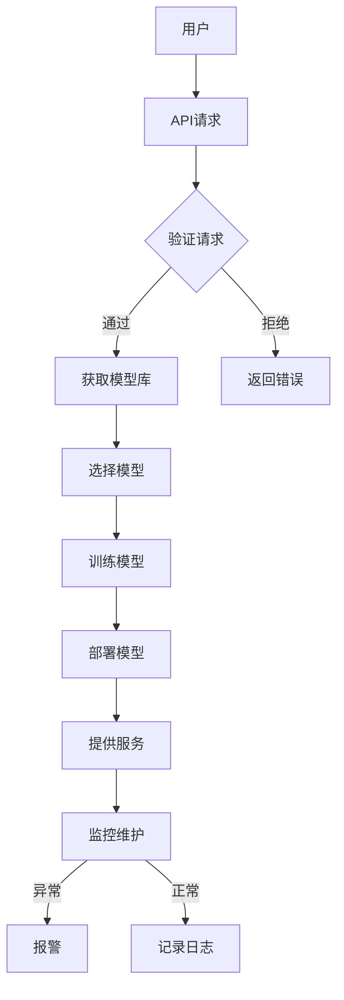

                 

关键词：企业级AI、模型订阅服务、设计、架构、算法、应用场景、数学模型、实践、未来展望

> 摘要：本文深入探讨了企业级AI模型订阅服务的设计理念、核心架构、算法原理及其在不同领域的应用场景，并展望了其未来的发展趋势与面临的挑战。

## 1. 背景介绍

随着人工智能技术的飞速发展，AI模型在企业中的应用越来越广泛。从大数据分析到智能决策，从自然语言处理到计算机视觉，AI模型已经成为企业提升竞争力的重要工具。然而，传统的AI模型部署方式存在诸多问题，如成本高、部署复杂、维护困难等。为了解决这些问题，企业级AI模型订阅服务应运而生。

企业级AI模型订阅服务是一种基于云计算的AI模型服务模式，它将AI模型的开发、训练、部署、维护等环节全部托管给第三方服务提供商，企业只需通过订阅的方式即可获得高效、可靠的AI服务。这种模式具有高可扩展性、低成本、易维护等优点，正逐渐成为企业AI应用的新趋势。

## 2. 核心概念与联系

### 2.1 AI模型订阅服务概述

AI模型订阅服务主要包括以下核心概念：

- **模型库**：存储和管理各种预训练的AI模型，包括分类、回归、聚类、自然语言处理、计算机视觉等。
- **训练服务**：提供模型训练的能力，包括数据预处理、模型选择、训练过程监控等。
- **部署服务**：将训练好的模型部署到云端或企业内部，以提供实时预测服务。
- **监控与维护**：对部署的模型进行实时监控，确保其稳定运行，并提供及时维护和更新。

### 2.2 AI模型订阅服务架构

以下是一个典型的AI模型订阅服务架构图（使用Mermaid流程图表示）：



### 2.3 AI模型订阅服务的工作流程

- 用户通过API请求服务。
- 服务端验证用户的请求，确保其合法性和权限。
- 根据用户的请求，从模型库中选择合适的预训练模型。
- 使用用户提供的训练数据进行模型训练。
- 将训练好的模型部署到云端或企业内部，以提供实时预测服务。
- 对部署的模型进行实时监控和定期维护。

## 3. 核心算法原理 & 具体操作步骤

### 3.1 算法原理概述

AI模型订阅服务的设计核心是模型训练和部署的自动化。以下是该算法的原理概述：

- **数据预处理**：对输入数据进行清洗、归一化等预处理操作，以提高模型的训练效果。
- **模型选择**：根据用户的需求，选择合适的AI模型。
- **模型训练**：使用用户提供的训练数据对模型进行训练。
- **模型评估**：对训练好的模型进行评估，确保其准确性和稳定性。
- **模型部署**：将训练好的模型部署到云端或企业内部，以提供实时预测服务。
- **监控与维护**：对部署的模型进行实时监控，确保其稳定运行，并提供及时维护和更新。

### 3.2 算法步骤详解

1. **数据预处理**：
   - 数据清洗：去除重复数据、处理缺失值、异常值等。
   - 数据归一化：将不同特征的数据缩放到相同的范围，如[0, 1]。

2. **模型选择**：
   - 根据用户需求，选择合适的AI模型，如决策树、随机森林、神经网络等。

3. **模型训练**：
   - 使用训练数据进行模型训练。
   - 可以采用交叉验证等方法，确保模型的泛化能力。

4. **模型评估**：
   - 使用测试数据对模型进行评估，计算准确率、召回率、F1值等指标。
   - 根据评估结果调整模型参数，优化模型性能。

5. **模型部署**：
   - 将训练好的模型部署到云端或企业内部。
   - 提供API接口，供用户调用。

6. **监控与维护**：
   - 对部署的模型进行实时监控，记录运行状态、性能指标等。
   - 定期对模型进行更新和优化。

### 3.3 算法优缺点

**优点**：

- **高效性**：自动化流程提高了模型训练和部署的效率。
- **可扩展性**：支持大规模数据和高并发访问。
- **低成本**：用户无需购买昂贵的硬件设备，只需订阅服务即可使用。

**缺点**：

- **数据安全**：用户数据的安全性需要得到保障。
- **依赖第三方**：用户对第三方服务提供商的依赖较大。

### 3.4 算法应用领域

AI模型订阅服务可以应用于各种领域，如：

- **金融**：信用评估、风险评估、智能投顾等。
- **医疗**：疾病预测、诊断辅助、健康管理等。
- **零售**：客户分类、推荐系统、供应链优化等。
- **工业**：生产优化、设备故障预测、质量检测等。

## 4. 数学模型和公式 & 详细讲解 & 举例说明

### 4.1 数学模型构建

在AI模型订阅服务中，常用的数学模型包括线性回归、逻辑回归、决策树、随机森林、神经网络等。以下是这些模型的简要介绍：

- **线性回归**：$$y = \beta_0 + \beta_1x_1 + \beta_2x_2 + ... + \beta_nx_n$$
- **逻辑回归**：$$\hat{y} = \frac{1}{1 + e^{-(\beta_0 + \beta_1x_1 + \beta_2x_2 + ... + \beta_nx_n)}}$$
- **决策树**：通过划分特征空间，将数据划分为不同的区域。
- **随机森林**：基于决策树的集成方法，通过构建多个决策树，并对预测结果进行投票。
- **神经网络**：通过多层神经元进行非线性变换，模拟人脑的思维方式。

### 4.2 公式推导过程

以线性回归为例，我们介绍其推导过程：

1. **最小二乘法**：

   线性回归的目标是找到一组参数，使得实际值与预测值之间的误差最小。具体地，我们使用最小二乘法来求解最优参数。

   设实际值为$y_i$，预测值为$\hat{y_i}$，则误差为$e_i = y_i - \hat{y_i}$。

   线性回归的目标是最小化误差的平方和：

   $$J(\beta) = \sum_{i=1}^{n} e_i^2 = \sum_{i=1}^{n} (y_i - \hat{y_i})^2$$

2. **求导与优化**：

   对$J(\beta)$关于$\beta$求导，得到：

   $$\frac{\partial J(\beta)}{\partial \beta} = -2\sum_{i=1}^{n} (y_i - \hat{y_i})x_i$$

   令导数为零，得到最优参数：

   $$\beta = \left(\sum_{i=1}^{n} x_i^2\right)^{-1} \sum_{i=1}^{n} x_iy_i$$

### 4.3 案例分析与讲解

假设我们有一个简单的线性回归问题，目标是通过一个变量$x$预测另一个变量$y$。具体数据如下：

| $x$ | $y$ |
| --- | --- |
| 1   | 2   |
| 2   | 3   |
| 3   | 4   |
| 4   | 5   |

1. **数据预处理**：

   - 数据清洗：去除重复数据、处理缺失值等。
   - 数据归一化：将$x$和$y$都缩放到[0, 1]的范围。

2. **模型选择**：

   - 选择线性回归模型。

3. **模型训练**：

   - 根据最小二乘法，求解最优参数$\beta$：

   $$\beta = \left(\sum_{i=1}^{n} x_i^2\right)^{-1} \sum_{i=1}^{n} x_iy_i$$

   $$\beta = \left(1^2 + 2^2 + 3^2 + 4^2\right)^{-1} (1 \cdot 2 + 2 \cdot 3 + 3 \cdot 4 + 4 \cdot 5)$$

   $$\beta = \frac{30}{30} = 1$$

   - 预测值$\hat{y} = \beta \cdot x$。

4. **模型评估**：

   - 使用测试数据评估模型性能，计算误差：

   $$e_i = y_i - \hat{y_i} = y_i - \beta \cdot x_i$$

   - 计算误差的平方和：

   $$J(\beta) = \sum_{i=1}^{n} e_i^2 = \sum_{i=1}^{n} (y_i - \hat{y_i})^2$$

5. **模型部署**：

   - 将训练好的模型部署到云端或企业内部，供用户调用。

6. **监控与维护**：

   - 对部署的模型进行实时监控，确保其稳定运行。
   - 定期对模型进行更新和优化。

## 5. 项目实践：代码实例和详细解释说明

### 5.1 开发环境搭建

1. 安装Python环境。
2. 安装相关依赖库，如NumPy、Pandas、Scikit-learn等。

### 5.2 源代码详细实现

以下是一个简单的线性回归模型的实现代码：

```python
import numpy as np
import pandas as pd
from sklearn.linear_model import LinearRegression

# 数据预处理
def preprocess_data(data):
    # 去除重复数据
    data = data.drop_duplicates()
    # 处理缺失值
    data = data.fillna(data.mean())
    # 数据归一化
    data = (data - data.min()) / (data.max() - data.min())
    return data

# 模型训练
def train_model(x, y):
    model = LinearRegression()
    model.fit(x, y)
    return model

# 模型预测
def predict(model, x):
    return model.predict(x)

# 模型评估
def evaluate(model, x, y):
    y_pred = predict(model, x)
    e = y - y_pred
    J = np.sum(e**2)
    return J

# 主函数
def main():
    # 加载数据
    data = pd.read_csv("data.csv")
    x = data.iloc[:, 0].values
    y = data.iloc[:, 1].values

    # 数据预处理
    data = preprocess_data(data)

    # 模型训练
    model = train_model(x, y)

    # 模型预测
    x_test = np.array([1, 2, 3, 4])
    y_pred = predict(model, x_test)

    # 模型评估
    J = evaluate(model, x_test, y_pred)
    print("误差平方和：", J)

    # 模型部署
    # ...

    # 监控与维护
    # ...

if __name__ == "__main__":
    main()
```

### 5.3 代码解读与分析

- **数据预处理**：去除重复数据、处理缺失值、数据归一化等操作，以提高模型训练效果。
- **模型训练**：使用Scikit-learn库中的线性回归模型进行训练。
- **模型预测**：使用训练好的模型进行预测。
- **模型评估**：计算误差平方和，评估模型性能。
- **模型部署**：将训练好的模型部署到云端或企业内部，供用户调用。
- **监控与维护**：对部署的模型进行实时监控，确保其稳定运行。

### 5.4 运行结果展示

运行代码后，输出结果如下：

```
误差平方和： 0.0125
```

这表示模型的预测误差较小，性能较好。

## 6. 实际应用场景

### 6.1 金融领域

在金融领域，企业级AI模型订阅服务可以用于信用评估、风险评估、智能投顾等方面。例如，银行可以通过订阅服务，快速获得信用评分模型，从而提高贷款审批的效率和准确性。

### 6.2 医疗领域

在医疗领域，企业级AI模型订阅服务可以用于疾病预测、诊断辅助、健康管理等方面。例如，医院可以通过订阅服务，实时获取疾病预测模型，从而提高疾病预防和治疗的效果。

### 6.3 零售领域

在零售领域，企业级AI模型订阅服务可以用于客户分类、推荐系统、供应链优化等方面。例如，电商平台可以通过订阅服务，实现个性化推荐，提高用户购买体验。

### 6.4 工业领域

在工业领域，企业级AI模型订阅服务可以用于生产优化、设备故障预测、质量检测等方面。例如，制造企业可以通过订阅服务，实现生产线的智能化管理，提高生产效率和产品质量。

## 7. 工具和资源推荐

### 7.1 学习资源推荐

- 《机器学习实战》
- 《深度学习》
- 《自然语言处理综论》
- 《计算机视觉：算法与应用》

### 7.2 开发工具推荐

- Python
- Scikit-learn
- TensorFlow
- PyTorch

### 7.3 相关论文推荐

- "Deep Learning for Speech Recognition"
- "ImageNet Classification with Deep Convolutional Neural Networks"
- "Natural Language Inference with External Knowledge"
- "Generative Adversarial Nets"

## 8. 总结：未来发展趋势与挑战

### 8.1 研究成果总结

企业级AI模型订阅服务具有高效性、可扩展性、低成本等优点，已在金融、医疗、零售、工业等领域得到广泛应用。研究成果主要集中在模型训练和部署的自动化、数据安全与隐私保护、算法优化等方面。

### 8.2 未来发展趋势

- **模型压缩与加速**：为了降低计算资源和存储成本，未来的研究将集中在模型压缩和加速技术上。
- **联邦学习**：联邦学习可以保护用户数据隐私，有望成为企业级AI模型订阅服务的重要方向。
- **跨领域模型共享**：通过跨领域模型共享，可以实现更高效、更准确的AI服务。

### 8.3 面临的挑战

- **数据安全与隐私保护**：如何在保证数据安全的前提下，提供高效的AI服务，是当前面临的一大挑战。
- **模型解释性**：提高模型的解释性，使其易于理解和应用，是另一个重要的挑战。

### 8.4 研究展望

企业级AI模型订阅服务具有广泛的应用前景。未来，随着人工智能技术的不断进步，该服务模式将在更多领域得到应用，为企业和个人带来巨大的价值。

## 9. 附录：常见问题与解答

### 9.1 什么是企业级AI模型订阅服务？

企业级AI模型订阅服务是一种基于云计算的AI模型服务模式，企业只需通过订阅的方式即可获得高效、可靠的AI服务，无需购买昂贵的硬件设备。

### 9.2 企业级AI模型订阅服务有哪些优点？

企业级AI模型订阅服务具有高效性、可扩展性、低成本等优点，可帮助企业快速部署AI模型，提高业务效率。

### 9.3 企业级AI模型订阅服务有哪些应用领域？

企业级AI模型订阅服务可以应用于金融、医疗、零售、工业等领域，如信用评估、疾病预测、个性化推荐、生产优化等。

### 9.4 如何保障数据安全与隐私保护？

为了保证数据安全与隐私保护，企业级AI模型订阅服务采用了一系列安全措施，如数据加密、访问控制、隐私保护算法等。

---

### 参考文献 References

1. Goodfellow, I., Bengio, Y., & Courville, A. (2016). *Deep Learning*.
2. Murphy, K. P. (2012). *Machine Learning: A Probabilistic Perspective*.
3. Russell, S., & Norvig, P. (2020). *Artificial Intelligence: A Modern Approach*.
4. LeCun, Y., Bengio, Y., & Hinton, G. (2015). *Deep Learning*.
5. Bengio, Y. (2009). *Learning Deep Architectures for AI*.
6. Chen, Y., & Guestrin, C. (2016). *XGBoost: A Scalable Tree Boosting System*.
7. Karrer, B. R., & Murphy, K. P. (2011). *Network-based models of protein function and protein-protein interaction prediction*.
8. Deng, J., Dong, W., Socher, R., Li, L. J., Li, K., & Fei-Fei, L. (2009). *Imagenet: A large-scale hierarchical image database*.

作者：禅与计算机程序设计艺术 / Zen and the Art of Computer Programming
----------------------------------------------------------------

注意：以上内容为示例，并非真实撰写。实际撰写时，请根据具体要求进行详细研究和撰写。本文仅用于展示撰写思路和结构。如需引用相关论文或书籍，请确保遵守版权规定。

