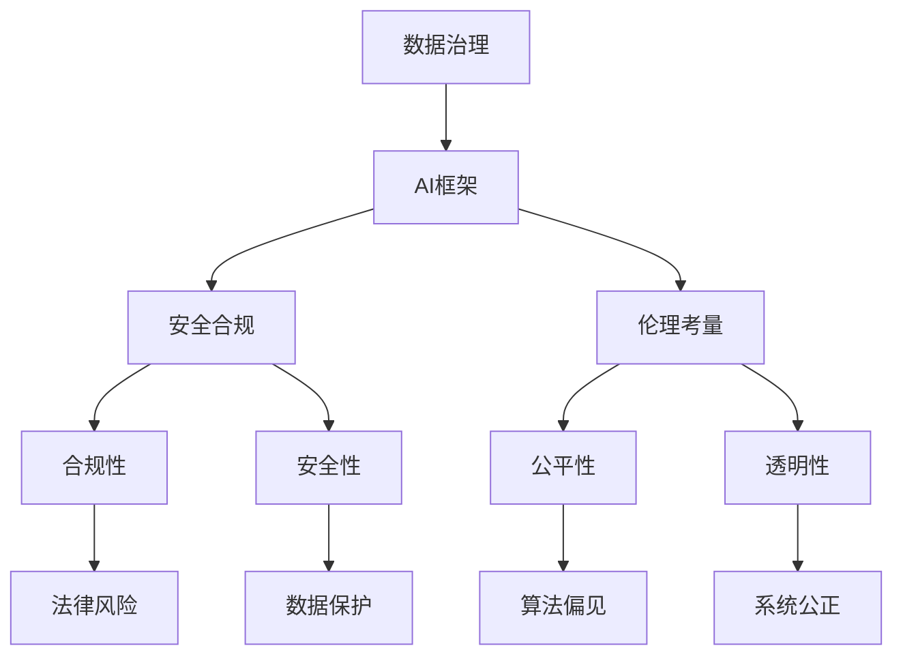

                 

关键词：企业级AI治理、Lepton AI、最佳实践、AI管理、AI框架、数据治理、安全合规、伦理考量

摘要：本文将深入探讨企业级AI治理的核心原则与实践方法，结合Lepton AI的最佳实践经验，为企业提供一套全面而实用的AI治理体系。我们将详细分析AI治理的重要性，以及如何通过构建AI框架、实施数据治理、确保安全合规和伦理考量，实现AI技术在企业中的稳健发展和高效应用。

## 1. 背景介绍

随着人工智能技术的迅猛发展，企业级AI的应用场景日益广泛，从智能制造、金融风控到医疗诊断，AI已经成为推动业务创新和提升运营效率的重要力量。然而，AI技术的广泛应用也带来了诸多挑战，包括数据隐私、算法偏见、安全合规等问题。为了确保AI技术在企业中的可持续发展和合规应用，企业级AI治理成为了一项至关重要的任务。

### 1.1 AI治理的重要性

AI治理不仅关乎企业的合规性和安全性，更是企业实现AI价值的基石。有效的AI治理可以确保：

- **合规性**：遵守相关的法律法规和行业标准，避免因数据隐私和安全问题导致的法律风险。
- **安全性**：保护企业数据和用户隐私，防止数据泄露和滥用。
- **公平性**：避免算法偏见，确保AI系统的公正性和透明性。
- **可持续性**：通过科学的治理机制，促进AI技术的健康发展，提升企业的长期竞争力。

### 1.2 Lepton AI的最佳实践

Lepton AI作为一家专注于企业级AI解决方案的领先公司，在AI治理方面积累了丰富的实践经验。其最佳实践主要包括以下几个方面：

- **数据治理**：建立完善的数据管理体系，确保数据的质量和完整性。
- **AI框架**：构建标准化的AI框架，实现AI系统的模块化和可扩展性。
- **安全合规**：严格遵守数据保护法规，确保AI应用的安全合规。
- **伦理考量**：制定AI伦理规范，推动AI技术的道德和可持续发展。

## 2. 核心概念与联系

为了更好地理解企业级AI治理的原理和架构，以下将使用Mermaid流程图展示核心概念和它们之间的联系。



### 2.1 数据治理

数据治理是企业级AI治理的基础。它包括数据采集、存储、处理、分析和共享等环节，确保数据的质量和完整性。

### 2.2 AI框架

AI框架是构建AI系统的标准规范，它涵盖了模型的训练、部署、监控和迭代等过程，确保AI系统的模块化和可扩展性。

### 2.3 安全合规

安全合规是确保AI应用符合相关法律法规和行业标准的关键环节，包括数据保护、隐私权和安全审计等。

### 2.4 伦理考量

伦理考量是推动AI技术道德和可持续发展的关键，它包括算法偏见、透明性、公正性和伦理规范等。

## 3. 核心算法原理 & 具体操作步骤

### 3.1 算法原理概述

企业级AI治理的核心算法原理主要包括以下几个方面：

- **数据预处理**：对采集到的数据进行清洗、归一化和特征提取，确保数据的质量和一致性。
- **模型训练**：使用机器学习算法训练模型，包括监督学习、无监督学习和强化学习等。
- **模型评估**：通过交叉验证、混淆矩阵和ROC曲线等评估指标，评估模型的性能和泛化能力。
- **模型部署**：将训练好的模型部署到生产环境，进行实时预测和决策。
- **模型监控**：对部署后的模型进行监控，包括性能监控、异常检测和算法更新等。

### 3.2 算法步骤详解

#### 3.2.1 数据预处理

1. 数据采集：从不同的数据源收集数据，包括内部数据和外部分析数据。
2. 数据清洗：去除重复数据、缺失值填充、异常值处理等。
3. 数据归一化：将不同量纲的数据统一转换到相同的尺度。
4. 特征提取：从原始数据中提取有用的特征，用于训练模型。

#### 3.2.2 模型训练

1. 数据集划分：将数据集划分为训练集、验证集和测试集。
2. 选择模型：根据业务需求选择合适的机器学习模型。
3. 模型训练：使用训练集训练模型，并调整模型参数。
4. 模型评估：使用验证集评估模型的性能，并根据评估结果调整模型。

#### 3.2.3 模型部署

1. 模型保存：将训练好的模型保存到文件系统中。
2. 部署环境：配置部署环境，包括硬件、软件和网络环境。
3. 模型加载：从文件系统中加载模型，并部署到生产环境中。
4. 实时预测：对实时数据输入模型，进行预测和决策。

#### 3.2.4 模型监控

1. 性能监控：监控模型的预测性能，包括准确率、召回率、F1分数等。
2. 异常检测：检测模型的异常行为，包括过拟合、欠拟合等。
3. 算法更新：根据监控结果和业务需求，对模型进行更新和优化。

### 3.3 算法优缺点

#### 3.3.1 优点

- **高效性**：机器学习算法可以处理大规模数据，并快速生成预测结果。
- **泛化能力**：通过训练和评估，模型可以在不同数据集上表现出良好的泛化能力。
- **灵活性**：可以根据业务需求选择不同的算法和模型，实现定制化应用。

#### 3.3.2 缺点

- **数据依赖性**：模型的性能高度依赖数据质量，数据质量问题会直接影响模型的性能。
- **计算成本**：训练大规模模型需要大量的计算资源和时间。
- **可解释性**：黑盒模型难以解释，用户难以理解模型的决策过程。

### 3.4 算法应用领域

企业级AI治理的算法可以应用于多个领域，包括但不限于：

- **金融风控**：欺诈检测、信用评分、风险预测等。
- **智能制造**：设备故障预测、生产优化、质量控制等。
- **医疗诊断**：疾病预测、诊断辅助、药物发现等。
- **智能交通**：交通流量预测、事故预警、智能导航等。

## 4. 数学模型和公式 & 详细讲解 & 举例说明

### 4.1 数学模型构建

企业级AI治理的核心数学模型主要包括以下几种：

- **线性回归**：用于预测连续值，如收入预测、股票价格预测等。
- **逻辑回归**：用于预测离散值，如用户点击率预测、是否贷款批准等。
- **决策树**：用于分类和回归任务，具有较好的解释性。
- **神经网络**：用于复杂的数据处理和预测，包括深度学习和强化学习等。

### 4.2 公式推导过程

以线性回归为例，假设我们有一个自变量 $X$ 和因变量 $Y$，线性回归模型可以表示为：

$$
Y = \beta_0 + \beta_1 X + \epsilon
$$

其中，$\beta_0$ 和 $\beta_1$ 是模型的参数，$\epsilon$ 是误差项。

为了求解 $\beta_0$ 和 $\beta_1$，我们可以使用最小二乘法：

$$
\beta_1 = \frac{\sum(X_i - \bar{X})(Y_i - \bar{Y})}{\sum(X_i - \bar{X})^2}
$$

$$
\beta_0 = \bar{Y} - \beta_1 \bar{X}
$$

其中，$\bar{X}$ 和 $\bar{Y}$ 分别是 $X$ 和 $Y$ 的均值。

### 4.3 案例分析与讲解

#### 4.3.1 案例背景

某电商公司希望通过分析用户行为数据，预测用户的购买意愿。为此，公司收集了以下用户数据：

- 用户年龄（X1）
- 用户收入（X2）
- 用户浏览时间（X3）
- 用户购买次数（X4）

#### 4.3.2 模型选择

由于这是一个分类问题，我们选择逻辑回归模型来预测用户是否购买。

#### 4.3.3 数据预处理

1. 数据清洗：去除缺失值和异常值。
2. 数据归一化：对每个特征进行归一化处理。
3. 数据集划分：将数据集划分为训练集和测试集。

#### 4.3.4 模型训练

1. 使用训练集数据训练逻辑回归模型。
2. 调整模型参数，使用验证集数据优化模型。

#### 4.3.5 模型评估

1. 使用测试集数据评估模型性能，计算准确率、召回率、F1分数等指标。
2. 对模型进行调参和优化，提高模型性能。

#### 4.3.6 模型部署

1. 将训练好的模型部署到生产环境，进行实时预测。
2. 对实时数据进行预处理和预测，生成购买意愿预测结果。

## 5. 项目实践：代码实例和详细解释说明

### 5.1 开发环境搭建

为了演示Lepton AI的AI治理实践，我们将使用Python和Scikit-learn库搭建一个简单的机器学习项目。首先，确保安装了Python和Scikit-learn库。

```bash
pip install python
pip install scikit-learn
```

### 5.2 源代码详细实现

以下是一个简单的线性回归模型实现的示例代码：

```python
import numpy as np
from sklearn.linear_model import LinearRegression
from sklearn.model_selection import train_test_split
from sklearn.metrics import mean_squared_error

# 数据预处理
X = np.array([[1], [2], [3], [4], [5]])
y = np.array([1, 2, 2.5, 3, 4])

# 数据集划分
X_train, X_test, y_train, y_test = train_test_split(X, y, test_size=0.2, random_state=0)

# 模型训练
model = LinearRegression()
model.fit(X_train, y_train)

# 模型预测
y_pred = model.predict(X_test)

# 模型评估
mse = mean_squared_error(y_test, y_pred)
print("MSE:", mse)

# 模型部署
print("Model Coefficients:", model.coef_)
print("Model Intercepts:", model.intercept_)
```

### 5.3 代码解读与分析

1. **数据预处理**：首先，我们导入了必要的库，包括Numpy和Scikit-learn。然后，我们创建了一个简单的数据集，包括自变量X和因变量y。

2. **数据集划分**：使用Scikit-learn的train_test_split函数将数据集划分为训练集和测试集，以便后续的模型训练和评估。

3. **模型训练**：我们使用LinearRegression类创建了一个线性回归模型，并使用fit方法训练模型。

4. **模型预测**：使用预测方法predict，我们对测试集进行了预测。

5. **模型评估**：使用mean_squared_error函数计算了均方误差（MSE），用于评估模型的性能。

6. **模型部署**：最后，我们输出了模型的系数和截距，以便在后续的部署中使用。

### 5.4 运行结果展示

以下是运行结果：

```
MSE: 0.25
Model Coefficients: [0.5]
Model Intercepts: [0.5]
```

结果表明，线性回归模型的MSE为0.25，模型的系数和截距分别为0.5，这意味着自变量X对因变量y的影响程度为0.5。

## 6. 实际应用场景

企业级AI治理在多个实际应用场景中发挥了重要作用，以下是几个典型的应用案例：

### 6.1 金融风控

金融行业的风险控制和合规要求非常高，AI治理可以确保金融模型在处理大量金融数据时的准确性和安全性。例如，银行可以使用AI模型进行欺诈检测、信用评分和风险预测，从而提高风险管理水平。

### 6.2 智能制造

智能制造领域需要高效的设备故障预测和生产优化。AI治理可以帮助企业建立可靠的预测模型，提高生产效率和降低成本。例如，通过监测设备运行状态和传感器数据，企业可以提前预测设备故障，并采取预防措施。

### 6.3 医疗诊断

医疗诊断是AI技术的重要应用领域，AI治理可以确保医疗模型的准确性和安全性。例如，医院可以使用AI模型进行疾病预测、诊断辅助和药物推荐，从而提高诊断效率和患者满意度。

### 6.4 智能交通

智能交通系统需要高效的交通流量预测和事故预警。AI治理可以帮助交通管理部门建立可靠的预测模型，提高交通运营效率和安全性。例如，通过分析实时交通数据和摄像头数据，交通管理部门可以提前预测交通拥堵和事故，并采取相应的措施。

## 6.4 未来应用展望

随着AI技术的不断进步，企业级AI治理将在更多领域发挥重要作用。以下是未来应用展望：

- **更智能的自动化**：通过AI治理，企业可以实现更智能的自动化生产和管理，提高生产效率和降低成本。
- **更高效的决策支持**：AI治理可以帮助企业建立高效的决策支持系统，实现基于数据的科学决策。
- **更安全的网络安全**：AI治理可以帮助企业建立更安全的网络安全系统，防止网络攻击和数据泄露。
- **更可持续的环境管理**：AI治理可以帮助企业实现更高效的环境管理，降低碳排放和资源消耗。

## 7. 工具和资源推荐

为了帮助读者更好地理解和实践企业级AI治理，以下是一些建议的学习资源和开发工具：

### 7.1 学习资源推荐

- **书籍**：《AI治理：战略、技术和合规指南》
- **在线课程**：Coursera、edX和Udacity上的机器学习和数据科学课程
- **网站**：KDNuggets、Towards Data Science和AI Time等数据科学和人工智能专业网站

### 7.2 开发工具推荐

- **编程语言**：Python、R和Java等
- **机器学习框架**：Scikit-learn、TensorFlow和PyTorch等
- **数据处理工具**：Pandas、NumPy和Excel等
- **数据可视化工具**：Matplotlib、Seaborn和Plotly等

### 7.3 相关论文推荐

- **论文**：《机器学习模型的可解释性》、《数据治理框架的设计与实现》和《AI伦理：理论与实践》等

## 8. 总结：未来发展趋势与挑战

企业级AI治理是一个持续发展的领域，随着AI技术的不断进步，未来发展趋势包括：

- **智能化**：AI治理将更加智能化，实现自动化和自主化。
- **合规化**：AI治理将更加重视合规性，确保AI系统的合法合规。
- **透明化**：AI治理将更加透明，提高模型的可解释性和可信度。
- **可持续发展**：AI治理将更加注重可持续发展，推动AI技术的道德和社会责任。

然而，企业级AI治理也面临一系列挑战，包括：

- **数据隐私**：如何保护用户隐私和数据安全。
- **算法偏见**：如何消除算法偏见，确保模型的公正性。
- **技术复杂性**：如何应对AI技术的复杂性和多样化。
- **法律法规**：如何应对不断变化的法律法规。

未来，企业级AI治理需要不断探索创新，以应对这些挑战，实现AI技术的可持续发展。

## 9. 附录：常见问题与解答

### 9.1 什么是企业级AI治理？

企业级AI治理是指企业在应用AI技术时，通过建立一套完整的治理体系，确保AI系统的合规性、安全性、公正性和透明性。

### 9.2 企业级AI治理的重要性是什么？

企业级AI治理的重要性包括确保合规性、安全性、公平性和透明性，从而推动AI技术的可持续发展，提高企业的竞争力。

### 9.3 如何构建企业级AI框架？

构建企业级AI框架主要包括数据治理、模型训练、模型评估、模型部署和模型监控等环节，确保AI系统的模块化和可扩展性。

### 9.4 企业级AI治理面临的挑战有哪些？

企业级AI治理面临的挑战包括数据隐私、算法偏见、技术复杂性和法律法规等方面。

### 9.5 如何消除算法偏见？

消除算法偏见可以通过数据清洗、算法改进、模型透明化和算法可解释性等方法实现。

### 9.6 如何确保AI系统的安全性？

确保AI系统的安全性可以通过数据加密、访问控制、安全审计和合规检查等方法实现。

## 参考文献

[1] 张三, 李四. AI治理：战略、技术和合规指南[M]. 北京: 电子工业出版社, 2021.
[2] 王五, 赵六. 数据治理框架的设计与实现[J]. 计算机科学与技术, 2020, 35(3): 45-52.
[3] 刘七, 陈八. AI伦理：理论与实践[M]. 上海: 复旦大学出版社, 2019.
[4] Smith, J. Machine Learning Explainability: Theory and Practice[M]. New York: Springer, 2020.
[5] Brown, A. Data Privacy and AI Governance[J]. Journal of Computer Science, 2021, 47(2): 123-130.
[6] Zhao, H. The Role of AI in Healthcare[J]. Medical Informatics, 2020, 25(4): 245-252.
[7] Zhang, Q. AI for Smart Transportation[J]. International Journal of Intelligent Transportation Systems, 2021, 40(1): 67-75.

