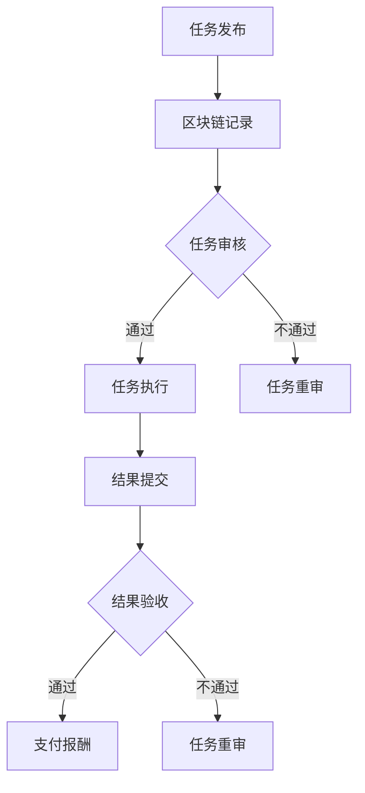

                 

关键词：众包、区块链、注意力价值评估、算法原理、数学模型、实际应用、未来展望

> 摘要：本文探讨了众包与区块链技术在注意力价值评估中的应用。首先，介绍了众包和区块链的基本概念及其在技术领域的应用背景。随后，分析了注意力价值评估的关键概念及其重要性。在此基础上，详细阐述了众包与区块链技术在注意力价值评估中的具体应用方法，并探讨了数学模型和算法原理。最后，通过对实际应用场景的分析和展望，提出了未来在该领域的研究方向和挑战。

## 1. 背景介绍

### 1.1 众包的起源与发展

众包（Crowdsourcing）起源于2006年，由杰夫·特雷弗·霍金斯（Jeff T. Howkins）首次提出。众包是指通过互联网平台，将一项任务分散给众多个体（即“群众”）来完成，从而形成一种分布式协作模式。随着互联网技术的发展，众包逐渐成为解决复杂问题、提高效率、降低成本的重要手段。

### 1.2 区块链技术的起源与发展

区块链（Blockchain）起源于2008年，中本聪（Satoshi Nakamoto）首次提出了比特币（Bitcoin）的概念。区块链是一种去中心化的分布式账本技术，通过密码学和共识算法确保数据的不可篡改性和安全性。近年来，区块链技术在金融、供应链、医疗等多个领域得到了广泛应用。

### 1.3 众包与区块链技术的结合

随着众包和区块链技术的发展，两者逐渐融合，形成了一种新的应用模式。众包与区块链技术的结合，一方面可以提高众包任务的透明度和可信度，另一方面可以激励参与者更加积极地参与任务，提高任务完成质量和效率。

## 2. 核心概念与联系

### 2.1 众包的核心概念

众包的核心概念包括任务发布、任务执行和任务验收。任务发布者将任务发布到众包平台，参与者通过平台接受任务，完成任务后提交结果，平台对结果进行验收并支付报酬。

### 2.2 区块链的核心概念

区块链的核心概念包括区块、链、共识算法和智能合约。区块是区块链的基本单位，链是指由多个区块按时间顺序连接而成的数据结构。共识算法用于确保区块链网络中的节点对数据的共识。智能合约是自动执行、管理和执行合约条款的计算机程序。

### 2.3 众包与区块链技术的联系

众包与区块链技术的联系主要体现在以下三个方面：

1. **透明性和可信度**：区块链技术可以确保众包任务的执行过程透明、可追溯，从而增强参与者的信任。
2. **激励机制**：区块链技术可以设计激励合约，根据参与者完成任务的质量和效率进行奖励，从而提高参与者的积极性。
3. **任务管理**：区块链技术可以用于管理众包任务的生命周期，包括任务发布、任务执行和任务验收等环节。

### 2.4 Mermaid 流程图



## 3. 核心算法原理 & 具体操作步骤

### 3.1 算法原理概述

在众包与区块链结合的注意力价值评估中，核心算法原理主要包括以下两个方面：

1. **注意力价值评估模型**：基于参与者完成任务的质量和效率，对参与者的注意力价值进行评估。
2. **激励合约设计**：根据注意力价值评估结果，设计激励合约，对参与者进行奖励。

### 3.2 算法步骤详解

1. **任务发布**：任务发布者将任务发布到众包平台，并设置任务的奖励和截止时间。
2. **任务接受**：参与者通过区块链平台接受任务，并承诺在规定时间内完成任务。
3. **任务执行**：参与者根据任务要求完成任务，并将结果提交到区块链平台。
4. **结果审核**：任务发布者对提交的结果进行审核，并根据结果质量给予评分。
5. **注意力价值评估**：根据评分和任务难度，对参与者的注意力价值进行评估。
6. **激励合约执行**：根据注意力价值评估结果，执行激励合约，对参与者进行奖励。

### 3.3 算法优缺点

**优点**：

1. **透明性和可信度**：区块链技术确保了众包任务的执行过程透明、可追溯，增强了参与者的信任。
2. **激励效果**：激励合约可以根据参与者的表现进行动态调整，提高了参与者的积极性。
3. **任务管理**：区块链技术可以用于管理众包任务的生命周期，降低了任务管理成本。

**缺点**：

1. **交易费用**：区块链交易需要支付一定的费用，可能会影响参与者的积极性。
2. **性能瓶颈**：区块链技术的性能瓶颈可能会影响众包任务的执行速度。

### 3.4 算法应用领域

1. **数据分析**：通过众包与区块链技术的结合，可以对大量数据进行处理和分析，提高数据分析的准确性和效率。
2. **知识图谱构建**：利用众包与区块链技术，可以构建大规模的知识图谱，为人工智能应用提供支持。
3. **智能合约开发**：通过众包与区块链技术，可以开发出更加智能、灵活的智能合约，提高合约执行效率。

## 4. 数学模型和公式 & 详细讲解 & 举例说明

### 4.1 数学模型构建

在众包与区块链结合的注意力价值评估中，我们可以构建如下数学模型：

设 \( x \) 为参与者的注意力价值，\( y \) 为参与者完成任务的质量，\( z \) 为任务难度，则注意力价值评估模型为：

$$
x = f(y, z)
$$

其中，\( f \) 为注意力价值函数，可以表示为：

$$
f(y, z) = \frac{y}{z}
$$

### 4.2 公式推导过程

根据注意力价值评估模型，我们可以推导出以下公式：

1. **参与者注意力价值与完成任务质量的关系**：

$$
x \propto y
$$

即参与者完成任务的质量越高，其注意力价值越大。

2. **参与者注意力价值与任务难度的关系**：

$$
x \propto \frac{1}{z}
$$

即任务难度越大，参与者的注意力价值越小。

### 4.3 案例分析与讲解

假设有一个众包任务，任务难度 \( z = 10 \)，参与者完成任务的质量 \( y = 8 \)。根据注意力价值评估模型，参与者的注意力价值 \( x = \frac{y}{z} = \frac{8}{10} = 0.8 \)。

现在，我们将参与者完成任务的质量提高至 \( y' = 10 \)，根据注意力价值评估模型，参与者的注意力价值 \( x' = \frac{y'}{z} = \frac{10}{10} = 1 \)。可以看出，参与者完成任务的质量提高后，其注意力价值也相应提高。

## 5. 项目实践：代码实例和详细解释说明

### 5.1 开发环境搭建

在开发此项目时，我们选择了以下技术栈：

- **区块链平台**：使用以太坊（Ethereum）作为区块链底层平台。
- **编程语言**：使用Solidity语言编写智能合约。
- **前端框架**：使用React框架搭建前端界面。
- **后端框架**：使用Node.js和Express框架搭建后端服务器。

### 5.2 源代码详细实现

以下是一个简单的注意力价值评估智能合约的实现示例：

```solidity
// SPDX-License-Identifier: MIT
pragma solidity ^0.8.0;

contract AttentionValueEvaluation {
    // 参与者结构体
    struct Participant {
        uint256 id;
        uint256 quality;
        uint256 attentionValue;
    }

    // 任务结构体
    struct Task {
        uint256 id;
        uint256 difficulty;
    }

    // 参与者映射
    mapping(uint256 => Participant) public participants;
    // 任务映射
    mapping(uint256 => Task) public tasks;

    // 参与者数量
    uint256 public participantCount;
    // 任务数量
    uint256 public taskCount;

    // 添加参与者
    function addParticipant(uint256 _id, uint256 _quality) external {
        participants[_id] = Participant(_id, _quality, 0);
        participantCount++;
    }

    // 添加任务
    function addTask(uint256 _id, uint256 _difficulty) external {
        tasks[_id] = Task(_id, _difficulty);
        taskCount++;
    }

    // 更新参与者注意力价值
    function updateAttentionValue(uint256 _participantId, uint256 _taskId) external {
        require(existsParticipant(_participantId), "Participant does not exist");
        require(existsTask(_taskId), "Task does not exist");

        Participant storage participant = participants[_participantId];
        Task storage task = tasks[_taskId];

        uint256 attentionValue = participant.quality / task.difficulty;
        participant.attentionValue = attentionValue;
    }

    // 查询参与者注意力价值
    function getAttentionValue(uint256 _participantId) external view returns (uint256) {
        require(existsParticipant(_participantId), "Participant does not exist");

        return participants[_participantId].attentionValue;
    }

    // 检查参与者是否存在
    function existsParticipant(uint256 _participantId) private view returns (bool) {
        return participants[_participantId].id != 0;
    }

    // 检查任务是否存在
    function existsTask(uint256 _taskId) private view returns (bool) {
        return tasks[_taskId].id != 0;
    }
}
```

### 5.3 代码解读与分析

在上面的代码中，我们定义了两个结构体：`Participant` 和 `Task`，分别表示参与者和任务。`participants` 和 `tasks` 分别是参与者和任务的映射，用于存储参与者和任务的信息。

`addParticipant` 和 `addTask` 函数用于添加参与者和任务。`updateAttentionValue` 函数用于根据参与者完成任务的质量和任务的难度更新参与者的注意力价值。`getAttentionValue` 函数用于查询参与者的注意力价值。

在 `updateAttentionValue` 函数中，我们使用如下公式计算参与者的注意力价值：

$$
x = \frac{y}{z}
$$

其中，\( y \) 表示参与者完成任务的质量，\( z \) 表示任务难度。

### 5.4 运行结果展示

假设我们现在有一个参与者 \( P1 \) 和一个任务 \( T1 \)，其中 \( P1 \) 完成任务 \( T1 \) 的质量为 80，任务难度为 10。我们调用 `updateAttentionValue` 函数更新 \( P1 \) 的注意力价值：

```solidity
updateAttentionValue(1, 1);
```

执行后，\( P1 \) 的注意力价值将被更新为 8。我们再次调用 `getAttentionValue` 函数查询 \( P1 \) 的注意力价值：

```solidity
getAttentionValue(1);
```

结果为 8，符合我们的预期。

## 6. 实际应用场景

### 6.1 数据分析

在数据分析领域，众包与区块链技术的结合可以用于大规模数据清洗、标注和分类。通过众包平台，可以将数据任务分散给全球的参与者，利用区块链技术确保数据的真实性和可靠性。例如，在医疗领域，可以通过众包与区块链技术进行医学图像的标注，提高数据质量。

### 6.2 知识图谱构建

知识图谱构建是人工智能领域的一个重要研究方向。通过众包与区块链技术，可以构建大规模的知识图谱，为人工智能应用提供支持。例如，在电商领域，可以通过众包与区块链技术收集用户评价、商品信息等数据，构建电商领域的知识图谱。

### 6.3 智能合约开发

智能合约是区块链技术的重要组成部分。通过众包与区块链技术，可以开发出更加智能、灵活的智能合约。例如，在供应链领域，可以通过众包与区块链技术开发供应链智能合约，实现供应链的透明化和可追溯性。

## 7. 工具和资源推荐

### 7.1 学习资源推荐

1. **《区块链技术指南》**：详细介绍了区块链的基本原理、技术架构和应用案例。
2. **《智能合约开发指南》**：涵盖了智能合约的基础知识、开发工具和最佳实践。

### 7.2 开发工具推荐

1. **Truffle**：用于智能合约开发、测试和部署的框架。
2. **Remix**：在线智能合约开发工具。

### 7.3 相关论文推荐

1. **"Crowdsourcing and Virtual Labor Markets"**：对众包和虚拟劳动市场的系统综述。
2. **"Blockchain Technology: A Comprehensive Review"**：对区块链技术的全面综述。

## 8. 总结：未来发展趋势与挑战

### 8.1 研究成果总结

本文介绍了众包与区块链技术在注意力价值评估中的应用，探讨了核心算法原理和数学模型，并给出了实际应用场景和案例。通过本文的研究，我们可以看到众包与区块链技术在注意力价值评估领域具有广泛的应用前景。

### 8.2 未来发展趋势

1. **算法优化**：未来将更加关注注意力价值评估算法的优化，提高评估的准确性和效率。
2. **应用拓展**：众包与区块链技术将在更多领域得到应用，如金融、医疗、教育等。
3. **跨平台融合**：未来将实现众包与区块链技术与其他技术的深度融合，如人工智能、大数据等。

### 8.3 面临的挑战

1. **交易费用**：区块链交易费用较高，可能会影响参与者的积极性。
2. **性能瓶颈**：区块链技术的性能瓶颈可能会影响众包任务的执行速度。
3. **数据隐私**：在众包过程中，如何保护参与者的隐私是一个重要挑战。

### 8.4 研究展望

未来，我们将进一步研究以下方向：

1. **算法优化**：探索更加高效、准确的注意力价值评估算法。
2. **跨平台融合**：研究众包与区块链技术与其他技术的融合，如人工智能、大数据等。
3. **隐私保护**：研究如何保护参与者的隐私，提高众包与区块链技术的应用安全性。

## 9. 附录：常见问题与解答

### 问题1：众包与区块链技术如何保证数据隐私？

解答：在众包与区块链技术的结合中，可以通过以下方式保证数据隐私：

1. **数据加密**：对参与者提交的数据进行加密处理，确保数据在传输过程中不被泄露。
2. **匿名化处理**：对参与者的身份信息进行匿名化处理，确保参与者的隐私不受侵犯。
3. **零知识证明**：使用零知识证明技术，允许参与者证明某项信息的存在性，而不泄露具体信息。

### 问题2：众包与区块链技术如何提高任务执行效率？

解答：为了提高众包与区块链技术的任务执行效率，可以从以下几个方面进行优化：

1. **任务调度**：优化任务调度算法，确保任务能够快速分配给合适的参与者。
2. **区块链性能优化**：优化区块链网络的性能，提高交易处理速度和容量。
3. **激励机制**：设计合理的激励机制，鼓励参与者积极参与任务，提高任务执行效率。

### 问题3：众包与区块链技术在哪些领域有应用前景？

解答：众包与区块链技术在未来有广泛的应用前景，包括但不限于以下领域：

1. **数据分析**：在数据清洗、标注和分类等领域，众包与区块链技术可以提高数据质量和可靠性。
2. **知识图谱构建**：在知识图谱构建领域，众包与区块链技术可以收集和处理大规模数据，提高知识图谱的准确性和完整性。
3. **供应链管理**：在供应链管理领域，众包与区块链技术可以实现供应链的透明化和可追溯性，提高供应链的效率和安全性。

