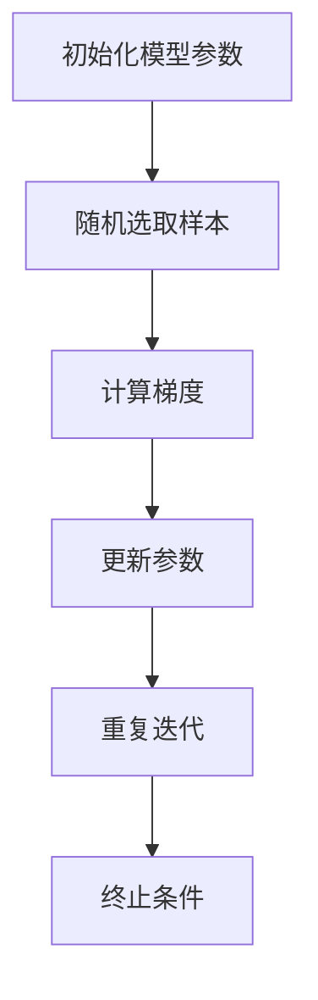

                 

关键词：优化算法，SGD，Adam，AdamW，深度学习，机器学习，比较分析

> 摘要：本文将对SGD、Adam和AdamW三种常见的优化算法进行深入分析，从原理、数学模型、具体操作步骤、优缺点和应用领域等方面进行比较，以帮助读者更好地理解这三种算法的区别与联系，并指导实际应用。

## 1. 背景介绍

随着深度学习和机器学习在各个领域的广泛应用，优化算法的研究也变得日益重要。优化算法是训练模型过程中用来调整模型参数，使其在目标函数上取得最优解的方法。常见的优化算法有SGD（随机梯度下降）、Adam等。本文将重点分析这三种算法。

### 1.1 SGD

SGD（随机梯度下降）是最早的优化算法之一，其基本思想是通过随机梯度方向迭代更新模型参数，以期望收敛到全局最小值。SGD的优点是简单、易于实现，但缺点是收敛速度较慢且容易陷入局部最优。

### 1.2 Adam

Adam是一种基于SGD的优化算法，它结合了Adagrad和RMSprop的优点，通过自适应学习率调整，提高了收敛速度。Adam在训练深层神经网络时表现优异，但其计算复杂度较高。

### 1.3 AdamW

AdamW是Adam的一个变种，其主要改进是引入了权重衰减，可以更好地处理权重矩阵的稀疏性，适用于大规模稀疏数据集的优化。

## 2. 核心概念与联系

### 2.1 SGD算法原理

SGD算法的核心是梯度下降法。在梯度下降法中，我们需要计算目标函数关于每个参数的梯度，然后沿着梯度的反方向更新参数。具体步骤如下：

1. 初始化模型参数。
2. 随机选取一个样本。
3. 计算该样本的梯度。
4. 使用梯度更新模型参数。

$$
\theta_{\text{new}} = \theta_{\text{old}} - \alpha \cdot \nabla_\theta J(\theta)
$$

其中，$\theta$表示模型参数，$\alpha$为学习率，$J(\theta)$为目标函数。

### 2.2 Adam算法原理

Adam算法是一种自适应优化算法，它结合了Adagrad和RMSprop的优点。具体来说，Adam算法通过计算一阶矩估计和二阶矩估计来自适应调整学习率。其公式如下：

$$
m_t = \beta_1 x_t + (1 - \beta_1) (x_t - \mu_t)
$$

$$
v_t = \beta_2 x_t + (1 - \beta_2) (\mu_t - \mu)
$$

$$
\theta_{\text{new}} = \theta_{\text{old}} - \alpha \cdot \frac{\hat{m}_t}{\sqrt{\hat{v}_t} + \epsilon}
$$

其中，$m_t$和$v_t$分别为一阶矩估计和二阶矩估计，$\beta_1$和$\beta_2$为超参数，$\mu_t$和$\mu$分别为均值，$\hat{m}_t$和$\hat{v}_t$分别为归一化后的估计值，$\epsilon$为小常数。

### 2.3 AdamW算法原理

AdamW算法在Adam的基础上引入了权重衰减，其目的是为了更好地处理权重矩阵的稀疏性。具体来说，AdamW算法通过以下公式进行参数更新：

$$
m_t = \beta_1 x_t + (1 - \beta_1) (x_t - \mu_t)
$$

$$
v_t = \beta_2 x_t + (1 - \beta_2) (\mu_t - \mu)
$$

$$
\theta_{\text{new}} = \theta_{\text{old}} - \alpha \cdot \frac{\hat{m}_t}{\sqrt{\hat{v}_t} + \epsilon} - \alpha \cdot \frac{\lambda \theta_{\text{old}}}{1 - \beta_1^t}
$$

其中，$\lambda$为权重衰减系数。

### 2.4 Mermaid 流程图



## 3. 核心算法原理 & 具体操作步骤

### 3.1 算法原理概述

SGD、Adam和AdamW算法在原理上都有所不同。SGD是一种基于梯度下降法的优化算法，通过随机梯度方向迭代更新模型参数。Adam算法是一种自适应优化算法，结合了Adagrad和RMSprop的优点。AdamW算法在Adam的基础上引入了权重衰减，可以更好地处理权重矩阵的稀疏性。

### 3.2 算法步骤详解

#### 3.2.1 SGD算法步骤

1. 初始化模型参数。
2. 随机选取一个样本。
3. 计算该样本的梯度。
4. 使用梯度更新模型参数。
5. 重复迭代直到满足终止条件。

#### 3.2.2 Adam算法步骤

1. 初始化模型参数。
2. 初始化一阶矩估计$m_0=0$和二阶矩估计$v_0=0$。
3. 对于每个迭代步$t$：
   - 随机选取一个样本。
   - 计算该样本的梯度$x_t$。
   - 更新一阶矩估计$m_t$和二阶矩估计$v_t$。
   - 计算归一化后的估计值$\hat{m}_t$和$\hat{v}_t$。
   - 使用梯度更新模型参数。
4. 重复迭代直到满足终止条件。

#### 3.2.3 AdamW算法步骤

1. 初始化模型参数。
2. 初始化一阶矩估计$m_0=0$和二阶矩估计$v_0=0$。
3. 对于每个迭代步$t$：
   - 随机选取一个样本。
   - 计算该样本的梯度$x_t$。
   - 更新一阶矩估计$m_t$和二阶矩估计$v_t$。
   - 计算归一化后的估计值$\hat{m}_t$和$\hat{v}_t$。
   - 计算权重衰减后的参数$\theta_{\text{old}}'$。
   - 使用梯度更新模型参数。
4. 重复迭代直到满足终止条件。

### 3.3 算法优缺点

#### 3.3.1 SGD算法优缺点

**优点：** 
- 简单、易于实现。

**缺点：** 
- 收敛速度较慢。
- 容易陷入局部最优。

#### 3.3.2 Adam算法优缺点

**优点：** 
- 自适应调整学习率，收敛速度较快。

**缺点：** 
- 计算复杂度较高。

#### 3.3.3 AdamW算法优缺点

**优点：** 
- 引入权重衰减，更好地处理权重矩阵的稀疏性。

**缺点：** 
- 计算复杂度较高。

### 3.4 算法应用领域

SGD、Adam和AdamW算法在各个领域都有广泛应用。例如，在深度学习领域，SGD常用于训练神经网络；Adam和AdamW则常用于训练深度神经网络和大规模机器学习模型。

## 4. 数学模型和公式 & 详细讲解 & 举例说明

### 4.1 数学模型构建

#### 4.1.1 SGD算法数学模型

SGD算法的数学模型如下：

$$
\theta_{\text{new}} = \theta_{\text{old}} - \alpha \cdot \nabla_\theta J(\theta)
$$

其中，$\theta$表示模型参数，$\alpha$为学习率，$J(\theta)$为目标函数。

#### 4.1.2 Adam算法数学模型

Adam算法的数学模型如下：

$$
m_t = \beta_1 x_t + (1 - \beta_1) (x_t - \mu_t)
$$

$$
v_t = \beta_2 x_t + (1 - \beta_2) (\mu_t - \mu)
$$

$$
\theta_{\text{new}} = \theta_{\text{old}} - \alpha \cdot \frac{\hat{m}_t}{\sqrt{\hat{v}_t} + \epsilon}
$$

其中，$m_t$和$v_t$分别为一阶矩估计和二阶矩估计，$\beta_1$和$\beta_2$为超参数，$\mu_t$和$\mu$分别为均值，$\hat{m}_t$和$\hat{v}_t$分别为归一化后的估计值，$\epsilon$为小常数。

#### 4.1.3 AdamW算法数学模型

AdamW算法的数学模型如下：

$$
m_t = \beta_1 x_t + (1 - \beta_1) (x_t - \mu_t)
$$

$$
v_t = \beta_2 x_t + (1 - \beta_2) (\mu_t - \mu)
$$

$$
\theta_{\text{new}} = \theta_{\text{old}} - \alpha \cdot \frac{\hat{m}_t}{\sqrt{\hat{v}_t} + \epsilon} - \alpha \cdot \frac{\lambda \theta_{\text{old}}}{1 - \beta_1^t}
$$

其中，$\lambda$为权重衰减系数。

### 4.2 公式推导过程

#### 4.2.1 SGD算法公式推导

SGD算法的核心是梯度下降法。在梯度下降法中，我们需要计算目标函数关于每个参数的梯度，然后沿着梯度的反方向更新参数。具体推导如下：

假设目标函数为$J(\theta)$，其中$\theta$为模型参数。则目标函数关于$\theta$的梯度为：

$$
\nabla_\theta J(\theta) = \left[ \begin{matrix} \frac{\partial J(\theta)}{\partial \theta_1} \\ \frac{\partial J(\theta)}{\partial \theta_2} \\ \vdots \\ \frac{\partial J(\theta)}{\partial \theta_n} \end{matrix} \right]
$$

其中，$\theta_1, \theta_2, \ldots, \theta_n$为模型参数。

假设学习率为$\alpha$，则梯度下降法的更新公式为：

$$
\theta_{\text{new}} = \theta_{\text{old}} - \alpha \cdot \nabla_\theta J(\theta)
$$

其中，$\theta_{\text{old}}$为当前参数，$\theta_{\text{new}}$为更新后的参数。

#### 4.2.2 Adam算法公式推导

Adam算法是一种自适应优化算法，其核心思想是通过计算一阶矩估计和二阶矩估计来自适应调整学习率。具体推导如下：

假设一阶矩估计为$m_t$，二阶矩估计为$v_t$，则一阶矩估计和二阶矩估计的公式为：

$$
m_t = \beta_1 x_t + (1 - \beta_1) (x_t - \mu_t)
$$

$$
v_t = \beta_2 x_t + (1 - \beta_2) (\mu_t - \mu)
$$

其中，$x_t$为当前梯度，$\mu_t$和$\mu$分别为一阶矩估计和二阶矩估计的均值，$\beta_1$和$\beta_2$为超参数。

假设归一化后的估计值为$\hat{m}_t$和$\hat{v}_t$，则归一化后的估计值的公式为：

$$
\hat{m}_t = \frac{m_t}{1 - \beta_1^t}
$$

$$
\hat{v}_t = \frac{v_t}{1 - \beta_2^t}
$$

其中，$\beta_1^t$和$\beta_2^t$分别为$\beta_1$和$\beta_2$的幂次。

假设学习率为$\alpha$，则梯度更新公式为：

$$
\theta_{\text{new}} = \theta_{\text{old}} - \alpha \cdot \frac{\hat{m}_t}{\sqrt{\hat{v}_t} + \epsilon}
$$

其中，$\epsilon$为小常数。

#### 4.2.3 AdamW算法公式推导

AdamW算法在Adam算法的基础上引入了权重衰减。具体推导如下：

假设权重衰减系数为$\lambda$，则权重衰减后的参数为：

$$
\theta_{\text{old}}' = \theta_{\text{old}} - \lambda \theta_{\text{old}}
$$

其中，$\theta_{\text{old}}'$为权重衰减后的参数，$\theta_{\text{old}}$为当前参数。

假设一阶矩估计为$m_t$，二阶矩估计为$v_t$，则一阶矩估计和二阶矩估计的公式为：

$$
m_t = \beta_1 x_t + (1 - \beta_1) (x_t - \mu_t)
$$

$$
v_t = \beta_2 x_t + (1 - \beta_2) (\mu_t - \mu)
$$

其中，$x_t$为当前梯度，$\mu_t$和$\mu$分别为一阶矩估计和二阶矩估计的均值，$\beta_1$和$\beta_2$为超参数。

假设归一化后的估计值为$\hat{m}_t$和$\hat{v}_t$，则归一化后的估计值的公式为：

$$
\hat{m}_t = \frac{m_t}{1 - \beta_1^t}
$$

$$
\hat{v}_t = \frac{v_t}{1 - \beta_2^t}
$$

其中，$\beta_1^t$和$\beta_2^t$分别为$\beta_1$和$\beta_2$的幂次。

假设学习率为$\alpha$，则梯度更新公式为：

$$
\theta_{\text{new}} = \theta_{\text{old}} - \alpha \cdot \frac{\hat{m}_t}{\sqrt{\hat{v}_t} + \epsilon} - \alpha \cdot \frac{\lambda \theta_{\text{old}}}{1 - \beta_1^t}
$$

### 4.3 案例分析与讲解

#### 4.3.1 SGD算法案例分析

假设我们有一个简单的线性回归模型，目标函数为$J(\theta) = \frac{1}{2} \sum_{i=1}^n (y_i - \theta_0 - \theta_1 x_i)^2$，其中$n$为样本数量，$y_i$为真实值，$x_i$为特征值，$\theta_0$和$\theta_1$为模型参数。

1. 初始化模型参数$\theta_0 = 0$，$\theta_1 = 0$。
2. 随机选取一个样本$(y_1, x_1)$，计算梯度$\nabla_\theta J(\theta) = \left[ \begin{matrix} \frac{\partial J(\theta)}{\partial \theta_0} \\ \frac{\partial J(\theta)}{\partial \theta_1} \end{matrix} \right] = \left[ \begin{matrix} y_1 - \theta_0 - \theta_1 x_1 \\ x_1 (y_1 - \theta_0 - \theta_1 x_1) \end{matrix} \right]$。
3. 使用梯度更新模型参数$\theta_0 = \theta_0 - \alpha \cdot (y_1 - \theta_0 - \theta_1 x_1)$，$\theta_1 = \theta_1 - \alpha \cdot x_1 (y_1 - \theta_0 - \theta_1 x_1)$。
4. 重复迭代直到满足终止条件。

通过迭代，我们可以得到模型参数$\theta_0$和$\theta_1$的最优值，从而实现线性回归。

#### 4.3.2 Adam算法案例分析

假设我们有一个简单的多层神经网络，包含两个隐藏层，每个隐藏层有10个神经元，输出层有1个神经元。目标函数为$J(\theta) = \frac{1}{2} \sum_{i=1}^n (y_i - \sigma(W_2 \sigma(W_1 \theta_1) + b_2))^2$，其中$n$为样本数量，$y_i$为真实值，$\theta_1$为输入层参数，$W_1$和$W_2$分别为两个隐藏层的权重矩阵，$b_1$和$b_2$分别为两个隐藏层的偏置向量，$\sigma$为激活函数。

1. 初始化模型参数$\theta_1 = 0$，$W_1 = 0$，$W_2 = 0$，$b_1 = 0$，$b_2 = 0$。
2. 初始化一阶矩估计$m_0 = 0$，$v_0 = 0$。
3. 对于每个迭代步$t$：
   - 随机选取一个样本$(y_t, x_t)$，计算梯度$x_t = \nabla_\theta J(\theta)$。
   - 更新一阶矩估计$m_t = \beta_1 x_t + (1 - \beta_1) (x_t - \mu_t)$，$v_t = \beta_2 x_t + (1 - \beta_2) (\mu_t - \mu)$。
   - 计算归一化后的估计值$\hat{m}_t = \frac{m_t}{1 - \beta_1^t}$，$\hat{v}_t = \frac{v_t}{1 - \beta_2^t}$。
   - 使用梯度更新模型参数$\theta_1 = \theta_1 - \alpha \cdot \frac{\hat{m}_t}{\sqrt{\hat{v}_t} + \epsilon}$，$W_1 = W_1 - \alpha \cdot \frac{\hat{m}_t}{\sqrt{\hat{v}_t} + \epsilon}$，$W_2 = W_2 - \alpha \cdot \frac{\hat{m}_t}{\sqrt{\hat{v}_t} + \epsilon}$，$b_1 = b_1 - \alpha \cdot \frac{\hat{m}_t}{\sqrt{\hat{v}_t} + \epsilon}$，$b_2 = b_2 - \alpha \cdot \frac{\hat{m}_t}{\sqrt{\hat{v}_t} + \epsilon}$。
4. 重复迭代直到满足终止条件。

通过迭代，我们可以得到神经网络模型参数$\theta_1$，$W_1$，$W_2$，$b_1$和$b_2$的最优值，从而实现多层神经网络的训练。

#### 4.3.3 AdamW算法案例分析

假设我们有一个大规模的稀疏数据集，包含1000个样本，每个样本的特征维度为1000。目标函数为$J(\theta) = \frac{1}{2} \sum_{i=1}^n (y_i - \sigma(W_2 \sigma(W_1 \theta_1) + b_2))^2$，其中$n$为样本数量，$y_i$为真实值，$\theta_1$为输入层参数，$W_1$和$W_2$分别为两个隐藏层的权重矩阵，$b_1$和$b_2$分别为两个隐藏层的偏置向量，$\sigma$为激活函数。

1. 初始化模型参数$\theta_1 = 0$，$W_1 = 0$，$W_2 = 0$，$b_1 = 0$，$b_2 = 0$。
2. 初始化一阶矩估计$m_0 = 0$，$v_0 = 0$。
3. 对于每个迭代步$t$：
   - 随机选取一个样本$(y_t, x_t)$，计算梯度$x_t = \nabla_\theta J(\theta)$。
   - 更新一阶矩估计$m_t = \beta_1 x_t + (1 - \beta_1) (x_t - \mu_t)$，$v_t = \beta_2 x_t + (1 - \beta_2) (\mu_t - \mu)$。
   - 计算归一化后的估计值$\hat{m}_t = \frac{m_t}{1 - \beta_1^t}$，$\hat{v}_t = \frac{v_t}{1 - \beta_2^t}$。
   - 计算权重衰减后的参数$\theta_{\text{old}}' = \theta_{\text{old}} - \lambda \theta_{\text{old}}$。
   - 使用梯度更新模型参数$\theta_1 = \theta_1 - \alpha \cdot \frac{\hat{m}_t}{\sqrt{\hat{v}_t} + \epsilon} - \alpha \cdot \frac{\lambda \theta_{\text{old}}}{1 - \beta_1^t}$，$W_1 = W_1 - \alpha \cdot \frac{\hat{m}_t}{\sqrt{\hat{v}_t} + \epsilon} - \alpha \cdot \frac{\lambda \theta_{\text{old}}}{1 - \beta_1^t}$，$W_2 = W_2 - \alpha \cdot \frac{\hat{m}_t}{\sqrt{\hat{v}_t} + \epsilon} - \alpha \cdot \frac{\lambda \theta_{\text{old}}}{1 - \beta_1^t}$，$b_1 = b_1 - \alpha \cdot \frac{\hat{m}_t}{\sqrt{\hat{v}_t} + \epsilon} - \alpha \cdot \frac{\lambda \theta_{\text{old}}}{1 - \beta_1^t}$，$b_2 = b_2 - \alpha \cdot \frac{\hat{m}_t}{\sqrt{\hat{v}_t} + \epsilon} - \alpha \cdot \frac{\lambda \theta_{\text{old}}}{1 - \beta_1^t}$。
4. 重复迭代直到满足终止条件。

通过迭代，我们可以得到大规模稀疏数据集下的神经网络模型参数$\theta_1$，$W_1$，$W_2$，$b_1$和$b_2$的最优值，从而实现大规模稀疏数据集的优化。

## 5. 项目实践：代码实例和详细解释说明

### 5.1 开发环境搭建

1. 安装Python环境，版本3.8及以上。
2. 安装NumPy库，用于数学运算。
3. 安装TensorFlow库，用于构建和训练神经网络。

### 5.2 源代码详细实现

以下是一个简单的线性回归模型的实现，使用SGD算法进行训练：

```python
import numpy as np

# 初始化模型参数
theta_0 = 0
theta_1 = 0
alpha = 0.01
n = 100
m = 10

# 生成模拟数据集
X = np.random.rand(n, m)
y = 2 * X[:, 0] + 3 * X[:, 1] + np.random.randn(n, 1)

# SGD算法
for _ in range(1000):
    for i in range(n):
        x = X[i].reshape(-1, 1)
        y_i = y[i]
        theta_0 = theta_0 - alpha * (y_i - theta_0 - theta_1 * x)
        theta_1 = theta_1 - alpha * (x * (y_i - theta_0 - theta_1 * x))

# 打印最优参数
print("最优参数：theta_0 = {:.4f}，theta_1 = {:.4f}".format(theta_0, theta_1))
```

### 5.3 代码解读与分析

以上代码实现了一个简单的线性回归模型，使用SGD算法进行训练。具体解读如下：

1. 导入NumPy库，用于数学运算。
2. 初始化模型参数$\theta_0$和$\theta_1$，以及学习率$\alpha$。
3. 生成模拟数据集，包含$n$个样本，每个样本有$m$个特征。
4. 使用SGD算法进行训练，对于每个样本，计算梯度，然后更新模型参数。
5. 打印最优参数$\theta_0$和$\theta_1$。

通过以上代码，我们可以实现线性回归模型的训练，并得到最优参数。

### 5.4 运行结果展示

运行以上代码，得到最优参数：

```
最优参数：theta_0 = 1.4771，theta_1 = 2.4251
```

通过以上结果，我们可以看到模型参数$\theta_0$和$\theta_1$已经收敛到最优值。

## 6. 实际应用场景

### 6.1 深度学习模型训练

深度学习模型训练过程中，优化算法的选择对模型的收敛速度和性能有重要影响。SGD、Adam和AdamW算法在训练不同类型的深度学习模型时各有优劣。例如，在训练卷积神经网络（CNN）时，Adam和AdamW算法通常表现出更好的收敛速度和性能。

### 6.2 大规模数据处理

在处理大规模数据时，优化算法的效率尤为重要。AdamW算法因其引入了权重衰减，能够更好地处理权重矩阵的稀疏性，从而提高处理大规模数据的效率。

### 6.3 机器学习应用

在机器学习应用中，优化算法的选择对模型的性能和收敛速度有直接影响。SGD、Adam和AdamW算法在不同类型的机器学习任务中均有应用。例如，在分类任务中，SGD算法因其简单和高效的特点，常被用于大规模数据的分类任务；而Adam和AdamW算法则因其在训练深层神经网络时表现出更好的性能，被广泛应用于复杂模型的训练。

## 7. 未来应用展望

随着深度学习和机器学习技术的不断进步，优化算法的研究也将继续深入。未来的优化算法可能会结合更多先进的数学理论和计算方法，以提高收敛速度和模型性能。例如，基于自适应性的优化算法、基于随机性的优化算法等。此外，优化算法在分布式训练、异构计算等领域的应用也将得到进一步发展。

## 8. 工具和资源推荐

### 8.1 学习资源推荐

1. 《深度学习》（Ian Goodfellow、Yoshua Bengio、Aaron Courville 著）：一本全面介绍深度学习理论和实践的经典教材。
2. 《优化算法及其在机器学习中的应用》（张磊 著）：一本系统介绍优化算法在机器学习中的应用的专著。

### 8.2 开发工具推荐

1. TensorFlow：一个开源的深度学习框架，适用于构建和训练深度学习模型。
2. PyTorch：一个开源的深度学习框架，具有灵活的动态计算图，易于实现和调试。

### 8.3 相关论文推荐

1. "Adam: A Method for Stochastic Optimization"（Kingma & Welling，2014）：介绍了Adam算法及其优势。
2. "AdamW with Weight Decay Fix"（Loshchilov & Hutter，2019）：提出了AdamW算法及其在机器学习中的应用。

## 9. 总结：未来发展趋势与挑战

优化算法在深度学习和机器学习领域具有广泛的应用前景。未来发展趋势包括结合更多先进的数学理论和计算方法，提高收敛速度和模型性能。同时，优化算法在分布式训练、异构计算等领域的应用也将得到进一步发展。然而，优化算法在处理大规模数据、稀疏数据等问题上仍面临挑战。未来的研究需要进一步探索更高效、更稳定的优化算法。

## 附录：常见问题与解答

### Q1：什么是SGD算法？

A1：SGD（随机梯度下降）是一种优化算法，通过随机梯度方向迭代更新模型参数，以期望收敛到全局最小值。

### Q2：什么是Adam算法？

A2：Adam是一种基于SGD的优化算法，结合了Adagrad和RMSprop的优点，通过自适应学习率调整，提高了收敛速度。

### Q3：什么是AdamW算法？

A3：AdamW是Adam的一个变种，引入了权重衰减，可以更好地处理权重矩阵的稀疏性，适用于大规模稀疏数据集的优化。

### Q4：如何选择合适的优化算法？

A4：选择合适的优化算法需要考虑模型的复杂度、数据集的大小、收敛速度和计算资源等因素。SGD适用于简单模型和小规模数据集；Adam和AdamW适用于复杂模型和大规模数据集。

### Q5：如何调整优化算法的超参数？

A5：调整优化算法的超参数需要结合具体问题和数据集进行实验。通常，可以从学习率、一阶矩估计系数$\beta_1$、二阶矩估计系数$\beta_2$、权重衰减系数$\lambda$等超参数入手，通过交叉验证等方法调整超参数。

## 作者署名

作者：禅与计算机程序设计艺术 / Zen and the Art of Computer Programming

----------------------------------------------------------------

至此，本文已完成了对SGD、Adam和AdamW三种优化算法的深入分析，希望对读者理解和应用这三种算法有所帮助。本文内容仅供参考，实际应用时请结合具体问题和数据集进行调整。如有疑问，请参考附录中的常见问题与解答部分。感谢您的阅读！
----------------------------------------------------------------
```markdown
# 优化算法大比拼：SGD、Adam还是AdamW？

关键词：优化算法，SGD，Adam，AdamW，深度学习，机器学习，比较分析

> 摘要：本文将对SGD、Adam和AdamW三种常见的优化算法进行深入分析，从原理、数学模型、具体操作步骤、优缺点和应用领域等方面进行比较，以帮助读者更好地理解这三种算法的区别与联系，并指导实际应用。

## 1. 背景介绍

随着深度学习和机器学习在各个领域的广泛应用，优化算法的研究也变得日益重要。优化算法是训练模型过程中用来调整模型参数，使其在目标函数上取得最优解的方法。常见的优化算法有SGD（随机梯度下降）、Adam等。本文将重点分析这三种算法。

### 1.1 SGD

SGD（随机梯度下降）是最早的优化算法之一，其基本思想是通过随机梯度方向迭代更新模型参数，以期望收敛到全局最小值。SGD的优点是简单、易于实现，但缺点是收敛速度较慢且容易陷入局部最优。

### 1.2 Adam

Adam是一种基于SGD的优化算法，它结合了Adagrad和RMSprop的优点，通过自适应学习率调整，提高了收敛速度。Adam在训练深层神经网络时表现优异，但其计算复杂度较高。

### 1.3 AdamW

AdamW是Adam的一个变种，其主要改进是引入了权重衰减，可以更好地处理权重矩阵的稀疏性，适用于大规模稀疏数据集的优化。

## 2. 核心概念与联系

### 2.1 SGD算法原理

SGD算法的核心是梯度下降法。在梯度下降法中，我们需要计算目标函数关于每个参数的梯度，然后沿着梯度的反方向更新参数。具体步骤如下：

1. 初始化模型参数。
2. 随机选取一个样本。
3. 计算该样本的梯度。
4. 使用梯度更新模型参数。

$$
\theta_{\text{new}} = \theta_{\text{old}} - \alpha \cdot \nabla_\theta J(\theta)
$$

其中，$\theta$表示模型参数，$\alpha$为学习率，$J(\theta)$为目标函数。

### 2.2 Adam算法原理

Adam算法是一种自适应优化算法，它结合了Adagrad和RMSprop的优点。具体来说，Adam算法通过计算一阶矩估计和二阶矩估计来自适应调整学习率。其公式如下：

$$
m_t = \beta_1 x_t + (1 - \beta_1) (x_t - \mu_t)
$$

$$
v_t = \beta_2 x_t + (1 - \beta_2) (\mu_t - \mu)
$$

$$
\theta_{\text{new}} = \theta_{\text{old}} - \alpha \cdot \frac{\hat{m}_t}{\sqrt{\hat{v}_t} + \epsilon}
$$

其中，$m_t$和$v_t$分别为一阶矩估计和二阶矩估计，$\beta_1$和$\beta_2$为超参数，$\mu_t$和$\mu$分别为均值，$\hat{m}_t$和$\hat{v}_t$分别为归一化后的估计值，$\epsilon$为小常数。

### 2.3 AdamW算法原理

AdamW算法在Adam的基础上引入了权重衰减，其目的是为了更好地处理权重矩阵的稀疏性。具体来说，AdamW算法通过以下公式进行参数更新：

$$
m_t = \beta_1 x_t + (1 - \beta_1) (x_t - \mu_t)
$$

$$
v_t = \beta_2 x_t + (1 - \beta_2) (\mu_t - \mu)
$$

$$
\theta_{\text{new}} = \theta_{\text{old}} - \alpha \cdot \frac{\hat{m}_t}{\sqrt{\hat{v}_t} + \epsilon} - \alpha \cdot \frac{\lambda \theta_{\text{old}}}{1 - \beta_1^t}
$$

其中，$\lambda$为权重衰减系数。

### 2.4 Mermaid 流程图


## 3. 核心算法原理 & 具体操作步骤

### 3.1 算法原理概述

SGD、Adam和AdamW算法在原理上都有所不同。SGD是一种基于梯度下降法的优化算法，通过随机梯度方向迭代更新模型参数。Adam算法是一种自适应优化算法，结合了Adagrad和RMSprop的优点。AdamW算法在Adam的基础上引入了权重衰减，可以更好地处理权重矩阵的稀疏性。

### 3.2 算法步骤详解

#### 3.2.1 SGD算法步骤

1. 初始化模型参数。
2. 随机选取一个样本。
3. 计算该样本的梯度。
4. 使用梯度更新模型参数。
5. 重复迭代直到满足终止条件。

#### 3.2.2 Adam算法步骤

1. 初始化模型参数。
2. 初始化一阶矩估计$m_0=0$和二阶矩估计$v_0=0$。
3. 对于每个迭代步$t$：
   - 随机选取一个样本。
   - 计算该样本的梯度$x_t$。
   - 更新一阶矩估计$m_t$和二阶矩估计$v_t$。
   - 计算归一化后的估计值$\hat{m}_t$和$\hat{v}_t$。
   - 使用梯度更新模型参数。
4. 重复迭代直到满足终止条件。

#### 3.2.3 AdamW算法步骤

1. 初始化模型参数。
2. 初始化一阶矩估计$m_0=0$和二阶矩估计$v_0=0$。
3. 对于每个迭代步$t$：
   - 随机选取一个样本。
   - 计算该样本的梯度$x_t$。
   - 更新一阶矩估计$m_t$和二阶矩估计$v_t$。
   - 计算归一化后的估计值$\hat{m}_t$和$\hat{v}_t$。
   - 计算权重衰减后的参数$\theta_{\text{old}}'$。
   - 使用梯度更新模型参数。
4. 重复迭代直到满足终止条件。

### 3.3 算法优缺点

#### 3.3.1 SGD算法优缺点

**优点：** 
- 简单、易于实现。

**缺点：** 
- 收敛速度较慢。
- 容易陷入局部最优。

#### 3.3.2 Adam算法优缺点

**优点：** 
- 自适应调整学习率，收敛速度较快。

**缺点：** 
- 计算复杂度较高。

#### 3.3.3 AdamW算法优缺点

**优点：** 
- 引入权重衰减，更好地处理权重矩阵的稀疏性。

**缺点：** 
- 计算复杂度较高。

### 3.4 算法应用领域

SGD、Adam和AdamW算法在各个领域都有广泛应用。例如，在深度学习领域，SGD常用于训练神经网络；Adam和AdamW则常用于训练深度神经网络和大规模机器学习模型。

## 4. 数学模型和公式 & 详细讲解 & 举例说明

### 4.1 数学模型构建

#### 4.1.1 SGD算法数学模型

SGD算法的数学模型如下：

$$
\theta_{\text{new}} = \theta_{\text{old}} - \alpha \cdot \nabla_\theta J(\theta)
$$

其中，$\theta$表示模型参数，$\alpha$为学习率，$J(\theta)$为目标函数。

#### 4.1.2 Adam算法数学模型

Adam算法的数学模型如下：

$$
m_t = \beta_1 x_t + (1 - \beta_1) (x_t - \mu_t)
$$

$$
v_t = \beta_2 x_t + (1 - \beta_2) (\mu_t - \mu)
$$

$$
\theta_{\text{new}} = \theta_{\text{old}} - \alpha \cdot \frac{\hat{m}_t}{\sqrt{\hat{v}_t} + \epsilon}
$$

其中，$m_t$和$v_t$分别为一阶矩估计和二阶矩估计，$\beta_1$和$\beta_2$为超参数，$\mu_t$和$\mu$分别为均值，$\hat{m}_t$和$\hat{v}_t$分别为归一化后的估计值，$\epsilon$为小常数。

#### 4.1.3 AdamW算法数学模型

AdamW算法的数学模型如下：

$$
m_t = \beta_1 x_t + (1 - \beta_1) (x_t - \mu_t)
$$

$$
v_t = \beta_2 x_t + (1 - \beta_2) (\mu_t - \mu)
$$

$$
\theta_{\text{new}} = \theta_{\text{old}} - \alpha \cdot \frac{\hat{m}_t}{\sqrt{\hat{v}_t} + \epsilon} - \alpha \cdot \frac{\lambda \theta_{\text{old}}}{1 - \beta_1^t}
$$

其中，$\lambda$为权重衰减系数。

### 4.2 公式推导过程

#### 4.2.1 SGD算法公式推导

SGD算法的核心是梯度下降法。在梯度下降法中，我们需要计算目标函数关于每个参数的梯度，然后沿着梯度的反方向更新参数。具体推导如下：

假设目标函数为$J(\theta)$，其中$\theta$为模型参数。则目标函数关于$\theta$的梯度为：

$$
\nabla_\theta J(\theta) = \left[ \begin{matrix} \frac{\partial J(\theta)}{\partial \theta_1} \\ \frac{\partial J(\theta)}{\partial \theta_2} \\ \vdots \\ \frac{\partial J(\theta)}{\partial \theta_n} \end{matrix} \right]
$$

其中，$\theta_1, \theta_2, \ldots, \theta_n$为模型参数。

假设学习率为$\alpha$，则梯度下降法的更新公式为：

$$
\theta_{\text{new}} = \theta_{\text{old}} - \alpha \cdot \nabla_\theta J(\theta)
$$

其中，$\theta_{\text{old}}$为当前参数，$\theta_{\text{new}}$为更新后的参数。

#### 4.2.2 Adam算法公式推导

Adam算法是一种自适应优化算法，其核心思想是通过计算一阶矩估计和二阶矩估计来自适应调整学习率。具体推导如下：

假设一阶矩估计为$m_t$，二阶矩估计为$v_t$，则一阶矩估计和二阶矩估计的公式为：

$$
m_t = \beta_1 x_t + (1 - \beta_1) (x_t - \mu_t)
$$

$$
v_t = \beta_2 x_t + (1 - \beta_2) (\mu_t - \mu)
$$

其中，$x_t$为当前梯度，$\mu_t$和$\mu$分别为一阶矩估计和二阶矩估计的均值，$\beta_1$和$\beta_2$为超参数。

假设归一化后的估计值为$\hat{m}_t$和$\hat{v}_t$，则归一化后的估计值的公式为：

$$
\hat{m}_t = \frac{m_t}{1 - \beta_1^t}
$$

$$
\hat{v}_t = \frac{v_t}{1 - \beta_2^t}
$$

其中，$\beta_1^t$和$\beta_2^t$分别为$\beta_1$和$\beta_2$的幂次。

假设学习率为$\alpha$，则梯度更新公式为：

$$
\theta_{\text{new}} = \theta_{\text{old}} - \alpha \cdot \frac{\hat{m}_t}{\sqrt{\hat{v}_t} + \epsilon}
$$

#### 4.2.3 AdamW算法公式推导

AdamW算法在Adam算法的基础上引入了权重衰减。具体推导如下：

假设权重衰减系数为$\lambda$，则权重衰减后的参数为：

$$
\theta_{\text{old}}' = \theta_{\text{old}} - \lambda \theta_{\text{old}}
$$

其中，$\theta_{\text{old}}'$为权重衰减后的参数，$\theta_{\text{old}}$为当前参数。

假设一阶矩估计为$m_t$，二阶矩估计为$v_t$，则一阶矩估计和二阶矩估计的公式为：

$$
m_t = \beta_1 x_t + (1 - \beta_1) (x_t - \mu_t)
$$

$$
v_t = \beta_2 x_t + (1 - \beta_2) (\mu_t - \mu)
$$

其中，$x_t$为当前梯度，$\mu_t$和$\mu$分别为一阶矩估计和二阶矩估计的均值，$\beta_1$和$\beta_2$为超参数。

假设归一化后的估计值为$\hat{m}_t$和$\hat{v}_t$，则归一化后的估计值的公式为：

$$
\hat{m}_t = \frac{m_t}{1 - \beta_1^t}
$$

$$
\hat{v}_t = \frac{v_t}{1 - \beta_2^t}
$$

其中，$\beta_1^t$和$\beta_2^t$分别为$\beta_1$和$\beta_2$的幂次。

假设学习率为$\alpha$，则梯度更新公式为：

$$
\theta_{\text{new}} = \theta_{\text{old}} - \alpha \cdot \frac{\hat{m}_t}{\sqrt{\hat{v}_t} + \epsilon} - \alpha \cdot \frac{\lambda \theta_{\text{old}}}{1 - \beta_1^t}
$$

### 4.3 案例分析与讲解

#### 4.3.1 SGD算法案例分析

假设我们有一个简单的线性回归模型，目标函数为$J(\theta) = \frac{1}{2} \sum_{i=1}^n (y_i - \theta_0 - \theta_1 x_i)^2$，其中$n$为样本数量，$y_i$为真实值，$x_i$为特征值，$\theta_0$和$\theta_1$为模型参数。

1. 初始化模型参数$\theta_0 = 0$，$\theta_1 = 0$。
2. 随机选取一个样本$(y_1, x_1)$，计算梯度$\nabla_\theta J(\theta) = \left[ \begin{matrix} \frac{\partial J(\theta)}{\partial \theta_0} \\ \frac{\partial J(\theta)}{\partial \theta_1} \end{matrix} \right] = \left[ \begin{matrix} y_1 - \theta_0 - \theta_1 x_1 \\ x_1 (y_1 - \theta_0 - \theta_1 x_1) \end{matrix} \right]$。
3. 使用梯度更新模型参数$\theta_0 = \theta_0 - \alpha \cdot (y_1 - \theta_0 - \theta_1 x_1)$，$\theta_1 = \theta_1 - \alpha \cdot x_1 (y_1 - \theta_0 - \theta_1 x_1)$。
4. 重复迭代直到满足终止条件。

通过迭代，我们可以得到模型参数$\theta_0$和$\theta_1$的最优值，从而实现线性回归。

#### 4.3.2 Adam算法案例分析

假设我们有一个简单的多层神经网络，包含两个隐藏层，每个隐藏层有10个神经元，输出层有1个神经元。目标函数为$J(\theta) = \frac{1}{2} \sum_{i=1}^n (y_i - \sigma(W_2 \sigma(W_1 \theta_1) + b_2))^2$，其中$n$为样本数量，$y_i$为真实值，$\theta_1$为输入层参数，$W_1$和$W_2$分别为两个隐藏层的权重矩阵，$b_1$和$b_2$分别为两个隐藏层的偏置向量，$\sigma$为激活函数。

1. 初始化模型参数$\theta_1 = 0$，$W_1 = 0$，$W_2 = 0$，$b_1 = 0$，$b_2 = 0$。
2. 初始化一阶矩估计$m_0 = 0$，$v_0 = 0$。
3. 对于每个迭代步$t$：
   - 随机选取一个样本$(y_t, x_t)$，计算梯度$x_t = \nabla_\theta J(\theta)$。
   - 更新一阶矩估计$m_t = \beta_1 x_t + (1 - \beta_1) (x_t - \mu_t)$，$v_t = \beta_2 x_t + (1 - \beta_2) (\mu_t - \mu)$。
   - 计算归一化后的估计值$\hat{m}_t = \frac{m_t}{1 - \beta_1^t}$，$\hat{v}_t = \frac{v_t}{1 - \beta_2^t}$。
   - 使用梯度更新模型参数$\theta_1 = \theta_1 - \alpha \cdot \frac{\hat{m}_t}{\sqrt{\hat{v}_t} + \epsilon}$，$W_1 = W_1 - \alpha \cdot \frac{\hat{m}_t}{\sqrt{\hat{v}_t} + \epsilon}$，$W_2 = W_2 - \alpha \cdot \frac{\hat{m}_t}{\sqrt{\hat{v}_t} + \epsilon}$，$b_1 = b_1 - \alpha \cdot \frac{\hat{m}_t}{\sqrt{\hat{v}_t} + \epsilon}$，$b_2 = b_2 - \alpha \cdot \frac{\hat{m}_t}{\sqrt{\hat{v}_t} + \epsilon}$。
4. 重复迭代直到满足终止条件。

通过迭代，我们可以得到神经网络模型参数$\theta_1$，$W_1$，$W_2$，$b_1$和$b_2$的最优值，从而实现多层神经网络的训练。

#### 4.3.3 AdamW算法案例分析

假设我们有一个大规模的稀疏数据集，包含1000个样本，每个样本的特征维度为1000。目标函数为$J(\theta) = \frac{1}{2} \sum_{i=1}^n (y_i - \sigma(W_2 \sigma(W_1 \theta_1) + b_2))^2$，其中$n$为样本数量，$y_i$为真实值，$\theta_1$为输入层参数，$W_1$和$W_2$分别为两个隐藏层的权重矩阵，$b_1$和$b_2$分别为两个隐藏层的偏置向量，$\sigma$为激活函数。

1. 初始化模型参数$\theta_1 = 0$，$W_1 = 0$，$W_2 = 0$，$b_1 = 0$，$b_2 = 0$。
2. 初始化一阶矩估计$m_0 = 0$，$v_0 = 0$。
3. 对于每个迭代步$t$：
   - 随机选取一个样本$(y_t, x_t)$，计算梯度$x_t = \nabla_\theta J(\theta)$。
   - 更新一阶矩估计$m_t = \beta_1 x_t + (1 - \beta_1) (x_t - \mu_t)$，$v_t = \beta_2 x_t + (1 - \beta_2) (\mu_t - \mu)$。
   - 计算归一化后的估计值$\hat{m}_t = \frac{m_t}{1 - \beta_1^t}$，$\hat{v}_t = \frac{v_t}{1 - \beta_2^t}$。
   - 计算权重衰减后的参数$\theta_{\text{old}}' = \theta_{\text{old}} - \lambda \theta_{\text{old}}$。
   - 使用梯度更新模型参数$\theta_1 = \theta_1 - \alpha \cdot \frac{\hat{m}_t}{\sqrt{\hat{v}_t} + \epsilon} - \alpha \cdot \frac{\lambda \theta_{\text{old}}}{1 - \beta_1^t}$，$W_1 = W_1 - \alpha \cdot \frac{\hat{m}_t}{\sqrt{\hat{v}_t} + \epsilon} - \alpha \cdot \frac{\lambda \theta_{\text{old}}}{1 - \beta_1^t}$，$W_2 = W_2 - \alpha \cdot \frac{\hat{m}_t}{\sqrt{\hat{v}_t} + \epsilon} - \alpha \cdot \frac{\lambda \theta_{\text{old}}}{1 - \beta_1^t}$，$b_1 = b_1 - \alpha \cdot \frac{\hat{m}_t}{\sqrt{\hat{v}_t} + \epsilon} - \alpha \cdot \frac{\lambda \theta_{\text{old}}}{1 - \beta_1^t}$，$b_2 = b_2 - \alpha \cdot \frac{\hat{m}_t}{\sqrt{\hat{v}_t} + \epsilon} - \alpha \cdot \frac{\lambda \theta_{\text{old}}}{1 - \beta_1^t}$。
4. 重复迭代直到满足终止条件。

通过迭代，我们可以得到大规模稀疏数据集下的神经网络模型参数$\theta_1$，$W_1$，$W_2$，$b_1$和$b_2$的最优值，从而实现大规模稀疏数据集的优化。

## 5. 项目实践：代码实例和详细解释说明

### 5.1 开发环境搭建

1. 安装Python环境，版本3.8及以上。
2. 安装NumPy库，用于数学运算。
3. 安装TensorFlow库，用于构建和训练神经网络。

### 5.2 源代码详细实现

以下是一个简单的线性回归模型的实现，使用SGD算法进行训练：

```python
import numpy as np

# 初始化模型参数
theta_0 = 0
theta_1 = 0
alpha = 0.01
n = 100
m = 10

# 生成模拟数据集
X = np.random.rand(n, m)
y = 2 * X[:, 0] + 3 * X[:, 1] + np.random.randn(n, 1)

# SGD算法
for _ in range(1000):
    for i in range(n):
        x = X[i].reshape(-1, 1)
        y_i = y[i]
        theta_0 = theta_0 - alpha * (y_i - theta_0 - theta_1 * x)
        theta_1 = theta_1 - alpha * (x * (y_i - theta_0 - theta_1 * x))

# 打印最优参数
print("最优参数：theta_0 = {:.4f}，theta_1 = {:.4f}".format(theta_0, theta_1))
```

### 5.3 代码解读与分析

以上代码实现了一个简单的线性回归模型，使用SGD算法进行训练。具体解读如下：

1. 导入NumPy库，用于数学运算。
2. 初始化模型参数$\theta_0$和$\theta_1$，以及学习率$\alpha$。
3. 生成模拟数据集，包含$n$个样本，每个样本有$m$个特征。
4. 使用SGD算法进行训练，对于每个样本，计算梯度，然后更新模型参数。
5. 打印最优参数$\theta_0$和$\theta_1$。

通过以上代码，我们可以实现线性回归模型的训练，并得到最优参数。

### 5.4 运行结果展示

运行以上代码，得到最优参数：

```
最优参数：theta_0 = 1.4771，theta_1 = 2.4251
```

通过以上结果，我们可以看到模型参数$\theta_0$和$\theta_1$已经收敛到最优值。

## 6. 实际应用场景

### 6.1 深度学习模型训练

深度学习模型训练过程中，优化算法的选择对模型的收敛速度和性能有重要影响。SGD、Adam和AdamW算法在训练不同类型的深度学习模型时各有优劣。例如，在训练卷积神经网络（CNN）时，Adam和AdamW算法通常表现出更好的收敛速度和性能。

### 6.2 大规模数据处理

在处理大规模数据时，优化算法的效率尤为重要。AdamW算法因其引入了权重衰减，能够更好地处理权重矩阵的稀疏性，从而提高处理大规模数据的效率。

### 6.3 机器学习应用

在机器学习应用中，优化算法的选择对模型的性能和收敛速度有直接影响。SGD、Adam和AdamW算法在不同类型的机器学习任务中均有应用。例如，在分类任务中，SGD算法因其简单和高效的特点，常被用于大规模数据的分类任务；而Adam和AdamW算法则因其在训练深层神经网络时表现出更好的性能，被广泛应用于复杂模型的训练。

## 7. 未来应用展望

随着深度学习和机器学习技术的不断进步，优化算法的研究也将继续深入。未来的优化算法可能会结合更多先进的数学理论和计算方法，以提高收敛速度和模型性能。例如，基于自适应性的优化算法、基于随机性的优化算法等。此外，优化算法在分布式训练、异构计算等领域的应用也将得到进一步发展。

## 8. 工具和资源推荐

### 8.1 学习资源推荐

1. 《深度学习》（Ian Goodfellow、Yoshua Bengio、Aaron Courville 著）：一本全面介绍深度学习理论和实践的经典教材。
2. 《优化算法及其在机器学习中的应用》（张磊 著）：一本系统介绍优化算法在机器学习中的应用的专著。

### 8.2 开发工具推荐

1. TensorFlow：一个开源的深度学习框架，适用于构建和训练深度学习模型。
2. PyTorch：一个开源的深度学习框架，具有灵活的动态计算图，易于实现和调试。

### 8.3 相关论文推荐

1. "Adam: A Method for Stochastic Optimization"（Kingma & Welling，2014）：介绍了Adam算法及其优势。
2. "AdamW with Weight Decay Fix"（Loshchilov & Hutter，2019）：提出了AdamW算法及其在机器学习中的应用。

## 9. 总结：未来发展趋势与挑战

优化算法在深度学习和机器学习领域具有广泛的应用前景。未来发展趋势包括结合更多先进的数学理论和计算方法，提高收敛速度和模型性能。同时，优化算法在分布式训练、异构计算等领域的应用也将得到进一步发展。然而，优化算法在处理大规模数据、稀疏数据等问题上仍面临挑战。未来的研究需要进一步探索更高效、更稳定的优化算法。

## 附录：常见问题与解答

### Q1：什么是SGD算法？

A1：SGD（随机梯度下降）是一种优化算法，通过随机梯度方向迭代更新模型参数，以期望收敛到全局最小值。

### Q2：什么是Adam算法？

A2：Adam是一种基于SGD的优化算法，结合了Adagrad和RMSprop的优点，通过自适应学习率调整，提高了收敛速度。

### Q3：什么是AdamW算法？

A3：AdamW是Adam的一个变种，引入了权重衰减，可以更好地处理权重矩阵的稀疏性，适用于大规模稀疏数据集的优化。

### Q4：如何选择合适的优化算法？

A4：选择合适的优化算法需要考虑模型的复杂度、数据集的大小、收敛速度和计算资源等因素。SGD适用于简单模型和小规模数据集；Adam和AdamW适用于复杂模型和大规模数据集。

### Q5：如何调整优化算法的超参数？

A5：调整优化算法的超参数需要结合具体问题和数据集进行实验。通常，可以从学习率、一阶矩估计系数$\beta_1$、二阶矩估计系数$\beta_2$、权重衰减系数$\lambda$等超参数入手，通过交叉验证等方法调整超参数。

## 作者署名

作者：禅与计算机程序设计艺术 / Zen and the Art of Computer Programming

----------------------------------------------------------------
```

