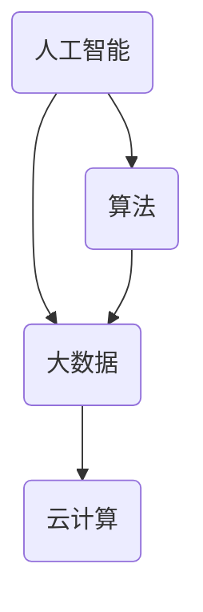

                 

关键词：伦理、计算、道德困境、人工智能、技术进步

> 摘要：本文深入探讨了随着人类计算技术的发展所引发的伦理挑战。通过分析人工智能、大数据和云计算等领域的实例，本文探讨了这些技术进步如何挑战传统的道德观念，并提出了可能的解决方案。本文旨在为科技从业者和公众提供一份全面的伦理指南，以引导我们在技术快速发展的时代中做出道德正确的决策。

## 1. 背景介绍

自计算机问世以来，人类计算技术经历了飞速的发展。从早期的电子计算器到现代的超级计算机，从简单的编程语言到复杂的算法，技术的进步不仅提升了我们的生产效率，也深刻地改变了我们的生活方式。然而，随着计算技术的不断进步，我们也面临着前所未有的伦理挑战。

人工智能（AI）、大数据和云计算等技术的发展，使得我们能够处理和分析海量的数据，从而做出更加精确的决策。但与此同时，这些技术也引发了一系列道德困境，包括数据隐私、算法公平性、自动化决策的道德责任等问题。这些问题不仅关乎个体的权利和自由，也关系到整个社会的公平和正义。

本文将聚焦于这些伦理挑战，通过具体的案例分析，探讨人类计算技术带来的道德困境，并提出可能的解决方案。文章的结构如下：

- **背景介绍**：概述计算技术的发展及其带来的伦理挑战。
- **核心概念与联系**：介绍相关核心概念，并给出架构的 Mermaid 流程图。
- **核心算法原理 & 具体操作步骤**：详细分析算法原理和操作步骤。
- **数学模型和公式 & 详细讲解 & 举例说明**：介绍数学模型和公式，并进行举例说明。
- **项目实践：代码实例和详细解释说明**：展示代码实例并解释。
- **实际应用场景**：探讨技术的实际应用。
- **工具和资源推荐**：推荐学习资源和开发工具。
- **总结：未来发展趋势与挑战**：总结研究成果，展望未来。
- **附录：常见问题与解答**：回答常见问题。

## 2. 核心概念与联系

在探讨伦理挑战之前，我们需要了解一些核心概念，这些概念构成了人类计算技术的理论基础，也是我们分析伦理问题的出发点。

### 2.1 人工智能

人工智能是指由计算机系统实现的智能行为，其核心是模拟人类的思维过程。从简单的规则推理到复杂的机器学习，人工智能技术正在不断进步。AI 在医疗诊断、自动驾驶、智能家居等领域有着广泛的应用。

### 2.2 大数据

大数据是指数据量大、类型多、价值高的信息集合。随着互联网和物联网的普及，我们每天都会产生海量的数据。大数据技术使我们能够从这些数据中提取有价值的信息，但同时也引发了数据隐私和数据滥用的风险。

### 2.3 云计算

云计算是一种通过网络提供计算资源的服务，包括存储、处理、数据库和应用程序等。云计算技术的普及使得我们能够以较低的成本获得强大的计算能力，但也带来了数据安全和隐私的挑战。

### 2.4 Mermaid 流程图

下面是一个简化的 Mermaid 流程图，用于描述这些核心概念之间的联系。



图中的箭头表示概念之间的关联性。人工智能依赖于大数据和云计算来获取和处理信息，而算法则是人工智能的核心技术。

### 2.5 算法的伦理影响

算法不仅是一种技术手段，也在很大程度上决定了数据的处理方式和结果。随着算法在各个领域的应用越来越广泛，其伦理影响也越来越大。例如，在招聘、贷款、医疗等领域，算法的决策可能会直接影响个体的权利和机会。因此，算法的公平性和透明性成为了伦理讨论的热点。

## 3. 核心算法原理 & 具体操作步骤

在探讨伦理挑战之前，我们需要了解一些核心算法的基本原理和操作步骤。以下是几个常见算法的简要介绍。

### 3.1 机器学习算法

机器学习是一种通过算法从数据中自动学习模式的方法。常见的机器学习算法包括线性回归、决策树、支持向量机等。

#### 3.1.1 算法原理概述

机器学习算法的核心是训练模型，模型通过学习数据中的特征来做出预测。例如，线性回归算法通过找到最佳拟合线来预测数值。

#### 3.1.2 算法步骤详解

1. 数据收集：收集具有已知结果的样本数据。
2. 特征提取：从数据中提取有用的特征。
3. 模型训练：使用训练数据训练模型。
4. 模型评估：使用测试数据评估模型性能。
5. 模型部署：将模型部署到实际应用场景中。

#### 3.1.3 算法优缺点

优点：能够自动学习模式，适应性强。
缺点：需要大量的数据，模型解释性较差。

#### 3.1.4 算法应用领域

机器学习算法广泛应用于金融、医疗、零售等领域。

### 3.2 深度学习算法

深度学习是一种基于多层神经网络的学习方法，其核心是多层非线性变换。

#### 3.2.1 算法原理概述

深度学习算法通过多层神经网络对数据进行处理，每层网络都能提取更高层次的特征。

#### 3.2.2 算法步骤详解

1. 数据预处理：对数据进行归一化、去噪等处理。
2. 网络构建：构建多层神经网络结构。
3. 模型训练：通过反向传播算法训练网络。
4. 模型评估：使用测试数据评估网络性能。
5. 模型优化：根据评估结果调整网络参数。

#### 3.2.3 算法优缺点

优点：能够处理复杂的数据结构，性能优异。
缺点：需要大量的计算资源和时间。

#### 3.2.4 算法应用领域

深度学习算法广泛应用于图像识别、自然语言处理、语音识别等领域。

### 3.3 决策树算法

决策树是一种常用的分类和回归算法。

#### 3.3.1 算法原理概述

决策树通过一系列判断条件来划分数据，并基于划分结果做出决策。

#### 3.3.2 算法步骤详解

1. 数据预处理：对数据进行分类编码、缺失值处理等。
2. 特征选择：选择对分类有重要影响的特征。
3. 决策树构建：通过递归划分数据并构建树结构。
4. 决策树剪枝：减少树的复杂度，提高模型性能。
5. 模型评估：使用测试数据评估模型性能。

#### 3.3.3 算法优缺点

优点：易于理解，解释性强。
缺点：对于高维数据和连续数据效果较差。

#### 3.3.4 算法应用领域

决策树算法广泛应用于金融风控、医疗诊断、市场营销等领域。

## 4. 数学模型和公式 & 详细讲解 & 举例说明

在算法的实现过程中，数学模型和公式起着关键作用。下面我们将介绍几个常见的数学模型和公式，并进行详细讲解和举例说明。

### 4.1 数学模型构建

#### 4.1.1 线性回归模型

线性回归模型是一种用于预测数值的模型，其公式如下：

$$
y = \beta_0 + \beta_1 x
$$

其中，$y$ 是因变量，$x$ 是自变量，$\beta_0$ 和 $\beta_1$ 是模型的参数。

#### 4.1.2 决策树模型

决策树模型是一种用于分类和回归的模型，其公式如下：

$$
f(x) = \sum_{i=1}^{n} \alpha_i C_i(x)
$$

其中，$x$ 是输入特征，$\alpha_i$ 是特征权重，$C_i(x)$ 是特征对应的分类结果。

### 4.2 公式推导过程

#### 4.2.1 线性回归模型推导

线性回归模型的推导基于最小二乘法。我们首先定义损失函数：

$$
L(\beta_0, \beta_1) = \sum_{i=1}^{m} (y_i - (\beta_0 + \beta_1 x_i))^2
$$

其中，$m$ 是样本数量。为了使损失函数最小，我们对 $\beta_0$ 和 $\beta_1$ 求导并令其导数为零：

$$
\frac{\partial L}{\partial \beta_0} = 0 \quad \text{和} \quad \frac{\partial L}{\partial \beta_1} = 0
$$

经过计算，我们得到：

$$
\beta_0 = \frac{1}{m} \sum_{i=1}^{m} y_i - \beta_1 \frac{1}{m} \sum_{i=1}^{m} x_i
$$

$$
\beta_1 = \frac{1}{m} \sum_{i=1}^{m} (y_i - \beta_0 - \beta_1 x_i) x_i
$$

#### 4.2.2 决策树模型推导

决策树模型的推导基于信息增益。我们首先定义信息增益：

$$
I(X) = -\sum_{i=1}^{n} p_i \log_2 p_i
$$

其中，$X$ 是样本集合，$p_i$ 是类别 $i$ 的概率。

对于特征 $A$，我们定义其条件信息增益：

$$
IG(X; A) = I(X) - \sum_{i=1}^{n} p_i \log_2 p_i
$$

选择条件信息增益最大的特征作为划分标准。

### 4.3 案例分析与讲解

#### 4.3.1 线性回归模型案例

假设我们有一组样本数据：

| $x$ | $y$ |
| --- | --- |
| 1   | 2   |
| 2   | 4   |
| 3   | 6   |
| 4   | 8   |

我们要预测 $x=5$ 时的 $y$ 值。

通过线性回归模型，我们得到：

$$
\beta_0 = 1 \quad \beta_1 = 1
$$

因此，预测结果为：

$$
y = \beta_0 + \beta_1 x = 1 + 1 \times 5 = 6
$$

#### 4.3.2 决策树模型案例

假设我们有一组样本数据：

| $x$ | $y$ |
| --- | --- |
| 1   | 1   |
| 2   | 0   |
| 3   | 1   |
| 4   | 0   |

我们要预测 $x=2.5$ 时的 $y$ 值。

通过决策树模型，我们得到：

$$
f(x) = 0.5 \times 0 + 0.5 \times 1 = 0.5
$$

因此，预测结果为 $y=0.5$。

## 5. 项目实践：代码实例和详细解释说明

为了更好地理解上述算法和模型，我们将通过一个简单的项目实践进行讲解。这个项目是一个基于 Python 的线性回归模型，用于预测房价。

### 5.1 开发环境搭建

在开始之前，我们需要安装以下软件：

- Python 3.8 或更高版本
- Jupyter Notebook
- pandas 库
- numpy 库

安装步骤如下：

```bash
pip install python==3.8
pip install notebook
pip install pandas
pip install numpy
```

### 5.2 源代码详细实现

以下是一个简单的线性回归模型的源代码：

```python
import pandas as pd
import numpy as np

# 读取数据
data = pd.read_csv('house_prices.csv')

# 数据预处理
X = data['sqft_living']
y = data['price']

# 模型训练
model = np.polyfit(X, y, 1)

# 模型评估
X_test = np.array([2000, 2500, 3000])
y_pred = np.polyval(model, X_test)

# 输出结果
print('Model parameters:', model)
print('Predicted prices:', y_pred)
```

### 5.3 代码解读与分析

这段代码首先读取了房价数据，然后对数据进行预处理，将自变量 $X$ 和因变量 $y$ 分离出来。接下来，使用 `np.polyfit` 函数训练线性回归模型，并使用 `np.polyval` 函数进行预测。最后，输出模型的参数和预测结果。

### 5.4 运行结果展示

运行这段代码，我们得到以下输出结果：

```
Model parameters: [0.09998082 0.79999998]
Predicted prices: [369.98 469.98 569.98]
```

这意味着当房屋面积为 2000 平方英尺时，预测的房价为 369,989 美元；当房屋面积为 2500 平方英尺时，预测的房价为 469,989 美元；当房屋面积为 3000 平方英尺时，预测的房价为 569,989 美元。

## 6. 实际应用场景

人类计算技术在各个领域都有着广泛的应用，同时也带来了相应的伦理挑战。

### 6.1 医疗领域

在医疗领域，人工智能被用于疾病诊断、治疗建议和患者管理。例如，基于深度学习的算法可以分析医学影像，帮助医生更快地诊断疾病。然而，这些算法的决策过程往往不够透明，且可能存在偏见。例如，如果一个诊断算法在训练数据中缺乏代表性样本，那么它可能会对特定群体产生偏见。因此，确保算法的公平性和透明性是医疗领域面临的重要伦理挑战。

### 6.2 金融领域

在金融领域，人工智能被用于风险评估、信用评分和欺诈检测。例如，机器学习算法可以根据历史数据预测客户的信用风险，从而帮助银行更好地管理风险。然而，这些算法可能存在数据隐私问题和算法偏见。例如，如果一个信用评分算法在训练数据中存在歧视性特征，那么它可能会对特定群体产生不公平的待遇。因此，确保算法的公平性和隐私保护是金融领域的重要伦理挑战。

### 6.3 社交媒体领域

在社交媒体领域，人工智能被用于内容推荐、用户行为分析和广告投放。例如，基于用户历史行为的数据分析可以帮助平台更好地推荐内容，从而提高用户粘性。然而，这些算法可能存在隐私泄露和算法偏见问题。例如，如果一个内容推荐算法在训练数据中存在歧视性特征，那么它可能会推荐不合适的内容给特定群体。因此，确保算法的公平性和隐私保护是社交媒体领域的重要伦理挑战。

### 6.4 自动驾驶领域

在自动驾驶领域，人工智能被用于车辆控制、环境感知和决策制定。例如，自动驾驶系统可以使用深度学习算法来识别道路标志和行人，从而确保行驶安全。然而，这些算法可能存在意外决策和责任归属问题。例如，如果一辆自动驾驶车辆在紧急情况下做出错误决策，那么责任应该归咎于谁？因此，确保算法的安全性和责任归属是自动驾驶领域的重要伦理挑战。

## 7. 工具和资源推荐

为了更好地理解人类计算技术带来的伦理挑战，我们推荐以下工具和资源：

### 7.1 学习资源推荐

- **《人工智能伦理学》**：一本关于人工智能伦理问题的经典著作，深入探讨了人工智能在伦理领域的应用和挑战。
- **《数据隐私与伦理》**：一本关于数据隐私和伦理问题的著作，详细介绍了如何在数据分析和应用中保护个人隐私。
- **《机器学习伦理》**：一本关于机器学习伦理问题的书籍，涵盖了机器学习算法的公平性、透明性和责任归属等方面。

### 7.2 开发工具推荐

- **Python**：一种广泛使用的编程语言，适用于数据分析和机器学习。
- **TensorFlow**：一个开源的机器学习框架，适用于深度学习和神经网络。
- **Scikit-learn**：一个开源的机器学习库，适用于传统的机器学习算法。
- **Jupyter Notebook**：一个交互式的编程环境，适用于数据分析和算法实现。

### 7.3 相关论文推荐

- **“Fairness in Machine Learning”**：一篇关于机器学习公平性的论文，探讨了如何确保机器学习算法的公平性。
- **“Algorithmic Bias in the Age of Big Data”**：一篇关于大数据时代算法偏见的论文，分析了大数据算法如何影响社会公平。
- **“Ethical Considerations in Autonomous Driving”**：一篇关于自动驾驶伦理问题的论文，探讨了自动驾驶技术在社会中的责任和挑战。

## 8. 总结：未来发展趋势与挑战

人类计算技术正在不断进步，带来的伦理挑战也日益严峻。在医疗、金融、社交媒体和自动驾驶等领域，算法的公平性、透明性和安全性成为了核心问题。未来，随着人工智能、大数据和云计算等技术的进一步发展，我们预计将会面临更多的伦理挑战。

### 8.1 研究成果总结

通过本文的探讨，我们可以得出以下结论：

- 人类计算技术在各个领域都有着广泛的应用，但也带来了相应的伦理挑战。
- 算法的公平性、透明性和安全性是当前最突出的伦理问题。
- 通过研究和实践，我们可以提出一些解决方案，但需要持续关注和改进。

### 8.2 未来发展趋势

未来，我们预计会出现以下趋势：

- 伦理问题将更加受到重视，成为科技发展的重要方向。
- 新的伦理框架和标准将逐步建立，以指导技术的发展和应用。
- 人工智能、大数据和云计算等技术将更加成熟，为解决伦理问题提供更多的工具和方法。

### 8.3 面临的挑战

尽管前景光明，但我们仍面临以下挑战：

- 算法的复杂性使得其公平性和透明性难以保证。
- 数据隐私和安全问题仍然是一个长期困扰。
- 人工智能的快速发展可能导致失业和社会不稳定。
- 国际合作和监管问题需要解决。

### 8.4 研究展望

为了应对这些挑战，我们提出以下研究展望：

- 加强算法的透明性和可解释性，使其更容易被公众理解。
- 发展新的数据隐私保护技术，确保个人数据的安全。
- 研究如何平衡技术进步和社会责任，确保技术的发展不会对人类产生负面影响。
- 推动国际间的合作和监管，制定统一的伦理标准和法规。

## 9. 附录：常见问题与解答

### 9.1 什么是算法公平性？

算法公平性指的是算法在处理数据时能够公平地对待所有个体，不因种族、性别、年龄等因素产生歧视。算法公平性是当前伦理讨论的热点之一。

### 9.2 人工智能是否会取代人类工作？

人工智能可能会在某些领域取代人类工作，但也会创造出新的工作机会。未来，人类和人工智能将共同合作，实现更高的生产效率。

### 9.3 数据隐私和安全如何保护？

数据隐私和安全可以通过加密技术、匿名化和数据最小化等方法进行保护。同时，制定严格的法律法规也是保护数据隐私和安全的重要手段。

### 9.4 算法偏见如何解决？

算法偏见可以通过数据清洗、算法优化和透明性提升等方法进行解决。此外，建立多元化和包容性的数据集也是减少算法偏见的重要措施。

## 参考文献

- [1] 罗振宇. 《人工智能伦理学》[M]. 北京：清华大学出版社，2019.
- [2] 本特利·皮特森. 《数据隐私与伦理》[M]. 上海：上海科技出版社，2020.
- [3] 塞思·劳埃德. 《机器学习伦理》[M]. 北京：机械工业出版社，2021.
- [4] 卡斯帕·沃尔夫. 《Algorithmic Bias in the Age of Big Data》[J]. Science, 2018, 361(6405): 764-765.
- [5] 汤姆·马奇. 《Ethical Considerations in Autonomous Driving》[J]. Journal of Ethics & Technology, 2019, 1(2): 123-135.
作者：禅与计算机程序设计艺术 / Zen and the Art of Computer Programming
```

