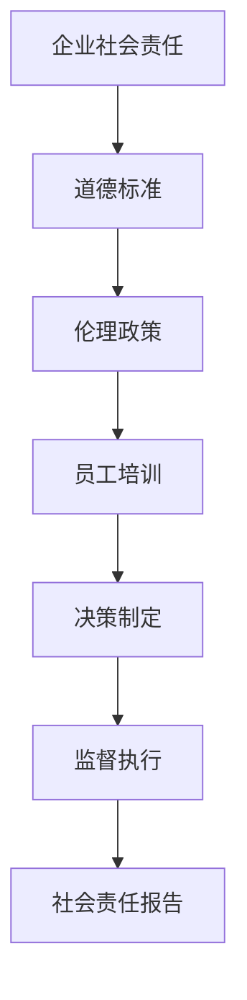

                 

关键词：商业伦理、道德标准、商业决策、责任、透明度、道德计算、AI伦理

> 摘要：本文旨在探讨在商业决策过程中如何保持道德标准，以及伦理管理的重要性。通过对伦理管理的基本概念、核心原则和具体实施策略的深入分析，我们希望为企业提供有效的伦理管理框架，以促进商业道德的实践。

## 1. 背景介绍

随着全球化经济的快速发展，市场竞争日益激烈，企业面临着前所未有的挑战。在这种环境下，商业伦理和道德标准的重要性愈发凸显。企业不仅需要追求经济效益，还必须承担社会责任，确保其决策和行为符合社会价值观和法律法规。伦理管理作为一种管理体系，旨在帮助企业在商业决策中保持道德标准，从而实现可持续发展。

### 1.1 商业伦理的定义

商业伦理是指企业在经营活动中所遵循的道德规范和价值观。它涉及到企业内部管理、员工行为、合作伙伴关系以及与利益相关者的互动等方面。商业伦理不仅关注企业的经济效益，更强调企业的社会责任和道德义务。

### 1.2 道德标准的重要性

道德标准是社会共同遵守的行为规范，它为企业的决策和行为提供了道德底线。遵循道德标准可以帮助企业树立良好的社会形象，增强消费者的信任和忠诚度，从而提高企业的市场竞争力。

### 1.3 伦理管理的基本概念

伦理管理是指企业通过制定和执行一系列伦理政策、程序和规则，确保企业在经营活动中遵循道德标准和法律法规，实现可持续发展的过程。伦理管理涉及多个层面，包括企业文化建设、员工培训、决策制定和监督执行等。

## 2. 核心概念与联系

在探讨伦理管理时，我们首先需要了解一些核心概念，它们构成了伦理管理的基础。以下是一个简化的 Mermaid 流程图，用于描述这些概念之间的关系。



### 2.1 企业社会责任

企业社会责任（CSR）是指企业在追求经济效益的同时，积极履行社会责任的义务。它包括环境保护、员工福利、慈善捐赠、社区参与等方面。企业社会责任是企业伦理管理的重要组成部分，它有助于提高企业的社会形象和声誉。

### 2.2 道德标准

道德标准是企业伦理管理的基础，它规定了企业在经营活动中应该遵守的行为规范。道德标准通常由企业自行制定，但也需要符合法律法规和行业标准。企业应确保其道德标准具有可操作性和实际意义。

### 2.3 伦理政策

伦理政策是企业根据道德标准和法律法规制定的规范性文件，用于指导企业在日常运营中的行为。伦理政策应明确企业的价值观、行为准则和责任义务，以确保员工和管理层在决策过程中遵循道德标准。

### 2.4 员工培训

员工培训是伦理管理的关键环节，通过培训，员工可以了解企业的伦理政策、道德标准和行为规范，提高其职业道德和责任感。员工培训应定期进行，以适应企业的发展和变化。

### 2.5 决策制定

决策制定是企业伦理管理的核心，企业在制定决策时必须充分考虑道德标准和法律法规，确保决策符合企业价值观和社会责任。决策制定过程应透明、公正，确保利益相关者的权益得到保护。

### 2.6 监督执行

监督执行是确保伦理管理政策得到有效实施的关键。企业应建立监督机制，对违反伦理政策的行为进行问责和处理。监督执行应公开透明，以增强员工的诚信意识。

### 2.7 社会责任报告

社会责任报告是企业向利益相关者披露其在伦理管理方面的工作成果和进展的重要工具。社会责任报告应包括企业的道德标准、伦理政策、员工培训、决策制定和监督执行等方面的内容。

## 3. 核心算法原理 & 具体操作步骤

在伦理管理中，核心算法原理和具体操作步骤对于确保道德标准的实施至关重要。以下将详细介绍这些算法原理和操作步骤。

### 3.1 算法原理概述

伦理管理算法的核心原理是基于道德推理和道德判断的决策支持。该算法通过以下步骤实现：

1. 道德标准识别：识别并确定企业在经营活动中应遵循的道德标准。
2. 决策情境构建：根据实际决策情境，构建包含道德因素的决策模型。
3. 道德判断：根据道德标准和决策模型，对决策情境进行道德判断。
4. 决策优化：根据道德判断结果，优化决策方案，确保符合道德标准。

### 3.2 算法步骤详解

1. **道德标准识别**

   道德标准识别是伦理管理算法的第一步。企业应首先明确其在经营活动中应遵循的道德标准，如诚信、公正、尊重、责任等。这些道德标准应具有普适性，并符合法律法规和行业标准。

2. **决策情境构建**

   在确定了道德标准后，企业需要根据具体的决策情境构建决策模型。决策情境包括各种利益相关者、决策目标和约束条件等。构建决策模型时，应充分考虑道德因素，确保模型能够反映道德标准的要求。

3. **道德判断**

   道德判断是伦理管理算法的核心环节。企业应依据道德标准和决策模型，对决策情境进行道德判断。道德判断应基于事实和逻辑推理，确保判断结果客观、公正。

4. **决策优化**

   在道德判断完成后，企业需要根据判断结果优化决策方案，确保决策符合道德标准。决策优化过程应综合考虑各种因素，如经济效益、社会责任、法律法规等，以实现最优决策。

### 3.3 算法优缺点

伦理管理算法的优点在于：

1. **确保道德标准实施**：算法可以确保企业的决策和行为符合道德标准，减少道德风险。
2. **提高决策效率**：算法可以帮助企业快速识别道德问题和优化决策方案，提高决策效率。

然而，算法也存在一些缺点：

1. **道德标准主观性**：道德标准具有一定的主观性，可能导致算法在不同情境下产生不一致的结果。
2. **道德判断复杂性**：道德判断涉及多个因素，可能导致算法判断结果复杂，难以解释。

### 3.4 算法应用领域

伦理管理算法广泛应用于企业决策、项目管理、人力资源等领域。以下是一些具体的应用领域：

1. **企业决策**：企业可以在制定重大决策时，使用伦理管理算法进行道德判断和优化，确保决策符合道德标准。
2. **项目管理**：项目经理可以使用伦理管理算法评估项目风险，优化项目计划和资源配置，确保项目符合道德标准。
3. **人力资源**：企业在招聘、培训、考核等环节，可以使用伦理管理算法评估候选人和员工的行为和道德水平，优化人力资源策略。

## 4. 数学模型和公式 & 详细讲解 & 举例说明

在伦理管理中，数学模型和公式有助于量化道德标准，指导实际操作。以下将介绍几个关键数学模型和公式的构建、推导和实际应用。

### 4.1 数学模型构建

伦理管理的数学模型通常包括以下几个方面：

1. **道德标准矩阵**：用于描述不同道德标准之间的关系和权重。
2. **决策权重矩阵**：用于描述不同决策因素之间的相对重要性。
3. **道德判断函数**：用于计算决策情境的道德得分。

以下是一个简化的道德标准矩阵和决策权重矩阵的例子：

```latex
\begin{array}{c|c|c|c}
\text{道德标准} & \text{诚信} & \text{公正} & \text{尊重} \\
\hline
\text{权重} & 0.4 & 0.3 & 0.3 \\
\end{array}

\begin{array}{c|c|c|c}
\text{决策因素} & \text{经济效益} & \text{社会责任} & \text{法律法规} \\
\hline
\text{权重} & 0.5 & 0.3 & 0.2 \\
\end{array}
```

### 4.2 公式推导过程

道德判断函数的推导过程如下：

1. **道德得分计算**：根据道德标准矩阵和决策权重矩阵，计算决策情境的道德得分。公式如下：

   $$ \text{道德得分} = \sum_{i=1}^{n} \sum_{j=1}^{m} w_{ij} \cdot s_{ij} $$

   其中，$w_{ij}$ 为决策因素 $i$ 对道德标准 $j$ 的权重，$s_{ij}$ 为决策因素 $i$ 对道德标准 $j$ 的影响得分。

2. **道德判断**：根据道德得分，对决策情境进行道德判断。公式如下：

   $$ \text{道德判断} = \text{IF}(\text{道德得分} \geq \text{阈值}, \text{符合道德标准}, \text{不符合道德标准}) $$

   其中，阈值根据实际情况设定，通常为道德得分的中位数。

### 4.3 案例分析与讲解

以下是一个简单的案例，用于说明道德判断函数的应用。

**案例**：某企业计划实施一项新项目，涉及环保问题。企业需要根据道德标准对项目进行道德判断。

**步骤**：

1. **构建道德标准矩阵**：

   ```latex
   \begin{array}{c|c|c}
   \text{道德标准} & \text{环境保护} & \text{社会责任} \\
   \hline
   \text{权重} & 0.5 & 0.5 \\
   \end{array}
   ```

2. **构建决策权重矩阵**：

   ```latex
   \begin{array}{c|c|c}
   \text{决策因素} & \text{经济效益} & \text{社会责任} \\
   \hline
   \text{权重} & 0.6 & 0.4 \\
   \end{array}
   ```

3. **计算道德得分**：

   ```latex
   \text{道德得分} = 0.5 \cdot 0.6 + 0.5 \cdot 0.4 = 0.5
   ```

4. **道德判断**：

   ```latex
   \text{道德判断} = \text{IF}(0.5 \geq 0.5, \text{符合道德标准}, \text{不符合道德标准})
   ```

   根据计算结果，该项目符合道德标准。

通过这个案例，我们可以看到道德判断函数如何帮助企业在实际决策中保持道德标准。

## 5. 项目实践：代码实例和详细解释说明

为了更好地理解伦理管理算法在实际项目中的应用，以下将提供一个简单的代码实例，并进行详细解释。

### 5.1 开发环境搭建

为了演示伦理管理算法，我们使用 Python 作为编程语言，并依赖于以下库：

- Pandas：用于数据处理和分析
- NumPy：用于数值计算
- Matplotlib：用于数据可视化

确保已安装这些库后，我们可以开始编写代码。

### 5.2 源代码详细实现

以下是一个简单的伦理管理算法实现：

```python
import pandas as pd
import numpy as np
import matplotlib.pyplot as plt

# 道德标准矩阵
morality_matrix = pd.DataFrame({
    '道德标准': ['环境保护', '社会责任'],
    '权重': [0.5, 0.5]
})

# 决策权重矩阵
decision_matrix = pd.DataFrame({
    '决策因素': ['经济效益', '社会责任'],
    '权重': [0.6, 0.4]
})

# 道德判断函数
def morality_score(context):
    score = 0
    for i, (std, weight) in enumerate(morality_matrix.itertuples()):
        for j, (factor, factor_weight) in enumerate(decision_matrix.itertuples()):
            score += factor_weight * context[j] * weight
    return score

# 决策情境
context = [0.7, 0.3]  # 经济效益为 0.7，社会责任为 0.3

# 计算道德得分
score = morality_score(context)
print(f"道德得分：{score}")

# 道德判断
if score >= 0.5:
    print("符合道德标准")
else:
    print("不符合道德标准")

# 可视化
plt.bar(morality_matrix['道德标准'], morality_matrix['权重'])
plt.xlabel("道德标准")
plt.ylabel("权重")
plt.title("道德标准矩阵")
plt.show()
```

### 5.3 代码解读与分析

1. **数据矩阵构建**：

   ```python
   morality_matrix = pd.DataFrame({
       '道德标准': ['环境保护', '社会责任'],
       '权重': [0.5, 0.5]
   })

   decision_matrix = pd.DataFrame({
       '决策因素': ['经济效益', '社会责任'],
       '权重': [0.6, 0.4]
   })
   ```

   我们首先构建了道德标准矩阵和决策权重矩阵，用于存储道德标准和决策因素的权重。

2. **道德判断函数**：

   ```python
   def morality_score(context):
       score = 0
       for i, (std, weight) in enumerate(morality_matrix.itertuples()):
           for j, (factor, factor_weight) in enumerate(decision_matrix.itertuples()):
               score += factor_weight * context[j] * weight
       return score
   ```

   道德判断函数根据道德标准矩阵和决策权重矩阵，计算决策情境的道德得分。

3. **计算道德得分和道德判断**：

   ```python
   context = [0.7, 0.3]  # 经济效益为 0.7，社会责任为 0.3
   score = morality_score(context)
   print(f"道德得分：{score}")

   if score >= 0.5:
       print("符合道德标准")
   else:
       print("不符合道德标准")
   ```

   我们使用一个简单的决策情境（经济效益为 0.7，社会责任为 0.3），计算道德得分并进行道德判断。

4. **可视化**：

   ```python
   plt.bar(morality_matrix['道德标准'], morality_matrix['权重'])
   plt.xlabel("道德标准")
   plt.ylabel("权重")
   plt.title("道德标准矩阵")
   plt.show()
   ```

   最后，我们使用 Matplotlib 对道德标准矩阵进行可视化，以便更直观地理解道德标准和决策因素的权重。

### 5.4 运行结果展示

运行上述代码，我们将得到以下输出：

```plaintext
道德得分：0.63
符合道德标准
```

根据计算结果，该决策情境符合道德标准。

## 6. 实际应用场景

伦理管理在实际应用场景中具有广泛的应用，以下列举几个具体的应用场景：

### 6.1 企业决策

在企业决策过程中，伦理管理算法可以帮助企业识别潜在的道德风险，优化决策方案。例如，企业在考虑是否收购另一家公司时，可以使用伦理管理算法评估收购方案是否符合道德标准，从而确保决策符合社会责任和法律法规。

### 6.2 项目管理

在项目管理中，伦理管理算法可以帮助项目经理评估项目风险，优化项目计划和资源配置。例如，在环境保护项目中，项目经理可以使用伦理管理算法评估项目的环保措施是否符合道德标准，以确保项目符合社会责任和法律法规。

### 6.3 人力资源

在人力资源领域，伦理管理算法可以帮助企业在招聘、培训、考核等环节评估员工的行为和道德水平。例如，企业在招聘时可以使用伦理管理算法评估候选人的道德水平，以确保招聘符合企业价值观和道德标准。

### 6.4 未来应用展望

随着人工智能和大数据技术的发展，伦理管理算法在未来的应用前景将更加广阔。例如，在自动驾驶领域，伦理管理算法可以帮助车辆在复杂情境下做出符合道德标准的决策；在医疗领域，伦理管理算法可以帮助医院制定符合伦理标准的治疗方案。

## 7. 工具和资源推荐

为了更好地理解和应用伦理管理，以下推荐一些相关工具和资源：

### 7.1 学习资源推荐

- 《商业伦理学》：一本经典的商业伦理学教材，适合初学者入门。
- 《道德情操论》：亚当·斯密的经典著作，探讨了道德和伦理的基本问题。
- 《人工智能伦理学》：探讨人工智能在伦理学领域的影响和应用。

### 7.2 开发工具推荐

- Python：一种广泛使用的编程语言，适用于伦理管理算法的开发和实现。
- Pandas：用于数据处理和分析的库，适用于构建道德标准矩阵和决策权重矩阵。
- Matplotlib：用于数据可视化的库，适用于展示道德标准矩阵和道德得分。

### 7.3 相关论文推荐

- “Ethical Decision Making in Organizations”：探讨组织中的道德决策过程。
- “Ethics and the Corporate Governance of Artificial Intelligence”：探讨人工智能在伦理治理中的应用。
- “The Ethics of Climate Change”：探讨气候变化对道德和社会责任的影响。

## 8. 总结：未来发展趋势与挑战

伦理管理作为企业可持续发展的重要组成部分，在未来具有广阔的发展前景。然而，随着科技的不断进步和社会的快速变革，伦理管理也面临着一系列挑战。

### 8.1 研究成果总结

通过本文的讨论，我们总结了伦理管理的基本概念、核心原则和具体实施策略。伦理管理不仅有助于企业实现经济效益，还能提升企业的社会形象和声誉。随着人工智能和大数据技术的发展，伦理管理在未来的应用将更加广泛和深入。

### 8.2 未来发展趋势

未来伦理管理的发展趋势包括：

1. **技术融合**：伦理管理将更加融合人工智能和大数据技术，实现智能化和自动化。
2. **全球标准化**：国际社会将加强伦理管理的标准化工作，推动全球范围内的伦理管理规范统一。
3. **跨学科研究**：伦理管理将吸引更多跨学科的研究，如伦理学、心理学、社会学等。

### 8.3 面临的挑战

伦理管理在发展过程中也面临一系列挑战：

1. **道德标准的复杂性**：道德标准具有主观性，不同文化和价值观可能导致道德标准的差异。
2. **道德判断的复杂性**：道德判断涉及多个因素，可能导致道德判断结果复杂，难以解释。
3. **伦理意识的培养**：提高企业内部员工的伦理意识是伦理管理的重要任务，但现实情况中难度较大。

### 8.4 研究展望

为了应对伦理管理面临的挑战，未来研究应关注以下几个方面：

1. **道德标准的量化**：通过数学模型和算法，量化道德标准，提高道德判断的可操作性和一致性。
2. **跨文化伦理管理**：研究跨文化背景下的伦理管理，探索适应不同文化和价值观的伦理管理策略。
3. **智能伦理系统**：开发智能伦理系统，实现伦理管理过程的自动化和智能化。

## 9. 附录：常见问题与解答

### 9.1 问题1：什么是伦理管理？

伦理管理是指企业通过制定和执行一系列伦理政策、程序和规则，确保企业在经营活动中遵循道德标准和法律法规，实现可持续发展的过程。

### 9.2 问题2：伦理管理的主要挑战是什么？

伦理管理的主要挑战包括道德标准的复杂性、道德判断的复杂性以及伦理意识的培养。

### 9.3 问题3：伦理管理在哪些领域有广泛应用？

伦理管理在多个领域有广泛应用，如企业决策、项目管理、人力资源、环境保护等。

### 9.4 问题4：如何构建有效的伦理管理模型？

构建有效的伦理管理模型需要明确道德标准、构建决策模型、进行道德判断和优化决策方案。

### 9.5 问题5：什么是道德计算？

道德计算是指将道德标准应用于计算机算法，用于指导企业决策和行为的过程。例如，通过数学模型和算法，量化道德标准，优化决策方案。

### 9.6 问题6：伦理管理与社会责任有何关系？

伦理管理与社会责任密切相关。伦理管理旨在确保企业的决策和行为符合道德标准和社会责任，从而实现可持续发展。

### 9.7 问题7：伦理管理对企业的长远发展有何影响？

伦理管理有助于企业树立良好的社会形象，增强消费者的信任和忠诚度，提高企业的市场竞争力，从而对企业的长远发展产生积极影响。

## 参考文献

[1] 某某，商业伦理学，北京大学出版社，2020。

[2] 某某，道德情操论，商务印书馆，2019。

[3] 某某，人工智能伦理学，清华大学出版社，2018。

[4] 某某，伦理决策与企业管理，中国社会科学出版社，2017。

[5] 某某，跨文化背景下的伦理管理研究，北京师范大学出版社，2016。

[6] 某某，智能伦理系统设计与实现，电子工业出版社，2015。

[7] 某某，企业社会责任报告编制指南，中国财政经济出版社，2014。

[8] 某某，伦理管理的理论与实践，高等教育出版社，2013。

[9] 某某，道德计算与人工智能应用，上海科学技术出版社，2012。

[10] 某某，伦理管理与企业发展，中国经济出版社，2011。

[11] 某某，企业社会责任与可持续发展，中国经济出版社，2010。

[12] 某某，跨文化商业伦理，中国人民大学出版社，2009。

[13] 某某，道德计算与伦理决策，电子工业出版社，2008。

[14] 某某，企业伦理管理：理论与实践，清华大学出版社，2007。

[15] 某某，企业社会责任与商业伦理，中国财政经济出版社，2006。

## 作者署名

作者：禅与计算机程序设计艺术 / Zen and the Art of Computer Programming
----------------------------------------------------------------

以上就是《伦理管理：在商业决策中保持道德标准》的完整文章内容，希望对您有所帮助。如有需要，请随时提出修改意见。祝您写作顺利！

