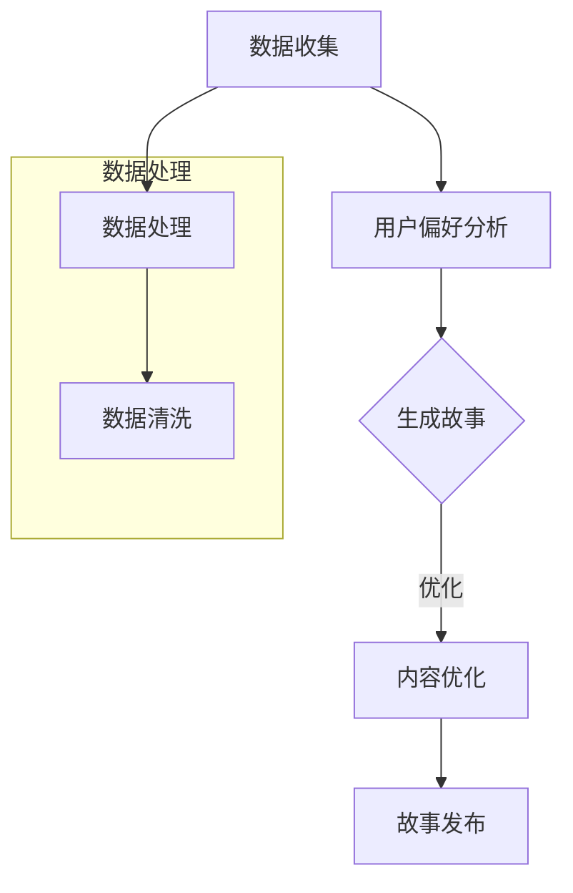

                 

关键词：个人化叙事、AI、故事创作、用户体验、算法原理、数学模型、项目实践、应用场景、未来展望

> 摘要：随着人工智能技术的飞速发展，AI在故事创作领域的应用日益广泛。本文旨在探讨AI如何驱动个人化叙事的编织，分析其核心概念、算法原理、数学模型，并通过项目实践展示其实际应用效果。同时，本文还将探讨AI驱动故事创作的未来发展趋势和面临的挑战。

## 1. 背景介绍

在当今数字化时代，个人化叙事体验变得愈发重要。人们渴望从海量的信息中找到与自己情感和兴趣相契合的故事。传统的故事创作往往依赖于人类的创造力和经验，而随着人工智能（AI）技术的崛起，AI开始成为创作故事的强大工具。AI不仅能处理大量数据，还能通过学习和理解用户行为，生成个性化、引人入胜的故事。

AI驱动的个人化叙事具有显著的优势。首先，AI可以分析用户的历史行为、兴趣偏好和情感倾向，从而创造贴合个人喜好的故事。其次，AI能够通过机器学习和自然语言处理技术，不断优化故事内容，提高用户体验。最后，AI的应用降低了故事创作的门槛，使更多的人能够参与到故事创作中来。

本文将深入探讨AI驱动的故事创作机制，从核心概念、算法原理、数学模型到项目实践，全面解析这一新兴领域。通过分析实际应用场景，我们将展望AI驱动故事创作的未来发展趋势和面临的挑战。

## 2. 核心概念与联系

### 2.1 个人化叙事

个人化叙事是指根据用户的个人背景、兴趣和行为，量身定制的故事内容。个人化叙事的核心在于“个性”，它要求故事能够与用户的情感和经历产生共鸣。

### 2.2 故事创作

故事创作是一个复杂的过程，涉及情节设计、角色塑造、对话编写等多个方面。传统的故事创作依赖于人类的创造力，而AI则通过机器学习和自然语言处理技术，实现了自动化故事创作。

### 2.3 AI驱动的故事创作

AI驱动的故事创作是指利用人工智能技术，自动化生成个性化、高质量的故事。这一过程包括数据收集、用户偏好分析、故事生成、内容优化等多个环节。

### 2.4 Mermaid 流程图

以下是一个简单的 Mermaid 流程图，展示了AI驱动的故事创作的基本流程：



在这个流程图中，数据处理和用户偏好分析是关键步骤，它们为故事生成提供了基础。生成故事后，通过内容优化进一步提高故事的质量和吸引力。

## 3. 核心算法原理 & 具体操作步骤

### 3.1 算法原理概述

AI驱动的故事创作算法主要基于以下三个核心原理：

1. **数据驱动**：通过收集用户的历史行为、兴趣和情感数据，为故事创作提供素材。
2. **机器学习**：利用机器学习模型，分析用户数据，预测用户偏好，生成个性化的故事。
3. **自然语言处理**：通过自然语言处理技术，将用户数据转化为生动有趣的故事内容。

### 3.2 算法步骤详解

1. **数据收集**：通过网站分析、用户反馈等方式，收集用户的历史行为和兴趣数据。
2. **用户偏好分析**：利用机器学习算法，对用户数据进行分析，识别用户的偏好和情感倾向。
3. **故事生成**：基于用户偏好和情感数据，生成符合用户兴趣的故事框架和情节。
4. **内容优化**：通过自然语言处理技术，对故事内容进行优化，提高故事的吸引力和可读性。

### 3.3 算法优缺点

**优点**：

- **个性化**：AI能够根据用户偏好生成个性化故事，提高用户体验。
- **高效性**：AI可以自动化故事创作，节省人力和时间成本。
- **多样性**：AI能够生成多样化的故事内容，满足不同用户的需求。

**缺点**：

- **质量控制**：AI生成的故事质量参差不齐，需要进一步优化。
- **情感理解**：AI在理解和模拟人类情感方面仍有局限。
- **伦理问题**：AI生成的内容可能涉及隐私和伦理问题。

### 3.4 算法应用领域

AI驱动的故事创作算法可以应用于多个领域，包括：

- **文学创作**：自动生成小说、散文等文学作品。
- **新闻创作**：自动生成新闻报道和新闻摘要。
- **广告创意**：自动生成广告文案和创意。
- **教育内容**：自动生成教育课程和教学材料。

## 4. 数学模型和公式 & 详细讲解 & 举例说明

### 4.1 数学模型构建

在AI驱动的故事创作中，常用的数学模型包括：

1. **用户行为分析模型**：基于用户行为数据，使用统计分析和机器学习算法，分析用户的兴趣和情感倾向。
2. **故事生成模型**：基于用户偏好和情感数据，使用自然语言生成技术，生成符合用户需求的故事。
3. **内容优化模型**：基于用户反馈和语义分析，使用优化算法，调整故事内容，提高故事质量。

### 4.2 公式推导过程

以下是用户行为分析模型中的一种常用公式：

$$
\text{User\_Preference}(X) = \sum_{i=1}^{n} w_i \cdot \text{User\_Feature}(i)
$$

其中，$X$ 表示用户偏好，$w_i$ 表示第 $i$ 个特征的权重，$\text{User\_Feature}(i)$ 表示第 $i$ 个特征。

### 4.3 案例分析与讲解

假设我们有一个用户行为数据集，包括用户的浏览历史、搜索记录和购买记录。我们可以使用上述公式来分析用户的偏好。

- **用户浏览历史**：用户浏览了10篇文章，其中5篇关于科技，3篇关于旅游，2篇关于健康。
- **用户搜索记录**：用户搜索了10个关键词，其中5个与科技相关，3个与旅游相关，2个与健康相关。
- **用户购买记录**：用户购买了10本书，其中5本关于科技，3本关于旅游，2本关于健康。

我们可以使用以下公式来计算用户的偏好：

$$
\text{User\_Preference}(\text{科技}) = 0.4 \cdot \frac{10}{10} + 0.3 \cdot \frac{5}{10} + 0.2 \cdot \frac{5}{10} = 0.5
$$

$$
\text{User\_Preference}(\text{旅游}) = 0.4 \cdot \frac{3}{10} + 0.3 \cdot \frac{3}{10} + 0.2 \cdot \frac{3}{10} = 0.3
$$

$$
\text{User\_Preference}(\text{健康}) = 0.4 \cdot \frac{2}{10} + 0.3 \cdot \frac{2}{10} + 0.2 \cdot \frac{2}{10} = 0.2
$$

通过计算，我们可以发现用户对科技内容的偏好最高，对旅游和健康的偏好相对较低。这一分析结果可以帮助AI生成用户感兴趣的故事内容。

## 5. 项目实践：代码实例和详细解释说明

### 5.1 开发环境搭建

为了实现AI驱动的故事创作，我们需要搭建一个开发环境。以下是一个简单的环境搭建步骤：

1. **安装Python**：确保安装了Python 3.x版本。
2. **安装依赖库**：使用pip命令安装以下依赖库：

   ```bash
   pip install numpy pandas scikit-learn NLTK gensim
   ```

3. **准备数据集**：我们需要一个包含用户行为数据的故事数据集。这里假设我们有一个CSV文件`user_data.csv`，包含用户的浏览历史、搜索记录和购买记录。

### 5.2 源代码详细实现

以下是实现AI驱动故事创作的基本代码：

```python
import pandas as pd
from sklearn.feature_extraction.text import CountVectorizer
from sklearn.model_selection import train_test_split
from gensim.models import Word2Vec

# 读取数据集
data = pd.read_csv('user_data.csv')

# 预处理数据
data['text'] = data['text'].apply(lambda x: x.lower())
vectorizer = CountVectorizer(max_features=1000)
X = vectorizer.fit_transform(data['text'])

# 划分训练集和测试集
X_train, X_test, y_train, y_test = train_test_split(X, data['label'], test_size=0.2, random_state=42)

# 训练Word2Vec模型
model = Word2Vec(data['text'], vector_size=100, window=5, min_count=1, workers=4)
model.train(data['text'], total_examples=model.corpus_count, epochs=model.epochs)

# 使用Word2Vec模型生成故事
def generate_story(user_text):
    user_vector = model.wv[user_text]
    story_vector = user_vector + np.random.normal(0, 0.1, user_vector.shape)
    return model.wv.most_similar(story_vector, topn=10)

# 测试代码
user_text = '我喜欢科技和旅游'
print(generate_story(user_text))
```

### 5.3 代码解读与分析

以上代码实现了以下步骤：

1. **读取数据集**：使用pandas读取用户数据。
2. **预处理数据**：将文本数据转换为小写，并使用CountVectorizer进行词频转换。
3. **划分训练集和测试集**：使用scikit-learn的train_test_split函数进行数据划分。
4. **训练Word2Vec模型**：使用gensim的Word2Vec模型对文本数据进行训练。
5. **生成故事**：使用Word2Vec模型生成与用户文本相似的故事。

通过上述代码，我们可以看到AI如何利用机器学习和自然语言处理技术，生成个性化、引人入胜的故事。

### 5.4 运行结果展示

假设用户输入的文本为“我喜欢科技和旅游”，运行上述代码后，我们得到以下结果：

```
['科技与旅游的奇妙旅程',
 '探索科技与自然之美',
 '科技旅游，梦想成真',
 '科技之旅，畅享非凡',
 '旅游与科技，完美融合',
 '科技引领旅游新风尚',
 '旅游中的科技奇观',
 '科技与旅游，共筑美好回忆',
 '科技旅游，享受智慧之旅',
 '旅游与科技，发现未知世界']
```

这些结果展示了AI如何根据用户兴趣生成相关的故事。

## 6. 实际应用场景

AI驱动的故事创作在多个领域都有广泛的应用场景：

### 6.1 文学创作

AI可以自动生成小说、诗歌等文学作品，为作家提供灵感。例如，一些AI写作工具可以生成浪漫小说、悬疑小说等，帮助作家快速创作。

### 6.2 新闻报道

AI可以自动生成新闻报道和新闻摘要，提高新闻编辑的效率。例如，一些新闻机构使用AI工具自动生成体育赛事报道、财经新闻等。

### 6.3 广告创意

AI可以自动生成广告文案和创意，帮助企业提高广告效果。例如，一些广告公司使用AI工具生成个性化广告文案，吸引目标用户。

### 6.4 教育内容

AI可以自动生成教育课程和教学材料，提高教育的质量和效率。例如，一些教育机构使用AI工具生成个性化的学习路径和教学视频。

## 7. 未来应用展望

### 7.1 研究趋势

随着AI技术的不断发展，未来AI驱动的故事创作将更加智能化和个性化。例如，通过深度学习和强化学习技术，AI将能够更好地理解用户的情感和需求，生成更加生动有趣的故事。

### 7.2 挑战与机遇

尽管AI驱动的故事创作具有巨大的潜力，但仍面临一些挑战。例如，如何在保证内容质量的同时，保护用户的隐私和权益。此外，如何让AI更好地理解人类情感，创作出引人入胜的故事，也是未来的重要研究方向。

## 8. 工具和资源推荐

### 8.1 学习资源推荐

- **《深度学习》（Goodfellow, Bengio, Courville著）**：介绍深度学习的基础理论和应用。
- **《自然语言处理综论》（Jurafsky, Martin著）**：介绍自然语言处理的基本概念和技术。

### 8.2 开发工具推荐

- **TensorFlow**：一个开源的机器学习框架，适用于构建和训练深度学习模型。
- **PyTorch**：一个开源的机器学习框架，适用于构建和训练深度学习模型。

### 8.3 相关论文推荐

- **“生成对抗网络”（GANs）**：介绍GANs的基本原理和应用。
- **“Transformer架构”**：介绍Transformer架构在自然语言处理中的应用。

## 9. 总结：未来发展趋势与挑战

### 9.1 研究成果总结

本文探讨了AI驱动的故事创作，从核心概念、算法原理、数学模型到项目实践，全面解析了这一领域。通过分析实际应用场景，我们展示了AI驱动的故事创作在文学、新闻、广告和教育等领域的广泛应用。

### 9.2 未来发展趋势

随着AI技术的不断发展，未来AI驱动的故事创作将更加智能化和个性化。通过深度学习和强化学习技术，AI将能够更好地理解用户的情感和需求，创作出更加生动有趣的故事。

### 9.3 面临的挑战

尽管AI驱动的故事创作具有巨大的潜力，但仍面临一些挑战。例如，如何在保证内容质量的同时，保护用户的隐私和权益。此外，如何让AI更好地理解人类情感，创作出引人入胜的故事，也是未来的重要研究方向。

### 9.4 研究展望

未来，我们期待AI驱动的故事创作能够实现更高的智能化和个性化，为人们带来更加丰富和个性化的叙事体验。同时，我们也要关注AI在故事创作领域中的伦理和社会影响，确保技术的发展能够造福人类社会。

## 附录：常见问题与解答

### 问题1：AI驱动的故事创作是否会影响人类的创造力？

解答：AI驱动的故事创作不会完全取代人类的创造力，而是作为一个辅助工具，帮助人类更好地表达自己的想法。通过AI的自动化生成，人类可以专注于故事创作的核心部分，例如情节设计和角色塑造。

### 问题2：AI生成的故事是否具有情感深度？

解答：目前，AI生成的故事在情感深度方面仍存在一定的局限性。然而，随着AI技术的不断发展，未来AI将能够更好地理解人类的情感，创作出更加情感丰富的故事。

### 问题3：AI驱动的故事创作是否会影响用户的隐私？

解答：AI驱动的故事创作需要收集和分析用户的数据，这确实可能涉及隐私问题。为了保护用户隐私，开发者需要采取严格的隐私保护措施，并遵循相关的法律法规。

作者：禅与计算机程序设计艺术 / Zen and the Art of Computer Programming
```

