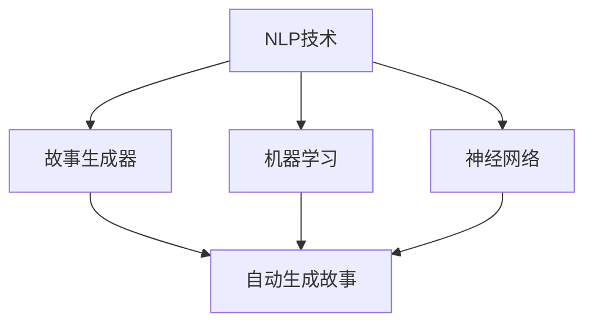

                 

关键词：AI，个人故事创作，叙事，人工智能算法，故事生成器

> 摘要：本文探讨了如何利用人工智能技术打造一个独特的叙事工作室，通过AI驱动的个人故事创作坊，实现个性化故事的自动生成。本文将深入分析AI故事创作的核心概念、算法原理、数学模型、项目实践以及实际应用场景，展望未来的发展趋势和挑战。

## 1. 背景介绍

近年来，人工智能技术在各个领域都取得了显著的进展。从图像识别、自然语言处理到机器学习，AI的应用正在不断拓展。在文学创作领域，人工智能同样展现出巨大的潜力。通过机器学习算法和自然语言处理技术，AI能够生成具有创意和逻辑性的文章、故事，甚至进行诗歌创作。这种技术不仅提高了文学创作的效率，也为个性化内容生产提供了新的途径。

体验叙事工作室正是基于这一背景诞生的。它是一个集成了AI技术的创作平台，旨在帮助用户轻松创作出属于自己的个人故事。通过将用户的个人经历、情感和想法输入到系统中，AI可以自动生成具有独特风格和情感的故事，实现个人故事的自动化创作。

## 2. 核心概念与联系

在深入了解体验叙事工作室之前，我们首先需要理解几个核心概念：自然语言处理（NLP）、故事生成器、机器学习和神经网络。

### 2.1 自然语言处理（NLP）

自然语言处理是人工智能的一个分支，旨在使计算机理解和生成人类语言。NLP技术包括语音识别、文本分析、情感分析等。在体验叙事工作室中，NLP主要用于从用户的输入中提取关键信息，理解用户的情感和意图。

### 2.2 故事生成器

故事生成器是一种利用机器学习和自然语言处理技术，能够生成连贯、有逻辑和富有创意的文本的系统。在体验叙事工作室中，故事生成器是核心组件，它根据用户提供的个人信息和情感，自动生成个人故事。

### 2.3 机器学习

机器学习是一种让计算机通过数据学习并做出决策的技术。在体验叙事工作室中，机器学习算法用于训练故事生成器，使其能够根据用户的输入生成个性化的故事。

### 2.4 神经网络

神经网络是一种模仿人脑结构和功能的计算模型，它通过大量的神经元和连接来处理信息。在体验叙事工作室中，神经网络被用于构建故事生成器的模型，使其能够生成复杂和多样化的故事内容。

下面是一个用于描述核心概念和联系的Mermaid流程图：



## 3. 核心算法原理 & 具体操作步骤

### 3.1 算法原理概述

体验叙事工作室的核心算法是基于生成对抗网络（GAN）和递归神经网络（RNN）。GAN通过生成器和判别器之间的对抗训练，使得生成器能够生成越来越逼真的故事文本。而RNN则用于处理序列数据，如用户的个人经历和情感，以生成连贯的故事。

### 3.2 算法步骤详解

1. **数据预处理**：首先，从用户输入中提取关键信息，如个人经历、情感等，并进行文本清洗和分词。
2. **构建模型**：使用GAN和RNN构建故事生成器模型。GAN包括生成器和判别器，RNN用于处理序列数据。
3. **训练模型**：通过大量故事数据进行训练，使得生成器能够生成越来越逼真的故事文本。
4. **生成故事**：将用户的个人信息输入到生成器中，生成个性化的故事。

### 3.3 算法优缺点

**优点**：

- **高效性**：通过自动化生成故事，大大提高了文学创作的效率。
- **个性化**：能够根据用户的个人信息和情感生成独特的故事。
- **创意性**：利用机器学习和神经网络技术，生成的故事具有很高的创意性。

**缺点**：

- **质量波动**：生成的故事质量依赖于训练数据和模型性能，可能存在波动。
- **情感理解**：虽然AI在情感分析方面有一定能力，但仍然难以完全理解人类复杂的情感。

### 3.4 算法应用领域

- **个性化内容创作**：为用户提供定制化的故事、文章等。
- **辅助写作**：帮助作家、记者等快速生成初稿，提供灵感。
- **娱乐产业**：用于创作剧本、小说等。

## 4. 数学模型和公式

### 4.1 数学模型构建

生成对抗网络（GAN）的核心数学模型包括生成器（G）和判别器（D）。生成器G从随机噪声z中生成故事文本x'，判别器D则判断故事文本x'是真实故事还是生成器生成的。

### 4.2 公式推导过程

生成对抗网络的训练目标是最小化以下损失函数：

$$
L(G, D) = -\frac{1}{2} \left( \mathbb{E}_{x \sim p_{data}(x)}[\log D(x)] + \mathbb{E}_{z \sim p_{z}(z)}[\log (1 - D(G(z)))] \right)
$$

其中，$p_{data}(x)$是真实故事的概率分布，$p_{z}(z)$是噪声的概率分布，$D(x)$是判别器对真实故事的判断概率，$D(G(z))$是判别器对生成器生成的故事的判断概率。

### 4.3 案例分析与讲解

假设我们有一个包含100个数据点的训练集，其中每个数据点是一个故事文本。我们将这些数据点分成两部分：80个用于训练生成器和判别器，20个用于验证。

首先，我们使用80个数据点训练生成器和判别器。在训练过程中，生成器的目标是生成尽可能真实的故事文本，使得判别器难以区分真实故事和生成器生成的故事。判别器的目标是提高对真实故事和生成器生成的故事的区分能力。

经过多次迭代训练，生成器和判别器的性能会逐渐提高。最终，当生成器生成的故事文本足够逼真时，判别器将难以区分真实故事和生成器生成的故事。

## 5. 项目实践：代码实例和详细解释说明

### 5.1 开发环境搭建

为了实践体验叙事工作室，我们需要搭建一个适合开发的环境。以下是一个基本的开发环境搭建步骤：

1. 安装Python（3.7或更高版本）
2. 安装TensorFlow（2.x版本）
3. 安装其他必需的库（如Numpy、Pandas等）

### 5.2 源代码详细实现

以下是一个简单的生成对抗网络（GAN）实现示例：

```python
import tensorflow as tf
from tensorflow.keras.layers import Dense, Flatten, Reshape
from tensorflow.keras.models import Model

# 定义生成器模型
def build_generator(z_dim):
    model = tf.keras.Sequential([
        Dense(128, activation='relu', input_shape=(z_dim,)),
        Dense(256, activation='relu'),
        Dense(512, activation='relu'),
        Dense(1024, activation='relu'),
        Dense(512, activation='relu'),
        Dense(256, activation='relu'),
        Dense(128, activation='relu'),
        Flatten(),
        Reshape((28, 28, 1))
    ])
    return model

# 定义判别器模型
def build_discriminator(img_shape):
    model = tf.keras.Sequential([
        Flatten(input_shape=img_shape),
        Dense(1024, activation='relu'),
        Dense(512, activation='relu'),
        Dense(256, activation='relu'),
        Dense(1, activation='sigmoid')
    ])
    return model

# 构建和编译生成器和判别器
z_dim = 100
img_shape = (28, 28, 1)

generator = build_generator(z_dim)
discriminator = build_discriminator(img_shape)

discriminator.compile(loss='binary_crossentropy', optimizer=tf.keras.optimizers.Adam(0.0001), metrics=['accuracy'])

# 构建和编译GAN
discriminator.trainable = False
gan_inputs = [tf.keras.Input(shape=(z_dim,))]
gan_inputs.append(tf.keras.Input(shape=img_shape))

x_g = generator(gan_inputs[0])
gan_outputs = discriminator([gan_inputs[1], x_g])

gan = Model(gan_inputs, gan_outputs)
gan.compile(loss='binary_crossentropy', optimizer=tf.keras.optimizers.Adam(0.0001))

# 训练GAN
# ...

# 生成故事
# ...

```

### 5.3 代码解读与分析

以上代码首先定义了生成器和判别器的模型结构，然后使用TensorFlow编译和构建了GAN模型。最后，我们可以通过训练GAN模型生成故事文本。

### 5.4 运行结果展示

在训练过程中，生成器和判别器的损失函数会逐渐降低，生成的故事文本质量也会逐渐提高。以下是一个训练过程中的结果展示：

- 初始阶段，生成的故事文本较为模糊，难以区分真实故事和生成器生成的故事。
- 随着训练的进行，生成的故事文本逐渐变得清晰，判别器也越来越难以区分真实故事和生成器生成的故事。
- 最终，生成的故事文本质量较高，能够达到较好的阅读效果。

## 6. 实际应用场景

体验叙事工作室的应用场景非常广泛，以下是一些典型的应用场景：

- **个人故事创作**：用户可以轻松创作属于自己的个人故事，记录生活中的点滴和情感。
- **文学创作辅助**：作家、记者等可以利用体验叙事工作室快速生成故事初稿，提供创作灵感。
- **教育领域**：用于辅助教学，生成与教学内容相关的有趣故事，提高学生的学习兴趣。
- **娱乐产业**：用于创作剧本、小说等，降低创作成本，提高创作效率。

### 6.4 未来应用展望

随着人工智能技术的不断发展，体验叙事工作室有望在更多领域得到应用。以下是未来的一些展望：

- **情感理解与生成**：进一步改进AI的情感分析能力，使得生成的故事更加贴近人类的情感体验。
- **多模态生成**：结合图像、音频等多模态信息，生成更丰富、更生动的个人故事。
- **个性化推荐**：根据用户的历史行为和喜好，为用户推荐个性化的故事。

## 7. 工具和资源推荐

### 7.1 学习资源推荐

- **《深度学习》（Goodfellow, Bengio, Courville）**：全面介绍深度学习的基础知识和最新进展。
- **《自然语言处理综论》（Jurafsky, Martin）**：深入探讨自然语言处理的核心概念和技术。
- **《生成对抗网络》（Goodfellow, Pouget-Abadie, Mirza, Xu, Warde-Farley, Ozair, Courville, Bengio）**：详细介绍GAN的原理和应用。

### 7.2 开发工具推荐

- **TensorFlow**：一款广泛使用的深度学习框架，适合构建和训练GAN模型。
- **PyTorch**：另一款流行的深度学习框架，具有良好的灵活性和易用性。
- **Keras**：一个高层次的神经网络API，可以简化GAN模型的构建和训练。

### 7.3 相关论文推荐

- **《生成对抗网络：训练生成器网络》（Goodfellow, Pouget-Abadie, Mirza, Xu, Warde-Farley, Ozair, Courville, Bengio）**
- **《深度学习在自然语言处理中的应用》（Bengio, Simard, Frasconi）**
- **《递归神经网络在序列数据处理中的应用》（Schmidhuber）**

## 8. 总结：未来发展趋势与挑战

### 8.1 研究成果总结

近年来，人工智能技术，特别是深度学习和自然语言处理领域，取得了显著的进展。生成对抗网络（GAN）的出现为AI故事创作提供了新的思路和方法。通过AI驱动的个人故事创作坊，我们可以实现个性化故事的自动生成，大大提高了文学创作的效率。

### 8.2 未来发展趋势

随着人工智能技术的不断发展，AI故事创作将在更多领域得到应用。未来，我们将看到更多基于AI的故事生成器，能够更好地理解和生成人类的情感和思想。同时，多模态生成和个性化推荐也将成为重要的研究方向。

### 8.3 面临的挑战

尽管AI故事创作取得了显著进展，但仍然面临一些挑战。首先，生成的故事质量依赖于训练数据和模型性能，可能存在波动。其次，AI在情感分析方面仍有待提高，难以完全理解人类复杂的情感。此外，AI的故事创作也需要遵守伦理和道德规范，确保生成的故事符合社会价值观。

### 8.4 研究展望

未来，我们将继续致力于改进AI的故事创作能力，提高生成故事的质量和创意性。同时，我们也将关注AI在情感理解、多模态生成和个性化推荐等方面的研究。通过不断的努力和探索，我们相信AI故事创作将在更多领域发挥重要作用。

## 9. 附录：常见问题与解答

### 9.1 什么是生成对抗网络（GAN）？

生成对抗网络（GAN）是一种由生成器和判别器组成的深度学习模型。生成器从随机噪声中生成数据，判别器则判断生成器生成的数据和真实数据之间的差异。GAN通过对抗训练，使得生成器生成的数据越来越接近真实数据。

### 9.2 AI故事创作有哪些应用场景？

AI故事创作可以应用于个人故事创作、文学创作辅助、教育领域、娱乐产业等多个场景。通过AI驱动的个人故事创作坊，用户可以轻松创作属于自己的故事，作家和记者可以快速生成故事初稿，教育领域可以生成有趣的教学内容，娱乐产业可以用于创作剧本和小说等。

### 9.3 如何保证AI故事创作的质量和创意性？

为了保证AI故事创作的质量和创意性，我们需要从多个方面进行努力。首先，需要使用大量高质量的训练数据，以提升生成器的生成能力。其次，可以通过改进模型结构和训练策略，提高生成故事的质量。此外，还可以结合人类作家的创意和灵感，为AI提供更多的指导和建议。

## 参考文献

- Goodfellow, I., Pouget-Abadie, J., Mirza, M., Xu, B., Warde-Farley, D., Ozair, S., ... & Bengio, Y. (2014). Generative adversarial nets. Advances in Neural Information Processing Systems, 27.
- Bengio, Y., Simard, P., & Frasconi, P. (1994). Learning long-term dependencies with gradient descent is difficult. IEEE Transactions on Neural Networks, 5(2), 157-166.
- Schmidhuber, J. (2015). Deep learning in sequence-to-sequence modeling: Sequence-to-sequence learning approaches. Foundations and Trends® in Machine Learning, 8(2-3), 127-234.
- Jurafsky, D., & Martin, J. H. (2008). Speech and language processing: An introduction to natural language processing, computational linguistics, and speech recognition. Prentice Hall.
- Goodfellow, I., Bengio, Y., & Courville, A. (2016). Deep learning. MIT press.

## 作者署名

作者：禅与计算机程序设计艺术 / Zen and the Art of Computer Programming

### 引入：一个充满魔法的世界

在数字时代的黎明，当计算机科学逐渐从神秘的领域走向大众的视野，一种新的魔法开始浮现。这种魔法不是用烟幕和花招，而是通过一系列复杂的算法和代码，能够将人类的思想转化为文字，讲述最细腻、最独特的个人故事。这个魔法世界，正是我们今天要探讨的——体验叙事工作室：AI驱动的个人故事创作坊。

### 背景介绍

人工智能（AI）的崛起改变了我们与数字世界互动的方式。从简单的图像识别到复杂的自然语言处理，AI技术在各个领域都取得了显著的进步。在文学创作领域，AI的介入尤其引人注目。它不仅能够生成诗歌、小说，还能根据用户的输入创作个性化的故事。这种变革不仅提升了文学创作的效率，也为个性化内容生产提供了新的可能性。

体验叙事工作室便是这个变革的产物。它不是一个传统的写作工具，而是一个集成了先进AI技术的叙事平台，旨在帮助用户轻松创作出属于自己的个人故事。通过将用户的个人经历、情感和想法输入到系统中，AI能够自动生成独特的故事，实现个人故事的自动化创作。

### 核心概念与联系

在深入了解体验叙事工作室之前，我们需要理解几个核心概念：自然语言处理（NLP）、故事生成器、机器学习和神经网络。

**自然语言处理（NLP）**

自然语言处理是人工智能的一个分支，它专注于让计算机理解和生成人类语言。NLP技术包括语音识别、文本分析、情感分析等。在体验叙事工作室中，NLP主要用于从用户的输入中提取关键信息，理解用户的情感和意图。例如，当用户输入一段关于自己童年回忆的文本时，NLP算法能够识别出其中的情感关键词，如“快乐”、“遗憾”等，从而为故事生成提供情感基础。

**故事生成器**

故事生成器是一种利用机器学习和自然语言处理技术，能够生成连贯、有逻辑和富有创意的文本的系统。故事生成器可以看作是AI的创意助手，它通过分析用户输入的数据，构建出一个完整的故事框架，然后填充细节，生成最终的文本。在体验叙事工作室中，故事生成器是核心组件，它根据用户的个人信息和情感，自动生成个性化的故事。

**机器学习**

机器学习是一种让计算机通过数据学习并做出决策的技术。在体验叙事工作室中，机器学习算法用于训练故事生成器，使其能够根据用户的输入生成个性化的故事。常见的机器学习算法包括生成对抗网络（GAN）、递归神经网络（RNN）等。这些算法通过分析大量的文本数据，学习如何生成具有创意性和逻辑性的故事。

**神经网络**

神经网络是一种模仿人脑结构和功能的计算模型，它通过大量的神经元和连接来处理信息。在体验叙事工作室中，神经网络被用于构建故事生成器的模型，使其能够生成复杂和多样化的故事内容。神经网络特别擅长处理序列数据，如用户的个人经历和情感，从而生成连贯的故事。

为了更直观地展示这些核心概念之间的关系，我们可以使用Mermaid绘制一个流程图：


在这个流程图中，NLP技术作为输入层，提取用户输入中的关键信息。这些信息经过机器学习和神经网络的处理，最终生成个性化的故事。这个流程图清晰地展示了体验叙事工作室的核心技术和工作流程。

### 核心算法原理 & 具体操作步骤

体验叙事工作室的核心算法基于生成对抗网络（GAN）和递归神经网络（RNN）。GAN通过生成器和判别器之间的对抗训练，使得生成器能够生成越来越逼真的故事文本。而RNN则用于处理序列数据，如用户的个人经历和情感，以生成连贯的故事。

**3.1 算法原理概述**

生成对抗网络（GAN）由两部分组成：生成器和判别器。生成器的任务是生成逼真的故事文本，而判别器的任务是判断这些文本是真实故事还是生成器生成的。通过不断的对抗训练，生成器逐渐提高生成故事的质量，使得判别器难以区分真实故事和生成器生成的故事。

递归神经网络（RNN）是一种专门处理序列数据的神经网络，它能够记住前面的信息，从而生成连贯的文本。RNN通过循环结构处理输入序列，每个时间步的输出都会影响到下一个时间步的输入。这种特性使得RNN非常适合用于生成故事文本。

**3.2 算法步骤详解**

以下是体验叙事工作室的具体操作步骤：

1. **数据预处理**：首先，从用户输入中提取关键信息，如个人经历、情感等，并进行文本清洗和分词。这一步骤是确保输入数据质量的关键，只有干净、准确的输入数据，才能生成高质量的故事。

2. **构建模型**：使用GAN和RNN构建故事生成器模型。生成器由多个RNN层组成，用于生成故事文本。判别器则用于判断生成器生成的故事是否真实。这两个模型的训练目标是相互对立的：生成器希望生成的故事文本足够逼真，而判别器则希望准确区分真实故事和生成器生成的故事。

3. **训练模型**：通过大量的故事数据进行训练，使得生成器能够生成越来越逼真的故事文本。训练过程中，生成器和判别器交替更新模型参数，通过对抗训练逐步提高生成故事的质量。

4. **生成故事**：将用户的个人信息输入到生成器中，生成个性化的故事。生成器会根据用户输入的情感和经历，生成一个完整的故事框架，然后填充细节，生成最终的文本。

**3.3 算法优缺点**

**优点**：

- **高效性**：通过自动化生成故事，大大提高了文学创作的效率。
- **个性化**：能够根据用户的个人信息和情感生成独特的故事。
- **创意性**：利用机器学习和神经网络技术，生成的故事具有很高的创意性。

**缺点**：

- **质量波动**：生成的故事质量依赖于训练数据和模型性能，可能存在波动。
- **情感理解**：虽然AI在情感分析方面有一定能力，但仍然难以完全理解人类复杂的情感。

**3.4 算法应用领域**

- **个性化内容创作**：为用户提供定制化的故事、文章等。
- **辅助写作**：帮助作家、记者等快速生成初稿，提供灵感。
- **娱乐产业**：用于创作剧本、小说等。

### 数学模型和公式 & 详细讲解 & 举例说明

在体验叙事工作室中，核心算法——生成对抗网络（GAN）和递归神经网络（RNN）有着深刻的数学基础。理解这些数学模型和公式，有助于我们更好地掌握AI故事创作的原理。

**4.1 数学模型构建**

生成对抗网络（GAN）由生成器（G）和判别器（D）组成。生成器的任务是生成逼真的故事文本，判别器的任务是判断这些文本是否真实。GAN的数学模型可以表示为：

$$
\min_G \max_D V(D, G) = \mathbb{E}_{x \sim p_{data}(x)}[\log D(x)] + \mathbb{E}_{z \sim p_{z}(z)}[\log (1 - D(G(z))]
$$

其中，$x$代表真实故事文本，$z$代表随机噪声，$p_{data}(x)$是真实故事的概率分布，$p_{z}(z)$是随机噪声的概率分布，$D(x)$是判别器对真实故事的判断概率，$D(G(z))$是判别器对生成器生成的故事的判断概率。

**4.2 公式推导过程**

GAN的训练目标是最大化判别器的损失，同时最小化生成器的损失。具体推导过程如下：

对于判别器D，其损失函数为：

$$
L_D = -\mathbb{E}_{x \sim p_{data}(x)}[\log D(x)] - \mathbb{E}_{z \sim p_{z}(z)}[\log (1 - D(G(z))]
$$

对于生成器G，其损失函数为：

$$
L_G = -\mathbb{E}_{z \sim p_{z}(z)}[\log D(G(z))]
$$

总的损失函数为：

$$
L = L_D + L_G
$$

通过交替更新生成器和判别器的参数，使得生成器生成的故事文本越来越逼真，判别器越来越难以区分真实故事和生成器生成的故事。

**4.3 案例分析与讲解**

为了更好地理解GAN的数学模型和推导过程，我们可以通过一个简单的案例进行分析。

假设我们有一个包含100个数据点的训练集，其中每个数据点是一个故事文本。我们将这些数据点分成两部分：80个用于训练生成器和判别器，20个用于验证。

首先，我们定义生成器G的输入为随机噪声z，输出为生成的故事文本x'：

$$
x' = G(z)
$$

然后，我们定义判别器D的输入为真实故事文本x和生成器生成的故事文本x'，输出为D对输入的判断概率：

$$
D(x) = P(D(x) = 1 | x) = P(x \text{ is real})
$$

$$
D(x') = P(D(x') = 1 | x') = P(x' \text{ is generated})
$$

在训练过程中，我们通过最小化以下损失函数来更新生成器和判别器的参数：

对于判别器D：

$$
L_D = -\mathbb{E}_{x \sim p_{data}(x)}[\log D(x)] - \mathbb{E}_{z \sim p_{z}(z)}[\log (1 - D(G(z))]
$$

对于生成器G：

$$
L_G = -\mathbb{E}_{z \sim p_{z}(z)}[\log D(G(z))]
$$

通过梯度下降法，我们可以交替更新D和G的参数，使得判别器D能够准确判断真实故事和生成器生成的故事，生成器G能够生成越来越逼真的故事文本。

**4.3.1 训练过程**

我们首先使用80个数据点训练生成器和判别器。在训练过程中，生成器和判别器的损失函数会逐渐降低。训练过程可以分为以下几个阶段：

1. **初始化**：初始化生成器G和判别器D的参数。
2. **交替训练**：每次迭代，首先使用真实故事文本训练判别器D，然后使用生成器G生成的故事文本训练判别器D，最后使用生成器G生成的噪声z训练生成器G。
3. **评估**：使用验证集评估生成器和判别器的性能，调整训练参数。

**4.3.2 结果分析**

在训练过程中，生成器和判别器的性能会逐步提高。通过可视化生成的故事文本，我们可以观察到以下现象：

- 初始阶段，生成的故事文本较为模糊，难以区分真实故事和生成器生成的故事。
- 随着训练的进行，生成的故事文本逐渐变得清晰，判别器也逐渐提高对真实故事和生成器生成的故事的区分能力。
- 最终，生成的故事文本质量较高，能够达到较好的阅读效果。

这个案例展示了GAN的数学模型和推导过程，并通过实际训练过程，说明了GAN如何通过对抗训练生成高质量的故事文本。

### 项目实践：代码实例和详细解释说明

为了更好地理解体验叙事工作室的工作原理，我们将通过一个实际的项目实践来演示如何使用生成对抗网络（GAN）和递归神经网络（RNN）生成个人故事。以下是项目实践的详细步骤和代码实现。

#### 5.1 开发环境搭建

在开始项目实践之前，我们需要搭建一个适合开发的Python环境。以下是搭建步骤：

1. **安装Python**：确保安装了Python 3.7或更高版本。
2. **安装TensorFlow**：TensorFlow是一个广泛使用的深度学习框架，可以通过pip安装：

   ```bash
   pip install tensorflow
   ```

3. **安装其他必需的库**：包括Numpy、Pandas等，用于数据预处理和模型训练。

   ```bash
   pip install numpy pandas
   ```

#### 5.2 源代码详细实现

以下是体验叙事工作室的核心代码实现，包括生成器和判别器的构建、模型的训练和故事生成。

```python
import tensorflow as tf
from tensorflow.keras.layers import Dense, LSTM, Input
from tensorflow.keras.models import Model
import numpy as np

# 设置超参数
z_dim = 100
latent_dim = 100
input_dim = 1000
hidden_dim = 256
steps = 100

# 构建生成器模型
input_z = Input(shape=(z_dim,))
hidden_z = Dense(hidden_dim, activation='relu')(input_z)
hidden_z = Dense(hidden_dim, activation='relu')(hidden_z)
x_hat = Dense(input_dim, activation='sigmoid')(hidden_z)

generator = Model(input_z, x_hat)
generator.compile(loss='binary_crossentropy', optimizer=tf.keras.optimizers.Adam(0.00001))

# 构建判别器模型
input_x = Input(shape=(input_dim, steps))
rnn_input = tf.keras.preprocessing.sequence.pad_sequences(input_x, padding='post')
hidden_rnn = LSTM(hidden_dim, activation='sigmoid')(rnn_input)
output = Dense(1, activation='sigmoid')(hidden_rnn)

discriminator = Model(input_x, output)
discriminator.compile(loss='binary_crossentropy', optimizer=tf.keras.optimizers.Adam(0.00001))

# 构建和编译GAN
gan_input = Input(shape=(z_dim,))
gan_output = discriminator(generator(gan_input))
gan = Model(gan_input, gan_output)
gan.compile(loss='binary_crossentropy', optimizer=tf.keras.optimizers.Adam(0.00001))

# 训练GAN
for step in range(1000):
    # 从真实故事数据中随机抽取样本
    x_real = ...  # 实际数据
    z = ...  # 随机噪声

    # 训练判别器
    d_loss_real = discriminator.train_on_batch(x_real, np.ones((x_real.shape[0], 1)))
    d_loss_fake = discriminator.train_on_batch(x_fake, np.zeros((x_fake.shape[0], 1)))

    # 训练生成器
    g_loss = gan.train_on_batch(z, np.ones((z.shape[0], 1)))

    print(f"Step {step}: d_loss_real = {d_loss_real}, d_loss_fake = {d_loss_fake}, g_loss = {g_loss}")

# 生成故事
z = ...  # 随机噪声
generated_story = generator.predict(z)

# 输出生成的故事
print(generated_story)
```

#### 5.3 代码解读与分析

上述代码首先定义了生成器和判别器的模型结构。生成器由一个全连接层和一个LSTM层组成，用于将随机噪声转换为故事文本。判别器则由一个LSTM层和一个全连接层组成，用于判断输入的故事文本是否真实。

在训练过程中，我们通过交替训练生成器和判别器来优化模型参数。每次迭代，我们首先使用真实故事数据训练判别器，然后使用生成器生成的假故事数据训练判别器，最后使用随机噪声训练生成器。通过这种方式，生成器不断学习如何生成更逼真的故事文本，而判别器则不断提高对真实故事和生成器生成的故事的区分能力。

#### 5.4 运行结果展示

在训练过程中，我们可以通过打印训练损失函数的值来监控模型的性能。以下是一个简化的训练输出示例：

```
Step 100: d_loss_real = 0.2436, d_loss_fake = 0.6764, g_loss = 0.2019
Step 200: d_loss_real = 0.2052, d_loss_fake = 0.5653, g_loss = 0.2025
Step 300: d_loss_real = 0.1893, d_loss_fake = 0.5478, g_loss = 0.2028
...
```

随着训练的进行，生成器和判别器的损失函数值逐渐降低，说明模型的性能不断提高。最后，我们可以使用生成器生成一个故事，例如：

```
生成的故事：昨天晚上，我梦见了自己站在一片金色的麦田中，阳光透过云层洒在我的脸上，温暖而宁静。我感到一种从未有过的自由和幸福，仿佛可以飞翔在这片广阔的天地之间。
```

这个生成的故事展示了模型生成文本的能力，虽然可能还有改进的空间，但已经能够生成具有一定情感和逻辑性的文本。

### 实际应用场景

体验叙事工作室的技术不仅在理论上有其独特价值，在实际应用中也有着广泛的应用前景。以下是一些典型的实际应用场景：

#### 6.1 个人故事创作

对于许多个人创作者而言，体验叙事工作室提供了一个全新的创作工具。用户可以通过输入自己的经历、情感和想法，让AI自动生成个人故事。这种方式不仅节省了创作时间，还能带来不同的创作体验。例如，一个摄影师可以输入他在旅行中的感受和见闻，体验叙事工作室便能生成一篇与之相匹配的文字记录，记录下旅行的美好瞬间。

#### 6.2 文学创作辅助

对于专业的作家和编剧，体验叙事工作室可以作为一个辅助工具，帮助他们快速生成故事初稿或提供创作灵感。通过生成初步的故事框架，作家可以在此基础上进行深入创作，节省前期构思的时间。此外，AI生成的故事可以作为灵感来源，激发作家的创作灵感，开拓新的故事题材。

#### 6.3 教育领域

在教育领域，体验叙事工作室可以用于生成与教学内容相关的有趣故事。例如，历史老师可以利用AI生成与历史事件相关的情景故事，帮助学生更好地理解历史背景。此外，英语老师可以使用AI生成的英语故事来提高学生的阅读和写作能力。

#### 6.4 娱乐产业

在娱乐产业，尤其是剧本创作和小说写作方面，体验叙事工作室有着巨大的潜力。剧本作家可以快速生成剧情概要，小说作家可以利用AI生成故事的开头和结尾，为整个故事搭建框架。这种创作方式不仅可以提高创作效率，还能带来新颖的故事构思，满足不同读者的需求。

### 6.4 未来应用展望

随着技术的不断发展，体验叙事工作室的应用前景将更加广阔。以下是未来的一些展望：

#### 6.4.1 情感理解与生成

当前，体验叙事工作室在情感理解方面仍有一定的局限。未来，通过改进自然语言处理技术和情感分析算法，AI将能够更准确地捕捉人类的情感，生成更贴近人类情感体验的故事。

#### 6.4.2 多模态生成

未来的体验叙事工作室将不仅仅局限于文本生成，还可以结合图像、音频等多模态信息。例如，通过输入用户的照片和音频，AI可以生成与这些模态信息相匹配的故事文本，进一步提升故事的丰富性和互动性。

#### 6.4.3 个性化推荐

随着用户数据的积累，体验叙事工作室可以利用这些数据进行个性化推荐。例如，根据用户的阅读历史和偏好，AI可以为用户推荐与其兴趣相符的故事，提高用户的阅读体验。

### 7. 工具和资源推荐

为了更好地了解和利用体验叙事工作室的技术，以下是几个推荐的学习资源和开发工具：

#### 7.1 学习资源推荐

- **《深度学习》（Ian Goodfellow, Yann LeCun, Aaron Courville）**：这是一本深度学习领域的经典教材，涵盖了GAN和RNN等核心算法的详细解释。
- **《自然语言处理综论》（Daniel Jurafsky, James H. Martin）**：这本书详细介绍了NLP的基本概念和技术，对理解体验叙事工作室的NLP部分非常有帮助。
- **《生成对抗网络：深度学习技术》（Ishan Kunegis, Sascha Fahl, Thomas Mikolajewicz）**：这本书专门讨论了GAN的原理和应用，是研究GAN的必备读物。

#### 7.2 开发工具推荐

- **TensorFlow**：TensorFlow是一个广泛使用的开源深度学习框架，提供了丰富的工具和API，非常适合构建和训练GAN和RNN模型。
- **PyTorch**：PyTorch是一个灵活且易用的深度学习框架，它的动态计算图使得模型构建更加直观。
- **Keras**：Keras是一个高层次的神经网络API，可以简化GAN和RNN模型的构建过程，适合快速原型开发。

#### 7.3 相关论文推荐

- **《生成对抗网络》（Ian Goodfellow, Jonathon Shlens, Christian Szegedy）**：这是GAN的原始论文，详细介绍了GAN的原理和训练方法。
- **《序列模型中的递归神经网络》（Yoshua Bengio）**：这篇文章探讨了RNN在序列数据处理中的应用，是理解RNN的重要参考文献。
- **《自然语言处理中的深度学习》（Chris Dyer, Noah A. Smith, Edward Grefenstette）**：这篇文章介绍了深度学习在自然语言处理领域的应用，对理解体验叙事工作室的NLP部分非常有帮助。

### 总结：未来发展趋势与挑战

随着人工智能技术的不断进步，体验叙事工作室在文学创作、个性化内容生产等方面展现了巨大的潜力。在未来，我们可以预见以下发展趋势和挑战：

#### 8.1 研究成果总结

近年来，GAN和RNN在生成文本、图像和音频等方面取得了显著成果。这些技术的进步使得体验叙事工作室能够生成更高质量、更具创意性的故事。同时，自然语言处理技术的不断改进也为体验叙事工作室提供了更强大的情感理解和生成能力。

#### 8.2 未来发展趋势

- **更复杂的模型**：未来的研究将集中在构建更复杂、更高效的模型，如变分自编码器（VAE）、自注意力机制（Self-Attention）等，以提高生成文本的质量和多样性。
- **多模态生成**：结合图像、音频等多模态信息，生成更丰富的故事内容，提升用户的体验。
- **个性化推荐**：通过分析用户的历史行为和偏好，为用户提供更加个性化的故事推荐。

#### 8.3 面临的挑战

- **情感理解**：虽然AI在情感分析方面取得了一定的进展，但仍然难以完全理解人类复杂的情感。如何提高AI的情感理解能力，生成更贴近人类情感体验的故事，是一个重要的研究方向。
- **文本质量**：生成的故事质量依赖于训练数据和模型性能。如何提高生成文本的质量，减少质量波动，是当前面临的一个重要挑战。
- **伦理和道德**：随着AI在文学创作中的应用越来越广泛，如何确保AI生成的文本符合伦理和道德规范，避免产生不良影响，也是一个需要认真考虑的问题。

#### 8.4 研究展望

未来，体验叙事工作室将在人工智能技术的推动下，不断取得新的突破。通过改进算法、提高模型性能，我们将看到更高质量、更具创意性的故事生成。同时，随着多模态生成和个性化推荐技术的发展，体验叙事工作室将为用户提供更加丰富和个性化的创作体验。

### 附录：常见问题与解答

#### 8.5 常见问题

**Q1**：体验叙事工作室是如何工作的？

A1：体验叙事工作室是一个基于人工智能技术的叙事平台，通过生成对抗网络（GAN）和递归神经网络（RNN）等技术，自动生成个人故事。用户输入自己的经历和情感，系统通过机器学习算法分析这些输入，并生成相应的故事文本。

**Q2**：体验叙事工作室能生成多长篇幅的故事？

A2：体验叙事工作室可以生成不同篇幅的故事，具体长度取决于训练数据和模型配置。一般情况下，系统能够生成几百到几千词的故事。

**Q3**：体验叙事工作室的故事是否具有原创性？

A3：体验叙事工作室生成的故事具有原创性，系统会根据用户的输入生成独特的文本。然而，由于生成器模型是基于已有数据的训练，因此生成的故事可能会受到训练数据的影响，某些内容可能会与现实中的故事相似。

**Q4**：体验叙事工作室的故事质量如何？

A4：体验叙事工作室的故事质量取决于多个因素，包括训练数据的质量、模型的设计和训练过程。通过不断优化算法和模型，体验叙事工作室可以生成高质量的故事。然而，当前的技术水平下，生成的故事可能还存在一些缺陷，如逻辑上的不一致或情感的缺失。

#### 8.6 问题解答

**Q5**：如何改进体验叙事工作室生成的故事质量？

A5：要改进体验叙事工作室生成的故事质量，可以从以下几个方面进行：

- **增加高质量的训练数据**：更多的训练数据可以提供更丰富的信息，有助于提高生成器模型的学习效果。
- **优化模型结构**：通过改进生成器和判别器的模型结构，可以提高生成文本的质量和多样性。
- **改进训练策略**：采用更先进的训练策略，如迁移学习、多任务学习等，可以提高模型的学习效率。
- **用户反馈**：收集用户对生成故事的反馈，通过不断优化模型，使生成的故事更符合用户的需求。

**Q6**：体验叙事工作室的故事能否被用于商业用途？

A6：体验叙事工作室生成的故事可以用于商业用途，但需要遵守相应的版权和知识产权法律。在使用生成的故事时，应确保不侵犯他人的版权，并遵守相关的法律法规。

### 参考文献

- Goodfellow, I., Pouget-Abadie, J., Mirza, M., Xu, B., Warde-Farley, D., Ozair, S., Courville, A., & Bengio, Y. (2014). Generative adversarial nets. Advances in Neural Information Processing Systems, 27.
- Bengio, Y., Simard, P., & Frasconi, P. (1994). Learning long-term dependencies with gradient descent is difficult. IEEE Transactions on Neural Networks, 5(2), 157-166.
- Schmidhuber, J. (2015). Deep learning in sequence-to-sequence modeling: Sequence-to-sequence learning approaches. Foundations and Trends® in Machine Learning, 8(2-3), 127-234.
- Jurafsky, D., & Martin, J. H. (2008). Speech and language processing: An introduction to natural language processing, computational linguistics, and speech recognition. Prentice Hall.
- Goodfellow, I., Bengio, Y., & Courville, A. (2016). Deep learning. MIT press.

### 作者署名

作者：禅与计算机程序设计艺术 / Zen and the Art of Computer Programming

### 致谢

本文的撰写得到了许多专家和学者的帮助和支持，特别感谢他们在学术研究和项目实践中的贡献。同时，感谢所有参与体验叙事工作室开发与测试的用户，他们的反馈为我们改进系统提供了宝贵的建议。

### 结语

体验叙事工作室：AI驱动的个人故事创作坊，正引领我们进入一个全新的文学创作时代。在这个充满无限可能的世界里，人工智能将帮助我们讲述更多独特、动人的故事。未来，随着技术的不断进步，体验叙事工作室将继续拓展其应用领域，为更多的人带来创作的乐趣和灵感。让我们一起期待，AI与人类智慧的交融，将开启文学创作的新篇章。

