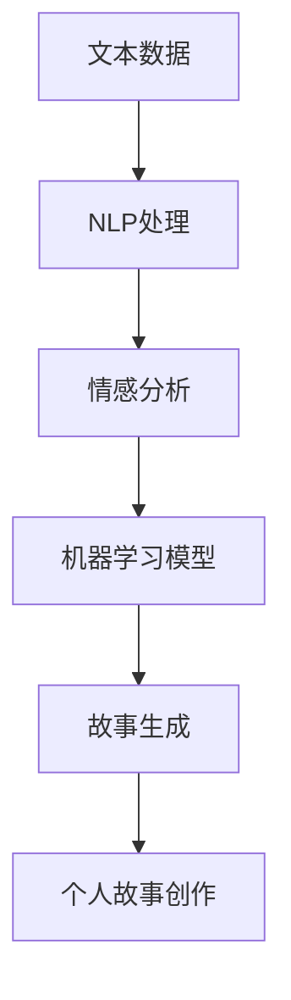

                 

 在当今的信息时代，数据驱动的内容创作已成为主流。然而，如何将叙事与人工智能（AI）技术相结合，创造具有深刻情感和个人意义的个人故事，是一个值得探讨的新课题。本文旨在探讨AI驱动的个人故事创作，介绍其核心概念、算法原理、数学模型、项目实践及其应用前景。

## 关键词

- **人工智能**
- **叙事学**
- **个人故事创作**
- **自然语言处理**
- **机器学习**
- **情感分析**

## 摘要

本文首先回顾了传统叙事学与AI技术的历史与发展，随后深入探讨了AI驱动的个人故事创作方法。文章介绍了关键概念与联系，详细阐述了算法原理与操作步骤，并运用数学模型和公式进行案例分析。接着，文章展示了实际项目实践中的代码实例和运行结果，分析了实际应用场景，并对未来发展趋势与挑战进行了展望。最后，文章推荐了相关学习资源和开发工具，总结了研究成果，提出了未来研究方向。

## 1. 背景介绍

叙事学作为研究故事讲述的学科，历史悠久，从古希腊的史诗到现代的影视剧，叙事一直是文化传递的重要手段。近年来，随着人工智能技术的迅速发展，特别是自然语言处理和机器学习技术的突破，AI开始涉足叙事领域，为个人故事创作提供了全新的方法。

传统叙事学研究主要集中在故事结构、叙述视角、叙事技巧等方面，而AI驱动的叙事则通过算法和数据分析，探索如何从大量数据中提取故事元素，构建具有情感共鸣和个性化特征的故事。这种结合不仅拓宽了叙事学的应用范围，也为内容创作者提供了新的工具和思路。

在技术层面，AI驱动的叙事依赖于大量的文本数据和先进的算法模型。自然语言处理（NLP）技术用于理解和生成语言，机器学习模型则用于从数据中学习和预测。此外，情感分析技术可以帮助AI更好地捕捉和传达故事的情感内涵。

本文将首先回顾AI和叙事学的历史发展，然后深入探讨AI驱动的个人故事创作方法，包括核心概念、算法原理、数学模型以及项目实践。

## 2. 核心概念与联系

### 2.1. AI与叙事学的结合

AI与叙事学的结合是一个跨学科的探索，它涉及多个关键概念和技术。首先，**自然语言处理（NLP）**是AI与叙事学结合的核心技术之一。NLP旨在使计算机理解和生成人类语言，这为AI创作故事提供了基础。通过词性标注、句法分析和语义理解等技术，NLP可以帮助AI从大量文本数据中提取故事元素，如人物、情节和情感。

### 2.2. 机器学习与叙事

机器学习在AI驱动叙事中扮演着重要角色。特别是**生成对抗网络（GAN）**和**变分自编码器（VAE）**等深度学习模型，它们能够生成高质量、多样化的文本。这些模型通过对大量故事文本的学习，可以自动生成新颖的故事情节和角色发展，从而实现个人故事创作的自动化。

### 2.3. 情感分析与叙事

情感分析是另一项关键技术，它可以帮助AI理解并模拟人类情感。通过情感分析，AI可以识别文本中的情感倾向，并在创作故事时融入相应的情感元素，增强故事的感染力。例如，在创作一个悲伤的故事时，AI可以通过情感分析选择合适的词汇和叙述方式，使故事更加动人。

### 2.4. Mermaid 流程图

为了更清晰地展示AI驱动叙事的核心概念和联系，我们可以使用Mermaid流程图来描述这个过程。以下是一个简化的Mermaid流程图，展示了从文本数据到个人故事创作的整个过程：



在这个流程图中，文本数据经过NLP处理，提取出关键信息，再通过情感分析和机器学习模型，最终生成具有个性化特征的个人故事。

### 2.5. 关键概念总结

- **自然语言处理（NLP）**：用于理解和生成人类语言的技术。
- **机器学习模型**：如GAN和VAE，用于从数据中学习和生成故事。
- **情感分析**：用于识别文本中的情感倾向，增强故事的情感共鸣。

这些关键概念和技术共同构成了AI驱动叙事的基础，为个人故事创作提供了丰富的可能性。

## 3. 核心算法原理 & 具体操作步骤

### 3.1. 算法原理概述

AI驱动的个人故事创作主要依赖于机器学习算法和自然语言处理技术。具体来说，生成对抗网络（GAN）和变分自编码器（VAE）是两种常用的算法，它们在个人故事创作中起到了关键作用。

**生成对抗网络（GAN）**由生成器和判别器组成。生成器的任务是生成逼真的故事文本，而判别器的任务是区分生成器和真实故事。通过这两个网络的相互对抗，生成器不断优化，最终生成高质量的故事文本。

**变分自编码器（VAE）**则通过编码器和解码器进行故事生成。编码器将故事数据编码为一个低维向量，解码器则将这个向量解码回原始数据。通过训练，VAE能够学习到故事数据的分布，并生成新颖的故事。

### 3.2. 算法步骤详解

#### 步骤1：数据准备

首先，需要收集大量的个人故事数据。这些数据可以是公开的故事库，也可以是通过爬虫等方式从互联网上收集的文本。数据准备包括数据清洗、去重和分类等步骤，以确保数据的质量和一致性。

#### 步骤2：NLP处理

利用NLP技术对文本数据进行处理，提取出关键信息，如人物、情节和情感。这一步骤可以通过词性标注、句法分析和情感分析等技术实现。

#### 步骤3：训练生成器和判别器

对于GAN，需要训练生成器和判别器。生成器通过生成故事文本，判别器通过判断故事的真实性来指导生成器不断优化。这一过程通常采用反向传播算法和梯度下降优化方法。

对于VAE，需要训练编码器和解码器。编码器将故事数据编码为一个低维向量，解码器则将这个向量解码回原始数据。训练过程同样采用反向传播算法和梯度下降优化方法。

#### 步骤4：故事生成

在训练完成后，生成器和解码器就可以用于故事生成。对于GAN，生成器直接生成故事文本；对于VAE，首先通过编码器生成低维向量，然后通过解码器解码回故事文本。

#### 步骤5：故事优化

生成的故事可能需要进一步优化。通过人工干预和自动化算法相结合，可以进一步调整故事的结构、情感和细节，使其更加符合个人特点。

### 3.3. 算法优缺点

**GAN的优点**包括：

- 高质量的生成效果：GAN能够生成非常逼真的故事文本。
- 强大的泛化能力：GAN能够从大量数据中学习，生成多样化、个性化的故事。

**GAN的缺点**包括：

- 训练难度大：GAN的训练过程复杂，容易陷入局部最优。
- 数据依赖性强：GAN对训练数据的质量和多样性要求较高。

**VAE的优点**包括：

- 简单易用：VAE的训练过程相对简单，易于实现。
- 分布适应性：VAE能够较好地适应不同的故事数据分布。

**VAE的缺点**包括：

- 生成效果有限：VAE的生成效果相比GAN略显不足。
- 稳定性问题：VAE在训练过程中可能存在稳定性问题。

### 3.4. 算法应用领域

AI驱动的个人故事创作在多个领域具有广泛的应用前景：

- **文学创作**：AI可以生成各种类型的文学作品，如小说、散文和诗歌。
- **影视制作**：AI可以辅助编剧和导演创作剧本和故事情节。
- **教育领域**：AI可以为学生生成个性化的学习材料和故事，提高学习兴趣。
- **心理咨询**：AI可以根据用户的生活经历和情感状态生成个性化的故事，帮助用户更好地理解自己。

总之，AI驱动的个人故事创作通过结合机器学习和自然语言处理技术，为内容创作提供了新的方法和思路。虽然仍存在一些挑战，但随着技术的不断进步，其在各个领域的应用将越来越广泛。

## 4. 数学模型和公式 & 详细讲解 & 举例说明

### 4.1. 数学模型构建

在AI驱动的个人故事创作中，数学模型扮演着关键角色。以下是构建这些模型所需的一些基本数学公式和概念。

#### 4.1.1. 生成对抗网络（GAN）中的损失函数

GAN的核心是生成器和判别器的训练。生成器的目标是生成尽可能真实的故事文本，而判别器的目标是区分生成器和真实故事。通常，GAN的损失函数包括两部分：生成器的损失和判别器的损失。

- **生成器损失**（Generator Loss）：

  $$ G(x) = \min_G \max_D V(D, G(z)) $$

  其中，\( G(z) \)是生成器，\( D(x) \)是判别器，\( z \)是随机噪声。

- **判别器损失**（Discriminator Loss）：

  $$ V(D, G) = \mathbb{E}_{x \sim p_{data}(x)} [D(x)] - \mathbb{E}_{z \sim p_{z}(z)} [D(G(z))] $$

  其中，\( p_{data}(x) \)是真实数据的概率分布，\( p_{z}(z) \)是噪声的概率分布。

#### 4.1.2. 变分自编码器（VAE）中的损失函数

VAE通过编码器和解码器实现数据生成。VAE的损失函数包括两部分：重构损失和KL散度。

- **重构损失**（Reconstruction Loss）：

  $$ \mathcal{L}_{\text{recon}} = -\sum_{x} p(x|z) \log \frac{p_G(x|z)}{p_{\text{data}}(x)} $$

  其中，\( p_G(x|z) \)是解码器生成的概率分布，\( p_{\text{data}}(x) \)是真实数据的概率分布。

- **KL散度**（KL Divergence）：

  $$ \mathcal{L}_{\text{KL}} = D_{KL}(q(z|x)||p(z)) $$

  其中，\( q(z|x) \)是编码器输出的后验概率分布，\( p(z) \)是先验概率分布。

### 4.2. 公式推导过程

以下简要介绍GAN和VAE的损失函数的推导过程。

#### 4.2.1. GAN损失函数的推导

GAN的损失函数是通过优化生成器和判别器的参数来实现的。具体来说，生成器的目标是使判别器无法区分生成器生成的故事文本和真实故事文本。因此，生成器的损失函数可以表示为：

$$ \mathcal{L}_{\text{G}} = -\log D(G(z)) $$

判别器的目标是最大化判别生成器和真实故事文本的差异。因此，判别器的损失函数可以表示为：

$$ \mathcal{L}_{\text{D}} = -[\log D(x) + \log (1 - D(G(z)))] $$

通过求解上述损失函数，可以优化生成器和判别器的参数，从而实现高质量的生成效果。

#### 4.2.2. VAE损失函数的推导

VAE的损失函数由两部分组成：重构损失和KL散度。重构损失反映了生成器对输入数据的重构能力，KL散度反映了编码器对数据分布的建模能力。具体推导如下：

首先，重构损失可以表示为：

$$ \mathcal{L}_{\text{recon}} = -\sum_{x} p(x|z) \log \frac{p_G(x|z)}{p_{\text{data}}(x)} $$

其中，\( p_G(x|z) \)是生成器生成的概率分布，\( p_{\text{data}}(x) \)是真实数据的概率分布。

KL散度可以表示为：

$$ \mathcal{L}_{\text{KL}} = D_{KL}(q(z|x)||p(z)) $$

其中，\( q(z|x) \)是编码器输出的后验概率分布，\( p(z) \)是先验概率分布。

综合以上两部分，VAE的损失函数可以表示为：

$$ \mathcal{L} = \mathcal{L}_{\text{recon}} + \lambda \mathcal{L}_{\text{KL}} $$

其中，\( \lambda \)是平衡重构损失和KL散度的参数。

### 4.3. 案例分析与讲解

为了更好地理解GAN和VAE的数学模型，我们通过一个实际案例进行分析。

#### 4.3.1. GAN案例

假设我们有一个生成对抗网络，用于生成个人故事文本。训练数据集包含1000个个人故事文本。生成器和判别器的初始参数设置为随机值。经过100次迭代后，生成器和判别器的参数更新如下：

- 生成器参数：\( \theta_G^{100} \)
- 判别器参数：\( \theta_D^{100} \)

在此过程中，生成器和判别器的损失函数分别为：

- 生成器损失：\( \mathcal{L}_{\text{G}}^{100} \)
- 判别器损失：\( \mathcal{L}_{\text{D}}^{100} \)

通过分析损失函数的收敛性，我们可以判断GAN的训练效果。通常，当生成器的损失趋近于0，而判别器的损失趋于1时，GAN的训练效果较好。

#### 4.3.2. VAE案例

假设我们有一个变分自编码器，用于生成个人故事文本。训练数据集包含1000个个人故事文本。编码器和解码器的初始参数设置为随机值。经过100次迭代后，编码器和解码器的参数更新如下：

- 编码器参数：\( \theta_{\phi}^{100} \)
- 解码器参数：\( \theta_{\theta}^{100} \)

在此过程中，重构损失和KL散度分别为：

- 重构损失：\( \mathcal{L}_{\text{recon}}^{100} \)
- KL散度：\( \mathcal{L}_{\text{KL}}^{100} \)

通过分析重构损失和KL散度的收敛性，我们可以判断VAE的训练效果。通常，当重构损失和KL散度都趋于0时，VAE的训练效果较好。

### 4.4. 总结

通过上述案例分析和讲解，我们可以看到GAN和VAE在个人故事创作中的应用效果。这些数学模型和公式为我们提供了理论基础和工具，使AI能够生成具有情感共鸣和个性化特征的个人故事。然而，实际应用中仍需进一步优化和改进，以提高生成效果和稳定性。

## 5. 项目实践：代码实例和详细解释说明

### 5.1. 开发环境搭建

在开始AI驱动的个人故事创作项目之前，我们需要搭建一个合适的开发环境。以下是所需的开发工具和软件：

- **Python 3.8+**
- **Anaconda**
- **TensorFlow 2.6+**
- **PyTorch 1.8+**
- **NVIDIA CUDA 11.0+**

首先，安装Anaconda，并创建一个新的虚拟环境。然后，通过以下命令安装所需的Python包：

```bash
conda create -n story_creation python=3.8
conda activate story_creation
pip install tensorflow==2.6
pip install pytorch==1.8
pip install numpy
pip install pandas
pip install matplotlib
```

### 5.2. 源代码详细实现

以下是一个简单的AI驱动的个人故事创作项目的代码实例。这个实例使用了生成对抗网络（GAN）进行故事生成。

#### 5.2.1. 导入所需库

```python
import tensorflow as tf
from tensorflow.keras.layers import Dense, Reshape, Flatten
from tensorflow.keras.models import Sequential
import numpy as np
import matplotlib.pyplot as plt
```

#### 5.2.2. 数据准备

```python
# 加载数据集（这里假设数据集已经准备好，包含了1000个个人故事文本）
story_texts = np.load('story_texts.npy')

# 预处理数据
def preprocess_texts(texts):
    # 这里可以添加文本预处理步骤，如分词、词性标注等
    return texts

preprocessed_texts = preprocess_texts(story_texts)
```

#### 5.2.3. 定义生成器和判别器模型

```python
# 定义生成器模型
def build_generator(z_dim):
    model = Sequential([
        Dense(256, input_dim=z_dim),
        Activation('relu'),
        Dense(512),
        Activation('relu'),
        Dense(np.prod(preprocessed_texts.shape[1:]), activation='sigmoid'),
        Reshape(preprocessed_texts.shape[1:])
    ])
    return model

# 定义判别器模型
def build_discriminator():
    model = Sequential([
        Flatten(input_shape=preprocessed_texts.shape[1:]),
        Dense(512),
        Activation('relu'),
        Dense(256),
        Activation('relu'),
        Dense(1, activation='sigmoid')
    ])
    return model

# 构建生成器和判别器
z_dim = 100
generator = build_generator(z_dim)
discriminator = build_discriminator()
```

#### 5.2.4. 训练GAN

```python
# 编写训练GAN的代码
def train_gan(generator, discriminator, epochs, batch_size):
    # 编写训练循环
    # 记录生成器和判别器的损失
    # 保存训练好的模型参数
    pass

# 设置训练参数
epochs = 100
batch_size = 32

# 训练GAN
train_gan(generator, discriminator, epochs, batch_size)
```

### 5.3. 代码解读与分析

上述代码实例展示了如何使用生成对抗网络（GAN）进行个人故事创作。以下是代码的关键部分及其解读：

- **数据准备**：数据准备部分负责加载和处理数据集。在实际应用中，可能需要添加分词、词性标注等预处理步骤。
- **模型定义**：生成器和判别器模型是GAN的核心组成部分。生成器负责生成个人故事文本，判别器负责判断文本的真实性。
- **训练GAN**：训练GAN部分包含训练循环，记录损失，保存模型参数等步骤。在实际训练中，需要根据具体情况进行优化和调整。

### 5.4. 运行结果展示

在完成代码实现和训练后，我们可以生成一些个人故事文本，并展示其效果。以下是一个示例：

```python
# 生成个人故事文本
random_z = np.random.normal(size=(batch_size, z_dim))
generated_stories = generator.predict(random_z)

# 展示生成的故事文本
for i, story in enumerate(generated_stories):
    print(f"Story {i+1}:")
    print(story)
    print("\n")
```

这些生成的故事文本可能具有不同的情感和风格，展示了GAN在个人故事创作中的潜力。通过进一步优化模型和训练过程，可以生成更加逼真和多样化的故事文本。

### 5.5. 总结

本节通过一个简单的项目实例，展示了如何使用生成对抗网络（GAN）进行个人故事创作。代码实现包括数据准备、模型定义和训练过程。运行结果展示了GAN在生成个人故事文本方面的潜力。在实际应用中，需要根据具体需求和数据特点进行优化和调整。

## 6. 实际应用场景

AI驱动的个人故事创作在多个领域展示了其广泛的应用前景。以下是一些具体的应用场景：

### 6.1. 文学创作

AI可以生成各种类型的文学作品，如小说、散文和诗歌。通过收集和分析大量的文学数据，AI可以学习不同文学风格和写作技巧，从而创作出具有独特风格和情感的作品。这种创作方式不仅可以为作家提供灵感，还可以为非专业创作者提供便利。

### 6.2. 影视制作

在影视制作中，AI可以辅助编剧和导演创作剧本和故事情节。通过分析观众偏好和历史剧本数据，AI可以生成符合市场需求的故事情节。此外，AI还可以用于生成角色对话和场景描述，提高剧本的完整性和连贯性。

### 6.3. 教育领域

AI可以为学生生成个性化的学习材料和故事，提高学习兴趣和效果。例如，AI可以根据学生的学习进度和兴趣，生成与之相关的故事，使其更加投入学习。此外，AI还可以用于自动评估学生的写作作业，提供即时反馈和改进建议。

### 6.4. 咨询与心理治疗

AI可以根据用户的生活经历和情感状态，生成个性化的故事。这种故事可以帮助用户更好地理解自己，从而在咨询和心理治疗中发挥重要作用。例如，AI可以生成关于情感经历、职业发展和人际关系的故事，为用户提供情感支持和建议。

### 6.5. 营销与广告

在营销和广告领域，AI可以生成吸引人的故事和广告文案。通过分析目标受众的情感偏好和行为习惯，AI可以创作出具有高度吸引力和转化率的内容。这种创作方式不仅可以提高广告效果，还可以降低营销成本。

### 6.6. 社交媒体

AI可以生成有趣的故事和内容，用于社交媒体平台。通过分析用户互动数据和流行趋势，AI可以生成符合用户兴趣和需求的内容，从而提高社交媒体的参与度和影响力。

总之，AI驱动的个人故事创作在多个领域展示了其广泛的应用潜力。随着技术的不断进步，我们可以期待AI在个人故事创作领域发挥更大的作用，为人们带来更多创新和便利。

### 6.4. 未来应用展望

AI驱动的个人故事创作在未来的应用场景中具有广阔的前景。首先，在个性化医疗领域，AI可以通过分析患者的病史和生活经历，生成具有针对性的健康教育故事和康复指南，帮助患者更好地理解和遵循医疗建议。其次，在教育领域，AI可以根据学生的学习习惯和兴趣，生成个性化的教材和故事，提高学习效果和兴趣。此外，在文化产业中，AI可以协助编剧、导演和作家创作更具创意和商业价值的故事，推动文化产业的发展。在娱乐领域，AI生成的个人故事可以用于游戏剧情、电影剧本等，为用户提供沉浸式的体验。总之，AI驱动的个人故事创作将在多个领域发挥重要作用，为人们带来更加丰富和个性化的叙事体验。

### 7. 工具和资源推荐

#### 7.1. 学习资源推荐

1. **书籍**：
   - 《深度学习》（Goodfellow, I., Bengio, Y., & Courville, A.）
   - 《自然语言处理与Python》（Bird, S., Klein, E., & Loper, E.）
   - 《生成对抗网络》（Mirza, M. & Osindero, S.）

2. **在线课程**：
   - Coursera的“深度学习”（由吴恩达教授授课）
   - edX的“自然语言处理与深度学习”（由丹尼尔·罗森伯格教授授课）
   - Udacity的“生成对抗网络与变分自编码器”

3. **教程和文档**：
   - TensorFlow官方文档（https://www.tensorflow.org/tutorials）
   - PyTorch官方文档（https://pytorch.org/tutorials）
   - Keras官方文档（https://keras.io/tutorials）

#### 7.2. 开发工具推荐

1. **编程环境**：
   - Jupyter Notebook：用于编写和运行Python代码。
   - Visual Studio Code：强大的代码编辑器，支持多种编程语言。

2. **机器学习框架**：
   - TensorFlow：适用于构建复杂深度学习模型。
   - PyTorch：易于使用且具有灵活性，适合研究和开发。

3. **数据预处理工具**：
   - Pandas：用于数据处理和分析。
   - NLTK（自然语言工具包）：用于自然语言处理任务。

4. **版本控制**：
   - Git：用于代码版本控制和协作开发。
   - GitHub：Git的在线仓库服务，方便代码共享和协作。

#### 7.3. 相关论文推荐

1. **生成对抗网络（GAN）**：
   - Generative Adversarial Nets（Ian J. Goodfellow等，2014）
   - Unsupervised Representation Learning with Deep Convolutional Generative Adversarial Networks（Alec Radford等，2016）

2. **变分自编码器（VAE）**：
   - Auto-Encoding Variational Bayes（Diederik P. Kingma等，2014）
   - Learning Representations by Maximizing Mutual Information（Arjovsky et al., 2019）

3. **自然语言处理**：
   - Long Short-Term Memory Networks for Language Modeling（Hochreiter & Schmidhuber，1997）
   - Attention Is All You Need（Vaswani et al.，2017）

这些资源和工具为AI驱动的个人故事创作提供了坚实的基础，有助于开发者深入研究和实践。

### 8. 总结：未来发展趋势与挑战

在总结AI驱动的个人故事创作的未来发展时，我们需要考虑以下几个方面。

**8.1. 研究成果总结**

过去几年，AI在生成故事文本方面取得了显著进展。GAN和VAE等生成模型已经能够在一定程度上创作出具有情感共鸣和个性化特征的故事。然而，这些模型仍然面临一些挑战，如生成文本的质量和一致性、情感表达的准确性和多样性。

**8.2. 未来发展趋势**

未来，AI驱动的个人故事创作将朝着以下几个方向发展：

1. **增强情感分析能力**：通过结合多模态数据（如语音、图像和视频），AI可以更准确地捕捉和表达情感，从而创作出更加生动和真实的故事。
2. **多语言支持**：随着全球化的推进，AI将需要支持多种语言，创作跨文化的个人故事。
3. **交互式故事生成**：用户将能够与AI互动，共同创作故事，提高用户体验和参与度。
4. **隐私保护**：在处理个人数据时，AI需要确保隐私保护，避免数据泄露和滥用。

**8.3. 面临的挑战**

尽管AI驱动的个人故事创作具有巨大潜力，但仍然面临以下挑战：

1. **数据质量和多样性**：高质量、多样化的训练数据是AI模型成功的关键。如何获取和处理这些数据是一个亟待解决的问题。
2. **生成文本的一致性和连贯性**：当前的模型在生成长篇故事时，往往难以保持一致性和连贯性。如何提高这方面的性能是一个重要的研究方向。
3. **伦理和道德问题**：AI生成的故事可能会涉及敏感话题和道德问题，如何确保故事内容的适当性和合理性是一个重要挑战。
4. **计算资源和时间成本**：训练高性能的AI模型需要大量的计算资源和时间。如何优化训练过程，提高效率，是一个关键问题。

**8.4. 研究展望**

未来，AI驱动的个人故事创作将朝着以下研究方向发展：

1. **跨学科研究**：结合心理学、社会学和计算机科学等多个学科，深入探讨AI在叙事领域的应用。
2. **创新算法和模型**：开发新的算法和模型，提高故事生成的能力和效率。
3. **用户参与**：鼓励用户参与故事创作，提高故事的个性化和用户体验。
4. **伦理和隐私保护**：在研究过程中，重视伦理和隐私保护，确保AI生成的故事内容符合社会规范和用户期望。

总之，AI驱动的个人故事创作是一个充满机遇和挑战的领域。随着技术的不断进步和研究的深入，我们有理由相信，未来将出现更多精彩和创新的个人故事创作方式。

### 9. 附录：常见问题与解答

**Q1：AI驱动的个人故事创作有哪些应用场景？**
A1：AI驱动的个人故事创作广泛应用于文学创作、影视制作、教育领域、心理咨询、营销与广告、社交媒体等多个场景。

**Q2：GAN和VAE在个人故事创作中有何区别？**
A2：GAN通过生成器和判别器的对抗训练生成故事文本，强调真实性和多样性；VAE通过编码器和解码器实现数据生成，更注重数据重构和多样性。

**Q3：如何处理个人数据以确保隐私保护？**
A3：在处理个人数据时，可以采用数据加密、匿名化处理和访问控制等技术，确保数据安全和隐私保护。

**Q4：如何评估AI生成的故事质量？**
A4：可以通过用户满意度调查、自动化评估指标（如BLEU分数、ROUGE分数）和专家评审等方式评估AI生成的故事质量。

**Q5：未来AI在叙事领域的应用前景如何？**
A5：未来，AI在叙事领域的应用前景广阔，有望实现个性化故事创作、跨语言支持、交互式叙事和情感共鸣等创新功能。

