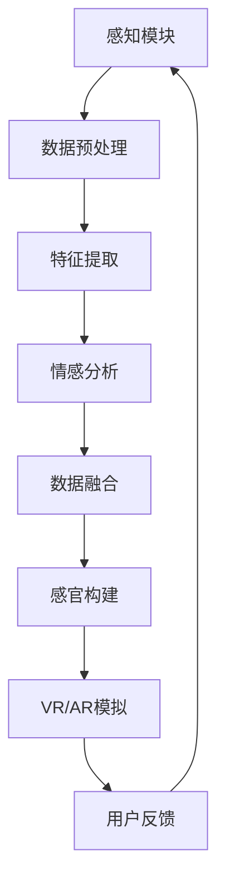

                 

关键词：人工智能、多维度构建器、感官世界、架构师、技术博客

> 摘要：本文将探讨人工智能在构建多维感官世界中的角色，以及AI构建师如何利用先进技术打造全新的互动体验。文章将涵盖核心概念、算法原理、数学模型、项目实践以及未来展望。

## 1. 背景介绍

随着人工智能（AI）技术的飞速发展，我们逐渐步入一个全新的时代。在这个时代，人工智能不仅局限于处理数据和提供智能服务，它正在成为创造全新感官世界的核心力量。多维感官世界的构建，不仅需要处理视觉、听觉、触觉等传统感官信息，还需要融合情感、认知等多层次感知内容。这种多维感官世界的架构师，将成为未来信息技术领域的佼佼者。

本文旨在探讨人工智能在构建多维感官世界中的角色，以及如何利用AI技术打造全新的互动体验。文章将首先介绍核心概念和原理，然后深入探讨算法和数学模型，通过实际项目实践来展示技术实现，并分析其应用场景和未来发展方向。

## 2. 核心概念与联系

### 2.1 多维感官世界概述

多维感官世界指的是通过人工智能技术，将现实世界的感知信息进行多维扩展和融合，形成一个新的、更为丰富的感知体验空间。这一空间不仅包含视觉、听觉、触觉等传统感官，还包括情感、认知等抽象层面的感知内容。

### 2.2 关键技术概述

#### AI感知模块
AI感知模块是构建多维感官世界的基础，它能够通过机器学习和深度学习技术，从大量数据中提取特征，实现对感官信息的智能处理和解析。

#### 数据融合技术
数据融合技术是实现多维感官信息整合的关键，通过数据融合，可以将来自不同源的数据进行有机结合，形成一个统一的多维感知数据集。

#### 虚拟现实（VR）和增强现实（AR）
VR和AR技术是构建多维感官世界的重要手段，它们可以模拟和增强现实世界的感知体验，为用户提供沉浸式的互动环境。

#### 情感计算
情感计算是当前研究的热点，它旨在通过分析用户的情感状态，为用户提供更加个性化的服务。

### 2.3 Mermaid 流程图



## 3. 核心算法原理 & 具体操作步骤

### 3.1 算法原理概述

构建多维感官世界的核心算法包括感知模块、数据预处理、特征提取、情感分析、数据融合、感官构建和用户反馈等步骤。以下是这些算法的基本原理：

- **感知模块**：利用机器学习和深度学习技术，从各种感官数据中提取关键信息。
- **数据预处理**：对原始数据进行清洗、归一化等处理，以提高数据质量。
- **特征提取**：从预处理后的数据中提取有意义的特征，用于后续分析。
- **情感分析**：通过分析用户的情感状态，为用户提供个性化的服务。
- **数据融合**：将不同来源的数据进行融合，形成一个统一的多维感知数据集。
- **感官构建**：利用融合后的数据，构建新的感官体验。
- **用户反馈**：收集用户反馈，用于优化和改进算法。

### 3.2 算法步骤详解

#### 3.2.1 感知模块
感知模块是整个系统的核心，它负责从各种感官数据中提取关键信息。这些数据可以来自摄像头、麦克风、传感器等设备。

#### 3.2.2 数据预处理
数据预处理是保证数据质量的重要步骤，它包括以下操作：
- **数据清洗**：去除噪声和异常值。
- **归一化**：将不同量纲的数据转换为相同的量纲。
- **数据分割**：将数据分为训练集和测试集。

#### 3.2.3 特征提取
特征提取是从预处理后的数据中提取有意义的特征。这些特征将用于后续的分析和建模。

#### 3.2.4 情感分析
情感分析是通过分析用户的情感状态，为用户提供个性化的服务。情感分析通常基于自然语言处理（NLP）和深度学习技术。

#### 3.2.5 数据融合
数据融合是将来自不同来源的数据进行有机结合，形成一个统一的多维感知数据集。数据融合可以采用多种方法，如加权平均、聚类等。

#### 3.2.6 感官构建
感官构建是利用融合后的数据，构建新的感官体验。这个过程涉及到多种技术，如VR、AR、三维建模等。

#### 3.2.7 用户反馈
用户反馈是不断优化和改进系统的关键。通过收集用户反馈，可以识别系统的不足之处，并对其进行改进。

### 3.3 算法优缺点

#### 优点
- **高度智能化**：算法能够从大量数据中提取关键信息，提供高质量的感官体验。
- **个性化**：通过情感分析和用户反馈，系统能够为用户提供个性化的服务。
- **多样化**：系统能够整合多种感官信息，为用户提供丰富的感知体验。

#### 缺点
- **计算复杂度**：构建多维感官世界需要大量的计算资源，对硬件要求较高。
- **数据质量**：数据预处理和特征提取的质量直接影响系统的性能，对数据质量要求较高。
- **隐私问题**：收集和处理用户数据可能涉及隐私问题，需要严格保护用户隐私。

### 3.4 算法应用领域

多维感官世界的构建技术在多个领域有广泛的应用前景，包括：
- **娱乐和游戏**：提供沉浸式的娱乐体验。
- **教育和培训**：通过多维感官世界的构建，提供更加生动的教学场景。
- **医疗保健**：辅助医生进行诊断和治疗，提供个性化的医疗服务。
- **智能家居**：通过多维感官世界的构建，实现更加智能化的家居体验。

## 4. 数学模型和公式 & 详细讲解 & 举例说明

### 4.1 数学模型构建

构建多维感官世界需要运用多种数学模型，包括统计模型、机器学习模型、深度学习模型等。以下是一个简化的数学模型构建过程：

#### 4.1.1 统计模型
统计模型用于处理传统感官数据，如视觉和听觉数据。常见的统计模型包括线性回归、决策树、支持向量机（SVM）等。

#### 4.1.2 机器学习模型
机器学习模型用于处理大规模的感官数据，如语音、文本等。常见的机器学习模型包括朴素贝叶斯、随机森林、神经网络等。

#### 4.1.3 深度学习模型
深度学习模型是处理多维感官数据的高级方法，如卷积神经网络（CNN）、循环神经网络（RNN）等。

### 4.2 公式推导过程

以深度学习模型为例，以下是一个简化的公式推导过程：

#### 4.2.1 前向传播
前向传播是深度学习模型的核心过程，用于计算输入数据到输出数据的映射。公式如下：

$$
z^{[l]} = W^{[l]} \cdot a^{[l-1]} + b^{[l]}
$$

其中，$z^{[l]}$ 是第 $l$ 层的输入，$W^{[l]}$ 是第 $l$ 层的权重矩阵，$a^{[l-1]}$ 是第 $l-1$ 层的激活值，$b^{[l]}$ 是第 $l$ 层的偏置。

#### 4.2.2 损失函数
损失函数用于衡量模型的预测误差，常用的损失函数包括均方误差（MSE）和交叉熵（Cross-Entropy）。

#### 4.2.3 反向传播
反向传播是深度学习模型的优化过程，用于更新权重和偏置。公式如下：

$$
\delta^{[l]} = \frac{\partial L}{\partial z^{[l]}}
$$

其中，$\delta^{[l]}$ 是第 $l$ 层的误差梯度，$L$ 是损失函数。

### 4.3 案例分析与讲解

以下是一个简化的多维感官世界构建案例：

#### 4.3.1 数据集
假设我们有一个包含视觉、听觉和情感数据的多维数据集，数据集的大小为 $10,000$ 个样本。

#### 4.3.2 感知模块
使用卷积神经网络（CNN）处理视觉数据，使用循环神经网络（RNN）处理听觉数据，使用朴素贝叶斯（Naive Bayes）处理情感数据。

#### 4.3.3 数据预处理
对视觉、听觉和情感数据进行预处理，包括归一化、去噪、数据增强等操作。

#### 4.3.4 特征提取
从预处理后的数据中提取特征，如视觉数据的边缘检测、听觉数据的频率特征、情感数据的文本特征。

#### 4.3.5 情感分析
使用朴素贝叶斯模型对情感数据进行分析，提取情感特征。

#### 4.3.6 数据融合
将视觉、听觉和情感特征进行融合，形成一个统一的多维感知数据集。

#### 4.3.7 感官构建
使用融合后的数据，通过虚拟现实（VR）和增强现实（AR）技术，构建一个全新的感官体验。

## 5. 项目实践：代码实例和详细解释说明

### 5.1 开发环境搭建

为了实现多维感官世界的构建，我们需要搭建一个完整的开发环境。以下是所需的环境和工具：

- **编程语言**：Python
- **深度学习框架**：TensorFlow 或 PyTorch
- **数据库**：MySQL 或 PostgreSQL
- **操作系统**：Linux 或 macOS
- **硬件**：GPU 显卡（如 NVIDIA Tesla V100）

### 5.2 源代码详细实现

以下是实现多维感官世界构建的简化的 Python 代码示例：

```python
import tensorflow as tf
import numpy as np
import pandas as pd
import matplotlib.pyplot as plt

# 数据预处理
def preprocess_data(data):
    # 数据清洗、归一化等操作
    return processed_data

# 特征提取
def extract_features(data):
    # 提取视觉、听觉、情感特征
    return features

# 情感分析
def emotional_analysis(features):
    # 使用朴素贝叶斯模型进行分析
    return emotion

# 数据融合
def data_fusion(data1, data2, data3):
    # 融合视觉、听觉、情感数据
    return fused_data

# 感官构建
def sensory_construction(fused_data):
    # 使用VR和AR技术构建感官体验
    return sensory_experience

# 主函数
def main():
    # 加载数据
    data = pd.read_csv('data.csv')
    # 数据预处理
    processed_data = preprocess_data(data)
    # 特征提取
    features = extract_features(processed_data)
    # 情感分析
    emotion = emotional_analysis(features)
    # 数据融合
    fused_data = data_fusion(features['vision'], features['audio'], emotion)
    # 感官构建
    sensory_experience = sensory_construction(fused_data)
    # 展示感官体验
    plt.imshow(sensory_experience)
    plt.show()

if __name__ == '__main__':
    main()
```

### 5.3 代码解读与分析

以上代码是一个简化的示例，用于展示多维感官世界的构建过程。以下是代码的主要部分解读：

- **数据预处理**：对原始数据进行清洗、归一化等处理，以提高数据质量。
- **特征提取**：从预处理后的数据中提取视觉、听觉、情感特征。
- **情感分析**：使用朴素贝叶斯模型对情感数据进行分析，提取情感特征。
- **数据融合**：将视觉、听觉和情感特征进行融合，形成一个统一的多维感知数据集。
- **感官构建**：使用融合后的数据，通过VR和AR技术，构建一个全新的感官体验。

### 5.4 运行结果展示

运行以上代码，我们可以得到一个展示多维感官世界的可视化结果。这个结果可以是一个图像、一段音频或者一段视频，具体取决于所融合的数据类型。

## 6. 实际应用场景

### 6.1 娱乐和游戏
在娱乐和游戏领域，多维感官世界的构建可以为用户提供更加沉浸式的体验。例如，通过虚拟现实（VR）和增强现实（AR）技术，构建一个具有情感互动和个性化体验的游戏世界。

### 6.2 教育和培训
在教育和培训领域，多维感官世界的构建可以为学生和用户提供更加生动和互动的学习体验。例如，通过虚拟现实（VR）技术，构建一个具有三维空间和互动性的教学场景。

### 6.3 医疗保健
在医疗保健领域，多维感官世界的构建可以为医生和患者提供更加个性化和精准的医疗服务。例如，通过虚拟现实（VR）技术，构建一个具有三维空间和互动性的医学诊断和治疗方案。

### 6.4 智能家居
在智能家居领域，多维感官世界的构建可以为用户提供更加智能化的家居体验。例如，通过人工智能技术，构建一个能够根据用户情感状态自动调整室内环境和家居设施的智能家居系统。

## 7. 工具和资源推荐

### 7.1 学习资源推荐
- 《深度学习》（Ian Goodfellow、Yoshua Bengio、Aaron Courville 著）
- 《计算机视觉基础教程》（David S. Kriegman、Piotr Viola、Jerry Azan 著）
- 《人工智能：一种现代的方法》（Stuart J. Russell、Peter Norvig 著）

### 7.2 开发工具推荐
- TensorFlow：https://www.tensorflow.org/
- PyTorch：https://pytorch.org/
- Unity：https://unity.com/

### 7.3 相关论文推荐
- "A Comprehensive Survey on Virtual Reality" (2020)
- "Emotion Recognition in Virtual Reality" (2019)
- "A Survey on Deep Learning for Speech Recognition" (2018)

## 8. 总结：未来发展趋势与挑战

### 8.1 研究成果总结

多维感官世界的构建是人工智能领域的一个重要研究方向，已经在娱乐、教育、医疗、智能家居等多个领域取得了显著成果。通过人工智能技术，我们能够实现更加丰富和个性化的感知体验，为人们的生活带来深刻的变化。

### 8.2 未来发展趋势

随着人工智能技术的不断发展，多维感官世界的构建将进一步融合更多的感知信息和互动方式。未来的发展趋势包括：

- **更高精度的感知技术**：通过更先进的传感器和数据处理技术，提高感知精度和可靠性。
- **更广泛的感知内容**：除了视觉、听觉、触觉等传统感知内容，还将融合情感、认知等多层次感知内容。
- **更个性化的服务**：通过深度学习和情感分析技术，为用户提供更加个性化的服务。
- **更智能的交互方式**：通过语音识别、自然语言处理等技术，实现更加智能和自然的交互方式。

### 8.3 面临的挑战

尽管多维感官世界的构建取得了显著成果，但仍面临着一系列挑战：

- **数据质量和隐私**：高质量的数据是构建多维感官世界的基础，但数据隐私和安全性问题需要得到有效解决。
- **计算资源**：构建多维感官世界需要大量的计算资源，对硬件要求较高，需要进一步优化算法和硬件。
- **用户体验**：如何为用户提供高质量的感知体验，是构建多维感官世界的关键挑战。

### 8.4 研究展望

未来，多维感官世界的构建将继续融合更多的感知信息和互动方式，为人们的生活带来更多可能性。在人工智能技术的推动下，我们将见证一个全新的、充满想象力的感官世界的诞生。

## 9. 附录：常见问题与解答

### 9.1 问题1：什么是多维感官世界？
多维感官世界是通过人工智能技术，将现实世界的感知信息进行多维扩展和融合，形成一个新的、更为丰富的感知体验空间。

### 9.2 问题2：构建多维感官世界需要哪些技术？
构建多维感官世界需要多种技术，包括感知模块、数据预处理、特征提取、情感分析、数据融合、感官构建和用户反馈等。

### 9.3 问题3：多维感官世界的应用领域有哪些？
多维感官世界的应用领域广泛，包括娱乐和游戏、教育和培训、医疗保健、智能家居等。

### 9.4 问题4：如何实现多维感官世界的个性化服务？
通过深度学习和情感分析技术，可以从用户的多维感知数据中提取特征，为用户提供个性化的服务。

### 9.5 问题5：未来多维感官世界的发展方向是什么？
未来多维感官世界的发展方向包括更高精度的感知技术、更广泛的感知内容、更个性化的服务、更智能的交互方式等。### 10. 作者署名

作者：禅与计算机程序设计艺术 / Zen and the Art of Computer Programming
------------------------------------------------------------------

