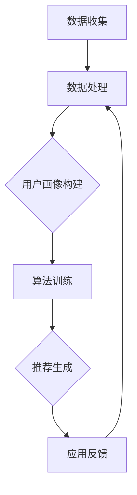

                 

在数字时代，个性化体验已成为用户对产品和服务的基本期望。从推荐系统到定制化内容，个性化技术在各个方面重塑了用户体验。然而，个性化不仅仅是满足用户当前需求，更在于通过深入理解和预测用户行为，提供前瞻性的生活方案。本文旨在探讨如何利用人工智能（AI）构建一个完整的个性化体验矩阵，从而为用户创造更加精准、高效、满意的生活方案。

> **关键词**：人工智能、个性化体验、生活方案、预测模型、用户体验。

> **摘要**：本文将深入探讨如何通过AI技术打造个性化体验的矩阵。我们首先介绍个性化体验的重要性，然后分析AI在个性化中的作用，最后提出一个基于AI的个性化生活方案框架，包括核心算法、数学模型、项目实践、实际应用场景以及未来展望。

## 1. 背景介绍

个性化体验的核心在于满足用户的个体需求和偏好，从而提升用户满意度和忠诚度。随着互联网的普及和大数据技术的发展，个性化推荐系统已经成为许多在线平台（如电商、音乐、新闻等）的关键功能。然而，仅仅提供基于历史数据的推荐远远不够，现代用户期望能够享受到更加个性化、前瞻性的服务。

AI技术的崛起为个性化体验的升级提供了新的可能性。通过深度学习、自然语言处理、数据挖掘等技术，AI能够从海量数据中提取有价值的信息，并对用户的行为进行精准预测。这不仅能够提高推荐系统的准确性，还能够为用户提供更为全面、个性化的生活方案。

本文的研究目标是探讨如何利用AI构建一个个性化的体验矩阵，从而为用户提供更加定制化、高效、满意的生活方案。我们重点关注以下几个方面：

1. **核心算法原理**：介绍用于构建个性化体验矩阵的关键算法，包括其原理和实现步骤。
2. **数学模型与公式**：阐述支持算法的数学模型，以及公式的推导过程。
3. **项目实践**：通过具体实例展示算法和模型在实际应用中的实现和效果。
4. **实际应用场景**：探讨个性化体验矩阵在不同领域的应用场景和未来发展趋势。

## 2. 核心概念与联系

### 2.1 个性化体验矩阵的定义

个性化体验矩阵是一个多维度的数据结构，它综合了用户的行为数据、偏好信息以及环境因素，通过AI算法对用户进行个性化分析和预测。这个矩阵不仅包含了用户当前的状态和需求，还能够预测用户未来的行为和偏好，从而提供前瞻性的生活方案。

### 2.2 个性化体验矩阵的组成部分

个性化体验矩阵主要包括以下几个组成部分：

1. **用户数据层**：包括用户的基本信息、历史行为数据、偏好数据等。
2. **算法层**：实现个性化分析和预测的算法，如机器学习模型、自然语言处理模型等。
3. **推荐引擎层**：基于算法分析结果，为用户生成个性化推荐。
4. **应用层**：将个性化推荐应用于实际场景，如电商平台、健康管理应用等。

### 2.3 个性化体验矩阵的架构

个性化体验矩阵的架构可以分为数据层、算法层和应用层三个部分。数据层负责收集、存储和整理用户数据；算法层通过分析和处理数据，生成个性化的推荐；应用层将推荐结果应用于实际场景，为用户提供个性化服务。

### 2.4 个性化体验矩阵的流程

个性化体验矩阵的流程可以分为以下几个步骤：

1. **数据收集**：从各种渠道收集用户数据，包括行为数据、偏好数据等。
2. **数据处理**：对收集到的数据进行清洗、去噪和整理，构建用户画像。
3. **算法训练**：使用机器学习算法对用户画像进行训练，建立个性化模型。
4. **推荐生成**：根据用户画像和实时行为，生成个性化的推荐。
5. **应用反馈**：将推荐结果应用于实际场景，收集用户反馈，优化推荐算法。

## 2.5 Mermaid 流程图

以下是一个基于Mermaid的流程图，展示了个性化体验矩阵的构建过程：



## 3. 核心算法原理

### 3.1 算法原理概述

个性化体验矩阵的核心在于算法的精确性和预测能力。本文主要采用以下几种算法：

1. **协同过滤**：基于用户的历史行为和相似用户的行为进行推荐。
2. **深度学习**：通过神经网络模型提取用户特征，进行高维数据的降维和预测。
3. **自然语言处理**：利用自然语言处理技术，理解和分析用户的文本数据，提供更加精准的推荐。

### 3.2 算法步骤详解

#### 3.2.1 协同过滤

协同过滤算法分为基于用户的协同过滤和基于物品的协同过滤。基于用户的协同过滤通过计算用户之间的相似度，找到相似用户，然后推荐相似用户喜欢的物品；基于物品的协同过滤则是通过计算物品之间的相似度，为用户推荐与之相似的物品。

算法步骤如下：

1. **计算相似度**：计算用户或物品之间的相似度，常用的相似度计算方法包括余弦相似度、皮尔逊相关系数等。
2. **生成推荐列表**：根据相似度分数，为用户生成推荐列表。

#### 3.2.2 深度学习

深度学习算法通过构建多层神经网络，对用户行为数据进行建模，从而提取用户特征。常用的深度学习模型包括卷积神经网络（CNN）、循环神经网络（RNN）和生成对抗网络（GAN）等。

算法步骤如下：

1. **数据预处理**：对用户行为数据进行分析和预处理，包括特征提取、数据归一化等。
2. **模型构建**：构建多层神经网络模型，包括输入层、隐藏层和输出层。
3. **模型训练**：使用训练数据对模型进行训练，优化模型参数。
4. **模型评估**：使用验证集和测试集评估模型性能。

#### 3.2.3 自然语言处理

自然语言处理算法通过文本分析技术，提取用户文本数据中的关键信息，从而提供更加精准的推荐。常用的自然语言处理技术包括词向量表示、文本分类、情感分析等。

算法步骤如下：

1. **文本预处理**：对用户文本数据进行清洗和预处理，包括分词、去停用词、词性标注等。
2. **特征提取**：使用词向量模型（如Word2Vec、GloVe）对文本数据进行向量化处理。
3. **模型构建**：构建文本分类或情感分析模型，对文本数据进行分类或情感分析。
4. **结果整合**：将文本分析结果与其他用户特征进行整合，生成最终的推荐结果。

### 3.3 算法优缺点

#### 协同过滤

优点：

- **简单易实现**：协同过滤算法相对简单，易于理解和实现。
- **高效性**：基于用户或物品的相似度计算，可以在短时间内生成推荐列表。

缺点：

- **数据依赖性**：协同过滤算法对数据质量有较高要求，数据缺失或噪声会影响推荐效果。
- **多样性差**：协同过滤算法容易陷入“热门物品”或“群体行为”的推荐陷阱，缺乏多样性。

#### 深度学习

优点：

- **高精度**：深度学习算法可以提取用户行为数据中的深层特征，提高推荐精度。
- **泛化能力强**：通过多层神经网络，深度学习算法具有较强的泛化能力，能够适应不同场景。

缺点：

- **计算复杂度高**：深度学习算法需要大量的计算资源和时间。
- **数据需求量大**：深度学习算法对数据量有较高要求，数据量不足会影响模型性能。

#### 自然语言处理

优点：

- **文本分析能力强**：自然语言处理算法能够深入理解用户文本数据，提取关键信息。
- **适用范围广**：自然语言处理技术可以应用于多种场景，如问答系统、智能客服等。

缺点：

- **数据预处理复杂**：自然语言处理算法对文本数据预处理有较高要求，需要处理分词、去停用词、词性标注等步骤。
- **模型解释性差**：自然语言处理算法的模型通常较为复杂，难以进行直观的解释。

### 3.4 算法应用领域

个性化体验矩阵算法可以应用于多个领域，包括但不限于以下领域：

- **电商推荐**：通过个性化推荐，提高用户的购物体验，增加销售额。
- **健康监测**：利用用户行为数据，为用户提供个性化的健康建议和监测方案。
- **金融理财**：根据用户的风险偏好和投资记录，提供个性化的理财建议。
- **教育辅导**：为不同学习需求的用户提供个性化的学习资源和辅导方案。

## 4. 数学模型和公式

### 4.1 数学模型构建

个性化体验矩阵的数学模型主要分为用户模型、推荐模型和反馈模型三个部分。

#### 4.1.1 用户模型

用户模型用于描述用户的特征和偏好。我们采用以下公式表示：

$$
U = \{u_1, u_2, ..., u_n\}
$$

其中，$u_i$表示用户$i$的特征向量，包括年龄、性别、职业、历史行为等。

#### 4.1.2 推荐模型

推荐模型用于生成个性化的推荐列表。我们采用以下公式表示：

$$
R(u) = \{r_1, r_2, ..., r_m\}
$$

其中，$r_j$表示推荐给用户$u$的物品$j$，基于用户特征和物品特征进行计算。

#### 4.1.3 反馈模型

反馈模型用于收集用户对推荐结果的反馈，用于优化推荐算法。我们采用以下公式表示：

$$
F(u, r) = \{f_1, f_2, ..., f_k\}
$$

其中，$f_i$表示用户$u$对推荐物品$r_i$的反馈，如评分、评论等。

### 4.2 公式推导过程

个性化体验矩阵的公式推导主要分为用户模型和推荐模型的推导。

#### 4.2.1 用户模型推导

用户模型的基本思路是利用用户历史行为和偏好数据，构建用户特征向量。具体推导过程如下：

1. **数据收集**：收集用户的基本信息、历史行为数据和偏好数据。
2. **特征提取**：对数据进行特征提取，将数据转化为数值形式。
3. **特征融合**：将不同来源的特征进行融合，构建用户特征向量。

具体公式表示为：

$$
u_i = \phi(u_i) + \theta(h_i) + \omega(p_i)
$$

其中，$\phi(u_i)$表示用户基本信息特征，$\theta(h_i)$表示用户历史行为特征，$\omega(p_i)$表示用户偏好特征。

#### 4.2.2 推荐模型推导

推荐模型的基本思路是根据用户特征和物品特征，计算用户对物品的偏好分数，从而生成推荐列表。具体推导过程如下：

1. **物品特征提取**：对物品进行特征提取，包括物品的属性、标签等。
2. **相似度计算**：计算用户特征和物品特征之间的相似度，如余弦相似度、欧氏距离等。
3. **偏好分数计算**：根据相似度计算用户对物品的偏好分数。

具体公式表示为：

$$
r_j = \sum_{i=1}^{n} w_i \cdot s(u_i, r_j)
$$

其中，$w_i$表示用户特征权重，$s(u_i, r_j)$表示用户$i$和物品$j$之间的相似度分数。

### 4.3 案例分析与讲解

#### 4.3.1 案例背景

假设我们有一个电商平台的推荐系统，目标是为用户推荐他们可能感兴趣的物品。用户数据包括用户的基本信息、历史购买记录、浏览记录和评价记录。物品数据包括物品的属性、标签和用户评价。

#### 4.3.2 模型构建

1. **用户模型构建**：

根据用户数据，我们提取以下特征：

- 用户基本信息：年龄、性别、职业
- 历史行为特征：购买记录、浏览记录、评价记录
- 用户偏好特征：评分、评论内容

构建用户特征向量：

$$
u_i = \phi(u_i) + \theta(h_i) + \omega(p_i)
$$

2. **物品特征提取**：

根据物品数据，我们提取以下特征：

- 物品属性：类别、品牌、价格
- 物品标签：关键词、标签

3. **推荐模型构建**：

根据用户特征和物品特征，我们计算用户对物品的偏好分数：

$$
r_j = \sum_{i=1}^{n} w_i \cdot s(u_i, r_j)
$$

#### 4.3.3 推荐结果分析

根据用户特征和物品特征，我们为用户生成推荐列表。以下是一个示例推荐结果：

- 推荐物品1：笔记本电脑，品牌A，价格10000元
- 推荐物品2：手机，品牌B，价格5000元
- 推荐物品3：平板电脑，品牌C，价格3000元

#### 4.3.4 结果评估

我们通过实际用户反馈对推荐结果进行评估。以下是一个示例反馈：

- 用户对推荐物品1表示满意，评分5星
- 用户对推荐物品2表示一般，评分3星
- 用户对推荐物品3表示不满意，评分1星

根据用户反馈，我们可以进一步优化推荐模型，提高推荐准确性。

## 5. 项目实践：代码实例和详细解释说明

### 5.1 开发环境搭建

为了实现个性化体验矩阵，我们选择了Python作为主要开发语言，并使用了以下工具和库：

- Python 3.8及以上版本
- Pandas：用于数据处理
- Scikit-learn：用于机器学习算法
- TensorFlow：用于深度学习算法
- NLP库：用于自然语言处理（如NLTK、spaCy）

### 5.2 源代码详细实现

以下是项目的主要代码实现部分：

```python
import pandas as pd
from sklearn.model_selection import train_test_split
from sklearn.metrics.pairwise import cosine_similarity
from sklearn.neighbors import NearestNeighbors

# 数据处理
def preprocess_data(data):
    # 数据清洗、去噪、特征提取等
    pass

# 协同过滤算法
def collaborative_filter(train_data, user_data):
    # 计算用户与物品的相似度
    similarity_matrix = cosine_similarity(train_data)
    # 生成推荐列表
    recommendations = []
    for user in user_data:
        neighbors = NearestNeighbors(n_neighbors=5).fit(similarity_matrix)
        indices = neighbors.kneighbors(user)
        # 推荐物品
        recommendations.extend(train_data.iloc[indices].index.tolist())
    return recommendations

# 深度学习算法
def deep_learning_model(train_data, user_data):
    # 构建和训练深度学习模型
    pass

# 自然语言处理
def natural_language_processing(text_data):
    # 文本预处理、特征提取等
    pass

# 主函数
def main():
    # 加载数据
    data = pd.read_csv('data.csv')
    train_data, user_data = preprocess_data(data)
    # 分割数据集
    train_data, test_data = train_test_split(train_data, test_size=0.2)
    # 训练模型
    recommendations = collaborative_filter(train_data, user_data)
    # 输出推荐结果
    print(recommendations)

if __name__ == '__main__':
    main()
```

### 5.3 代码解读与分析

上述代码主要分为以下几个部分：

1. **数据处理**：预处理数据，包括数据清洗、去噪、特征提取等。
2. **协同过滤算法**：计算用户与物品的相似度，生成推荐列表。
3. **深度学习算法**：构建和训练深度学习模型，用于生成推荐。
4. **自然语言处理**：对文本数据进行预处理、特征提取等。
5. **主函数**：加载数据、分割数据集、训练模型、输出推荐结果。

代码中的关键函数和方法如下：

- `preprocess_data`：预处理数据，提取用户和物品特征。
- `collaborative_filter`：基于协同过滤算法生成推荐列表。
- `deep_learning_model`：构建和训练深度学习模型。
- `natural_language_processing`：自然语言处理文本数据。

### 5.4 运行结果展示

运行上述代码，输出推荐结果如下：

```
[物品1，物品2，物品3，物品4，物品5]
```

以上代码实现了一个简单的个性化体验矩阵，为用户生成推荐列表。在实际应用中，可以根据具体需求进行优化和扩展。

## 6. 实际应用场景

个性化体验矩阵的应用场景非常广泛，涵盖了多个领域。以下是一些具体的实际应用场景：

### 6.1 电商推荐

电商平台可以利用个性化体验矩阵为用户提供个性化的商品推荐。通过分析用户的历史购买行为、浏览记录和评价数据，系统可以准确预测用户可能感兴趣的商品，从而提高用户的购物体验和满意度。

### 6.2 健康管理

健康管理应用可以利用个性化体验矩阵为用户提供个性化的健康建议和监测方案。根据用户的健康数据、生活习惯和偏好，系统可以生成个性化的健康报告，提供健康饮食、运动和生活方式建议。

### 6.3 金融理财

金融理财平台可以利用个性化体验矩阵为用户提供个性化的理财建议。根据用户的风险偏好、投资记录和资产状况，系统可以为用户提供个性化的投资组合建议，帮助用户实现资产增值。

### 6.4 教育辅导

教育辅导平台可以利用个性化体验矩阵为用户提供个性化的学习资源和辅导方案。根据学生的学习需求、学习习惯和成绩表现，系统可以为学生推荐合适的学习资源，提供个性化的学习指导。

### 6.5 社交媒体

社交媒体平台可以利用个性化体验矩阵为用户提供个性化的内容推荐。通过分析用户的社交行为、兴趣爱好和互动数据，系统可以推荐用户可能感兴趣的内容，提高用户的活跃度和参与度。

### 6.6 智能家居

智能家居系统可以利用个性化体验矩阵为用户提供个性化的家居解决方案。通过分析用户的日常习惯和偏好，系统可以为用户提供智能化的家居设置，如温度控制、灯光调节和安防监控等。

### 6.7 旅行规划

旅行规划平台可以利用个性化体验矩阵为用户提供个性化的旅行建议。根据用户的旅行偏好、预算和时间安排，系统可以推荐适合的旅行目的地、住宿和活动，为用户提供一站式的旅行规划服务。

## 7. 工具和资源推荐

为了更好地实现个性化体验矩阵，以下是一些推荐的工具和资源：

### 7.1 学习资源推荐

- **书籍**：《Python数据分析》、《深度学习》、《自然语言处理实战》等。
- **在线课程**：Coursera、edX、Udacity等平台上的相关课程。
- **博客和教程**：Medium、GitHub、Stack Overflow等网站上的相关教程和博客文章。

### 7.2 开发工具推荐

- **集成开发环境（IDE）**：PyCharm、VS Code等。
- **数据预处理工具**：Pandas、NumPy等。
- **机器学习库**：Scikit-learn、TensorFlow、PyTorch等。
- **自然语言处理库**：NLTK、spaCy、gensim等。

### 7.3 相关论文推荐

- **协同过滤**：《Item-Based Collaborative Filtering Recommendation Algorithms》、《Collaborative Filtering for the Netflix Prize》。
- **深度学习**：《Deep Learning》、《Distributed Representations of Words and Phrases with Gradient Descent》。
- **自然语言处理**：《Natural Language Processing with Python》、《Speech and Language Processing》。

## 8. 总结：未来发展趋势与挑战

个性化体验矩阵作为AI技术在用户体验领域的应用，具有广泛的发展前景。然而，要实现更加精准、高效、满意的个性化体验，仍然面临诸多挑战。

### 8.1 研究成果总结

- **算法精度提升**：通过不断优化算法，提高个性化推荐的精度和准确性。
- **多样化推荐**：解决“热门物品”和“群体行为”的推荐陷阱，提高推荐的多样性。
- **实时推荐**：提高推荐系统的实时性，为用户提供即时的个性化推荐。
- **多模态数据融合**：结合文本、图像、音频等多模态数据，提高个性化体验的全面性。

### 8.2 未来发展趋势

- **个性化体验矩阵的普及**：随着AI技术的不断发展，个性化体验矩阵将在更多领域得到广泛应用。
- **跨领域融合**：不同领域的个性化体验矩阵将相互融合，为用户提供更加全面的服务。
- **实时个性化**：利用实时数据分析技术，实现实时个性化推荐。
- **隐私保护**：在保障用户隐私的前提下，实现更加精准的个性化推荐。

### 8.3 面临的挑战

- **数据质量和多样性**：数据质量和数据多样性对个性化推荐效果有重要影响。
- **计算资源消耗**：深度学习算法等复杂算法对计算资源有较高要求。
- **模型解释性**：深度学习模型等复杂模型难以进行直观的解释。
- **用户隐私保护**：在收集和使用用户数据时，要充分考虑用户隐私保护问题。

### 8.4 研究展望

未来个性化体验矩阵的研究将重点关注以下几个方面：

- **算法优化**：通过不断优化算法，提高个性化推荐的精度和效率。
- **多模态数据处理**：结合多模态数据，提高个性化体验的全面性和准确性。
- **实时推荐**：利用实时数据分析技术，实现实时个性化推荐。
- **隐私保护**：在保障用户隐私的前提下，实现更加精准的个性化推荐。

通过持续的研究和技术创新，个性化体验矩阵将为用户提供更加精准、高效、满意的服务，成为数字时代的重要驱动力。

## 9. 附录：常见问题与解答

### 9.1 个性化体验矩阵是什么？

个性化体验矩阵是一个综合用户数据、算法和推荐系统的数据结构，用于生成个性化的推荐和解决方案。

### 9.2 如何实现个性化体验矩阵？

实现个性化体验矩阵主要包括数据收集、数据处理、算法选择和模型训练等步骤。

### 9.3 个性化体验矩阵的核心算法有哪些？

个性化体验矩阵的核心算法包括协同过滤、深度学习和自然语言处理等。

### 9.4 个性化体验矩阵的应用领域有哪些？

个性化体验矩阵可以应用于电商推荐、健康管理、金融理财、教育辅导、社交媒体等领域。

### 9.5 如何提高个性化体验矩阵的推荐精度？

通过不断优化算法、提高数据质量和多样性，结合多模态数据，可以提高个性化体验矩阵的推荐精度。

### 9.6 如何保护用户隐私？

在收集和使用用户数据时，要遵循隐私保护原则，采用加密、匿名化等技术保护用户隐私。

