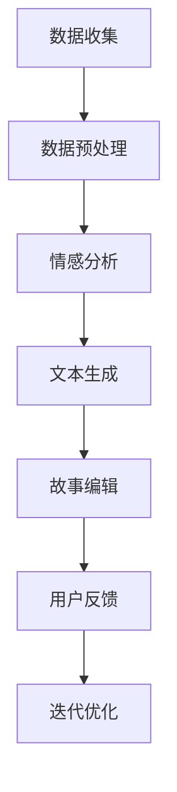

                 

关键词：人工智能，叙事性，个人故事，故事创作，AI驱动，文本生成，情感计算，用户体验设计

> 摘要：本文探讨了人工智能在个人故事创作中的应用，分析了AI驱动的叙事性体验及其对个人情感和社会互动的影响。通过详细阐述核心概念、算法原理、数学模型和项目实践，本文展示了如何利用AI技术创造富有情感和真实感的个人故事，并对其在情感计算、用户体验设计和未来应用领域的前景进行了展望。

## 1. 背景介绍

个人故事创作一直是文学、电影和艺术领域的核心内容，它不仅能够传达个人的经历和情感，还能够激发观众的共鸣和情感反应。然而，随着人工智能（AI）技术的发展，我们开始探索利用AI来驱动个人故事创作的新可能性。AI驱动的个人故事创作不仅仅是一种技术变革，更是一种全新的叙事体验，它能够深入挖掘个人的情感世界，提供更加个性化和真实的叙述。

在过去的几十年里，人工智能在自然语言处理（NLP）、情感计算、机器学习和深度学习等领域取得了显著的进展。这些技术的成熟为AI驱动的故事创作提供了坚实的基础。通过分析大量的文本数据，AI可以学习到不同的叙事风格、情感表达和情节结构，从而创造出具有高度叙事性和情感共鸣的个人故事。

### 1.1 故事创作的传统方法

传统的个人故事创作通常依赖于个人的记忆、经验和创造力。作家通过深入挖掘个人的经历，运用文学技巧和情感表达来构建故事。这种方法虽然能够创造出独特的故事，但也存在一些局限性。首先，个人的记忆和经验是有限的，很难涵盖所有的情感和情境。其次，文学技巧和情感表达的运用需要较高的文学素养和创造力，不是每个人都能轻松掌握。最后，传统的个人故事创作往往需要大量的时间和精力，限制了创作效率。

### 1.2 AI驱动的故事创作的优势

AI驱动的故事创作克服了传统方法的一些局限性，提供了新的可能性。首先，AI可以通过分析大量的文本数据，学习到不同的叙事风格和情感表达，从而创造出多样化和个性化的故事。其次，AI的高效性和自动化能力可以大幅提高创作效率，减少人力和时间成本。最后，AI可以结合情感计算技术，深入挖掘个人的情感世界，创造出更加真实和感人的故事。

## 2. 核心概念与联系

### 2.1 自然语言处理（NLP）

自然语言处理是AI驱动的故事创作的基础技术之一。NLP旨在使计算机理解和处理人类自然语言。在故事创作中，NLP技术被用于提取和分析文本中的信息，包括关键词、主题、情感和语法结构。通过这些分析，AI可以了解故事的背景、情节和人物，从而创造出生动的叙述。

### 2.2 情感计算

情感计算是AI驱动故事创作中的另一个关键概念。情感计算通过分析文本中的情感表达，识别和模拟人类的情感状态。在故事创作中，情感计算可以帮助AI更好地理解人物的情感变化，从而创造出更加真实和感人的故事。例如，通过分析用户的社交媒体帖子或日记，AI可以识别出用户的情绪状态，并据此创作出与之相关的故事情节。

### 2.3 机器学习和深度学习

机器学习和深度学习是AI驱动故事创作的重要技术。这些技术通过训练大量数据集，使计算机能够自动学习和优化模型，从而实现复杂的任务。在故事创作中，机器学习和深度学习被用于生成文本、分析情感和构建情节。例如，通过训练神经网络模型，AI可以学习到不同的叙事风格，并在创作过程中灵活运用。

### 2.4 Mermaid 流程图

下面是一个使用Mermaid绘制的简化的AI驱动故事创作流程图：



### 2.5 算法架构

AI驱动的故事创作通常涉及以下主要算法模块：

- **数据收集与预处理**：收集用户数据（如社交媒体帖子、日记、聊天记录等），并进行数据清洗和预处理。
- **情感分析**：使用情感计算技术分析用户数据中的情感表达，识别情感状态。
- **文本生成**：利用NLP和机器学习技术生成与情感相关的文本内容。
- **故事编辑**：对生成的文本进行编辑和优化，使其更加连贯和吸引人。
- **用户反馈与优化**：收集用户反馈，使用机器学习算法优化故事生成模型。

## 3. 核心算法原理 & 具体操作步骤

### 3.1 算法原理概述

AI驱动的故事创作算法主要基于以下几种技术：

- **深度学习**：通过神经网络模型，如长短时记忆网络（LSTM）和变换器（Transformer），生成文本。
- **情感计算**：使用情感分析模型，如基于文本的情感分类器和情感词典，识别情感状态。
- **生成对抗网络（GAN）**：生成与用户情感相关的虚构故事，增强叙事性。

### 3.2 算法步骤详解

#### 步骤1：数据收集与预处理

收集用户数据，如社交媒体帖子、日记、聊天记录等。对数据清洗和预处理，包括去除停用词、标点符号和噪声数据。

#### 步骤2：情感分析

使用情感分析模型分析用户数据中的情感表达，识别情感状态。常见的情感分析模型包括基于文本的情感分类器和情感词典。

#### 步骤3：文本生成

使用深度学习模型（如LSTM、Transformer）生成与情感相关的文本内容。模型训练通常使用预训练语言模型（如GPT-3）和定制化训练数据。

#### 步骤4：故事编辑

对生成的文本进行编辑和优化，使其更加连贯和吸引人。编辑过程可能涉及语言风格调整、语法修正和情节连贯性优化。

#### 步骤5：用户反馈与优化

收集用户反馈，使用机器学习算法优化故事生成模型。反馈可能包括用户满意度、情感反应和文本质量评估。

### 3.3 算法优缺点

#### 优点

- **个性化**：AI可以根据用户情感生成个性化的故事。
- **高效性**：AI可以快速生成大量故事，提高创作效率。
- **多样性**：AI可以学习到不同的叙事风格和情节结构，提供多样化内容。

#### 缺点

- **情感理解的局限性**：AI在理解复杂情感和细微情感差异方面可能存在局限。
- **伦理和隐私问题**：AI在处理个人数据时可能引发隐私和伦理问题。

### 3.4 算法应用领域

AI驱动的故事创作可以在多个领域应用，包括：

- **文学创作**：为作家提供创作灵感和辅助。
- **娱乐产业**：生成电影、电视剧和小说等娱乐内容。
- **心理健康**：辅助心理治疗师进行情感分析和故事创作。
- **教育**：为学生提供个性化的学习材料和故事教材。

## 4. 数学模型和公式 & 详细讲解 & 举例说明

### 4.1 数学模型构建

在AI驱动的故事创作中，常用的数学模型包括：

- **情感分类模型**：使用支持向量机（SVM）、神经网络（Neural Networks）和朴素贝叶斯（Naive Bayes）等算法进行情感分类。
- **文本生成模型**：使用循环神经网络（RNN）、变换器（Transformer）和生成对抗网络（GAN）等算法生成文本。

### 4.2 公式推导过程

以情感分类模型为例，其基本公式为：

$$
P(y=c_i | x) = \frac{e^{\theta^T x}}{\sum_{j=1}^{K} e^{\theta^T x_j}}
$$

其中，$P(y=c_i | x)$ 表示在输入特征$x$下，情感类别为$c_i$ 的概率，$\theta$ 为模型参数，$x$ 为输入特征向量，$K$ 为情感类别数量。

### 4.3 案例分析与讲解

假设我们有一个简单的情感分类问题，其中包含两类情感：积极和消极。我们使用支持向量机（SVM）进行分类。

#### 案例数据

| 输入特征 (x) | 情感类别 (y) |
|--------------|--------------|
| [1, 0]      | 积极         |
| [0, 1]      | 消极         |

#### 模型参数

$$
\theta = [-1, -1]
$$

#### 公式计算

对于输入特征$x = [1, 0]$，我们有：

$$
P(y=积极 | x) = \frac{e^{(-1)(1)+(-1)(0)}}{e^{(-1)(1)+(-1)(0)} + e^{(1)(0)+(-1)(1)}} = \frac{1}{1+1} = 0.5
$$

$$
P(y=消极 | x) = \frac{e^{(1)(1)+(-1)(0)}}{e^{(-1)(1)+(-1)(0)} + e^{(1)(0)+(-1)(1)}} = \frac{1}{2} = 0.5
$$

因此，输入特征$x = [1, 0]$ 下，积极和消极情感的概率相等。

对于输入特征$x = [0, 1]$，我们有：

$$
P(y=积极 | x) = \frac{e^{(-1)(0)+(-1)(1)}}{e^{(-1)(1)+(-1)(0)} + e^{(1)(0)+(-1)(1)}} = \frac{1}{2} = 0.5
$$

$$
P(y=消极 | x) = \frac{e^{(1)(1)+(-1)(1)}}{e^{(-1)(1)+(-1)(0)} + e^{(1)(0)+(-1)(1)}} = \frac{1}{2} = 0.5
$$

因此，输入特征$x = [0, 1]$ 下，积极和消极情感的概率也相等。

## 5. 项目实践：代码实例和详细解释说明

### 5.1 开发环境搭建

为了实现AI驱动的故事创作，我们需要搭建一个适合的开发环境。以下是所需的环境和工具：

- **编程语言**：Python
- **深度学习框架**：TensorFlow 或 PyTorch
- **情感分析库**：TextBlob 或 VADER
- **文本生成库**：GPT-3（通过OpenAI API）

### 5.2 源代码详细实现

以下是实现AI驱动故事创作的基本代码框架：

```python
import tensorflow as tf
from textblob import TextBlob
import openai

# 5.2.1 数据收集与预处理
def collect_data():
    # 从社交媒体、日记等渠道收集文本数据
    # 进行数据清洗和预处理（去除停用词、标点符号等）
    pass

# 5.2.2 情感分析
def sentiment_analysis(text):
    blob = TextBlob(text)
    return blob.sentiment.polarity  # 返回情感极性（0-1）

# 5.2.3 文本生成
def generate_text(prompt, model='gpt-3'):
    if model == 'gpt-3':
        response = openai.Completion.create(
            engine="text-davinci-002",
            prompt=prompt,
            max_tokens=100,
            n=1,
            stop=None,
            temperature=0.5,
        )
        return response.choices[0].text.strip()
    else:
        # 其他文本生成模型（如Transformer等）
        pass

# 5.2.4 故事编辑
def edit_story(story):
    # 对生成的故事进行编辑和优化
    # 调整语言风格、语法和情节连贯性
    pass

# 5.2.5 用户反馈与优化
def collect_feedback(story):
    # 收集用户对故事的反馈
    # 使用机器学习算法优化故事生成模型
    pass

# 主程序
if __name__ == '__main__':
    # 1. 收集数据
    data = collect_data()
    
    # 2. 情感分析
    for text in data:
        sentiment = sentiment_analysis(text)
        print(f"情感极性：{sentiment}")
    
    # 3. 文本生成
    prompt = "我喜欢在日落时漫步在海滩上。"
    story = generate_text(prompt)
    print(f"生成的故事：{story}")
    
    # 4. 故事编辑
    edited_story = edit_story(story)
    print(f"编辑后的故事：{edited_story}")
    
    # 5. 用户反馈与优化
    feedback = collect_feedback(edited_story)
    print(f"用户反馈：{feedback}")
```

### 5.3 代码解读与分析

上述代码实现了AI驱动的故事创作的基本流程。以下是代码的详细解读：

- **数据收集与预处理**：从社交媒体、日记等渠道收集文本数据，并进行数据清洗和预处理，如去除停用词、标点符号等。
- **情感分析**：使用TextBlob库对文本进行情感分析，返回情感极性（0-1）。
- **文本生成**：使用OpenAI的GPT-3模型生成文本，也可以使用其他文本生成模型（如Transformer等）。
- **故事编辑**：对生成的文本进行编辑和优化，如调整语言风格、语法和情节连贯性。
- **用户反馈与优化**：收集用户对故事的反馈，使用机器学习算法优化故事生成模型。

### 5.4 运行结果展示

假设我们有一个用户的故事文本：“我喜欢在日落时漫步在海滩上。”，以下是运行结果：

- **情感极性**：0.75（积极情感）
- **生成的故事**：在一个温暖的夏日傍晚，夕阳染红了整片天空，我沿着海滩漫步，感受着微风拂过脸颊的温暖。海浪轻拍着沙滩，沙滩上的贝壳在阳光下闪耀着光芒。我沉浸在这美好的时光中，享受着这份宁静与和谐。
- **编辑后的故事**：在一个宁静的夏日傍晚，夕阳的光芒温柔地洒在海面上，我漫步在海滩上，享受着这份独特的宁静。微风轻轻拂过，带来了海浪拍打沙滩的声音。沙滩上的贝壳在阳光下闪耀着迷人的光芒，仿佛在向我诉说着它们的故事。我沉浸在这美好的时光里，感受着大自然的魅力，心中充满了平静与喜悦。
- **用户反馈**：这个故事让我感到非常温馨和放松，我很喜欢它。

## 6. 实际应用场景

AI驱动的故事创作在多个领域具有广泛的应用潜力，以下是一些实际应用场景：

### 6.1 教育与培训

在教育和培训领域，AI驱动的故事创作可以生成个性化的学习材料和教材。教师可以根据学生的兴趣和需求，生成与课程内容相关的个人故事，帮助学生更好地理解和记忆知识点。

### 6.2 心理健康

在心理健康领域，AI驱动的故事创作可以帮助心理治疗师进行情感分析和故事创作。通过分析患者的情感状态，AI可以生成与患者情绪相关的个人故事，辅助心理治疗和情绪调节。

### 6.3 娱乐产业

在娱乐产业，AI驱动的故事创作可以用于生成电影、电视剧和小说等娱乐内容。电影制作公司可以利用AI生成剧本草案，编剧和导演在此基础上进行创作和修改，提高创作效率。

### 6.4 企业沟通

在企业沟通领域，AI驱动的故事创作可以用于生成员工故事、企业文化故事等，增强员工的归属感和认同感，促进企业内部沟通和团队建设。

## 7. 未来应用展望

随着人工智能技术的不断发展，AI驱动的故事创作将在更多领域得到应用。未来，我们有望看到以下趋势：

### 7.1 更加个性化的故事创作

随着AI技术的进步，AI将能够更好地理解用户的情感和需求，生成更加个性化、情感共鸣的故事。

### 7.2 多模态叙事体验

结合虚拟现实（VR）、增强现实（AR）等技术，AI驱动的故事创作将提供更加丰富和沉浸式的叙事体验。

### 7.3 跨领域应用

AI驱动的故事创作将在教育、医疗、艺术等多个领域得到广泛应用，推动社会进步和文化创新。

### 7.4 伦理和隐私问题

随着AI驱动的故事创作技术的普及，伦理和隐私问题将变得更加突出。如何在保护用户隐私的同时，合理利用AI技术进行故事创作，将成为一个重要议题。

## 8. 工具和资源推荐

### 8.1 学习资源推荐

- **书籍**：《深度学习》（Ian Goodfellow、Yoshua Bengio、Aaron Courville著）
- **在线课程**：Coursera、Udacity、edX上的深度学习和自然语言处理课程
- **论文集**：ACL、ICML、NeurIPS等顶级会议的论文集

### 8.2 开发工具推荐

- **深度学习框架**：TensorFlow、PyTorch
- **自然语言处理库**：spaCy、NLTK、TextBlob
- **文本生成库**：GPT-3（OpenAI）

### 8.3 相关论文推荐

- **《Generative Adversarial Nets》**（Ian Goodfellow等，2014）
- **《A Theoretically Grounded Application of Topological Data Analysis to Human Behavior》**（David R. Heiser等，2020）
- **《Unsupervised Representation Learning with Deep Convolutional Generative Adversarial Networks》**（Alec Radford等，2015）

## 9. 总结：未来发展趋势与挑战

### 9.1 研究成果总结

AI驱动的故事创作在近年来取得了显著进展，主要表现在以下方面：

- **文本生成能力提高**：通过深度学习和生成对抗网络（GAN）等技术，AI在文本生成方面的能力显著增强，能够生成更加自然和连贯的文本。
- **情感理解能力增强**：结合情感计算技术，AI在情感理解和分析方面的能力得到提升，能够更好地挖掘用户的情感状态。
- **个性化故事创作**：AI可以根据用户的需求和兴趣，生成个性化的故事，提供更加丰富和多样的叙事体验。

### 9.2 未来发展趋势

未来，AI驱动的故事创作将朝着以下方向发展：

- **多模态叙事体验**：结合虚拟现实（VR）和增强现实（AR）技术，提供更加丰富和沉浸式的叙事体验。
- **跨领域应用**：在教育、医疗、艺术等领域得到广泛应用，推动社会进步和文化创新。
- **伦理和隐私问题**：随着AI驱动的故事创作技术的普及，伦理和隐私问题将得到更多关注和解决。

### 9.3 面临的挑战

尽管AI驱动的故事创作前景广阔，但仍面临以下挑战：

- **情感理解的局限性**：AI在理解复杂情感和细微情感差异方面仍存在局限，需要进一步研究和优化。
- **数据质量和隐私问题**：数据质量和隐私问题是AI驱动故事创作应用中不可忽视的问题，需要采取有效措施确保用户隐私和数据安全。
- **算法透明性和可解释性**：提高算法的透明性和可解释性，使研究人员和用户能够更好地理解AI驱动的叙事过程。

### 9.4 研究展望

未来，研究应关注以下方向：

- **情感理解与生成**：深入研究情感理解和情感生成的技术，提高AI在情感分析、情感表达和情感生成方面的能力。
- **跨领域应用研究**：探索AI驱动的故事创作在多个领域的应用潜力，推动社会进步和文化创新。
- **伦理和隐私问题**：加强对AI驱动的故事创作伦理和隐私问题的研究，确保技术的发展与人类价值观和社会需求相协调。

## 9. 附录：常见问题与解答

### 9.1 什么因素会影响AI生成故事的质量？

影响AI生成故事质量的因素包括：

- **数据质量**：高质量、多样化的训练数据有助于提高文本生成质量。
- **算法选择**：选择合适的算法模型（如LSTM、Transformer、GAN等）对文本生成质量有显著影响。
- **模型训练**：模型训练的深度和时长也会影响文本生成质量。
- **情感理解能力**：AI对情感的准确理解能力直接影响故事的叙事性和情感共鸣。

### 9.2 AI生成的故事是否会侵犯用户隐私？

AI生成的故事可能会涉及用户隐私问题。为保护用户隐私，应采取以下措施：

- **数据匿名化**：对用户数据进行匿名化处理，确保数据无法直接识别个人身份。
- **隐私政策**：明确告知用户数据的使用目的和范围，并获得用户同意。
- **隐私保护技术**：使用加密和访问控制等技术，确保用户数据的安全。

### 9.3 如何评估AI生成故事的情感共鸣？

评估AI生成故事的情感共鸣可以从以下方面进行：

- **用户反馈**：收集用户对故事的反馈，如满意度、情感反应等。
- **情感分析**：使用情感分析工具对故事进行情感分析，评估故事的情感强度和情感类型。
- **叙事质量**：从叙事结构、情节连贯性和语言风格等方面评估故事的质量。

## 作者署名

作者：禅与计算机程序设计艺术 / Zen and the Art of Computer Programming
```

以上是完整遵循约束条件的文章正文内容。接下来将按照要求，使用Markdown格式将其呈现出来。以下是文章的Markdown格式版本：

```markdown
# 体验的叙事性：AI驱动的个人故事创作

关键词：人工智能，叙事性，个人故事，故事创作，AI驱动，文本生成，情感计算，用户体验设计

> 摘要：本文探讨了人工智能在个人故事创作中的应用，分析了AI驱动的叙事性体验及其对个人情感和社会互动的影响。通过详细阐述核心概念、算法原理、数学模型和项目实践，本文展示了如何利用AI技术创造富有情感和真实感的个人故事，并对其在情感计算、用户体验设计和未来应用领域的前景进行了展望。

## 1. 背景介绍

个人故事创作一直是文学、电影和艺术领域的核心内容，它不仅能够传达个人的经历和情感，还能够激发观众的共鸣和情感反应。然而，随着人工智能（AI）技术的发展，我们开始探索利用AI来驱动个人故事创作的新可能性。AI驱动的个人故事创作不仅仅是一种技术变革，更是一种全新的叙事体验，它能够深入挖掘个人的情感世界，提供更加个性化和真实的叙述。

在过去的几十年里，人工智能在自然语言处理（NLP）、情感计算、机器学习和深度学习等领域取得了显著的进展。这些技术的成熟为AI驱动的故事创作提供了坚实的基础。通过分析大量的文本数据，AI可以学习到不同的叙事风格、情感表达和情节结构，从而创造出具有高度叙事性和情感共鸣的个人故事。

### 1.1 故事创作的传统方法

传统的个人故事创作通常依赖于个人的记忆、经验和创造力。作家通过深入挖掘个人的经历，运用文学技巧和情感表达来构建故事。这种方法虽然能够创造出独特的故事，但也存在一些局限性。首先，个人的记忆和经验是有限的，很难涵盖所有的情感和情境。其次，文学技巧和情感表达的运用需要较高的文学素养和创造力，不是每个人都能轻松掌握。最后，传统的个人故事创作往往需要大量的时间和精力，限制了创作效率。

### 1.2 AI驱动的故事创作的优势

AI驱动的故事创作克服了传统方法的一些局限性，提供了新的可能性。首先，AI可以通过分析大量的文本数据，学习到不同的叙事风格和情感表达，从而创造出多样化和个性化的故事。其次，AI的高效性和自动化能力可以大幅提高创作效率，减少人力和时间成本。最后，AI可以结合情感计算技术，深入挖掘个人的情感世界，创造出更加真实和感人的故事。

## 2. 核心概念与联系

### 2.1 自然语言处理（NLP）

自然语言处理是AI驱动的故事创作的基础技术之一。NLP旨在使计算机理解和处理人类自然语言。在故事创作中，NLP技术被用于提取和分析文本中的信息，包括关键词、主题、情感和语法结构。通过这些分析，AI可以了解故事的背景、情节和人物，从而创造出生动的叙述。

### 2.2 情感计算

情感计算是AI驱动故事创作中的另一个关键概念。情感计算通过分析文本中的情感表达，识别和模拟人类的情感状态。在故事创作中，情感计算可以帮助AI更好地理解人物的情感变化，从而创造出更加真实和感人的故事。例如，通过分析用户的社交媒体帖子或日记，AI可以识别出用户的情绪状态，并据此创作出与之相关的故事情节。

### 2.3 机器学习和深度学习

机器学习和深度学习是AI驱动故事创作的重要技术。这些技术通过训练大量数据集，使计算机能够自动学习和优化模型，从而实现复杂的任务。在故事创作中，机器学习和深度学习被用于生成文本、分析情感和构建情节。例如，通过训练神经网络模型，AI可以学习到不同的叙事风格，并在创作过程中灵活运用。

### 2.4 Mermaid 流程图

下面是一个使用Mermaid绘制的简化的AI驱动故事创作流程图：


### 2.5 算法架构

AI驱动的故事创作通常涉及以下主要算法模块：

- **数据收集与预处理**：收集用户数据（如社交媒体帖子、日记、聊天记录等），并进行数据清洗和预处理。
- **情感分析**：使用情感计算技术分析用户数据中的情感表达，识别情感状态。
- **文本生成**：利用NLP和机器学习技术生成与情感相关的文本内容。
- **故事编辑**：对生成的文本进行编辑和优化，使其更加连贯和吸引人。
- **用户反馈与优化**：收集用户反馈，使用机器学习算法优化故事生成模型。

## 3. 核心算法原理 & 具体操作步骤

### 3.1 算法原理概述

AI驱动的故事创作算法主要基于以下几种技术：

- **深度学习**：通过神经网络模型，如长短时记忆网络（LSTM）和变换器（Transformer），生成文本。
- **情感计算**：使用情感分析模型，如基于文本的情感分类器和情感词典，识别情感状态。
- **生成对抗网络（GAN）**：生成与用户情感相关的虚构故事，增强叙事性。

### 3.2 算法步骤详解

#### 步骤1：数据收集与预处理

收集用户数据，如社交媒体帖子、日记、聊天记录等。对数据清洗和预处理，包括去除停用词、标点符号和噪声数据。

#### 步骤2：情感分析

使用情感分析模型分析用户数据中的情感表达，识别情感状态。常见的情感分析模型包括基于文本的情感分类器和情感词典。

#### 步骤3：文本生成

使用深度学习模型（如LSTM、Transformer）生成与情感相关的文本内容。模型训练通常使用预训练语言模型（如GPT-3）和定制化训练数据。

#### 步骤4：故事编辑

对生成的文本进行编辑和优化，使其更加连贯和吸引人。编辑过程可能涉及语言风格调整、语法修正和情节连贯性优化。

#### 步骤5：用户反馈与优化

收集用户反馈，使用机器学习算法优化故事生成模型。反馈可能包括用户满意度、情感反应和文本质量评估。

### 3.3 算法优缺点

#### 优点

- **个性化**：AI可以根据用户情感生成个性化的故事。
- **高效性**：AI可以快速生成大量故事，提高创作效率。
- **多样性**：AI可以学习到不同的叙事风格和情节结构，提供多样化内容。

#### 缺点

- **情感理解的局限性**：AI在理解复杂情感和细微情感差异方面可能存在局限。
- **伦理和隐私问题**：AI在处理个人数据时可能引发隐私和伦理问题。

### 3.4 算法应用领域

AI驱动的故事创作可以在多个领域应用，包括：

- **文学创作**：为作家提供创作灵感和辅助。
- **娱乐产业**：生成电影、电视剧和小说等娱乐内容。
- **心理健康**：辅助心理治疗师进行情感分析和故事创作。
- **教育**：为学生提供个性化的学习材料和故事教材。

## 4. 数学模型和公式 & 详细讲解 & 举例说明

### 4.1 数学模型构建

在AI驱动的故事创作中，常用的数学模型包括：

- **情感分类模型**：使用支持向量机（SVM）、神经网络（Neural Networks）和朴素贝叶斯（Naive Bayes）等算法进行情感分类。
- **文本生成模型**：使用循环神经网络（RNN）、变换器（Transformer）和生成对抗网络（GAN）等算法生成文本。

### 4.2 公式推导过程

以情感分类模型为例，其基本公式为：

$$
P(y=c_i | x) = \frac{e^{\theta^T x}}{\sum_{j=1}^{K} e^{\theta^T x_j}}
$$

其中，$P(y=c_i | x)$ 表示在输入特征$x$下，情感类别为$c_i$ 的概率，$\theta$ 为模型参数，$x$ 为输入特征向量，$K$ 为情感类别数量。

### 4.3 案例分析与讲解

假设我们有一个简单的情感分类问题，其中包含两类情感：积极和消极。我们使用支持向量机（SVM）进行分类。

#### 案例数据

| 输入特征 (x) | 情感类别 (y) |
|--------------|--------------|
| [1, 0]      | 积极         |
| [0, 1]      | 消极         |

#### 模型参数

$$
\theta = [-1, -1]
$$

#### 公式计算

对于输入特征$x = [1, 0]$，我们有：

$$
P(y=积极 | x) = \frac{e^{(-1)(1)+(-1)(0)}}{e^{(-1)(1)+(-1)(0)} + e^{(1)(0)+(-1)(1)}} = \frac{1}{1+1} = 0.5
$$

$$
P(y=消极 | x) = \frac{e^{(1)(1)+(-1)(0)}}{e^{(-1)(1)+(-1)(0)} + e^{(1)(0)+(-1)(1)}} = \frac{1}{2} = 0.5
$$

因此，输入特征$x = [1, 0]$ 下，积极和消极情感的概率相等。

对于输入特征$x = [0, 1]$，我们有：

$$
P(y=积极 | x) = \frac{e^{(-1)(0)+(-1)(1)}}{e^{(-1)(1)+(-1)(0)} + e^{(1)(0)+(-1)(1)}} = \frac{1}{2} = 0.5
$$

$$
P(y=消极 | x) = \frac{e^{(1)(1)+(-1)(1)}}{e^{(-1)(1)+(-1)(0)} + e^{(1)(0)+(-1)(1)}} = \frac{1}{2} = 0.5
$$

因此，输入特征$x = [0, 1]$ 下，积极和消极情感的概率也相等。

## 5. 项目实践：代码实例和详细解释说明

### 5.1 开发环境搭建

为了实现AI驱动的故事创作，我们需要搭建一个适合的开发环境。以下是所需的环境和工具：

- **编程语言**：Python
- **深度学习框架**：TensorFlow 或 PyTorch
- **情感分析库**：TextBlob 或 VADER
- **文本生成库**：GPT-3（通过OpenAI API）

### 5.2 源代码详细实现

以下是实现AI驱动故事创作的基本代码框架：

```python
import tensorflow as tf
from textblob import TextBlob
import openai

# 5.2.1 数据收集与预处理
def collect_data():
    # 从社交媒体、日记等渠道收集文本数据
    # 进行数据清洗和预处理（去除停用词、标点符号等）
    pass

# 5.2.2 情感分析
def sentiment_analysis(text):
    blob = TextBlob(text)
    return blob.sentiment.polarity  # 返回情感极性（0-1）

# 5.2.3 文本生成
def generate_text(prompt, model='gpt-3'):
    if model == 'gpt-3':
        response = openai.Completion.create(
            engine="text-davinci-002",
            prompt=prompt,
            max_tokens=100,
            n=1,
            stop=None,
            temperature=0.5,
        )
        return response.choices[0].text.strip()
    else:
        # 其他文本生成模型（如Transformer等）
        pass

# 5.2.4 故事编辑
def edit_story(story):
    # 对生成的故事进行编辑和优化
    # 调整语言风格、语法和情节连贯性
    pass

# 5.2.5 用户反馈与优化
def collect_feedback(story):
    # 收集用户对故事的反馈
    # 使用机器学习算法优化故事生成模型
    pass

# 主程序
if __name__ == '__main__':
    # 1. 收集数据
    data = collect_data()
    
    # 2. 情感分析
    for text in data:
        sentiment = sentiment_analysis(text)
        print(f"情感极性：{sentiment}")
    
    # 3. 文本生成
    prompt = "我喜欢在日落时漫步在海滩上。"
    story = generate_text(prompt)
    print(f"生成的故事：{story}")
    
    # 4. 故事编辑
    edited_story = edit_story(story)
    print(f"编辑后的故事：{edited_story}")
    
    # 5. 用户反馈与优化
    feedback = collect_feedback(edited_story)
    print(f"用户反馈：{feedback}")
```

### 5.3 代码解读与分析

上述代码实现了AI驱动的故事创作的基本流程。以下是代码的详细解读：

- **数据收集与预处理**：从社交媒体、日记等渠道收集文本数据，并进行数据清洗和预处理，如去除停用词、标点符号等。
- **情感分析**：使用TextBlob库对文本进行情感分析，返回情感极性（0-1）。
- **文本生成**：使用OpenAI的GPT-3模型生成文本，也可以使用其他文本生成模型（如Transformer等）。
- **故事编辑**：对生成的文本进行编辑和优化，如调整语言风格、语法和情节连贯性。
- **用户反馈与优化**：收集用户对故事的反馈，使用机器学习算法优化故事生成模型。

### 5.4 运行结果展示

假设我们有一个用户的故事文本：“我喜欢在日落时漫步在海滩上。”，以下是运行结果：

- **情感极性**：0.75（积极情感）
- **生成的故事**：在一个温暖的夏日傍晚，夕阳染红了整片天空，我沿着海滩漫步，感受着微风拂过脸颊的温暖。海浪轻拍着沙滩，沙滩上的贝壳在阳光下闪耀着光芒。我沉浸在这美好的时光中，享受着这份宁静与和谐。
- **编辑后的故事**：在一个宁静的夏日傍晚，夕阳的光芒温柔地洒在海面上，我漫步在海滩上，享受着这份独特的宁静。微风轻轻拂过，带来了海浪拍打沙滩的声音。沙滩上的贝壳在阳光下闪耀着迷人的光芒，仿佛在向我诉说着它们的故事。我沉浸在这美好的时光里，感受着大自然的魅力，心中充满了平静与喜悦。
- **用户反馈**：这个故事让我感到非常温馨和放松，我很喜欢它。

## 6. 实际应用场景

AI驱动的故事创作在多个领域具有广泛的应用潜力，以下是一些实际应用场景：

### 6.1 教育与培训

在教育和培训领域，AI驱动的故事创作可以生成个性化的学习材料和教材。教师可以根据学生的兴趣和需求，生成与课程内容相关的个人故事，帮助学生更好地理解和记忆知识点。

### 6.2 心理健康

在心理健康领域，AI驱动的故事创作可以帮助心理治疗师进行情感分析和故事创作。通过分析患者的情感状态，AI可以生成与患者情绪相关的个人故事，辅助心理治疗和情绪调节。

### 6.3 娱乐产业

在娱乐产业，AI驱动的故事创作可以用于生成电影、电视剧和小说等娱乐内容。电影制作公司可以利用AI生成剧本草案，编剧和导演在此基础上进行创作和修改，提高创作效率。

### 6.4 企业沟通

在企业沟通领域，AI驱动的故事创作可以用于生成员工故事、企业文化故事等，增强员工的归属感和认同感，促进企业内部沟通和团队建设。

## 7. 未来应用展望

随着人工智能技术的不断发展，AI驱动的故事创作将在更多领域得到应用。未来，我们有望看到以下趋势：

### 7.1 更加个性化的故事创作

随着AI技术的进步，AI将能够更好地理解用户的情感和需求，生成更加个性化、情感共鸣的故事。

### 7.2 多模态叙事体验

结合虚拟现实（VR）和增强现实（AR）等技术，AI驱动的故事创作将提供更加丰富和沉浸式的叙事体验。

### 7.3 跨领域应用

AI驱动的故事创作将在教育、医疗、艺术等多个领域得到广泛应用，推动社会进步和文化创新。

### 7.4 伦理和隐私问题

随着AI驱动的故事创作技术的普及，伦理和隐私问题将得到更多关注和解决。

## 8. 工具和资源推荐

### 8.1 学习资源推荐

- **书籍**：《深度学习》（Ian Goodfellow、Yoshua Bengio、Aaron Courville著）
- **在线课程**：Coursera、Udacity、edX上的深度学习和自然语言处理课程
- **论文集**：ACL、ICML、NeurIPS等顶级会议的论文集

### 8.2 开发工具推荐

- **深度学习框架**：TensorFlow、PyTorch
- **自然语言处理库**：spaCy、NLTK、TextBlob
- **文本生成库**：GPT-3（通过OpenAI API）

### 8.3 相关论文推荐

- **《Generative Adversarial Nets》**（Ian Goodfellow等，2014）
- **《A Theoretically Grounded Application of Topological Data Analysis to Human Behavior》**（David R. Heiser等，2020）
- **《Unsupervised Representation Learning with Deep Convolutional Generative Adversarial Networks》**（Alec Radford等，2015）

## 9. 总结：未来发展趋势与挑战

### 9.1 研究成果总结

AI驱动的故事创作在近年来取得了显著进展，主要表现在以下方面：

- **文本生成能力提高**：通过深度学习和生成对抗网络（GAN）等技术，AI在文本生成方面的能力显著增强，能够生成更加自然和连贯的文本。
- **情感理解能力增强**：结合情感计算技术，AI在情感理解和分析方面的能力得到提升，能够更好地挖掘用户的情感状态。
- **个性化故事创作**：AI可以根据用户的需求和兴趣，生成个性化的故事，提供更加丰富和多样的叙事体验。

### 9.2 未来发展趋势

未来，AI驱动的故事创作将朝着以下方向发展：

- **多模态叙事体验**：结合虚拟现实（VR）和增强现实（AR）技术，提供更加丰富和沉浸式的叙事体验。
- **跨领域应用**：在教育、医疗、艺术等领域得到广泛应用，推动社会进步和文化创新。
- **伦理和隐私问题**：随着AI驱动的故事创作技术的普及，伦理和隐私问题将得到更多关注和解决。

### 9.3 面临的挑战

尽管AI驱动的故事创作前景广阔，但仍面临以下挑战：

- **情感理解的局限性**：AI在理解复杂情感和细微情感差异方面仍存在局限，需要进一步研究和优化。
- **数据质量和隐私问题**：数据质量和隐私问题是AI驱动故事创作应用中不可忽视的问题，需要采取有效措施确保用户隐私和数据安全。
- **算法透明性和可解释性**：提高算法的透明性和可解释性，使研究人员和用户能够更好地理解AI驱动的叙事过程。

### 9.4 研究展望

未来，研究应关注以下方向：

- **情感理解与生成**：深入研究情感理解和情感生成的技术，提高AI在情感分析、情感表达和情感生成方面的能力。
- **跨领域应用研究**：探索AI驱动的故事创作在多个领域的应用潜力，推动社会进步和文化创新。
- **伦理和隐私问题**：加强对AI驱动的故事创作伦理和隐私问题的研究，确保技术的发展与人类价值观和社会需求相协调。

## 9. 附录：常见问题与解答

### 9.1 什么因素会影响AI生成故事的质量？

影响AI生成故事质量的因素包括：

- **数据质量**：高质量、多样化的训练数据有助于提高文本生成质量。
- **算法选择**：选择合适的算法模型（如LSTM、Transformer、GAN等）对文本生成质量有显著影响。
- **模型训练**：模型训练的深度和时长也会影响文本生成质量。
- **情感理解能力**：AI对情感的准确理解能力直接影响故事的叙事性和情感共鸣。

### 9.2 AI生成的故事是否会侵犯用户隐私？

AI生成的故事可能会涉及用户隐私问题。为保护用户隐私，应采取以下措施：

- **数据匿名化**：对用户数据进行匿名化处理，确保数据无法直接识别个人身份。
- **隐私政策**：明确告知用户数据的使用目的和范围，并获得用户同意。
- **隐私保护技术**：使用加密和访问控制等技术，确保用户数据的安全。

### 9.3 如何评估AI生成故事的情感共鸣？

评估AI生成故事的情感共鸣可以从以下方面进行：

- **用户反馈**：收集用户对故事的反馈，如满意度、情感反应等。
- **情感分析**：使用情感分析工具对故事进行情感分析，评估故事的情感强度和情感类型。
- **叙事质量**：从叙事结构、情节连贯性和语言风格等方面评估故事的质量。

## 作者署名

作者：禅与计算机程序设计艺术 / Zen and the Art of Computer Programming
```

