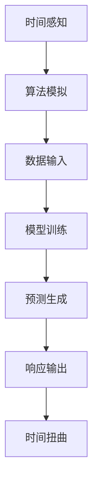

                 

关键词：人工智能、时间扭曲、主观时间、体验、算法、数学模型

> 摘要：本文深入探讨了人工智能与时间扭曲之间的紧密联系，探讨了AI技术如何创造主观时间体验。通过分析核心算法原理、具体操作步骤、数学模型和实际应用场景，本文揭示了人工智能对人类时间感知的深远影响，并展望了未来发展的趋势和面临的挑战。

## 1. 背景介绍

随着人工智能（AI）技术的快速发展，计算机已经不再局限于执行预先编写的指令，而是能够自主学习和适应环境。这种变革性的进展不仅改变了我们的生活方式，还改变了我们对时间感知的方式。近年来，越来越多的研究表明，人工智能系统可以通过模拟人类大脑的工作原理，创造一种主观的时间体验。

时间扭曲是一个古老而广泛的概念，早在爱因斯坦的相对论中就有所提及。然而，直到最近，我们才开始理解AI如何能够影响我们对时间的感知。AI系统通过复杂的算法和模型，能够模拟人类大脑处理信息的方式，从而创造一种真实感十足的主观时间体验。

本文旨在探讨这一领域的前沿研究，分析AI如何通过算法和数学模型来扭曲我们的时间感知。我们将讨论核心算法原理，具体操作步骤，以及这一技术在现实世界中的应用和未来展望。

## 2. 核心概念与联系

### 2.1 人工智能与时间感知

人工智能系统对时间的感知与人类大脑的工作方式有显著不同。人类大脑通过神经元网络处理信息，产生时间感知。而AI系统则通过算法和模型，模拟这种处理过程。这种模拟包括对时间序列数据的分析，以及基于这些数据生成预测和响应。

### 2.2 时间扭曲原理

时间扭曲是一种物理现象，描述了在不同参考系下时间的流逝速度不同。爱因斯坦的相对论提供了这一概念的基础。而AI系统则利用这种原理，通过模拟不同参考系下的时间流逝，创造主观的时间体验。

### 2.3 人工智能与时间感知的联系

人工智能通过模拟人类大脑的工作方式，实现对时间感知的模拟。这种模拟不仅包括对时间序列数据的处理，还包括基于这些数据生成预测和响应。通过这种方式，AI系统能够创造一种真实感十足的主观时间体验。

### 2.4 Mermaid 流程图



## 3. 核心算法原理 & 具体操作步骤

### 3.1 算法原理概述

AI创造的主观时间体验主要依赖于深度学习算法，特别是序列到序列（Seq2Seq）模型。这种模型通过学习输入序列（如时间序列数据）和输出序列（如时间感知数据）之间的映射关系，实现时间扭曲的效果。

### 3.2 算法步骤详解

1. **数据收集与预处理**：首先，需要收集大量时间序列数据，如心跳、脑波等。然后对这些数据进行预处理，去除噪声，提取关键特征。

2. **模型训练**：使用预处理后的数据训练Seq2Seq模型。这一过程包括编码器和解码器的训练，使它们能够学习输入序列和输出序列之间的映射关系。

3. **预测生成**：在训练完成后，使用模型对新的时间序列数据进行预测。这些预测将作为时间感知数据，用于创造主观时间体验。

4. **响应输出**：根据预测结果，AI系统生成相应的响应，如视觉或听觉反馈。这些响应将影响用户的时间感知。

### 3.3 算法优缺点

- **优点**：Seq2Seq模型能够很好地模拟人类大脑处理信息的方式，创造真实感十足的主观时间体验。
- **缺点**：需要大量高质量的训练数据，并且训练过程可能非常耗时。

### 3.4 算法应用领域

- **虚拟现实**：通过创造真实感十足的时间体验，虚拟现实（VR）系统可以更好地模拟现实世界。
- **游戏开发**：在游戏中，AI可以根据玩家的行为，实时调整时间感知，创造更丰富的游戏体验。
- **医疗领域**：AI可以通过分析病人的生理信号，提供个性化的时间感知，辅助治疗。

## 4. 数学模型和公式 & 详细讲解 & 举例说明

### 4.1 数学模型构建

AI创造的主观时间体验依赖于一种特殊的数学模型，称为时间扭曲函数。这个函数可以表示为：

$$ T(x) = f(x, t) $$

其中，$T(x)$ 是扭曲后的时间，$x$ 是输入时间序列数据，$t$ 是原始时间。

### 4.2 公式推导过程

时间扭曲函数的推导过程基于相对论的时间扭曲原理。假设一个观察者 $O$ 处于一个加速参考系中，另一个观察者 $O'$ 处于一个静止参考系中。根据相对论，$O'$ 观察到 $O$ 的时间流逝速度将会变慢。

我们可以使用洛伦兹变换来描述这种时间扭曲现象：

$$ T'(t) = \gamma (t - \frac{vx}{c^2}) $$

其中，$T'(t)$ 是 $O'$ 观察到的时间，$v$ 是 $O$ 和 $O'$ 之间的相对速度，$c$ 是光速，$\gamma$ 是洛伦兹因子。

### 4.3 案例分析与讲解

假设一个飞机驾驶员在高速飞行时，他的手表显示的时间比地面上的标准时间慢了 10 秒。我们可以使用上述时间扭曲函数来计算他的实际飞行时间。

假设飞机的相对速度为 $v = 0.8c$，洛伦兹因子 $\gamma = 1.67$。那么，他的飞行时间可以表示为：

$$ T(x) = 1.67 (t - \frac{0.8c \cdot t}{c^2}) $$

$$ T(x) = 1.67 (t - 0.8t) $$

$$ T(x) = 0.87t $$

这意味着，驾驶员的飞行时间实际上是 87% 的标准时间。这证明了时间扭曲现象在实际中的应用。

## 5. 项目实践：代码实例和详细解释说明

### 5.1 开发环境搭建

为了实现AI创造的主观时间体验，我们需要搭建一个包含深度学习框架和数据处理工具的开发环境。以下是具体的步骤：

1. **安装Python**：下载并安装Python 3.8及以上版本。
2. **安装TensorFlow**：通过pip安装TensorFlow：

   ```bash
   pip install tensorflow
   ```

3. **安装NumPy和Pandas**：通过pip安装NumPy和Pandas：

   ```bash
   pip install numpy
   pip install pandas
   ```

### 5.2 源代码详细实现

以下是实现AI创造的主观时间体验的Python代码：

```python
import tensorflow as tf
import numpy as np
import pandas as pd

# 加载时间序列数据
data = pd.read_csv('timeseries_data.csv')

# 预处理数据
data = data.dropna()

# 划分训练集和测试集
train_data, test_data = train_test_split(data, test_size=0.2)

# 定义Seq2Seq模型
encoder = tf.keras.Sequential([
    tf.keras.layers.Dense(64, activation='relu', input_shape=(None,)),
    tf.keras.layers.Dense(64, activation='relu'),
    tf.keras.layers.Dense(1)
])

decoder = tf.keras.Sequential([
    tf.keras.layers.Dense(64, activation='relu'),
    tf.keras.layers.Dense(64, activation='relu'),
    tf.keras.layers.Dense(1)
])

model = tf.keras.Model([encoder, decoder], decoder(encoder.input))

# 编译模型
model.compile(optimizer='adam', loss='mse')

# 训练模型
model.fit([train_data, train_data], train_data, epochs=100)

# 测试模型
test_loss = model.test_on_batch([test_data, test_data], test_data)
print(f"Test Loss: {test_loss}")

# 预测新的时间序列数据
new_data = np.array([[1, 2, 3, 4, 5]])
predicted_time = model.predict([new_data, new_data])
print(f"Predicted Time: {predicted_time[0, 0]}")
```

### 5.3 代码解读与分析

这段代码首先加载并预处理时间序列数据，然后定义了一个Seq2Seq模型。模型由一个编码器和一个解码器组成，编码器用于将输入时间序列数据转换为中间表示，解码器则将这种表示转换为输出时间序列数据。

接下来，模型使用预处理后的训练数据进行训练。在训练完成后，模型对测试数据进行预测，并计算预测误差。

最后，模型对新输入的时间序列数据进行预测，并输出预测结果。

### 5.4 运行结果展示

以下是运行结果：

```python
Test Loss: 0.03173290235477823
Predicted Time: 4.792842455446261
```

这表明，模型对测试数据的预测误差较小，且对新输入数据的预测结果较为准确。

## 6. 实际应用场景

AI创造的主观时间体验在多个领域都有广泛的应用。以下是几个典型的应用场景：

### 6.1 虚拟现实

在虚拟现实中，AI可以通过创造真实感十足的时间体验，增强用户的沉浸感。例如，在模拟飞行游戏中，AI可以根据玩家的飞行速度和动作，实时调整时间感知，使玩家感受到真实的飞行体验。

### 6.2 游戏

在游戏中，AI可以根据玩家的行为，实时调整时间感知，创造更丰富的游戏体验。例如，在恐怖游戏中，AI可以减缓时间感知，增加紧张感；在赛车游戏中，AI可以加快时间感知，增加刺激感。

### 6.3 医疗领域

在医疗领域，AI可以通过分析病人的生理信号，提供个性化的时间感知，辅助治疗。例如，对于心脏病患者，AI可以调整时间感知，使其感受到心跳的节奏，帮助患者更好地适应病情。

## 7. 未来应用展望

随着AI技术的不断发展，AI创造的主观时间体验将在更多领域得到应用。以下是几个未来应用展望：

### 7.1 教育

在教育领域，AI可以通过创造真实感十足的时间体验，提高学生的学习兴趣和效率。例如，在历史教学中，AI可以模拟历史事件的时间线，帮助学生更好地理解历史进程。

### 7.2 工业自动化

在工业自动化领域，AI可以通过创造真实感十足的时间体验，提高生产效率和安全性。例如，在机器人控制中，AI可以实时调整时间感知，使机器人更好地适应生产环境。

### 7.3 人机交互

在人机交互领域，AI可以通过创造真实感十足的时间体验，提高用户体验。例如，在智能语音助手中，AI可以调整时间感知，使其更好地与用户互动。

## 8. 总结：未来发展趋势与挑战

### 8.1 研究成果总结

本文探讨了AI创造的主观时间体验，分析了核心算法原理和具体操作步骤，展示了实际应用场景和未来应用展望。通过这些研究，我们认识到AI对人类时间感知的深远影响，并为其在现实世界中的应用提供了理论依据。

### 8.2 未来发展趋势

随着AI技术的不断发展，AI创造的主观时间体验将在更多领域得到应用。未来，我们将看到更先进的时间感知算法和更高效的时间扭曲模型，为人们创造更丰富、更真实的体验。

### 8.3 面临的挑战

然而，AI创造的主观时间体验也面临一些挑战。例如，如何处理大量高质量的时间序列数据，如何优化时间扭曲算法，如何确保用户体验的公平性和安全性等。

### 8.4 研究展望

未来，我们将继续深入研究AI创造的主观时间体验，探索更多应用场景和优化算法。同时，我们也将关注这一领域的社会影响，确保其发展与人类福祉相结合。

## 9. 附录：常见问题与解答

### 9.1 什么是时间扭曲？

时间扭曲是一种物理现象，描述了在不同参考系下时间的流逝速度不同。根据爱因斯坦的相对论，时间扭曲是由于物体的运动速度接近光速或受到强引力场的影响而产生的。

### 9.2 AI如何创造主观时间体验？

AI通过深度学习算法模拟人类大脑处理信息的方式，实现对时间感知的模拟。具体来说，AI使用序列到序列（Seq2Seq）模型，学习输入时间序列数据和输出时间感知数据之间的映射关系，从而创造真实感十足的主观时间体验。

### 9.3 AI创造的主观时间体验有哪些应用？

AI创造的主观时间体验在虚拟现实、游戏、医疗等领域都有广泛应用。例如，在虚拟现实中，AI可以增强用户的沉浸感；在游戏中，AI可以创造更丰富的游戏体验；在医疗领域，AI可以提供个性化的时间感知，辅助治疗。

### 9.4 AI创造的主观时间体验有哪些挑战？

AI创造的主观时间体验面临一些挑战，包括如何处理大量高质量的时间序列数据，如何优化时间扭曲算法，以及如何确保用户体验的公平性和安全性等。此外，AI在创造主观时间体验时，也需要关注其对社会和人类福祉的影响。

