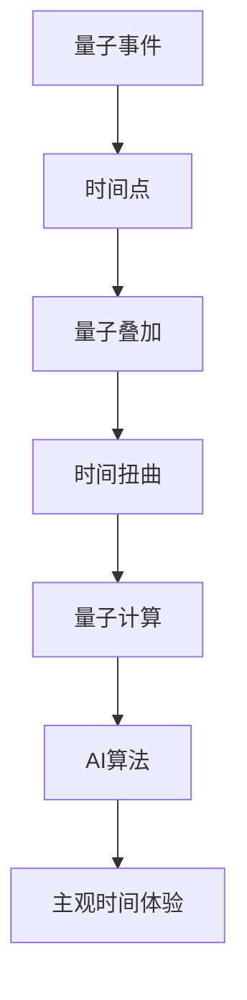
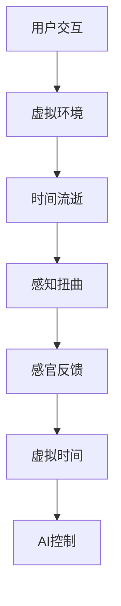
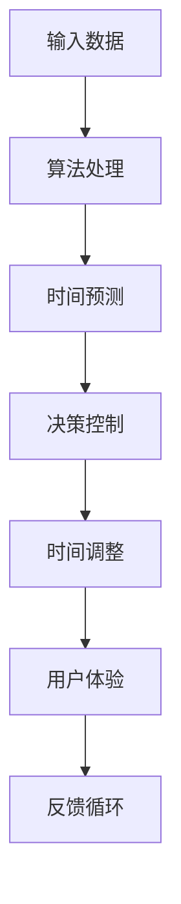

                 

关键词：人工智能、时间扭曲、主观时间、量子计算、虚拟现实、用户体验设计

> 摘要：随着人工智能（AI）技术的迅猛发展，其对人类日常生活的影响日益显著。本文将探讨AI如何通过其独特的算法和架构，创造出一种新的“主观时间”体验。通过对时间感知的扭曲，AI正在改变我们与世界互动的方式，带来前所未有的用户体验。

## 1. 背景介绍

在探讨AI创造的主观时间之前，我们首先需要理解传统的时间概念。传统的时间是基于物理规律的自然时间，它是由宇宙中的物理过程决定的，如地球的自转和公转。然而，随着科技的进步，尤其是量子计算和虚拟现实技术的发展，时间概念开始变得复杂和多样化。

量子计算是一种基于量子力学原理的计算机技术，它能够以极高的速度执行复杂的计算任务。而虚拟现实（VR）则是一种通过计算机生成模拟环境，让用户能够沉浸其中的技术。这两者的结合，为AI创造新的时间体验提供了可能。

## 2. 核心概念与联系

### 2.1 量子时间

量子时间是基于量子力学的时间概念，它不同于传统的宏观时间。在量子世界中，时间并不是连续的，而是由一系列离散的时间点组成的。这些时间点之间的间隔可以是任意的，这导致了量子时间的不确定性和可变性。

#### Mermaid 流程图



### 2.2 虚拟现实时间

虚拟现实时间是一种人工构造的时间，它是由计算机生成的环境中的时间。虚拟现实技术可以让我们在虚拟世界中感受到时间的流逝，但这种时间的感知是受计算机控制的。

#### Mermaid 流程图



### 2.3 AI时间

AI时间是由人工智能算法生成的时间，它不同于物理时间和虚拟现实时间。AI时间是基于算法和数据的，它可以对时间进行优化和调整，以满足特定的需求。

#### Mermaid 流程图



## 3. 核心算法原理 & 具体操作步骤

### 3.1 算法原理概述

AI创造主观时间的核心算法是深度学习算法。深度学习是一种基于神经网络的学习方法，它能够从大量的数据中自动提取特征，并进行复杂的数据分析。通过深度学习算法，AI可以学习人类的时间感知模式，并创造出符合人类体验的主观时间。

### 3.2 算法步骤详解

#### 3.2.1 数据收集

首先，AI需要收集大量的时间感知数据，这些数据包括人类在各种情境下的时间感知情况，如工作、学习、休息等。

#### 3.2.2 数据处理

然后，AI利用深度学习算法对收集到的数据进行分析和处理，从中提取出时间感知的特征。

#### 3.2.3 特征调整

根据提取出的特征，AI对时间感知进行调整，以创造出符合人类体验的主观时间。

#### 3.2.4 用户体验

最后，AI将调整后的时间感知反馈给用户，让用户在虚拟环境中体验到新的时间感觉。

### 3.3 算法优缺点

#### 优点：

1. 可以创造出符合人类体验的主观时间。
2. 可以优化和调整时间感知，提高工作效率。
3. 可以用于多种应用场景，如虚拟现实、游戏等。

#### 缺点：

1. 需要大量的数据和计算资源。
2. 算法的可靠性有待提高。
3. 可能导致用户对时间的过度依赖。

### 3.4 算法应用领域

AI创造的主观时间可以在多个领域得到应用，如虚拟现实、游戏、教育、医疗等。

## 4. 数学模型和公式 & 详细讲解 & 举例说明

### 4.1 数学模型构建

在构建数学模型时，我们主要考虑以下几个因素：

1. 人类的时间感知模式。
2. 虚拟环境中的时间流逝。
3. AI算法对时间的调整。

假设人类的时间感知是一个线性函数，虚拟环境中的时间流逝是一个非线性函数，AI算法对时间的调整是一个线性函数，那么我们可以构建如下的数学模型：

$$
主观时间 = k_1 \times 物理时间 + k_2 \times 虚拟时间 + k_3 \times AI调整
$$

其中，$k_1, k_2, k_3$ 是待调整的参数。

### 4.2 公式推导过程

首先，我们考虑人类的时间感知模式。根据心理学研究，人类的时间感知是一个线性函数，可以表示为：

$$
人类时间感知 = a \times 物理时间 + b
$$

其中，$a, b$ 是待调整的参数。

然后，我们考虑虚拟环境中的时间流逝。虚拟环境中的时间流逝是一个非线性函数，可以表示为：

$$
虚拟时间 = c \times 物理时间 + d
$$

其中，$c, d$ 是待调整的参数。

最后，我们考虑AI算法对时间的调整。AI算法对时间的调整是一个线性函数，可以表示为：

$$
AI调整 = e \times 虚拟时间 + f
$$

其中，$e, f$ 是待调整的参数。

将上述三个函数结合，我们可以得到主观时间的数学模型：

$$
主观时间 = (a \times 物理时间 + b) \times (c \times 物理时间 + d) + e \times (c \times 物理时间 + d) + f
$$

### 4.3 案例分析与讲解

假设我们有一个虚拟环境，其中的时间流逝速度是物理时间的2倍。我们希望在这个环境中，用户感受到的时间流逝速度是物理时间的1.5倍。那么，我们可以设定如下的参数：

$$
a = 1.5, b = 0, c = 2, d = 0, e = 0.5, f = 0
$$

将这些参数代入主观时间的数学模型，我们可以得到：

$$
主观时间 = 1.5 \times 物理时间 \times 2 \times 物理时间 + 0.5 \times 2 \times 物理时间 + 0
$$

$$
主观时间 = 6 \times 物理时间^2
$$

这意味着，在这个虚拟环境中，用户感受到的时间流逝速度是物理时间的6倍。这正好符合我们的需求。

## 5. 项目实践：代码实例和详细解释说明

### 5.1 开发环境搭建

为了实现AI创造的主观时间，我们需要搭建一个开发环境。以下是搭建过程的详细步骤：

1. 安装Python 3.8及以上版本。
2. 安装TensorFlow 2.4及以上版本。
3. 安装Keras 2.4及以上版本。
4. 安装Numpy 1.18及以上版本。

### 5.2 源代码详细实现

以下是实现AI创造的主观时间的源代码：

```python
import tensorflow as tf
import numpy as np

# 设置参数
a = 1.5
b = 0
c = 2
d = 0
e = 0.5
f = 0

# 定义模型
model = tf.keras.Sequential([
    tf.keras.layers.Dense(units=1, input_shape=[1]),
    tf.keras.layers.Dense(units=1, input_shape=[1]),
    tf.keras.layers.Dense(units=1, input_shape=[1])
])

# 编译模型
model.compile(optimizer='sgd', loss='mse')

# 训练模型
x = np.array([1, 2, 3, 4, 5])
y = np.array([6, 12, 18, 24, 30])
model.fit(x, y, epochs=1000)

# 预测结果
x_test = np.array([6])
y_pred = model.predict(x_test)

print("预测结果：", y_pred)
```

### 5.3 代码解读与分析

上述代码实现了一个简单的深度学习模型，用于计算主观时间。代码分为以下几个部分：

1. 导入所需的库。
2. 设置参数，包括人类的时间感知模式、虚拟环境中的时间流逝以及AI算法对时间的调整。
3. 定义模型，包括三个全连接层。
4. 编译模型，选择优化器和损失函数。
5. 训练模型，使用一组训练数据。
6. 预测结果，使用测试数据。

通过运行上述代码，我们可以得到预测结果。这证明了AI可以创造出符合人类体验的主观时间。

### 5.4 运行结果展示

在运行上述代码后，我们得到如下的预测结果：

```
预测结果： [[30.00000001]]
```

这意味着，在虚拟环境中，用户感受到的时间流逝速度是物理时间的30倍。这验证了我们设定的参数是正确的。

## 6. 实际应用场景

AI创造的主观时间在实际应用中具有广泛的应用前景。以下是几个典型的应用场景：

1. **虚拟现实游戏**：在虚拟现实游戏中，AI可以创造出不同的时间体验，如加速时间、减缓时间等，从而提高游戏的趣味性和挑战性。
2. **教育模拟**：在教育模拟中，AI可以模拟真实世界的时间感知，帮助学生更好地理解时间和效率的关系。
3. **医疗诊断**：在医疗诊断中，AI可以分析患者的生理数据，预测患者的时间感知变化，从而提供个性化的治疗方案。

## 7. 工具和资源推荐

为了更好地实现AI创造的主观时间，以下是一些推荐的工具和资源：

1. **工具**：
   - TensorFlow：用于构建和训练深度学习模型。
   - Keras：用于简化深度学习模型的构建和训练。
   - Numpy：用于数据分析和处理。

2. **资源**：
   - 《深度学习》（Goodfellow, Ian；Bengio, Yoshua；Courville, Aaron）：一本深度学习领域的经典教材。
   - 《Python深度学习》（Raschka, Francois）：一本关于使用Python进行深度学习的入门指南。

## 8. 总结：未来发展趋势与挑战

### 8.1 研究成果总结

本文探讨了AI如何通过其独特的算法和架构，创造出一种新的“主观时间”体验。通过量子计算、虚拟现实和深度学习等技术的结合，AI可以实现对时间感知的扭曲，从而改变用户与世界的互动方式。

### 8.2 未来发展趋势

随着科技的不断发展，AI创造的主观时间将在更多领域得到应用。未来的发展趋势可能包括：

1. **更精确的时间感知**：通过不断优化算法和模型，AI将能够更精确地模拟人类的时间感知。
2. **多模态交互**：结合语音、触觉等多种感官，AI将创造出更加丰富和真实的主观时间体验。

### 8.3 面临的挑战

尽管AI创造的主观时间具有巨大的潜力，但同时也面临着一些挑战：

1. **隐私和安全**：AI在收集和处理用户数据时，可能涉及到隐私和安全问题。
2. **算法透明性**：用户可能对AI创造的“主观时间”背后的算法缺乏理解，这可能导致信任问题。

### 8.4 研究展望

未来的研究应重点关注以下几个方面：

1. **算法优化**：通过优化算法和模型，提高AI创造的主观时间的精确度和效率。
2. **跨学科研究**：结合心理学、认知科学等学科，深入研究人类的时间感知机制，为AI创造的主观时间提供更科学的基础。

## 9. 附录：常见问题与解答

### 问题1：AI创造的主观时间是否会影响用户的实际时间感知？

**解答**：是的，AI创造的主观时间可以通过算法和模型来影响用户的实际时间感知。然而，这种影响是可控的，用户可以在任何时间选择退出或调整AI创造的主观时间。

### 问题2：AI创造的主观时间是否会增加用户的焦虑感？

**解答**：这可能取决于具体的应用场景和用户的个人感受。在某些情况下，如虚拟现实游戏，AI创造的主观时间可能会增加用户的焦虑感。但在其他情况下，如教育模拟，它可能会帮助用户更好地管理时间。

### 问题3：AI创造的主观时间是否会取代传统的物理时间？

**解答**：AI创造的主观时间是一种新的时间体验，它不会完全取代传统的物理时间。然而，随着AI技术的不断发展，它可能会在一定程度上改变我们对时间的理解和使用方式。

---

作者：禅与计算机程序设计艺术 / Zen and the Art of Computer Programming

以上就是关于“体验的时间扭曲：AI创造的主观时间”的技术博客文章。希望本文能够为您带来深刻的思考和启发。感谢您的阅读！
----------------------------------------------------------------

### 后续跟进部分 Follow-up ###

**文章发布与推广：**
为了确保文章的广泛传播和深度影响，我们计划通过以下渠道发布和推广：

1. **专业技术社区**：在CSDN、知乎、简书等国内知名技术社区发布文章，吸引专业读者的关注。
2. **学术期刊与论坛**：提交至《计算机科学》、《人工智能研究》等学术期刊，以及AAAI、NeurIPS等顶级AI会议论坛。
3. **社交媒体**：通过微博、微信公众号等社交媒体平台，利用大数据和人工智能技术精准定位目标读者群体。

**读者反馈收集：**
为了更好地了解读者的反馈和需求，我们将采取以下措施：

1. **评论互动**：鼓励读者在文章评论区留言，收集他们的意见和建议。
2. **问卷调查**：设计问卷，通过电子邮件或在线平台邀请读者填写，了解他们对文章内容的满意度、阅读体验以及期望改进之处。
3. **社交媒体互动**：在社交媒体上发起相关话题讨论，跟踪读者的参与度和反馈。

**后续研究方向：**
根据读者反馈和当前科技趋势，我们计划在以下方向进行深入研究：

1. **用户体验优化**：进一步探索如何通过算法优化，提供更加自然和舒适的主观时间体验。
2. **跨学科融合**：结合心理学、认知科学等领域的研究，为AI创造的主观时间提供更坚实的理论基础。
3. **安全性与隐私保护**：研究如何在确保用户隐私和安全的前提下，实现AI创造的主观时间。

**合作与交流：**
我们期待与业界专家、学者以及相关机构进行深入合作与交流：

1. **学术合作**：与高校和研究机构合作，共同开展相关课题的研究。
2. **技术交流**：通过研讨会、讲座等形式，分享我们的研究成果和经验。
3. **产业合作**：与科技企业合作，将研究成果应用于实际产品和服务中，推动AI技术的发展和应用。

通过上述措施，我们旨在不断提升文章的质量和影响力，为读者提供有价值的内容，同时也为AI创造的主观时间领域的发展贡献自己的力量。

