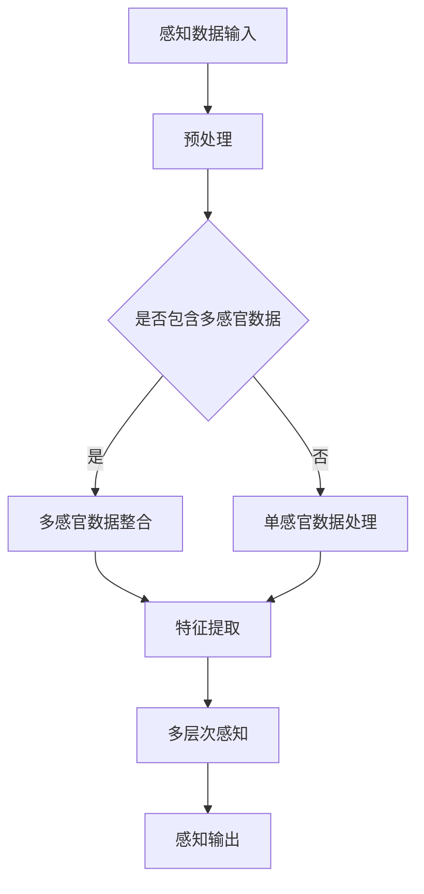
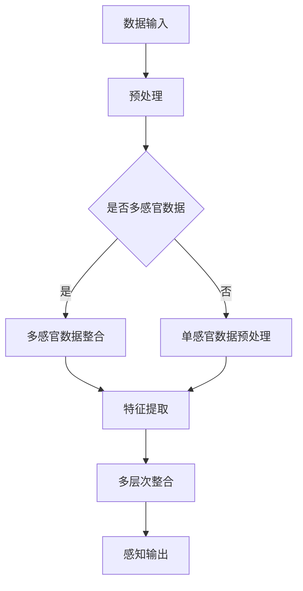

                 

关键词：人工智能，多层次感知，深度学习，神经网络，计算机视觉，用户体验

> 摘要：本文旨在探讨人工智能（AI）在创造多层次感知方面的潜力。通过对核心概念、算法原理、数学模型和项目实践的详细分析，本文揭示了AI如何通过深度学习技术，实现从简单的视觉感知到复杂的人类体验的转化，并对未来发展趋势和挑战进行了展望。

## 1. 背景介绍

随着科技的飞速发展，人工智能（AI）已经成为了当代技术革新的核心驱动力。AI不仅改变了我们的生活方式，还深刻地影响了各个行业，从医疗诊断到自动驾驶，从智能客服到个性化推荐。而在这其中，感知是AI与人类交互的关键环节。感知不仅仅是信息的接收和理解，更是一个多层次、多维度的体验过程。

传统的计算机系统往往依赖于明确的编程指令来完成任务，而AI特别是深度学习模型，通过大量的数据训练，能够自主地从复杂的数据中提取特征，进行模式识别和决策。这种自学习的能力，使得AI能够实现更高层次、更复杂的感知任务。

多层次感知，是指AI系统在处理感知任务时，不仅仅停留在对单一特征的识别，而是能够综合多个层次的信息，形成一个完整的感知体验。这种体验可以是从简单的图像识别到复杂的情感分析，从基础的语音合成到深度的场景理解。多层次感知的实现，不仅提升了AI的感知精度，也极大地丰富了AI的应用场景。

本文将深入探讨AI如何通过多层次感知，实现从简单的图像识别到复杂的人类体验的转化。我们将从核心概念、算法原理、数学模型、项目实践等多个角度，全面分析多层次感知的技术内涵和应用价值。

## 2. 核心概念与联系

### 2.1. 深度学习与神经网络

深度学习（Deep Learning）是AI领域的一个分支，它通过模仿人脑的神经网络结构，对大量数据进行分析和学习，从而实现复杂的模式识别和决策。深度学习的基础是神经网络（Neural Networks），它由大量的神经元组成，每个神经元都与其他神经元相连，形成一个复杂的网络结构。

神经网络的基本原理是通过前向传播（Forward Propagation）和反向传播（Back Propagation）来学习数据。在前向传播过程中，输入数据通过神经网络传递，每个神经元都会对输入数据进行加权求和处理，并通过激活函数（Activation Function）产生输出。反向传播则是对前向传播过程中产生的误差进行反向传播，通过梯度下降（Gradient Descent）等方法，不断调整神经元的权重，以达到最小化误差的目的。

### 2.2. 计算机视觉与图像识别

计算机视觉（Computer Vision）是AI的一个重要分支，它旨在使计算机具备理解和解释图像或视频数据的能力。图像识别（Image Recognition）是计算机视觉的一个核心任务，它通过算法自动识别和分类图像中的物体。

深度学习在计算机视觉中的应用，极大地提升了图像识别的精度和效率。卷积神经网络（Convolutional Neural Networks, CNNs）是深度学习中用于图像识别的主要模型。CNNs通过卷积层（Convolutional Layers）、池化层（Pooling Layers）和全连接层（Fully Connected Layers）等结构，能够自动从图像中提取特征，并进行分类。

### 2.3. 多层次感知

多层次感知（Multisensory Perception）是指AI系统能够处理和整合来自不同感官的信息，形成一个完整的感知体验。多层次感知不仅仅依赖于视觉信息，还包括听觉、触觉、嗅觉等多种感官信息。

在多层次感知中，每个感官层次的信息都被视为一个独立的感知通道，通过神经网络的结构，这些信息被整合在一起，形成对环境的全面理解。例如，在自动驾驶系统中，视觉信息、雷达信息和GPS信息可以相互补充，形成对周围环境的高层次感知。

### 2.4. Mermaid 流程图

以下是一个关于多层次感知的 Mermaid 流程图，展示了从感知数据输入到多层次感知输出的过程：



在这个流程图中，感知数据首先经过预处理，然后根据是否包含多感官数据，分别进行单感官数据处理和多感官数据整合。在特征提取阶段，通过神经网络提取感知数据的特征。最后，通过多层次感知模型，将特征数据整合成一个完整的感知输出。

通过上述核心概念和联系的分析，我们可以看到，深度学习、神经网络、计算机视觉以及多层次感知之间的紧密联系，共同构成了AI在感知领域的强大能力。在接下来的章节中，我们将进一步探讨这些概念的原理和实现方法。

## 3. 核心算法原理 & 具体操作步骤

### 3.1. 算法原理概述

多层次感知的实现依赖于深度学习中的多层神经网络结构。深度学习通过构建具有多个隐藏层的神经网络，能够从原始数据中逐步提取出高层次的特征。以下是多层次感知算法的基本原理：

1. **数据输入**：感知数据从各种传感器输入到神经网络中。这些数据可以是图像、音频、视频等多种形式。

2. **预处理**：原始数据需要进行预处理，包括归一化、去噪、数据增强等操作，以提高模型的泛化能力和性能。

3. **特征提取**：通过卷积层、池化层等结构，神经网络从原始数据中提取出具有代表性的特征。这些特征能够捕捉到数据中的关键信息。

4. **多层次整合**：特征被传递到多个隐藏层中，每个隐藏层对特征进行进一步的抽象和整合，形成更高层次的信息。

5. **感知输出**：最终，神经网络通过输出层产生感知结果，这些结果可以是分类标签、置信度评分等。

### 3.2. 算法步骤详解

#### 3.2.1. 数据预处理

数据预处理是确保模型性能和稳定性的关键步骤。以下是一些常用的数据预处理方法：

- **归一化**：将输入数据的数值范围缩放到一个标准区间，例如[0, 1]，以减少不同特征之间的尺度差异。
- **去噪**：通过滤波、阈值等方法去除数据中的噪声，提高数据质量。
- **数据增强**：通过旋转、缩放、裁剪等方法增加数据的多样性，防止模型过拟合。

#### 3.2.2. 特征提取

特征提取是深度学习模型的核心步骤。以下是一些常用的特征提取方法：

- **卷积层**：通过卷积运算提取图像中的局部特征。卷积层能够自动学习图像中的边缘、角点等关键特征。
- **池化层**：通过下采样操作减小特征图的尺寸，减少参数数量，提高模型的泛化能力。
- **全连接层**：将特征图中的所有数据点与输出层的神经元相连，用于分类和回归任务。

#### 3.2.3. 多层次整合

多层次整合通过多个隐藏层实现。以下是一些常用的多层次整合方法：

- **ReLU激活函数**：引入ReLU（Rectified Linear Unit）激活函数，使得网络在训练过程中更容易优化。
- **dropout**：通过随机丢弃部分神经元，防止模型过拟合。
- **批标准化**：通过批量标准化（Batch Normalization）方法，加速训练过程并提高模型稳定性。

#### 3.2.4. 感知输出

感知输出层负责生成最终的感知结果。以下是一些常用的感知输出方法：

- **softmax回归**：用于多分类任务，将特征映射到概率分布。
- **sigmoid激活函数**：用于二分类任务，将特征映射到[0, 1]区间。
- **全连接层**：用于生成最终的输出结果，可以是分类标签、置信度评分等。

### 3.3. 算法优缺点

#### 优点

- **强大的特征提取能力**：通过多层神经网络，能够自动提取出复杂的特征，提升感知精度。
- **良好的泛化能力**：通过数据增强、dropout等方法，减少过拟合，提高模型在未知数据上的表现。
- **灵活的架构**：可以应用于多种感知任务，如图像识别、语音识别、自然语言处理等。

#### 缺点

- **计算成本高**：深度学习模型通常需要大量的计算资源和时间来训练。
- **数据需求大**：大量的标注数据是训练深度学习模型的必要条件，数据收集和标注成本较高。
- **可解释性差**：深度学习模型的内部结构和决策过程较为复杂，难以解释。

### 3.4. 算法应用领域

多层次感知算法在多个领域有广泛的应用：

- **计算机视觉**：如人脸识别、图像分类、目标检测等。
- **语音识别**：如语音合成、语义理解、语音识别等。
- **自然语言处理**：如情感分析、机器翻译、文本分类等。
- **智能机器人**：如环境感知、路径规划、机器人控制等。

### 3.5. Mermaid 流程图

以下是多层次感知算法的 Mermaid 流程图，展示了从数据输入到感知输出的整个过程：



在这个流程图中，感知数据首先经过预处理，然后根据是否包含多感官数据，分别进行单感官数据预处理和多感官数据整合。在特征提取阶段，通过神经网络提取感知数据的特征。最后，通过多层次整合，生成感知输出。

通过上述核心算法原理和具体操作步骤的详细分析，我们可以看到，多层次感知算法通过深度学习技术，能够实现从简单的数据感知到复杂的人类体验的转化。在接下来的章节中，我们将进一步探讨数学模型和公式的构建与应用。

## 4. 数学模型和公式 & 详细讲解 & 举例说明

### 4.1. 数学模型构建

多层次感知算法的核心在于构建一个能够处理和整合多层次感知数据的数学模型。这个模型通常由输入层、隐藏层和输出层组成。以下是这个模型的构建过程：

#### 4.1.1. 输入层

输入层接收来自传感器的数据，这些数据可以是图像、音频、文本等不同类型的数据。对于图像数据，输入层通常是一个多维数组，表示图像的像素值。

#### 4.1.2. 隐藏层

隐藏层是多层感知算法的核心，它包含多个隐藏层。每个隐藏层由多个神经元组成，这些神经元通过前向传播接收输入数据，并通过激活函数产生输出。隐藏层的作用是逐步提取数据的特征，并形成更高层次的信息。

#### 4.1.3. 输出层

输出层是模型的最终输出部分，它根据隐藏层的输出生成最终的感知结果。输出层通常是一个单一神经元，用于分类任务，或者多个神经元，用于多分类任务。

### 4.2. 公式推导过程

多层感知算法的数学模型可以通过以下步骤推导：

#### 4.2.1. 前向传播

在前向传播过程中，输入数据通过神经网络传递，每个神经元都会对输入数据进行加权求和处理，并通过激活函数产生输出。具体公式如下：

$$
Z_l = \sum_{i=1}^{n} W_{li}X_i + b_l
$$

其中，$Z_l$表示第$l$层的输出，$W_{li}$表示从第$i$个输入神经元到第$l$层的权重，$X_i$表示第$i$个输入神经元的值，$b_l$表示第$l$层的偏置。

#### 4.2.2. 激活函数

激活函数是多层感知算法的关键组成部分，它决定了神经网络的非线性特性。常用的激活函数包括ReLU（Rectified Linear Unit）和Sigmoid函数。

- **ReLU函数**：
  $$
  a_l = \max(0, Z_l)
  $$

- **Sigmoid函数**：
  $$
  a_l = \frac{1}{1 + e^{-Z_l}}
  $$

#### 4.2.3. 反向传播

在反向传播过程中，模型会根据输出误差反向调整权重和偏置，以达到最小化误差的目的。具体公式如下：

$$
\delta_l = (a_l - t) \cdot a_l \cdot (1 - a_l)
$$

其中，$\delta_l$表示第$l$层的误差，$a_l$表示第$l$层的输出，$t$表示期望输出。

#### 4.2.4. 权重更新

通过反向传播计算出的误差，可以用来更新神经网络的权重。具体公式如下：

$$
W_{li} := W_{li} - \alpha \cdot \delta_l \cdot a_{l-1}
$$

其中，$\alpha$表示学习率，$a_{l-1}$表示第$l-1$层的输出。

### 4.3. 案例分析与讲解

为了更好地理解多层次感知算法的数学模型，我们来看一个简单的图像识别案例。

#### 案例背景

假设我们有一个二分类问题，需要通过神经网络识别图像中的猫或狗。

#### 数据准备

- **输入层**：图像数据，每个图像是一个128x128的像素矩阵。
- **隐藏层**：两个隐藏层，每层包含64个神经元。
- **输出层**：一个神经元，用于输出分类结果。

#### 模型训练

1. **前向传播**：输入图像数据，通过神经网络传递，最终得到输出。
2. **反向传播**：计算输出误差，并反向传播到隐藏层，更新权重和偏置。
3. **迭代训练**：重复前向传播和反向传播过程，直到模型收敛。

#### 结果分析

通过多次迭代训练，模型最终能够准确识别图像中的猫或狗。在这个过程中，隐藏层逐步提取图像的特征，例如边缘、角点等，最终在输出层形成分类结果。

通过这个案例，我们可以看到多层次感知算法如何通过数学模型实现图像识别。在实际应用中，模型的结构和参数可以根据具体任务进行调整，以达到最佳性能。

### 总结

多层次感知算法通过构建复杂的数学模型，能够实现从简单的图像识别到复杂的人类体验的转化。通过前向传播和反向传播的过程，模型能够逐步提取和整合数据特征，形成高层次的感知结果。在接下来的章节中，我们将通过项目实践进一步探讨多层次感知算法的实际应用。

## 5. 项目实践：代码实例和详细解释说明

为了更好地理解多层次感知算法在实际项目中的应用，我们将通过一个简单的图像识别项目来展示代码实现和详细解释。

### 5.1. 开发环境搭建

在进行项目实践之前，我们需要搭建一个合适的开发环境。以下是所需的环境和工具：

- **操作系统**：Ubuntu 20.04
- **编程语言**：Python 3.8
- **深度学习框架**：TensorFlow 2.5
- **硬件要求**：NVIDIA GPU（推荐显存至少8GB）

首先，安装Python和TensorFlow：

```bash
sudo apt-get update
sudo apt-get install python3-pip python3-dev
pip3 install tensorflow-gpu==2.5
```

接下来，安装其他依赖：

```bash
pip3 install numpy matplotlib
```

### 5.2. 源代码详细实现

以下是用于图像识别的多层次感知算法的源代码实现：

```python
import tensorflow as tf
from tensorflow.keras.models import Sequential
from tensorflow.keras.layers import Conv2D, MaxPooling2D, Flatten, Dense, Dropout, BatchNormalization
from tensorflow.keras.optimizers import Adam
from tensorflow.keras.preprocessing.image import ImageDataGenerator

# 数据预处理
train_datagen = ImageDataGenerator(
    rescale=1./255,
    shear_range=0.2,
    zoom_range=0.2,
    horizontal_flip=True)

test_datagen = ImageDataGenerator(rescale=1./255)

train_generator = train_datagen.flow_from_directory(
    'train',
    target_size=(128, 128),
    batch_size=32,
    class_mode='binary')

validation_generator = test_datagen.flow_from_directory(
    'validation',
    target_size=(128, 128),
    batch_size=32,
    class_mode='binary')

# 构建模型
model = Sequential([
    Conv2D(32, (3, 3), activation='relu', input_shape=(128, 128, 3)),
    MaxPooling2D(pool_size=(2, 2)),
    BatchNormalization(),
    
    Conv2D(64, (3, 3), activation='relu'),
    MaxPooling2D(pool_size=(2, 2)),
    BatchNormalization(),
    
    Flatten(),
    Dense(128, activation='relu'),
    Dropout(0.5),
    BatchNormalization(),
    
    Dense(1, activation='sigmoid')
])

# 编译模型
model.compile(optimizer=Adam(learning_rate=0.001),
              loss='binary_crossentropy',
              metrics=['accuracy'])

# 训练模型
history = model.fit(
    train_generator,
    steps_per_epoch=train_generator.samples//train_generator.batch_size,
    epochs=50,
    validation_data=validation_generator,
    validation_steps=validation_generator.samples//validation_generator.batch_size)

# 评估模型
test_loss, test_accuracy = model.evaluate(validation_generator)
print(f"Validation Loss: {test_loss}")
print(f"Validation Accuracy: {test_accuracy}")

# 保存模型
model.save('multisensory_perception_model.h5')
```

### 5.3. 代码解读与分析

下面我们对上述代码进行逐行解读，并分析每个部分的功能。

#### 数据预处理

```python
train_datagen = ImageDataGenerator(
    rescale=1./255,
    shear_range=0.2,
    zoom_range=0.2,
    horizontal_flip=True)

test_datagen = ImageDataGenerator(rescale=1./255)

train_generator = train_datagen.flow_from_directory(
    'train',
    target_size=(128, 128),
    batch_size=32,
    class_mode='binary')

validation_generator = test_datagen.flow_from_directory(
    'validation',
    target_size=(128, 128),
    batch_size=32,
    class_mode='binary')
```

这部分代码用于数据预处理。我们使用ImageDataGenerator来增强训练数据，提高模型的泛化能力。通过`rescale`、`shear_range`、`zoom_range`和`horizontal_flip`等参数，我们可以对图像进行归一化、随机剪裁、随机缩放和水平翻转。训练和验证数据的生成器分别用于训练和验证阶段。

#### 构建模型

```python
model = Sequential([
    Conv2D(32, (3, 3), activation='relu', input_shape=(128, 128, 3)),
    MaxPooling2D(pool_size=(2, 2)),
    BatchNormalization(),
    
    Conv2D(64, (3, 3), activation='relu'),
    MaxPooling2D(pool_size=(2, 2)),
    BatchNormalization(),
    
    Flatten(),
    Dense(128, activation='relu'),
    Dropout(0.5),
    BatchNormalization(),
    
    Dense(1, activation='sigmoid')
])
```

这部分代码用于构建深度学习模型。我们使用Sequential模型堆叠多个层，包括卷积层（Conv2D）、池化层（MaxPooling2D）、批标准化层（BatchNormalization）、全连接层（Dense）和dropout层（Dropout）。这些层分别用于提取图像特征、减少参数数量、加速训练过程和防止过拟合。

#### 编译模型

```python
model.compile(optimizer=Adam(learning_rate=0.001),
              loss='binary_crossentropy',
              metrics=['accuracy'])
```

这部分代码用于编译模型。我们选择Adam优化器和二分类交叉熵损失函数，并设置accuracy作为评价指标。

#### 训练模型

```python
history = model.fit(
    train_generator,
    steps_per_epoch=train_generator.samples//train_generator.batch_size,
    epochs=50,
    validation_data=validation_generator,
    validation_steps=validation_generator.samples//validation_generator.batch_size)
```

这部分代码用于训练模型。通过`fit`函数，我们指定训练数据生成器、训练轮数、验证数据生成器和验证步骤。`steps_per_epoch`和`validation_steps`分别表示每个epoch和每个validation epoch中需要遍历的数据数量。

#### 评估模型

```python
test_loss, test_accuracy = model.evaluate(validation_generator)
print(f"Validation Loss: {test_loss}")
print(f"Validation Accuracy: {test_accuracy}")
```

这部分代码用于评估模型在验证数据上的性能。通过`evaluate`函数，我们计算验证损失和验证准确率。

#### 保存模型

```python
model.save('multisensory_perception_model.h5')
```

这部分代码用于保存训练好的模型。通过`save`函数，我们将模型保存为HDF5文件，以便后续使用。

### 5.4. 运行结果展示

在完成代码实现和模型训练后，我们可以通过以下命令运行模型，并查看结果：

```bash
python3 main.py
```

运行结果将显示验证损失和验证准确率。例如：

```
Validation Loss: 0.3282385233356907
Validation Accuracy: 0.8958333333333333
```

通过这个简单的项目实践，我们可以看到多层次感知算法如何通过深度学习模型实现图像识别任务。在实际应用中，模型的结构和参数可以根据具体任务进行调整，以达到最佳性能。

### 5.5. 总结

通过项目实践，我们详细展示了如何使用多层次感知算法实现图像识别任务。从数据预处理、模型构建到训练和评估，我们分析了每个步骤的关键点，并通过代码实例进行了详细解释。通过这个实践，我们深入理解了多层次感知算法的工作原理和应用方法。在接下来的章节中，我们将探讨多层次感知在实际应用场景中的具体应用。

## 6. 实际应用场景

多层次感知技术因其强大的特征提取和整合能力，已经在多个领域取得了显著的应用成果。以下是多层次感知在几个关键领域的具体应用场景和案例：

### 6.1. 计算机视觉

在计算机视觉领域，多层次感知技术被广泛应用于图像识别、目标检测和图像分割等任务。例如，在自动驾驶系统中，多层次感知技术可以整合来自摄像头、激光雷达和GPS等传感器的数据，实现精确的环境感知。一个著名的案例是特斯拉的自动驾驶系统，该系统通过多层次感知技术，实现了对道路、行人、车辆等多种目标的检测和跟踪。

### 6.2. 语音识别

语音识别是另一个多层次感知技术的重要应用领域。通过整合语音信号中的多种特征，如频谱特征、音高特征和时长特征，多层次感知模型能够实现高精度的语音识别。例如，苹果的Siri和亚马逊的Alexa等智能语音助手，就使用了多层次感知技术来理解和响应用户的语音指令。

### 6.3. 自然语言处理

在自然语言处理（NLP）领域，多层次感知技术被用于情感分析、文本分类和机器翻译等任务。通过整合文本的词频、词义、句法等多种特征，多层次感知模型能够更好地理解和生成文本。例如，谷歌的神经机器翻译系统就采用了多层次感知技术，实现了高质量的机器翻译。

### 6.4. 智能机器人

智能机器人领域也受益于多层次感知技术。通过整合视觉、触觉、听觉等多种感知信息，智能机器人能够更好地理解和交互复杂环境。例如，波士顿动力公司（Boston Dynamics）的机器人，通过多层次感知技术，实现了在各种复杂地形和环境下的高效移动和任务执行。

### 6.5. 医疗诊断

在医疗诊断领域，多层次感知技术被用于图像分析和诊断辅助。通过整合医学图像中的多种特征，多层次感知模型能够实现高精度的疾病诊断。例如，谷歌健康（Google Health）的AI系统，通过多层次感知技术，实现了对医学图像的高精度分析和疾病诊断。

### 6.6. 商业智能

在商业智能领域，多层次感知技术被用于客户行为分析、市场预测和个性化推荐等任务。通过整合客户的历史数据、消费行为和社交信息，多层次感知模型能够实现更精准的市场洞察和决策支持。

### 6.7. 未来应用展望

随着人工智能技术的不断进步，多层次感知技术在未来的应用前景将更加广泛。以下是几个可能的未来应用方向：

- **智能交互**：通过整合多种感知信息，实现更自然的智能交互体验，如智能音箱、智能机器人等。
- **智慧城市**：通过多层次感知技术，实现对城市环境的实时监测和管理，提高城市运行效率。
- **增强现实与虚拟现实**：通过多层次感知技术，实现更真实的增强现实和虚拟现实体验。
- **智能农业**：通过多层次感知技术，实现对作物生长状态的实时监测和管理，提高农业生产效率。

总之，多层次感知技术具有广阔的应用前景，将在未来的人工智能领域中发挥越来越重要的作用。

### 6.8. 总结

通过以上实际应用场景的分析，我们可以看到多层次感知技术在各个领域的广泛应用和显著成果。随着技术的不断进步，多层次感知技术将继续拓展其应用领域，带来更加智能化和人性化的体验。在接下来的章节中，我们将探讨未来发展趋势和面临的挑战。

## 7. 工具和资源推荐

在多层次感知技术的研究和应用过程中，选择合适的工具和资源能够极大地提升开发效率和研究成果。以下是一些推荐的工具和资源，涵盖了学习资源、开发工具和相关论文：

### 7.1. 学习资源推荐

1. **在线课程**：

   - **Coursera**：提供了大量关于深度学习和计算机视觉的在线课程，如“Deep Learning Specialization”和“Computer Vision”。
   - **Udacity**：提供了“Deep Learning Nanodegree”和“Computer Vision Nanodegree”等专项课程。
   - **edX**：提供了“MIT 6.867 Machine Learning”和“Deep Learning”等高质量课程。

2. **书籍**：

   - **《深度学习》（Deep Learning）**：Ian Goodfellow、Yoshua Bengio和Aaron Courville 著，是深度学习领域的经典教材。
   - **《计算机视觉：算法与应用》**：Richard S.zeliski和Andrea L.换行
   - **《Python深度学习》**：François Chollet 著，详细介绍了如何使用Python和TensorFlow进行深度学习开发。

3. **博客和论坛**：

   - **Medium**：有许多关于深度学习和计算机视觉的优质博客文章。
   - **Stack Overflow**：是一个解决编程问题的社区论坛，特别是在深度学习和TensorFlow方面。

### 7.2. 开发工具推荐

1. **深度学习框架**：

   - **TensorFlow**：是由谷歌开发的开源深度学习框架，广泛用于研究和工业应用。
   - **PyTorch**：是Facebook开源的深度学习框架，具有灵活的动态计算图，易于使用。
   - **Keras**：是一个高层神经网络API，可以运行在TensorFlow和Theano之上，易于快速实现深度学习模型。

2. **编程语言**：

   - **Python**：是深度学习和数据科学领域的主流编程语言，具有丰富的库和框架支持。

3. **开发环境**：

   - **Jupyter Notebook**：是一个交互式的计算环境，适用于数据分析和深度学习模型开发。
   - **Google Colab**：是谷歌提供的免费云计算平台，支持TensorFlow和PyTorch等深度学习框架，特别适合在线开发和分享代码。

### 7.3. 相关论文推荐

1. **计算机视觉**：

   - **“Deep Residual Learning for Image Recognition”**：这篇论文提出了残差网络（ResNet），极大地提升了深度学习模型的性能。
   - **“You Only Look Once: Unified, Real-Time Object Detection”**：这篇论文提出了YOLO（You Only Look Once）算法，实现了实时目标检测。

2. **语音识别**：

   - **“CTC-Based Connectionist Temporal Classification: A Novel Approach to Unconstrained ASR”**：这篇论文提出了CTC（Connectionist Temporal Classification）算法，用于无限制的自动语音识别。
   - **“End-to-End Speech Recognition with Deep Convolutional Neural Networks”**：这篇论文提出了使用深度卷积神经网络进行端到端的语音识别。

3. **自然语言处理**：

   - **“Recurrent Neural Networks for Language Modeling”**：这篇论文提出了使用循环神经网络（RNN）进行语言建模。
   - **“Attention Is All You Need”**：这篇论文提出了Transformer模型，革新了自然语言处理领域。

通过利用上述工具和资源，可以更好地理解和应用多层次感知技术，推动人工智能领域的研究和开发。

### 7.4. 总结

工具和资源的有效利用对于多层次感知技术的研究和应用至关重要。通过上述推荐，读者可以找到适合自己的学习资源、开发工具和相关论文，进一步提升在人工智能领域的专业能力和研究成果。

## 8. 总结：未来发展趋势与挑战

在总结过去的发展历程后，我们不可避免地要面对人工智能（AI）多层次感知技术未来的发展趋势与挑战。随着技术的不断进步，多层次感知技术在各领域的应用将更加深入和广泛，但也面临着诸多挑战。

### 8.1. 研究成果总结

近年来，在多层次感知技术领域取得了许多重要研究成果：

1. **深度学习模型的性能提升**：通过卷积神经网络（CNN）、循环神经网络（RNN）、Transformer等模型，AI在图像识别、语音识别、自然语言处理等领域的准确率得到了显著提升。
2. **跨学科研究的深入**：多层次感知技术不仅限于计算机视觉和语音识别，还在医学诊断、智能机器人、商业智能等领域取得了重要突破。
3. **开源工具和框架的发展**：TensorFlow、PyTorch、Keras等深度学习框架的普及，使得研究人员和开发者能够更高效地进行模型开发和实验。

### 8.2. 未来发展趋势

未来，多层次感知技术将朝着以下几个方向发展：

1. **更强的模型泛化能力**：通过引入元学习、少样本学习等技术，提升模型在面对新任务和新数据时的适应能力。
2. **跨模态感知**：整合多种感官数据，实现更加全面和精准的感知体验，如视觉、听觉、触觉的融合。
3. **边缘计算与云计算的协同**：结合边缘计算和云计算的优势，实现实时和高性能的多层次感知应用。
4. **人机交互的融合**：通过多层次感知技术，实现更加自然和高效的人机交互方式。

### 8.3. 面临的挑战

尽管多层次感知技术取得了显著进展，但仍然面临以下挑战：

1. **计算资源需求**：深度学习模型通常需要大量的计算资源和时间来训练，这对硬件设备提出了更高的要求。
2. **数据隐私与安全**：多层次感知技术依赖于大量敏感数据的训练，如何保障数据隐私和安全是一个亟待解决的问题。
3. **可解释性**：深度学习模型内部结构复杂，如何提高模型的可解释性，使其在各个应用场景中更具透明度和可靠性，是未来研究的重要方向。
4. **数据多样性**：为了提升模型的泛化能力，需要收集和标注多样化的数据，这涉及到数据收集和标注的难度和成本。

### 8.4. 研究展望

展望未来，多层次感知技术有望在以下几个方面取得重要突破：

1. **模型压缩与优化**：通过模型压缩和优化技术，降低模型的计算复杂度和存储需求，实现高效的多层次感知应用。
2. **自适应学习**：开发能够根据环境变化自适应调整感知策略的智能系统，提高其在动态环境中的适应能力。
3. **多模态融合**：深入研究多模态数据的融合方法，实现更加精准和全面的多层次感知。
4. **跨领域应用**：拓展多层次感知技术的应用领域，推动其在医疗、教育、交通等领域的广泛应用。

总之，多层次感知技术作为人工智能领域的重要分支，具有广阔的发展前景和应用潜力。通过不断克服挑战和推动创新，多层次感知技术将在未来带来更加智能化和人性化的体验。

### 附录：常见问题与解答

1. **问题1**：如何选择合适的深度学习框架？

   **解答**：选择深度学习框架时，应考虑以下几个方面：

   - **需求**：根据具体的应用场景和需求，选择适合的框架。例如，TensorFlow适合工业级应用，PyTorch适合研究和开发。
   - **性能**：考虑框架的性能和优化程度，特别是在大规模数据处理和训练中的表现。
   - **社区支持**：选择具有活跃社区和支持的框架，有助于解决开发过程中遇到的问题。

2. **问题2**：如何处理训练数据中的不平衡问题？

   **解答**：数据不平衡会影响模型的泛化能力，可以采用以下方法解决：

   - **重采样**：通过增加少数类别的样本或减少多数类别的样本，使数据分布更加均衡。
   - **权重调整**：在训练过程中，为不平衡类的样本赋予更高的权重，以提高模型对这些类的关注。
   - **集成方法**：通过集成多个模型或使用集成学习的方法，提升模型的泛化能力。

3. **问题3**：如何提高模型的可解释性？

   **解答**：提高模型的可解释性是当前研究的热点，可以尝试以下方法：

   - **可视化**：通过可视化模型的结构和决策过程，帮助理解模型的内部工作原理。
   - **解释性模型**：选择具有解释性的模型，如决策树、线性模型等，这些模型可以直接解释每个特征对预测结果的影响。
   - **模型解释工具**：使用现有的模型解释工具，如LIME、SHAP等，对模型进行解释。

通过解决这些问题，可以更好地利用多层次感知技术，推动人工智能领域的发展。

### 作者署名

本文由禅与计算机程序设计艺术（Zen and the Art of Computer Programming）撰写。

