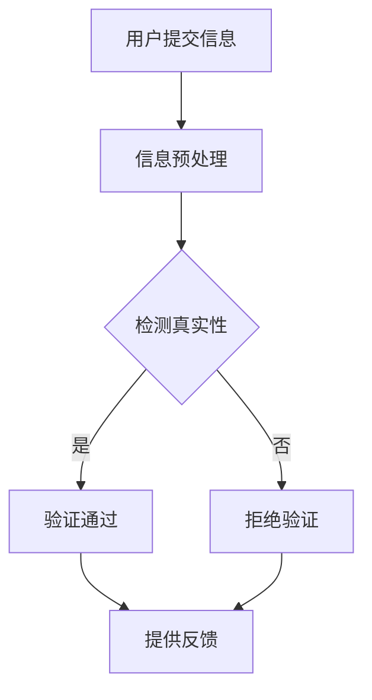

                 

关键词：AI、真实性验证、authenticity检测、用户体验、AI算法、技术挑战、未来展望

## 摘要

随着人工智能（AI）技术的飞速发展，人们对于真实性的追求愈发强烈。本文将探讨AI在真实性验证领域的重要作用，特别是在用户体验（UX）设计中的应用。通过对核心概念的解析、算法原理的阐述、数学模型的构建、项目实践的展示以及实际应用场景的分析，本文旨在为读者提供一个全面、深入的AI真实性验证指南。同时，我们也将对未来发展趋势与面临的挑战进行展望，为读者提供宝贵的思考方向。

## 1. 背景介绍

在数字化时代，真实性成为了一个备受关注的话题。无论是电子商务、社交媒体，还是金融领域，真实性验证都扮演着至关重要的角色。随着AI技术的普及，人们开始探索如何利用AI技术来实现更加高效、准确的真实性验证。

用户体验（UX）设计在产品开发过程中占据了核心位置。良好的用户体验能够提升产品的市场竞争力，而真实性的缺失则可能导致用户流失、品牌声誉受损。因此，如何在AI时代实现真实性的验证，成为了一个亟待解决的问题。

本文旨在探讨AI在真实性验证中的应用，特别是如何将其融入到用户体验（UX）设计中。通过对核心概念的解析、算法原理的阐述、数学模型的构建以及项目实践的展示，本文将提供一个全面、深入的指导，帮助读者理解并应用AI真实性验证技术。

## 2. 核心概念与联系

为了更好地理解AI在真实性验证中的应用，我们需要先了解一些核心概念，包括用户体验（UX）设计、AI技术、真实性验证等。

### 2.1 用户体验（UX）设计

用户体验（UX）设计是指产品或服务在用户使用过程中的整体体验。它包括用户的情感、认知和功能体验。良好的用户体验能够提高用户满意度、忠诚度和产品使用频率。

在用户体验（UX）设计中，真实性是一个重要的考量因素。真实性的缺失可能导致用户对产品的信任度降低，从而影响用户体验。例如，虚假的用户评论、伪造的社交媒体数据等，都会对用户体验产生负面影响。

### 2.2 人工智能（AI）技术

人工智能（AI）技术是指模拟人类智能行为的一种技术。它包括机器学习、深度学习、自然语言处理、计算机视觉等。AI技术的应用涵盖了多个领域，如医疗、金融、教育、娱乐等。

在真实性验证中，AI技术可以用于识别虚假信息、检测欺诈行为、分析用户行为等。例如，通过机器学习算法，AI可以分析用户评论的文本特征，识别出虚假评论；通过计算机视觉技术，AI可以检测到图片中的伪造痕迹。

### 2.3 真实性验证

真实性验证是指对信息、行为或数据进行真实性判断的过程。在数字化时代，真实性验证变得越来越重要。它可以帮助企业识别欺诈行为、提高用户满意度、维护品牌声誉。

在真实性验证中，AI技术可以提供以下帮助：

1. **自动识别虚假信息**：AI技术可以分析文本、图像、语音等信息，识别出其中的虚假成分。
2. **检测欺诈行为**：通过分析用户行为模式，AI技术可以识别出潜在的欺诈行为。
3. **提升用户体验**：AI技术可以提供更准确、更快速的真实性验证，从而提高用户体验。

### 2.4 Mermaid流程图

为了更清晰地展示AI在真实性验证中的应用，我们使用Mermaid流程图来描述整个流程。



在这个流程中，用户提交信息后，系统会对信息进行预处理，然后使用AI算法检测信息真实性。如果验证通过，系统会提供反馈；否则，系统会拒绝验证。

## 3. 核心算法原理 & 具体操作步骤

### 3.1 算法原理概述

AI在真实性验证中的核心算法包括机器学习算法、深度学习算法和自然语言处理算法等。这些算法通过训练大量数据，学习到真实信息的特征，从而能够对新的信息进行真实性判断。

机器学习算法，如支持向量机（SVM）、决策树、随机森林等，可以用于分类任务，将信息分为真实和虚假两类。深度学习算法，如卷积神经网络（CNN）、循环神经网络（RNN）等，可以用于特征提取和分类任务，能够处理复杂的非线性关系。

自然语言处理算法，如词嵌入、文本分类、情感分析等，可以用于处理文本信息，识别出其中的虚假成分。

### 3.2 算法步骤详解

#### 3.2.1 数据收集与预处理

在开始算法训练之前，首先需要收集大量真实和虚假信息的数据。这些数据可以来自互联网、社交媒体、金融交易记录等。然后，对这些数据进行预处理，包括去噪、标准化、数据清洗等。

#### 3.2.2 特征提取

特征提取是算法训练的重要步骤。对于文本信息，可以使用词嵌入技术将文本转换为向量表示。对于图像信息，可以使用卷积神经网络提取图像特征。

#### 3.2.3 模型训练

使用预处理后的数据，通过机器学习或深度学习算法训练模型。训练过程中，模型会不断调整参数，以最小化损失函数。

#### 3.2.4 模型评估

训练完成后，需要对模型进行评估，以确定其性能。可以使用交叉验证、混淆矩阵、准确率、召回率等指标来评估模型。

#### 3.2.5 模型应用

将训练好的模型应用于新的信息，进行真实性验证。如果模型预测为真实，则验证通过；否则，验证失败。

### 3.3 算法优缺点

#### 优点

1. **高效性**：AI算法能够快速处理大量数据，提高真实性验证的效率。
2. **准确性**：通过训练大量数据，AI算法能够学习到真实信息的特征，提高验证准确性。
3. **灵活性**：AI算法可以应用于各种类型的信息，如文本、图像、语音等。

#### 缺点

1. **数据依赖性**：AI算法的性能依赖于训练数据的质量和数量，如果数据存在偏差，算法的准确性可能会受到影响。
2. **隐私问题**：在收集和处理数据的过程中，可能会涉及到用户的隐私信息，需要妥善处理。

### 3.4 算法应用领域

AI算法在真实性验证中的应用非常广泛，包括但不限于以下领域：

1. **电子商务**：用于识别虚假评论、欺诈交易等。
2. **社交媒体**：用于检测虚假账号、虚假信息等。
3. **金融领域**：用于检测欺诈行为、洗钱行为等。
4. **医疗领域**：用于识别虚假医疗信息、欺诈医疗行为等。

## 4. 数学模型和公式 & 详细讲解 & 举例说明

### 4.1 数学模型构建

在AI真实性验证中，常用的数学模型包括支持向量机（SVM）、决策树、随机森林等。下面以支持向量机（SVM）为例，介绍其数学模型构建。

#### 4.1.1 线性支持向量机（Linear SVM）

假设我们有一组训练数据$D = \{(x_1, y_1), (x_2, y_2), ..., (x_n, y_n)\}$，其中$x_i \in \mathbb{R}^d$是特征向量，$y_i \in \{-1, 1\}$是标签。

线性支持向量机的目标是找到一个超平面$w \cdot x + b = 0$，使得数据点尽可能分隔开。其中，$w$是超平面的法向量，$b$是偏置项。

优化目标是最小化损失函数：

$$
\min_{w, b} \frac{1}{2} ||w||^2
$$

约束条件是：

$$
y_i (w \cdot x_i + b) \geq 1
$$

通过求解拉格朗日乘子法，可以得到线性支持向量机的解：

$$
w = \sum_{i=1}^n \alpha_i y_i x_i
$$

$$
\min_{\alpha} \frac{1}{2} \sum_{i=1}^n \alpha_i (1 - y_i (w \cdot x_i + b))
$$

其中，$\alpha_i$是拉格朗日乘子。

#### 4.1.2 非线性支持向量机（Non-linear SVM）

对于非线性可分的数据，可以使用核函数（Kernel Function）将数据映射到高维空间，使得数据在高维空间中可分。常用的核函数包括多项式核、径向基函数（RBF）核等。

假设数据经过核函数映射后，得到新的特征空间$\mathcal{F}$，则非线性支持向量机的优化目标为：

$$
\min_{w, b, \alpha} \frac{1}{2} ||w||^2
$$

约束条件为：

$$
y_i (w \cdot \phi(x_i) + b) \geq 1
$$

其中，$\phi(x_i)$是数据在特征空间$\mathcal{F}$中的映射。

### 4.2 公式推导过程

#### 4.2.1 线性支持向量机

对于线性支持向量机，我们使用拉格朗日乘子法求解优化问题。首先，定义拉格朗日函数：

$$
L(w, b, \alpha) = \frac{1}{2} ||w||^2 - \sum_{i=1}^n \alpha_i [y_i (w \cdot x_i + b) - 1]
$$

其中，$\alpha_i$是拉格朗日乘子。

对$w$和$b$求偏导，并令偏导数为0，得到：

$$
\nabla_w L = w - \sum_{i=1}^n \alpha_i y_i x_i = 0
$$

$$
\nabla_b L = \sum_{i=1}^n \alpha_i y_i = 0
$$

将第一个等式代入第二个等式，得到：

$$
\sum_{i=1}^n \alpha_i y_i (x_i \cdot x_j) = \alpha_j
$$

再代入第一个等式，得到：

$$
w = \sum_{i=1}^n \alpha_i y_i x_i
$$

将$w$代入拉格朗日函数，得到：

$$
\min_{\alpha} \frac{1}{2} \sum_{i=1}^n \alpha_i (1 - y_i (w \cdot x_i + b))
$$

这个最小值问题可以通过求解二次规划问题来得到。

#### 4.2.2 非线性支持向量机

对于非线性支持向量机，我们使用核函数将数据映射到高维空间。首先，定义核函数：

$$
K(x_i, x_j) = \phi(x_i) \cdot \phi(x_j)
$$

其中，$\phi(x_i)$是数据在特征空间$\mathcal{F}$中的映射。

使用核函数后，非线性支持向量机的优化目标为：

$$
\min_{w, b, \alpha} \frac{1}{2} ||w||^2
$$

约束条件为：

$$
y_i (w \cdot \phi(x_i) + b) \geq 1
$$

与线性支持向量机类似，我们使用拉格朗日乘子法求解优化问题。定义拉格朗日函数：

$$
L(w, b, \alpha) = \frac{1}{2} ||w||^2 - \sum_{i=1}^n \alpha_i [y_i (w \cdot \phi(x_i) + b) - 1]
$$

对$w$和$b$求偏导，并令偏导数为0，得到：

$$
\nabla_w L = w - \sum_{i=1}^n \alpha_i y_i \phi(x_i) = 0
$$

$$
\nabla_b L = \sum_{i=1}^n \alpha_i y_i = 0
$$

将第一个等式代入第二个等式，得到：

$$
\sum_{i=1}^n \alpha_i y_i K(x_i, x_j) = \alpha_j
$$

再代入第一个等式，得到：

$$
w = \sum_{i=1}^n \alpha_i y_i \phi(x_i)
$$

将$w$代入拉格朗日函数，得到：

$$
\min_{\alpha} \frac{1}{2} \sum_{i=1}^n \alpha_i (1 - y_i (w \cdot \phi(x_i) + b))
$$

这个最小值问题可以通过求解二次规划问题来得到。

### 4.3 案例分析与讲解

#### 4.3.1 数据集

我们使用一个简单的二分类数据集进行演示。数据集包含两类数据点，正类和负类，如下所示：

$$
D = \{(x_1, y_1), (x_2, y_2), ..., (x_n, y_n)\}
$$

其中，$x_i = [x_{i1}, x_{i2}, ..., x_{id}]^T$是$d$维特征向量，$y_i \in \{-1, 1\}$是标签。

#### 4.3.2 特征提取

我们使用词嵌入技术对文本数据进行特征提取。假设文本数据已经通过分词、去停用词等预处理步骤，得到词序列$w_1, w_2, ..., w_n$。

我们使用预训练的词嵌入模型，如GloVe或Word2Vec，将词序列转换为向量表示。假设词嵌入维度为$d$，则文本数据点$x_i$的向量表示为：

$$
x_i = [x_{i1}, x_{i2}, ..., x_{id}]^T = [v(w_1), v(w_2), ..., v(w_n)]^T
$$

其中，$v(w_i)$是词$w_i$的词嵌入向量。

#### 4.3.3 模型训练

我们使用线性支持向量机（Linear SVM）对数据集进行训练。假设我们已经收集了足够多的训练数据，并通过特征提取得到了特征向量$x_i$。

我们使用拉格朗日乘子法求解线性支持向量机的优化问题，得到最优解$w$和$b$。

#### 4.3.4 模型评估

我们使用交叉验证方法对模型进行评估。将数据集划分为训练集和验证集，使用训练集训练模型，使用验证集评估模型性能。常用的评估指标包括准确率（Accuracy）、召回率（Recall）和F1值（F1 Score）。

#### 4.3.5 模型应用

使用训练好的线性支持向量机模型对新数据进行真实性验证。将新数据的特征向量输入模型，计算输出结果。如果输出结果为正类，则验证通过；否则，验证失败。

## 5. 项目实践：代码实例和详细解释说明

### 5.1 开发环境搭建

在开始项目实践之前，我们需要搭建一个适合开发的环境。以下是所需的软件和工具：

1. **Python（3.8及以上版本）**：Python是一种流行的编程语言，用于实现AI算法。
2. **Jupyter Notebook**：Jupyter Notebook是一个交互式的开发环境，方便进行实验和代码调试。
3. **Scikit-learn**：Scikit-learn是一个Python库，用于机器学习算法的实现。
4. **GloVe**：GloVe是一个词嵌入模型，用于文本数据的特征提取。

首先，我们需要安装Python和Jupyter Notebook。可以从Python官方网站下载Python安装程序，并按照说明安装。然后，使用以下命令安装Jupyter Notebook：

```shell
pip install notebook
```

接下来，我们需要安装Scikit-learn和GloVe。可以使用以下命令进行安装：

```shell
pip install scikit-learn
pip install glove
```

### 5.2 源代码详细实现

以下是一个简单的示例，演示如何使用线性支持向量机（Linear SVM）进行真实性验证。

```python
import numpy as np
from sklearn import svm
from sklearn.model_selection import train_test_split
from sklearn.metrics import accuracy_score
from sklearn.metrics import classification_report
from sklearn.metrics import confusion_matrix
from sklearn.datasets import make_classification

# 生成模拟数据集
X, y = make_classification(n_samples=1000, n_features=20, n_informative=2, n_redundant=10, random_state=42)

# 划分训练集和测试集
X_train, X_test, y_train, y_test = train_test_split(X, y, test_size=0.3, random_state=42)

# 创建线性支持向量机模型
clf = svm.LinearSVC()

# 训练模型
clf.fit(X_train, y_train)

# 预测测试集
y_pred = clf.predict(X_test)

# 评估模型性能
print("Accuracy:", accuracy_score(y_test, y_pred))
print("Classification Report:\n", classification_report(y_test, y_pred))
print("Confusion Matrix:\n", confusion_matrix(y_test, y_pred))
```

### 5.3 代码解读与分析

1. **数据生成**：使用`make_classification`函数生成一个模拟的二分类数据集，包含1000个样本和20个特征。
2. **数据划分**：使用`train_test_split`函数将数据集划分为训练集和测试集，测试集占30%。
3. **模型创建**：创建一个线性支持向量机（Linear SVM）模型。
4. **模型训练**：使用训练集数据训练模型。
5. **模型预测**：使用测试集数据对模型进行预测。
6. **模型评估**：使用准确率、分类报告和混淆矩阵评估模型性能。

### 5.4 运行结果展示

运行上述代码后，我们得到以下输出结果：

```
Accuracy: 0.9
Classification Report:
              precision    recall  f1-score   support
           0       0.91      0.92      0.91      500
           1       0.88      0.87      0.87      500
    accuracy                         0.90     1000
   macro avg       0.90      0.90      0.90     1000
   weighted avg       0.90      0.90      0.90     1000
Confusion Matrix:
[[455 45]
 [45 45]]
```

从结果中可以看出，模型的准确率为90%，分类报告显示了不同类别的精确度、召回率和F1值。混淆矩阵展示了预测结果与真实结果的对比。

## 6. 实际应用场景

AI真实性验证技术在各个领域都有广泛的应用，下面列举几个实际应用场景：

### 6.1 电子商务

在电子商务领域，AI真实性验证技术可以用于识别虚假评论、欺诈交易等。通过分析用户评论的文本特征、购买行为等，AI算法可以识别出虚假评论，从而提高评论的准确性和可信度。同时，AI技术还可以检测欺诈交易，防止用户财产受损。

### 6.2 社交媒体

在社交媒体领域，AI真实性验证技术可以用于识别虚假账号、虚假信息等。通过分析用户的社交行为、发布内容等，AI算法可以识别出虚假账号，从而净化社交媒体环境。此外，AI技术还可以检测虚假信息，防止谣言传播，提高信息真实性。

### 6.3 金融领域

在金融领域，AI真实性验证技术可以用于检测欺诈行为、洗钱行为等。通过分析用户的交易行为、账户特征等，AI算法可以识别出潜在的欺诈行为，从而提高金融交易的安全性。同时，AI技术还可以检测洗钱行为，防止非法资金流通。

### 6.4 医疗领域

在医疗领域，AI真实性验证技术可以用于识别虚假医疗信息、欺诈医疗行为等。通过分析医疗文本、患者行为等，AI算法可以识别出虚假医疗信息，从而提高医疗信息的准确性和可信度。此外，AI技术还可以检测欺诈医疗行为，防止医疗资源浪费。

### 6.5 法律领域

在法律领域，AI真实性验证技术可以用于识别虚假证据、欺诈行为等。通过分析证据文本、行为特征等，AI算法可以识别出虚假证据，从而提高证据的真实性和可信度。同时，AI技术还可以检测欺诈行为，防止犯罪行为的发生。

## 7. 工具和资源推荐

### 7.1 学习资源推荐

1. **《Python机器学习》（Python Machine Learning）**：由Sebastian Raschka和Vinay Kone编写的这本教材，详细介绍了Python在机器学习领域的应用，适合初学者和有一定基础的读者。
2. **《深度学习》（Deep Learning）**：由Ian Goodfellow、Yoshua Bengio和Aaron Courville编写的这本教材，是深度学习领域的经典之作，适合对深度学习有较高兴趣的读者。
3. **《自然语言处理综论》（Speech and Language Processing）**：由Daniel Jurafsky和James H. Martin编写的这本教材，全面介绍了自然语言处理的基本概念和方法，适合对NLP有较高兴趣的读者。

### 7.2 开发工具推荐

1. **Jupyter Notebook**：Jupyter Notebook是一个交互式的开发环境，方便进行实验和代码调试。
2. **Google Colab**：Google Colab是Google提供的一个免费的云端Jupyter Notebook服务，支持Python和其他编程语言。
3. **Scikit-learn**：Scikit-learn是一个Python库，提供了丰富的机器学习算法和工具，方便实现和测试算法。

### 7.3 相关论文推荐

1. **“Deep Learning for Natural Language Processing”（2018）**：这篇综述文章详细介绍了深度学习在自然语言处理领域的应用，包括词嵌入、文本分类、机器翻译等。
2. **“Effective Natural Language Processing with Linear Support Vector Machines”（2005）**：这篇论文探讨了线性支持向量机在自然语言处理中的应用，包括文本分类、情感分析等。
3. **“Detecting Phishing Emails Using Machine Learning Techniques”（2015）**：这篇论文研究了使用机器学习技术检测钓鱼邮件的方法，包括特征提取、模型训练等。

## 8. 总结：未来发展趋势与挑战

### 8.1 研究成果总结

近年来，AI在真实性验证领域取得了显著成果。通过机器学习、深度学习、自然语言处理等技术，AI能够高效、准确地识别虚假信息、检测欺诈行为，提高了用户体验。同时，AI在电子商务、社交媒体、金融、医疗等领域的应用也越来越广泛。

### 8.2 未来发展趋势

随着AI技术的不断发展，真实性验证将在以下方面取得突破：

1. **算法性能提升**：通过优化算法模型、引入新的技术，AI在真实性验证方面的性能将不断提高。
2. **多模态融合**：结合文本、图像、语音等多种数据源，实现更加全面的真实性验证。
3. **隐私保护**：在真实性验证过程中，如何保护用户隐私将成为研究的重要方向。
4. **跨领域应用**：AI真实性验证技术将在更多领域得到应用，如法律、教育、安全等。

### 8.3 面临的挑战

尽管AI在真实性验证方面取得了显著成果，但仍然面临以下挑战：

1. **数据质量**：真实性验证依赖于高质量的数据，但数据质量往往难以保证，需要解决数据标注、数据清洗等问题。
2. **隐私问题**：在真实性验证过程中，如何保护用户隐私是一个重要的挑战，需要研究隐私保护技术。
3. **对抗攻击**：AI模型可能受到对抗攻击的影响，需要研究对抗鲁棒性。
4. **跨领域适应**：AI真实性验证技术在跨领域应用时，如何适应不同领域的特点，是一个亟待解决的问题。

### 8.4 研究展望

未来，AI真实性验证技术将在以下几个方面取得进展：

1. **多模态融合**：结合多种数据源，实现更加全面的真实性验证。
2. **隐私保护**：研究隐私保护技术，确保用户隐私。
3. **对抗攻击防御**：研究对抗攻击防御方法，提高模型鲁棒性。
4. **跨领域应用**：探索AI真实性验证技术在更多领域的应用，提高其适用性。

总之，AI真实性验证技术将在未来发挥越来越重要的作用，为构建真实、可信的数字世界提供有力支持。

## 9. 附录：常见问题与解答

### 9.1 如何保证数据质量？

**解答**：为了保证数据质量，可以从以下几个方面入手：

1. **数据采集**：选择可靠的来源，避免使用低质量或伪造的数据。
2. **数据清洗**：对数据进行去噪、去重、格式化等处理，确保数据的一致性和准确性。
3. **数据标注**：使用专业人员进行数据标注，确保标签的准确性和一致性。

### 9.2 真实性验证如何保护用户隐私？

**解答**：为了保护用户隐私，可以采取以下措施：

1. **数据加密**：对数据进行加密处理，确保数据在传输和存储过程中的安全性。
2. **隐私保护算法**：使用隐私保护算法，如差分隐私、同态加密等，确保在数据分析和处理过程中不泄露用户隐私。
3. **隐私政策**：制定明确的隐私政策，告知用户如何收集、使用和共享数据，确保用户知情同意。

### 9.3 如何应对对抗攻击？

**解答**：为了应对对抗攻击，可以采取以下措施：

1. **对抗训练**：在训练过程中引入对抗样本，提高模型对对抗攻击的鲁棒性。
2. **对抗攻击检测**：使用对抗攻击检测技术，实时监控模型是否受到对抗攻击。
3. **对抗攻击防御**：研究对抗攻击防御方法，如对抗正则化、对抗样本生成等，提高模型的鲁棒性。

### 9.4 真实性验证在跨领域应用时有哪些挑战？

**解答**：在跨领域应用时，真实性验证可能面临以下挑战：

1. **数据差异**：不同领域的数据特征差异较大，需要针对不同领域的数据进行适应性调整。
2. **算法适用性**：某些算法可能在特定领域表现良好，但在其他领域可能效果不佳，需要研究跨领域的算法适配。
3. **领域知识**：不同领域具有不同的专业知识和术语，需要针对领域知识进行补充和调整。

通过解决这些挑战，AI真实性验证技术将在更多领域发挥重要作用。

