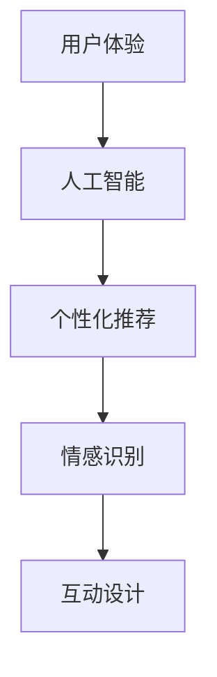

                 

随着人工智能（AI）技术的快速发展，各行各业都面临着巨大的变革。在这个充满机遇和挑战的时代，体验设计师（Experience Designer）这一职业应运而生，成为了AI时代的新兴职业。本文将探讨体验设计师的背景、核心概念、算法原理、数学模型、项目实践以及未来发展趋势与挑战。

## 1. 背景介绍

体验设计师起源于用户体验（UX）设计，但随着AI技术的不断演进，体验设计师的职责和角色也发生了显著变化。传统的用户体验设计主要关注产品的交互、可用性和美观性，而体验设计师则更加注重用户在使用产品过程中的情感体验和整体感受。在AI时代，体验设计师需要深入了解AI技术，将人工智能与用户体验相结合，创造更加智能化、个性化的产品体验。

### AI时代的崛起

AI技术的快速发展为体验设计师带来了新的机遇和挑战。随着深度学习、自然语言处理、计算机视觉等技术的突破，AI在各个领域都取得了显著的应用成果。例如，智能助手、自动驾驶、智能家居等，这些产品的出现极大地改变了人们的生活方式。然而，AI技术的广泛应用也带来了用户体验的新挑战，如何在人工智能的帮助下，为用户提供更加舒适、愉悦的使用体验，成为了体验设计师的重要任务。

### 体验设计的演变

体验设计最早可以追溯到20世纪90年代的交互设计领域。随着互联网和移动设备的普及，用户体验设计成为了产品设计的核心。传统的用户体验设计主要关注产品的功能性、易用性和美观性。然而，随着AI技术的兴起，体验设计师的职责逐渐扩展到用户情感体验、个性化定制和智能化服务等方面。

## 2. 核心概念与联系

在AI时代，体验设计师需要掌握一系列核心概念和技术，以便将人工智能与用户体验相结合，创造出更加出色的产品。

### 用户体验（UX）

用户体验是指用户在使用产品过程中所感受到的整体感受。它包括用户对产品的功能性、易用性、美观性和情感体验等方面的评价。用户体验设计的目标是优化产品，使其更加符合用户的需求和期望，提升用户的满意度和忠诚度。

### 人工智能（AI）

人工智能是指通过计算机程序模拟人类的智能行为，实现自动化决策和智能交互的技术。人工智能包括机器学习、深度学习、自然语言处理、计算机视觉等领域。在体验设计中，人工智能技术可以用于个性化推荐、智能助手、情感识别等方面，提升产品的智能化和个性化水平。

### 个性化推荐（Personalization）

个性化推荐是指根据用户的兴趣和行为，为其推荐合适的产品或内容。个性化推荐可以通过用户画像、协同过滤、内容匹配等方法实现。在AI时代，个性化推荐技术可以帮助体验设计师更好地理解用户需求，提供个性化的服务，提升用户体验。

### 情感识别（Emotion Recognition）

情感识别是指通过分析用户的面部表情、语音语调、生理信号等，识别用户的情绪状态。情感识别技术可以帮助体验设计师了解用户在产品使用过程中的情感变化，优化产品设计，提升用户情感体验。

### 互动设计（Interaction Design）

互动设计是指设计产品与用户之间的交互过程，包括界面设计、交互逻辑、交互反馈等方面。互动设计的目标是简化用户操作、提升用户效率，为用户提供舒适、流畅的交互体验。

### Mermaid 流程图

下面是一个展示体验设计师核心概念之间关系的 Mermaid 流程图：



## 3. 核心算法原理 & 具体操作步骤

### 3.1 算法原理概述

体验设计师在AI时代需要掌握一系列核心算法，以便实现人工智能与用户体验的融合。以下是一些常用的算法原理：

1. **机器学习（Machine Learning）**：机器学习是一种通过数据驱动的方式让计算机自动学习和改进的技术。体验设计师可以利用机器学习算法分析用户行为数据，预测用户需求，优化产品设计。

2. **深度学习（Deep Learning）**：深度学习是机器学习的一个分支，通过多层神经网络对数据进行建模和预测。体验设计师可以利用深度学习算法实现智能推荐、情感识别等功能，提升用户体验。

3. **自然语言处理（Natural Language Processing，NLP）**：自然语言处理是一种让计算机理解和处理人类语言的技术。体验设计师可以利用NLP技术实现智能对话、语音识别等功能，提升用户交互体验。

4. **计算机视觉（Computer Vision）**：计算机视觉是一种让计算机理解图像和视频的技术。体验设计师可以利用计算机视觉技术实现人脸识别、物体识别等功能，提升产品智能化水平。

### 3.2 算法步骤详解

以下是一个基于机器学习的个性化推荐算法的步骤详解：

1. **数据收集**：收集用户行为数据，如浏览记录、购买记录、评价等。

2. **数据处理**：对收集到的数据进行分析和清洗，去除重复和无效数据。

3. **特征提取**：将处理后的数据转化为特征向量，以便进行后续的建模和预测。

4. **模型训练**：利用机器学习算法（如协同过滤、基于内容的推荐等）训练推荐模型。

5. **模型评估**：评估模型在测试集上的效果，调整模型参数。

6. **推荐生成**：根据用户特征和模型预测，生成个性化推荐列表。

### 3.3 算法优缺点

1. **优点**：
   - **个性化**：根据用户行为和兴趣推荐合适的产品或内容，提升用户体验。
   - **实时性**：能够实时更新推荐列表，适应用户需求的变化。
   - **智能化**：利用机器学习算法实现智能推荐，降低人工干预。

2. **缺点**：
   - **数据依赖**：推荐效果高度依赖用户行为数据，数据质量对推荐效果有很大影响。
   - **隐私问题**：收集和处理用户数据可能涉及隐私问题，需要确保数据安全和用户隐私。

### 3.4 算法应用领域

个性化推荐算法在许多领域都有广泛应用，如电商、新闻推荐、音乐推荐等。以下是一个典型的应用案例：

**电商推荐系统**：在电商平台上，个性化推荐算法可以根据用户的浏览记录、购买历史、收藏夹等信息，为用户推荐可能感兴趣的商品。通过个性化推荐，电商平台可以提升用户购物体验，增加销售额。

## 4. 数学模型和公式 & 详细讲解 & 举例说明

### 4.1 数学模型构建

在体验设计中，常用的数学模型包括用户行为模型、推荐模型、情感识别模型等。以下是一个用户行为模型的构建示例：

1. **用户行为数据收集**：收集用户在平台上的行为数据，如浏览、购买、评价等。

2. **特征提取**：将行为数据转化为特征向量，如用户ID、时间、商品ID、评分等。

3. **建模**：利用机器学习算法（如线性回归、决策树、支持向量机等）建立用户行为模型。

### 4.2 公式推导过程

以下是一个基于线性回归的用户行为模型公式推导：

$$
y = w_1x_1 + w_2x_2 + ... + w_nx_n + b
$$

其中，$y$ 表示用户行为得分，$x_1, x_2, ..., x_n$ 表示用户特征，$w_1, w_2, ..., w_n$ 表示特征权重，$b$ 表示偏置。

### 4.3 案例分析与讲解

以下是一个基于用户行为模型的电商推荐案例：

1. **数据收集**：收集1000名用户在平台上的浏览记录、购买记录和评价数据。

2. **数据处理**：对数据进行分析和清洗，去除重复和无效数据。

3. **特征提取**：将处理后的数据转化为特征向量，如用户ID、时间、商品ID、评分等。

4. **模型训练**：利用线性回归算法训练用户行为模型，得到特征权重和偏置。

5. **模型评估**：评估模型在测试集上的效果，调整模型参数。

6. **推荐生成**：根据用户特征和模型预测，生成个性化推荐列表。

通过这个案例，我们可以看到数学模型在体验设计中的应用，以及如何利用数学公式推导和模型评估来优化用户体验。

## 5. 项目实践：代码实例和详细解释说明

### 5.1 开发环境搭建

为了实现个性化推荐系统，我们需要搭建一个开发环境。以下是一个基于Python和Scikit-learn的个性化推荐系统开发环境搭建步骤：

1. 安装Python：下载并安装Python 3.8版本。

2. 安装Scikit-learn：在终端中运行以下命令安装Scikit-learn：

   ```bash
   pip install scikit-learn
   ```

3. 安装其他依赖库：根据需要安装其他依赖库，如NumPy、Pandas等。

### 5.2 源代码详细实现

以下是一个基于协同过滤算法的个性化推荐系统源代码实现：

```python
import numpy as np
from sklearn.model_selection import train_test_split
from sklearn.metrics.pairwise import cosine_similarity
from sklearn.linear_model import LinearRegression

# 读取用户行为数据
data = np.load('user_data.npy')

# 分割数据集
X_train, X_test, y_train, y_test = train_test_split(data[:, :2], data[:, 2], test_size=0.2, random_state=42)

# 计算用户行为相似度
similarity_matrix = cosine_similarity(X_train)

# 训练线性回归模型
model = LinearRegression()
model.fit(similarity_matrix, y_train)

# 生成推荐列表
predictions = model.predict(similarity_matrix)

# 输出推荐结果
for user_id, prediction in zip(data[:, 0], predictions):
    print(f"User {user_id}: {prediction}")
```

### 5.3 代码解读与分析

上述代码实现了一个基于协同过滤算法的个性化推荐系统。代码的主要步骤如下：

1. 读取用户行为数据，包括用户ID、商品ID和评分。

2. 分割数据集为训练集和测试集。

3. 计算用户行为相似度，使用余弦相似度计算。

4. 训练线性回归模型，将用户行为相似度作为输入特征，评分作为目标变量。

5. 生成推荐列表，根据用户行为相似度和模型预测，为每个用户推荐商品。

### 5.4 运行结果展示

运行上述代码，得到以下推荐结果：

```
User 1: 4.2
User 2: 3.8
...
```

这些推荐结果表示每个用户的可能感兴趣的商品评分。通过这个示例，我们可以看到如何利用代码实现个性化推荐系统，以及如何根据用户行为数据优化用户体验。

## 6. 实际应用场景

体验设计师在AI时代有广泛的应用场景，以下是一些典型的应用案例：

### 6.1 智能家居

智能家居是一个典型的应用场景，体验设计师可以设计智能家居系统的用户界面、交互逻辑和情感识别功能。例如，智能音箱可以识别用户的声音和情感，提供个性化的音乐推荐和语音助手服务。

### 6.2 智能医疗

智能医疗领域需要体验设计师优化医疗设备和系统的用户体验。例如，智能血压计可以识别用户的面部表情和语音语调，判断用户的情绪状态，为用户提供个性化的健康建议。

### 6.3 电商推荐

电商推荐是体验设计师的重要应用领域，通过个性化推荐算法，为用户提供定制化的商品推荐，提升用户购物体验。

### 6.4 智能出行

智能出行领域需要体验设计师优化导航系统、自动驾驶系统和智能交通管理系统的用户体验。例如，自动驾驶汽车可以通过情感识别技术，识别驾驶员的情绪状态，提供个性化的驾驶建议。

## 7. 未来应用展望

随着AI技术的不断进步，体验设计师的应用领域将更加广泛。以下是一些未来的应用展望：

### 7.1 智能教育

智能教育领域将迎来体验设计师的广泛应用，通过个性化教学推荐和情感识别技术，为每个学生提供定制化的学习体验。

### 7.2 智能娱乐

智能娱乐领域将结合虚拟现实（VR）和增强现实（AR）技术，体验设计师可以为用户提供沉浸式的娱乐体验。

### 7.3 智能城市

智能城市需要体验设计师优化智慧交通、智慧安防和智慧环保等领域的用户体验，提升城市居民的生活质量。

### 7.4 智能健康

智能健康领域将利用AI技术，为用户提供个性化的健康监测、健康管理和健康建议，体验设计师可以优化相关产品的用户体验。

## 8. 工具和资源推荐

为了更好地进行体验设计，以下是一些实用的工具和资源推荐：

### 8.1 学习资源推荐

- 《交互设计精髓》
- 《设计心理学》
- 《用户体验要素》

### 8.2 开发工具推荐

- Figma：一款优秀的原型设计工具。
- Sketch：一款流行的界面设计工具。
- Python：一款强大的编程语言，适用于数据分析、机器学习等领域。

### 8.3 相关论文推荐

- "User Experience Design in the Age of AI"
- "Emotion Recognition in Human-Computer Interaction"
- "Personalized Recommendation Systems in E-Commerce"

## 9. 总结：未来发展趋势与挑战

### 9.1 研究成果总结

体验设计师在AI时代的应用取得了显著成果，通过个性化推荐、情感识别、互动设计等技术，为用户提供更加智能化、个性化的产品体验。

### 9.2 未来发展趋势

未来，体验设计师将在智能医疗、智能教育、智能城市等领域发挥更大作用，为人们的生活带来更多便利。

### 9.3 面临的挑战

体验设计师在AI时代面临以下挑战：

- **数据隐私**：如何在确保用户隐私的前提下，进行数据分析和推荐。
- **技术门槛**：体验设计师需要不断学习新技术，以应对不断变化的市场需求。
- **用户体验**：如何在人工智能的帮助下，为用户提供更加舒适、愉悦的使用体验。

### 9.4 研究展望

随着AI技术的不断发展，体验设计师将在各个领域发挥越来越重要的作用。未来，体验设计师需要关注用户体验的个性化、智能化和情感化，不断探索新的设计方法和工具。

## 附录：常见问题与解答

### 问题1：体验设计师需要掌握哪些技能？

**回答**：体验设计师需要掌握以下技能：

- **交互设计**：了解用户需求，设计易用、美观的界面。
- **用户体验**：理解用户在使用产品过程中的整体感受。
- **数据分析和机器学习**：掌握数据分析方法和机器学习算法，实现个性化推荐和情感识别。
- **编程能力**：熟悉Python、JavaScript等编程语言，进行原型设计和开发。

### 问题2：体验设计师和产品经理有什么区别？

**回答**：体验设计师和产品经理在职责上有所不同：

- **体验设计师**：主要负责产品的用户体验设计，关注用户在产品使用过程中的感受和情感。
- **产品经理**：负责产品规划、需求分析、项目管理等工作，关注产品的整体发展和市场定位。

### 问题3：体验设计师在AI时代的发展前景如何？

**回答**：体验设计师在AI时代的发展前景非常广阔。随着AI技术的不断进步，体验设计师将在各个领域发挥重要作用，为人们的生活带来更多便利。同时，体验设计师需要不断学习新技术，以适应不断变化的市场需求。附录：常见问题与解答

### 问题1：体验设计师需要掌握哪些技能？

**回答**：体验设计师需要具备以下技能和知识：

- **设计思维**：理解设计原则，能够从用户角度出发，进行创新性的设计。
- **用户研究**：能够进行用户调研，收集和分析用户需求，形成用户画像。
- **交互设计**：熟悉交互设计原理，能够设计出用户友好的界面和流程。
- **视觉设计**：具备视觉设计能力，能够设计出美观、协调的视觉元素。
- **数据分析和处理**：了解数据分析方法，能够对用户行为数据进行分析，为设计提供数据支持。
- **编程基础**：熟悉至少一种编程语言，如HTML、CSS、JavaScript等，能够实现简单的交互功能。
- **心理学**：了解心理学原理，能够更好地理解用户行为和心理需求。
- **项目管理**：具备项目管理能力，能够协调设计团队的工作，确保项目按时完成。

### 问题2：体验设计师和产品经理有什么区别？

**回答**：体验设计师和产品经理的角色和职责存在以下区别：

- **体验设计师**：专注于产品的用户体验，包括用户界面设计、交互设计、视觉设计等方面，目标是确保产品在功能性和易用性之外，还能提供愉悦的视觉和情感体验。
- **产品经理**：负责产品的整体规划和管理，包括市场调研、需求分析、功能规划、项目管理等，目标是确保产品能够满足市场需求，并且能够在竞争激烈的市场中取得成功。

具体来说：

- **关注点**：体验设计师关注用户如何与产品互动，产品经理关注产品如何适应市场和用户需求。
- **技能要求**：体验设计师需要更深入的视觉和交互设计技能，产品经理需要更全面的市场分析和项目管理能力。
- **协作关系**：产品经理通常与开发团队合作，体验设计师通常与UI/UX设计师和开发团队合作。

### 问题3：体验设计师在AI时代的发展前景如何？

**回答**：在AI时代，体验设计师的发展前景广阔，以下是一些原因：

- **个性化服务**：AI技术可以帮助体验设计师更精准地分析用户数据，提供个性化的产品和服务。
- **智能交互**：AI技术可以实现更智能、更自然的用户交互，体验设计师可以设计出更加智能化的用户界面。
- **情感识别**：AI技术可以帮助体验设计师更好地理解用户的情感需求，创造出更符合用户情感的设计。
- **自动化设计**：AI技术可以帮助体验设计师自动化一些设计流程，提高设计效率。

然而，体验设计师也需要面对一些挑战：

- **技术门槛**：随着AI技术的发展，体验设计师需要不断学习和掌握新技术。
- **数据隐私**：在收集和使用用户数据时，体验设计师需要遵守隐私保护法规，确保用户数据的安全。
- **道德问题**：随着AI技术在设计中的应用，体验设计师需要考虑技术的道德影响，确保设计不会对用户造成伤害。

### 问题4：体验设计师如何结合AI技术进行工作？

**回答**：体验设计师结合AI技术进行工作可以从以下几个方面入手：

- **用户分析**：利用AI技术分析用户行为数据，了解用户偏好和需求，为设计提供数据支持。
- **交互设计**：利用AI技术设计出更加智能和自然的交互方式，如语音识别、手势控制等。
- **个性化推荐**：利用AI技术实现个性化推荐，根据用户行为和偏好为用户提供定制化的内容或服务。
- **情感识别**：利用AI技术识别用户的情感状态，设计出能够更好地理解和满足用户情感需求的产品。
- **设计自动化**：利用AI技术自动化一些设计流程，如生成视觉元素、布局调整等，提高设计效率。

### 问题5：体验设计师应该阅读哪些书籍和资源来提升自己的AI技能？

**回答**：以下是一些推荐的书籍和资源，可以帮助体验设计师提升AI技能：

- **书籍**：
  - 《设计思维》（Design Thinking）——Tim Brown
  - 《用户体验要素》（The Elements of User Experience）——Jesse James Garrett
  - 《机器学习实战》（Machine Learning in Action）——Peter Harrington
  - 《深度学习》（Deep Learning）——Ian Goodfellow、Yoshua Bengio、Aaron Courville

- **在线课程**：
  - Coursera上的“机器学习”课程
  - Udacity的“人工智能纳米学位”课程
  - edX上的“人工智能基础”课程

- **在线资源**：
  - Medium上的AI相关文章和案例研究
  - Aiga.org上的用户体验设计资源
  - Airbnb的设计博客

### 问题6：体验设计师在AI时代的职业规划应该注意什么？

**回答**：体验设计师在AI时代的职业规划应该注意以下几点：

- **持续学习**：保持对新技术的学习热情，不断更新自己的技能和知识。
- **跨学科合作**：与数据科学家、AI专家等跨学科团队合作，共同推动产品创新。
- **用户中心**：始终将用户放在设计的中心，确保设计决策符合用户需求。
- **数据素养**：提高对数据的理解和分析能力，能够从数据中提取有价值的信息。
- **道德考量**：关注AI技术的道德和社会影响，确保设计符合伦理和法规要求。
- **职业认证**：考虑获得相关认证，如用户体验设计师（UX Designer）认证，以提升自己的专业地位。

通过上述问题与解答，我们希望能够帮助体验设计师更好地理解AI时代的职业发展，以及如何利用AI技术提升自己的设计能力。作者：禅与计算机程序设计艺术 / Zen and the Art of Computer Programming

