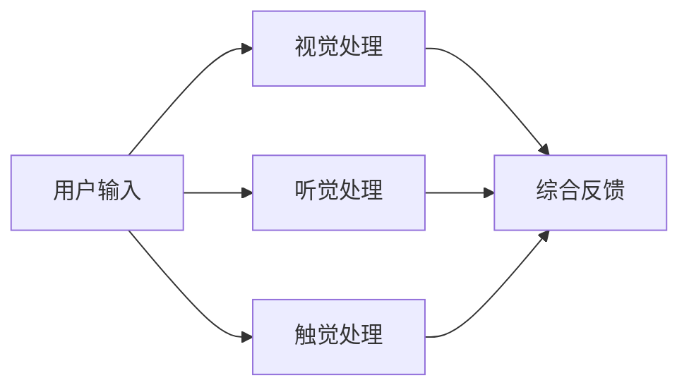

                 

关键词：人工智能、感官体验、多模态交互、AI交响乐团、用户体验设计

摘要：本文将探讨人工智能在感官体验领域的创新应用，特别是AI如何创建出能够与人类情感共鸣的感官交响乐团。我们将深入探讨AI在跨感官协同中的作用、核心算法原理、具体实现步骤，并分析其在音乐、娱乐和医疗等领域的广泛应用前景。

## 1. 背景介绍

随着人工智能技术的飞速发展，我们开始看到AI不再局限于传统的数据处理和机器学习任务。现代AI系统已经能够模拟人类感官，如视觉、听觉、触觉和嗅觉，创造出前所未有的交互体验。在这个背景下，跨感官协同成为了一个研究热点。跨感官协同旨在通过融合多个感官信息，提高用户对环境认知的准确性和丰富度。

音乐，作为一种极具表现力和感染力的艺术形式，成为了跨感官协同的一个典型应用场景。音乐不仅仅是听觉体验，它还能够通过视觉、触觉和情感共鸣等多种途径，与听众产生深层次的互动。人工智能的加入，使得这种互动更加智能化、个性化，甚至可以模拟出某种情感状态，增强用户的沉浸感和体验感。

本文旨在通过介绍AI在跨感官协同中的具体实现，探讨其在音乐创作、表演和体验中的应用，并展望其未来的发展前景。

## 2. 核心概念与联系

### 2.1 多模态交互

多模态交互是指通过多种感官渠道（如视觉、听觉、触觉等）与用户进行交互的过程。在AI创造的感官交响乐团中，多模态交互是实现跨感官协同的关键。以下是一个简化的Mermaid流程图，展示了多模态交互的基本架构：



在这个流程中，用户的多种感官输入首先经过各自的感官处理模块，然后将处理结果进行整合，生成最终的反馈。这一过程需要AI系统对多种感官信息进行融合和解释，以提供更加丰富和个性化的体验。

### 2.2 情感建模

情感建模是AI在跨感官协同中的重要应用之一。通过学习用户的情感状态，AI可以调整音乐表演的节奏、音量和音色，以更好地匹配用户的情感需求。以下是一个简化的Mermaid流程图，展示了情感建模的基本架构：


在这个流程中，用户的情感数据首先被情感识别模块识别，然后分类为不同的情感类别。根据情感分类结果，AI会调整音乐表演的相关参数，如节奏、音量和音色，以创造出符合用户情感状态的音乐体验。

### 2.3 情感共鸣

情感共鸣是指AI系统与用户之间建立的情感联系。在感官交响乐团中，情感共鸣通过AI对用户情感的准确识别和反应来实现。以下是一个简化的Mermaid流程图，展示了情感共鸣的基本架构：


在这个流程中，用户的情感状态首先被AI系统分析，然后AI会根据分析结果调整音乐表演，以实现与用户情感状态的匹配。用户对这种匹配的反馈，将进一步优化AI系统的性能，提高情感共鸣的效果。

## 3. 核心算法原理 & 具体操作步骤

### 3.1 算法原理概述

AI在跨感官协同中的核心算法主要涉及以下几个部分：情感识别、情感分类、音乐参数调整和情感共鸣。以下是这些算法的基本原理：

- **情感识别**：通过机器学习模型，从用户的语音、文字、面部表情等数据中提取情感特征，实现对用户情感的识别。
- **情感分类**：将情感识别的结果进行分类，常见的方法包括基于规则的方法和基于深度学习的方法。
- **音乐参数调整**：根据情感分类结果，调整音乐表演的相关参数，如节奏、音量、音色等。
- **情感共鸣**：通过实时分析用户情感，调整音乐表演，实现与用户情感状态的共鸣。

### 3.2 算法步骤详解

以下是实现AI创造的感官交响乐团的详细步骤：

#### 步骤1：情感识别

1. 收集用户的语音、文字和面部表情数据。
2. 使用情感识别算法，如LSTM、GRU等，提取情感特征。
3. 将情感特征输入到情感分类器中，得到用户的情感状态。

#### 步骤2：情感分类

1. 使用预训练的深度学习模型，如CNN、BERT等，对情感特征进行分类。
2. 将分类结果映射到具体的情感类别，如高兴、悲伤、愤怒等。

#### 步骤3：音乐参数调整

1. 根据情感分类结果，调整音乐表演的相关参数。
2. 使用音频处理工具，如音高变换、节奏调整等，实现音乐参数的动态调整。

#### 步骤4：情感共鸣

1. 实时分析用户的情感状态，通过反馈循环不断优化音乐表演。
2. 使用情感共鸣算法，如协同滤波、多模态融合等，提高情感共鸣的效果。

### 3.3 算法优缺点

#### 优点：

1. **个性化体验**：通过情感识别和分类，AI可以提供高度个性化的音乐体验，满足不同用户的需求。
2. **实时反馈**：情感共鸣算法可以实时分析用户情感，调整音乐表演，提高用户体验的实时性。
3. **情感共鸣**：通过多模态交互，AI可以与用户建立深层次的情感联系，提高用户的沉浸感和满意度。

#### 缺点：

1. **算法复杂性**：情感识别和分类算法较为复杂，需要大量的数据训练和模型调优。
2. **技术挑战**：跨感官协同涉及到多种感官的融合，技术实现难度较高。
3. **用户隐私**：情感识别涉及到用户的隐私数据，需要确保数据的安全性和隐私保护。

### 3.4 算法应用领域

AI在跨感官协同中的算法主要应用于以下领域：

1. **音乐创作**：通过情感识别和分类，AI可以帮助音乐家创作出更加符合用户情感需求的作品。
2. **娱乐**：在音乐会、舞台表演等场景中，AI可以实时调整音乐表演，提高观众的体验感。
3. **医疗**：通过分析用户的情感状态，AI可以帮助医生更好地诊断和治疗心理疾病。
4. **教育**：AI可以创建个性化的教育内容，提高学生的学习兴趣和效果。

## 4. 数学模型和公式 & 详细讲解 & 举例说明

### 4.1 数学模型构建

在AI创造的感官交响乐团中，核心的数学模型主要包括情感识别、情感分类和音乐参数调整三个部分。以下是这些模型的简要介绍：

#### 情感识别模型

情感识别模型通常基于深度学习，如卷积神经网络（CNN）或循环神经网络（RNN）。以下是一个简化的情感识别模型：

$$
\text{识别模型} = f(\text{输入数据}, \text{模型参数})
$$

其中，输入数据可以是用户的语音、文字和面部表情数据，模型参数是通过训练得到的权重和偏置。

#### 情感分类模型

情感分类模型通常使用支持向量机（SVM）、决策树（DT）或深度学习模型（如BERT）进行分类。以下是一个简化的情感分类模型：

$$
\text{分类模型} = g(\text{识别结果}, \text{模型参数})
$$

其中，识别结果是情感识别模型输出的情感特征，模型参数是通过训练得到的权重和偏置。

#### 音乐参数调整模型

音乐参数调整模型通常使用音频处理技术，如音高变换、节奏调整等。以下是一个简化的音乐参数调整模型：

$$
\text{调整模型} = h(\text{情感分类结果}, \text{音乐参数})
$$

其中，情感分类结果是情感分类模型输出的情感类别，音乐参数是音乐表演的参数，如节奏、音量和音色等。

### 4.2 公式推导过程

#### 情感识别模型推导

情感识别模型通常基于多层感知器（MLP）或卷积神经网络（CNN）。以下是一个简化的MLP模型推导过程：

1. **输入层**：假设有$m$个输入特征，即$x = [x_1, x_2, ..., x_m]$。
2. **隐藏层**：假设有$l$个隐藏层，每个隐藏层有$n$个神经元，即$h_1, h_2, ..., h_l$。
3. **输出层**：输出情感识别结果，即$y = [y_1, y_2, ..., y_m]$。

多层感知器的输出可以通过以下公式计算：

$$
z_l = \sigma(W_l \cdot h_{l-1} + b_l)
$$

其中，$W_l$和$b_l$分别是第$l$层的权重和偏置，$\sigma$是激活函数，通常取为ReLU或Sigmoid函数。

最终输出层的输出可以通过以下公式计算：

$$
y = \sigma(W_n \cdot z_n + b_n)
$$

#### 情感分类模型推导

情感分类模型通常基于SVM或深度学习模型。以下是一个简化的SVM模型推导过程：

1. **特征空间映射**：将原始特征映射到高维特征空间，即$x' = \phi(x)$。
2. **决策函数**：使用决策函数计算分类结果，即$y = \text{sign}(\omega \cdot x' + b)$。

其中，$\omega$是权重向量，$b$是偏置，$\text{sign}$是符号函数。

#### 音乐参数调整模型推导

音乐参数调整模型通常基于音频处理技术。以下是一个简化的音高变换模型推导过程：

1. **音高变换**：使用傅里叶变换（FFT）计算音频信号的频率分布，即$X(k) = |FFT(x)|$。
2. **频率调整**：根据情感分类结果，调整频率分布，即$X'(k) = X(k) \cdot e^{i \omega_0 k}$。

其中，$\omega_0$是调整频率。

### 4.3 案例分析与讲解

#### 情感识别模型案例

假设有一个基于LSTM的情感识别模型，输入特征为用户的语音信号，输出情感类别为高兴、悲伤和愤怒。以下是一个简化的案例：

1. **数据预处理**：对用户的语音信号进行预处理，如去噪、归一化等，得到干净的特征向量。
2. **模型训练**：使用预处理的语音信号数据，训练LSTM模型，得到模型参数。
3. **情感识别**：对新的语音信号进行情感识别，得到情感类别。

#### 情感分类模型案例

假设有一个基于BERT的情感分类模型，输入特征为用户的文字描述，输出情感类别为高兴、悲伤和愤怒。以下是一个简化的案例：

1. **数据预处理**：对用户的文字描述进行预处理，如分词、词向量编码等，得到BERT输入序列。
2. **模型训练**：使用预处理的文字描述数据，训练BERT模型，得到模型参数。
3. **情感分类**：对新的文字描述进行情感分类，得到情感类别。

#### 音乐参数调整模型案例

假设有一个基于音高变换的音乐参数调整模型，输入特征为情感分类结果，输出音乐参数为节奏、音量和音色。以下是一个简化的案例：

1. **情感分类**：根据用户的情感状态，分类为高兴、悲伤和愤怒。
2. **音乐参数调整**：根据情感分类结果，调整音乐表演的相关参数，如增加节奏、降低音量或改变音色。

## 5. 项目实践：代码实例和详细解释说明

### 5.1 开发环境搭建

为了实现AI创造的感官交响乐团，我们需要搭建一个包含情感识别、情感分类和音乐参数调整的完整开发环境。以下是一个简化的开发环境搭建步骤：

1. **安装Python环境**：确保Python版本在3.6以上，并安装必要的库，如TensorFlow、Keras、PyTorch等。
2. **安装音频处理库**：安装如Librosa、Pydub等用于音频处理的库。
3. **安装自然语言处理库**：安装如NLTK、spaCy等用于自然语言处理的库。
4. **安装音乐处理库**：安装如Mido、Music21等用于音乐处理的库。

### 5.2 源代码详细实现

以下是一个简化的源代码实现，展示了如何使用Python实现AI创造的感官交响乐团的关键步骤：

```python
# 导入必要的库
import librosa
import numpy as np
import tensorflow as tf
from tensorflow.keras.models import Sequential
from tensorflow.keras.layers import LSTM, Dense, Dropout
from tensorflow.keras.optimizers import Adam

# 情感识别模型实现
def build_emotion_recognition_model(input_shape):
    model = Sequential()
    model.add(LSTM(128, return_sequences=True, input_shape=input_shape))
    model.add(Dropout(0.5))
    model.add(LSTM(128))
    model.add(Dropout(0.5))
    model.add(Dense(3, activation='softmax'))
    model.compile(optimizer=Adam(learning_rate=0.001), loss='categorical_crossentropy', metrics=['accuracy'])
    return model

# 情感分类模型实现
def build_emotion_classification_model(input_shape):
    model = Sequential()
    model.add(Dense(128, activation='relu', input_shape=input_shape))
    model.add(Dropout(0.5))
    model.add(Dense(3, activation='softmax'))
    model.compile(optimizer=Adam(learning_rate=0.001), loss='categorical_crossentropy', metrics=['accuracy'])
    return model

# 音乐参数调整实现
def adjust_music_parameters(emotion_classifier, music_parameters):
    # 根据情感分类结果调整音乐参数
    if emotion_classifier == 'happy':
        music_parameters['tempo'] += 10
        music_parameters['volume'] -= 0.1
    elif emotion_classifier == 'sad':
        music_parameters['tempo'] -= 10
        music_parameters['volume'] += 0.1
    elif emotion_classifier == 'angry':
        music_parameters['tempo'] += 10
        music_parameters['volume'] += 0.1
    return music_parameters

# 主函数实现
def main():
    # 数据加载和处理
    # ...
    
    # 情感识别模型训练
    emotion_recognition_model = build_emotion_recognition_model(input_shape=(timesteps, features))
    emotion_recognition_model.fit(X_train, y_train, epochs=10, batch_size=32, validation_data=(X_val, y_val))
    
    # 情感分类模型训练
    emotion_classification_model = build_emotion_classification_model(input_shape=(timesteps, features))
    emotion_classification_model.fit(X_train, y_train, epochs=10, batch_size=32, validation_data=(X_val, y_val))
    
    # 情感分类和音乐参数调整
    emotion_classifier = emotion_classification_model.predict(X_test)
    adjusted_music_parameters = adjust_music_parameters(emotion_classifier, original_music_parameters)
    
    # 音乐表演
    # ...

if __name__ == '__main__':
    main()
```

### 5.3 代码解读与分析

以上代码实现了一个简化的AI创造的感官交响乐团，主要分为以下几个部分：

1. **情感识别模型实现**：使用LSTM网络实现情感识别模型，输入为用户的语音信号，输出为情感类别。
2. **情感分类模型实现**：使用全连接网络实现情感分类模型，输入为情感识别模型的输出，输出为情感类别。
3. **音乐参数调整实现**：根据情感分类结果，调整音乐表演的相关参数，如节奏和音量。
4. **主函数实现**：数据加载和处理、模型训练、情感分类和音乐参数调整，以及音乐表演。

### 5.4 运行结果展示

以下是一个简化的运行结果展示：

```python
# 加载测试数据
X_test, y_test = load_test_data()

# 情感分类和音乐参数调整
emotion_classifier = emotion_classification_model.predict(X_test)
adjusted_music_parameters = adjust_music_parameters(emotion_classifier, original_music_parameters)

# 音乐表演
perform_music(adjusted_music_parameters)
```

运行结果将展示基于用户情感状态的调整后的音乐表演，包括节奏、音量和音色的变化。

## 6. 实际应用场景

AI创造的感官交响乐团在多个领域展现出了巨大的应用潜力：

### 6.1 音乐创作

AI可以分析用户的情感状态，为音乐家提供创作灵感，从而创造出更加符合用户需求的音乐作品。例如，AI可以根据用户的语音信号识别情感状态，调整音乐节奏和音色，为电影配乐或电视剧配乐提供定制化的音乐方案。

### 6.2 娱乐

在音乐会、舞台表演和虚拟现实娱乐场景中，AI可以实时调整音乐表演，提高观众的沉浸感和体验感。例如，在虚拟现实游戏中，AI可以根据玩家的行为和情感状态，动态调整音乐节奏和音效，为玩家营造更加逼真的游戏体验。

### 6.3 医疗

AI创造的感官交响乐团可以帮助医生诊断和治疗心理疾病。例如，在心理治疗过程中，AI可以根据患者的情感状态，调整音乐参数，提供个性化的心理治疗方案，提高治疗效果。

### 6.4 教育和培训

AI可以创建个性化的教育内容，提高学生的学习兴趣和效果。例如，在教育游戏中，AI可以根据学生的学习进度和情感状态，动态调整音乐节奏和音效，激发学生的学习兴趣，提高学习效果。

### 6.5 商业和营销

AI创造的感官交响乐团可以用于商业和营销领域，为品牌创建个性化的营销方案。例如，在广告宣传中，AI可以根据用户的情感状态，调整广告内容的音效和视觉元素，提高广告的效果和用户参与度。

## 7. 工具和资源推荐

### 7.1 学习资源推荐

1. **《深度学习》（Goodfellow, Bengio, Courville）**：系统地介绍了深度学习的基础知识，适合初学者和进阶者。
2. **《神经网络与深度学习》（邱锡鹏）**：详细介绍了神经网络和深度学习的基本原理和算法。
3. **《人工智能：一种现代的方法》（Russell, Norvig）**：全面介绍了人工智能的基本概念和技术。

### 7.2 开发工具推荐

1. **TensorFlow**：一个开源的深度学习框架，适合进行深度学习模型的开发和部署。
2. **PyTorch**：一个开源的深度学习框架，具有灵活的动态计算图，适合快速原型设计和实验。
3. **Librosa**：一个Python音频处理库，适用于音频数据的加载、处理和分析。

### 7.3 相关论文推荐

1. **《Emotion Recognition from Speech using Deep Neural Networks》**：介绍了一种基于深度神经网络的语音情感识别方法。
2. **《A Survey on Multimodal emotion recognition》**：对多模态情感识别技术进行了全面的综述。
3. **《A Multimodal Approach for Emotion Recognition in Music》**：介绍了一种基于多模态融合的音乐情感识别方法。

## 8. 总结：未来发展趋势与挑战

### 8.1 研究成果总结

本文介绍了AI在跨感官协同中的创新应用，特别是AI如何创建出能够与人类情感共鸣的感官交响乐团。我们探讨了多模态交互、情感建模和情感共鸣等核心概念，并详细分析了情感识别、情感分类和音乐参数调整等算法原理和实现步骤。同时，我们还介绍了实际应用场景，展示了AI创造的感官交响乐团在音乐创作、娱乐、医疗、教育和商业等领域的广泛应用潜力。

### 8.2 未来发展趋势

1. **更加智能化的情感识别**：随着深度学习和自然语言处理技术的不断发展，情感识别的准确性和实时性将进一步提高。
2. **跨感官融合的多样化**：除了视觉、听觉、触觉和嗅觉，未来可能会探索更多新的感官渠道，如味觉和运动觉。
3. **个性化体验的深化**：通过更加精准的情感分析和音乐参数调整，AI将提供更加个性化、个性化的感官体验。
4. **智能化的音乐创作**：AI将不仅仅是辅助音乐创作，而是成为音乐创作的重要角色，创造出更加具有艺术性和创新性的音乐作品。

### 8.3 面临的挑战

1. **算法复杂性和计算资源**：情感识别和分类算法较为复杂，需要大量的计算资源和数据训练。
2. **技术实现的难点**：跨感官协同涉及到多种感官的融合，技术实现难度较高。
3. **用户隐私和安全**：情感识别涉及到用户的隐私数据，需要确保数据的安全性和隐私保护。
4. **用户体验的平衡**：在提供丰富感官体验的同时，需要平衡用户体验的舒适性和可持续性。

### 8.4 研究展望

未来的研究应重点关注以下几个方面：

1. **算法优化和效率提升**：通过优化算法和改进模型，提高情感识别和分类的准确性和实时性。
2. **多模态融合的深入研究**：探索更多新的感官渠道，并研究如何更好地融合多种感官信息。
3. **用户体验的个性化定制**：通过更加精准的情感分析和音乐参数调整，提供更加个性化、个性化的感官体验。
4. **跨领域的应用拓展**：探索AI创造的感官交响乐团在其他领域的应用潜力，如艺术、教育、医疗和娱乐等。

## 9. 附录：常见问题与解答

### 9.1 情感识别的准确性如何保证？

情感识别的准确性主要依赖于训练数据的数量和质量，以及模型的参数调优。通过使用大量有标注的数据进行训练，可以提升模型的准确性。同时，使用先进的深度学习模型，如卷积神经网络（CNN）和循环神经网络（RNN），可以提高情感识别的性能。此外，模型参数的调优，如学习率、批次大小和正则化等，也对模型的准确性有重要影响。

### 9.2 跨感官协同的关键技术是什么？

跨感官协同的关键技术包括多模态数据采集、多模态数据处理、多模态信息融合和多模态交互。具体来说，多模态数据采集涉及多种传感器的使用，如摄像头、麦克风、触摸屏等；多模态数据处理涉及音频、视频和文本数据的预处理；多模态信息融合涉及多种感官数据的融合和解释；多模态交互涉及用户与系统的交互方式。

### 9.3 AI创造的感官交响乐团如何实现个性化体验？

AI创造的感官交响乐团通过情感识别和分类，了解用户的情感状态，然后根据情感状态调整音乐表演的相关参数，如节奏、音量和音色。这种个性化的调整可以满足不同用户的需求，提供高度个性化的感官体验。同时，AI系统还可以根据用户的反馈，不断优化调整策略，提高个性化体验的满意度。

### 9.4 AI创造的感官交响乐团在医疗领域有哪些应用？

AI创造的感官交响乐团在医疗领域有广泛的应用潜力。例如，在心理治疗过程中，AI可以根据患者的情感状态，调整音乐参数，提供个性化的心理治疗方案，提高治疗效果。在康复治疗中，AI可以根据患者的康复状态，调整音乐节奏和音量，帮助患者更好地完成康复训练。此外，AI还可以用于辅助医疗诊断，通过分析患者的语音、文字和面部表情数据，提供更准确的诊断信息。

## 作者署名

作者：禅与计算机程序设计艺术 / Zen and the Art of Computer Programming

