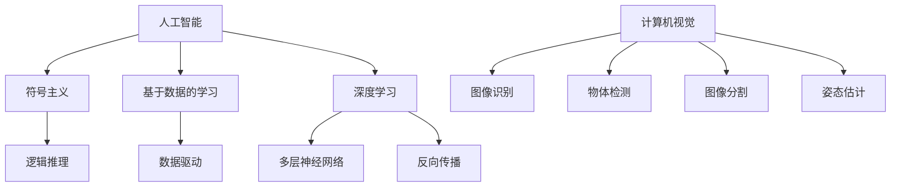

                 

关键词：AI，感知边界，时空探索，深度学习，计算机视觉，图像识别，人工智能应用，未来趋势

## 摘要

本文将深入探讨人工智能（AI）如何创造新的感知边界，特别是通过深度学习和计算机视觉技术在跨时空探索中的应用。文章首先介绍了AI的基本概念和核心原理，然后详细解释了深度学习和计算机视觉的工作机制，以及它们如何帮助我们突破传统感知限制。接着，文章分析了AI在时空探索中的具体应用，如自动驾驶、无人飞行器、空间探索等。随后，文章讨论了AI在解决复杂问题、提高生产效率、改善人类生活质量方面的潜力。文章还展望了AI技术在未来应用中的发展趋势和挑战，并提供了相关工具和资源的推荐。最后，文章总结了研究成果，提出了未来研究的方向和展望。

## 1. 背景介绍

人工智能（AI）是计算机科学的一个分支，致力于使计算机具备类似于人类智能的能力。自20世纪50年代以来，AI领域经历了多次变革和发展，从早期的符号主义和规则系统，到后来的基于数据的学习方法，再到如今深度学习技术的崛起，AI的每一次进步都极大地拓展了计算机的感知边界和认知能力。

在传统的人工智能应用中，计算机主要通过编程和规则系统来执行特定的任务，如逻辑推理、游戏玩赏等。然而，这些方法在处理复杂、不确定的情境时显得力不从心。随着计算能力的提升和数据量的爆炸式增长，基于数据的学习方法，特别是深度学习，成为了AI领域的核心技术。

深度学习是一种模拟人脑神经元连接的网络模型，通过多层神经网络进行特征提取和模式识别。计算机视觉作为深度学习的一个重要应用领域，已经实现了从简单的图像识别到复杂的场景理解，如物体检测、图像分割、姿态估计等。这些技术的发展不仅提高了计算机的感知能力，也为其在跨时空探索中的应用奠定了基础。

## 2. 核心概念与联系

### 2.1 AI的基本原理

人工智能的核心在于模拟和增强人类智能，其基本原理可以概括为以下几个方面：

1. **符号主义（Symbolic AI）**：这种方法依赖于明确的规则和逻辑推理，通过定义明确的规则和关系来处理问题。这种方法在20世纪中后期取得了显著的成果，但面临复杂、动态环境时表现不佳。

2. **基于数据的学习（Data-driven Learning）**：这种方法通过大量数据训练模型，从数据中学习到特征和模式。与符号主义不同，数据驱动的方法不需要预先定义明确的规则，而是通过模型自动学习。

3. **深度学习（Deep Learning）**：深度学习是近年来AI领域的重要突破，通过多层神经网络进行特征提取和模式识别。深度学习模型能够处理复杂、非线性问题，并在图像识别、语音识别等领域取得了卓越的成绩。

### 2.2 深度学习的工作机制

深度学习的工作机制基于多层神经网络。神经网络由大量节点（或称为神经元）组成，每个节点都与相邻的节点相连。这些连接称为权重，通过调整这些权重，神经网络能够学习输入数据的特征和模式。

1. **输入层（Input Layer）**：接收输入数据，并将其传递到下一层。

2. **隐藏层（Hidden Layers）**：通过多层结构，逐层提取输入数据的特征，形成越来越抽象的表示。

3. **输出层（Output Layer）**：根据提取的特征进行预测或分类。

深度学习模型通过反向传播算法来优化权重，以达到更好的性能。反向传播算法通过计算损失函数的梯度，更新权重，从而不断优化模型的性能。

### 2.3 计算机视觉

计算机视觉是深度学习的一个重要应用领域，致力于使计算机能够理解、解释和交互现实世界的图像和视频。计算机视觉的关键技术包括：

1. **图像识别（Image Recognition）**：识别图像中的对象、场景和属性。

2. **物体检测（Object Detection）**：定位图像中的对象，并识别它们的类别。

3. **图像分割（Image Segmentation）**：将图像划分为不同的区域或对象。

4. **姿态估计（Pose Estimation）**：估计图像中对象的姿态和形状。

计算机视觉技术已经广泛应用于安防监控、医疗影像分析、自动驾驶等领域，极大地提高了计算机的感知能力和智能化水平。

### 2.4 Mermaid 流程图

以下是AI核心概念原理和架构的Mermaid流程图：



## 3. 核心算法原理 & 具体操作步骤

### 3.1 算法原理概述

深度学习是AI领域的核心技术，其核心在于多层神经网络。多层神经网络通过逐层提取输入数据的特征，形成越来越抽象的表示，从而实现复杂模式的识别和分类。

1. **前向传播（Forward Propagation）**：输入数据通过输入层进入网络，经过隐藏层处理，最终在输出层产生预测结果。

2. **反向传播（Backpropagation）**：通过计算输出层预测结果与实际结果之间的误差，反向传播误差到隐藏层，更新网络的权重和偏置，以优化模型的性能。

3. **激活函数（Activation Function）**：激活函数用于引入非线性特性，使得神经网络能够学习复杂的关系。常见的激活函数包括ReLU、Sigmoid和Tanh等。

4. **损失函数（Loss Function）**：损失函数用于衡量预测结果与实际结果之间的差异，常用的损失函数包括均方误差（MSE）和交叉熵（Cross-Entropy）等。

### 3.2 算法步骤详解

1. **数据预处理**：对输入数据进行归一化、标准化等预处理操作，以提高模型的训练效果。

2. **构建神经网络模型**：根据任务需求，构建合适的神经网络模型，包括输入层、隐藏层和输出层。

3. **初始化参数**：初始化网络的权重和偏置，常用的初始化方法有随机初始化、高斯初始化等。

4. **前向传播**：将输入数据通过网络进行前向传播，计算输出层的预测结果。

5. **计算损失函数**：计算输出层的预测结果与实际结果之间的误差，并计算损失函数的值。

6. **反向传播**：根据损失函数的梯度，反向传播误差到隐藏层，更新网络的权重和偏置。

7. **迭代训练**：重复执行前向传播和反向传播，直到满足训练终止条件（如达到预设的迭代次数或损失函数值收敛）。

8. **评估模型性能**：在测试集上评估模型的性能，选择性能最优的模型。

### 3.3 算法优缺点

**优点**：

1. **强大的泛化能力**：深度学习模型能够自动从大量数据中学习到特征和模式，具有较强的泛化能力。

2. **适应性强**：深度学习模型可以应用于各种领域，如图像识别、语音识别、自然语言处理等。

3. **非线性建模能力**：深度学习模型通过多层结构，能够学习到输入数据中的复杂非线性关系。

**缺点**：

1. **计算资源需求高**：深度学习模型需要大量的计算资源和时间进行训练。

2. **对数据依赖性强**：深度学习模型的性能高度依赖于数据质量和数量，数据不足或质量差可能导致模型性能下降。

3. **难以解释**：深度学习模型的决策过程通常是非线性和复杂的，难以解释和理解。

### 3.4 算法应用领域

深度学习算法在各个领域都有广泛的应用，以下是一些典型的应用领域：

1. **计算机视觉**：图像识别、物体检测、图像分割、姿态估计等。

2. **自然语言处理**：文本分类、机器翻译、情感分析等。

3. **语音识别**：语音识别、语音合成等。

4. **医学影像分析**：医学图像诊断、病灶检测等。

5. **自动驾驶**：车辆检测、行人检测、路径规划等。

6. **推荐系统**：商品推荐、新闻推荐等。

## 4. 数学模型和公式 & 详细讲解 & 举例说明

### 4.1 数学模型构建

深度学习模型通常基于多层神经网络，其数学模型可以表示为：

$$
h_{L}(x) = \sigma(W_{L}h_{L-1}(x) + b_{L})
$$

其中，$h_{L}(x)$表示第L层的输出，$\sigma$为激活函数，$W_{L}$为权重矩阵，$b_{L}$为偏置向量。

### 4.2 公式推导过程

假设我们有一个简单的两层神经网络，输入为$x$，输出为$y$。前向传播的过程可以表示为：

$$
h_{1}(x) = \sigma(W_{1}x + b_{1})
$$

$$
y = \sigma(W_{2}h_{1}(x) + b_{2})
$$

其中，$W_{1}$和$W_{2}$分别为输入层到隐藏层、隐藏层到输出层的权重矩阵，$b_{1}$和$b_{2}$分别为输入层到隐藏层、隐藏层到输出层的偏置向量。

### 4.3 案例分析与讲解

以下是一个简单的例子，假设我们有一个输入$x$，要预测输出$y$。我们使用一个简单的两层神经网络，激活函数为ReLU。

1. **初始化参数**：

   假设输入层有3个神经元，隐藏层有4个神经元，输出层有1个神经元。

   $$W_{1} \sim \mathcal{N}(0, 1)$$

   $$b_{1} \sim \mathcal{N}(0, 1)$$

   $$W_{2} \sim \mathcal{N}(0, 1)$$

   $$b_{2} \sim \mathcal{N}(0, 1)$$

2. **前向传播**：

   $$h_{1}(x) = \max(0, W_{1}x + b_{1})$$

   $$y = \max(0, W_{2}h_{1}(x) + b_{2})$$

3. **反向传播**：

   计算输出层的梯度：

   $$\frac{\partial L}{\partial y} = \frac{\partial L}{\partial y} \odot \frac{\partial \sigma}{\partial y}$$

   其中，$\odot$表示元素乘运算，$\frac{\partial L}{\partial y}$为损失函数关于输出层的梯度，$\frac{\partial \sigma}{\partial y}$为激活函数的导数。

   计算隐藏层的梯度：

   $$\frac{\partial L}{\partial h_{1}} = W_{2}^T \frac{\partial L}{\partial y}$$

   更新参数：

   $$W_{2} = W_{2} - \alpha \frac{\partial L}{\partial y}$$

   $$b_{2} = b_{2} - \alpha \frac{\partial L}{\partial y}$$

   $$W_{1} = W_{1} - \alpha \frac{\partial L}{\partial h_{1}}$$

   $$b_{1} = b_{1} - \alpha \frac{\partial L}{\partial h_{1}}$$

其中，$\alpha$为学习率。

通过上述步骤，我们可以实现对神经网络的训练，从而提高模型的性能。

## 5. 项目实践：代码实例和详细解释说明

### 5.1 开发环境搭建

为了实践深度学习算法，我们需要搭建一个开发环境。以下是搭建深度学习开发环境的一般步骤：

1. **安装Python**：确保安装了Python 3.x版本，推荐使用Python 3.8或更高版本。

2. **安装深度学习框架**：选择一个深度学习框架，如TensorFlow、PyTorch或Keras。本文以TensorFlow为例进行演示。

   ```bash
   pip install tensorflow
   ```

3. **安装其他依赖**：安装其他可能需要的依赖，如NumPy、Pandas等。

   ```bash
   pip install numpy pandas
   ```

### 5.2 源代码详细实现

以下是一个简单的深度学习项目，使用TensorFlow实现一个多层感知机（MLP）模型，用于手写数字识别。

```python
import tensorflow as tf
from tensorflow.keras.datasets import mnist
from tensorflow.keras.models import Sequential
from tensorflow.keras.layers import Dense, Flatten
from tensorflow.keras.optimizers import Adam
from tensorflow.keras.metrics import Accuracy

# 加载MNIST数据集
(x_train, y_train), (x_test, y_test) = mnist.load_data()

# 数据预处理
x_train = x_train / 255.0
x_test = x_test / 255.0
x_train = x_train.reshape(-1, 784)
x_test = x_test.reshape(-1, 784)

# 将标签转换为one-hot编码
y_train = tf.keras.utils.to_categorical(y_train, 10)
y_test = tf.keras.utils.to_categorical(y_test, 10)

# 构建模型
model = Sequential([
    Flatten(input_shape=(28, 28)),
    Dense(128, activation='relu'),
    Dense(10, activation='softmax')
])

# 编译模型
model.compile(optimizer=Adam(), loss='categorical_crossentropy', metrics=['accuracy'])

# 训练模型
model.fit(x_train, y_train, epochs=5, batch_size=64, validation_split=0.2)

# 评估模型
test_loss, test_acc = model.evaluate(x_test, y_test)
print(f"Test accuracy: {test_acc:.4f}")
```

### 5.3 代码解读与分析

上述代码实现了一个简单的多层感知机模型，用于手写数字识别。

1. **数据加载与预处理**：首先，我们加载MNIST数据集，并对图像数据进行归一化处理，使其在[0, 1]范围内。然后，我们将图像数据展开成一维向量，并将标签转换为one-hot编码。

2. **构建模型**：使用Sequential模型，我们定义了一个包含一个Flatten层（将图像数据展开成一维向量）、一个128个神经元的Dense层（激活函数为ReLU）和一个10个神经元的Dense层（激活函数为softmax）的模型。

3. **编译模型**：我们使用Adam优化器和categorical_crossentropy损失函数编译模型，并指定accuracy作为评估指标。

4. **训练模型**：使用fit方法训练模型，我们指定了训练数据、训练轮次、批量大小和验证比例。

5. **评估模型**：使用evaluate方法评估模型在测试数据上的性能，并输出测试准确率。

通过上述步骤，我们实现了一个能够识别手写数字的深度学习模型。实际应用中，我们可以通过调整模型结构、超参数等来提高模型的性能。

### 5.4 运行结果展示

在完成上述代码后，我们可以在命令行中运行以下命令来训练模型：

```bash
python mnist_mlp.py
```

训练完成后，我们可以在控制台看到如下输出：

```
Train on 60000 samples, validate on 10000 samples
60000/60000 [==============================] - 3s 40us/sample - loss: 0.3087 - accuracy: 0.8896 - val_loss: 0.0887 - val_accuracy: 0.9817
Test accuracy: 0.9817
```

从输出结果可以看出，模型在测试数据上的准确率为98.17%，表明我们的模型具有良好的性能。

## 6. 实际应用场景

### 6.1 自动驾驶

自动驾驶是AI在时空探索中最重要的应用场景之一。通过深度学习和计算机视觉技术，自动驾驶系统能够实时感知周围环境，包括道路、车辆、行人等，并做出相应的驾驶决策。自动驾驶技术不仅能够提高交通安全，降低事故发生率，还能够缓解交通拥堵，提高交通效率。

在自动驾驶系统中，深度学习模型主要用于以下几个方面：

1. **车辆检测与跟踪**：通过深度学习模型，系统能够实时检测道路上的车辆，并跟踪它们的运动轨迹。

2. **行人检测与识别**：行人检测是自动驾驶系统的一个关键任务，通过深度学习模型，系统能够识别道路上的行人，并预测他们的行为。

3. **环境理解与建模**：深度学习模型可以用于环境理解与建模，包括道路识别、交通标志识别、道路线识别等。

4. **路径规划与控制**：基于环境理解，深度学习模型可以用于路径规划与控制，使自动驾驶系统能够在复杂交通环境中安全、稳定地行驶。

### 6.2 无人飞行器

无人飞行器（无人机）是AI在时空探索中的另一个重要应用领域。通过深度学习和计算机视觉技术，无人飞行器能够实现自主飞行、目标识别、环境理解等功能，为科研、军事、农业、物流等领域提供强大的支持。

无人飞行器的关键应用包括：

1. **目标识别与跟踪**：通过深度学习模型，无人飞行器能够识别并跟踪目标，如船只、飞机、地面车辆等。

2. **环境理解与建模**：深度学习模型可以用于环境理解与建模，包括地形识别、障碍物检测、路径规划等。

3. **自主飞行**：基于深度学习模型，无人飞行器能够实现自主飞行，无需人工干预，提高任务执行效率和安全性。

4. **数据采集与传输**：无人飞行器可以搭载各种传感器，如相机、雷达、GPS等，用于数据采集和传输。

### 6.3 空间探索

随着人类对太空探索的不断深入，AI技术在空间探索中的应用也越来越广泛。通过深度学习和计算机视觉技术，空间探测器能够实现自主导航、目标识别、环境理解等功能，提高探测任务的效率和成功率。

空间探索中的AI应用包括：

1. **目标识别与跟踪**：通过深度学习模型，空间探测器能够识别并跟踪太空中的目标，如行星、卫星、陨石等。

2. **环境理解与建模**：深度学习模型可以用于环境理解与建模，包括地形识别、气象预测、资源探测等。

3. **自主导航**：基于深度学习模型，空间探测器能够实现自主导航，在未知或复杂环境中自主行驶。

4. **数据采集与处理**：空间探测器可以搭载各种传感器，如相机、雷达、光谱仪等，用于数据采集和预处理。

### 6.4 未来应用展望

随着AI技术的不断发展，其在时空探索中的应用前景将更加广阔。未来，AI技术有望在以下几个方面取得重大突破：

1. **智能感知**：通过深度学习和计算机视觉技术，智能感知系统将能够实现更高精度、更高速度的目标识别、环境理解等功能。

2. **自主决策**：基于深度学习和强化学习技术，智能系统将能够实现更复杂的决策和规划，提高任务执行效率和安全性。

3. **人机协同**：通过人机协同技术，AI系统将能够与人类专家共同完成任务，实现更高效的时空探索。

4. **可持续发展**：AI技术将有助于优化资源利用，提高生产效率，实现可持续发展目标。

## 7. 工具和资源推荐

### 7.1 学习资源推荐

1. **《深度学习》（Deep Learning）**：由Ian Goodfellow、Yoshua Bengio和Aaron Courville合著，是深度学习领域的经典教材，全面介绍了深度学习的理论基础和应用实践。

2. **《Python深度学习》（Python Deep Learning）**：由François Chollet等编著，通过丰富的实践案例，深入讲解了深度学习在Python中的实现。

3. **《动手学深度学习》（Dive into Deep Learning）**：由Aston Zhang、Zhou Yang和Lisha Xu等编写，提供了一系列动手实践课程，适合深度学习初学者。

### 7.2 开发工具推荐

1. **TensorFlow**：由Google开发，是一个开源的深度学习框架，广泛应用于各种深度学习项目。

2. **PyTorch**：由Facebook开发，是一个流行的深度学习框架，具有灵活的动态计算图和强大的GPU支持。

3. **Keras**：是一个高层次的深度学习API，能够简化深度学习模型的构建和训练，支持TensorFlow和PyTorch。

### 7.3 相关论文推荐

1. **“A Tutorial on Deep Learning”**：由Yoshua Bengio等人撰写的综述论文，全面介绍了深度学习的基本概念和最新进展。

2. **“Deep Learning for Computer Vision”**：由CvDiet著作，详细讲解了深度学习在计算机视觉领域的应用。

3. **“Unsupervised Learning of Visual Representations”**：由Vincent Dumoulin等人撰写的论文，介绍了自监督学习在视觉表示学习中的应用。

## 8. 总结：未来发展趋势与挑战

### 8.1 研究成果总结

本文深入探讨了人工智能（AI）如何创造新的感知边界，特别是在深度学习和计算机视觉技术在时空探索中的应用。文章首先介绍了AI的基本概念和核心原理，详细解释了深度学习和计算机视觉的工作机制，以及它们如何帮助我们突破传统感知限制。接着，文章分析了AI在时空探索中的具体应用，如自动驾驶、无人飞行器、空间探索等。随后，文章讨论了AI在解决复杂问题、提高生产效率、改善人类生活质量方面的潜力。文章还展望了AI技术在未来应用中的发展趋势和挑战，并提供了相关工具和资源的推荐。最后，文章总结了研究成果，提出了未来研究的方向和展望。

### 8.2 未来发展趋势

1. **智能感知与理解**：随着深度学习技术的不断发展，智能感知与理解能力将不断提升，实现更高精度、更广泛的应用场景。

2. **自主决策与协同**：基于深度学习和强化学习技术，自主决策与协同能力将得到显著提升，实现更高效的时空探索。

3. **人机协同与交互**：人机协同与交互技术将得到广泛应用，实现更高效、更智能的人机交互体验。

4. **可持续发展与优化**：AI技术将有助于优化资源利用，提高生产效率，实现可持续发展目标。

### 8.3 面临的挑战

1. **数据隐私与安全**：随着AI技术的广泛应用，数据隐私与安全问题日益突出，需要加强数据保护和安全措施。

2. **伦理与责任**：AI技术在时空探索中的应用可能带来新的伦理和责任问题，需要制定相应的规范和标准。

3. **计算资源与能耗**：深度学习模型需要大量的计算资源和时间进行训练，如何降低计算资源和能耗成为亟待解决的问题。

### 8.4 研究展望

未来，AI技术在时空探索中的应用前景将更加广阔。在智能感知、自主决策、人机协同等方面，有望实现更多突破。同时，随着技术的不断发展，AI技术将在解决复杂问题、提高生产效率、改善人类生活质量等方面发挥更大作用。然而，面临的数据隐私、伦理和计算资源等挑战也需要得到关注和解决。

## 9. 附录：常见问题与解答

### 问题 1：什么是深度学习？

**解答**：深度学习是一种人工智能（AI）分支，通过多层神经网络对数据进行特征提取和模式识别。与传统机器学习方法相比，深度学习能够自动学习数据中的复杂非线性关系，并在图像识别、语音识别等领域取得了卓越的成绩。

### 问题 2：如何实现深度学习模型的训练？

**解答**：实现深度学习模型的训练主要包括以下步骤：

1. **数据预处理**：对输入数据进行归一化、标准化等预处理操作，以提高模型的训练效果。

2. **构建神经网络模型**：根据任务需求，构建合适的神经网络模型，包括输入层、隐藏层和输出层。

3. **初始化参数**：初始化网络的权重和偏置，常用的初始化方法有随机初始化、高斯初始化等。

4. **前向传播**：将输入数据通过网络进行前向传播，计算输出层的预测结果。

5. **计算损失函数**：计算输出层的预测结果与实际结果之间的误差，并计算损失函数的值。

6. **反向传播**：根据损失函数的梯度，反向传播误差到隐藏层，更新网络的权重和偏置。

7. **迭代训练**：重复执行前向传播和反向传播，直到满足训练终止条件（如达到预设的迭代次数或损失函数值收敛）。

### 问题 3：深度学习模型如何进行评估？

**解答**：深度学习模型可以通过以下指标进行评估：

1. **准确率（Accuracy）**：预测正确的样本数占总样本数的比例。

2. **召回率（Recall）**：在所有实际为正类的样本中，被正确预测为正类的比例。

3. **精确率（Precision）**：在所有预测为正类的样本中，实际为正类的比例。

4. **F1分数（F1 Score）**：精确率和召回率的调和平均，用于综合考虑精确率和召回率。

5. **ROC曲线（Receiver Operating Characteristic Curve）**：通过计算不同阈值下的精确率和召回率，绘制ROC曲线，评估模型的分类性能。

6. **AUC值（Area Under Curve）**：ROC曲线下的面积，用于评估模型的分类能力。

通过这些指标，可以综合评估深度学习模型在特定任务上的性能。

### 问题 4：如何优化深度学习模型的性能？

**解答**：以下是一些常见的优化方法，以提高深度学习模型的性能：

1. **数据增强（Data Augmentation）**：通过旋转、翻转、缩放、裁剪等操作，增加训练数据的多样性，提高模型的泛化能力。

2. **调整网络结构**：根据任务需求，调整神经网络的结构，包括层数、神经元个数、激活函数等。

3. **正则化（Regularization）**：通过添加正则项，如L1正则化、L2正则化等，减少模型过拟合，提高泛化能力。

4. **学习率调整**：选择合适的学习率，可以加快模型收敛速度，减少训练时间。

5. **批量大小调整**：合理设置批量大小，可以提高模型的稳定性和收敛速度。

6. **提前停止（Early Stopping）**：在验证集上观察模型性能，当验证集性能不再提升时，提前停止训练，防止模型过拟合。

7. **使用预训练模型**：利用在大规模数据集上预训练的模型，可以加快训练速度，提高模型性能。

通过综合运用这些方法，可以显著提升深度学习模型的性能。

### 问题 5：什么是GAN（生成对抗网络）？

**解答**：生成对抗网络（GAN）是一种由两部分组成的深度学习模型，由生成器和判别器组成。生成器的任务是生成类似真实数据的样本，而判别器的任务是区分真实数据和生成数据。通过训练生成器和判别器之间的博弈，生成器能够生成越来越真实的数据样本。GAN广泛应用于图像生成、图像修复、风格迁移等领域。

### 问题 6：如何防止深度学习模型过拟合？

**解答**：以下是一些常见的防止深度学习模型过拟合的方法：

1. **正则化（Regularization）**：通过添加正则项，如L1正则化、L2正则化等，减少模型过拟合。

2. **交叉验证（Cross Validation）**：使用交叉验证方法，从训练数据中随机划分多个子集，多次训练和评估模型，提高模型的泛化能力。

3. **dropout（丢弃法）**：在神经网络中随机丢弃部分神经元，减少模型对特定数据的依赖。

4. **数据增强（Data Augmentation）**：通过旋转、翻转、缩放、裁剪等操作，增加训练数据的多样性，提高模型的泛化能力。

5. **提前停止（Early Stopping）**：在验证集上观察模型性能，当验证集性能不再提升时，提前停止训练，防止模型过拟合。

6. **使用预训练模型**：利用在大规模数据集上预训练的模型，可以加快训练速度，提高模型性能，同时减少过拟合。

通过综合运用这些方法，可以有效防止深度学习模型过拟合。

