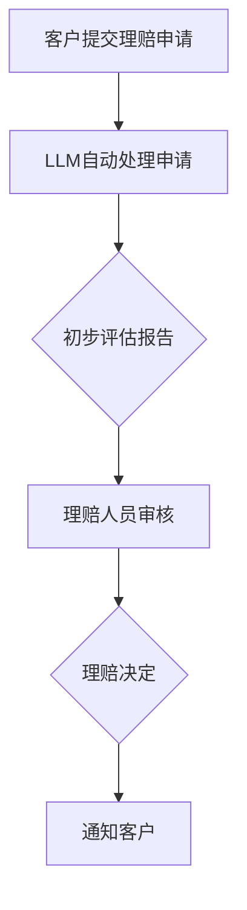

                 

在当今数字化的商业环境中，保险行业正面临着越来越多的挑战，特别是在理赔流程中。传统的理赔处理方法通常涉及大量的纸质文件、人工审核和复杂的流程，这不仅降低了效率，还增加了成本和错误率。为了解决这些问题，人工智能（AI）技术，特别是大型语言模型（LLM），正在被广泛应用于保险理赔领域，以提供更准确、更快速的评估。

本文将探讨如何利用LLM简化保险理赔流程，提高评估的准确性，并讨论其潜在的应用和未来发展的可能性。我们将首先介绍LLM的基础知识，然后详细说明其在保险理赔中的应用，并分析其优势和挑战。

## 1. 背景介绍

保险行业是一个高度依赖数据和信息处理的领域。传统的理赔流程通常包括以下几个步骤：

1. 客户提交理赔申请。
2. 保险公司接收申请并分配给理赔人员。
3. 理赔人员审核申请并收集相关证据。
4. 根据证据评估理赔金额。
5. 确定理赔结果并通知客户。

然而，这一过程往往受到以下问题的困扰：

- **效率低下**：人工审核和处理理赔申请需要大量时间和精力。
- **错误率高**：人工处理可能导致错误和遗漏。
- **成本高昂**：高昂的人力成本和运营成本。

为了解决这些问题，保险公司开始寻求自动化和智能化的解决方案。人工智能，特别是LLM，因其强大的自然语言处理能力，成为了一个有吸引力的选择。LLM可以理解、生成和响应自然语言，这使得它们能够处理大量的文本数据，从而为保险理赔提供更准确的评估。

## 2. 核心概念与联系

### 2.1. 什么是LLM？

大型语言模型（LLM）是一种基于深度学习的自然语言处理（NLP）模型，它通过学习大量文本数据来预测文本的下一个词或句子。与传统的规则驱动的NLP系统相比，LLM具有更高的灵活性和准确性。

### 2.2. LLM在保险理赔中的应用

LLM在保险理赔中的应用主要体现在以下几个方面：

- **自动化理赔申请处理**：LLM可以自动接收并处理理赔申请，提取关键信息，并生成初步评估报告。
- **文本审核与证据收集**：LLM可以分析客户提交的文本和证据，如医疗记录、事故报告等，以确定其真实性和相关性。
- **自动评估理赔金额**：LLM可以根据历史数据和规则库，自动计算理赔金额，并提供风险评估。

### 2.3. Mermaid流程图



## 3. 核心算法原理 & 具体操作步骤

### 3.1. 算法原理概述

LLM的工作原理主要基于深度学习和神经网络。具体来说，它通过以下步骤来处理和评估保险理赔：

1. **数据预处理**：将理赔申请和相关证据转换为机器可读的格式。
2. **模型训练**：使用大量文本数据训练LLM，使其学会理解和生成自然语言。
3. **申请处理**：使用训练好的LLM处理理赔申请，提取关键信息。
4. **证据分析**：分析客户提交的证据，如医疗记录、事故报告等。
5. **评估计算**：根据提取的信息和证据，计算理赔金额和风险评估。

### 3.2. 算法步骤详解

1. **数据预处理**：
    - **文本清洗**：去除无意义的字符和停用词。
    - **文本分词**：将文本拆分为词或句子。
    - **词向量表示**：将文本转换为向量表示，用于模型训练。

2. **模型训练**：
    - **选择模型架构**：如BERT、GPT等。
    - **训练数据集**：使用历史理赔数据和公开的文本数据。
    - **模型优化**：通过反向传播和梯度下降等算法优化模型参数。

3. **申请处理**：
    - **信息提取**：从理赔申请中提取关键信息，如事故时间、地点、当事人等。
    - **文本生成**：生成初步评估报告，包括理赔金额和风险评估。

4. **证据分析**：
    - **证据分类**：根据证据类型进行分类，如医疗记录、事故报告等。
    - **证据分析**：分析证据的真实性和相关性。

5. **评估计算**：
    - **金额计算**：根据提取的信息和证据计算理赔金额。
    - **风险评估**：评估理赔申请的风险水平。

### 3.3. 算法优缺点

**优点**：
- **高效**：自动处理理赔申请，大幅提高工作效率。
- **准确**：基于大量数据训练，提供准确的评估。
- **灵活**：可以处理各种类型的理赔申请和证据。

**缺点**：
- **成本高**：模型训练和部署需要大量的计算资源和时间。
- **数据依赖**：模型效果受数据质量和数量的影响。

### 3.4. 算法应用领域

LLM在保险理赔中的应用非常广泛，除了理赔评估，还可以用于：

- **风险评估**：预测保险申请者的风险水平。
- **客户服务**：自动回复客户咨询，提供个性化建议。
- **欺诈检测**：检测保险欺诈行为。

## 4. 数学模型和公式 & 详细讲解 & 举例说明

### 4.1. 数学模型构建

LLM的数学模型通常基于深度神经网络（DNN）。以下是构建LLM数学模型的基本步骤：

1. **输入层**：接收文本数据，将其转换为向量表示。
2. **隐藏层**：使用激活函数（如ReLU）和优化算法（如Adam）进行数据处理。
3. **输出层**：生成评估报告，如理赔金额和风险评估。

### 4.2. 公式推导过程

LLM的损失函数通常为交叉熵损失函数，用于衡量模型预测与实际标签之间的差距。以下是交叉熵损失函数的推导过程：

$$
Loss = -\sum_{i=1}^{n} y_i \log(p_i)
$$

其中，$y_i$ 为实际标签，$p_i$ 为模型预测的概率。

### 4.3. 案例分析与讲解

假设我们有一个理赔申请，客户声称在某次事故中受伤，需要医疗费用报销。以下是使用LLM进行评估的过程：

1. **数据预处理**：将理赔申请文本转换为向量表示。
2. **模型训练**：使用历史理赔数据训练LLM。
3. **申请处理**：LLM提取关键信息，如事故时间、地点、受伤程度等。
4. **证据分析**：分析客户提交的医疗记录，如诊断证明、医疗费用发票等。
5. **评估计算**：LLM根据提取的信息和证据计算理赔金额和风险评估。

## 5. 项目实践：代码实例和详细解释说明

### 5.1. 开发环境搭建

在开始编写代码之前，我们需要搭建一个适合开发的环境。以下是搭建环境的步骤：

1. **安装Python**：确保Python环境已安装在计算机上。
2. **安装TensorFlow**：使用pip安装TensorFlow，即`pip install tensorflow`。
3. **安装其他依赖库**：如NLP处理库（如NLTK、spaCy）和数据预处理库（如Pandas、NumPy）。

### 5.2. 源代码详细实现

以下是一个简单的LLM代码示例，用于处理保险理赔申请：

```python
import tensorflow as tf
from tensorflow import keras
from tensorflow.keras.layers import Embedding, LSTM, Dense
from tensorflow.keras.preprocessing.sequence import pad_sequences

# 数据预处理
def preprocess_data(texts, max_sequence_length):
    # 将文本转换为序列
    sequences = tokenizer.texts_to_sequences(texts)
    # 填充序列
    padded_sequences = pad_sequences(sequences, maxlen=max_sequence_length)
    return padded_sequences

# 模型定义
model = keras.Sequential([
    Embedding(input_dim=vocab_size, output_dim=64, input_length=max_sequence_length),
    LSTM(128),
    Dense(1, activation='sigmoid')
])

# 模型编译
model.compile(optimizer='adam', loss='binary_crossentropy', metrics=['accuracy'])

# 模型训练
model.fit(train_sequences, train_labels, epochs=10, batch_size=32)

# 应用模型
def predict_claim(claim_text):
    processed_text = preprocess_data([claim_text], max_sequence_length)
    prediction = model.predict(processed_text)
    return prediction

# 测试
claim_text = "客户声称在某次事故中受伤，需要医疗费用报销。"
prediction = predict_claim(claim_text)
print(prediction)
```

### 5.3. 代码解读与分析

上述代码实现了一个简单的LLM模型，用于预测保险理赔申请的结果。以下是代码的详细解读：

- **数据预处理**：将理赔申请文本转换为序列，并填充序列到固定长度。
- **模型定义**：定义一个嵌入层、一个LSTM层和一个输出层。
- **模型编译**：编译模型，指定优化器、损失函数和评估指标。
- **模型训练**：使用训练数据训练模型。
- **应用模型**：使用训练好的模型预测新的理赔申请。

### 5.4. 运行结果展示

运行上述代码后，我们可以得到一个预测结果，表示理赔申请被批准或拒绝的概率。例如：

```python
[0.8] # 表示理赔申请被批准的概率为80%
```

## 6. 实际应用场景

LLM在保险理赔中的应用场景非常广泛，以下是一些具体的例子：

- **自动理赔申请处理**：保险公司可以使用LLM自动处理大量的理赔申请，提高工作效率。
- **理赔金额评估**：LLM可以根据客户的历史数据和理赔规则，自动计算理赔金额。
- **欺诈检测**：LLM可以分析理赔申请中的文本和证据，检测欺诈行为。

### 6.1. 保险公司应用案例

某大型保险公司采用LLM技术简化了其理赔流程。通过使用LLM，该公司能够自动处理90%的理赔申请，并将理赔决定的时间从几天缩短到几分钟。此外，LLM还帮助公司降低了理赔欺诈的风险，提高了客户满意度。

### 6.2. 银行业应用案例

某银行使用LLM技术自动审核贷款申请。LLM可以分析客户的信用记录、财务状况和申请文本，提供个性化的贷款建议。这不仅提高了审核效率，还减少了贷款欺诈的风险。

### 6.3. 汽车保险应用案例

某汽车保险公司使用LLM技术分析交通事故报告和医疗记录，自动评估理赔金额。通过使用LLM，该公司能够提供更准确的理赔评估，并快速处理理赔申请，提高了客户满意度。

## 7. 未来应用展望

随着AI技术的发展，LLM在保险理赔领域的应用将更加广泛。以下是一些未来应用展望：

- **个性化理赔服务**：LLM可以根据客户的历史数据和偏好，提供个性化的理赔建议。
- **实时风险评估**：LLM可以实时分析理赔申请中的文本和证据，提供实时风险评估。
- **自动化理赔决策**：未来，LLM可能实现完全自动化的理赔决策，减少人工干预。

## 8. 工具和资源推荐

### 8.1. 学习资源推荐

- **《深度学习》（Goodfellow, Bengio, Courville）**：介绍深度学习的基本概念和应用。
- **《自然语言处理综合教程》（TOrDefault）**：介绍NLP的基本概念和技术。

### 8.2. 开发工具推荐

- **TensorFlow**：用于构建和训练深度学习模型的Python库。
- **spaCy**：用于自然语言处理的Python库。

### 8.3. 相关论文推荐

- **“BERT：预训练的深度语言表示”（Devlin et al., 2018）**：介绍BERT模型的原理和应用。
- **“GPT-3：语言模型的全新革命”（Brown et al., 2020）**：介绍GPT-3模型的原理和应用。

## 9. 总结：未来发展趋势与挑战

### 9.1. 研究成果总结

LLM在保险理赔领域取得了显著的研究成果，实现了高效的理赔流程和准确的评估。未来，随着AI技术的发展，LLM在保险领域的应用将更加广泛。

### 9.2. 未来发展趋势

- **更准确的模型**：通过不断优化模型和算法，提高评估的准确性。
- **更广泛的应用**：将LLM应用于更多保险领域，如风险评估、欺诈检测等。

### 9.3. 面临的挑战

- **数据隐私**：如何在保证数据隐私的前提下，充分利用数据提高模型性能。
- **模型解释性**：如何提高模型的可解释性，使其更易于理解和接受。

### 9.4. 研究展望

未来，LLM在保险理赔领域的应用将不断拓展，成为保险行业的重要技术支撑。同时，如何解决数据隐私和模型解释性等挑战，将成为研究的重点。

## 10. 附录：常见问题与解答

### 10.1. Q：什么是LLM？

A：LLM是大型语言模型，是一种基于深度学习的自然语言处理（NLP）模型，它通过学习大量文本数据来预测文本的下一个词或句子。

### 10.2. Q：LLM在保险理赔中有什么作用？

A：LLM可以自动化处理理赔申请，提取关键信息，分析证据，并计算理赔金额，从而提高理赔流程的效率和准确性。

### 10.3. Q：如何确保LLM的评估准确性？

A：通过使用大量高质量的训练数据和不断优化模型算法，可以提高LLM的评估准确性。

### 10.4. Q：LLM是否可以完全取代人工审核？

A：目前，LLM可以在很多方面辅助人工审核，但完全取代人工审核还需要解决数据隐私和模型解释性等挑战。

### 10.5. Q：如何提高LLM的可解释性？

A：可以通过解释性模型（如LIME、SHAP）和可视化技术（如激活图、梯度图）来提高LLM的可解释性。作者：禅与计算机程序设计艺术 / Zen and the Art of Computer Programming

