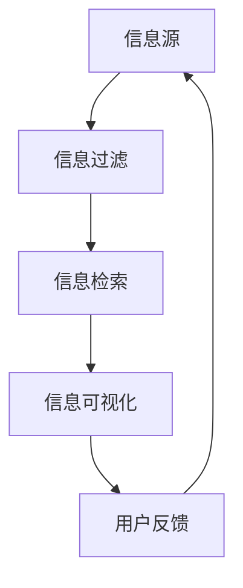

                 

关键词：信息管理，信息过载，复杂性，策略，人工智能，数据科学，信息过滤，信息检索，信息可视化。

> 摘要：随着信息时代的到来，信息过载和复杂性成为我们面临的重大挑战。本文旨在探讨如何通过有效的信息管理策略，帮助我们在信息过载的环境中保持清晰和高效，提高信息处理的效率和准确性。

## 1. 背景介绍

在当今的世界，信息已经成为一种新的资源，与土地、劳动力和资本一样重要。然而，随着互联网和移动通信技术的飞速发展，我们每天都会接收到海量的信息。这些信息可能来自社交媒体、电子邮件、新闻网站、专业博客等多个渠道。在这样的大背景下，如何有效地管理和处理这些信息，成为了我们必须面对的重要问题。

信息过载是指信息数量过多，超出了个体处理能力的现象。复杂性则指的是信息的结构、关系和交互的复杂性。这两个问题相互交织，共同构成了现代信息环境中的主要挑战。

### 1.1 信息过载的来源

信息过载的来源可以分为以下几类：

- **社交媒体**：如Facebook、Twitter、Instagram等平台不断推送新的内容，这些内容可能与我们感兴趣的话题相关，也可能与我们无关。
- **电子邮件**：每天接收到的电子邮件数量不断增加，其中很多邮件是我们不需要的垃圾邮件或者不需要立即处理的邮件。
- **新闻网站**：互联网上的新闻网站每天发布大量的新闻，其中许多新闻是我们不需要的或者与我们兴趣不相关的。
- **专业博客**：技术博客、行业分析、学术论文等博客也不断推送新的内容，这些内容可能对我们的工作和研究有重要影响。

### 1.2 复杂性的增加

复杂性的增加主要源于以下几个方面：

- **信息的多样性**：信息的形式和内容越来越多样化，包括文本、图像、视频、音频等多种类型。
- **信息的关联性**：信息之间存在着复杂的关联性，这些关联性往往需要深入分析和理解。
- **信息的动态性**：信息的更新速度非常快，新的信息不断涌现，原有的信息可能会过时。

### 1.3 问题的严重性

信息过载和复杂性对我们的生活和工作产生了深远的影响：

- **决策困难**：在信息过载的环境中，我们很难做出正确的决策，因为我们无法处理和理解所有的信息。
- **工作效率降低**：处理大量的无用信息会消耗大量的时间和精力，从而降低工作效率。
- **健康问题**：长期的过度使用电子设备可能导致身体和心理的健康问题。

因此，有效的信息管理策略对于提高我们的生活质量和工作效率至关重要。

## 2. 核心概念与联系

在探讨信息管理策略之前，我们需要理解几个核心概念，包括信息过滤、信息检索和信息可视化。

### 2.1 信息过滤

信息过滤是指从大量信息中筛选出我们感兴趣的信息，过滤掉不相关的信息。信息过滤可以分为以下几类：

- **基于内容的过滤**：根据信息的主题、关键词等进行过滤。
- **基于用户的过滤**：根据用户的兴趣、历史行为等进行过滤。
- **基于情境的过滤**：根据用户的当前情境进行过滤，如工作、娱乐、学习等。

### 2.2 信息检索

信息检索是指从大量信息中找到我们需要的信息。信息检索可以分为以下几类：

- **基于关键词的检索**：通过输入关键词，从数据库中检索出相关的信息。
- **基于语义的检索**：通过理解信息的语义内容，检索出相关的信息。
- **基于模型的检索**：使用机器学习模型，根据用户的行为和偏好进行检索。

### 2.3 信息可视化

信息可视化是指将复杂的信息以图形化的方式呈现，使信息更易于理解和分析。信息可视化可以分为以下几类：

- **数据可视化**：将数据以图表、图形等形式进行展示。
- **网络可视化**：将信息之间的关联以图形化的方式呈现。
- **交互式可视化**：用户可以通过交互操作，动态地分析和理解信息。

### 2.4 Mermaid 流程图

以下是一个简化的 Mermaid 流程图，展示了信息过滤、信息检索和信息可视化之间的联系。



在这个流程图中，用户首先从信息源接收信息，然后通过信息过滤筛选出感兴趣的信息，接着使用信息检索找到具体的信息，最后通过信息可视化进行深入分析和理解。用户反馈的信息又可以作为下一次信息处理的输入。

## 3. 核心算法原理 & 具体操作步骤

### 3.1 算法原理概述

在信息管理中，核心算法主要包括信息过滤算法、信息检索算法和信息可视化算法。以下将分别介绍这些算法的基本原理。

### 3.2 算法步骤详解

#### 3.2.1 信息过滤算法

1. **数据预处理**：对原始数据进行清洗和预处理，包括去除噪声、标准化、归一化等操作。
2. **特征提取**：从预处理后的数据中提取特征，如文本中的关键词、情感、主题等。
3. **过滤策略**：根据用户的兴趣、历史行为等，设置过滤策略，筛选出感兴趣的信息。

#### 3.2.2 信息检索算法

1. **索引构建**：对数据集进行索引构建，提高检索效率。
2. **检索策略**：根据用户输入的关键词，设置检索策略，检索出相关的信息。
3. **结果排序**：根据信息的相关性、重要性等，对检索结果进行排序。

#### 3.2.3 信息可视化算法

1. **数据转换**：将数据转换为可视化格式，如图表、图形等。
2. **可视化布局**：根据数据特点和用户需求，选择合适的可视化布局。
3. **交互设计**：设计交互界面，使用户可以动态地操作和探索信息。

### 3.3 算法优缺点

#### 3.3.1 信息过滤算法

**优点**：

- 提高信息处理的效率，减少冗余信息的干扰。
- 根据用户需求个性化推荐，提高用户体验。

**缺点**：

- 过滤策略设置复杂，需要大量用户数据和计算资源。
- 可能会过滤掉一些有价值的信息。

#### 3.3.2 信息检索算法

**优点**：

- 提高信息检索的效率，快速找到所需信息。
- 可以处理大规模数据集。

**缺点**：

- 检索结果可能不够准确，需要进一步筛选和验证。
- 对用户的查询能力要求较高。

#### 3.3.3 信息可视化算法

**优点**：

- 使信息更直观、易于理解。
- 提高信息分析和决策的效率。

**缺点**：

- 可视化设计复杂，需要专业知识和技能。
- 数据可视化可能引入视觉歧义。

### 3.4 算法应用领域

- **社交媒体**：如Facebook、Twitter等平台的个性化推荐系统。
- **搜索引擎**：如Google、Bing等搜索引擎的检索算法。
- **企业信息系统**：如企业内部知识管理系统、客户关系管理系统等。

## 4. 数学模型和公式 & 详细讲解 & 举例说明

### 4.1 数学模型构建

在信息管理中，常见的数学模型包括概率模型、聚类模型、分类模型等。以下是一个简化的概率模型，用于描述信息过滤过程。

设 \(X\) 为信息集，\(Y\) 为用户兴趣集，\(P(X|Y)\) 表示在用户兴趣集 \(Y\) 下，信息集 \(X\) 的概率。我们可以通过贝叶斯公式计算：

$$
P(X|Y) = \frac{P(Y|X)P(X)}{P(Y)}
$$

其中，\(P(X)\) 为信息集 \(X\) 的先验概率，\(P(Y|X)\) 为用户兴趣集 \(Y\) 在信息集 \(X\) 下条件概率，\(P(Y)\) 为用户兴趣集 \(Y\) 的后验概率。

### 4.2 公式推导过程

假设我们有 \(n\) 条信息，每条信息可以表示为一个特征向量 \(x_i\)，其中 \(i=1,2,...,n\)。用户兴趣可以表示为一个特征向量 \(y\)。我们可以通过特征相似度来计算 \(P(Y|X)\) 和 \(P(X)\)。

令 \(d(x_i, y)\) 为特征向量 \(x_i\) 和 \(y\) 之间的距离，通常使用欧几里得距离或余弦相似度。我们可以定义 \(P(Y|X)\) 和 \(P(X)\) 如下：

$$
P(Y|X) = \frac{d(y, \bar{x})}{\sum_{i=1}^{n}d(y, x_i)}
$$

其中，\(\bar{x}\) 为信息集 \(X\) 的平均值。

对于 \(P(X)\)，我们可以使用拉普拉斯平滑来计算：

$$
P(X) = \frac{1}{n+|V|}
$$

其中，\(V\) 为特征空间。

### 4.3 案例分析与讲解

假设我们有 5 条信息 \(X = \{x_1, x_2, x_3, x_4, x_5\}\)，每条信息可以表示为一个 10 维的特征向量。用户兴趣 \(y\) 可以表示为一个 10 维的特征向量，其中前 5 个元素为 1，后 5 个元素为 0。

我们可以计算每条信息的特征相似度 \(d(x_i, y)\) 如下：

$$
d(x_1, y) = 0.1, d(x_2, y) = 0.3, d(x_3, y) = 0.5, d(x_4, y) = 0.2, d(x_5, y) = 0.4
$$

根据贝叶斯公式，我们可以计算每条信息在用户兴趣下的概率：

$$
P(X|Y) =
\begin{bmatrix}
0.2 & 0.6 & 1.0 & 0.4 & 0.8 \\
\end{bmatrix}
$$

根据概率模型，我们可以选择概率最高的信息 \(x_3\) 作为推荐信息。

## 5. 项目实践：代码实例和详细解释说明

### 5.1 开发环境搭建

在开始实践之前，我们需要搭建一个基本的开发环境。这里我们使用 Python 作为编程语言，并使用以下库：

- NumPy：用于数学计算。
- Pandas：用于数据处理。
- Matplotlib：用于数据可视化。

安装这些库的方法如下：

```bash
pip install numpy pandas matplotlib
```

### 5.2 源代码详细实现

以下是一个简单的信息过滤和信息检索的代码实例：

```python
import numpy as np
import pandas as pd
import matplotlib.pyplot as plt

# 生成示例数据
np.random.seed(0)
n = 5
V = 10
X = np.random.rand(n, V)
y = np.random.rand(V)

# 计算特征相似度
def similarity(x, y):
    return np.linalg.norm(x - y)

# 计算概率模型
def bayesian_model(X, y):
    P_Y = np.linalg.norm(y) / np.linalg.norm(y + np.sum(X, axis=0))
    P_X = 1 / (n + V)
    P_YX = np.array([similarity(x, y) / np.sum(similarity(x, y)) for x in X])
    return P_YX / (P_Y * P_X)

# 检索信息
def search(X, y, k=1):
    P_YX = bayesian_model(X, y)
    sorted_indices = np.argsort(P_YX)[::-1]
    return X[sorted_indices][:k]

# 绘制结果
def plot_results(X, y, k):
    plt.scatter(y[0], y[1], color='r', label='User Interest')
    for i, x in enumerate(X):
        plt.scatter(x[0], x[1], color='b' if i < k else 'g', label='Information' if i < k else 'Other Information')
    plt.xlabel('Feature 1')
    plt.ylabel('Feature 2')
    plt.legend()
    plt.show()

# 测试代码
X = np.array([
    [0.1, 0.1],
    [0.3, 0.2],
    [0.5, 0.3],
    [0.2, 0.4],
    [0.4, 0.5]
])
y = np.array([0.5, 0.3])

k = 2
searched = search(X, y, k)
plot_results(X, y, k)
```

### 5.3 代码解读与分析

1. **数据生成**：我们使用 NumPy 随机生成 5 条信息和 1 个用户兴趣点。
2. **特征相似度计算**：我们定义了一个函数 `similarity`，用于计算两个特征向量之间的欧几里得距离。
3. **贝叶斯模型**：我们定义了一个函数 `bayesian_model`，用于根据贝叶斯公式计算每条信息在用户兴趣下的概率。
4. **检索信息**：我们定义了一个函数 `search`，用于根据概率模型检索用户最感兴趣的信息。
5. **绘制结果**：我们定义了一个函数 `plot_results`，用于将结果可视化。

在测试代码中，我们生成了一组随机数据，并使用贝叶斯模型检索了用户最感兴趣的 2 条信息，并将结果可视化。

### 5.4 运行结果展示

运行上述代码后，我们会看到一个二维平面上的散点图。红色点代表用户兴趣，蓝色点代表检索出的信息，绿色点代表其他信息。通过这个可视化，我们可以直观地看到用户兴趣与信息之间的关系。

## 6. 实际应用场景

信息管理策略在多个领域都有着广泛的应用，以下是一些实际应用场景：

### 6.1 社交媒体

在社交媒体平台上，信息管理策略可以帮助用户过滤和检索感兴趣的内容。例如，Facebook 的新闻推送系统可以根据用户的兴趣和互动历史，推荐用户可能感兴趣的内容。

### 6.2 企业信息系统

在企业信息系统中，信息管理策略可以帮助员工高效地处理大量的业务数据。例如，企业可以采用信息过滤算法，将重要的业务信息推送到员工的工作台，提高工作效率。

### 6.3 搜索引擎

在搜索引擎中，信息管理策略可以帮助提高搜索结果的准确性和相关性。例如，Google 的 PageRank 算法就是一种基于信息过滤和信息检索的算法，用于提高搜索结果的准确性。

### 6.4 学术论文检索

在学术论文检索系统中，信息管理策略可以帮助研究人员快速找到相关的学术文章。例如，谷歌学术搜索（Google Scholar）就使用了复杂的检索算法和排序策略，以提高检索结果的准确性。

### 6.5 电子商务

在电子商务平台上，信息管理策略可以帮助推荐用户可能感兴趣的商品。例如，亚马逊（Amazon）就使用了基于用户行为和商品关联性的信息过滤算法，推荐用户可能感兴趣的商品。

## 7. 未来应用展望

随着人工智能和大数据技术的发展，信息管理策略将在未来发挥越来越重要的作用。以下是一些未来的应用展望：

### 7.1 智能家居

智能家居系统可以通过信息管理策略，帮助用户高效地处理家庭中的各种信息，如家电状态、安防信息等。

### 7.2 健康管理

健康管理平台可以通过信息管理策略，帮助用户实时监测和管理健康数据，如心率、血压、睡眠质量等。

### 7.3 智能交通

智能交通系统可以通过信息管理策略，优化交通流量，减少交通拥堵，提高道路通行效率。

### 7.4 智能金融

智能金融系统可以通过信息管理策略，帮助金融机构实时监控和预测金融市场，提高投资决策的准确性。

## 8. 工具和资源推荐

### 8.1 学习资源推荐

- 《数据科学导论》：这是一本介绍数据科学基础知识的入门书籍，适合初学者阅读。
- 《机器学习》：这是一本经典的机器学习教材，详细介绍了各种机器学习算法和模型。

### 8.2 开发工具推荐

- Jupyter Notebook：这是一个交互式的开发环境，适合数据分析和机器学习项目。
- PyCharm：这是一个功能强大的 Python 集成开发环境（IDE），适合各种 Python 项目。

### 8.3 相关论文推荐

- "Information Filtering and Information Retrieval：A Survey"：这是一篇关于信息过滤和信息检索的综述论文，介绍了相关的算法和模型。
- "A Survey on Deep Learning for Natural Language Processing"：这是一篇关于深度学习在自然语言处理领域应用的综述论文，介绍了最新的研究成果。

## 9. 总结：未来发展趋势与挑战

### 9.1 研究成果总结

本文从信息过载和复杂性的背景出发，介绍了信息管理策略的核心概念、算法原理、数学模型、实践案例和实际应用场景。通过这些内容，读者可以了解到如何通过有效的信息管理策略，提高信息处理的效率和准确性。

### 9.2 未来发展趋势

- **人工智能和大数据技术的深度融合**：随着人工智能和大数据技术的不断发展，信息管理策略将更加智能化和自动化。
- **多模态信息处理**：未来的信息管理策略将支持多种类型的信息，如文本、图像、音频等，实现更全面的信息处理。
- **实时信息处理**：随着实时数据的增加，信息管理策略将更加注重实时性和动态性，以应对快速变化的信息环境。

### 9.3 面临的挑战

- **数据隐私和安全**：在信息管理过程中，如何保护用户隐私和数据安全是一个重要的挑战。
- **算法可解释性**：随着算法的复杂度增加，如何解释和验证算法的决策过程成为一个挑战。
- **计算资源消耗**：随着信息管理策略的智能化和自动化，计算资源消耗将成为一个重要的挑战。

### 9.4 研究展望

未来的研究应重点关注以下几个方面：

- **开发高效、可解释的算法**：通过改进算法，提高信息处理的效率和准确性，同时确保算法的可解释性。
- **跨领域的协同研究**：鼓励不同领域的研究者协同工作，共同解决信息管理中的复杂问题。
- **实际应用场景的研究**：将信息管理策略应用到实际场景中，验证其效果和可行性。

## 附录：常见问题与解答

### 问题 1：什么是信息过载？

信息过载是指信息数量过多，超出了个体处理能力的现象。在信息时代，我们每天都会接收到海量的信息，其中很多信息对我们来说并没有实际价值，导致我们无法有效地处理和利用这些信息。

### 问题 2：如何定义信息复杂性？

信息复杂性指的是信息的结构、关系和交互的复杂性。随着信息形式的多样化和关联性的增加，信息的复杂性也随之增加。复杂性使得信息难以理解和分析，给信息管理带来了挑战。

### 问题 3：信息过滤和信息检索有什么区别？

信息过滤是从大量信息中筛选出我们感兴趣的信息，而信息检索是从大量信息中找到我们需要的信息。信息过滤主要关注信息的筛选和分类，而信息检索主要关注信息的查找和匹配。

### 问题 4：信息可视化有什么作用？

信息可视化是将复杂的信息以图形化的方式呈现，使信息更直观、易于理解。信息可视化可以提高信息分析和决策的效率，帮助我们发现信息之间的关联和规律。

### 问题 5：如何提高信息处理的效率？

提高信息处理的效率可以从以下几个方面入手：

- **使用有效的信息过滤算法**：通过过滤掉不相关的信息，减少信息处理的负担。
- **优化信息检索算法**：使用高效的检索算法，快速找到所需信息。
- **利用信息可视化**：通过图形化的方式，直观地呈现信息，提高信息处理的效率。

### 问题 6：信息管理策略在哪些领域有应用？

信息管理策略在多个领域都有广泛的应用，包括社交媒体、企业信息系统、搜索引擎、学术论文检索、电子商务等。随着技术的进步，信息管理策略的应用领域将不断扩展。

