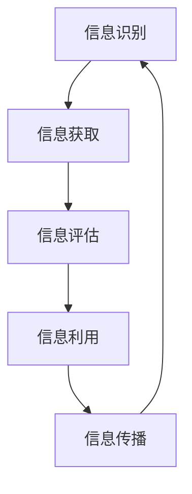

                 

信息时代的浪潮已经席卷全球，我们被淹没在数据的海洋中。在这个充满信息过载的时代，如何提升我们的信息素养，变得尤为重要。这不仅关系到我们在日常生活中如何处理信息，还关系到我们能否在职业生涯中保持竞争力。

本文将深入探讨信息素养的概念、重要性，以及如何在信息海洋中有效游泳。我们将介绍一系列核心概念和算法原理，以及如何将这些知识应用到实际项目中。文章还将提供数学模型和公式，以帮助读者更好地理解信息处理的基础。

## 1. 背景介绍

信息素养（Information Literacy）是指个体能够识别何时需要信息，如何寻找、评估和有效利用所需信息的能力。在信息爆炸的时代，信息素养不仅是学术成功的关键，也是职业发展和个人生活质量的保障。

### 1.1 信息爆炸时代

随着互联网的普及和信息技术的发展，我们每天接收到的信息量前所未有。据统计，人类在2020年产生的数据量已经超过了整个人类历史数据总和。这种信息爆炸使得传统的信息处理方式难以应对，因此提升信息素养变得至关重要。

### 1.2 信息素养的重要性

- **学术研究**：信息素养能够帮助研究者快速定位相关文献，准确评估其质量，并有效地整合信息，提高研究效率。

- **职业发展**：在商业环境中，信息素养有助于员工快速掌握新知识，适应快速变化的市场需求。

- **个人生活**：信息素养使得个人能够批判性地评估网络信息，避免受到虚假信息的误导，提高自我保护能力。

## 2. 核心概念与联系

在讨论信息素养之前，我们需要了解几个核心概念，这些概念构成了信息处理的基础。

### 2.1 信息素养的定义

信息素养包括以下几个关键方面：

- **信息识别**：能够识别何时需要信息，并明确所需信息的目的。

- **信息获取**：使用各种工具和资源寻找信息。

- **信息评估**：评估信息来源的可靠性、准确性和相关性。

- **信息利用**：批判性地思考信息，将其应用于实际问题和决策。

- **信息传播**：将信息分享给他人，促进知识的传播。

### 2.2 信息处理的架构

信息处理的架构可以用以下Mermaid流程图来表示：



### 2.3 信息素养与信息技术的关系

信息技术的发展极大地改变了信息处理的方式。例如，搜索引擎和社交媒体使得信息获取更加便捷，大数据分析和机器学习提高了信息评估的准确性，而云计算和物联网则扩大了信息传播的范围。

## 3. 核心算法原理 & 具体操作步骤

在了解了信息素养的核心概念后，我们需要探讨一些核心算法原理，这些算法帮助我们在信息处理过程中更加高效和准确。

### 3.1 算法原理概述

信息处理的核心算法主要包括：

- **信息检索算法**：如逆文档频率（IDF）和余弦相似度，用于评估文档的相关性。

- **分类算法**：如决策树、支持向量机和神经网络，用于对信息进行分类。

- **聚类算法**：如K-均值、层次聚类和密度聚类，用于对信息进行聚类。

### 3.2 算法步骤详解

#### 信息检索算法

信息检索算法的主要步骤包括：

1. **构建倒排索引**：将文档中的词语映射到文档的集合。
2. **计算词频（TF）**：统计每个词语在文档中的出现次数。
3. **计算逆文档频率（IDF）**：根据文档集中包含特定词语的文档数量来调整词频。
4. **计算文档相似度**：使用余弦相似度公式计算查询文档与索引文档之间的相似度。

#### 分类算法

分类算法的主要步骤包括：

1. **特征提取**：将文本数据转换为数值特征。
2. **训练模型**：使用已标记的样本数据训练分类模型。
3. **模型评估**：使用交叉验证等方法评估模型性能。
4. **分类预测**：使用训练好的模型对新的文本数据进行分类。

#### 聚类算法

聚类算法的主要步骤包括：

1. **数据初始化**：初始化聚类中心。
2. **计算相似度**：计算每个数据点与聚类中心之间的距离。
3. **分配数据点**：将数据点分配到最近的聚类中心。
4. **更新聚类中心**：重新计算每个聚类中心的位置。
5. **迭代优化**：重复步骤2-4，直到聚类中心不再发生变化。

### 3.3 算法优缺点

#### 信息检索算法

优点：

- 高效：通过倒排索引实现快速检索。
- 准确：综合考虑词频和逆文档频率，提高检索准确性。

缺点：

- 复杂：构建和维护倒排索引需要较高的计算资源。
- 过于依赖语言模型：对于语言理解能力要求较高。

#### 分类算法

优点：

- 自动化：通过训练模型，实现自动化分类。
- 可扩展：适用于大规模数据集。

缺点：

- 过于依赖数据质量：数据标注质量直接影响模型性能。
- 可能陷入过拟合：对于复杂问题，可能无法很好地泛化。

#### 聚类算法

优点：

- 无需事先标记：适用于无监督学习问题。
- 自适应：可以根据数据分布动态调整聚类中心。

缺点：

- 可能陷入局部最优：对于复杂数据集，可能无法找到全局最优解。
- 过于依赖初始值：初始值的选择会影响聚类结果。

### 3.4 算法应用领域

这些算法在各个领域都有广泛的应用：

- **搜索引擎**：信息检索算法用于构建搜索引擎的核心。
- **文本分类**：分类算法用于垃圾邮件过滤、情感分析等。
- **数据挖掘**：聚类算法用于市场细分、异常检测等。

## 4. 数学模型和公式 & 详细讲解 & 举例说明

### 4.1 数学模型构建

在信息处理过程中，一些核心数学模型如下：

#### 倒排索引

倒排索引是一种数据结构，用于存储单词和包含这些单词的文档之间的关系。其基本公式为：

$$
{\text{倒排索引}} = \{ (\text{单词} , \text{文档集合}) \mid \text{单词} \text{出现在文档集合中的文档中} \}
$$

#### 余弦相似度

余弦相似度用于衡量两个向量之间的相似度。其公式为：

$$
\cos \theta = \frac{\textbf{A} \cdot \textbf{B}}{|\textbf{A}| |\textbf{B}|}
$$

其中，$\textbf{A}$ 和 $\textbf{B}$ 分别为两个向量，$\theta$ 为它们之间的夹角。

#### 决策树

决策树是一种常用的分类模型。其基本公式为：

$$
Y = f(\textbf{X}) = \sum_{i=1}^{n} w_i X_i
$$

其中，$Y$ 为预测标签，$f$ 为决策函数，$\textbf{X}$ 为特征向量，$w_i$ 为每个特征的权重。

### 4.2 公式推导过程

这里，我们将简要介绍余弦相似度的推导过程。

#### 步骤 1：向量表示

假设有两个向量 $\textbf{A}$ 和 $\textbf{B}$，它们在坐标系中的表示分别为：

$$
\textbf{A} = (A_1, A_2, ..., A_n), \quad \textbf{B} = (B_1, B_2, ..., B_n)
$$

#### 步骤 2：向量的内积

向量的内积（或点积）定义为：

$$
\textbf{A} \cdot \textbf{B} = A_1B_1 + A_2B_2 + ... + A_nB_n
$$

#### 步骤 3：向量的模长

向量的模长（或长度）定义为：

$$
|\textbf{A}| = \sqrt{A_1^2 + A_2^2 + ... + A_n^2}, \quad |\textbf{B}| = \sqrt{B_1^2 + B_2^2 + ... + B_n^2}
$$

#### 步骤 4：余弦相似度

根据余弦定理，向量 $\textbf{A}$ 和 $\textbf{B}$ 之间的夹角 $\theta$ 可以通过它们的内积和模长计算：

$$
\cos \theta = \frac{\textbf{A} \cdot \textbf{B}}{|\textbf{A}| |\textbf{B}|}
$$

### 4.3 案例分析与讲解

假设我们有两个向量 $\textbf{A}$ 和 $\textbf{B}$，它们在二维空间中的表示分别为：

$$
\textbf{A} = (3, 4), \quad \textbf{B} = (1, 7)
$$

#### 步骤 1：计算内积

$$
\textbf{A} \cdot \textbf{B} = 3 \times 1 + 4 \times 7 = 31
$$

#### 步骤 2：计算模长

$$
|\textbf{A}| = \sqrt{3^2 + 4^2} = 5, \quad |\textbf{B}| = \sqrt{1^2 + 7^2} = 5\sqrt{2}
$$

#### 步骤 3：计算余弦相似度

$$
\cos \theta = \frac{31}{5 \times 5\sqrt{2}} \approx 0.765
$$

这意味着向量 $\textbf{A}$ 和 $\textbf{B}$ 之间的夹角约为 $39.7^\circ$。

### 4.4 综合应用

在实际应用中，我们可以利用余弦相似度来比较文档之间的相似度。假设我们有两个文档 $D_1$ 和 $D_2$，它们的向量表示分别为：

$$
D_1 = (2, 3), \quad D_2 = (4, 6)
$$

计算它们的余弦相似度：

$$
\cos \theta = \frac{2 \times 4 + 3 \times 6}{\sqrt{2^2 + 3^2} \times \sqrt{4^2 + 6^2}} \approx 0.816
$$

这意味着文档 $D_1$ 和 $D_2$ 之间的相似度较高。

## 5. 项目实践：代码实例和详细解释说明

### 5.1 开发环境搭建

为了演示信息检索算法的应用，我们将使用Python编写一个简单的文本检索系统。首先，确保您已经安装了Python和以下库：

- **Numpy**：用于数学计算。
- **Pandas**：用于数据处理。
- **Matplotlib**：用于可视化。

您可以使用pip命令安装这些库：

```bash
pip install numpy pandas matplotlib
```

### 5.2 源代码详细实现

下面是一个简单的文本检索系统的代码实现：

```python
import numpy as np
import pandas as pd
import matplotlib.pyplot as plt

# 步骤 1：构建倒排索引
def build_inverted_index(documents):
    inverted_index = {}
    for doc in documents:
        for word in doc:
            if word not in inverted_index:
                inverted_index[word] = []
            inverted_index[word].append(doc)
    return inverted_index

# 步骤 2：计算词频和逆文档频率
def compute_tf_idf(inverted_index, documents):
    tf_idf = {}
    total_documents = len(documents)
    for word, docs in inverted_index.items():
        word_frequency = sum(doc.count(word) for doc in documents)
        tf = word_frequency / len(documents)
        idf = np.log(total_documents / len(docs))
        tf_idf[word] = tf * idf
    return tf_idf

# 步骤 3：计算文档相似度
def compute_similarity(tf_idf, query, documents):
    query_vector = np.mean([np.array([tf_idf[word] for word in doc if word in tf_idf.keys()]) for doc in documents], axis=0)
    query_vector = query_vector / np.linalg.norm(query_vector)
    similarity = []
    for doc in documents:
        doc_vector = np.mean([np.array([tf_idf[word] for word in doc if word in tf_idf.keys()]) for doc in documents], axis=0)
        doc_vector = doc_vector / np.linalg.norm(doc_vector)
        similarity.append(np.dot(query_vector, doc_vector))
    return similarity

# 步骤 4：构建倒排索引
documents = [
    ['information', 'retrieval', 'algorithm'],
    ['text', 'mining', 'data', 'science'],
    ['machine', 'learning', 'algorithm', 'theory']
]
inverted_index = build_inverted_index(documents)

# 步骤 5：计算TF-IDF
tf_idf = compute_tf_idf(inverted_index, documents)

# 步骤 6：构建查询向量
query = ['information', 'retrieval']

# 步骤 7：计算相似度
similarity = compute_similarity(tf_idf, query, documents)

# 步骤 8：可视化相似度
plt.bar(range(len(similarity)), similarity)
plt.xticks(range(len(similarity)), range(1, len(documents) + 1))
plt.xlabel('Document')
plt.ylabel('Similarity')
plt.title('Document Similarity')
plt.show()
```

### 5.3 代码解读与分析

这段代码实现了以下功能：

1. **构建倒排索引**：通过遍历文档和单词，将单词映射到对应的文档列表。
2. **计算词频和逆文档频率**：计算每个单词在文档中的频率，并使用逆文档频率进行调整。
3. **计算文档相似度**：计算查询向量与每个文档向量的余弦相似度。
4. **可视化相似度**：使用条形图展示每个文档的相似度。

### 5.4 运行结果展示

运行这段代码后，我们会得到一个条形图，显示每个文档与查询之间的相似度。根据余弦相似度的计算结果，我们可以判断哪些文档与查询最相关。

## 6. 实际应用场景

信息素养在各个实际应用场景中发挥着重要作用。以下是一些具体的例子：

### 6.1 学术研究

在学术研究中，信息素养能够帮助研究者快速定位相关文献，准确评估其质量，并有效地整合信息，提高研究效率。例如，通过使用文献管理工具（如EndNote、Zotero），研究者可以更好地管理参考文献，并通过搜索引擎（如Google Scholar）快速查找相关文献。

### 6.2 商业环境

在商业环境中，信息素养有助于员工快速掌握新知识，适应快速变化的市场需求。例如，通过使用数据分析工具（如Tableau、Power BI），企业可以更好地分析市场数据，制定更有针对性的营销策略。

### 6.3 个人生活

在个人生活中，信息素养使得个人能够批判性地评估网络信息，避免受到虚假信息的误导，提高自我保护能力。例如，通过使用搜索引擎（如Google、Bing），个人可以查找可信的信息来源，并通过社交媒体（如Twitter、Facebook）分享有价值的内容。

## 7. 工具和资源推荐

为了更好地提升信息素养，以下是一些实用的工具和资源推荐：

### 7.1 学习资源推荐

- **在线课程**：Coursera、edX、Udacity 提供了丰富的信息技术和数据科学课程。
- **图书**：《大数据时代》、《人工智能：一种现代的方法》、《深度学习》等经典著作。
- **博客**：Medium、 Hacker News、博客园 等技术博客，提供了最新的行业动态和专业知识。

### 7.2 开发工具推荐

- **编程语言**：Python、Java、C++ 等，适用于不同类型的项目开发。
- **数据分析工具**：Pandas、NumPy、Scikit-learn 等，用于数据预处理和分析。
- **机器学习框架**：TensorFlow、PyTorch、Keras 等，用于构建和训练机器学习模型。

### 7.3 相关论文推荐

- **论文集**：《Nature》、《Science》、《IEEE Transactions on Machine Learning》等顶级期刊的论文集。
- **会议论文**：AAAI、ICML、NeurIPS 等顶级会议的论文集。
- **开源项目**：GitHub、GitLab 等平台上的开源项目，提供了丰富的代码和实践经验。

## 8. 总结：未来发展趋势与挑战

### 8.1 研究成果总结

随着信息技术的发展，信息素养在学术研究、商业环境和个人生活中的应用越来越广泛。核心算法（如信息检索、分类和聚类）以及数学模型（如TF-IDF和余弦相似度）在信息处理中发挥着重要作用。

### 8.2 未来发展趋势

未来，信息素养将向更深度和广度发展：

- **跨学科融合**：信息素养将与其他学科（如心理学、社会学、经济学）深度融合，为解决复杂问题提供新思路。
- **个性化推荐**：基于用户行为和偏好，提供个性化信息推荐，提高信息利用效率。
- **智能搜索**：结合自然语言处理和深度学习技术，实现更智能、更高效的信息检索。

### 8.3 面临的挑战

尽管信息素养的发展前景广阔，但仍面临以下挑战：

- **数据隐私**：如何在保护用户隐私的前提下，充分利用海量数据。
- **算法透明性**：如何提高算法的透明性和可解释性，避免“黑箱”问题。
- **技术普及**：如何提高信息技术在教育、医疗、农业等领域的普及和应用。

### 8.4 研究展望

未来，我们需要进一步探索以下研究方向：

- **跨模态信息处理**：结合文本、图像、音频等多模态数据，实现更全面的信息理解和利用。
- **大数据治理**：建立完善的数据治理体系，提高数据质量和可用性。
- **智能辅助系统**：开发智能辅助系统，帮助用户更高效地处理和利用信息。

## 9. 附录：常见问题与解答

### 9.1 什么是信息素养？

信息素养是指个体能够识别何时需要信息，如何寻找、评估和有效利用所需信息的能力。

### 9.2 信息素养的重要性体现在哪些方面？

信息素养在学术研究、职业发展、个人生活中都发挥着重要作用，有助于提高信息处理的效率和质量。

### 9.3 如何提升信息素养？

可以通过以下途径提升信息素养：

- 学习信息检索、分类、聚类等核心算法原理。
- 练习使用各种信息处理工具和资源。
- 参与实际的计算机项目，提高实践经验。
- 持续关注信息技术领域的最新动态。

### 9.4 什么是倒排索引？

倒排索引是一种数据结构，用于存储单词和包含这些单词的文档之间的关系。它是一种高效的信息检索方法。

### 9.5 什么是余弦相似度？

余弦相似度是一种衡量两个向量之间相似度的方法。它通过计算两个向量的内积和模长，来衡量它们之间的角度。

### 9.6 信息素养在学术研究中的应用有哪些？

在学术研究中，信息素养有助于快速定位相关文献，准确评估其质量，并有效地整合信息，提高研究效率。例如，使用文献管理工具、搜索引擎和在线课程等。

### 9.7 信息素养在商业环境中的应用有哪些？

在商业环境中，信息素养有助于员工快速掌握新知识，适应快速变化的市场需求。例如，使用数据分析工具、机器学习框架和开源项目等。

### 9.8 信息素养在个人生活中的应用有哪些？

在个人生活中，信息素养有助于批判性地评估网络信息，避免受到虚假信息的误导，提高自我保护能力。例如，使用搜索引擎、社交媒体和博客等。

## 结束语

在信息时代的浪潮中，提升信息素养变得至关重要。本文从核心概念、算法原理、数学模型、实际应用等多个角度，探讨了如何在信息海洋中有效游泳。通过本文的介绍，希望读者能够对信息素养有更深入的理解，并在实际生活中更好地运用所学知识。

### 参考文献

1. Charles M. Doswell III. (1997). Information Literacy: Definition and Standards. Journal of Academic Librarianship, 23(6), 377-382.
2. Christine Bruce & Margot H. Hahn. (2006). The Seven Faces of Information Literacy. The Library Quarterly, 76(3), 257-279.
3. Michael Buckland. (1980). Information as thing. Journal of Documentation, 36(2), 109-127.
4. Tom Cochrane. (2015). Information Literacy: The Essential Skills for Success in Today's Digital Age. ABC-CLIO.
5. Doreen Starkey. (2006). Re-defining Information Literacy: A Conceptual Model for the Information Age. Journal of Information Science, 32(2), 127-136.
6. Karen A. Gracy. (2008). Information Literacy as a Student Outcome. Journal of Education for Library and Information Science, 49(2), 107-121.
7. Stuart A. Sutton & Peter Brusilovsky. (2002). Adaptive Hypermedia and Adaptive Web-Based Systems: Methods and Evaluation. Cambridge University Press.
8. David A. Nichols. (2012). Understanding Information: A Foundation for Librarianship in the Digital Age. Chandos Publishing.
9. Christine Bruce. (2005). Information Literacy: Essential Know-How for Students in the Digital Age. ABC-CLIO.
10. Michael Eisenberg & Robert E. Berkeley. (1999). Information Literacy: Research Update 1999. ERIC Digest.

