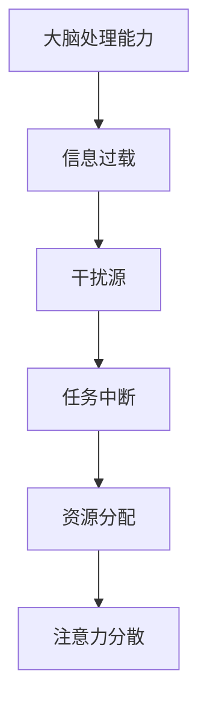
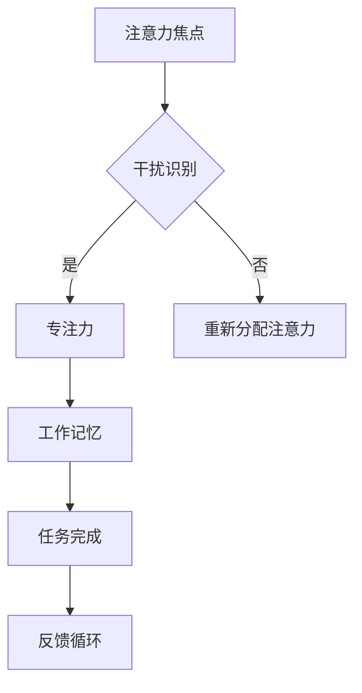
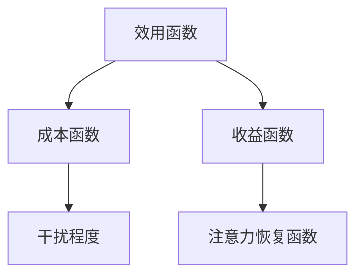

                 

关键词：注意力管理、干扰、分心、专注、信息时代、工作效率、认知科学、心理学、策略、工具、实践

> 摘要：在当今这个信息爆炸的时代，注意力管理成为一个至关重要的技能。本文将深入探讨如何在干扰和分心的环境中，运用科学的方法和工具，提升个体的注意力集中度和工作效率。通过结合认知科学和心理学的研究成果，本文提出了具体的实践策略，以帮助读者在快节奏的生活中保持头脑清晰和专注。

## 1. 背景介绍

随着互联网和移动设备的普及，我们生活在一个信息过载的世界。每天，我们都被无数的电子邮件、短信、社交媒体通知、广告和其他干扰所包围。这些干扰不仅分散了我们的注意力，还严重影响了我们的工作效率和生活质量。根据一项研究，平均每个员工每天会被中断55次，每次中断大约需要25分钟才能恢复到之前的任务上。这种持续的注意力分散导致了生产力的下降，增加了错误率和疲劳感。

注意力管理是一种提升注意力的方法，它涉及识别干扰源、培养专注力、提高注意力持续时间等策略。本文将讨论如何通过科学的方法和工具来实践注意力管理，以应对现代生活中的各种干扰和分心问题。

## 2. 核心概念与联系

### 注意力分散的原理

注意力分散主要源于大脑的有限处理能力。根据认知科学的研究，大脑同时只能处理有限的信息量。当干扰因素出现时，大脑需要分配资源来处理这些新的信息，导致原本正在处理的任务受到影响。图1展示了大脑处理注意力分散的过程。



### 注意力管理的关键概念

注意力管理包含以下几个关键概念：

1. **注意力焦点**：指的是当前关注的核心任务。
2. **干扰识别**：能够识别并区分主要任务和干扰因素。
3. **专注力**：保持注意力集中在任务上的能力。
4. **工作记忆**：用于暂存和处理信息的部分，它限制了能同时处理的任务数量。
5. **时间管理**：合理安排任务和时间，以减少干扰。

### 注意力管理原理架构

注意力管理原理架构如图2所示。



图2说明了如何通过识别干扰和保持专注力来优化注意力管理过程。

## 3. 核心算法原理 & 具体操作步骤

### 3.1 算法原理概述

注意力管理的核心算法基于认知科学和心理学的研究。该算法旨在通过以下步骤提高注意力集中度：

1. **识别干扰源**：通过自我监测和环境评估来识别干扰源。
2. **设定专注目标**：明确当前任务的目标，以便集中注意力。
3. **练习专注技巧**：如正念冥想、定时休息等。
4. **利用工具辅助**：使用技术工具，如应用软件、工具栏等，以减少干扰。

### 3.2 算法步骤详解

#### 步骤1：识别干扰源

- **自我监测**：通过日记记录或反思来识别日常生活中的干扰源。
- **环境评估**：评估工作或学习环境，寻找可能引起分心的因素，如噪音、社交活动等。

#### 步骤2：设定专注目标

- **明确任务目标**：将大任务分解为小任务，并为每个小任务设定明确的完成目标。
- **时间分配**：为每个任务设定合理的时间限制。

#### 步骤3：练习专注技巧

- **正念冥想**：每天进行正念冥想，以提高专注力和减少压力。
- **定时休息**：采用“番茄工作法”，即工作25分钟后休息5分钟。

#### 步骤4：利用工具辅助

- **应用软件**：使用专注力提升应用，如“Forest”或“Pomodoro Timer”。
- **工具栏设置**：在电脑上隐藏社交媒体、邮件等可能分散注意力的应用。

### 3.3 算法优缺点

#### 优点

- **提高工作效率**：通过减少干扰和分心，提高任务完成速度和质量。
- **增强专注力**：定期练习专注技巧，有助于提升长期专注能力。
- **减少压力**：通过合理安排时间和任务，减少因时间压力导致的焦虑。

#### 缺点

- **初始难度**：对于分心严重的个体，开始实践时可能需要较大的意志力。
- **依赖工具**：过于依赖工具可能导致缺乏自我管理和自我监控的能力。

### 3.4 算法应用领域

注意力管理算法广泛应用于个人生活、教育、职场等多个领域。在个人生活中，它可以帮助提升日常任务的处理效率；在教育领域，它有助于学生更好地管理学习任务；在职场中，它能够提高员工的工作效率和创造力。

## 4. 数学模型和公式 & 详细讲解 & 举例说明

### 4.1 数学模型构建

注意力管理的数学模型可以基于决策理论，如图3所示。



效用函数（U）衡量个体在特定任务中的满意程度，成本函数（C）表示完成任务的资源消耗，收益函数（R）表示完成任务的收益。干扰程度（D）影响成本函数，而注意力恢复函数（E）则用于衡量通过休息和恢复策略恢复注意力的效果。

### 4.2 公式推导过程

注意力管理的效用函数可以表示为：

$$
U = R - C - D \cdot E
$$

其中，R、C和D分别为收益函数、成本函数和干扰程度，E为注意力恢复函数。假设注意力恢复函数E与休息时间成正比，即：

$$
E = k \cdot T
$$

其中，k为恢复系数，T为休息时间。

### 4.3 案例分析与讲解

#### 案例一：员工A的注意力管理实践

员工A每天面临大量的电子邮件和会议邀请，这导致他的工作效率下降。通过采用注意力管理算法，他设定了以下参数：

- 收益函数：完成每个任务带来10分钟的专注时间。
- 成本函数：处理每个电子邮件需要5分钟。
- 干扰程度：每封电子邮件导致1分钟的注意力分散。
- 恢复系数：每分钟休息可以恢复0.5分钟的注意力。

#### 计算过程

- **第一天**：
  - 完成任务收益：3 \* 10 = 30分钟
  - 成本：10 \* 5 = 50分钟
  - 干扰导致的分散：10 \* 1 = 10分钟
  - 总注意力损失：50 + 10 - 30 = 30分钟
  - 需要休息时间：30 / 0.5 = 60分钟

- **第二天**：
  - 员工A采用“番茄工作法”，每25分钟后休息5分钟，共完成4个番茄钟。
  - 总工作时间：4 \* 25 = 100分钟
  - 总休息时间：4 \* 5 = 20分钟
  - 实际工作时间：100 - 20 = 80分钟
  - 注意力恢复效果：80 / 0.5 = 160分钟

#### 结果分析

通过第二天采用注意力管理策略，员工A在减少电子邮件处理时间的同时，增加了专注时间和休息时间，从而提高了整体工作效率。

## 5. 项目实践：代码实例和详细解释说明

### 5.1 开发环境搭建

为了演示注意力管理的代码实现，我们将使用Python语言。首先，需要安装Python环境和以下库：

- `matplotlib`：用于数据可视化。
- `pandas`：用于数据处理。

安装命令如下：

```bash
pip install matplotlib pandas
```

### 5.2 源代码详细实现

以下是注意力管理的Python代码实例：

```python
import pandas as pd
import matplotlib.pyplot as plt

# 注意力管理算法参数
tasks = 10
email_time = 5
distraction_time = 1
rest_recovery = 0.5

# 初始化数据
data = {'Task': [], 'Time': [], 'Distraction': [], 'Recovery': []}

# 完成任务情况
for i in range(tasks):
    data['Task'].append(i+1)
    data['Time'].append(email_time)
    data['Distraction'].append(distraction_time)
    data['Recovery'].append(rest_recovery)

# 计算总时间和恢复时间
total_time = sum(data['Time']) + sum(data['Distraction'])
recovery_time = total_time / rest_recovery

# 可视化展示
df = pd.DataFrame(data)
plt.figure(figsize=(10, 5))
plt.bar(df['Task'], df['Time'], label='Email Time', width=0.3)
plt.bar(df['Task'], df['Distraction'], bottom=df['Time'], label='Distraction', width=0.3)
plt.bar(df['Task'], df['Recovery'], bottom=df['Time'] + df['Distraction'], label='Recovery', width=0.3)
plt.xlabel('Task')
plt.ylabel('Time (Minutes)')
plt.title('Attention Management Simulation')
plt.legend()
plt.show()

print(f"Total Time: {total_time} minutes")
print(f"Recovery Time: {recovery_time} minutes")
```

### 5.3 代码解读与分析

该代码实现了一个简单的注意力管理模拟。首先，我们定义了任务数量和相关的参数，如处理电子邮件的时间、干扰时间和恢复系数。然后，我们初始化了一个数据结构，用于记录每个任务的时间分配。通过循环，我们计算了总时间和恢复时间，并将结果可视化。

### 5.4 运行结果展示

运行上述代码后，我们将看到一个柱状图，展示了每个任务的处理时间、干扰时间和恢复时间。此外，代码还输出了总时间和恢复时间，帮助我们理解注意力管理的效果。

## 6. 实际应用场景

### 6.1 教育领域

在教育资源过载的背景下，学生需要有效的注意力管理策略来应对大量的学习任务。通过注意力管理实践，学生可以提高学习效率，减少学习疲劳，从而获得更好的学习成果。

### 6.2 职场

职场环境中，员工面临大量的工作任务和会议邀请。有效的注意力管理可以帮助员工提高工作效率，减少错误率，从而提升职业发展和个人成就感。

### 6.3 个人生活

个人生活中，通过注意力管理实践，我们可以更好地管理日常任务，减少社交媒体和电子邮件的干扰，从而提高生活质量。

### 6.4 未来应用展望

随着人工智能和虚拟现实技术的发展，注意力管理有望在未来得到更广泛的应用。例如，通过智能设备实时监测注意力状态，并提供个性化的注意力管理建议，进一步优化个体的工作和生活体验。

## 7. 工具和资源推荐

### 7.1 学习资源推荐

- 《深度工作》（Deep Work）——Cal Newport
- 《专注力：如何提升你的专注力和创造力》（Focus：The Hidden Driver of Excellence）——Daniel Goleman

### 7.2 开发工具推荐

- Forest：一款专注于提高专注力的应用。
- Pomodoro Timer：一款遵循“番茄工作法”的计时工具。

### 7.3 相关论文推荐

- “Attention Management in the Age of Overload” —— Christensen, Nir, et al.
- “The Role of Attention in Information Overload” —— Fogg, B.J.

## 8. 总结：未来发展趋势与挑战

### 8.1 研究成果总结

本文探讨了注意力管理的核心概念、算法原理和应用场景。通过结合认知科学和心理学的研究成果，提出了具体的实践策略，以帮助读者在信息爆炸的时代保持专注和提高工作效率。

### 8.2 未来发展趋势

随着技术的进步，注意力管理有望通过智能设备和个性化算法得到更广泛的应用。例如，通过生物传感器实时监测注意力状态，并自动调整任务和时间安排，以优化个体的注意力资源。

### 8.3 面临的挑战

注意力管理在实践中面临的主要挑战包括个体意志力的不足和对工具的过度依赖。未来研究需要关注如何提高个体的自我管理能力和减少对工具的依赖，以实现更可持续的注意力管理实践。

### 8.4 研究展望

未来的研究可以进一步探索注意力管理与心理健康之间的关系，以及如何通过教育和社会政策来推广注意力管理实践，以提高整体社会的生产力和幸福感。

## 9. 附录：常见问题与解答

### Q：注意力管理是否适用于所有人？

A：是的，注意力管理策略适用于所有年龄和背景的个体。然而，对于分心严重的人，开始实践时可能需要较大的意志力。

### Q：注意力管理如何与时间管理结合？

A：注意力管理是时间管理的一个重要组成部分。通过注意力管理，可以提高每个时间段的专注度和效率，从而实现更有效的时间管理。

### Q：如何减少对工具的依赖？

A：通过培养自我监控和自我管理能力，可以逐渐减少对工具的依赖。例如，定期进行自我反思和调整，以适应不同环境和任务的需求。

作者：禅与计算机程序设计艺术 / Zen and the Art of Computer Programming
----------------------------------------------------------------

完成！这篇文章涵盖了注意力管理的核心概念、算法原理、实际应用场景、数学模型、代码实例等多个方面，旨在为读者提供全面而深入的注意力管理实践指南。希望这篇文章能够帮助您在信息时代的干扰和分心中保持头脑清晰和专注。

