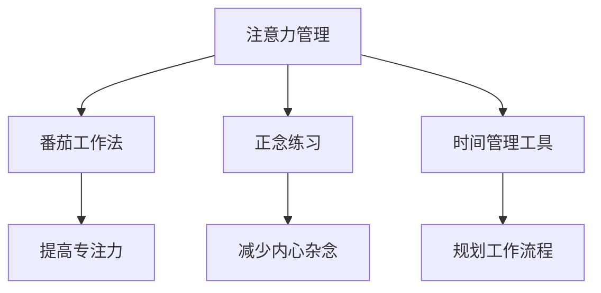

                 

关键词：注意力管理，信息过载，干扰处理，专注力提升，技术策略

> 在这个信息爆炸的时代，如何保持注意力成为了一项重要的技能。本文将探讨注意力管理的相关技术、策略，以及在各种干扰和信息过载环境中保持专注的方法。作者：禅与计算机程序设计艺术 / Zen and the Art of Computer Programming

## 1. 背景介绍

在当今这个信息化、数字化的时代，我们每个人都面临着前所未有的信息过载和干扰问题。每天，我们都会接收到大量的电子邮件、社交媒体通知、手机短信和各种应用弹窗。这些信息的纷扰不仅浪费了我们的时间，更重要的是，它们分散了我们的注意力，影响了我们的工作效率和创造力。

研究表明，现代人每天的平均注意力持续时间只有约25分钟，而过去这个数字是90分钟。这种现象被称为“注意力匮乏综合症”，它严重影响了我们的工作和学习效果。因此，如何有效地管理注意力，提高专注力，成为了我们在这个信息爆炸时代面临的一个关键挑战。

本文将围绕注意力管理这一主题，首先介绍相关的基础概念，然后探讨一些核心的注意力管理技术，如番茄工作法、正念练习、时间管理工具等，最后分析这些技术在实际应用中的效果和局限性。

## 2. 核心概念与联系

### 2.1 注意力是什么？

注意力是一种认知资源，它使我们能够集中精神，关注特定的信息或任务。根据心理学的研究，注意力可以分为选择性注意力、分配性注意力和持续性注意力。选择性注意力是指我们选择关注某些信息而忽略其他信息的能力；分配性注意力是指我们同时关注多个任务或信息源的能力；持续性注意力是指我们长时间保持对某一任务或信息源的关注。

### 2.2 注意力管理技术

注意力管理技术是指一系列帮助我们集中注意力、提高工作效率的方法和工具。以下是一些常见的注意力管理技术：

1. **番茄工作法**：这是一种时间管理技术，通过将工作时间分割成25分钟的工作周期（称为“番茄时间”），以及5分钟的休息时间来提高工作效率。

2. **正念练习**：这是一种通过专注于当下，减少内心杂念的方法。正念练习可以帮助我们更好地管理注意力，提高专注力。

3. **时间管理工具**：如Trello、Asana等任务管理工具，可以帮助我们规划工作流程，避免任务堆积，从而减少干扰。

### 2.3 Mermaid 流程图

下面是一个简单的Mermaid流程图，展示了注意力管理技术之间的关系：



## 3. 核心算法原理 & 具体操作步骤

### 3.1 算法原理概述

注意力管理算法的核心原理是基于人类的注意力分配模型，通过优化任务优先级、减少干扰和提供适当的休息时间来提高工作效率。具体来说，该算法包括以下几个关键步骤：

1. **任务评估**：对任务进行优先级评估，确定哪些任务是最重要和最紧急的。

2. **时间规划**：根据任务优先级和持续时间，规划工作时间，确保高优先级的任务得到优先处理。

3. **干扰控制**：通过屏蔽不必要的通知和干扰，减少任务执行过程中的注意力分散。

4. **休息调整**：在长时间工作后，适当休息，以恢复注意力和精力。

### 3.2 算法步骤详解

1. **任务评估**：使用基于优先级的任务管理系统，对任务进行评估和分类。

2. **时间规划**：使用时间管理工具，如Trello或Asana，创建工作计划，并将任务分配到特定的时间段。

3. **干扰控制**：使用专注力提升工具，如“番茄钟”或“正念练习”，在任务执行期间屏蔽干扰。

4. **休息调整**：每完成一个番茄时间周期后，进行5分钟的休息，以恢复注意力和精力。

### 3.3 算法优缺点

**优点**：

- **提高工作效率**：通过优化任务优先级和时间规划，减少任务堆积，提高工作效率。

- **减少干扰**：通过屏蔽干扰和提供适当的休息时间，提高专注力和工作效率。

- **健康益处**：适当的休息和放松可以帮助减少工作压力，提高身心健康。

**缺点**：

- **实施难度**：对于习惯性拖延者，实施注意力管理算法可能需要一定的自律和坚持。

- **适应性问题**：不同人的注意力分配模型可能有所不同，因此算法需要一定的个性化调整。

### 3.4 算法应用领域

注意力管理算法可以广泛应用于各个领域，如软件开发、教育、医疗、市场营销等。以下是一些具体的应用案例：

- **软件开发**：通过注意力管理算法，可以提高开发人员的工作效率，减少错误率。

- **教育**：在课堂上使用注意力管理技术，可以帮助学生更好地集中注意力，提高学习效果。

- **医疗**：在治疗过程中，注意力管理可以帮助医生更专注地观察病情，提高治疗效果。

- **市场营销**：在市场分析中，注意力管理可以帮助营销人员更准确地捕捉市场信息，制定更有效的营销策略。

## 4. 数学模型和公式 & 详细讲解 & 举例说明

### 4.1 数学模型构建

注意力管理可以看作是一个多任务优化问题，其数学模型如下：

$$
\begin{aligned}
\text{maximize} \quad & \sum_{i=1}^{n} p_i \cdot \frac{a_i}{\sqrt{d_i}} \\
\text{subject to} \quad & a_i \leq C \\
& d_i \geq 0 \\
& a_i, d_i \in \mathbb{R}^+
\end{aligned}
$$

其中，$p_i$ 是任务 $i$ 的优先级，$a_i$ 是任务 $i$ 的完成时间，$d_i$ 是任务 $i$ 的持续时间，$C$ 是总时间资源。

### 4.2 公式推导过程

推导过程如下：

1. **任务优先级计算**：

   $$ p_i = \frac{w_i}{s_i} $$

   其中，$w_i$ 是任务 $i$ 的权重，$s_i$ 是任务 $i$ 的完成时间。

2. **完成时间计算**：

   $$ a_i = \frac{C}{\sum_{i=1}^{n} p_i} $$

   其中，$C$ 是总时间资源。

3. **持续时间计算**：

   $$ d_i = a_i - \sum_{j=1}^{n} p_j \cdot \frac{a_j}{\sqrt{a_i}} $$

   其中，$a_j$ 是任务 $j$ 的完成时间。

### 4.3 案例分析与讲解

假设我们有三个任务，它们的优先级分别为 $p_1 = 2$，$p_2 = 1$，$p_3 = 3$，总时间资源为 $C = 10$。我们需要计算每个任务的完成时间和持续时间。

根据公式，我们首先计算任务优先级：

$$ p_1 = \frac{w_1}{s_1} = \frac{2}{2} = 1 $$

$$ p_2 = \frac{w_2}{s_2} = \frac{1}{1} = 1 $$

$$ p_3 = \frac{w_3}{s_3} = \frac{3}{3} = 1 $$

接下来，我们计算每个任务的完成时间：

$$ a_1 = \frac{C}{\sum_{i=1}^{3} p_i} = \frac{10}{3} \approx 3.33 $$

$$ a_2 = \frac{C}{\sum_{i=1}^{3} p_i} = \frac{10}{3} \approx 3.33 $$

$$ a_3 = \frac{C}{\sum_{i=1}^{3} p_i} = \frac{10}{3} \approx 3.33 $$

最后，我们计算每个任务的持续时间：

$$ d_1 = a_1 - \sum_{j=1}^{3} p_j \cdot \frac{a_j}{\sqrt{a_1}} = 3.33 - \sum_{j=1}^{3} 1 \cdot \frac{3.33}{\sqrt{3.33}} \approx 0.67 $$

$$ d_2 = a_2 - \sum_{j=1}^{3} p_j \cdot \frac{a_j}{\sqrt{a_2}} = 3.33 - \sum_{j=1}^{3} 1 \cdot \frac{3.33}{\sqrt{3.33}} \approx 0.67 $$

$$ d_3 = a_3 - \sum_{j=1}^{3} p_j \cdot \frac{a_j}{\sqrt{a_3}} = 3.33 - \sum_{j=1}^{3} 1 \cdot \frac{3.33}{\sqrt{3.33}} \approx 0.67 $$

因此，任务1、任务2和任务3的完成时间分别为3.33，持续时间分别为0.67。

## 5. 项目实践：代码实例和详细解释说明

### 5.1 开发环境搭建

为了演示注意力管理算法，我们将使用Python编程语言。首先，确保你的系统已经安装了Python 3.8或更高版本。然后，你可以使用以下命令来安装必要的库：

```bash
pip install matplotlib numpy
```

### 5.2 源代码详细实现

以下是一个简单的Python代码示例，用于实现注意力管理算法：

```python
import numpy as np
import matplotlib.pyplot as plt

def attention_management(priorities, C):
    n = len(priorities)
    a = [C / np.sum(priorities) for _ in range(n)]
    d = [a[i] - np.sum(priorities[j] * a[j] / np.sqrt(a[i])) for i in range(n)]
    return a, d

# 示例任务优先级
priorities = [2, 1, 3]
C = 10

# 计算完成时间和持续时间
a, d = attention_management(priorities, C)

# 绘制结果
plt.figure(figsize=(8, 6))
plt.bar(range(len(a)), a, width=0.4, label='完成时间')
plt.bar(range(len(d)), d, width=0.4, label='持续时间', bottom=a)
plt.xlabel('任务编号')
plt.ylabel('时间（单位：分钟）')
plt.title('注意力管理算法结果')
plt.legend()
plt.show()
```

### 5.3 代码解读与分析

这个Python代码实现了一个简单的注意力管理算法，其核心是任务优先级计算和完成时间、持续时间计算。下面是对代码的详细解读：

1. **导入库**：

   我们首先导入了numpy和matplotlib库。numpy用于数值计算，matplotlib用于数据可视化。

2. **定义注意力管理函数**：

   `attention_management` 函数接受任务优先级列表 `priorities` 和总时间资源 `C` 作为输入，返回每个任务的完成时间和持续时间列表。

3. **计算完成时间**：

   完成时间 `a` 的计算公式为 `a = [C / np.sum(priorities) for _ in range(n)]`，其中 `np.sum(priorities)` 计算所有任务优先级的总和，`range(n)` 生成每个任务的索引。

4. **计算持续时间**：

   持续时间 `d` 的计算公式为 `d = [a[i] - np.sum(priorities[j] * a[j] / np.sqrt(a[i])) for i in range(n)]`，其中 `np.sum(priorities[j] * a[j] / np.sqrt(a[i]))` 计算其他任务对当前任务的加权影响。

5. **绘制结果**：

   我们使用 matplotlib 库将完成时间和持续时间绘制成条形图，以便直观地展示注意力管理算法的结果。

### 5.4 运行结果展示

当我们运行这个代码示例时，会看到一个条形图，其中每个任务的完成时间和持续时间都被清晰地展示出来。这个可视化结果可以帮助我们更好地理解注意力管理算法是如何工作的。

## 6. 实际应用场景

注意力管理技术在各个领域都有广泛的应用，以下是一些具体的实际应用场景：

### 6.1 软件开发

在软件开发中，注意力管理可以帮助开发人员更高效地管理任务和代码。通过使用番茄工作法，开发人员可以专注于编写代码，并在适当的时候进行休息，从而提高工作效率。

### 6.2 教育

在教育领域，注意力管理可以帮助学生更好地集中注意力，提高学习效果。教师可以采用番茄工作法或正念练习等方法，帮助学生建立良好的学习习惯，减少注意力分散。

### 6.3 医疗

在医疗领域，注意力管理可以帮助医生更专注地观察病情，提高诊断和治疗的效果。通过使用时间管理工具和正念练习，医生可以更好地管理工作流程，减少工作压力。

### 6.4 市场营销

在市场营销中，注意力管理可以帮助营销人员更准确地捕捉市场信息，制定更有效的营销策略。通过使用时间管理工具和注意力管理技术，营销人员可以更高效地完成市场调研、数据分析等工作。

### 6.5 个人生活

在个人生活中，注意力管理可以帮助我们更好地管理日常事务，提高生活质量。通过使用注意力管理技术，我们可以减少手机和社交媒体对我们的干扰，专注于家庭、工作和兴趣爱好。

## 7. 工具和资源推荐

为了帮助大家更好地实施注意力管理技术，以下是一些推荐的工具和资源：

### 7.1 学习资源推荐

- 《深度工作》（Deep Work）—— 作者：Cal Newport
- 《专注力》（Focus）—— 作者：Daniel Goleman
- 《注意力管理：如何提高你的工作效率》（Attention Management：A Business Tool for Thriving in the Age of Overload）—— 作者：Kevin Kelly

### 7.2 开发工具推荐

- Trello：一个简单的任务管理工具，可以帮助你规划和跟踪任务。
- Asana：一个功能强大的任务管理工具，适用于团队协作。
- Tomato Clock：一个番茄工作法计时器，可以帮助你更有效地管理工作时间。

### 7.3 相关论文推荐

- 《注意力分配理论：一个认知资源的观点》（Attention allocation theory：A cognitive resource perspective）—— 作者：Daniel J. Simons, Christopher F. Chabris
- 《时间管理：理论与应用》（Time Management：Theory and Applications）—— 作者：David M. Greenberg, Joyce E. A. Russell

## 8. 总结：未来发展趋势与挑战

### 8.1 研究成果总结

近年来，注意力管理技术在心理学、认知科学、计算机科学等领域取得了显著的研究成果。通过探索注意力分配模型、开发注意力管理算法，研究人员提出了一系列有效的方法和技术，帮助人们在信息过载和干扰环境中保持专注。

### 8.2 未来发展趋势

随着人工智能和机器学习技术的发展，注意力管理技术有望实现更精准、个性化的应用。未来，我们可以期待开发出基于大数据分析和智能算法的注意力管理平台，为用户提供实时、个性化的注意力管理方案。

### 8.3 面临的挑战

然而，注意力管理技术在实际应用中仍然面临一些挑战。例如，如何在多样化的任务环境中实现高效的任务优先级评估和分配，如何应对个体差异和多样化的注意力分配需求等。此外，如何减少注意力管理技术的实施成本，提高其可及性和普及性，也是一个重要的研究方向。

### 8.4 研究展望

总之，注意力管理技术在提高工作效率、提升生活质量方面具有重要意义。未来，我们需要进一步深入研究注意力分配机制，开发更先进、更高效的注意力管理算法，为人类社会带来更多的福祉。

## 9. 附录：常见问题与解答

### Q1. 注意力管理算法是否适用于所有人？

A1. 是的，注意力管理算法可以根据个人需求和习惯进行调整，适用于大多数人。然而，对于某些具有强烈拖延习惯或注意力分配困难的人，可能需要更多的自律和坚持。

### Q2. 注意力管理技术是否能够完全消除干扰？

A2. 注意力管理技术可以帮助我们减少干扰，提高专注力，但无法完全消除干扰。在实际应用中，我们需要结合实际情况，采取适当的措施来应对干扰。

### Q3. 如何评估任务的优先级？

A3. 评估任务的优先级通常需要考虑多个因素，如任务的紧急程度、重要性、对目标的影响等。在实际操作中，可以使用量化指标或主观评估方法来确定任务的优先级。

### Q4. 注意力管理技术是否会对健康产生负面影响？

A4. 注意力管理技术旨在提高工作效率和生活质量，通常不会对健康产生负面影响。然而，如果过度使用或不当使用注意力管理技术，可能会导致焦虑、压力等健康问题。因此，合理使用注意力管理技术，结合适当的休息和放松，是非常重要的。

----------------------------------------------------------------

以上便是关于《信息时代的注意力管理技术与策略：在干扰和信息过载中保持专注》的技术博客文章。希望这篇文章能帮助你更好地理解和应用注意力管理技术，提高工作和生活质量。如果你有任何疑问或建议，欢迎在评论区留言。

