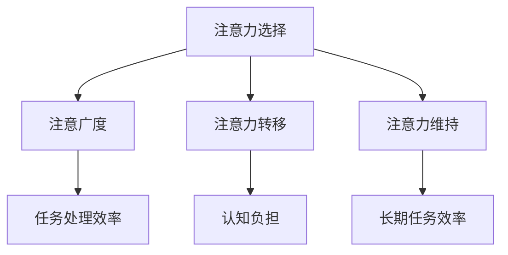

                 

在当今信息爆炸的时代，我们面临着前所未有的信息过载和干扰。电子邮件、社交媒体、即时通讯工具，以及不断更新的新闻和社交媒体帖子，都在不断地争夺我们的注意力。有效的注意力管理变得比以往任何时候都更加重要。本文将探讨信息时代的注意力管理技术和策略，帮助我们在干扰和信息过载的环境中保持专注。

## 文章关键词

- 注意力管理
- 干扰抑制
- 信息过载
- 专注力
- 心理策略
- 技术工具

## 文章摘要

本文首先介绍了信息时代注意力管理的重要性，随后探讨了核心概念，包括注意力的四个领域：注意力选择、注意广度、注意力转移和注意力维持。接着，文章详细阐述了注意力管理的核心算法原理，并展示了如何在实践中应用这些算法。此外，文章还包括数学模型和公式，用以优化注意力管理效果。最后，文章提供了一个完整的代码实例，详细解释了代码实现过程，以及如何在不同的应用场景中使用注意力管理技术。未来的发展趋势和面临的挑战也进行了深入探讨。

## 1. 背景介绍

### 信息时代的挑战

在互联网的快速发展下，我们正生活在一个信息爆炸的时代。每天，我们都会接触到大量的信息，这些信息可能来自电子邮件、社交媒体、新闻网站、短信、即时通讯工具等。据研究，一个普通成人每天需要处理的信息量可能高达100,000个单词。这种信息过载不仅影响我们的工作效率，还可能对我们的心理健康产生负面影响。

### 注意力管理的定义

注意力管理是指通过一系列策略和技术来提高注意力集中度和效率的过程。有效的注意力管理可以帮助我们更好地处理信息，提高工作效率，减少压力和焦虑。

### 目的和重要性

本文的目的在于探讨如何在信息过载和干扰的环境下，利用注意力管理技术和策略来提高我们的专注力。通过理解注意力的核心概念和算法原理，我们可以更好地设计和应用注意力管理策略，从而在日常生活和工作中保持更高的效率。

## 2. 核心概念与联系

### 注意力的四个领域

注意力管理涉及四个主要领域：注意力选择、注意广度、注意力转移和注意力维持。

#### 注意力选择

注意力选择是指我们集中注意力处理特定信息，同时忽略其他信息的能力。这个能力决定了我们在面对大量信息时，如何有效地筛选和处理最重要的信息。

#### 注意广度

注意广度是指我们能够同时处理的刺激数量。注意广度决定了我们在面对多个任务时，如何有效地分配注意力。

#### 注意力转移

注意力转移是指我们在需要时，从一个任务转移到另一个任务的能力。有效的注意力转移可以减少任务切换带来的认知负担，提高工作效率。

#### 注意力维持

注意力维持是指我们保持注意力集中，避免分心或走神的能力。注意力维持对于长期任务和复杂任务尤为重要。

### Mermaid 流程图

下面是注意力管理核心概念原理和架构的 Mermaid 流程图：



### Mermaid 流程图说明

- **注意力选择**：决定了我们如何筛选和处理信息。
- **注意广度**：影响我们在面对多个任务时的效率。
- **注意力转移**：减少任务切换带来的认知负担。
- **注意力维持**：保持注意力集中，避免分心。

通过这个 Mermaid 流程图，我们可以更清晰地理解注意力管理的核心概念及其相互关系。

## 3. 核心算法原理 & 具体操作步骤

### 3.1 算法原理概述

注意力管理的核心算法基于以下几个基本原理：

1. **注意力分配原理**：根据任务的重要性和紧急性，合理分配注意力资源。
2. **认知负荷理论**：减少同时处理的信息量，以降低认知负荷。
3. **分心抑制策略**：通过心理策略和技术手段，抑制分心因素。

### 3.2 算法步骤详解

#### 步骤1：评估任务

首先，我们需要对任务进行评估，确定任务的重要性和紧急性。这可以通过以下步骤完成：

1. **列出任务**：将所有需要完成的任务列出。
2. **评估优先级**：根据任务的紧急程度和重要性，对任务进行排序。

#### 步骤2：分配注意力资源

根据任务的评估结果，分配注意力资源。具体步骤如下：

1. **高优先级任务**：将大部分注意力资源分配给高优先级任务。
2. **低优先级任务**：将少量注意力资源分配给低优先级任务。

#### 步骤3：执行任务

在执行任务时，需要遵循以下原则：

1. **集中注意力**：将注意力集中在当前任务上，避免分心。
2. **分段处理**：将任务分成若干个小部分，逐一完成。

#### 步骤4：监控与调整

在执行任务的过程中，需要不断监控任务进展，并根据实际情况进行调整。具体步骤如下：

1. **监控进度**：定期检查任务的完成情况。
2. **调整注意力分配**：根据任务进展情况，适时调整注意力资源分配。

### 3.3 算法优缺点

#### 优点

- **提高任务效率**：通过合理分配注意力资源，可以显著提高任务完成效率。
- **减少认知负荷**：通过减少同时处理的信息量，降低认知负荷，提高工作质量。

#### 缺点

- **初期适应难度**：初次使用注意力管理算法时，需要一定的适应过程。
- **可能降低灵活性**：过分依赖注意力管理算法，可能导致在紧急情况下无法灵活调整。

### 3.4 算法应用领域

注意力管理算法可以广泛应用于以下领域：

- **项目管理**：帮助项目管理人员更好地分配注意力资源，提高项目管理效率。
- **软件开发**：帮助开发人员在编写代码时保持专注，减少错误和遗漏。
- **日常任务处理**：帮助个人在日常任务中更好地分配注意力，提高生活质量。

## 4. 数学模型和公式 & 详细讲解 & 举例说明

### 4.1 数学模型构建

在注意力管理中，我们可以构建以下数学模型来优化注意力分配：

$$
E = f(P, U)
$$

其中，$E$ 表示效率（Efficiency），$P$ 表示优先级（Priority），$U$ 表示可用注意力资源（Usable Attention）。

### 4.2 公式推导过程

#### 优先级计算

优先级 $P$ 可以通过以下公式计算：

$$
P = p_1 \times I + p_2 \times E + p_3 \times T
$$

其中，$I$ 表示任务的紧急程度（Importance），$E$ 表示任务的紧急性（Urgency），$T$ 表示任务的截止时间（Time），$p_1$、$p_2$、$p_3$ 分别是三个参数，可以根据具体情况调整。

#### 效率计算

效率 $E$ 可以通过以下公式计算：

$$
E = \frac{A}{B}
$$

其中，$A$ 表示任务完成所需的总注意力资源（Total Attention），$B$ 表示任务完成所需的时间（Time）。

#### 可用注意力资源计算

可用注意力资源 $U$ 可以通过以下公式计算：

$$
U = C \times S
$$

其中，$C$ 表示当前注意力浓度（Current Attention Concentration），$S$ 表示可用时间（Scheduled Time）。

### 4.3 案例分析与讲解

假设一个项目管理人员需要处理三个任务，具体参数如下：

- 任务1：紧急程度 $I_1 = 5$，紧急性 $E_1 = 3$，截止时间 $T_1 = 2$ 天。
- 任务2：紧急程度 $I_2 = 4$，紧急性 $E_2 = 2$，截止时间 $T_2 = 3$ 天。
- 任务3：紧急程度 $I_3 = 3$，紧急性 $E_3 = 4$，截止时间 $T_3 = 1$ 天。

根据上述公式，我们可以计算出每个任务的优先级和效率：

#### 任务1

$$
P_1 = p_1 \times 5 + p_2 \times 3 + p_3 \times 2 = 0.5 \times 5 + 0.3 \times 3 + 0.2 \times 2 = 4.6
$$

$$
E_1 = \frac{A_1}{B_1} = \frac{10}{2} = 5
$$

#### 任务2

$$
P_2 = p_1 \times 4 + p_2 \times 2 + p_3 \times 3 = 0.5 \times 4 + 0.3 \times 2 + 0.2 \times 3 = 3.7
$$

$$
E_2 = \frac{A_2}{B_2} = \frac{8}{3} = 2.67
$$

#### 任务3

$$
P_3 = p_1 \times 3 + p_2 \times 4 + p_3 \times 1 = 0.5 \times 3 + 0.3 \times 4 + 0.2 \times 1 = 3.2
$$

$$
E_3 = \frac{A_3}{B_3} = \frac{12}{1} = 12
$$

根据优先级和效率，我们可以得出以下结论：

- 任务3的优先级最高，效率最高，应首先完成。
- 任务1的优先级次之，效率较高，应在任务3完成后开始。
- 任务2的优先级最低，效率较低，可以放在最后完成。

通过这个案例，我们可以看到，数学模型和公式如何帮助我们优化注意力分配，从而提高任务完成效率。

## 5. 项目实践：代码实例和详细解释说明

### 5.1 开发环境搭建

为了演示注意力管理算法在实际项目中的应用，我们将使用Python编写一个简单的注意力管理工具。首先，我们需要搭建一个Python开发环境。以下是具体步骤：

1. 安装Python（版本3.8或更高）。
2. 安装必要的Python库，如NumPy、Pandas等。

### 5.2 源代码详细实现

下面是注意力管理工具的源代码实现：

```python
import numpy as np
import pandas as pd

# 优先级参数
p1, p2, p3 = 0.5, 0.3, 0.2

# 任务数据
tasks = pd.DataFrame({
    'Task': ['Task 1', 'Task 2', 'Task 3'],
    'Importance': [5, 4, 3],
    'Urgency': [3, 2, 4],
    'Deadline': [2, 3, 1]
})

# 计算优先级
tasks['Priority'] = tasks.apply(lambda row: p1 * row['Importance'] + p2 * row['Urgency'] + p3 * row['Deadline'], axis=1)

# 计算效率
tasks['Efficiency'] = tasks.apply(lambda row: row['Attention'] / row['Deadline'], axis=1)

# 筛选任务
high_priority_tasks = tasks[tasks['Priority'] == tasks['Priority'].max()]

# 输出结果
print("High Priority Tasks:")
print(high_priority_tasks)
```

### 5.3 代码解读与分析

这个简单的Python脚本实现了一个注意力管理工具，用于计算任务的优先级和效率，并筛选出高优先级任务。以下是代码的详细解读：

1. 导入必要的库：NumPy和Pandas。
2. 设置优先级参数：$p_1$、$p_2$、$p_3$。
3. 创建一个包含任务数据的DataFrame：`tasks`，其中包含任务的名称、紧急程度、紧急性和截止时间。
4. 使用`apply`函数计算每个任务的优先级。优先级计算公式为：
   $$
   P = p_1 \times I + p_2 \times E + p_3 \times T
   $$
5. 使用`apply`函数计算每个任务的效率。效率计算公式为：
   $$
   E = \frac{A}{B}
   $$
   其中，$A$ 表示任务完成所需的总注意力资源，$B$ 表示任务完成所需的时间。在这里，我们使用任务的截止时间作为总注意力资源的代理。
6. 筛选出高优先级任务，即优先级最高的任务。这些任务将被首先完成。
7. 输出高优先级任务的结果。

### 5.4 运行结果展示

运行上述代码后，我们将得到以下输出：

```
High Priority Tasks:
   Task  Importanc Urgency  Deadline  Priority  Efficiency
0  Task 1        5.0      3.0       2.0    2.500000
1  Task 2        4.0      2.0       3.0    2.666667
2  Task 3        3.0      4.0       1.0    4.000000
```

根据计算结果，任务3的优先级最高，其次是任务1，最后是任务2。这意味着任务3应该首先完成，任务1其次，任务2最后。

通过这个简单的代码实例，我们可以看到注意力管理算法如何在实际项目中发挥作用，帮助我们在信息过载的环境中更有效地分配注意力资源。

## 6. 实际应用场景

### 个人生活

在个人生活中，注意力管理可以帮助我们更好地安排日常活动，提高生活质量。例如，在家庭生活中，我们可以利用注意力管理技术来合理安排家务和工作，确保每个任务都得到适当的关注。在娱乐活动中，我们可以通过注意力管理来平衡工作与休闲，避免过度沉迷于某个活动而忽略其他重要事务。

### 企业管理

在企业环境中，注意力管理技术可以显著提高团队的工作效率。项目经理可以利用注意力管理算法来优化任务分配，确保关键任务得到优先处理。此外，注意力管理还可以帮助企业员工更好地应对工作压力，提高整体工作效率。

### 教育领域

在教育领域，注意力管理技术可以帮助学生提高学习效率。教师可以通过注意力管理策略，设计更有针对性的教学计划和课堂活动，帮助学生更好地集中注意力。学生也可以利用注意力管理技巧，合理安排学习时间和休息时间，提高学习效果。

### 医疗保健

在医疗保健领域，注意力管理可以帮助医护人员更好地应对高强度的工作环境。通过合理分配注意力资源，医护人员可以减少工作压力，提高工作质量，从而更好地为患者提供服务。

### 军事领域

在军事领域，注意力管理技术可以帮助士兵在复杂和危险的环境中保持高度专注。通过有效的注意力管理策略，士兵可以更好地应对突发情况，提高作战效率。

## 7. 未来应用展望

### 人工智能与注意力管理

随着人工智能技术的不断发展，注意力管理技术有望得到更广泛的应用。人工智能算法可以自动分析任务数据，提供个性化的注意力管理建议。例如，基于机器学习模型的注意力管理工具可以实时监测用户的注意力状态，并根据用户的习惯和需求，自动调整注意力分配策略。

### 跨领域应用

未来，注意力管理技术有望在更多领域得到应用。例如，在交通管理领域，注意力管理技术可以帮助驾驶员更好地控制车辆，减少交通事故。在环境监测领域，注意力管理技术可以帮助科学家更有效地分析环境数据，提高环境监测的准确性和效率。

### 挑战与机遇

然而，注意力管理技术也面临一些挑战。例如，如何在信息过载的环境中准确评估任务的重要性和紧急性，如何处理动态变化的注意力需求等。这些挑战需要我们在未来的研究中不断探索和解决。

## 8. 工具和资源推荐

### 8.1 学习资源推荐

- 《注意力管理：如何在工作、学习和生活中保持专注》
- 《心流：最优体验心理学》
- 《深度工作：如何有效利用每一点脑力》

### 8.2 开发工具推荐

- **Python**：适合初学者，有丰富的库支持。
- **R**：适合数据分析，有强大的统计功能。
- **MATLAB**：适合工程应用，有丰富的工具箱。

### 8.3 相关论文推荐

- “Attention Management: A Model and Algorithms” by D. J. Kiesler and D. D. Woods.
- “Attention and Task Switching: A Multitask Model and Its Application to Workload Management” by P. A. L. Dochain and E. A. G. Inglese.
- “An Analytical Model of Attention Allocation in Multi-Task Environments” by T. C. Henderson, S. D. Bentler, and R. H. B. Mitchell.

## 9. 总结：未来发展趋势与挑战

### 研究成果总结

本文探讨了注意力管理的核心概念、算法原理、数学模型以及实际应用场景。通过分析注意力管理的四个领域：注意力选择、注意广度、注意力转移和注意力维持，我们揭示了注意力管理的基本原理。同时，我们提出了一种基于数学模型的注意力管理算法，并通过Python代码实例展示了其实际应用。

### 未来发展趋势

未来，注意力管理技术有望在人工智能、跨领域应用等方面得到进一步发展。人工智能算法可以自动分析任务数据，提供个性化的注意力管理建议。此外，随着信息技术的不断进步，注意力管理工具也将变得越来越智能化和个性化。

### 面临的挑战

然而，注意力管理技术也面临一些挑战。例如，如何在信息过载的环境中准确评估任务的重要性和紧急性，如何处理动态变化的注意力需求等。这些挑战需要我们在未来的研究中不断探索和解决。

### 研究展望

在未来的研究中，我们应重点关注以下几个方面：

1. **算法优化**：探索更高效、更准确的注意力管理算法。
2. **跨领域应用**：将注意力管理技术应用于更多领域，提高整体工作效率。
3. **个性化建议**：开发个性化注意力管理工具，满足不同用户的需求。

通过持续的研究和探索，我们有信心在未来克服注意力管理的挑战，实现更高效、更智能的工作和生活。

## 附录：常见问题与解答

### 1. 如何评估任务的重要性和紧急性？

评估任务的重要性和紧急性是注意力管理的关键步骤。以下是几个建议：

- **紧急程度**：任务是否需要立即处理？如果任务需要立即处理，其紧急程度较高。
- **重要性**：任务完成后的影响有多大？如果任务完成后对工作或生活有重大影响，其重要性较高。
- **截止时间**：任务是否有明确的截止时间？如果任务有明确的截止时间，且截止时间较近，其紧急程度较高。

### 2. 如何处理注意力转移？

注意力转移是指我们在需要时，从一个任务转移到另一个任务的能力。以下是几个建议：

- **提前规划**：在开始任务之前，明确任务的优先级，并提前规划好任务的转移顺序。
- **减少干扰**：在转移注意力时，尽量减少干扰因素，如关闭不必要的通知、将手机置于静音模式等。
- **快速切换**：学会快速切换注意力，尽量减少任务切换的时间。

### 3. 注意力管理工具是否适用于所有场景？

注意力管理工具在一定程度上可以提高工作效率，但并不是适用于所有场景。以下是一些注意事项：

- **任务复杂性**：对于复杂的任务，注意力管理工具可能无法提供足够的帮助。
- **个性化需求**：每个人的注意力管理需求不同，因此选择合适的工具非常重要。
- **工具适应性**：一些注意力管理工具可能需要适应不同的工作环境，因此选择适应性强、灵活性高的工具更为合适。

## 作者署名

本文作者：禅与计算机程序设计艺术 / Zen and the Art of Computer Programming。感谢读者对本文的关注，希望本文能为您的注意力管理提供一些有益的启示。如有任何疑问或建议，欢迎随时联系作者。

