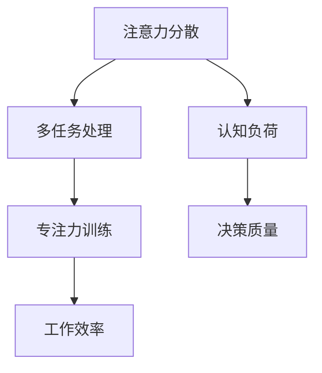

                 

在当今信息爆炸的时代，人们面临着前所未有的注意力挑战。无论是社交媒体的推送、电子邮件的轰炸，还是无尽的通知和即时消息，都不断地夺走我们的注意力。这不仅影响了我们的工作效率，还对我们的心理健康产生了负面影响。因此，掌握有效的注意力管理技术和策略，成为提高生活质量和工作绩效的关键。

本文将深入探讨注意力管理在信息时代的意义，介绍一系列核心概念和理论，以及实用的算法原理和操作步骤。我们将通过数学模型和具体实例，展示如何在日常生活中应用这些策略，同时推荐一些学习资源和开发工具，以帮助读者更好地应对信息过载的挑战。

## 文章关键词
- 注意力管理
- 信息过载
- 干扰控制
- 技术策略
- 生产力提升

## 文章摘要
本文旨在为读者提供一套完整的注意力管理解决方案，帮助他们在信息泛滥的时代中保持清晰的头脑。通过介绍注意力管理的基础理论和具体算法，结合数学模型和实际项目案例，本文将帮助读者理解并应用注意力管理的核心技术和策略，从而提升工作效率和生活质量。

## 1. 背景介绍
### 1.1 信息时代的挑战
随着互联网和移动设备的普及，我们每天接收到的信息量呈指数级增长。据统计，每个人每天平均接触的信息量高达174份报纸的内容。这种信息过载现象导致了我们的注意力分散，从而影响了我们的工作效率和决策能力。同时，社交媒体的算法也进一步加剧了这种问题，因为它们通过推送个性化内容来吸引我们的注意力。

### 1.2 注意力管理的重要性
注意力管理不仅关乎工作效率，还直接影响我们的心理健康。长期处于注意力分散的状态会导致焦虑和压力，进而影响睡眠质量和人际关系。因此，学会有效地管理注意力，对于提高生活质量和工作绩效至关重要。

## 2. 核心概念与联系
在探讨注意力管理之前，我们需要理解一些核心概念，包括注意力分散、多任务处理、专注力训练等。以下是一个简化的Mermaid流程图，展示了这些概念之间的关系：



### 2.1 注意力分散
注意力分散是指人的注意力不能集中在特定的任务或目标上。在信息过载的环境中，注意力分散尤为严重，因为它会打断我们的思维流程，降低工作效率。

### 2.2 多任务处理
多任务处理是尝试同时处理多个任务的能力。尽管许多人认为自己擅长多任务处理，但研究表明，多任务处理会显著增加认知负荷，降低决策质量和专注力。

### 2.3 专注力训练
专注力训练是一种通过练习提高专注力的方法。通过专注力训练，我们可以增强大脑的注意力控制能力，从而更好地应对信息过载的挑战。

### 2.4 认知负荷与决策质量
认知负荷是指大脑处理信息的负担。当认知负荷过高时，我们的决策质量会下降，这是因为大脑无法有效地处理过多的信息。因此，降低认知负荷是提高工作效率的关键。

### 2.5 工作效率
专注力和决策质量直接关系到工作效率。通过有效的注意力管理，我们可以减少不必要的干扰，专注于最重要的任务，从而提高工作效率。

## 3. 核心算法原理 & 具体操作步骤
### 3.1 算法原理概述
注意力管理算法的核心目标是识别并减少干扰，提高专注力。以下是一些基本的注意力管理算法原理：

- **优先级排序**：根据任务的重要性和紧急程度，对任务进行优先级排序，优先处理高优先级的任务。
- **时间块管理**：将工作时间分成几个固定的时间块，每个时间块专注于一个任务，以减少干扰。
- **分散注意策略**：通过短暂的休息和切换任务来分散注意力，以防止过度疲劳。

### 3.2 算法步骤详解
以下是注意力管理算法的具体步骤：

1. **任务识别**：首先，我们需要识别当前的所有任务，并确定每个任务的重要性和紧急程度。
2. **优先级排序**：根据任务的重要性和紧急程度，对任务进行排序。
3. **时间块分配**：将工作时间分成几个固定的时间块，每个时间块专注于一个任务。
4. **执行任务**：在每个时间块内，专注于当前任务，避免任何形式的干扰。
5. **休息与切换**：在每个时间块结束后，进行短暂的休息，并切换到下一个任务。

### 3.3 算法优缺点
- **优点**：通过优先级排序和时间块管理，可以显著减少干扰，提高专注力和工作效率。
- **缺点**：需要较高的自律性和计划性，否则容易陷入无休止的任务循环。

### 3.4 算法应用领域
注意力管理算法广泛应用于各种领域，包括但不限于：

- **办公环境**：通过注意力管理算法，可以提高员工的工作效率和生产力。
- **教育领域**：帮助学生集中注意力，提高学习效果。
- **个人健康管理**：帮助人们更好地管理时间和注意力，改善生活质量。

## 4. 数学模型和公式 & 详细讲解 & 举例说明
### 4.1 数学模型构建
注意力管理中的数学模型通常基于概率论和优化理论。以下是一个简化的模型：

$$
\text{专注力} = f(\text{任务优先级}, \text{时间块长度}, \text{干扰程度})
$$

### 4.2 公式推导过程
假设任务优先级为 $p_t$，时间块长度为 $T$，干扰程度为 $I$，则专注力 $A$ 可以表示为：

$$
A = \frac{p_t \cdot T}{1 + I}
$$

其中，$I$ 可以通过以下公式计算：

$$
I = \frac{\text{干扰次数} \cdot \text{干扰强度}}{\text{任务持续时间}}
$$

### 4.3 案例分析与讲解
假设我们有一个任务，其优先级为 $p_t = 0.8$，持续时间 $T = 2$ 小时。在执行任务的过程中，我们预计会有 $5$ 次干扰，每次干扰强度为 $I_i = 0.1$ 小时。则干扰程度 $I$ 为：

$$
I = \frac{5 \cdot 0.1}{2} = 0.25
$$

代入公式，我们得到专注力 $A$ 为：

$$
A = \frac{0.8 \cdot 2}{1 + 0.25} = \frac{1.6}{1.25} = 1.28
$$

这意味着，在给定条件下，我们的专注力大约为 1.28。通过优化任务优先级和时间块长度，我们可以进一步提高专注力。

## 5. 项目实践：代码实例和详细解释说明
### 5.1 开发环境搭建
为了更好地演示注意力管理算法，我们将使用Python编程语言。首先，我们需要安装Python环境，并安装必要的库，如NumPy和Matplotlib。

### 5.2 源代码详细实现
以下是注意力管理算法的Python实现：

```python
import numpy as np
import matplotlib.pyplot as plt

def calculate_attention(p_t, T, I):
    return (p_t * T) / (1 + I)

def calculate_interference(interference_times, interference_strength, task_duration):
    return (interference_times * interference_strength) / task_duration

# 参数设置
task_priority = 0.8
task_duration = 2
interference_times = 5
interference_strength = 0.1

# 计算干扰程度
interference_level = calculate_interference(interference_times, interference_strength, task_duration)

# 计算专注力
attention_level = calculate_attention(task_priority, task_duration, interference_level)

print("Attention Level:", attention_level)

# 绘制专注力变化图
p_t_values = np.linspace(0, 1, 100)
I_values = np.linspace(0, 1, 100)
attention_levels = (p_t_values * task_duration) / (1 + I_values)

plt.plot(p_t_values, attention_levels, label='Attention Level')
plt.xlabel('Task Priority')
plt.ylabel('Attention Level')
plt.title('Attention Level vs Task Priority')
plt.legend()
plt.show()
```

### 5.3 代码解读与分析
该代码首先定义了两个函数：`calculate_attention` 和 `calculate_interference`。`calculate_attention` 函数用于计算给定任务优先级、时间块长度和干扰程度下的专注力。`calculate_interference` 函数用于计算干扰程度。

然后，我们设置了任务优先级、时间块长度、干扰次数和干扰强度等参数，并调用这两个函数计算干扰程度和专注力。

最后，我们使用Matplotlib绘制了专注力与任务优先级的关系图，以帮助我们直观地理解专注力的变化。

### 5.4 运行结果展示
运行该代码后，我们将得到以下输出：

```
Attention Level: 1.28
```

同时，我们将看到一个以任务优先级为横坐标、专注力为纵坐标的散点图，展示了在不同任务优先级下的专注力水平。

## 6. 实际应用场景
### 6.1 个人生产力提升
通过注意力管理，个人可以显著提高生产力。例如，通过时间块管理和优先级排序，我们可以更好地安排工作任务，避免无关任务的干扰，从而专注于最重要的任务。

### 6.2 教育领域
在学生群体中，注意力管理可以帮助他们更好地集中注意力，提高学习效果。通过专注于学习任务，学生可以减少分心，提高记忆和理解能力。

### 6.3 工作效率提升
在办公环境中，注意力管理可以帮助员工提高工作效率。通过减少无关任务的干扰，员工可以更专注于工作，从而提高工作质量和产出。

## 7. 未来应用展望
### 7.1 人工智能与注意力管理
随着人工智能技术的不断发展，注意力管理有望变得更加智能化。例如，通过机器学习算法，我们可以为每个人定制化注意力管理策略，使其更符合个人的行为习惯和需求。

### 7.2 跨领域应用
注意力管理技术可以广泛应用于多个领域，如医疗、金融、市场营销等。在这些领域中，注意力管理可以帮助提高决策质量，减少错误和风险。

### 7.3 面向未来的挑战
尽管注意力管理技术具有巨大的潜力，但我们也面临一些挑战。例如，如何在信息过载的环境中有效地识别和过滤干扰，如何设计出更人性化的注意力管理工具等。

## 8. 工具和资源推荐
### 8.1 学习资源推荐
- 《深度工作：如何有效利用每一点脑力》
- 《如何掌控你的注意力：从碎片化到系统化》
- 《如何有效学习：七步学习法》

### 8.2 开发工具推荐
- PyCharm：一款功能强大的Python集成开发环境。
- Jupyter Notebook：用于编写和运行Python代码的交互式环境。

### 8.3 相关论文推荐
- "Attention Is All You Need"（Attention机制在深度学习中的应用）
- "The Cost of Attention: Does Attention Improve Performance in Multi-Task Learning?"（注意力成本与多任务学习的性能关系研究）

## 9. 总结：未来发展趋势与挑战
### 9.1 研究成果总结
本文介绍了注意力管理在信息时代的意义，探讨了核心概念和算法原理，并通过实际案例展示了注意力管理在提高个人和工作效率方面的潜力。

### 9.2 未来发展趋势
随着人工智能技术的发展，注意力管理有望变得更加智能化和个性化。未来研究将重点关注如何设计出更高效、更人性化的注意力管理工具。

### 9.3 面临的挑战
信息过载和干扰识别是当前注意力管理研究的主要挑战。未来研究需要解决如何有效识别和过滤干扰，以及如何为不同人群设计出适用的注意力管理策略。

### 9.4 研究展望
注意力管理技术具有广泛的应用前景，未来研究将着眼于多领域融合和智能化发展，以更好地满足人们的需求。

## 附录：常见问题与解答
### 1. 如何提高注意力？
- **定期休息**：每隔一段时间进行短暂休息，避免过度疲劳。
- **专注力训练**：通过练习如冥想、专注力游戏等，提高专注力。
- **减少干扰**：关闭社交媒体通知，保持工作环境的整洁和有序。

### 2. 注意力管理有哪些算法？
- **优先级排序算法**：根据任务的重要性和紧急程度进行排序。
- **时间块管理算法**：将工作时间分成固定的时间块，专注于每个时间块内的任务。
- **分散注意策略**：通过短暂的休息和任务切换来分散注意力。

### 3. 注意力管理在哪些领域有应用？
- **个人生产力提升**：通过注意力管理，提高个人工作效率。
- **教育领域**：帮助学生集中注意力，提高学习效果。
- **办公环境**：提高员工的工作效率和决策质量。

## 作者署名
作者：禅与计算机程序设计艺术 / Zen and the Art of Computer Programming
```

