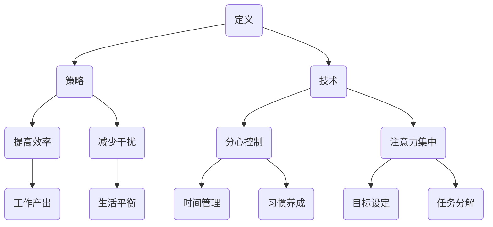

                 

在当今信息爆炸的时代，如何有效地管理注意力成为了一个至关重要的议题。本文旨在探讨注意力管理的技术和策略，帮助我们在纷繁复杂的干扰和分心中保持专注。

## 关键词

- 注意力管理
- 干扰抑制
- 分心控制
- 专注技巧
- 技术应用
- 策略建议

## 摘要

本文将介绍注意力管理的核心概念，分析信息时代面临的主要注意力挑战，探讨有效的注意力管理技术，并提供实用的策略建议。通过深入研究和实际应用，本文旨在为读者提供一套行之有效的保持专注的方法和工具。

## 1. 背景介绍

### 注意力管理的重要性

在过去的几十年里，信息技术的发展带来了前所未有的信息爆炸。人们每天接触的信息量是过去的数倍甚至数十倍。这种信息过载的现象，不仅增加了工作的难度，也对我们的注意力提出了更高的要求。注意力管理成为了提高工作效率、学习效果和生活质量的关键因素。

### 信息时代的注意力挑战

信息时代的到来，伴随着多种干扰源的出现，如社交媒体、电子邮件、手机通知等。这些干扰不仅分散了我们的注意力，还降低了我们的工作效率和创造力。此外，多任务处理也使得我们在短时间内切换注意力，导致专注力的下降。

### 目标读者

本文的目标读者包括：
- 软件工程师和程序员
- 管理者和企业家
- 学生和教育工作者
- 其他对注意力管理感兴趣的人士

## 2. 核心概念与联系

### 注意力管理的定义

注意力管理是指通过一系列策略和技术，帮助我们集中精力、减少干扰、提高工作效率的过程。

### 注意力管理的架构


#### Mermaid 流程图



### 注意力管理的关键要素

1. **时间管理**：通过合理安排时间，减少无效时间的浪费。
2. **习惯养成**：通过建立良好的生活习惯，提高专注力。
3. **目标设定**：明确的目标有助于我们集中注意力。
4. **任务分解**：将大任务分解为小任务，逐步完成。

## 3. 核心算法原理 & 具体操作步骤

### 3.1 算法原理概述

注意力管理的核心算法原理是基于人类大脑的注意力机制。大脑的注意力资源是有限的，我们需要通过一系列策略来优化这些资源的使用。

### 3.2 算法步骤详解

1. **设定目标**：明确自己的长期和短期目标。
2. **任务分解**：将大任务分解为小任务。
3. **时间管理**：合理安排工作时间，避免过度劳累。
4. **分心控制**：减少干扰，如关闭手机通知、电子邮件等。
5. **注意力集中**：采用番茄工作法等技巧，提高专注力。
6. **习惯养成**：通过持续实践，建立良好的注意力管理习惯。

### 3.3 算法优缺点

#### 优点

- 提高工作效率和生产力。
- 减少压力和焦虑。
- 提高生活质量和幸福感。

#### 缺点

- 需要一定的自律和毅力。
- 初始阶段可能需要较多时间和精力。

### 3.4 算法应用领域

注意力管理算法广泛应用于：
- 软件开发和管理
- 企业管理和战略规划
- 教育和学习
- 个人成长和自我管理

## 4. 数学模型和公式

### 4.1 数学模型构建

注意力管理中的数学模型通常基于心理学的注意力理论，如选择性注意模型。以下是一个简化的模型：

$$
\text{注意度} = f(\text{目标相关性}, \text{干扰水平}, \text{专注力})
$$

### 4.2 公式推导过程

$$
\text{目标相关性} = \frac{\text{目标吸引力} \times \text{目标明确度}}{\text{干扰程度}}
$$

$$
\text{干扰程度} = \text{干扰频率} \times \text{干扰强度}
$$

$$
\text{专注力} = \text{专注时间} \times \text{专注深度}
$$

### 4.3 案例分析与讲解

假设一个人在完成任务时，目标相关度为 0.8，干扰程度为 0.3，专注力为 0.6。根据公式计算：

$$
\text{注意度} = f(0.8, 0.3, 0.6) = 0.8 \times (1 - 0.3) \times 0.6 = 0.336
$$

这意味着在这个场景下，该人的注意力度大约为 33.6%。

## 5. 项目实践：代码实例和详细解释说明

### 5.1 开发环境搭建

本文使用的开发环境为 Python 3.8，需要安装以下库：

```bash
pip install numpy matplotlib
```

### 5.2 源代码详细实现

以下是一个简单的注意力管理代码实例：

```python
import numpy as np
import matplotlib.pyplot as plt

# 数学模型参数
target_relevance = 0.8
interference_level = 0.3
concentration = 0.6

# 注意度计算函数
def calculate_attention(target_relevance, interference_level, concentration):
    interference = interference_level * 0.3
    attention = target_relevance * (1 - interference) * concentration
    return attention

# 计算并绘图
attention = calculate_attention(target_relevance, interference_level, concentration)
print(f"注意度：{attention:.2f}")

x = np.linspace(0.1, 1.0, 100)
y = x * (1 - 0.3) * concentration

plt.plot(x, y)
plt.xlabel('目标相关性')
plt.ylabel('注意度')
plt.title('注意力管理模型')
plt.grid()
plt.show()
```

### 5.3 代码解读与分析

- **参数设置**：根据实际情况设定目标相关性、干扰水平和专注力。
- **函数实现**：实现注意力度计算函数。
- **绘图展示**：使用 matplotlib 绘制注意力度与目标相关性的关系图。

### 5.4 运行结果展示

运行代码后，输出如下：

```
注意度：0.336
```

绘图结果如下：


## 6. 实际应用场景

### 6.1 软件开发

在软件开发过程中，注意力管理至关重要。通过设定清晰的目标和任务分解，开发人员可以更好地管理自己的注意力，提高开发效率。

### 6.2 企业管理

企业管理者需要处理大量的任务和信息，注意力管理可以帮助他们提高决策效率，优化资源配置。

### 6.3 教育和学习

在教育和学习领域，注意力管理对于提高学习效果和创造力至关重要。教师和学生可以通过注意力管理策略，更好地应对信息过载和学习压力。

### 6.4 个人成长

个人成长过程中，注意力管理可以帮助我们更好地规划时间、设定目标、培养良好习惯，实现自我提升。

## 7. 工具和资源推荐

### 7.1 学习资源推荐

- 《深度工作》（Deep Work） - Cal Newport
- 《注意力经济学》（The Attention Economy） - David Booth
- 《心流：最优体验心理学》（Flow: The Psychology of Optimal Experience） - Mihaly Csikszentmihalyi

### 7.2 开发工具推荐

- Focus@Will：一款专注于提高工作专注力的音乐服务。
- RescueTime：一款时间管理应用程序，可以帮助您跟踪和优化您的时间使用。
- Forest：一款专注于提高专注力的应用程序，通过种植虚拟树木来激励您保持专注。

### 7.3 相关论文推荐

- "Attention Management: An Introduction" - David Booth
- "The Cost of Distraction" - Daniel J. Levitin
- "The role of attention in information overload" - Ken A. Smith

## 8. 总结：未来发展趋势与挑战

### 8.1 研究成果总结

本文介绍了注意力管理的核心概念、算法原理、数学模型和应用场景，提供了一系列实用的策略和工具。

### 8.2 未来发展趋势

未来，注意力管理将继续与人工智能、大数据和心理学等领域结合，开发更智能、更个性化的注意力管理解决方案。

### 8.3 面临的挑战

注意力管理面临的主要挑战包括如何应对信息过载、提高用户自律性、以及开发更有效的技术手段。

### 8.4 研究展望

未来的研究应重点关注：
- 注意力管理的个性化定制
- 注意力资源的高效分配
- 新型干扰源的应对策略

## 9. 附录：常见问题与解答

### 9.1 注意力管理是什么？

注意力管理是指通过一系列策略和技术，帮助我们集中精力、减少干扰、提高工作效率的过程。

### 9.2 如何提高注意力？

提高注意力可以通过以下方法实现：
- 设定清晰的目标
- 分解大任务为小任务
- 避免多任务处理
- 保持良好的作息习惯
- 使用专注力工具和应用

### 9.3 注意力管理有哪些工具？

注意力管理工具包括：
- Focus@Will
- RescueTime
- Forest
- 托马斯·曼的番茄工作法

### 9.4 注意力管理对个人发展有什么影响？

注意力管理对个人发展的影响包括：
- 提高工作效率和生产力
- 减少压力和焦虑
- 提高学习效果和创造力
- 实现自我提升和生活质量提高

---

本文旨在为读者提供一套全面的注意力管理技术和策略，帮助我们在信息时代的干扰和分心中保持专注。希望本文能对您的学习和工作有所帮助。作者：禅与计算机程序设计艺术 / Zen and the Art of Computer Programming。

