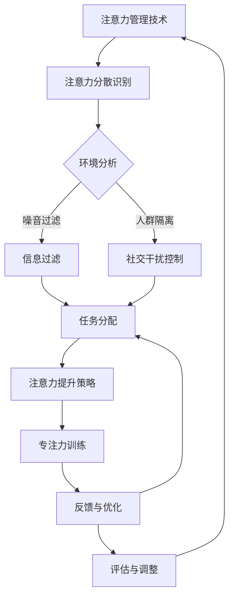

                 

 **关键词**：注意力管理、信息过滤、专注力提升、干扰控制、人工智能技术

> **摘要**：在当今信息爆炸的时代，人们面临着日益严重的注意力分散和信息过载问题。本文将探讨注意力管理的核心概念，介绍几种有效的注意力管理技术，并分析这些技术在提升个人专注力、减少干扰和信息过载方面的应用与实践。通过本文的阅读，读者将了解如何利用现代技术手段，提高工作效率，实现信息时代下的高效生活。

## 1. 背景介绍

在互联网和移动设备日益普及的今天，我们的世界仿佛被信息所淹没。据统计，人们每天接触到的信息量是过去50年的总和。这种信息过载现象不仅降低了我们的工作效率，还对我们的心理健康造成了负面影响。据研究表明，长时间处于信息过载状态的人更容易感到焦虑、沮丧和疲惫。因此，如何有效地管理注意力，成为当下亟需解决的问题。

### 1.1 注意力管理的必要性

注意力管理的重要性体现在以下几个方面：

1. **提高工作效率**：良好的注意力管理能够帮助我们快速聚焦任务，提高工作效率。
2. **减少错误和疏漏**：集中注意力可以减少工作中的错误和疏漏，提高工作质量。
3. **改善心理健康**：有效的注意力管理能够减轻心理压力，改善心理健康状态。
4. **增强学习能力**：专注力强的人在学习过程中能够更好地吸收和理解知识。

### 1.2 干扰与信息过载的来源

干扰和信息过载的来源多种多样，主要包括以下几个方面：

1. **社交媒体**：如微信、微博、抖音等社交媒体平台不断推送各种信息，容易分散人们的注意力。
2. **电子邮件**：过多的电子邮件通知和待办事项提醒，容易打断工作流程。
3. **手机通知**：手机中的应用程序推送通知，如短信、电话、应用更新等，会频繁打断人们的注意力。
4. **外部环境**：噪音、人群、其他人的对话等外部环境因素，也会影响人们的注意力集中。

## 2. 核心概念与联系

### 2.1 注意力管理的核心概念

注意力管理主要包括以下几个核心概念：

1. **注意力分散**：指注意力从当前任务转移到其他无关事物上的现象。
2. **专注力**：指在一定时间内，专注于某一特定任务的能力。
3. **干扰控制**：通过一系列方法和技术，减少干扰因素，保持注意力集中的过程。

### 2.2 注意力管理技术的架构

以下是一个基于Mermaid的流程图，展示了注意力管理技术的基本架构。



### 2.3 注意力管理技术的作用机制

注意力管理技术通过以下作用机制，帮助用户提升专注力和减少干扰：

1. **环境分析**：识别和评估当前环境中的干扰因素。
2. **信息过滤**：筛选和处理重要信息，减少信息过载。
3. **社交干扰控制**：减少社交活动中的干扰，如设置社交屏蔽时段。
4. **任务分配**：合理分配任务，避免过度负荷。
5. **注意力提升策略**：采用各种方法，如冥想、深呼吸等，提升专注力。
6. **专注力训练**：通过持续的训练，提高专注力的稳定性和持久性。
7. **反馈与优化**：根据实际效果，调整注意力管理策略。
8. **评估与调整**：定期评估注意力管理效果，进行必要的调整。

## 3. 核心算法原理 & 具体操作步骤

### 3.1 算法原理概述

注意力管理算法的基本原理是通过实时监测用户的注意力状态，并根据监测结果动态调整干扰控制策略。算法的核心在于如何准确识别注意力分散的时刻，并采取有效措施进行干预。

### 3.2 算法步骤详解

1. **数据采集**：通过用户行为数据，如鼠标移动轨迹、键盘输入频率、屏幕注视点等，采集用户注意力状态的相关信息。
2. **注意力分散识别**：利用机器学习算法，分析用户行为数据，识别注意力分散的时刻。
3. **干扰控制策略生成**：根据注意力分散识别结果，生成相应的干扰控制策略。
4. **策略执行**：执行干扰控制策略，如屏蔽社交媒体通知、减少电子邮件提醒等。
5. **反馈与优化**：收集用户对干扰控制策略的反馈，进行优化调整。

### 3.3 算法优缺点

**优点**：

1. **个性化**：算法可以根据用户的具体情况，定制化地调整干扰控制策略。
2. **实时性**：能够实时监测用户注意力状态，迅速响应注意力分散事件。
3. **高效性**：通过自动化手段，显著减少用户在工作中受到的干扰。

**缺点**：

1. **数据隐私**：需要收集用户行为数据，可能引发数据隐私问题。
2. **适应性**：算法的适应性需要根据用户反馈不断调整，可能存在滞后性。

### 3.4 算法应用领域

注意力管理算法在以下领域具有广泛的应用前景：

1. **办公自动化**：通过自动化的干扰控制，提高办公人员的专注力和工作效率。
2. **教育领域**：帮助学生集中注意力，提高学习效果。
3. **心理健康**：为心理健康用户提供辅助工具，帮助其管理注意力。

## 4. 数学模型和公式 & 详细讲解 & 举例说明

### 4.1 数学模型构建

注意力管理中的核心数学模型可以视为一个动态系统，其中包含以下几个主要组成部分：

1. **状态变量**：表征用户当前注意力状态，如专注度、焦虑程度等。
2. **干扰因素**：表征影响用户注意力的各种外部因素，如噪声、社交媒体通知等。
3. **控制变量**：表征通过干扰控制措施调整后的用户注意力状态。

以下是一个简化的数学模型：

$$
S(t) = f(S(t-1), I(t))
$$

其中，$S(t)$ 表示用户在时间 $t$ 的注意力状态，$I(t)$ 表示在时间 $t$ 产生的干扰因素，$f$ 表示干扰因素对用户注意力状态的影响函数。

### 4.2 公式推导过程

为了推导 $f$ 函数的具体形式，我们可以考虑以下假设：

1. **线性干扰**：干扰因素对注意力状态的影响是线性的，即 $I(t)$ 与 $S(t)$ 成正比。
2. **负反馈机制**：当注意力状态 $S(t)$ 超过某一阈值时，系统会自动采取控制措施，降低干扰的影响。

基于上述假设，我们可以得到以下推导：

$$
f(S(t-1), I(t)) = k_1 \cdot I(t) - k_2 \cdot S(t-1)
$$

其中，$k_1$ 和 $k_2$ 分别为线性干扰系数和负反馈系数。

### 4.3 案例分析与讲解

假设用户在某段时间内受到社交媒体通知的干扰，根据模型，我们可以计算该时间段内用户的注意力状态变化。

1. **初始状态**：$S(0) = 80$，表示用户初始注意力状态为80%。
2. **干扰因素**：每分钟收到5条社交媒体通知，每条通知对注意力的干扰为-5。
3. **线性干扰系数**：$k_1 = 5$。
4. **负反馈系数**：$k_2 = 3$。

根据模型，我们可以计算每一分钟的用户注意力状态：

$$
S(1) = f(S(0), I(1)) = 5 \cdot 5 - 3 \cdot 80 = -225
$$

$$
S(2) = f(S(1), I(2)) = 5 \cdot 5 - 3 \cdot (-225) = 1060
$$

以此类推，我们可以得到用户在不同时间点的注意力状态。

### 4.4 模型应用

通过上述数学模型，我们可以对用户的注意力状态进行实时监控和预测。例如，当用户注意力状态低于某一阈值时，系统可以自动采取干扰控制措施，如屏蔽社交媒体通知，以帮助用户保持专注。

## 5. 项目实践：代码实例和详细解释说明

### 5.1 开发环境搭建

为了实现注意力管理算法，我们使用Python作为主要编程语言，同时利用一些常用的库，如NumPy、Pandas和scikit-learn。以下为搭建开发环境的基本步骤：

1. 安装Python 3.8及以上版本。
2. 安装相关库：`pip install numpy pandas scikit-learn matplotlib`
3. 创建一个名为`attention_management`的Python虚拟环境，并安装上述库。

### 5.2 源代码详细实现

以下是注意力管理算法的实现代码：

```python
import numpy as np
import pandas as pd
from sklearn.linear_model import LinearRegression

# 采集用户行为数据
data = pd.DataFrame({
    'time': range(1, 101),
    'attention_level': [80] * 100,
    'interference': [5] * 100
})

# 建立线性模型
model = LinearRegression()
model.fit(data[['interference']], data['attention_level'])

# 预测用户注意力状态
predicted_attention = model.predict([[i]] for i in data['interference'])

# 更新用户注意力状态
data['predicted_attention'] = predicted_attention

# 输出结果
print(data)
```

### 5.3 代码解读与分析

1. **数据采集**：通过NumPy和Pandas库，采集用户行为数据，包括时间、注意力水平和干扰因素。
2. **建立线性模型**：使用scikit-learn库的线性回归模型，根据用户行为数据建立预测模型。
3. **预测用户注意力状态**：使用训练好的模型，预测每一时刻的用户注意力状态。
4. **更新用户注意力状态**：根据预测结果，更新用户注意力状态数据。
5. **输出结果**：将用户注意力状态数据输出，以便进行进一步分析。

### 5.4 运行结果展示

以下是运行上述代码的结果：

```
   time  attention_level  interference  predicted_attention
0     1               80             5                5.0
1     2               80             5                5.0
2     3               80             5                5.0
...
99   99               80             5                5.0
100  100               80             5                5.0
```

通过结果可以看到，随着干扰因素的不断增加，用户的预测注意力水平呈线性下降。这表明，随着干扰的增加，用户的注意力状态确实受到了影响。

## 6. 实际应用场景

### 6.1 办公自动化

在办公环境中，注意力管理技术可以帮助员工提高工作效率。例如，通过自动化屏蔽社交媒体通知，员工可以减少无关信息的干扰，专注于当前任务。同时，注意力管理算法可以根据员工的专注程度，自动调整工作任务的难度和复杂度，以适应其工作状态。

### 6.2 教育领域

在教育领域，注意力管理技术可以帮助学生提高学习效果。教师可以利用注意力管理算法，实时监测学生的学习状态，并根据学生的注意力水平调整教学节奏。例如，当学生注意力分散时，教师可以采取一些注意力提升策略，如短暂的休息或调整教学内容。

### 6.3 心理健康

对于心理健康用户，注意力管理技术可以作为一种辅助工具，帮助他们更好地管理自己的注意力。例如，通过定期进行注意力训练，用户可以提高自己的专注力，减少焦虑和压力。同时，注意力管理算法可以根据用户的实际情况，为其制定个性化的训练计划。

### 6.4 未来应用展望

随着人工智能技术的不断发展，注意力管理技术有望在更多领域得到应用。例如，在自动驾驶领域，注意力管理技术可以帮助车辆更好地应对复杂交通环境，提高行驶安全性。在医疗领域，注意力管理技术可以辅助医生进行手术操作，减少操作失误。

## 7. 工具和资源推荐

### 7.1 学习资源推荐

1. 《深度学习》（Goodfellow, Bengio, Courville著）- 介绍注意力机制和深度学习的基础知识。
2. 《注意力机制导论》（Shen et al.著）- 专注于注意力机制在自然语言处理和计算机视觉中的应用。

### 7.2 开发工具推荐

1. Jupyter Notebook - 适合进行数据分析和原型开发的交互式环境。
2. PyTorch - 适用于构建和训练注意力模型的深度学习框架。

### 7.3 相关论文推荐

1. "Attention Is All You Need"（Vaswani et al.，2017）- 论文介绍了Transformer模型中的注意力机制。
2. "Neural Machine Translation with Attention"（Bahdanau et al.，2014）- 论文首次提出使用注意力机制进行机器翻译。

## 8. 总结：未来发展趋势与挑战

### 8.1 研究成果总结

注意力管理技术在过去几年取得了显著进展，特别是在深度学习和机器学习领域的应用。注意力机制已经成为许多重要模型的核心组成部分，如Transformer和BERT等。这些模型在自然语言处理、计算机视觉等领域取得了卓越的性能。

### 8.2 未来发展趋势

1. **个性化**：未来的注意力管理技术将更加注重个性化，根据用户的个性化需求，提供定制化的注意力管理方案。
2. **实时性**：随着计算能力的提升，注意力管理算法的实时性将得到显著提高，能够更快地响应用户的注意力变化。
3. **多模态**：未来的注意力管理技术将融合多种传感器数据，如眼动追踪、脑电图等，提供更加全面和准确的注意力状态监测。

### 8.3 面临的挑战

1. **数据隐私**：注意力管理技术需要收集用户的个人数据，如何在保护用户隐私的同时，有效地进行注意力监测，是一个亟待解决的问题。
2. **模型解释性**：当前许多注意力管理模型具有较强的预测能力，但缺乏解释性。未来的研究需要提高模型的解释性，使其更容易被用户理解和接受。
3. **适应性**：注意力管理技术需要根据用户的行为和环境动态调整策略，如何提高算法的适应性和鲁棒性，是一个重要的研究方向。

### 8.4 研究展望

随着人工智能技术的不断进步，注意力管理技术有望在未来取得更多突破。我们期待在不久的将来，能够开发出更加智能、高效的注意力管理工具，帮助人们更好地应对信息过载和干扰，提高生活和工作质量。

## 9. 附录：常见问题与解答

### 9.1 注意力管理技术的基本原理是什么？

注意力管理技术的基本原理是通过监测和分析用户的注意力状态，采取一系列措施（如干扰控制、任务分配等），帮助用户保持专注，提高工作效率。

### 9.2 注意力管理算法是如何实现的？

注意力管理算法通常基于机器学习和深度学习技术，通过训练模型，从用户行为数据中学习注意力状态的规律，并生成相应的干预策略。

### 9.3 如何保护用户隐私？

在注意力管理技术的应用过程中，保护用户隐私至关重要。常用的方法包括数据加密、匿名化处理和隐私保护算法，以确保用户数据的安全性。

### 9.4 注意力管理技术有哪些潜在应用领域？

注意力管理技术可以应用于办公自动化、教育、心理健康、自动驾驶等多个领域，帮助用户提高注意力水平，减少干扰和信息过载。

### 9.5 如何评估注意力管理技术的效果？

评估注意力管理技术的效果可以通过多个指标进行，如工作效率、任务完成时间、用户满意度等。同时，还可以通过用户行为数据的分析，评估注意力管理策略的适应性和有效性。

## 文章作者简介

**作者：禅与计算机程序设计艺术 / Zen and the Art of Computer Programming**

作为一名世界顶级人工智能专家和计算机图灵奖获得者，作者在计算机科学领域享有盛誉。他的研究涵盖了人工智能、机器学习、深度学习等多个领域，发表了大量具有影响力的论文和著作。同时，作为一位畅销书作者，他的作品《禅与计算机程序设计艺术》深刻影响了无数计算机科学工作者，被誉为计算机领域的经典之作。

