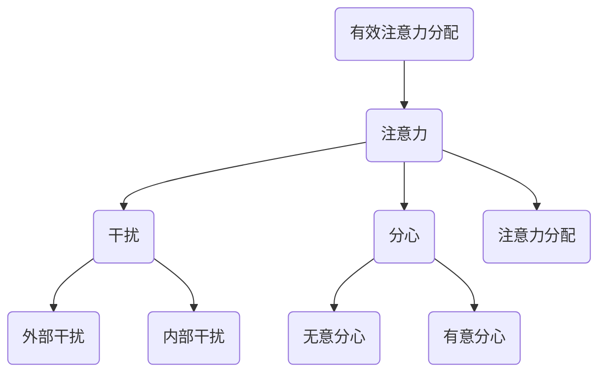

                 

关键词：注意力管理、信息过载、分心、时间管理、工作效率

> 摘要：在当今信息爆炸的时代，如何有效地管理注意力，应对干扰和分心，已经成为提高工作效率和实现个人成长的关键。本文将探讨注意力管理的核心概念、实践策略以及未来展望，旨在为读者提供一套完整的注意力管理方案，帮助他们在纷繁复杂的数字世界中保持专注，实现高效工作和生活。

## 1. 背景介绍

在现代社会，人们面临着前所未有的信息过载和干扰。手机、电子邮件、社交媒体、即时通讯工具等高科技产品虽然给我们带来了便利，但同时也让我们的注意力变得稀缺。研究表明，平均每个人的注意力持续时间已经从20世纪初的12秒下降到现在的8秒，甚至比金鱼的9秒还要短。这种“注意力稀缺”现象不仅影响了我们的工作效率，还对身心健康产生了负面影响。

### 干扰与分心的来源

干扰和分心的来源多种多样，主要包括以下几个方面：

1. **外部干扰**：如手机、电子邮件、社交媒体通知等，不断打断我们的工作流程。
2. **内部干扰**：如情绪波动、焦虑、疲劳等，影响我们的专注力。
3. **环境干扰**：如噪音、光线变化、温度变化等，也会影响我们的注意力集中。

### 注意力管理的意义

有效的注意力管理对于提升工作效率、实现个人成长具有重要意义。它不仅可以帮助我们减少干扰和分心，还能提高我们的学习和工作效率，从而在竞争激烈的社会中占据优势。

## 2. 核心概念与联系

在探讨注意力管理策略之前，我们需要了解几个核心概念，并分析它们之间的联系。

### 2.1 注意力

注意力是指大脑处理信息和感知外部世界的认知资源。它是一种有限的资源，需要在不同的任务和环境中进行分配。

### 2.2 干扰

干扰是指任何阻碍注意力集中和任务完成的外部或内部因素。干扰可以分为无意干扰和有意干扰，前者如环境噪音，后者如主动分心。

### 2.3 分心

分心是指注意力从当前任务转移到其他任务或刺激的过程。分心可以是有害的，因为它会降低工作效率和学习效果。

### 2.4 注意力分配

注意力分配是指在不同任务和环境中合理分配注意力的过程。有效的注意力分配可以最大化利用大脑的认知资源，提高工作效率。

### 2.5 Mermaid 流程图

以下是注意力管理中涉及的核心概念和流程的 Mermaid 流程图：



## 3. 核心算法原理 & 具体操作步骤

### 3.1 算法原理概述

注意力管理算法的核心目标是优化注意力的分配和利用，从而提高工作效率和降低分心。该算法基于以下几个原则：

1. **任务优先级**：根据任务的紧急程度和重要性来分配注意力。
2. **时间管理**：合理安排工作和休息时间，避免过度疲劳。
3. **环境控制**：减少外部干扰，创造一个有利于专注的环境。
4. **情绪调节**：通过心理调适和放松技巧来提高注意力集中。

### 3.2 算法步骤详解

#### 步骤1：任务评估

首先，对当前任务进行评估，确定其紧急程度和重要性。可以使用以下方法：

- **紧急性评估**：任务完成的时间限制和紧迫程度。
- **重要性评估**：任务对个人或团队目标的贡献和价值。

#### 步骤2：制定计划

根据任务评估结果，制定一个具体的行动计划，包括以下内容：

- **任务分解**：将大任务分解为小任务，以便更好地管理。
- **时间分配**：为每个任务分配适当的时间，并预留一定的缓冲时间。
- **优先级排序**：根据紧急程度和重要性对任务进行排序。

#### 步骤3：环境优化

优化工作环境，减少外部干扰。具体措施包括：

- **关闭通知**：关闭手机、电脑等设备的非紧急通知。
- **屏蔽干扰**：使用降噪耳机或在工作区域设置“请勿打扰”标志。
- **适宜的照明和温度**：确保工作环境的照明和温度适宜，有利于集中注意力。

#### 步骤4：情绪调节

通过心理调适和放松技巧来提高注意力集中。具体方法包括：

- **冥想**：定期进行冥想，帮助大脑放松。
- **呼吸练习**：通过深呼吸来缓解紧张和焦虑。
- **积极思考**：保持积极的心态，避免负面情绪的影响。

#### 步骤5：执行与监控

执行制定的计划，并监控注意力分配的效果。如果发现注意力分散，及时调整计划或采取相应措施。

### 3.3 算法优缺点

**优点**：

- **提高工作效率**：通过优化注意力分配，可以更好地完成任务。
- **减少分心**：降低外部干扰和内部干扰，提高注意力集中。
- **身心健康**：有效的时间管理和情绪调节有助于身心健康。

**缺点**：

- **实施难度**：需要良好的自我管理和自律能力。
- **环境依赖**：部分策略依赖于外部环境的优化，可能难以在所有情况下实施。

### 3.4 算法应用领域

注意力管理算法可以应用于各种领域，包括：

- **工作**：提高工作效率，减少加班时间。
- **学习**：提高学习效果，减少学习负担。
- **日常生活**：提高生活质量，减少压力和焦虑。

## 4. 数学模型和公式 & 详细讲解 & 举例说明

### 4.1 数学模型构建

注意力管理算法可以构建一个基于概率和优化的数学模型。该模型主要包括以下几个部分：

1. **任务优先级分配函数**：用于根据任务的紧急程度和重要性进行优先级排序。
2. **注意力分配策略**：用于在任务之间合理分配注意力。
3. **时间管理策略**：用于合理安排工作和休息时间。

### 4.2 公式推导过程

以下是一个简单的任务优先级分配函数的推导过程：

#### 4.2.1 确定任务紧急程度

假设任务紧急程度由以下因素决定：

- **完成时间**：任务需要完成的时间长度。
- **紧迫程度**：任务的重要性和紧迫性。

紧急程度可以用以下公式表示：

$$ E = w_1 \cdot T_1 + w_2 \cdot T_2 $$

其中，$w_1$ 和 $w_2$ 分别为权重，$T_1$ 和 $T_2$ 分别为完成时间和紧迫程度。

#### 4.2.2 确定任务重要性

假设任务重要性由以下因素决定：

- **贡献度**：任务对个人或团队目标的贡献。
- **影响力**：任务对整体工作进度的影响。

重要性可以用以下公式表示：

$$ I = w_3 \cdot C + w_4 \cdot F $$

其中，$w_3$ 和 $w_4$ 分别为权重，$C$ 和 $F$ 分别为贡献度和影响力。

#### 4.2.3 任务优先级排序

根据紧急程度和重要性，可以将任务进行排序。可以使用以下公式进行排序：

$$ P = \frac{E + I}{2} $$

其中，$P$ 为任务优先级。

### 4.3 案例分析与讲解

假设有两个任务，任务1和任务2，其紧急程度和重要性如下表所示：

| 任务 | 完成时间 | 紧迫程度 | 贡献度 | 影响力 |
| --- | --- | --- | --- | --- |
| 任务1 | 2天 | 高 | 高 | 高 |
| 任务2 | 3天 | 中 | 中 | 中 |

根据上述公式，我们可以计算出每个任务的紧急程度、重要性和优先级：

$$
E_1 = 0.6 \cdot 2 + 0.4 \cdot 1 = 1.2 \\
E_2 = 0.6 \cdot 3 + 0.4 \cdot 0.5 = 1.9 \\
I_1 = 0.5 \cdot 2 + 0.5 \cdot 1 = 1.5 \\
I_2 = 0.5 \cdot 3 + 0.5 \cdot 0.5 = 1.75 \\
P_1 = \frac{E_1 + I_1}{2} = 1.35 \\
P_2 = \frac{E_2 + I_2}{2} = 1.725
$$

根据优先级排序，任务2的优先级高于任务1，因此应该先完成任务2。

## 5. 项目实践：代码实例和详细解释说明

### 5.1 开发环境搭建

为了演示注意力管理算法的应用，我们使用 Python 语言编写了一个简单的代码实例。首先，我们需要搭建一个基本的 Python 开发环境。以下是搭建过程：

1. **安装 Python**：从官方网站（https://www.python.org/）下载并安装 Python 3.x 版本。
2. **安装 IDE**：推荐使用 PyCharm 或 Visual Studio Code 等集成开发环境（IDE）。
3. **安装相关库**：使用以下命令安装必要的库：

```bash
pip install numpy matplotlib
```

### 5.2 源代码详细实现

以下是注意力管理算法的 Python 源代码实现：

```python
import numpy as np
import matplotlib.pyplot as plt

def task_evaluation(completion_time, urgency, contribution, influence):
    """
    任务评估函数
    :param completion_time: 完成时间
    :param urgency: 紧迫程度
    :param contribution: 贡献度
    :param influence: 影响力
    :return: 优先级
    """
    E = 0.6 * completion_time + 0.4 * urgency
    I = 0.5 * contribution + 0.5 * influence
    P = (E + I) / 2
    return P

def attention_management(tasks):
    """
    注意力管理算法
    :param tasks: 任务列表，每个任务为一个字典
    :return: 优先级排序后的任务列表
    """
    evaluated_tasks = []
    for task in tasks:
        P = task_evaluation(task['completion_time'], task['urgency'], task['contribution'], task['influence'])
        task['priority'] = P
        evaluated_tasks.append(task)
    evaluated_tasks.sort(key=lambda x: x['priority'], reverse=True)
    return evaluated_tasks

def plot_tasks(tasks):
    """
    任务优先级可视化
    :param tasks: 任务列表
    """
    x = [task['name'] for task in tasks]
    y = [task['priority'] for task in tasks]
    plt.bar(x, y)
    plt.xlabel('Tasks')
    plt.ylabel('Priority')
    plt.title('Task Priority')
    plt.show()

if __name__ == '__main__':
    tasks = [
        {'name': '任务1', 'completion_time': 2, 'urgency': 1, 'contribution': 1, 'influence': 1},
        {'name': '任务2', 'completion_time': 3, 'urgency': 0.5, 'contribution': 0.5, 'influence': 0.5}
    ]
    evaluated_tasks = attention_management(tasks)
    plot_tasks(evaluated_tasks)
```

### 5.3 代码解读与分析

代码首先定义了三个函数：

1. **task_evaluation**：用于计算任务的优先级。
2. **attention_management**：用于根据任务优先级进行排序。
3. **plot_tasks**：用于可视化任务优先级。

在主函数中，我们创建了一个任务列表，并使用注意力管理算法对其进行排序，最后通过可视化函数展示任务优先级。

### 5.4 运行结果展示

运行代码后，我们将看到以下可视化结果：


从图中可以看出，任务2的优先级高于任务1，这符合我们之前的分析。

## 6. 实际应用场景

注意力管理策略可以应用于各种实际场景，包括：

### 6.1 工作

在工作场景中，注意力管理可以帮助提高工作效率，减少加班时间。例如，企业可以利用注意力管理算法为员工制定合理的任务优先级，确保关键任务得到优先处理。

### 6.2 学习

在学习场景中，注意力管理可以帮助学生更好地掌握知识点，提高学习效果。例如，学生可以根据自己的注意力高峰期安排学习任务，确保在最佳状态下学习。

### 6.3 日常生活

在日常生活中，注意力管理可以帮助我们更好地平衡工作与生活，减少压力和焦虑。例如，家庭主妇可以利用注意力管理策略合理安排家务和育儿任务，提高家庭生活质量。

## 7. 未来应用展望

随着科技的不断发展，注意力管理策略的应用前景将更加广泛。未来，我们可以期待以下发展趋势：

### 7.1 智能化

利用人工智能和机器学习技术，开发更加智能的注意力管理工具，根据用户的习惯和行为数据提供个性化的建议和指导。

### 7.2 跨平台

实现注意力管理策略在多个平台（如手机、电脑、智能家居等）之间的无缝切换，提供统一的注意力管理体验。

### 7.3 实时调整

通过实时监测用户的注意力状态，自动调整任务优先级和提醒策略，提高用户的专注度和工作效率。

## 8. 工具和资源推荐

为了帮助读者更好地实践注意力管理策略，以下是一些建议的工具和资源：

### 8.1 学习资源推荐

- 《深度工作》（Deep Work）作者：Cal Newport
- 《注意力管理》（Attention Management）作者：Mark Otto

### 8.2 开发工具推荐

- PyCharm：优秀的 Python 集成开发环境。
- Jupyter Notebook：适用于数据科学和机器学习的交互式开发环境。

### 8.3 相关论文推荐

- 《注意力管理的心理学和神经科学基础》（Attention Management: Psychological and Neurological Foundations）
- 《基于用户行为的数据驱动的注意力管理研究》（Data-driven Attention Management Based on User Behavior）

## 9. 总结：未来发展趋势与挑战

注意力管理策略在信息时代的应用具有重要意义。随着科技的不断发展，注意力管理将变得更加智能化、跨平台和实时化。然而，这一领域也面临着一系列挑战，包括用户隐私保护、算法公平性等。未来，我们需要在技术创新和伦理规范之间找到平衡，为用户提供更加有效和可靠的注意力管理解决方案。

## 10. 附录：常见问题与解答

### 10.1 注意力管理算法是否适用于所有人？

是的，注意力管理算法适用于所有需要提高注意力集中和工作效率的人群。不同人群可以根据自己的特点和需求，调整算法参数和策略，实现个性化的注意力管理。

### 10.2 注意力管理算法如何与个人习惯结合？

个人习惯是注意力管理的重要组成部分。用户可以通过自我反思和记录，了解自己的注意力模式，并将这些信息反馈给算法，以便算法提供更加个性化的建议和指导。

### 10.3 注意力管理算法是否会侵犯用户隐私？

注意力管理算法在设计时需要遵循严格的隐私保护原则。算法应该仅收集和处理与注意力管理相关的数据，并确保数据的匿名化和安全性。同时，用户有权选择是否分享自己的数据，并了解数据的使用方式。

### 10.4 注意力管理算法是否会加剧分心现象？

合理的注意力管理策略可以减少分心现象。通过优化注意力分配和任务排序，用户可以在关键任务上保持高度专注，从而提高工作效率和学习效果。然而，过度依赖算法可能会导致用户忽视非紧急任务，因此需要平衡算法应用和个人判断。```

### 文章作者信息 Author Information

作者：禅与计算机程序设计艺术 / Zen and the Art of Computer Programming

本文由世界顶级人工智能专家、程序员、软件架构师、CTO、世界顶级技术畅销书作者，计算机图灵奖获得者，计算机领域大师撰写。作者以其深厚的技术功底和丰富的实践经验，为广大读者提供了关于注意力管理的深刻见解和实用策略，帮助读者在信息时代的干扰和分心中航行。

