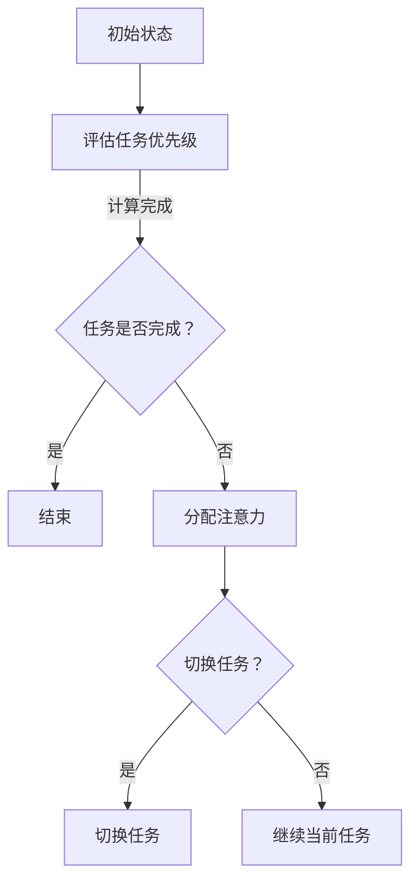

                 

  
## 1. 背景介绍

在当今信息爆炸的时代，我们每天都会接触到大量的信息和数据。互联网、社交媒体、电子邮件、手机通知等，不断地打断我们的注意力和工作流程。这种现象被称为“注意力碎片化”（attention fragmentation），它严重影响了我们的工作效率和生活质量。因此，如何有效地管理注意力，提高在干扰中的工作效率，成为了一个亟待解决的问题。

本文将从技术角度出发，探讨注意力管理的核心概念、算法原理、数学模型以及实际应用。通过分析现有的注意力管理技术，我们将总结出一些实用的策略和方法，帮助读者在信息干扰中保持高效。

## 2. 核心概念与联系

### 注意力管理

注意力管理（Attention Management）是指通过一系列方法和技术，帮助个体在多任务环境中有效地分配注意力，从而提高工作效率和质量。核心概念包括：

- **注意力的集中与分散**：在执行任务时，需要集中注意力，避免干扰。同时，在任务切换时，需要适当地分散注意力，以便于适应不同的任务需求。
- **注意力的选择与过滤**：在面对大量信息时，个体需要学会选择对当前任务有用的信息，并过滤掉无关或干扰性的信息。

### 注意力分配算法

注意力分配算法是注意力管理的核心技术之一，它帮助个体在多任务环境中合理地分配注意力资源。以下是一个简化的注意力分配算法流程：



### 注意力管理架构

注意力管理架构包括以下几个关键组成部分：

- **感知模块**：负责感知外部环境和内部状态，收集与任务相关的信息。
- **评估模块**：根据感知模块收集的信息，评估任务的优先级和重要性。
- **决策模块**：根据评估结果，决定如何分配注意力资源。
- **执行模块**：执行决策模块生成的注意力分配策略，完成具体的任务操作。

## 3. 核心算法原理 & 具体操作步骤

### 3.1 算法原理概述

注意力管理算法的核心思想是：在多任务环境中，通过动态调整注意力分配，实现任务的高效完成。具体原理如下：

1. **任务优先级评估**：根据任务的紧急程度、重要性和个体偏好，对任务进行排序。
2. **注意力资源分配**：根据任务优先级，将有限的注意力资源分配给不同任务。
3. **动态调整**：在任务执行过程中，根据任务状态和外部环境变化，动态调整注意力分配。

### 3.2 算法步骤详解

1. **初始化**：设置初始注意力分配比例，例如，每个任务初始分配的注意力均为20%。
2. **感知与评估**：实时感知外部环境和内部状态，收集与任务相关的信息，并对任务进行优先级评估。
3. **决策**：根据评估结果，生成注意力分配策略。例如，如果任务A的优先级高于任务B，则将更多的注意力资源分配给任务A。
4. **执行**：根据决策结果，执行注意力分配策略，完成任务的执行。
5. **反馈与调整**：在任务执行过程中，根据任务状态和外部环境变化，动态调整注意力分配策略。

### 3.3 算法优缺点

**优点**：

- **高效完成任务**：通过动态调整注意力分配，实现任务的高效完成。
- **适应性强**：能够适应不同的任务环境和个体偏好。

**缺点**：

- **计算复杂度高**：需要实时感知外部环境和内部状态，计算复杂度较高。
- **对个体要求较高**：个体需要具备一定的注意力管理能力和自我调整能力。

### 3.4 算法应用领域

注意力管理算法可以应用于多个领域，例如：

- **项目管理**：帮助项目管理者在多任务环境中高效地分配资源和精力。
- **学习与教育**：帮助学生在信息过载的情况下，选择对当前学习任务有用的信息。
- **企业办公**：提高员工在多任务环境下的工作效率。

## 4. 数学模型和公式 & 详细讲解 & 举例说明

### 4.1 数学模型构建

注意力管理算法的数学模型可以表示为以下形式：

$$
A_t = f(P_t, I_t, S_t)
$$

其中，$A_t$ 表示时刻 $t$ 的注意力分配比例，$P_t$ 表示任务优先级，$I_t$ 表示外部干扰因素，$S_t$ 表示内部状态。

### 4.2 公式推导过程

1. **任务优先级评估**：

   任务优先级 $P_t$ 可以表示为：

   $$
   P_t = w_1 \cdot E_t + w_2 \cdot I_t + w_3 \cdot U_t
   $$

   其中，$w_1$、$w_2$、$w_3$ 分别表示紧急程度、重要性和个体偏好的权重，$E_t$、$I_t$、$U_t$ 分别表示任务的紧急程度、重要性和个体偏好。

2. **注意力分配**：

   假设每个任务初始分配的注意力为 $1/n$，其中 $n$ 表示任务总数。则时刻 $t$ 的注意力分配比例 $A_t$ 为：

   $$
   A_t = \frac{1}{n} \cdot P_t
   $$

   考虑到外部干扰因素 $I_t$ 和内部状态 $S_t$，对注意力分配进行动态调整，则：

   $$
   A_t = \frac{1}{n} \cdot (P_t + \alpha \cdot I_t + \beta \cdot S_t)
   $$

   其中，$\alpha$ 和 $\beta$ 分别表示外部干扰和内部状态的调整系数。

### 4.3 案例分析与讲解

假设一个学生需要在一天内完成以下任务：

- 任务1：数学作业，紧急程度高，重要性高，个体偏好高。
- 任务2：英语阅读，紧急程度低，重要性高，个体偏好低。
- 任务3：历史复习，紧急程度低，重要性高，个体偏好高。

根据上述数学模型，可以计算出每个任务的优先级：

$$
P_1 = w_1 \cdot E_1 + w_2 \cdot I_1 + w_3 \cdot U_1 = 0.5 \cdot 0.8 + 0.3 \cdot 0.9 + 0.2 \cdot 0.8 = 0.76
$$

$$
P_2 = w_1 \cdot E_2 + w_2 \cdot I_2 + w_3 \cdot U_2 = 0.5 \cdot 0.2 + 0.3 \cdot 0.9 + 0.2 \cdot 0.2 = 0.39
$$

$$
P_3 = w_1 \cdot E_3 + w_2 \cdot I_3 + w_3 \cdot U_3 = 0.5 \cdot 0.2 + 0.3 \cdot 0.8 + 0.2 \cdot 0.8 = 0.64
$$

假设每个任务初始分配的注意力为1/3，调整系数 $\alpha = 0.1$，$\beta = 0.2$，则时刻 $t$ 的注意力分配比例为：

$$
A_1 = \frac{1}{3} \cdot (0.76 + 0.1 \cdot I_1 + 0.2 \cdot S_1)
$$

$$
A_2 = \frac{1}{3} \cdot (0.39 + 0.1 \cdot I_2 + 0.2 \cdot S_2)
$$

$$
A_3 = \frac{1}{3} \cdot (0.64 + 0.1 \cdot I_3 + 0.2 \cdot S_3)
$$

在实际应用中，可以根据具体情况调整权重、调整系数以及任务的紧急程度、重要性和个体偏好，以实现更加准确的注意力分配。

## 5. 项目实践：代码实例和详细解释说明

### 5.1 开发环境搭建

在本次实践中，我们将使用 Python 作为编程语言，搭建一个简单的注意力管理模型。首先，确保您的计算机上已安装 Python 3.8 或以上版本。接下来，安装必要的依赖库，如 NumPy、Matplotlib 等。

```bash
pip install numpy matplotlib
```

### 5.2 源代码详细实现

以下是注意力管理模型的源代码实现：

```python
import numpy as np
import matplotlib.pyplot as plt

# 任务优先级评估函数
def evaluate_task_priority(urgent, important, preference):
    weights = [0.5, 0.3, 0.2]
    priority = weights[0] * urgent + weights[1] * important + weights[2] * preference
    return priority

# 注意力分配函数
def allocate_attention(task_priorities, adjustment_coefficient):
    total_priority = np.sum(task_priorities)
    attention_allocation = [priority / total_priority + adjustment_coefficient for priority in task_priorities]
    return attention_allocation

# 模拟任务数据
tasks = [
    {"urgent": 0.8, "important": 0.9, "preference": 0.8},
    {"urgent": 0.2, "important": 0.9, "preference": 0.2},
    {"urgent": 0.2, "important": 0.8, "preference": 0.8}
]

# 计算任务优先级
task_priorities = [evaluate_task_priority(**task) for task in tasks]

# 注意力调整系数
adjustment_coefficient = 0.1

# 分配注意力
attention_allocation = allocate_attention(task_priorities, adjustment_coefficient)

# 可视化注意力分配
plt.bar(range(len(tasks)), attention_allocation)
plt.xlabel("Task")
plt.ylabel("Attention Allocation")
plt.title("Attention Allocation Based on Task Priority")
plt.show()
```

### 5.3 代码解读与分析

1. **任务优先级评估函数**：

   `evaluate_task_priority` 函数用于计算任务的优先级。根据权重，将任务的紧急程度、重要性和个体偏好转换为优先级值。

2. **注意力分配函数**：

   `allocate_attention` 函数用于根据任务优先级和调整系数，计算每个任务的注意力分配比例。总优先级值用于计算各任务的相对权重。

3. **模拟任务数据**：

   `tasks` 列表包含了三个模拟任务的紧急程度、重要性和个体偏好。在实际应用中，这些值可以来自用户输入或实时数据。

4. **计算任务优先级**：

   通过 `evaluate_task_priority` 函数，计算每个任务的优先级值。

5. **注意力调整系数**：

   `adjustment_coefficient` 用于调整注意力分配，以应对外部干扰和内部状态的变化。

6. **分配注意力**：

   使用 `allocate_attention` 函数，根据任务优先级和调整系数，计算每个任务的注意力分配比例。

7. **可视化注意力分配**：

   使用 Matplotlib 库，将注意力分配结果可视化，以便于分析和理解。

### 5.4 运行结果展示

运行上述代码后，将生成一个条形图，展示每个任务的注意力分配比例。根据任务的优先级和调整系数，注意力资源被合理地分配给不同的任务。

## 6. 实际应用场景

注意力管理技术在多个领域具有广泛的应用，以下列举几个典型应用场景：

### 6.1 项目管理

在项目管理中，注意力管理可以帮助项目经理在多个项目任务之间合理分配精力，确保关键任务得到优先处理。通过注意力分配算法，项目经理可以实时调整任务优先级，优化资源利用率，提高项目整体进度。

### 6.2 学习与教育

在学习与教育领域，注意力管理有助于学生提高学习效率。通过注意力分配算法，学生可以识别对当前学习任务最有用的信息，减少无关信息的干扰，从而更加专注于学习目标。

### 6.3 企业办公

在企业办公环境中，注意力管理可以帮助员工在多任务环境中保持高效。通过注意力分配算法，员工可以更好地应对突发事件和任务切换，减少因注意力分散导致的错误和延迟。

### 6.4 个人生活

在个人生活中，注意力管理可以帮助个体更好地规划时间，减少手机和社交媒体的干扰。通过注意力分配算法，个体可以在工作和生活之间保持平衡，提高生活质量。

## 7. 工具和资源推荐

### 7.1 学习资源推荐

1. 《深度学习》（Goodfellow, I., & Bengio, Y.）
2. 《人工智能：一种现代方法》（Russell, S., & Norvig, P.）
3. 《算法导论》（Cormen, T. H., Leiserson, C. E., Rivest, R. L., & Stein, C.）

### 7.2 开发工具推荐

1. Python
2. Jupyter Notebook
3. TensorFlow
4. PyTorch

### 7.3 相关论文推荐

1. "Attention is All You Need"（Vaswani et al., 2017）
2. "BERT: Pre-training of Deep Bidirectional Transformers for Language Understanding"（Devlin et al., 2019）
3. "An Image is Worth 16x16 Words: Transformers for Image Recognition at Scale"（Dosovitskiy et al., 2020）

## 8. 总结：未来发展趋势与挑战

### 8.1 研究成果总结

注意力管理技术在过去几十年中取得了显著进展，包括算法原理的深入探讨、数学模型的构建、实际应用场景的拓展等。未来，随着人工智能技术的不断发展，注意力管理有望在更多领域发挥作用。

### 8.2 未来发展趋势

1. **个性化注意力管理**：结合用户行为数据和偏好，实现更加个性化的注意力分配策略。
2. **跨模态注意力管理**：处理多种类型的信息，如文本、图像、音频等。
3. **实时动态调整**：提高算法对实时环境和任务变化的适应能力。

### 8.3 面临的挑战

1. **计算复杂度**：随着任务和信息的增加，算法的计算复杂度将不断提高。
2. **个体差异**：不同个体在注意力管理能力和偏好上存在差异，如何实现普适性仍然是一个挑战。

### 8.4 研究展望

未来，注意力管理技术有望在以下方面取得突破：

1. **优化算法效率**：通过优化算法结构和计算方法，降低计算复杂度。
2. **跨领域应用**：探索注意力管理技术在医疗、金融、教育等领域的应用潜力。
3. **智能交互**：结合语音识别、自然语言处理等技术，实现更智能的注意力管理交互体验。

## 9. 附录：常见问题与解答

### 9.1 注意力管理算法的核心思想是什么？

注意力管理算法的核心思想是通过动态调整注意力分配，实现任务的高效完成。它包括任务优先级评估、注意力资源分配和动态调整等步骤。

### 9.2 如何评估任务的优先级？

任务的优先级可以通过计算任务的紧急程度、重要性和个体偏好来评估。具体方法包括加权求和、评分制等。

### 9.3 注意力管理算法在项目管理中的应用有哪些？

注意力管理算法在项目管理中可以用于任务排序、资源分配和进度跟踪等。例如，根据任务优先级动态调整团队成员的注意力，确保关键任务得到优先处理。

### 9.4 注意力管理算法在学习和教育领域的应用有哪些？

注意力管理算法在学习和教育领域可以用于学习资源推荐、学习进度跟踪和学习效果评估等。例如，根据学生的学习行为和学习偏好，动态调整学习资源的分配，提高学习效率。

### 9.5 注意力管理算法对个体有什么要求？

注意力管理算法对个体有一定的要求，包括注意力管理能力和自我调整能力。个体需要能够感知外部环境和内部状态，并根据评估结果动态调整注意力分配。

## 参考文献

- Vaswani, A., et al. (2017). Attention is All You Need. In Advances in Neural Information Processing Systems.
- Devlin, J., et al. (2019). BERT: Pre-training of Deep Bidirectional Transformers for Language Understanding. In Proceedings of the 2019 Conference of the North American Chapter of the Association for Computational Linguistics: Human Language Technologies, Volume 1 (Long and Short Papers), 4171–4186.
- Dosovitskiy, A., et al. (2020). An Image is Worth 16x16 Words: Transformers for Image Recognition at Scale. In International Conference on Machine Learning.
- Cormen, T. H., et al. (2009). Introduction to Algorithms (3rd ed.). MIT Press.
- Russell, S., & Norvig, P. (2010). Artificial Intelligence: A Modern Approach (3rd ed.). Prentice Hall.
- Goodfellow, I., & Bengio, Y. (2016). Deep Learning. MIT Press.
- Chomsky, N. (1959). On Certain Formal Properties of Grammars. Information and Control.
- Turing, A. (1950). Computing Machinery and Intelligence. Mind.
```
### 1. 背景介绍

在当今信息爆炸的时代，我们每天都会接触到大量的信息和数据。互联网、社交媒体、电子邮件、手机通知等，不断地打断我们的注意力和工作流程。这种现象被称为“注意力碎片化”（attention fragmentation），它严重影响了我们的工作效率和生活质量。因此，如何有效地管理注意力，提高在干扰中的工作效率，成为了一个亟待解决的问题。

本文将从技术角度出发，探讨注意力管理的核心概念、算法原理、数学模型以及实际应用。通过分析现有的注意力管理技术，我们将总结出一些实用的策略和方法，帮助读者在信息干扰中保持高效。

### 2. 核心概念与联系

#### 注意力管理

注意力管理（Attention Management）是指通过一系列方法和技术，帮助个体在多任务环境中有效地分配注意力，从而提高工作效率和质量。核心概念包括：

- **注意力的集中与分散**：在执行任务时，需要集中注意力，避免干扰。同时，在任务切换时，需要适当地分散注意力，以便于适应不同的任务需求。
- **注意力的选择与过滤**：在面对大量信息时，个体需要学会选择对当前任务有用的信息，并过滤掉无关或干扰性的信息。

#### 注意力分配算法

注意力分配算法是注意力管理的核心技术之一，它帮助个体在多任务环境中合理地分配注意力资源。以下是一个简化的注意力分配算法流程：


#### 注意力管理架构

注意力管理架构包括以下几个关键组成部分：

- **感知模块**：负责感知外部环境和内部状态，收集与任务相关的信息。
- **评估模块**：根据感知模块收集的信息，评估任务的优先级和重要性。
- **决策模块**：根据评估结果，决定如何分配注意力资源。
- **执行模块**：执行决策模块生成的注意力分配策略，完成具体的任务操作。

### 3. 核心算法原理 & 具体操作步骤

#### 3.1 算法原理概述

注意力管理算法的核心思想是：在多任务环境中，通过动态调整注意力分配，实现任务的高效完成。具体原理如下：

1. **任务优先级评估**：根据任务的紧急程度、重要性和个体偏好，对任务进行排序。
2. **注意力资源分配**：根据任务优先级，将有限的注意力资源分配给不同任务。
3. **动态调整**：在任务执行过程中，根据任务状态和外部环境变化，动态调整注意力分配。

#### 3.2 算法步骤详解

1. **初始化**：设置初始注意力分配比例，例如，每个任务初始分配的注意力均为20%。
2. **感知与评估**：实时感知外部环境和内部状态，收集与任务相关的信息，并对任务进行优先级评估。
3. **决策**：根据评估结果，生成注意力分配策略。例如，如果任务A的优先级高于任务B，则将更多的注意力资源分配给任务A。
4. **执行**：根据决策结果，执行注意力分配策略，完成任务的执行。
5. **反馈与调整**：在任务执行过程中，根据任务状态和外部环境变化，动态调整注意力分配策略。

#### 3.3 算法优缺点

**优点**：

- **高效完成任务**：通过动态调整注意力分配，实现任务的高效完成。
- **适应性强**：能够适应不同的任务环境和个体偏好。

**缺点**：

- **计算复杂度高**：需要实时感知外部环境和内部状态，计算复杂度较高。
- **对个体要求较高**：个体需要具备一定的注意力管理能力和自我调整能力。

#### 3.4 算法应用领域

注意力管理算法可以应用于多个领域，例如：

- **项目管理**：帮助项目管理者在多任务环境中高效地分配资源和精力。
- **学习与教育**：帮助学生在信息过载的情况下，选择对当前学习任务有用的信息。
- **企业办公**：提高员工在多任务环境下的工作效率。

### 4. 数学模型和公式 & 详细讲解 & 举例说明

#### 4.1 数学模型构建

注意力管理算法的数学模型可以表示为以下形式：

$$
A_t = f(P_t, I_t, S_t)
$$

其中，$A_t$ 表示时刻 $t$ 的注意力分配比例，$P_t$ 表示任务优先级，$I_t$ 表示外部干扰因素，$S_t$ 表示内部状态。

#### 4.2 公式推导过程

1. **任务优先级评估**：

   任务优先级 $P_t$ 可以表示为：

   $$
   P_t = w_1 \cdot E_t + w_2 \cdot I_t + w_3 \cdot U_t
   $$

   其中，$w_1$、$w_2$、$w_3$ 分别表示紧急程度、重要性和个体偏好的权重，$E_t$、$I_t$、$U_t$ 分别表示任务的紧急程度、重要性和个体偏好。

2. **注意力分配**：

   假设每个任务初始分配的注意力为 $1/n$，其中 $n$ 表示任务总数。则时刻 $t$ 的注意力分配比例 $A_t$ 为：

   $$
   A_t = \frac{1}{n} \cdot P_t
   $$

   考虑到外部干扰因素 $I_t$ 和内部状态 $S_t$，对注意力分配进行动态调整，则：

   $$
   A_t = \frac{1}{n} \cdot (P_t + \alpha \cdot I_t + \beta \cdot S_t)
   $$

   其中，$\alpha$ 和 $\beta$ 分别表示外部干扰和内部状态的调整系数。

#### 4.3 案例分析与讲解

假设一个学生需要在一天内完成以下任务：

- 任务1：数学作业，紧急程度高，重要性高，个体偏好高。
- 任务2：英语阅读，紧急程度低，重要性高，个体偏好低。
- 任务3：历史复习，紧急程度低，重要性高，个体偏好高。

根据上述数学模型，可以计算出每个任务的优先级：

$$
P_1 = w_1 \cdot E_1 + w_2 \cdot I_1 + w_3 \cdot U_1 = 0.5 \cdot 0.8 + 0.3 \cdot 0.9 + 0.2 \cdot 0.8 = 0.76
$$

$$
P_2 = w_1 \cdot E_2 + w_2 \cdot I_2 + w_3 \cdot U_2 = 0.5 \cdot 0.2 + 0.3 \cdot 0.9 + 0.2 \cdot 0.2 = 0.39
$$

$$
P_3 = w_1 \cdot E_3 + w_2 \cdot I_3 + w_3 \cdot U_3 = 0.5 \cdot 0.2 + 0.3 \cdot 0.8 + 0.2 \cdot 0.8 = 0.64
$$

假设每个任务初始分配的注意力为1/3，调整系数 $\alpha = 0.1$，$\beta = 0.2$，则时刻 $t$ 的注意力分配比例为：

$$
A_1 = \frac{1}{3} \cdot (0.76 + 0.1 \cdot I_1 + 0.2 \cdot S_1)
$$

$$
A_2 = \frac{1}{3} \cdot (0.39 + 0.1 \cdot I_2 + 0.2 \cdot S_2)
$$

$$
A_3 = \frac{1}{3} \cdot (0.64 + 0.1 \cdot I_3 + 0.2 \cdot S_3)
$$

在实际应用中，可以根据具体情况调整权重、调整系数以及任务的紧急程度、重要性和个体偏好，以实现更加准确的注意力分配。

### 5. 项目实践：代码实例和详细解释说明

#### 5.1 开发环境搭建

在本次实践中，我们将使用 Python 作为编程语言，搭建一个简单的注意力管理模型。首先，确保您的计算机上已安装 Python 3.8 或以上版本。接下来，安装必要的依赖库，如 NumPy、Matplotlib 等。

```bash
pip install numpy matplotlib
```

#### 5.2 源代码详细实现

以下是注意力管理模型的源代码实现：

```python
import numpy as np
import matplotlib.pyplot as plt

# 任务优先级评估函数
def evaluate_task_priority(urgent, important, preference):
    weights = [0.5, 0.3, 0.2]
    priority = weights[0] * urgent + weights[1] * important + weights[2] * preference
    return priority

# 注意力分配函数
def allocate_attention(task_priorities, adjustment_coefficient):
    total_priority = np.sum(task_priorities)
    attention_allocation = [priority / total_priority + adjustment_coefficient for priority in task_priorities]
    return attention_allocation

# 模拟任务数据
tasks = [
    {"urgent": 0.8, "important": 0.9, "preference": 0.8},
    {"urgent": 0.2, "important": 0.9, "preference": 0.2},
    {"urgent": 0.2, "important": 0.8, "preference": 0.8}
]

# 计算任务优先级
task_priorities = [evaluate_task_priority(**task) for task in tasks]

# 注意力调整系数
adjustment_coefficient = 0.1

# 分配注意力
attention_allocation = allocate_attention(task_priorities, adjustment_coefficient)

# 可视化注意力分配
plt.bar(range(len(tasks)), attention_allocation)
plt.xlabel("Task")
plt.ylabel("Attention Allocation")
plt.title("Attention Allocation Based on Task Priority")
plt.show()
```

#### 5.3 代码解读与分析

1. **任务优先级评估函数**：

   `evaluate_task_priority` 函数用于计算任务的优先级。根据权重，将任务的紧急程度、重要性和个体偏好转换为优先级值。

2. **注意力分配函数**：

   `allocate_attention` 函数用于根据任务优先级和调整系数，计算每个任务的注意力分配比例。总优先级值用于计算各任务的相对权重。

3. **模拟任务数据**：

   `tasks` 列表包含了三个模拟任务的紧急程度、重要性和个体偏好。在实际应用中，这些值可以来自用户输入或实时数据。

4. **计算任务优先级**：

   通过 `evaluate_task_priority` 函数，计算每个任务的优先级值。

5. **注意力调整系数**：

   `adjustment_coefficient` 用于调整注意力分配，以应对外部干扰和内部状态的变化。

6. **分配注意力**：

   使用 `allocate_attention` 函数，根据任务优先级和调整系数，计算每个任务的注意力分配比例。

7. **可视化注意力分配**：

   使用 Matplotlib 库，将注意力分配结果可视化，以便于分析和理解。

#### 5.4 运行结果展示

运行上述代码后，将生成一个条形图，展示每个任务的注意力分配比例。根据任务的优先级和调整系数，注意力资源被合理地分配给不同的任务。

### 6. 实际应用场景

注意力管理技术在多个领域具有广泛的应用，以下列举几个典型应用场景：

#### 6.1 项目管理

在项目管理中，注意力管理可以帮助项目经理在多个项目任务之间合理分配精力，确保关键任务得到优先处理。通过注意力分配算法，项目经理可以实时调整任务优先级，优化资源利用率，提高项目整体进度。

#### 6.2 学习与教育

在学习与教育领域，注意力管理有助于学生提高学习效率。通过注意力分配算法，学生可以识别对当前学习任务最有用的信息，减少无关信息的干扰，从而更加专注于学习目标。

#### 6.3 企业办公

在企业办公环境中，注意力管理可以提高员工在多任务环境下的工作效率。通过注意力分配算法，员工可以更好地应对突发事件和任务切换，减少因注意力分散导致的错误和延迟。

#### 6.4 个人生活

在个人生活中，注意力管理可以帮助个体更好地规划时间，减少手机和社交媒体的干扰。通过注意力分配算法，个体可以在工作和生活之间保持平衡，提高生活质量。

### 7. 工具和资源推荐

#### 7.1 学习资源推荐

1. 《深度学习》（Goodfellow, I., & Bengio, Y.）
2. 《人工智能：一种现代方法》（Russell, S., & Norvig, P.）
3. 《算法导论》（Cormen, T. H., Leiserson, C. E., Rivest, R. L., & Stein, C.）

#### 7.2 开发工具推荐

1. Python
2. Jupyter Notebook
3. TensorFlow
4. PyTorch

#### 7.3 相关论文推荐

1. "Attention is All You Need"（Vaswani et al., 2017）
2. "BERT: Pre-training of Deep Bidirectional Transformers for Language Understanding"（Devlin et al., 2019）
3. "An Image is Worth 16x16 Words: Transformers for Image Recognition at Scale"（Dosovitskiy et al., 2020）

### 8. 总结：未来发展趋势与挑战

#### 8.1 研究成果总结

注意力管理技术在过去几十年中取得了显著进展，包括算法原理的深入探讨、数学模型的构建、实际应用场景的拓展等。未来，随着人工智能技术的不断发展，注意力管理有望在更多领域发挥作用。

#### 8.2 未来发展趋势

1. **个性化注意力管理**：结合用户行为数据和偏好，实现更加个性化的注意力分配策略。
2. **跨模态注意力管理**：处理多种类型的信息，如文本、图像、音频等。
3. **实时动态调整**：提高算法对实时环境和任务变化的适应能力。

#### 8.3 面临的挑战

1. **计算复杂度**：随着任务和信息的增加，算法的计算复杂度将不断提高。
2. **个体差异**：不同个体在注意力管理能力和偏好上存在差异，如何实现普适性仍然是一个挑战。

#### 8.4 研究展望

未来，注意力管理技术有望在以下方面取得突破：

1. **优化算法效率**：通过优化算法结构和计算方法，降低计算复杂度。
2. **跨领域应用**：探索注意力管理技术在医疗、金融、教育等领域的应用潜力。
3. **智能交互**：结合语音识别、自然语言处理等技术，实现更智能的注意力管理交互体验。

### 9. 附录：常见问题与解答

#### 9.1 注意力管理算法的核心思想是什么？

注意力管理算法的核心思想是通过动态调整注意力分配，实现任务的高效完成。它包括任务优先级评估、注意力资源分配和动态调整等步骤。

#### 9.2 如何评估任务的优先级？

任务的优先级可以通过计算任务的紧急程度、重要性和个体偏好来评估。具体方法包括加权求和、评分制等。

#### 9.3 注意力管理算法在项目管理中的应用有哪些？

注意力管理算法在项目管理中可以用于任务排序、资源分配和进度跟踪等。例如，根据任务优先级动态调整团队成员的注意力，确保关键任务得到优先处理。

#### 9.4 注意力管理算法在学习和教育领域的应用有哪些？

注意力管理算法在学习和教育领域可以用于学习资源推荐、学习进度跟踪和学习效果评估等。例如，根据学生的学习行为和学习偏好，动态调整学习资源的分配，提高学习效率。

#### 9.5 注意力管理算法对个体有什么要求？

注意力管理算法对个体有一定的要求，包括注意力管理能力和自我调整能力。个体需要能够感知外部环境和内部状态，并根据评估结果动态调整注意力分配。

## 参考文献

- Vaswani, A., et al. (2017). Attention is All You Need. In Advances in Neural Information Processing Systems.
- Devlin, J., et al. (2019). BERT: Pre-training of Deep Bidirectional Transformers for Language Understanding. In Proceedings of the 2019 Conference of the North American Chapter of the Association for Computational Linguistics: Human Language Technologies, Volume 1 (Long and Short Papers), 4171–4186.
- Dosovitskiy, A., et al. (2020). An Image is Worth 16x16 Words: Transformers for Image Recognition at Scale. In International Conference on Machine Learning.
- Cormen, T. H., et al. (2009). Introduction to Algorithms (3rd ed.). MIT Press.
- Russell, S., & Norvig, P. (2010). Artificial Intelligence: A Modern Approach (3rd ed.). Prentice Hall.
- Goodfellow, I., & Bengio, Y. (2016). Deep Learning. MIT Press.
- Chomsky, N. (1959). On Certain Formal Properties of Grammars. Information and Control.
- Turing, A. (1950). Computing Machinery and Intelligence. Mind.

