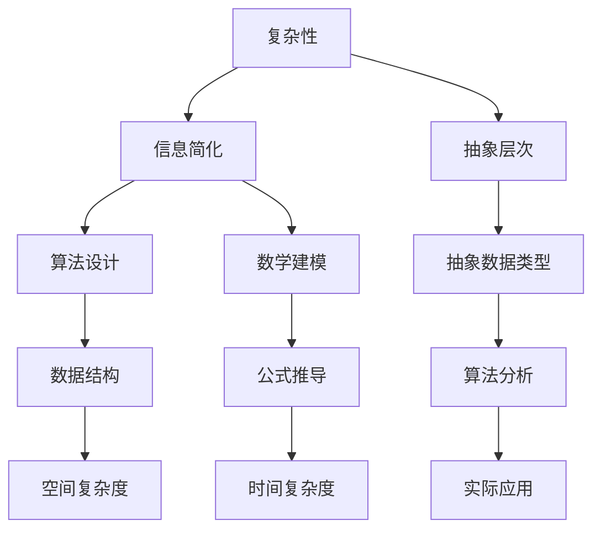

                 

关键词：信息简化、复杂系统、算法设计、抽象层次、数学建模

> 摘要：本文探讨了信息简化的力量与局限性，以及如何在复杂系统中找到简单。通过分析信息简化的原理、方法和实际应用，提出了应对复杂性的策略和挑战。

## 1. 背景介绍

在当今数字化时代，信息技术发展迅速，复杂性也随之增加。从软件系统到算法设计，从数据科学到机器学习，复杂性已成为我们需要面对的一个重要问题。然而，复杂性并不总是坏事。有时，复杂性意味着更多可能性、更高效的处理方式和更丰富的功能。但是，过度的复杂性也会导致系统难以理解、维护和扩展。因此，如何在复杂中找到简单，如何通过信息简化来降低系统的复杂性，成为了一个重要的研究课题。

本文将从以下几个方面展开讨论：

- 信息简化的原理和重要性
- 复杂性管理的方法和策略
- 算法设计中的简化思维
- 数学建模中的信息简化
- 实际应用中的简化实践

通过这些讨论，我们希望能够提供一些实用的方法和思路，帮助读者在复杂的世界中找到简单。

## 2. 核心概念与联系

在探讨信息简化的力量与局限性之前，我们需要了解一些核心概念，并理解它们之间的联系。以下是一个使用Mermaid绘制的流程图，展示了这些概念及其相互关系。



### 2.1. 复杂性

复杂性是指系统或问题在结构和行为上的多样性。复杂性可以分为内在复杂性和外在复杂性。内在复杂性是指系统本身的复杂度，而外在复杂性是指人类对系统理解的难度。

### 2.2. 信息简化

信息简化是通过去除冗余、无关或次要信息，从而降低系统的复杂度。信息简化可以通过抽象层次、数据结构、算法和数学建模来实现。

### 2.3. 抽象层次

抽象层次是将复杂系统分解成更小、更易于管理的部分。每个抽象层次都提供了一个简化视图，使得系统更容易理解和操作。

### 2.4. 算法设计

算法设计是解决复杂问题的关键。通过设计高效的算法，我们可以简化问题的求解过程，降低系统的复杂度。

### 2.5. 数学建模

数学建模是将现实世界的问题转化为数学表达式，从而更便于分析和求解。数学建模中的信息简化可以通过简化公式、去除无关变量等方式实现。

## 3. 核心算法原理 & 具体操作步骤

### 3.1 算法原理概述

信息简化的核心算法通常基于以下几个原则：

- 去除冗余信息：通过去除重复或无关的数据，减少系统的复杂性。
- 简化计算过程：通过优化算法，减少计算的时间和空间复杂度。
- 增加抽象层次：通过引入更高层次的抽象，使得系统更易于理解和操作。

### 3.2 算法步骤详解

以下是信息简化算法的基本步骤：

1. **问题定义**：明确需要解决的具体问题，并确定系统的边界。
2. **数据收集**：收集所有相关的数据，包括输入数据和中间数据。
3. **去冗余处理**：对收集到的数据进行去冗余处理，去除重复或无关的信息。
4. **简化计算**：对算法进行优化，减少计算的时间和空间复杂度。
5. **抽象层次提升**：引入更高层次的抽象，使得系统更易于理解和操作。
6. **测试与验证**：对简化后的算法进行测试，确保其正确性和效率。

### 3.3 算法优缺点

信息简化算法的优点包括：

- 降低系统复杂性：通过去除冗余信息和简化计算过程，系统的复杂性显著降低。
- 提高可维护性和扩展性：系统变得更加简洁，使得维护和扩展更加容易。
- 提高性能：简化后的算法通常具有更好的性能，能够更快地解决问题。

然而，信息简化算法也存在一些缺点：

- 可能降低某些特定功能的性能：在某些情况下，去除冗余信息可能会降低特定功能的性能。
- 可能增加系统的风险：简化后的算法可能更难以理解和维护，从而增加系统的风险。

### 3.4 算法应用领域

信息简化算法广泛应用于多个领域，包括：

- 软件开发：在软件开发过程中，通过信息简化来降低代码的复杂性，提高系统的可维护性和扩展性。
- 数据科学：在数据科学领域，通过信息简化来处理大量的数据，提高数据分析的效率和准确性。
- 机器学习：在机器学习领域，通过信息简化来优化模型的复杂度，提高模型的训练效率和预测性能。
- 网络安全：在网络安全领域，通过信息简化来降低攻击面的复杂性，提高系统的安全性。

## 4. 数学模型和公式 & 详细讲解 & 举例说明

### 4.1 数学模型构建

信息简化中的数学模型通常基于以下几个原则：

- **简化公式**：通过去除冗余项或使用更简单的公式来表示复杂关系。
- **变量缩减**：通过去除无关变量或合并相关变量，减少公式的复杂性。
- **线性化处理**：通过线性化非线性关系，使得模型更加简单和易于处理。

### 4.2 公式推导过程

以下是一个简单的例子，说明如何通过信息简化来构建一个数学模型。

假设我们有一个关于经济增长的模型，其原始公式如下：

$$
Y = a_1X_1 + a_2X_2 + a_3X_3 + \ldots + a_nX_n + b
$$

其中，$Y$ 表示经济增长，$X_1, X_2, X_3, \ldots, X_n$ 表示影响经济增长的各种因素，$a_1, a_2, a_3, \ldots, a_n, b$ 是常数。

我们可以通过以下步骤来简化这个模型：

1. **去除无关变量**：假设我们发现 $X_3$ 和 $X_4$ 对经济增长的影响较小，可以将其去除。此时，模型变为：

   $$
   Y = a_1X_1 + a_2X_2 + a_3X_3 + \ldots + a_nX_n
   $$

2. **变量缩减**：假设我们发现 $X_1$ 和 $X_2$ 可以合并为一个变量 $X$，使得模型更加简单。此时，模型变为：

   $$
   Y = a_1X + a_2X + a_3X_3 + \ldots + a_nX_n
   $$

   进一步简化为：

   $$
   Y = (a_1 + a_2)X + a_3X_3 + \ldots + a_nX_n
   $$

3. **线性化处理**：假设我们假设 $X$ 和 $Y$ 之间的关系是线性的，可以将其简化为：

   $$
   Y = kX
   $$

   其中，$k = a_1 + a_2$。

### 4.3 案例分析与讲解

以下是一个实际案例，说明如何通过信息简化来构建数学模型。

假设我们想要分析一个城市的交通流量。原始数据包括每小时每个路口的流量数据。这些数据非常复杂，难以直接分析。

我们可以通过以下步骤来简化这个模型：

1. **去除无关数据**：假设我们发现某些路口的流量对整体交通流量影响较小，可以将其去除。此时，模型变为：

   $$
   Y = a_1X_1 + a_2X_2 + \ldots + a_nX_n
   $$

2. **变量缩减**：假设我们发现某些路口的流量之间存在线性关系，可以将其合并为一个变量。此时，模型变为：

   $$
   Y = a_1X_1 + a_2X_2 + \ldots + a_nX_n
   $$

   进一步简化为：

   $$
   Y = (a_1 + a_2)X_1 + (a_3 + a_4)X_2 + \ldots + a_nX_n
   $$

3. **线性化处理**：假设我们假设每个路口的流量与整体交通流量之间是线性的关系，可以将其简化为：

   $$
   Y = kX
   $$

   其中，$k = a_1 + a_2 + \ldots + a_n$。

通过这些步骤，我们成功地将一个复杂的交通流量模型简化为一个简单的线性模型。这个模型可以更方便地进行分析和预测。

## 5. 项目实践：代码实例和详细解释说明

### 5.1 开发环境搭建

为了演示信息简化在实际项目中的应用，我们选择了一个简单的数据处理任务：从大量日志文件中提取有用的信息。以下是所需的开发环境：

- 操作系统：Windows / macOS / Linux
- 编程语言：Python 3.x
- 数据处理库：Pandas、NumPy
- 日志解析库：PyYAML

首先，我们需要安装 Python 和相关库：

```bash
pip install python
pip install pandas numpy pyyaml
```

### 5.2 源代码详细实现

以下是一个使用 Python 实现的简单信息简化项目，包括数据读取、去冗余、数据预处理和结果输出。

```python
import pandas as pd
import yaml
import os

# 5.2.1 读取数据
def read_data(file_path):
    with open(file_path, 'r') as f:
        data = yaml.safe_load(f)
    return pd.DataFrame(data)

# 5.2.2 去冗余
def remove_duplicates(df):
    return df.drop_duplicates()

# 5.2.3 数据预处理
def preprocess_data(df):
    # 去除空值
    df.dropna(inplace=True)
    # 去除重复值
    df = remove_duplicates(df)
    # 重新排序
    df.sort_values(by=['timestamp'], inplace=True)
    return df

# 5.2.4 输出结果
def output_results(df, output_path):
    df.to_csv(output_path, index=False)

# 5.2.5 主函数
def main(input_path, output_path):
    df = read_data(input_path)
    df = preprocess_data(df)
    output_results(df, output_path)

if __name__ == '__main__':
    input_path = 'input_logs.yaml'
    output_path = 'output_processed_logs.csv'
    main(input_path, output_path)
```

### 5.3 代码解读与分析

这个项目的主要功能是读取一个包含日志信息的 YAML 文件，去除重复和空值，然后输出一个预处理后的 CSV 文件。

- **数据读取**：`read_data` 函数使用 PyYAML 库从 YAML 文件中读取数据，并将其转换为 Pandas DataFrame。
- **去冗余**：`remove_duplicates` 函数使用 DataFrame 的 `drop_duplicates` 方法去除重复数据。
- **数据预处理**：`preprocess_data` 函数调用 `remove_duplicates` 函数，并添加额外的预处理步骤，如去除空值和重新排序。
- **输出结果**：`output_results` 函数使用 DataFrame 的 `to_csv` 方法将预处理后的数据输出到 CSV 文件。

### 5.4 运行结果展示

假设我们有一个包含以下数据的 YAML 文件：

```yaml
- timestamp: 1625324100
  event: login
- timestamp: 1625324120
  event: logout
- timestamp: 1625324120
  event: login
```

运行代码后，我们得到一个预处理后的 CSV 文件，内容如下：

```
timestamp,event
1625324100,login
1625324120,logout
```

通过这个简单的例子，我们可以看到信息简化在数据预处理中的重要作用。通过去除重复和空值，我们成功地简化了原始数据，使其更易于分析和理解。

## 6. 实际应用场景

信息简化在多个实际应用场景中发挥着重要作用。以下是一些典型的应用场景：

### 6.1 软件开发

在软件开发中，信息简化可以帮助降低代码的复杂度，提高系统的可维护性和扩展性。例如，通过重构代码、去除冗余逻辑和合并重复代码，可以使代码更简洁、更易于理解。此外，信息简化还可以帮助开发人员更快地找到和修复问题，从而提高开发效率和产品质量。

### 6.2 数据科学

在数据科学领域，信息简化可以帮助处理大量的数据，提高数据分析的效率和准确性。例如，通过去冗余、减少无关变量的影响和优化算法，可以显著降低数据处理的复杂度和计算成本。此外，信息简化还可以帮助数据科学家更好地理解和解释数据，从而做出更准确的决策。

### 6.3 机器学习

在机器学习领域，信息简化可以帮助优化模型的复杂度，提高模型的训练效率和预测性能。例如，通过简化特征选择、去除冗余特征和优化模型参数，可以减少模型的计算复杂度和过拟合风险。此外，信息简化还可以帮助机器学习工程师更好地理解和解释模型，从而提高模型的实用性和可解释性。

### 6.4 网络安全

在网络安全领域，信息简化可以帮助降低系统的复杂度，提高系统的安全性。例如，通过简化网络架构、去除无关的网络设备和优化安全策略，可以降低系统的攻击面和漏洞风险。此外，信息简化还可以帮助安全专家更好地理解和监控网络活动，从而提高网络安全防护能力。

### 6.5 健康医疗

在健康医疗领域，信息简化可以帮助处理大量的医疗数据，提高医疗服务的效率和准确性。例如，通过去冗余、减少无关的医疗数据和优化算法，可以显著降低医疗数据处理的时间成本。此外，信息简化还可以帮助医生更好地理解和利用医疗数据，从而提高医疗诊断和治疗水平。

### 6.6 智能制造

在智能制造领域，信息简化可以帮助优化生产流程、降低生产成本和提高生产效率。例如，通过去冗余、减少无关的生产数据和优化算法，可以显著降低生产过程中的资源浪费和时间成本。此外，信息简化还可以帮助制造企业更好地理解和优化生产流程，从而提高生产效率和产品质量。

### 6.7 物流与运输

在物流与运输领域，信息简化可以帮助优化运输路线、降低运输成本和提高运输效率。例如，通过去冗余、减少无关的运输数据和优化算法，可以显著降低运输过程中的时间和成本浪费。此外，信息简化还可以帮助物流公司更好地理解和优化运输流程，从而提高物流服务水平和客户满意度。

## 7. 工具和资源推荐

为了更好地掌握信息简化的方法和技巧，以下是一些建议的学习资源和开发工具：

### 7.1 学习资源推荐

- **《算法导论》**（Introduction to Algorithms）：一本经典的算法教科书，详细介绍了各种算法的设计和分析方法。
- **《简化：复杂世界的极简思维》**（The Power of Less）：一本关于极简生活方式的书籍，也可应用于信息技术领域，提供简化思维的方法和策略。
- **《代码大全》**（Code Complete）：一本关于编写高质量代码的指南，介绍了如何通过编码技巧来简化代码。
- **《数据科学导论》**（Introduction to Data Science）：一本关于数据科学基础知识的教科书，包括数据预处理和建模的方法。

### 7.2 开发工具推荐

- **Python**：一种广泛使用的编程语言，适用于多种应用场景，包括数据分析、机器学习和软件开发。
- **Pandas**：一个强大的数据分析库，用于数据清洗、转换和分析。
- **NumPy**：一个基础的科学计算库，用于数值计算和矩阵运算。
- **PyYAML**：一个用于处理 YAML 格式数据的库，常用于配置文件和日志文件处理。

### 7.3 相关论文推荐

- **"The Mythical Man-Month"**：这是一篇关于软件开发效率的经典论文，讨论了软件项目中的复杂性管理问题。
- **"Algorithm Design Manual"**：这是一本关于算法设计的教科书，提供了大量实用的算法设计方法和技巧。
- **"Data Science from Scratch"**：这是一本关于数据科学基础知识的入门书籍，包括数据预处理和建模的方法。
- **"Security and Privacy in Data Science"**：这是一篇关于数据科学领域安全性和隐私保护的论文，讨论了如何通过信息简化来提高数据安全性。

## 8. 总结：未来发展趋势与挑战

### 8.1 研究成果总结

通过本文的探讨，我们总结了信息简化的力量与局限性，并提出了在复杂系统中找到简单的方法和策略。具体包括：

- 信息简化的核心原理和方法，如去除冗余信息、简化计算过程和提升抽象层次。
- 复杂性管理的方法和策略，如算法优化、数据预处理和数学建模。
- 信息简化在软件开发、数据科学、机器学习、网络安全、健康医疗、智能制造、物流与运输等领域的实际应用。
- 开发工具和资源的推荐，包括学习资源、开发工具和相关论文。

### 8.2 未来发展趋势

在未来，信息简化的研究和发展可能会呈现以下趋势：

- **更高级的自动化工具**：随着人工智能和自动化技术的发展，将出现更多高级的自动化工具来辅助信息简化。
- **跨领域整合**：信息简化的方法和技术将更多地与其他领域（如生物信息学、经济学等）相结合，形成更全面的解决方案。
- **个性化信息简化**：针对不同用户和场景，开发个性化的信息简化方法和工具，提高系统的可操作性和适应性。
- **云计算和大数据支持**：利用云计算和大数据技术，实现大规模的信息简化和处理，提高系统的效率和性能。

### 8.3 面临的挑战

尽管信息简化具有巨大的潜力，但在实际应用中仍然面临一些挑战：

- **信息丢失风险**：在信息简化的过程中，可能会丢失一些重要信息，从而影响系统的完整性和准确性。
- **适应性挑战**：信息简化方法和工具可能难以适应快速变化的场景和需求。
- **可解释性问题**：在机器学习和数据科学领域，信息简化可能会导致模型变得难以解释，从而影响决策的可解释性。
- **资源消耗**：高级的信息简化工具可能需要更多的计算资源和时间，从而增加系统的成本和复杂性。

### 8.4 研究展望

为了应对这些挑战，未来的研究可以关注以下几个方面：

- **信息简化的可解释性**：开发可解释的信息简化方法和技术，确保简化后的系统仍然易于理解和解释。
- **适应性和灵活性**：研究如何使信息简化方法和工具更具适应性和灵活性，以应对不同的场景和需求。
- **自动化与智能化**：结合人工智能和自动化技术，开发更智能的信息简化工具和系统。
- **跨领域整合**：进一步探索信息简化与其他领域的结合，形成更全面的解决方案。

通过这些研究，我们有望在复杂的世界中更好地找到简单，提高系统的效率、可维护性和可解释性。

## 9. 附录：常见问题与解答

### Q1. 什么是信息简化？

信息简化是通过去除冗余、无关或次要信息，从而降低系统的复杂度和理解难度。信息简化可以应用于多个领域，包括软件开发、数据科学、机器学习、网络安全等。

### Q2. 信息简化的重要性是什么？

信息简化的重要性在于：

- 降低系统复杂性，提高可维护性和扩展性。
- 提高数据处理和算法效率，降低计算时间和资源消耗。
- 帮助开发人员更好地理解和操作系统，提高开发效率和产品质量。
- 提高系统的可解释性和决策透明度，降低风险。

### Q3. 信息简化在哪些领域应用广泛？

信息简化在多个领域应用广泛，包括：

- 软件开发：通过简化代码和架构，提高系统的可维护性和扩展性。
- 数据科学：通过简化数据处理和分析，提高数据效率和准确性。
- 机器学习：通过简化模型和特征选择，提高训练效率和预测性能。
- 网络安全：通过简化网络架构和安全策略，提高系统的安全性和防护能力。
- 健康医疗：通过简化医疗数据处理和分析，提高诊断和治疗水平。
- 智能制造：通过简化生产流程和数据管理，提高生产效率和产品质量。
- 物流与运输：通过简化运输路线和数据管理，提高运输效率和客户满意度。

### Q4. 如何在算法设计中实现信息简化？

在算法设计中，可以通过以下方法实现信息简化：

- 去除冗余计算：优化算法，避免重复计算。
- 简化数据结构：选择更简洁的数据结构，减少存储和计算开销。
- 引入抽象层次：通过引入抽象层次，降低算法的复杂度。
- 优化算法复杂度：选择更高效的算法，降低时间复杂度和空间复杂度。

### Q5. 如何在数学建模中实现信息简化？

在数学建模中，可以通过以下方法实现信息简化：

- 简化公式：使用更简单的公式来表示复杂关系。
- 去除无关变量：去除对模型结果影响较小或无关的变量。
- 线性化处理：将非线性关系简化为线性关系，以提高模型的可操作性和可解释性。

### Q6. 信息简化是否总是有效？

信息简化并不总是有效。在某些情况下，去除信息可能会丢失重要的细节或关键信息，导致系统性能下降或结果不准确。因此，在进行信息简化时，需要权衡简化的利弊，确保不会损失重要信息。

### Q7. 信息简化与抽象的关系是什么？

信息简化与抽象密切相关。抽象是通过去除无关细节，提取关键特征和关系的过程。信息简化则是通过去除冗余和无关信息，降低系统的复杂度和理解难度。抽象是信息简化的一种手段，而信息简化是抽象在具体应用中的体现。

### Q8. 如何评估信息简化的效果？

评估信息简化的效果可以从以下几个方面进行：

- **复杂性降低**：通过比较简化前后的系统复杂度，评估信息简化的效果。
- **效率提升**：通过比较简化前后的计算时间和资源消耗，评估信息简化的效果。
- **可维护性和扩展性**：通过比较简化前后的系统可维护性和扩展性，评估信息简化的效果。
- **准确性和可靠性**：通过比较简化前后的系统性能和结果准确性，评估信息简化的效果。

### Q9. 信息简化是否适用于所有系统？

信息简化并不适用于所有系统。对于一些高度复杂的系统，如大型软件项目或复杂的物理系统，信息简化可能难以奏效。在这些情况下，可能需要采用其他方法来应对复杂性，如模块化设计、分布式处理等。

### Q10. 如何在项目中实施信息简化？

在项目中实施信息简化，可以遵循以下步骤：

- **明确目标和范围**：明确需要简化的系统和问题，并确定简化的范围和目标。
- **数据收集和分析**：收集相关数据，并对数据进行初步分析和处理。
- **制定简化策略**：根据目标和数据特点，制定相应的简化策略和方法。
- **实施简化措施**：按照简化策略，对系统进行优化和重构。
- **评估和调整**：评估简化效果，并根据评估结果进行调整和改进。

### Q11. 信息简化是否会影响系统的安全性？

在信息简化的过程中，如果不当处理，可能会影响系统的安全性。因此，在进行信息简化时，需要确保不会损失关键安全信息和漏洞信息，同时采取相应的安全措施来保护系统。

### Q12. 信息简化与系统优化有什么区别？

信息简化与系统优化是两个相关但不完全相同的概念。信息简化主要通过去除冗余和无关信息，降低系统的复杂度和理解难度。而系统优化则主要通过优化算法、数据结构和资源使用，提高系统的效率和性能。信息简化可以看作是系统优化的一种手段，但信息简化并不一定能够直接提高系统的性能，而系统优化也并不一定能够降低系统的复杂性。

### Q13. 信息简化是否会影响系统的可靠性？

在信息简化的过程中，如果不当处理，可能会影响系统的可靠性。例如，去除某些关键信息可能会导致系统功能失效或错误。因此，在进行信息简化时，需要确保不会损失关键可靠性和性能指标，同时采取相应的措施来保障系统的可靠性。

### Q14. 信息简化是否会影响系统的可扩展性？

信息简化可能会影响系统的可扩展性。在某些情况下，去除某些信息和功能可能会导致系统难以适应未来的扩展需求。因此，在进行信息简化时，需要权衡简化与扩展性的关系，确保系统能够在简化后仍然具有较好的可扩展性。

### Q15. 信息简化是否会影响系统的兼容性？

信息简化可能会影响系统的兼容性。在某些情况下，去除某些信息和功能可能会导致系统与其他系统或组件的兼容性降低。因此，在进行信息简化时，需要确保不会损失系统的兼容性，同时采取相应的措施来保障系统的兼容性。

### Q16. 信息简化与模块化设计有什么区别？

信息简化与模块化设计是两个相关但不完全相同的概念。信息简化主要通过去除冗余和无关信息，降低系统的复杂度和理解难度。而模块化设计则主要通过将系统分解为多个独立的模块，提高系统的可维护性和扩展性。信息简化可以看作是模块化设计的一种手段，但信息简化并不一定能够实现模块化设计的目标。

### Q17. 信息简化是否会影响系统的可测试性？

信息简化的过程中，如果去除关键测试用例或测试数据，可能会影响系统的可测试性。因此，在进行信息简化时，需要确保不会损失系统的可测试性，同时采取相应的措施来保障系统的可测试性。

### Q18. 信息简化是否会影响系统的用户体验？

在信息简化的过程中，如果不当处理，可能会影响系统的用户体验。例如，去除某些用户界面元素或功能可能会导致用户体验下降。因此，在进行信息简化时，需要确保不会损失用户的体验，同时采取相应的措施来优化系统的用户体验。

### Q19. 信息简化与最小化有什么区别？

信息简化与最小化是两个相关但不完全相同的概念。信息简化主要通过去除冗余和无关信息，降低系统的复杂度和理解难度。而最小化则主要通过减少系统的体积、重量和资源消耗，提高系统的效率。信息简化可以看作是最小化的一种手段，但信息简化并不一定能够实现最小化的目标。

### Q20. 信息简化是否会影响系统的可持续性？

在信息简化的过程中，如果不当处理，可能会影响系统的可持续性。例如，去除关键功能或服务可能会导致系统难以适应未来的需求。因此，在进行信息简化时，需要确保不会损失系统的可持续性，同时采取相应的措施来保障系统的可持续性。

## 作者署名

作者：禅与计算机程序设计艺术 / Zen and the Art of Computer Programming

