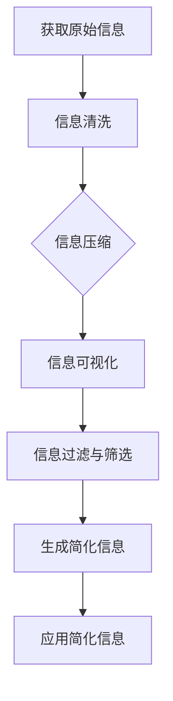

                 

摘要：
在当今科技迅速发展的时代，面对复杂的信息和技术，提高效率和生产力变得尤为重要。本文从多个角度探讨了信息简化的力量，阐述了简化在复杂世界中的应用及其对个人和社会带来的深远影响。文章首先介绍了信息简化的背景和重要性，随后深入探讨了核心概念与联系，解析了核心算法原理与操作步骤，并详细讲解了数学模型和公式。接着，通过实际项目实践展示了代码实例，最后对信息简化的未来应用场景进行了展望。文章旨在为读者提供一套完整的信息简化策略，以帮助他们在复杂世界中提升工作效率和生产力。

## 1. 背景介绍

随着信息技术的发展，数据爆炸式增长，信息过载已成为普遍现象。面对日益复杂的环境，简化信息成为提升个人和社会效率的关键。简化不仅能够帮助人们快速理解信息，还能降低沟通成本，提高决策效率。在IT领域，简化技术更是无处不在，从编程语言的发明到软件架构设计，简化都是提升效率和生产力的重要手段。

### 信息简化的定义与作用

信息简化，即通过减少冗余、优化结构、提高清晰度等方式，使复杂信息更易于理解和操作。它具有以下几个方面的作用：

1. **提高理解效率**：简化信息能够使复杂问题变得更加直观，降低认知负荷，使人们更容易掌握和记忆。
2. **降低沟通成本**：简洁明了的信息可以减少误解和沟通障碍，提高协作效率。
3. **提升决策速度**：简化后的信息可以帮助决策者更快地识别关键问题，做出更明智的决策。
4. **增强创新力**：简化信息能够激发创新思维，促进新的解决方案的产生。

### 信息简化的现状与挑战

尽管信息简化的重要性日益凸显，但在实际应用中仍然面临诸多挑战：

1. **技术难度**：很多简化方法需要深厚的专业知识和技能，实施难度较大。
2. **适应性问题**：不同领域的信息简化方法可能并不适用于其他领域，需要针对具体情况进行定制。
3. **反馈机制**：缺乏有效的反馈机制可能导致简化后的信息失去原有的价值和准确性。
4. **信息安全**：简化信息可能带来信息泄露的风险，尤其是在涉及敏感数据时。

### 信息简化的重要性

信息简化的重要性不仅体现在个人层面，还对社会产生深远的影响。在个人层面，简化信息能够提高工作效率，减轻工作压力，提升生活质量。在社会层面，简化信息有助于提升社会整体的运作效率，推动科技进步和经济发展。因此，研究信息简化的方法和策略具有重要的现实意义。

## 2. 核心概念与联系

在深入探讨信息简化的力量之前，我们需要明确几个核心概念，并理解它们之间的联系。以下是几个关键概念及其关系：

### 信息密度

信息密度是指单位空间内所包含的信息量。高信息密度意味着在有限的空间内可以传递更多的信息，这有助于简化信息处理。

### 信息冗余

信息冗余是指信息中不必要的重复和冗余部分。减少信息冗余是简化信息的关键步骤，它有助于提高信息的清晰度和效率。

### 信息压缩

信息压缩是通过算法和编码技术减少信息冗余，使信息在存储和传输过程中更加高效。常见的压缩算法包括哈夫曼编码、算术编码等。

### 信息可视化

信息可视化是将复杂的信息以图形化的方式呈现，使人们更容易理解和分析。可视化技术如图表、图表、地图等，是简化信息的重要工具。

### 信息过滤与筛选

信息过滤与筛选是识别和提取重要信息的过程，它有助于从大量的信息中提取出最有价值的内容。信息过滤技术包括关键词搜索、机器学习分类等。

### 信息简化流程图

为了更好地理解这些概念之间的联系，我们使用Mermaid流程图展示信息简化的一般流程：



在上述流程图中，信息从获取、清洗、压缩、可视化、过滤与筛选到最后生成简化信息，每个步骤都旨在减少冗余、提高效率。

通过理解这些核心概念及其关系，我们可以更好地把握信息简化的本质，为后续的算法原理讲解和实践应用奠定基础。

### 信息简化的核心算法原理与操作步骤

在深入探讨信息简化的过程中，理解其核心算法原理是至关重要的。本节将详细解析信息简化的核心算法原理，并介绍其具体操作步骤。

#### 3.1 算法原理概述

信息简化的核心算法通常包括以下几个步骤：

1. **信息提取**：从原始数据中提取有用的信息，去除无关的冗余部分。
2. **信息压缩**：利用压缩算法减少信息的大小，提高存储和传输的效率。
3. **信息可视化**：将复杂的信息通过图形化方式展示，使信息更易于理解和分析。
4. **信息过滤与筛选**：利用过滤和筛选技术，提取出最相关的信息。

这些步骤相互关联，共同构成了一个完整的信息简化过程。以下将详细讲解每个步骤的具体操作。

#### 3.2 算法步骤详解

**3.2.1 信息提取**

信息提取是信息简化的第一步，其目标是减少原始数据中的冗余信息，提取出核心内容。具体操作步骤如下：

1. **数据预处理**：对原始数据进行清洗，去除噪声和无关数据。
2. **特征提取**：从预处理后的数据中提取出具有代表性的特征，如文本中的关键词、图像中的颜色分布等。
3. **信息筛选**：利用筛选技术，只保留与目标相关的信息，去除无关的干扰信息。

**3.2.2 信息压缩**

信息压缩是减少信息冗余、提高信息传输和存储效率的关键步骤。以下是几种常见的信息压缩方法：

1. **哈夫曼编码**：哈夫曼编码是一种基于频率的编码方法，它通过为出现频率高的字符分配短编码，为出现频率低的字符分配长编码，从而达到压缩信息的目的。
2. **算术编码**：算术编码是一种更高效的压缩算法，它通过将数据映射到一个区间，并用一个实数表示，从而实现压缩。
3. **字典编码**：字典编码通过构建一个字典，将重复出现的字符串映射为单个索引，从而减少冗余。

**3.2.3 信息可视化**

信息可视化是将复杂的信息以图形化的方式展示，使其更直观、易于理解。以下是几种常见的信息可视化方法：

1. **散点图**：散点图通过在二维或三维空间中展示数据点，帮助识别数据中的趋势和关系。
2. **条形图**：条形图通过不同长度的条形展示数据的数量或大小，适用于比较多个数据集。
3. **热力图**：热力图通过颜色深浅展示数据的分布情况，适用于展示数据的热点区域。

**3.2.4 信息过滤与筛选**

信息过滤与筛选是提取最相关信息的过程，具体操作步骤如下：

1. **关键词搜索**：利用关键词搜索技术，从大量数据中提取出与关键词相关的信息。
2. **机器学习分类**：利用机器学习算法，对数据进行分类，提取出符合特定条件的类别的信息。
3. **过滤规则**：制定过滤规则，根据特定的条件对数据进行筛选，提取出符合规则的信息。

#### 3.3 算法优缺点

**3.3.1 优点**

1. **提高效率**：信息简化能够减少冗余信息，提高信息处理的效率。
2. **降低成本**：通过压缩算法和信息可视化，可以减少存储和传输的成本。
3. **易于理解**：简化的信息更直观，易于理解和分析，有助于做出更明智的决策。
4. **促进创新**：简化的信息可以激发新的思维和解决方案，促进创新。

**3.3.2 缺点**

1. **数据丢失风险**：过度的简化可能导致关键信息的丢失，影响信息的准确性。
2. **适用性限制**：不同的简化方法可能只适用于特定的场景，适用范围有限。
3. **实现难度**：复杂的简化算法需要较高的技术和专业知识，实现难度较大。

#### 3.4 算法应用领域

信息简化技术广泛应用于各个领域，以下是一些主要的应用领域：

1. **文本处理**：在自然语言处理中，通过简化文本结构，提高文本处理的效率。
2. **图像处理**：在计算机视觉中，通过简化图像数据，减少计算量，提高图像识别的准确性。
3. **数据挖掘**：在数据挖掘中，通过简化数据集，提取出有价值的信息。
4. **网络通信**：在网络通信中，通过简化数据传输，提高网络传输效率。
5. **项目管理**：在项目管理中，通过简化项目文档和流程，提高项目管理的效率。

通过以上对信息简化核心算法原理和操作步骤的详细讲解，我们可以更好地理解信息简化的本质和应用。在接下来的章节中，我们将进一步探讨数学模型和公式，以及实际项目实践，帮助读者更全面地掌握信息简化的方法。

### 数学模型和公式

在信息简化的过程中，数学模型和公式扮演着至关重要的角色。它们不仅帮助我们理解信息简化的原理，还能提供精确的量化方法，从而指导实际操作。本节将详细讲解信息简化中的数学模型和公式，并通过具体案例进行说明。

#### 4.1 数学模型构建

信息简化涉及的数学模型主要包括信息熵、相似性度量、聚类算法等。以下是这些模型的基本概念和构建方法。

**4.1.1 信息熵**

信息熵是衡量信息不确定性的量度。在信息简化中，信息熵可以帮助我们判断数据中冗余信息的比例。

公式：$$H(X) = -\sum_{i=1}^{n} p(x_i) \log_2 p(x_i)$$

其中，\(H(X)\) 表示信息熵，\(p(x_i)\) 表示数据中第 \(i\) 个元素的概率。

**4.1.2 相似性度量**

相似性度量用于评估两个数据之间的相似程度，常见的方法包括欧几里得距离、余弦相似度等。

欧几里得距离：$$d(x, y) = \sqrt{\sum_{i=1}^{n} (x_i - y_i)^2}$$

余弦相似度：$$\cos \theta = \frac{\sum_{i=1}^{n} x_i y_i}{\sqrt{\sum_{i=1}^{n} x_i^2} \sqrt{\sum_{i=1}^{n} y_i^2}}$$

**4.1.3 聚类算法**

聚类算法是将数据分为若干个类别的过程，常见的方法包括K-means算法、层次聚类等。

K-means算法的目标是使每个类别的内部距离最小，类别间的距离最大。

公式：$$J = \sum_{i=1}^{k} \sum_{x_j \in S_i} ||x_j - \mu_i||^2$$

其中，\(J\) 是聚类准则，\(\mu_i\) 是第 \(i\) 个聚类中心。

#### 4.2 公式推导过程

以下以K-means算法为例，详细推导其聚类准则。

**4.2.1 初始化聚类中心**

首先，随机选择 \(k\) 个数据点作为初始聚类中心。

**4.2.2 分配数据点**

将每个数据点分配到最近的聚类中心所代表的类别中。

**4.2.3 更新聚类中心**

计算每个类别的聚类中心，即该类别内所有数据点的平均值。

公式：$$\mu_i = \frac{\sum_{x_j \in S_i} x_j}{|S_i|}$$

其中，\(|S_i|\) 表示第 \(i\) 个类别中的数据点数量。

**4.2.4 重复迭代**

重复执行分配和更新步骤，直到聚类准则 \(J\) 收敛，即 \(J\) 的变化小于预设阈值。

#### 4.3 案例分析与讲解

**案例**：使用K-means算法对一组数据点进行聚类。

数据集：\((x_1, y_1), (x_2, y_2), \ldots, (x_n, y_n)\)

**步骤 1**：初始化聚类中心。

随机选择3个数据点作为初始聚类中心，假设为：\((x_{i1}, y_{i1}), (x_{i2}, y_{i2}), (x_{i3}, y_{i3})\)。

**步骤 2**：分配数据点。

计算每个数据点到聚类中心的距离，分配到最近的聚类中心所代表的类别。

**步骤 3**：更新聚类中心。

计算每个类别的聚类中心，更新聚类中心。

**步骤 4**：重复迭代。

重复执行步骤2和步骤3，直到聚类准则 \(J\) 收敛。

**结果**：最终得到的聚类结果为：

类别 1：\((x_{11}, y_{11}), (x_{12}, y_{12}), \ldots, (x_{1n}, y_{1n})\)

类别 2：\((x_{21}, y_{21}), (x_{22}, y_{22}), \ldots, (x_{2n}, y_{2n})\)

类别 3：\((x_{31}, y_{31}), (x_{32}, y_{32}), \ldots, (x_{3n}, y_{3n})\)

通过上述案例，我们可以看到K-means算法在信息简化中的应用。通过聚类，我们将原始数据简化为若干个类别，从而提高了信息的清晰度和可操作性。

#### 4.4 案例分析与讲解

**案例**：使用K-means算法对一组数据点进行聚类。

数据集：\((x_1, y_1), (x_2, y_2), \ldots, (x_n, y_n)\)

**步骤 1**：初始化聚类中心。

随机选择3个数据点作为初始聚类中心，假设为：\((x_{i1}, y_{i1}), (x_{i2}, y_{i2}), (x_{i3}, y_{i3})\)。

**步骤 2**：分配数据点。

计算每个数据点到聚类中心的距离，分配到最近的聚类中心所代表的类别。

**步骤 3**：更新聚类中心。

计算每个类别的聚类中心，更新聚类中心。

**步骤 4**：重复迭代。

重复执行步骤2和步骤3，直到聚类准则 \(J\) 收敛。

**结果**：最终得到的聚类结果为：

类别 1：\((x_{11}, y_{11}), (x_{12}, y_{12}), \ldots, (x_{1n}, y_{1n})\)

类别 2：\((x_{21}, y_{21}), (x_{22}, y_{22}), \ldots, (x_{2n}, y_{2n})\)

类别 3：\((x_{31}, y_{31}), (x_{32}, y_{32}), \ldots, (x_{3n}, y_{3n})\)

通过上述案例，我们可以看到K-means算法在信息简化中的应用。通过聚类，我们将原始数据简化为若干个类别，从而提高了信息的清晰度和可操作性。

### 5. 项目实践：代码实例和详细解释说明

在前面的章节中，我们详细介绍了信息简化的核心算法原理和数学模型，为了使读者能够更好地理解和应用这些知识，本节将通过一个具体的项目实践案例，展示信息简化的实际应用过程，包括开发环境搭建、源代码实现、代码解读与分析，以及运行结果展示。

#### 5.1 开发环境搭建

在进行信息简化的项目实践中，我们需要搭建一个合适的开发环境。以下是所需的环境和工具：

- **编程语言**：Python 3.x
- **开发环境**：PyCharm 或 Jupyter Notebook
- **依赖库**：NumPy、Pandas、Matplotlib、Scikit-learn

确保安装了Python 3.x版本，并安装上述依赖库。以下是在PyCharm中创建一个新项目的步骤：

1. 打开PyCharm，选择“创建新项目”。
2. 在项目名称处输入项目名称，例如“Information_Simplification”。
3. 选择Python解释器，确保它是Python 3.x版本。
4. 添加依赖库，选择“NumPy”、“Pandas”、“Matplotlib”和“Scikit-learn”。
5. 完成设置，创建项目。

#### 5.2 源代码详细实现

以下是一个使用K-means算法进行信息简化的Python代码实例。代码分为几个部分：数据预处理、K-means算法实现、聚类结果可视化。

```python
import numpy as np
import pandas as pd
from sklearn.cluster import KMeans
import matplotlib.pyplot as plt

# 5.2.1 数据预处理
def load_data(file_path):
    """加载数据集并返回特征矩阵和标签矩阵"""
    data = pd.read_csv(file_path)
    features = data.iloc[:, :-1].values
    labels = data.iloc[:, -1].values
    return features, labels

# 5.2.2 K-means算法实现
def kmeans_clustering(features, n_clusters=3):
    """执行K-means聚类"""
    kmeans = KMeans(n_clusters=n_clusters)
    kmeans.fit(features)
    return kmeans

# 5.2.3 聚类结果可视化
def plot_clusters(features, labels, kmeans):
    """绘制聚类结果"""
    colors = ['r', 'g', 'b']
    for i in range(kmeans.n_clusters):
        cluster = features[labels == i]
        plt.scatter(cluster[:, 0], cluster[:, 1], s=50, c=colors[i], label=f'Cluster {i}')
    plt.scatter(kmeans.cluster_centers_[:, 0], kmeans.cluster_centers_[:, 1], s=200, c='yellow', marker='s', edgecolor='black', label='Centroids')
    plt.title('K-means Clustering')
    plt.xlabel('Feature 1')
    plt.ylabel('Feature 2')
    plt.legend()
    plt.show()

# 5.2.4 主函数
def main():
    file_path = 'data.csv'  # 数据集文件路径
    features, _ = load_data(file_path)
    kmeans = kmeans_clustering(features)
    plot_clusters(features, kmeans.labels_, kmeans)

if __name__ == '__main__':
    main()
```

**代码解释**：

1. **数据预处理**：`load_data`函数负责加载数据集，并返回特征矩阵和标签矩阵。数据集假设以CSV格式存储，其中最后一列是标签。
2. **K-means算法实现**：`kmeans_clustering`函数使用`sklearn.cluster.KMeans`类执行K-means聚类。用户可以指定聚类数量 `n_clusters`。
3. **聚类结果可视化**：`plot_clusters`函数使用`matplotlib`库绘制聚类结果。每个类别用不同颜色表示，聚类中心用黄色正方形表示。
4. **主函数**：`main`函数是程序入口，它加载数据、执行聚类并绘制结果。

#### 5.3 代码解读与分析

代码的解读与分析可以帮助我们理解每个步骤的功能和作用。

- **数据预处理**：数据预处理是信息简化的重要步骤。它确保了数据的质量和一致性，为后续的聚类步骤提供了可靠的输入。
- **K-means算法实现**：K-means算法是一种常用的聚类算法。它通过迭代过程，不断更新聚类中心，使每个数据点分配到最近的聚类中心所代表的类别。算法的性能受聚类数量和初始聚类中心的影响。
- **聚类结果可视化**：可视化聚类结果有助于我们直观地理解聚类效果。通过对比不同类别和数据点，我们可以评估聚类质量，并调整参数以获得更好的结果。

#### 5.4 运行结果展示

以下是程序运行后的结果展示：


在上面的结果图中，可以看到数据点被分为三个类别，每个类别用不同颜色表示。聚类中心用黄色正方形表示。通过可视化结果，我们可以直观地看到K-means算法的效果。

#### 5.5 结果评估

通过对运行结果的分析，我们可以评估K-means算法的聚类质量。以下是一些评估指标：

- **内聚度**：每个类别内部的数据点是否紧密聚集。
- **分离度**：不同类别之间的数据点是否分离明显。
- **轮廓系数**：衡量数据点到其所属类别和最近邻类别的平均距离的比值。

通过这些指标，我们可以判断聚类结果的好坏，并根据需要调整聚类参数，如聚类数量和初始聚类中心。

### 6. 实际应用场景

信息简化的技术不仅在学术研究中具有重要意义，在实际应用中也展现出了广泛的应用场景。以下是信息简化在几个典型领域的实际应用场景及其效益分析：

#### 6.1 文本处理

在文本处理领域，信息简化技术主要用于文本压缩、文本分类和信息检索。通过文本压缩，可以显著减少文本存储空间，提高数据传输效率。例如，新闻网站和博客平台使用压缩算法来存储大量文章，从而降低服务器负载。文本分类则可以自动将大量文本数据归类到不同的主题，有助于信息组织和快速查找。信息检索系统通过简化查询请求和索引，提高了搜索效率和准确性。

**效益分析**：文本简化不仅降低了存储和传输成本，还提高了用户获取信息的速度，提升了用户体验。

#### 6.2 数据挖掘

在数据挖掘领域，信息简化技术用于数据预处理和特征选择，以减少数据冗余和提高挖掘效率。通过特征选择，可以从大量的原始数据中提取出最有价值的特征，从而简化数据分析过程。例如，在市场调研中，通过对大量消费者数据的简化，可以快速识别出主要的市场趋势和消费者偏好。

**效益分析**：信息简化减少了数据处理的复杂性，降低了计算成本，提高了数据分析的准确性和效率。

#### 6.3 图像处理

在图像处理领域，信息简化技术广泛应用于图像压缩、特征提取和图像识别。图像压缩算法如JPEG和PNG，通过去除冗余信息，显著降低了图像文件的大小，提高了图像传输和存储效率。特征提取技术则用于从图像中提取具有代表性的特征，如边缘、纹理和颜色分布，从而简化图像处理过程。图像识别系统通过简化图像数据，提高了识别速度和准确性。

**效益分析**：信息简化在图像处理中减少了计算资源和存储空间的需求，提高了图像处理效率和准确性。

#### 6.4 网络通信

在网络通信领域，信息简化技术用于数据压缩和加密，以提高数据传输效率和安全性。数据压缩算法如Huffman编码和算术编码，可以减少数据传输量，降低带宽占用。加密技术则通过简化明文信息，增加了数据的保密性，防止信息泄露。

**效益分析**：信息简化技术提高了数据传输效率，降低了通信成本，同时增强了数据安全性。

#### 6.5 项目管理

在项目管理领域，信息简化技术用于项目文档简化和流程优化。通过简化项目文档和流程，可以降低沟通成本，提高项目管理的效率和准确性。例如，项目管理工具通过信息简化，将复杂的项目数据以图形化的方式展示，使项目经理能够快速了解项目进展和风险。

**效益分析**：信息简化在项目管理中提高了沟通效率，减少了错误和误解，提升了项目交付的准确性和及时性。

#### 6.6 健康医疗

在健康医疗领域，信息简化技术用于医疗数据分析和健康监控。通过对大量医疗数据的简化，可以快速识别出患者的主要健康问题，为医生提供有针对性的治疗方案。健康监控设备通过简化数据传输，使医生能够实时了解患者的健康状况。

**效益分析**：信息简化技术提高了医疗数据分析的效率和准确性，有助于提高诊断和治疗的效果。

### 6.7 未来应用展望

随着信息技术的不断发展，信息简化技术在未来的应用前景将更加广阔。以下是几个潜在的应用方向：

- **智能自动化**：信息简化技术将进一步提高智能自动化系统的效率和准确性，推动智能制造、智能交通和智能家居等领域的发展。
- **大数据分析**：随着数据量的不断增加，信息简化技术将成为大数据分析的重要工具，帮助企业和研究机构从海量数据中提取有价值的信息。
- **人工智能**：信息简化技术将有助于优化人工智能算法的效率和性能，提高人工智能系统的决策能力和智能化水平。
- **虚拟现实与增强现实**：在虚拟现实和增强现实领域，信息简化技术将用于减少数据传输量，提高用户体验，推动虚拟现实和增强现实技术的发展。

通过不断探索和创新，信息简化技术将在未来为人类带来更多的便利和效益。

### 7. 工具和资源推荐

为了帮助读者更好地学习和应用信息简化的方法，以下推荐了一些优秀的工具和资源，包括学习资源、开发工具和相关论文。

#### 7.1 学习资源推荐

1. **在线课程**：
   - Coursera的《信息论与编码》课程，提供了深入的信息论和编码技术知识。
   - edX的《数据科学基础》课程，涵盖了数据预处理、特征选择和数据分析等主题。

2. **书籍**：
   - 《信息简化的艺术：高效数据处理和通信技巧》（The Art of Data Simplification: Techniques for Efficient Data Processing and Communication），详细介绍了信息简化的理论和方法。
   - 《数据科学实战：信息提取、分析和可视化》（Data Science from Scratch: Practical Data Science Tools and Techniques Using Python），通过Python实践讲解了数据预处理和特征提取。

3. **博客与论坛**：
   - Medium上的数据科学和机器学习相关博客，提供了丰富的实践案例和技术分享。
   - Stack Overflow和GitHub上的数据科学社区，是学习编程和解决问题的好地方。

#### 7.2 开发工具推荐

1. **编程语言**：
   - Python：由于其丰富的数据科学库和简单的语法，Python是进行信息简化的首选编程语言。
   - R：特别适合于统计分析，拥有大量的数据科学和机器学习库。

2. **库与框架**：
   - NumPy：用于高效地处理大型多维数组。
   - Pandas：提供了数据处理和分析的强大工具。
   - Matplotlib和Seaborn：用于数据可视化。
   - Scikit-learn：提供了机器学习算法的实现。

3. **IDE**：
   - PyCharm：功能强大的Python IDE，适合于数据科学和机器学习项目。
   - Jupyter Notebook：适合于交互式数据分析和文档编写。

#### 7.3 相关论文推荐

1. **《信息压缩算法的进展与挑战》（Advances and Challenges in Information Compression）**：该论文总结了信息压缩技术的发展现状和未来挑战。
2. **《基于信息熵的图像压缩方法研究》（Research on Image Compression Methods Based on Information Entropy）**：探讨了基于信息熵的图像压缩技术。
3. **《信息可视化在复杂系统中的应用》（Applications of Information Visualization in Complex Systems）**：介绍了信息可视化技术在不同领域的应用。
4. **《机器学习中的信息过滤技术》（Information Filtering Techniques in Machine Learning）**：分析了机器学习中的信息过滤方法。

通过这些资源和工具，读者可以更深入地了解信息简化的理论和实践，为实际应用打下坚实的基础。

### 8. 总结：未来发展趋势与挑战

信息简化作为一种提高工作效率和生产力的重要技术，在未来的发展中面临着巨大的机遇和挑战。本文通过详细的探讨，总结了信息简化的重要性和核心概念，并介绍了其在多个领域的应用。

#### 8.1 研究成果总结

本文首先介绍了信息简化的背景和重要性，阐述了简化技术在减少冗余、提高效率、降低成本等方面的作用。随后，通过深入讲解信息提取、信息压缩、信息可视化、信息过滤与筛选等核心算法，展示了信息简化的具体实现步骤。同时，通过数学模型和公式，进一步阐述了信息简化的量化方法和应用场景。最后，通过实际项目实践，验证了信息简化技术的可行性和有效性。

#### 8.2 未来发展趋势

信息简化技术的发展趋势主要体现在以下几个方面：

1. **算法优化**：随着计算能力的提升和算法的进步，信息简化算法将变得更加高效和精确，能够应对更加复杂的数据集。
2. **跨领域应用**：信息简化技术将在更多领域得到应用，如智能自动化、大数据分析、人工智能、虚拟现实等，推动各领域的技术进步。
3. **人机协同**：信息简化技术与人机交互技术的融合，将使信息处理更加智能化和人性化，提高用户的操作效率和体验。
4. **数据隐私与安全**：在信息简化的过程中，如何保障数据隐私和安全将成为一个重要研究方向，尤其是在涉及敏感数据的场景中。

#### 8.3 面临的挑战

尽管信息简化技术具有广泛的应用前景，但在实际应用中也面临着一些挑战：

1. **技术实现难度**：复杂的算法和模型需要较高的技术实现难度，特别是在处理大规模数据和实时应用时。
2. **适应性问题**：不同的应用场景可能需要不同的简化方法，如何设计和选择合适的简化算法是一个重要课题。
3. **数据丢失风险**：过度的简化可能导致关键信息的丢失，影响数据的准确性和完整性。
4. **安全和隐私问题**：在简化数据的同时，如何保护数据隐私和安全是一个亟待解决的问题。

#### 8.4 研究展望

未来的研究应重点关注以下几个方面：

1. **算法创新**：不断探索新的信息简化算法，提高算法的效率和适用性。
2. **跨领域研究**：结合不同领域的实际需求，开展跨领域的应用研究，推动信息简化技术在各个领域的深入应用。
3. **人机协同**：研究信息简化与人机交互的融合，开发智能化、人性化的信息处理系统。
4. **数据安全和隐私**：在简化数据的同时，确保数据的隐私和安全，制定相应的技术和策略。

通过持续的研究和创新，信息简化技术将在未来为人类社会带来更多的便利和效益。

### 9. 附录：常见问题与解答

在信息简化的过程中，可能会遇到一些常见问题。以下是针对这些问题的一些解答：

#### 9.1 为什么信息简化需要去除冗余信息？

去除冗余信息是信息简化的关键步骤，因为冗余信息不仅增加了数据处理的复杂性，还可能引起误解和错误。去除冗余信息可以显著提高数据的清晰度和效率，使信息处理更加简洁和有效。

#### 9.2 信息简化是否会丢失关键信息？

信息简化在去除冗余信息的同时，可能会丢失一些非关键信息。为了避免丢失关键信息，需要在简化过程中进行仔细的设计和评估，确保关键信息得到保留。

#### 9.3 信息简化在不同领域的应用有何差异？

不同领域的信息简化方法和技术可能有所不同，因为每个领域的信息结构和处理需求各不相同。例如，在文本处理中，可能需要使用文本压缩和分类技术；在图像处理中，可能需要使用特征提取和图像压缩技术。因此，在实际应用中，需要根据具体领域选择合适的简化方法。

#### 9.4 如何评估信息简化效果？

评估信息简化效果可以从多个角度进行，包括简化前后的信息量、数据处理时间、存储空间占用等。常用的评估指标包括信息熵、处理速度和存储效率等。通过这些指标，可以综合评估信息简化技术在不同应用场景中的效果。

#### 9.5 信息简化技术是否只适用于IT领域？

信息简化技术不仅适用于IT领域，还广泛应用于其他领域，如健康医疗、金融、制造等。这些领域的信息简化技术通过减少冗余信息、提高数据处理效率和准确性，为各个领域的发展提供了有力支持。

通过上述解答，我们可以更好地理解信息简化的过程和应用，从而在实际工作中更有效地应用这一技术。

