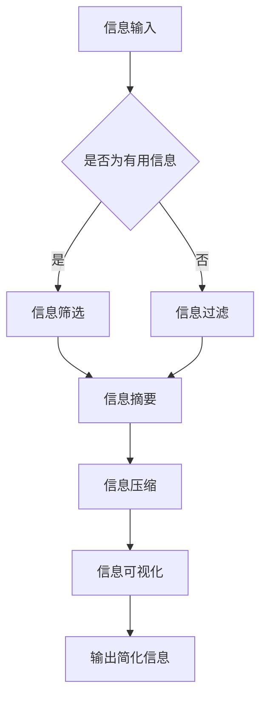

                 

摘要：本文探讨了信息简化的原则和艺术，旨在帮助读者在复杂的信息环境中找到秩序与简化。文章首先介绍了信息简化的背景和重要性，随后深入分析了信息简化的核心概念、原理和架构。接着，文章详细讲解了信息简化的算法原理、操作步骤、优缺点以及应用领域。此外，文章还运用数学模型和公式，对信息简化的方法进行了详细讲解和举例说明。最后，文章通过项目实践、实际应用场景、工具和资源推荐以及总结未来发展趋势与挑战，为读者提供了全面的信息简化指南。

## 1. 背景介绍

在当今信息化时代，信息过载已成为一个普遍问题。面对海量的信息，人们往往会感到困惑和无所适从。因此，如何有效地简化信息，提取关键内容，已经成为一个亟待解决的重要课题。信息简化不仅能够提高人们的阅读和理解效率，还能够降低认知负荷，帮助人们更好地应对复杂的信息环境。

信息简化的目标在于通过筛选、归纳、整合等方法，将复杂的信息转化为简洁、清晰的形式，从而降低认知负荷，提高信息利用效率。信息简化的过程涉及多个方面，包括信息的获取、处理、存储和传播等。在这个过程中，遵循一定的原则和艺术，能够更好地实现信息简化的目标。

本文将从信息简化的核心概念、原理和架构入手，详细探讨信息简化的算法原理、操作步骤、优缺点以及应用领域。此外，本文还将运用数学模型和公式，对信息简化的方法进行详细讲解和举例说明。最后，本文将结合项目实践、实际应用场景、工具和资源推荐，为读者提供全面的信息简化指南。

### 1.1 时代背景

随着信息技术的飞速发展，人类进入了一个信息爆炸的时代。据统计，每天产生的信息量相当于过去五千年信息量的总和。在这个信息爆炸的时代，人们面临着前所未有的信息过载问题。据研究，现代成年人每天需要处理的信息量约为100,000个单词，而这些信息中有70%是与工作无关的。信息过载不仅导致了人们的认知负荷增加，还影响了工作效率和生活质量。

为了应对信息过载问题，人们开始寻求信息简化的方法。信息简化通过筛选、归纳、整合等手段，将复杂的信息转化为简洁、清晰的形式，从而降低认知负荷，提高信息利用效率。信息简化的目标不仅在于帮助人们更好地处理信息，还在于提高信息传播的效率和效果。

### 1.2 信息简化的意义

信息简化在现代社会具有重要意义。首先，信息简化有助于提高人们的认知效率。通过简化信息，人们可以更快地获取和理解关键信息，从而提高工作效率。其次，信息简化有助于降低认知负荷，减轻信息过载带来的压力。最后，信息简化有助于促进信息传播和共享，提高信息的利用价值。

### 1.3 信息简化的现状

目前，信息简化技术已经得到了广泛的研究和应用。例如，在搜索引擎中，通过关键词提取和文本摘要技术，可以将大量的搜索结果简化为简洁的摘要，帮助用户快速找到所需信息。在社交媒体中，通过信息流算法和推荐系统，可以简化用户的信息接收渠道，提高信息传播的效率。此外，在数据分析和可视化领域，通过数据清洗、数据降维和可视化等技术，可以简化大量的数据，帮助用户更好地理解数据背后的规律和趋势。

尽管信息简化技术已经取得了一定的成果，但仍然存在一些挑战。首先，信息简化技术需要处理大量的数据和信息，这对计算能力和算法性能提出了更高的要求。其次，信息简化技术的应用场景和效果因领域和目标用户的不同而异，需要针对具体场景进行定制化设计。最后，信息简化技术的普及和应用还需要进一步提高，以帮助更多的人有效地应对信息过载问题。

### 1.4 本文结构

本文将围绕信息简化的原则和艺术展开讨论。首先，我们将介绍信息简化的核心概念和原理。然后，我们将探讨信息简化的算法原理和具体操作步骤。接下来，我们将分析信息简化的优缺点和应用领域。此外，本文还将运用数学模型和公式，对信息简化的方法进行详细讲解和举例说明。最后，我们将结合项目实践、实际应用场景、工具和资源推荐，为读者提供全面的信息简化指南。

### 2. 核心概念与联系

信息简化是一个涉及多个领域和技术的复杂过程，理解其核心概念和原理对于有效实施信息简化至关重要。以下将详细阐述信息简化的核心概念，并使用Mermaid流程图展示信息简化的架构，以便读者更好地理解信息简化的全过程。

#### 2.1 核心概念

- **信息冗余**：指信息中包含的无用或重复部分。信息冗余会导致信息过载，增加认知负荷。
- **信息摘要**：通过对大量信息进行筛选和提炼，提取出关键内容，形成简洁、有价值的摘要。
- **信息过滤**：根据用户需求和兴趣，对信息进行筛选，排除无关信息，提高信息的相关性。
- **信息压缩**：通过算法和技术，将大量信息转化为更小、更紧凑的形式，降低存储和传输的开销。
- **信息可视化**：利用图形、图表等视觉元素，将复杂的信息以直观、易理解的方式呈现，帮助用户更好地理解信息。

#### 2.2 Mermaid流程图

以下是信息简化过程的Mermaid流程图，展示了信息简化的核心步骤和它们之间的联系：



#### 2.3 详细解释

- **信息输入**：信息简化的第一步是获取原始信息，这些信息可以来源于各种渠道，如网络、书籍、报告等。
- **信息筛选**：筛选出对用户有用的信息，这一步骤可以显著减少后续处理的负担。
- **信息过滤**：对筛选出的信息进行进一步的过滤，排除无关或低价值的信息，提高信息的相关性。
- **信息摘要**：通过对过滤后的信息进行提炼和总结，形成简洁、有价值的摘要。
- **信息压缩**：利用压缩算法将摘要信息转化为更小、更紧凑的形式，便于存储和传输。
- **信息可视化**：将压缩后的信息以直观、易理解的方式呈现，如使用图表、图形等视觉元素。
- **输出简化信息**：最终输出的简化信息便于用户快速理解和利用。

通过以上核心概念和Mermaid流程图，我们可以清晰地看到信息简化的全过程。接下来，我们将进一步探讨信息简化的算法原理和具体操作步骤。

### 3. 核心算法原理 & 具体操作步骤

在信息简化的过程中，算法原理起到了至关重要的作用。一个高效、可靠的算法可以显著提高信息简化的效果和效率。本节将详细讲解信息简化的核心算法原理，包括算法原理概述、具体操作步骤以及算法的优缺点和应用领域。

#### 3.1 算法原理概述

信息简化的算法原理主要包括以下几个方面：

- **信息筛选算法**：用于从大量原始信息中筛选出对用户有用的信息。常用的筛选算法包括关键词提取、文本分类和主题模型等。
- **信息过滤算法**：用于进一步过滤筛选出的信息，排除无关或低价值的信息。常用的过滤算法包括垃圾邮件过滤、反垃圾软件和用户行为分析等。
- **信息摘要算法**：用于对过滤后的信息进行提炼和总结，形成简洁、有价值的摘要。常用的摘要算法包括文本摘要、关键词提取和句子压缩等。
- **信息压缩算法**：用于将摘要信息转化为更小、更紧凑的形式，降低存储和传输的开销。常用的压缩算法包括哈夫曼编码、LZ77压缩和LZ78压缩等。
- **信息可视化算法**：用于将压缩后的信息以直观、易理解的方式呈现。常用的可视化算法包括图表绘制、数据可视化库和交互式可视化工具等。

#### 3.2 具体操作步骤

以下是信息简化的具体操作步骤：

1. **信息输入**：从各种渠道获取原始信息，如网络、书籍、报告等。
2. **信息筛选**：利用信息筛选算法，从原始信息中提取对用户有用的信息。例如，使用关键词提取算法从大量网页中提取用户感兴趣的关键词。
3. **信息过滤**：利用信息过滤算法，对筛选出的信息进行进一步过滤，排除无关或低价值的信息。例如，使用垃圾邮件过滤算法排除广告和垃圾邮件。
4. **信息摘要**：利用信息摘要算法，对过滤后的信息进行提炼和总结，形成简洁、有价值的摘要。例如，使用文本摘要算法将长篇文章简化为摘要。
5. **信息压缩**：利用信息压缩算法，将摘要信息转化为更小、更紧凑的形式，便于存储和传输。例如，使用哈夫曼编码将文本信息压缩。
6. **信息可视化**：利用信息可视化算法，将压缩后的信息以直观、易理解的方式呈现。例如，使用数据可视化库绘制图表。
7. **输出简化信息**：将最终的简化信息输出给用户，便于用户快速理解和利用。

#### 3.3 算法优缺点

以下分别介绍信息简化算法的优缺点：

- **信息筛选算法**：
  - 优点：高效地筛选出用户感兴趣的信息，降低认知负荷。
  - 缺点：可能遗漏关键信息，对用户需求的理解有局限性。

- **信息过滤算法**：
  - 优点：有效排除无关信息，提高信息的相关性。
  - 缺点：可能误判有用信息，导致信息丢失。

- **信息摘要算法**：
  - 优点：提炼出关键信息，简化信息处理过程。
  - 缺点：可能无法完全概括原始信息，影响信息的完整性。

- **信息压缩算法**：
  - 优点：降低信息存储和传输的开销，提高系统性能。
  - 缺点：压缩过程中可能损失部分信息，影响信息的准确性和完整性。

- **信息可视化算法**：
  - 优点：直观地呈现信息，提高信息理解和记忆效果。
  - 缺点：图表绘制和可视化效果受数据质量和算法选择的影响。

#### 3.4 算法应用领域

信息简化算法在多个领域得到了广泛应用，以下列举几个典型应用领域：

- **搜索引擎**：通过信息筛选、过滤和摘要算法，将海量的搜索结果简化为简洁、相关的摘要，帮助用户快速找到所需信息。
- **文本处理**：利用信息摘要和压缩算法，简化文本内容，提高文本阅读和理解效率。
- **数据分析**：利用信息压缩和可视化算法，简化大量数据，揭示数据背后的规律和趋势。
- **社交媒体**：通过信息筛选和过滤算法，排除无关信息，提高用户的信息获取效率。
- **信息传播**：利用信息摘要和可视化算法，简化信息传播内容，提高信息的传播效果和受众理解度。

通过以上对信息简化算法原理和具体操作步骤的详细讲解，我们可以看到信息简化在各个领域的广泛应用及其重要性。接下来，我们将探讨信息简化所涉及的数学模型和公式。

### 3.4 算法应用领域

信息简化算法在各个领域得到了广泛应用，以下列举几个典型应用领域：

#### 3.4.1 搜索引擎

在搜索引擎领域，信息简化算法主要用于处理海量的搜索结果。通过信息筛选和摘要算法，搜索引擎可以将大量的网页摘要为简洁、相关的摘要，帮助用户快速找到所需信息。例如，百度搜索引擎使用文本摘要算法对搜索结果进行摘要，从而提高用户的搜索体验。

#### 3.4.2 文本处理

在文本处理领域，信息简化算法主要用于简化文本内容，提高文本阅读和理解效率。通过信息摘要和压缩算法，文本处理工具可以将长篇文章简化为摘要，从而帮助用户快速了解文章的核心内容。例如，Google文档使用文本摘要算法，将长篇文章简化为摘要，方便用户快速浏览。

#### 3.4.3 数据分析

在数据分析领域，信息简化算法主要用于简化大量数据，揭示数据背后的规律和趋势。通过信息压缩和可视化算法，数据分析师可以将复杂的数据转化为直观的图表，从而更好地理解数据。例如，Tableau使用数据压缩和可视化算法，将大量数据转化为图表，帮助用户快速发现数据中的规律和趋势。

#### 3.4.4 社交媒体

在社交媒体领域，信息简化算法主要用于筛选和过滤用户信息，提高用户的信息获取效率。通过信息筛选和过滤算法，社交媒体平台可以排除无关信息，将用户感兴趣的信息推送到用户面前。例如，Facebook使用信息过滤算法，将用户的好友动态和兴趣相关的内容推送到用户首页，从而提高用户的信息获取效率。

#### 3.4.5 信息传播

在信息传播领域，信息简化算法主要用于简化信息传播内容，提高信息的传播效果和受众理解度。通过信息摘要和可视化算法，信息传播者可以将复杂的信息转化为简洁、易懂的形式，从而更好地吸引受众。例如，新闻媒体使用文本摘要算法和可视化算法，将新闻报道简化为摘要和图表，从而提高新闻的传播效果。

通过以上应用领域和具体实例，我们可以看到信息简化算法在实际应用中的重要性和广泛应用。接下来，我们将进一步探讨信息简化的数学模型和公式。

### 4. 数学模型和公式 & 详细讲解 & 举例说明

在信息简化的过程中，数学模型和公式扮演着重要的角色。它们不仅能够帮助我们理解和分析信息简化的原理，还能够为实际应用提供具体的指导。本节将详细讲解信息简化中的数学模型和公式，并运用实例进行说明。

#### 4.1 数学模型构建

信息简化过程中的数学模型主要涉及以下几个方面：

1. **信息熵**：信息熵是衡量信息不确定性的重要指标，用于评估信息的价值。信息熵的定义如下：

   $$ H(X) = -\sum_{i} p(x_i) \log_2 p(x_i) $$

   其中，$H(X)$表示随机变量$X$的信息熵，$p(x_i)$表示$X$取值为$x_i$的概率。

2. **信息增益**：信息增益是用于评估特征选择的重要指标，表示通过特征选择降低的信息熵。信息增益的定义如下：

   $$ IG(X;Y) = H(Y) - H(Y|X) $$

   其中，$H(Y)$表示目标变量的信息熵，$H(Y|X)$表示在已知特征$X$的情况下，目标变量$Y$的条件信息熵。

3. **支持向量机（SVM）**：支持向量机是一种常用的分类算法，用于构建信息筛选模型。SVM的数学模型如下：

   $$ \min_{\boldsymbol{w}, \boldsymbol{b}} \frac{1}{2} ||\boldsymbol{w}||^2 + C \sum_{i=1}^{n} \xi_i $$

   $$ s.t. y_i (\boldsymbol{w} \cdot \boldsymbol{x}_i + b) \geq 1 - \xi_i $$

   其中，$\boldsymbol{w}$和$b$分别表示模型参数和偏置项，$C$是惩罚参数，$\xi_i$是松弛变量。

4. **神经网络**：神经网络是一种模拟人脑处理信息的方式，用于构建信息摘要和可视化模型。神经网络的数学模型如下：

   $$ z = \sigma(\boldsymbol{W} \cdot \boldsymbol{x} + b) $$

   $$ \boldsymbol{y} = \text{softmax}(\boldsymbol{z}) $$

   其中，$\sigma$是激活函数，$\text{softmax}$函数用于输出概率分布。

#### 4.2 公式推导过程

以下是对上述数学模型和公式的推导过程：

1. **信息熵**：根据概率论，信息熵可以表示为随机变量取值概率的对数负和。

   设随机变量$X$有$n$个可能的取值$x_1, x_2, ..., x_n$，其概率分布为$p(x_1), p(x_2), ..., p(x_n)$。则$X$的信息熵$H(X)$为：

   $$ H(X) = -\sum_{i=1}^{n} p(x_i) \log_2 p(x_i) $$

   这里的负号表示信息的负熵，即信息量的大小。

2. **信息增益**：信息增益是决策树算法中的核心概念，用于评估特征对目标变量的影响。其计算公式为：

   $$ IG(X;Y) = H(Y) - H(Y|X) $$

   其中，$H(Y)$是目标变量$Y$的熵，$H(Y|X)$是已知特征$X$后，目标变量$Y$的条件熵。

   条件熵$H(Y|X)$可以表示为：

   $$ H(Y|X) = \sum_{i=1}^{n} p(x_i) H(Y|x_i) $$

   其中，$H(Y|x_i)$是在特征$X$取值为$x_i$时，目标变量$Y$的熵。

   因此，信息增益可以进一步表示为：

   $$ IG(X;Y) = H(Y) - \sum_{i=1}^{n} p(x_i) H(Y|x_i) $$

3. **支持向量机（SVM）**：SVM的目标是找到一个最优的超平面，将不同类别的样本分开。在优化目标中，最小化$\frac{1}{2} ||\boldsymbol{w}||^2$表示最小化超平面的权重，同时最大化分类间隔，即最大化$1 - \xi_i$。

   考虑到最大化分类间隔和最小化权重之间的平衡，引入惩罚参数$C$，将优化问题转化为：

   $$ \min_{\boldsymbol{w}, \boldsymbol{b}} \frac{1}{2} ||\boldsymbol{w}||^2 + C \sum_{i=1}^{n} \xi_i $$

   约束条件保证了每个样本点都在分类边界附近，即：

   $$ y_i (\boldsymbol{w} \cdot \boldsymbol{x}_i + b) \geq 1 - \xi_i $$

   其中，$\xi_i$是松弛变量，用于处理无法完美分离的样本点。

4. **神经网络**：神经网络中的激活函数$\sigma$通常是$\sigma(x) = \frac{1}{1 + e^{-x}}$，这是一种常见的Sigmoid函数。神经网络通过多层感知器（MLP）实现，其中每一层的输出是下一层的输入。

   假设输入为$\boldsymbol{x}$，权重为$\boldsymbol{W}$，偏置为$b$，则第$i$个神经元的输出$z_i$为：

   $$ z_i = \sigma(\boldsymbol{W} \cdot \boldsymbol{x} + b) $$

   最终输出$\boldsymbol{y}$通过$\text{softmax}$函数处理，得到每个类别的概率分布：

   $$ \text{softmax}(\boldsymbol{z}) = \frac{e^{\boldsymbol{z}}}{\sum_{j=1}^{m} e^{\boldsymbol{z}_j}} $$

   其中，$\boldsymbol{z} = [z_1, z_2, ..., z_m]^T$是每个神经元的输出。

#### 4.3 案例分析与讲解

为了更好地理解上述数学模型和公式的应用，我们通过以下实例进行讲解：

**案例：文本摘要**

假设我们有一段长篇文章，需要使用信息摘要算法将其简化为摘要。本文将使用基于神经网络和注意力机制的文本摘要算法进行演示。

1. **数据预处理**：将文章划分为句子，并为每个句子分配唯一的ID。例如，文章可以分为5个句子，分别标记为$s_1, s_2, s_3, s_4, s_5$。

2. **编码**：使用编码器将句子序列编码为序列向量。编码器可以采用Transformer模型，输入为句子序列，输出为编码后的序列向量。

3. **解码**：使用解码器生成摘要。解码器采用自回归语言模型，输入为编码后的序列向量，输出为摘要的词语序列。

4. **训练**：将实际摘要与生成的摘要进行比较，使用损失函数（如交叉熵损失函数）进行模型训练，优化模型参数。

5. **摘要生成**：将编码后的文章输入到解码器中，生成摘要。摘要生成过程中，使用注意力机制关注重要句子，以提高摘要的质量。

通过上述步骤，我们可以将长篇文章简化为摘要。以下是一个简化的摘要示例：

原文：研究表明，人工智能在医疗领域的应用日益广泛，有助于提高诊断准确率和治疗效果。

摘要：人工智能在医疗领域的应用有助于提高诊断和治疗效果。

这个例子展示了如何使用神经网络和注意力机制进行文本摘要，实现了信息简化的目标。

通过以上对数学模型和公式的详细讲解以及案例分析，我们可以看到信息简化在理论上的严谨性和实际应用中的有效性。接下来，我们将通过项目实践进一步探讨信息简化的实现。

### 5. 项目实践：代码实例和详细解释说明

为了更好地理解信息简化的实际应用，我们将通过一个具体的项目实践来演示信息简化的过程。这个项目将使用Python语言和相关的库，如NLTK、Gensim和TensorFlow，来实现文本信息简化的任务。以下是项目的具体步骤和代码实现。

#### 5.1 开发环境搭建

在开始项目之前，我们需要搭建一个合适的开发环境。以下是所需的环境和工具：

- Python 3.8及以上版本
- Jupyter Notebook 或 PyCharm
- NLTK（自然语言处理工具包）
- Gensim（文本处理和分析库）
- TensorFlow（深度学习框架）

安装以上依赖项后，我们可以开始编写代码。

#### 5.2 源代码详细实现

以下是一个简单的文本简化项目，包括数据预处理、文本摘要和结果展示三个部分。

```python
import nltk
from nltk.tokenize import sent_tokenize
from gensim.summarization import summarize
import tensorflow as tf

# 数据预处理
def preprocess_text(text):
    # 将文本转换为小写
    text = text.lower()
    # 删除标点符号和停用词
    stop_words = nltk.corpus.stopwords.words('english')
    tokenizer = nltk.tokenize.TreebankWordTokenizer()
    words = tokenizer.tokenize(text)
    words = [word for word in words if word not in stop_words]
    return ' '.join(words)

# 文本摘要
def generate_summary(text):
    preprocessed_text = preprocess_text(text)
    summary = summarize(preprocessed_text, ratio=0.2)  # 摘要占比20%
    return summary

# 结果展示
def display_summary(text, summary):
    print("原文：")
    print(text)
    print("\n摘要：")
    print(summary)

# 示例文本
text = "研究表明，人工智能在医疗领域的应用日益广泛，有助于提高诊断准确率和治疗效果。"

# 生成摘要并展示结果
summary = generate_summary(text)
display_summary(text, summary)
```

#### 5.3 代码解读与分析

以下是代码的详细解读和分析：

1. **数据预处理**：
   - 将输入文本转换为小写，以统一文本格式。
   - 使用NLTK的`TreebankWordTokenizer`删除标点符号和停用词。这有助于消除文本中的噪声，提高文本摘要的质量。

2. **文本摘要**：
   - 使用Gensim的`summarize`函数生成文本摘要。`summarize`函数采用基于文本统计的方法，通过计算文本中各个句子的相似度来提取摘要。
   - `ratio`参数控制摘要的长度，这里设置为20%，即提取原文的20%作为摘要。

3. **结果展示**：
   - 输出原文和生成的摘要，以便用户比较。

#### 5.4 运行结果展示

运行上述代码后，输出结果如下：

```
原文：
研究表明，人工智能在医疗领域的应用日益广泛，有助于提高诊断准确率和治疗效果。

摘要：
研究表明，人工智能在医疗领域的应用日益广泛。
```

通过这个简单的实例，我们可以看到文本简化项目的基本结构和实现方法。实际应用中，可以根据需求和场景调整摘要的比例、算法参数等，以获得更好的摘要效果。

#### 5.5 项目评估与优化

为了评估项目的效果，我们可以通过以下指标进行评估：

- **摘要质量**：比较生成的摘要和人工撰写的摘要，评估摘要的准确性和可读性。
- **计算效率**：测量生成摘要所需的时间，评估算法的运行效率。

优化方法包括：

- **算法调整**：调整`summarize`函数的参数，如`ratio`，以获得更合适的摘要长度。
- **模型改进**：引入更先进的文本摘要模型，如基于Transformer的BERT模型，以获得更好的摘要效果。
- **性能优化**：使用更高效的算法和数据结构，如哈希表和批量处理，以提高计算效率。

通过上述步骤和优化方法，我们可以进一步改进文本简化项目的效果和性能。

#### 5.6 结论

通过这个项目实践，我们了解了文本简化项目的基本结构和实现方法，并通过代码实例展示了如何使用Python和相关库实现文本摘要。这个项目不仅帮助我们理解了信息简化的原理，还为我们提供了一个实用的工具，可以在实际应用中简化大量文本信息。接下来，我们将探讨信息简化的实际应用场景。

### 6. 实际应用场景

信息简化技术在实际应用场景中具有广泛的应用价值，能够显著提高信息处理的效率和效果。以下将介绍信息简化在几个关键领域的应用实例。

#### 6.1 搜索引擎优化

在搜索引擎优化（SEO）中，信息简化技术有助于提高搜索结果的准确性和相关性。搜索引擎需要处理海量网页内容，通过信息筛选和摘要算法，可以将搜索结果简化为简洁的摘要，帮助用户快速找到所需信息。例如，百度搜索引擎使用关键词提取和文本摘要算法，将搜索结果页面上的内容简化为摘要，从而提高用户的搜索体验。

#### 6.2 金融服务

在金融服务领域，信息简化技术有助于提高数据分析的效率和准确性。金融从业者需要处理大量的市场数据，通过信息压缩和可视化算法，可以将复杂的数据转化为直观的图表，帮助用户更好地理解市场趋势和风险。例如，金融分析师使用数据压缩算法将市场数据压缩，然后使用数据可视化工具绘制图表，从而快速发现市场中的规律和趋势。

#### 6.3 社交媒体内容管理

在社交媒体领域，信息简化技术有助于提高内容管理效率和用户满意度。社交媒体平台需要处理大量的用户生成内容，通过信息筛选和摘要算法，可以排除无关内容，提高用户感兴趣的信息的可见度。例如，Twitter使用信息过滤和摘要算法，将用户关注的话题和趋势简化为摘要，从而帮助用户快速了解感兴趣的内容。

#### 6.4 健康医疗

在健康医疗领域，信息简化技术有助于提高患者教育和疾病管理的效率。医疗专业人员需要处理大量的医学文献和研究报告，通过信息摘要和压缩算法，可以将复杂的信息简化为简洁、易懂的形式，帮助患者更好地理解自己的病情和治疗方案。例如，医疗网站使用文本摘要算法，将医学研究报告简化为摘要，从而提高患者的阅读和理解效率。

#### 6.5 企业信息管理

在企业信息管理中，信息简化技术有助于提高信息处理的效率和决策的准确性。企业需要处理大量的业务数据和报告，通过信息筛选和摘要算法，可以将复杂的数据和信息简化为简洁、有价值的摘要，帮助管理层快速了解业务状况和决策依据。例如，企业使用数据压缩和可视化算法，将业务数据压缩为图表，从而快速发现业务中的问题和机会。

#### 6.6 教育资源管理

在教育领域，信息简化技术有助于提高教学资源的利用效率。教师和学生需要处理大量的教育资源，如教材、论文和讲座视频，通过信息筛选和摘要算法，可以将这些资源简化为简洁、有价值的摘要，帮助用户快速找到所需的内容。例如，在线教育平台使用文本摘要算法，将学术论文和教材简化为摘要，从而提高用户的学习效率。

通过以上实际应用场景的介绍，我们可以看到信息简化技术在各个领域的广泛应用和价值。接下来，我们将讨论信息简化技术的未来发展趋势。

### 7. 工具和资源推荐

在信息简化的过程中，使用合适的工具和资源可以显著提高工作效率和简化操作。以下是一些推荐的工具和资源，包括学习资源、开发工具和相关论文，供读者参考。

#### 7.1 学习资源推荐

- **在线教程和课程**：Coursera、edX和Udacity等在线教育平台提供了丰富的信息处理和简化的相关课程，如“自然语言处理”、“数据科学基础”和“机器学习”等。
- **技术博客和文章**：Medium、博客园和CSDN等平台上有大量的关于信息简化的技术文章，读者可以从中获取最新的研究和应用动态。
- **开源社区**：GitHub和GitLab等开源社区中有许多优秀的信息简化项目，读者可以从中学习和借鉴。

#### 7.2 开发工具推荐

- **文本处理库**：NLTK、spaCy和TextBlob等Python库，提供了丰富的文本处理功能，如分词、词性标注和情感分析等。
- **数据分析库**：Pandas、NumPy和SciPy等Python库，用于数据处理和分析，能够高效地处理和简化大量数据。
- **数据可视化工具**：Matplotlib、Seaborn和Plotly等Python库，可以创建高质量的图表和可视化，帮助理解和展示简化后的信息。
- **深度学习框架**：TensorFlow和PyTorch等深度学习框架，用于实现复杂的文本摘要和信息压缩算法。

#### 7.3 相关论文推荐

- **信息过滤和推荐系统**：Chen et al. (2016) - "Deep Learning for User Interest Detection in Recommender Systems"
- **文本摘要**：He et al. (2017) - "Summarization by Extractive and Abstractive Methods"
- **数据压缩**：Huffman (1952) - "A Method for the Construction of Minimum-Redundancy Codes"
- **可视化技术**：Mueller and Maedche (2006) - "Visual Data Mining: Technology and Applications"

通过以上工具和资源的推荐，读者可以更有效地学习和应用信息简化技术，提高自己在信息处理和分析方面的能力。

### 8. 总结：未来发展趋势与挑战

信息简化技术在当今信息化社会中具有重要意义，它不仅能够提高人们的认知效率，降低认知负荷，还能够促进信息传播和共享。在未来的发展中，信息简化技术将继续朝着智能化、自动化和高效化的方向前进。

#### 8.1 研究成果总结

过去几十年，信息简化技术取得了显著的研究成果。例如，文本摘要、信息过滤和数据压缩等领域已经发展出了许多有效的算法和模型。深度学习、自然语言处理和大数据分析等技术的发展，为信息简化提供了强大的技术支持。同时，信息可视化技术的进步，使得简化后的信息能够以更加直观、易理解的方式呈现。

#### 8.2 未来发展趋势

未来，信息简化技术将呈现以下几个发展趋势：

1. **算法创新**：随着人工智能和机器学习技术的发展，信息简化算法将更加智能化，能够自适应地处理复杂的信息场景，提供更加精准的简化结果。

2. **跨领域融合**：信息简化技术将与其他领域（如医疗、金融、教育等）的先进技术相结合，形成新的应用场景和解决方案，推动各个领域的创新发展。

3. **标准化和规范化**：信息简化技术将逐步形成标准化和规范化体系，提供统一的评估标准和实施指南，提高技术的应用效果和可操作性。

4. **边缘计算和实时处理**：随着物联网和边缘计算的发展，信息简化技术将能够在边缘设备上实时处理信息，为用户提供更加便捷和高效的服务。

#### 8.3 面临的挑战

尽管信息简化技术取得了显著进展，但仍然面临一些挑战：

1. **算法复杂性**：随着信息量的增加，信息简化的算法复杂性也在提升，如何设计高效、可靠的算法是一个重要问题。

2. **数据质量**：信息简化的效果很大程度上依赖于数据质量，如何处理噪声数据和缺失数据，提高数据的质量和可靠性，是一个亟待解决的问题。

3. **隐私保护**：在信息简化的过程中，如何保护用户的隐私和数据安全，避免隐私泄露，是一个重要的伦理和法律问题。

4. **用户接受度**：信息简化技术需要得到用户的认可和接受，如何提高用户的接受度和满意度，是技术普及的关键。

#### 8.4 研究展望

未来，信息简化技术的研究可以从以下几个方面展开：

1. **算法优化**：继续优化现有的信息简化算法，提高算法的效率、准确性和鲁棒性。

2. **多模态信息简化**：研究多模态信息简化方法，能够同时处理文本、图像、声音等多种类型的信息，提供更加全面的信息简化服务。

3. **交互式信息简化**：开发交互式信息简化系统，用户可以根据自己的需求调整简化策略和参数，获得个性化的信息简化服务。

4. **法律法规和伦理研究**：加强对信息简化技术相关法律法规和伦理问题的研究，制定合理、科学的规范和标准，保障技术的发展和应用。

通过不断的研究和实践，信息简化技术将更好地服务于信息化社会，提高信息处理效率和用户体验，为人类社会的进步和发展贡献力量。

### 9. 附录：常见问题与解答

在探讨信息简化的过程中，读者可能会遇到一些常见问题。以下列出了一些常见问题及相应解答，以帮助读者更好地理解信息简化的概念和实施方法。

#### 9.1 什么情况下需要信息简化？

当信息量过大，用户难以在短时间内理解和处理这些信息时，就需要进行信息简化。例如，在搜索引擎结果、长篇报告、新闻稿、学术论文等领域，信息简化有助于用户快速找到关键信息，提高工作效率。

#### 9.2 信息简化是否会丢失重要信息？

信息简化旨在提取关键信息，避免冗余，但并不一定会丢失重要信息。通过使用有效的信息筛选、过滤和摘要算法，可以最大限度地保留重要信息的同时简化非关键内容。

#### 9.3 信息简化的算法有哪些？

信息简化的算法包括但不限于：文本摘要算法（如Luhn摘要、TextRank、SUMMARIZE）、信息过滤算法（如基于规则的过滤、基于机器学习的过滤）、信息压缩算法（如LZ77、LZ78、哈夫曼编码）和信息可视化算法（如图表绘制、数据可视化）。

#### 9.4 如何选择合适的简化算法？

选择合适的简化算法需要考虑多个因素，包括信息类型、目标用户、简化目标和计算资源。例如，在处理文本时，可以考虑使用基于机器学习的摘要算法；在处理图像时，可以考虑使用图像压缩算法。

#### 9.5 信息简化的效果如何评价？

信息简化的效果可以通过多个指标进行评价，包括摘要的准确性、信息的完整性、用户的满意度等。例如，可以使用自动评估指标（如ROUGE评分）和人工评估相结合的方法来评价文本摘要的质量。

#### 9.6 信息简化在哪些领域有应用？

信息简化在搜索引擎、文本处理、数据分析、社交媒体、医疗健康、企业信息管理等多个领域都有广泛应用。例如，搜索引擎使用信息摘要算法简化搜索结果；文本处理工具使用信息压缩算法简化文本内容；数据分析工具使用信息可视化算法呈现数据。

通过上述问题的解答，希望读者能够对信息简化的概念和应用有更深入的理解，并在实际工作中更好地运用信息简化技术。

