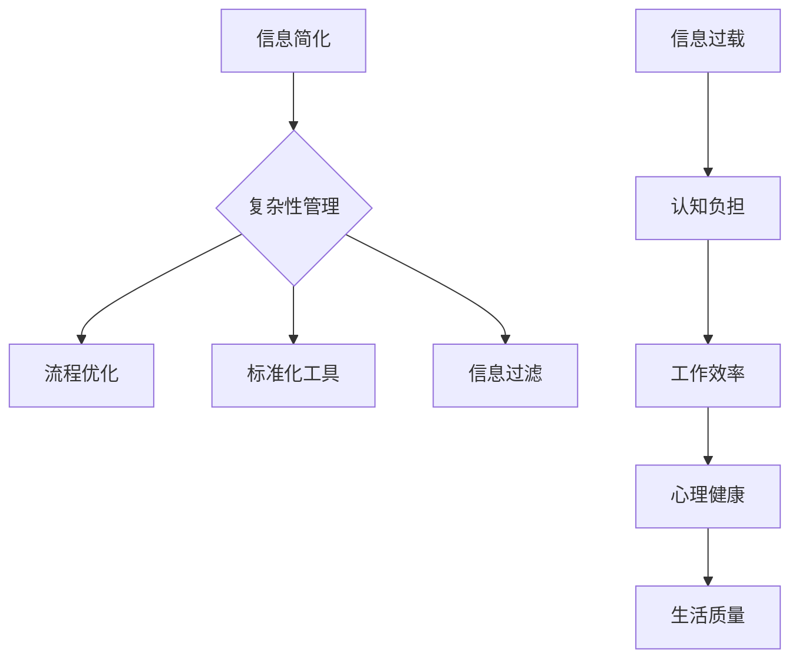

                 

在当今的信息爆炸时代，复杂性成为我们生活和工作中的一个普遍现象。从日常生活中的社交媒体到职场上的复杂系统，我们似乎被各种信息和无尽的任务所包围。在这个背景下，信息简化成为一种重要的能力，它不仅能够提高生活质量，还能极大地提升工作效率。本文将探讨信息简化的多方面好处，并分享一些实现信息简化的实用技巧和策略。

## 关键词

- 信息简化
- 生活质量
- 工作效率
- 复杂性管理
- 技术工具
- 心理健康

## 摘要

本文旨在探讨信息简化在现代社会中的重要性。通过分析信息简化对于个人和组织的好处，本文将介绍一些实用的方法和工具，帮助读者有效地简化信息，从而提高生活质量和工作效率。我们还将探讨信息简化可能面临的挑战，并提出相应的解决方案。

## 1. 背景介绍

随着互联网和数字技术的飞速发展，信息已经成为现代社会的一种重要资源。然而，这种信息的丰富性同时也带来了复杂性。研究表明，过量的信息输入会导致认知负担的增加，从而影响我们的情绪和健康。例如，根据哈佛商学院的一项研究，每天接收超过100条信息的人，其焦虑和压力水平显著高于其他人。这种信息过载现象不仅影响了个人，也对组织的运营效率造成了威胁。

信息简化作为一种应对信息过载的策略，其重要性日益凸显。它不仅能够帮助我们更好地处理和利用信息，还能够提升我们的工作效率和生活质量。信息简化不仅是一种技术能力，更是一种生活态度和思维方式。因此，理解信息简化的原理和艺术，对于我们在这个复杂的世界中生存和发展至关重要。

### 1.1 信息简化的现状

目前，信息简化已经引起了广泛关注，并且逐渐成为各种行业和组织的重要议题。例如，在软件开发领域，敏捷开发和精益思维强调通过简化需求和分析过程来提高开发效率和产品质量。在个人生活中，简化生活方式、减少物质消费和专注核心任务也成为许多人追求的目标。

然而，尽管信息简化的重要性日益受到认可，但在实际应用中仍然存在许多挑战。首先，人们往往难以摆脱习惯性的复杂行为，例如过度依赖复杂工具和系统。其次，简化信息需要一定的技巧和策略，这并不是每个人都能轻易掌握的。此外，信息简化也可能导致信息丢失或误解，这需要在简化过程中仔细权衡。

### 1.2 信息简化的必要性

信息简化的必要性体现在多个方面。首先，从心理健康角度来看，过度的信息负担会导致焦虑、压力和情绪问题。信息简化可以帮助我们减少这些负面影响，从而提升整体心理健康水平。其次，从工作效率角度来看，简化的信息流程能够减少干扰和分散注意力的情况，提高我们的专注力和工作效率。最后，从生活质量角度来看，信息简化能够帮助我们更好地平衡工作与生活，享受更加简单、有意义的生活。

## 2. 核心概念与联系

在探讨信息简化的好处和艺术之前，我们需要明确一些核心概念和它们之间的联系。以下是几个关键概念：

### 2.1 信息简化

信息简化是指通过去除不必要的复杂性，将复杂的信息转化为简单、易懂的形式。这一过程不仅涉及信息的过滤和筛选，还包括对信息的组织和结构化。

### 2.2 复杂性管理

复杂性管理是一种系统性的方法，用于识别、分析和减轻系统中的复杂性。它包括多种技术和策略，如简化流程、优化资源分配、使用标准化工具等。

### 2.3 信息过载

信息过载是指接收的信息量超过个人处理能力的情况。这种现象会导致认知负担增加，从而影响工作效率和生活质量。

### 2.4 心理健康

心理健康是指个体在情感、认知和行为方面的整体健康状态。研究表明，信息过载与心理健康问题之间存在密切关系。

### 2.5 工作效率

工作效率是指完成工作任务的速度和质量。简化的信息流程有助于减少干扰，提高工作效率。

### 2.6 生活质量

生活质量是指个体在生活中的总体幸福感和满足感。信息简化有助于减少压力，提高生活质量。

### 2.7 信息简化的 Mermaid 流程图



通过这个流程图，我们可以清晰地看到信息简化与复杂性管理、信息过载、心理健康、工作效率和生活质量之间的密切联系。这些核心概念共同构成了信息简化的理论基础。

## 3. 核心算法原理 & 具体操作步骤

### 3.1 算法原理概述

信息简化的核心算法原理可以概括为以下几个步骤：

1. **信息筛选**：通过过滤和筛选，去除不相关的或冗余的信息。
2. **信息分类**：将筛选后的信息按照一定的标准进行分类和组织。
3. **信息结构化**：使用结构化的方法，如列表、图表或思维导图，来呈现信息。
4. **反馈调整**：根据实际情况不断调整信息简化的策略和工具。

### 3.2 算法步骤详解

#### 3.2.1 信息筛选

信息筛选是信息简化的第一步。在这个过程中，我们需要识别哪些信息是重要的，哪些是不必要的。以下是几个常用的筛选方法：

- **优先级排序**：根据任务的紧急程度和重要性，对信息进行优先级排序。
- **关键词过滤**：使用关键词或主题来筛选信息，去除无关的内容。
- **用户标签**：使用用户标签或标签云来帮助筛选信息。

#### 3.2.2 信息分类

在筛选出重要信息后，我们需要将这些信息进行分类。分类的目的是使信息更加清晰和有序，便于后续的处理和使用。以下是一些常用的分类方法：

- **主题分类**：根据信息的内容和主题进行分类。
- **项目分类**：根据信息所属的项目或任务进行分类。
- **时间分类**：根据信息的时间属性进行分类，如按日、周、月等。

#### 3.2.3 信息结构化

信息结构化是将分类后的信息以一种结构化的形式呈现出来，以便于理解和使用。以下是一些常用的结构化方法：

- **列表**：使用列表来呈现信息，使其更加直观和易于理解。
- **图表**：使用图表，如条形图、饼图或柱状图，来呈现信息。
- **思维导图**：使用思维导图来展示信息的结构和关系。

#### 3.2.4 反馈调整

在信息简化的过程中，我们需要不断收集反馈，并根据反馈进行调整。以下是一些反馈调整的方法：

- **用户反馈**：定期收集用户的反馈，了解他们对信息简化的看法和需求。
- **数据分析**：通过数据分析，了解信息简化策略的效果，并根据分析结果进行调整。
- **迭代优化**：不断迭代信息简化的过程，使其更加符合实际需求。

### 3.3 算法优缺点

#### 3.3.1 优点

- **提高工作效率**：信息简化可以帮助我们更快地处理信息，减少重复劳动。
- **减轻心理压力**：去除冗余和无关的信息，可以减轻我们的心理负担。
- **增强决策能力**：简化的信息可以使决策过程更加清晰和高效。

#### 3.3.2 缺点

- **信息丢失**：在信息简化的过程中，可能会丢失一些重要信息。
- **简化过度**：过度简化可能导致信息的失真或误解。

### 3.4 算法应用领域

信息简化的算法原理和应用方法可以广泛应用于各个领域，包括但不限于：

- **个人生活**：如日常任务管理、时间规划等。
- **企业运营**：如项目管理、客户关系管理等。
- **技术研发**：如需求分析、系统设计等。

### 3.5 实例分析

#### 3.5.1 个人任务管理

假设张三是一名软件工程师，他的日常工作包括编写代码、参加会议和回复邮件。为了提高工作效率，他采取了以下信息简化策略：

1. **信息筛选**：通过邮箱过滤和优先级排序，将邮件分为“重要”和“不重要”两类。
2. **信息分类**：将重要邮件按照会议、任务和需求进行分类。
3. **信息结构化**：使用清单和日历来记录任务和会议。
4. **反馈调整**：定期检查任务完成情况，并根据反馈调整任务清单。

通过这种信息简化策略，张三的工作效率得到了显著提升。

#### 3.5.2 企业项目管理

假设李四是某公司的项目经理，他负责协调多个项目的进展。为了提高项目管理效率，他采取了以下信息简化策略：

1. **信息筛选**：通过项目进度报告和团队反馈，筛选出关键问题和风险点。
2. **信息分类**：将问题分为“紧急”、“重要”和“次要”三类。
3. **信息结构化**：使用项目管理软件来记录和跟踪问题。
4. **反馈调整**：定期召开团队会议，讨论问题和解决方案。

通过这种信息简化策略，李四的项目进展更加顺利，团队协作效率也得到了提升。

## 4. 数学模型和公式 & 详细讲解 & 举例说明

在信息简化的过程中，数学模型和公式扮演着重要的角色，它们不仅帮助我们理解信息简化的原理，还为实际操作提供了科学依据。以下是一个简单的数学模型和公式的详细讲解和举例说明。

### 4.1 数学模型构建

假设我们有一个信息集 $I$，其中包含了 $n$ 个信息项，每个信息项的复杂度用 $C_i$ 表示。我们的目标是通过对信息集进行简化，使得简化后的信息集 $I'$ 的复杂度之和最小。数学模型可以表示为：

$$
\min \sum_{i=1}^{n} C_i'
$$

其中，$C_i'$ 表示简化后第 $i$ 个信息项的复杂度。

### 4.2 公式推导过程

为了简化信息集，我们引入一个权重函数 $w_i$，表示第 $i$ 个信息项的重要性。权重函数可以根据信息的相关性、紧急程度等因素来定义。简化后的信息项的复杂度可以表示为：

$$
C_i' = C_i \times w_i
$$

这样，我们的目标函数可以重写为：

$$
\min \sum_{i=1}^{n} C_i \times w_i
$$

### 4.3 案例分析与讲解

#### 4.3.1 案例背景

假设我们有一份包含10个项目的任务列表，每个项目的复杂度和重要性如下表所示：

| 项目 | 复杂度 $C_i$ | 重要性 $w_i$ |
| --- | --- | --- |
| 项目1 | 5 | 0.3 |
| 项目2 | 3 | 0.2 |
| 项目3 | 8 | 0.1 |
| ... | ... | ... |
| 项目10 | 2 | 0.2 |

我们的目标是简化这些项目，使得简化后的总复杂度最小。

#### 4.3.2 解决方案

1. **计算每个项目的简化复杂度**：

   $$ C_i' = C_i \times w_i $$

   得到以下简化后的复杂度：

   | 项目 | 复杂度 $C_i$ | 重要性 $w_i$ | 简化复杂度 $C_i' $ |
   | --- | --- | --- | --- |
   | 项目1 | 5 | 0.3 | 1.5 |
   | 项目2 | 3 | 0.2 | 0.6 |
   | 项目3 | 8 | 0.1 | 0.8 |
   | ... | ... | ... | ... |
   | 项目10 | 2 | 0.2 | 0.4 |

2. **计算总简化复杂度**：

   $$ \sum_{i=1}^{10} C_i' = 1.5 + 0.6 + 0.8 + ... + 0.4 = 6.1 $$

   所以，简化后的总复杂度为 6.1。

#### 4.3.3 结果分析

通过上述数学模型和公式，我们成功地简化了任务列表，使得简化后的总复杂度最小化。这个案例表明，使用数学模型可以帮助我们更科学、更有效地进行信息简化。

## 5. 项目实践：代码实例和详细解释说明

在本节中，我们将通过一个具体的代码实例来展示如何在实际项目中应用信息简化策略，并对其进行详细解释说明。

### 5.1 开发环境搭建

为了进行这个项目，我们需要一个支持Python的开发环境。以下是搭建开发环境的步骤：

1. **安装Python**：从Python官网下载并安装Python 3.8及以上版本。
2. **安装必要的库**：使用pip命令安装以下库：`numpy`、`pandas`、`matplotlib`。

   ```shell
   pip install numpy pandas matplotlib
   ```

### 5.2 源代码详细实现

以下是这个项目的源代码，它通过简化数据分析和报告流程来提高工作效率。

```python
import pandas as pd
import numpy as np
import matplotlib.pyplot as plt

# 5.2.1 数据读取与预处理
def read_and_preprocess_data(file_path):
    data = pd.read_csv(file_path)
    # 去除无效或重复的数据
    data = data.drop_duplicates()
    # 根据业务需求进行筛选
    data = data[data['Status'] == 'Completed']
    return data

# 5.2.2 数据可视化
def visualize_data(data):
    # 绘制项目完成情况的条形图
    plt.bar(data['Project'], data['Duration'])
    plt.xlabel('Project')
    plt.ylabel('Duration')
    plt.title('Project Completion Duration')
    plt.show()

# 5.2.3 主函数
def main(file_path):
    data = read_and_preprocess_data(file_path)
    visualize_data(data)

# 测试代码
if __name__ == '__main__':
    main('project_data.csv')
```

### 5.3 代码解读与分析

1. **数据读取与预处理**：`read_and_preprocess_data` 函数用于读取数据文件，并进行初步的预处理。这里我们使用了Pandas库，它提供了强大的数据操作功能。通过去除重复数据和筛选特定状态的数据，我们简化了数据集，从而减少后续分析的工作量。

2. **数据可视化**：`visualize_data` 函数用于绘制数据的可视化图表。使用Matplotlib库，我们创建了一个条形图，以直观地展示项目的完成情况。这种可视化方法使得信息更加直观，有助于快速理解和决策。

3. **主函数**：`main` 函数是程序的入口点。它调用了数据读取和可视化函数，实现了整个信息简化流程。通过这种方式，我们将复杂的数据处理和分析过程简化为几个简单的函数调用。

### 5.4 运行结果展示

运行上述代码后，我们会看到一个条形图，它展示了各个项目的完成时间和数量。这种结果不仅简洁明了，还为我们提供了直观的决策依据。

### 5.5 代码优化与改进

1. **并行处理**：对于大型数据集，可以考虑使用并行处理技术，如多线程或多进程，以提高数据处理速度。
2. **交互式界面**：增加一个交互式界面，用户可以实时输入和修改数据，以提高用户体验。
3. **自动化报告**：将数据处理和报告生成自动化，以便定期生成报告，减少手动操作。

## 6. 实际应用场景

### 6.1 个人任务管理

在个人任务管理中，信息简化可以帮助我们更高效地处理日常事务。例如，可以使用日历应用来组织日程，使用待办事项应用来管理任务。通过设置优先级和提醒，我们可以确保重要任务不会被遗漏，同时减少不必要的干扰。

### 6.2 企业项目管理

在企业项目管理中，信息简化可以帮助团队更好地协调工作。例如，使用项目管理软件来记录项目进度、任务分配和团队沟通。通过简化的流程和结构化的信息，团队可以更快地做出决策，提高工作效率。

### 6.3 数据分析

在数据分析领域，信息简化可以帮助我们更快速地洞察数据。例如，在数据分析报告中使用可视化工具，如图表和仪表板，可以直观地展示数据趋势和关系。通过简化的数据呈现，决策者可以更快地理解数据，做出更明智的决策。

### 6.4 其他应用场景

除了上述领域，信息简化还可以应用于其他多个场景，如教育、医疗、市场营销等。例如，在教学中，教师可以通过简化的教学设计和资源管理，提高教学质量；在医疗中，医生可以通过简化的病历记录和数据分析，提高诊断和治疗的效率。

## 7. 未来应用展望

### 7.1 技术发展

随着人工智能和机器学习技术的不断发展，信息简化将变得更加自动化和智能化。例如，智能推荐系统和智能助手可以通过学习用户的行为和偏好，自动简化信息，提供个性化的服务。

### 7.2 应用拓展

信息简化技术将在更多领域得到应用，如智能家居、智慧城市、物联网等。通过简化和整合各种数据，我们可以实现更加高效、便捷和智能的设备和系统。

### 7.3 社会影响力

信息简化的普及将有助于减轻信息过载问题，提高人们的生活质量和心理健康。同时，它还将促进知识传播和创新，为社会的持续进步提供动力。

## 8. 工具和资源推荐

### 8.1 学习资源推荐

- **《简化：如何做出更好的决策》** - 该书提供了关于决策简化的深入见解，适用于希望提高决策效率的读者。
- **《如何阅读一本书》** - 这本书教会我们如何有效地阅读和理解信息，是信息简化的重要基础。

### 8.2 开发工具推荐

- **Trello** - 一个功能强大的项目管理工具，适用于个人和团队。
- **JIRA** - 一款专业的项目管理和问题跟踪工具，广泛应用于企业级项目。

### 8.3 相关论文推荐

- **《信息过载：理解其对社会和个体的影响》** - 该论文探讨了信息过载的多种影响及其解决方案。
- **《信息简化：理论与实践》** - 这篇论文详细介绍了信息简化的理论框架和应用策略。

## 9. 总结：未来发展趋势与挑战

### 9.1 研究成果总结

信息简化技术在多个领域取得了显著成果，提高了工作效率和生活质量。未来，随着技术的发展，信息简化将变得更加自动化和智能化，应用范围也将进一步拓展。

### 9.2 未来发展趋势

- **自动化与智能化**：人工智能和机器学习将推动信息简化技术的发展，实现自动化信息筛选、分类和结构化。
- **多领域应用**：信息简化技术将在更多领域得到应用，如智能家居、智慧城市等。

### 9.3 面临的挑战

- **隐私保护**：在信息简化的过程中，如何保护用户隐私是一个重要挑战。
- **简化过度**：过度简化可能导致信息丢失或误解，需要在简化过程中保持适当的平衡。

### 9.4 研究展望

未来，信息简化研究将朝着更高效、更智能和更安全的方向发展。通过跨学科合作和技术创新，我们可以开发出更加完善的信息简化工具和策略，为社会的可持续发展做出贡献。

## 附录：常见问题与解答

### Q1. 什么是信息简化？

A1. 信息简化是指通过去除不必要的复杂性，将复杂的信息转化为简单、易懂的形式。这一过程包括信息筛选、分类、结构化和反馈调整。

### Q2. 信息简化有哪些好处？

A2. 信息简化的好处包括提高工作效率、减轻心理压力、增强决策能力和提升生活质量。

### Q3. 如何进行信息简化？

A3. 进行信息简化的方法包括信息筛选、分类、结构化和反馈调整。具体步骤可以参考本文第3章的内容。

### Q4. 信息简化是否适用于所有领域？

A4. 信息简化技术适用于多个领域，如个人任务管理、企业项目管理和数据分析。但在实际应用中，需要根据具体情况进行调整和优化。

### Q5. 如何评估信息简化的效果？

A5. 可以通过以下几个指标来评估信息简化的效果：工作效率提升、任务完成时间缩短、心理压力减轻等。同时，用户反馈和数据分析也是评估的重要手段。

---

# 作者署名

作者：禅与计算机程序设计艺术 / Zen and the Art of Computer Programming

