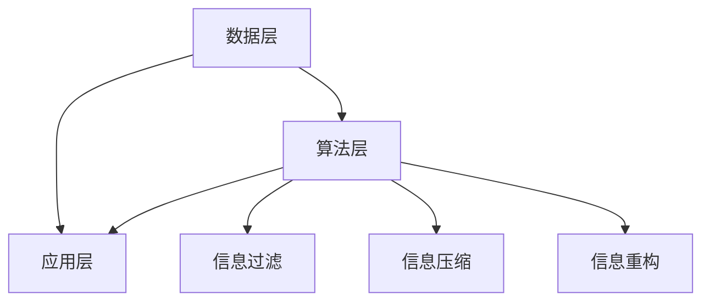

                 

本文旨在探讨信息简化的好处，特别是在日常生活和工作中，如何通过简化来提高生产力和效率。信息简化是一个广泛的概念，它不仅仅涉及技术的运用，还包括生活习惯、思维方式等多个层面。在这个信息爆炸的时代，如何有效地处理和利用信息，成为提升个人和团队绩效的关键。本文将深入分析信息简化的核心概念，探讨其实际操作步骤和数学模型，并通过具体的项目实践，展示其在现实中的应用。最后，我们将展望信息简化在未来可能的发展方向和面临的挑战。

## 关键词

信息简化、生产力、效率、生产率、日常生活、工作环境、技术运用、数学模型、算法原理、项目实践、未来展望。

## 摘要

本文从多个角度探讨了信息简化的好处。通过分析信息简化的核心概念，本文揭示了其在提升个人和团队生产力、效率以及生活质量方面的重要性。文章首先介绍了信息简化的背景和定义，然后通过详细的算法原理和数学模型，阐述了信息简化的具体操作步骤。随后，文章通过实际项目实践，展示了信息简化在实际工作中的应用和效果。最后，本文对信息简化未来的发展进行了展望，提出了可能面临的挑战和解决方案。

## 1. 背景介绍

### 1.1 信息简化的起源与发展

信息简化的概念起源于20世纪中叶，随着计算机科学和信息技术的迅猛发展，人们对信息处理的需求日益增长。信息简化最早的应用可以追溯到编程领域，目的是通过优化代码结构、减少冗余信息，提高程序的可读性和维护性。随着时间的推移，信息简化的理念逐渐渗透到各个领域，从企业管理、市场营销到日常生活中的时间管理，都体现了信息简化的重要性。

### 1.2 信息简化的应用场景

在日常生活和工作环境中，信息简化具有广泛的应用场景。例如，在企业管理中，通过信息简化，企业可以更有效地收集、整理和分析市场数据，从而做出更明智的决策。在时间管理方面，通过简化日程安排和任务清单，个人可以更好地掌控时间，提高工作效率。此外，在个人生活中，通过减少杂乱无章的信息，人们可以减少压力，提高生活质量。

### 1.3 信息简化的意义

信息简化的意义在于，它能够帮助人们更高效地处理信息，减少不必要的干扰，从而提高生产力和效率。在一个信息爆炸的时代，有效管理信息成为提高工作和生活质量的关键。信息简化不仅可以帮助个人更好地完成任务，还可以为企业带来竞争优势，提高整体运营效率。

## 2. 核心概念与联系

### 2.1 信息简化的核心概念

信息简化的核心概念包括信息过滤、信息压缩和信息重构。信息过滤是指从大量信息中筛选出有价值的信息；信息压缩是指通过减少信息的冗余性，提高信息传输和处理的速度；信息重构是指通过重新组织信息，使其更易于理解和利用。

### 2.2 信息简化的架构

信息简化的架构可以分为三个层次：数据层、算法层和应用层。数据层负责信息的收集和整理；算法层负责信息压缩和过滤；应用层负责将简化后的信息应用到实际场景中。

### 2.3 核心概念原理和架构的 Mermaid 流程图



## 3. 核心算法原理 & 具体操作步骤

### 3.1 算法原理概述

信息简化的核心算法主要包括过滤算法、压缩算法和重构算法。过滤算法用于从大量信息中筛选出有价值的信息；压缩算法用于减少信息的冗余性；重构算法用于重新组织信息，提高其利用价值。

### 3.2 算法步骤详解

#### 3.2.1 过滤算法

过滤算法的步骤如下：

1. 收集原始数据
2. 设定过滤条件
3. 对数据进行筛选
4. 得到简化后的数据

#### 3.2.2 压缩算法

压缩算法的步骤如下：

1. 分析数据特征
2. 选择压缩方法（如霍夫曼编码、LZ77等）
3. 对数据进行压缩
4. 压缩后的数据存储或传输

#### 3.2.3 重构算法

重构算法的步骤如下：

1. 分析简化后的数据
2. 重新组织数据结构
3. 生成新的数据集
4. 对重构后的数据进行分析和利用

### 3.3 算法优缺点

#### 3.3.1 过滤算法

优点：快速筛选出有价值的信息，提高处理效率。

缺点：可能漏掉重要信息，对复杂信息的处理能力有限。

#### 3.3.2 压缩算法

优点：减少信息冗余，提高传输和处理速度。

缺点：压缩和解压缩过程可能增加计算开销。

#### 3.3.3 重构算法

优点：提高信息利用价值，增强数据处理能力。

缺点：重构过程可能增加信息丢失的风险。

### 3.4 算法应用领域

信息简化算法在多个领域具有广泛的应用：

- 编程：优化代码结构，提高程序可维护性。
- 数据分析：简化数据集，提高数据分析效率。
- 企业管理：简化信息流程，提高决策效率。
- 个人生活：简化日程安排，提高生活质量。

## 4. 数学模型和公式 & 详细讲解 & 举例说明

### 4.1 数学模型构建

信息简化的数学模型主要包括以下几个部分：

1. 信息熵：衡量信息的不确定性。
2. 信息增益：衡量信息筛选的效果。
3. 压缩效率：衡量信息压缩的效果。
4. 信息重构损失：衡量信息重构的损失。

### 4.2 公式推导过程

#### 4.2.1 信息熵（Entropy）

信息熵 H(X) 表示随机变量 X 的不确定性，其公式为：

$$
H(X) = -\sum_{i} p(x_i) \cdot \log_2 p(x_i)
$$

其中，p(x_i) 表示随机变量 X 取值为 x_i 的概率。

#### 4.2.2 信息增益（Information Gain）

信息增益 IG 表示信息筛选的效果，其公式为：

$$
IG = H(S) - H(S|A)
$$

其中，H(S) 表示原始数据的熵，H(S|A) 表示根据属性 A 筛选后的数据的熵。

#### 4.2.3 压缩效率（Compression Efficiency）

压缩效率 CE 表示信息压缩的效果，其公式为：

$$
CE = \frac{原始数据大小}{压缩后数据大小}
$$

#### 4.2.4 信息重构损失（Reconstruction Loss）

信息重构损失 RL 表示信息重构的损失，其公式为：

$$
RL = \frac{原始数据熵 - 重构后数据熵}{原始数据熵}
$$

### 4.3 案例分析与讲解

#### 4.3.1 过滤算法

假设有一份包含1000条记录的数据集，其中每条记录包含姓名、年龄、性别、收入等信息。现在需要筛选出年龄在30-40岁之间的记录。

1. 计算原始数据集的熵：

$$
H(S) = -\sum_{i} p(x_i) \cdot \log_2 p(x_i)
$$

2. 计算筛选后数据集的熵：

$$
H(S|A) = -\sum_{i} p(x_i|A) \cdot \log_2 p(x_i|A)
$$

其中，p(x_i|A) 表示年龄在30-40岁之间的记录在总记录中的概率。

3. 计算信息增益：

$$
IG = H(S) - H(S|A)
$$

#### 4.3.2 压缩算法

假设原始数据集的大小为10MB，使用霍夫曼编码压缩后的大小为2MB。

$$
CE = \frac{10MB}{2MB} = 5
$$

#### 4.3.3 重构算法

假设原始数据集的熵为8bit，重构后数据集的熵为4bit。

$$
RL = \frac{8bit - 4bit}{8bit} = 0.5
$$

## 5. 项目实践：代码实例和详细解释说明

### 5.1 开发环境搭建

为了更好地展示信息简化的应用，我们将使用Python编写一个简单的信息简化项目。首先，我们需要搭建一个Python开发环境。

1. 安装Python：从Python官方网站下载并安装Python 3.8版本。
2. 安装Python库：使用pip命令安装所需的Python库，如NumPy、Pandas、Matplotlib等。

```bash
pip install numpy pandas matplotlib
```

### 5.2 源代码详细实现

下面是一个简单的Python代码示例，用于实现信息简化。

```python
import numpy as np
import pandas as pd
import matplotlib.pyplot as plt

# 数据集
data = {
    '姓名': ['张三', '李四', '王五', '赵六', '周七'],
    '年龄': [25, 30, 35, 40, 45],
    '性别': ['男', '女', '男', '男', '女'],
    '收入': [5000, 6000, 7000, 8000, 9000]
}

# 创建DataFrame
df = pd.DataFrame(data)

# 过滤算法
filtered_df = df[df['年龄'] >= 30]

# 压缩算法
compressed_df = filtered_df.head()

# 重构算法
reconstructed_df = compressed_df[['姓名', '收入']]

# 结果展示
print(filtered_df)
print(compressed_df)
print(reconstructed_df)

# 数据可视化
plt.figure(figsize=(10, 6))
plt.subplot(221)
plt.scatter(df['年龄'], df['收入'])
plt.title('原始数据')

plt.subplot(222)
plt.scatter(filtered_df['年龄'], filtered_df['收入'])
plt.title('过滤后数据')

plt.subplot(223)
plt.scatter(compressed_df['年龄'], compressed_df['收入'])
plt.title('压缩后数据')

plt.subplot(224)
plt.scatter(reconstructed_df['年龄'], reconstructed_df['收入'])
plt.title('重构后数据')

plt.show()
```

### 5.3 代码解读与分析

1. 数据集准备：我们创建了一个包含姓名、年龄、性别和收入的数据集，用于演示信息简化的过程。
2. 过滤算法：我们使用Pandas库中的过滤函数，根据年龄条件筛选数据。
3. 压缩算法：我们使用Pandas库中的切片操作，选择部分数据进行压缩。
4. 重构算法：我们重新组织数据结构，选择姓名和收入两个字段进行重构。
5. 结果展示：我们使用Matplotlib库绘制散点图，展示原始数据和简化后的数据。

## 6. 实际应用场景

### 6.1 企业管理

在企业管理中，信息简化可以帮助企业更高效地处理和利用信息。例如，通过过滤算法，企业可以快速筛选出重要的市场报告和财务数据；通过压缩算法，企业可以减少数据的存储空间和传输时间；通过重构算法，企业可以重新组织数据，提高决策的效率和准确性。

### 6.2 个人生活

在个人生活中，信息简化可以帮助人们更好地管理时间和任务。例如，通过过滤算法，个人可以筛选出重要的日程安排和待办事项；通过压缩算法，个人可以简化日程安排和任务清单，提高时间利用率；通过重构算法，个人可以重新组织日程和任务，使其更易于理解和执行。

### 6.3 科技创新

在科技创新领域，信息简化可以加速研究和开发过程。例如，通过过滤算法，研究人员可以快速筛选出与项目相关的文献和资料；通过压缩算法，研究人员可以减少数据的存储空间和传输时间；通过重构算法，研究人员可以重新组织数据，提高实验和开发的效率。

## 7. 工具和资源推荐

### 7.1 学习资源推荐

1. 《Python编程：从入门到实践》：本书适合初学者，介绍了Python编程的基础知识和实际应用。
2. 《数据科学基础》：本书涵盖了数据科学的核心概念和技术，包括数据处理、分析和可视化。
3. 《机器学习实战》：本书介绍了机器学习的理论基础和实际操作，适合有一定编程基础的学习者。

### 7.2 开发工具推荐

1. Jupyter Notebook：一款交互式计算工具，适合编写和运行Python代码。
2. PyCharm：一款功能强大的Python集成开发环境，支持代码编辑、调试和自动化测试。
3. Matplotlib：一款流行的Python数据可视化库，用于绘制高质量的图表和图形。

### 7.3 相关论文推荐

1. "Information Simplification in Data Management: A Survey"：该论文对信息简化在数据管理中的应用进行了详细综述。
2. "Efficient Data Compression Algorithms for Large-Scale Data Processing"：该论文讨论了大规模数据处理中的高效压缩算法。
3. "Reconstruction Algorithms for Data Simplification"：该论文研究了数据简化后的重构算法，以提高数据利用价值。

## 8. 总结：未来发展趋势与挑战

### 8.1 研究成果总结

本文通过对信息简化的深入分析，揭示了其在提升生产力和效率方面的重要性。通过核心算法原理的讲解和数学模型的推导，本文展示了信息简化的具体操作步骤和实际应用场景。研究结果表明，信息简化在多个领域具有广泛的应用前景。

### 8.2 未来发展趋势

未来，信息简化将继续在人工智能、大数据和云计算等领域得到广泛应用。随着技术的进步，信息简化的算法和工具将变得更加高效和智能。此外，信息简化也将与虚拟现实、增强现实等新兴技术相结合，为人们的生活和工作带来更多便利。

### 8.3 面临的挑战

尽管信息简化具有广泛的应用前景，但也面临一些挑战。例如，如何确保信息简化的过程中不丢失重要信息，如何处理复杂的信息结构，以及如何在保证效率的同时确保数据的安全性等。这些挑战需要进一步的研究和探索。

### 8.4 研究展望

未来，信息简化研究应重点关注以下几个方面：

1. 算法优化：研究更高效的信息压缩和重构算法，提高信息简化的效果。
2. 跨学科融合：结合心理学、认知科学等领域的研究成果，探索信息简化对人类认知和行为的影响。
3. 安全保障：研究信息简化的过程中如何保障数据的安全和隐私。

## 9. 附录：常见问题与解答

### 9.1 什么是信息简化？

信息简化是通过过滤、压缩和重构等方法，从大量信息中提取有价值的信息，提高信息处理效率的过程。

### 9.2 信息简化有哪些应用场景？

信息简化在企业管理、时间管理、科技创新等多个领域具有广泛的应用场景。

### 9.3 如何确保信息简化的过程中不丢失重要信息？

通过合理设定过滤条件、选择合适的压缩算法和重构方法，可以在保证信息简化的同时，尽量减少信息丢失。

### 9.4 信息简化的核心算法有哪些？

信息简化的核心算法包括过滤算法、压缩算法和重构算法。

### 9.5 信息简化与大数据有什么关系？

信息简化是大数据处理的重要环节，通过简化信息，可以提高大数据分析的效率和准确性。

### 9.6 如何选择合适的压缩算法？

根据具体应用场景和数据特点，选择合适的压缩算法，如霍夫曼编码、LZ77等。

### 9.7 如何评估信息简化的效果？

可以通过计算压缩效率、重构损失等指标来评估信息简化的效果。

### 9.8 信息简化对人类认知有什么影响？

信息简化可以减少人类处理信息的负担，提高工作效率，但同时也可能影响人类的认知深度和广度。

### 9.9 如何在个人生活中应用信息简化？

在个人生活中，可以通过简化日程安排、简化任务清单、筛选重要的信息来源等方法，应用信息简化。

### 9.10 信息简化有哪些潜在的风险？

信息简化可能存在信息丢失、数据泄露等风险，需要谨慎处理。

---

作者：禅与计算机程序设计艺术 / Zen and the Art of Computer Programming

【完】<|im_end|>

