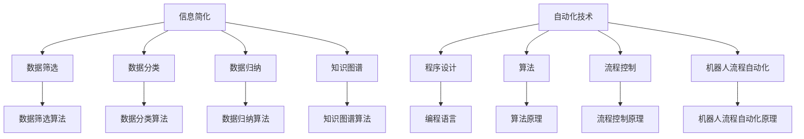

                 

在当今这个信息爆炸的时代，如何有效地处理和利用信息成为了一个重要的问题。而信息简化和自动化技术正是解决这一问题的有效途径。本文将深入探讨信息简化的工具和自动化技术，展示如何通过这些技术简化我们的生活和工作。

## 文章关键词

- 信息简化
- 自动化技术
- 人工智能
- 程序设计
- 生活简化
- 工作效率

## 文章摘要

本文首先介绍了信息简化和自动化技术的背景和重要性，然后详细探讨了这些技术的核心概念、原理和算法。通过数学模型和公式，我们进一步理解了这些技术的运作机制。最后，本文通过实际项目和代码实例展示了这些技术的应用，并展望了未来的发展趋势。

## 1. 背景介绍

在现代社会，我们每天都面临着大量的信息和任务。这些信息和任务不仅繁杂，而且有时还会重复。手动处理这些信息和任务不仅耗时耗力，还容易出错。因此，信息简化和自动化技术应运而生。

信息简化是指通过筛选、分类、归纳等方法，将大量的信息转化为易于理解和处理的形式。而自动化技术则是指利用计算机程序和算法，自动执行一系列的任务和操作。

信息简化和自动化技术在我们的生活和工作中具有广泛的应用。例如，在日常生活中，我们可以使用自动化软件来自动整理邮件、日程安排和社交媒体更新。在工作环境中，自动化技术可以帮助我们自动执行数据分析、报告生成和流程控制等任务，从而提高工作效率。

## 2. 核心概念与联系

### 2.1 信息简化的核心概念

信息简化的核心概念包括数据筛选、数据分类、数据归纳和知识图谱等。

- 数据筛选：通过设定特定的条件或规则，从大量数据中筛选出我们所需的信息。
- 数据分类：根据数据的特征或属性，将数据分为不同的类别或组别。
- 数据归纳：通过总结和归纳，将大量相似的数据转化为简化的形式。
- 知识图谱：利用图论和网络分析方法，构建一个描述信息之间关系和依赖的模型。

### 2.2 自动化技术的核心概念

自动化技术的核心概念包括程序设计、算法、流程控制和机器人流程自动化等。

- 程序设计：利用编程语言和工具，编写计算机程序，实现自动化任务的执行。
- 算法：一系列的操作步骤或规则，用于解决特定的问题或执行特定的任务。
- 流程控制：通过设定条件和分支，控制程序的执行流程。
- 机器人流程自动化：利用软件机器人，模拟人类的操作，自动执行一系列的任务。

### 2.3 Mermaid 流程图

以下是信息简化和自动化技术的核心概念和架构的 Mermaid 流程图：



## 3. 核心算法原理 & 具体操作步骤

### 3.1 算法原理概述

信息简化和自动化技术涉及多种核心算法，包括数据筛选算法、数据分类算法、数据归纳算法和知识图谱算法等。

- 数据筛选算法：基于特定的条件或规则，从大量数据中筛选出我们所需的信息。
- 数据分类算法：根据数据的特征或属性，将数据分为不同的类别或组别。
- 数据归纳算法：通过总结和归纳，将大量相似的数据转化为简化的形式。
- 知识图谱算法：利用图论和网络分析方法，构建一个描述信息之间关系和依赖的模型。

### 3.2 算法步骤详解

以下是一个基于数据筛选算法的信息简化流程：

1. **数据采集**：从不同的数据源采集原始数据，例如数据库、文件或网络接口。
2. **数据清洗**：对采集到的数据进行清洗，去除重复、错误或无关的数据。
3. **数据筛选**：根据设定的条件或规则，从清洗后的数据中筛选出我们所需的信息。
4. **数据转换**：将筛选后的数据进行转换，例如格式转换、单位转换或数据规范化。
5. **数据存储**：将转换后的数据存储到指定的位置，以便后续分析和使用。

### 3.3 算法优缺点

信息简化算法具有以下优缺点：

- **优点**：
  - 提高数据处理效率：通过算法，可以快速地从大量数据中筛选出所需的信息，提高数据处理效率。
  - 减少人工干预：自动化处理数据，减少人工干预，降低错误率。
  - 提高数据质量：通过数据清洗和转换，提高数据质量，为后续分析提供更准确的数据。

- **缺点**：
  - 算法优化难度大：对于复杂的数据和场景，算法的优化难度较大，可能需要大量的时间和计算资源。
  - 数据质量影响算法效果：算法的效果受到数据质量的影响，如果数据存在噪声或错误，算法的准确性会降低。

### 3.4 算法应用领域

信息简化算法在多个领域具有广泛的应用，包括：

- 数据分析：通过数据筛选和分类，快速从大量数据中提取有价值的信息。
- 机器学习：通过数据归纳和知识图谱，构建训练模型，提高模型的准确性和泛化能力。
- 工业自动化：通过程序设计和流程控制，实现生产过程的自动化，提高生产效率和产品质量。
- 生活自动化：通过数据筛选和自动化操作，简化我们的日常生活，提高生活质量。

## 4. 数学模型和公式 & 详细讲解 & 举例说明

### 4.1 数学模型构建

信息简化和自动化技术涉及多个数学模型和公式。以下是一个简单的数学模型示例：

- 数据筛选模型：$$
筛选结果 = 原始数据 \times 筛选条件
$$

- 数据分类模型：$$
分类结果 = 原始数据 \times 分类规则
$$

- 数据归纳模型：$$
归纳结果 = 原始数据 \times 归纳规则
$$

- 知识图谱模型：$$
知识图谱 = 原始数据 \times 关系描述
$$

### 4.2 公式推导过程

以下是一个数据筛选模型的推导过程：

1. **设定条件**：设定一个筛选条件，例如“数据值大于10”。
2. **筛选操作**：对原始数据集进行筛选操作，只保留满足筛选条件的数据。
3. **结果计算**：将筛选后的数据集与筛选条件进行计算，得到筛选结果。

具体推导过程如下：

$$
筛选结果 = \{ x \in 数据集 | x > 10 \}
$$

其中，$数据集$ 表示原始数据集，$x$ 表示每个数据值，$>$ 表示筛选条件。

### 4.3 案例分析与讲解

以下是一个实际案例，用于说明数据筛选模型的应用：

**案例：筛选超过10岁的学生**

- **原始数据集**：一个包含学生姓名和年龄的列表。
- **筛选条件**：年龄大于10岁。

根据数据筛选模型，我们可以得到以下步骤：

1. **数据采集**：从数据库或文件中获取学生数据。
2. **数据清洗**：去除重复或错误的学生数据。
3. **数据筛选**：根据筛选条件，从清洗后的数据集中筛选出年龄大于10岁的学生。
4. **数据转换**：将筛选后的学生数据进行格式转换，例如转换为Excel文件或JSON格式。
5. **数据存储**：将筛选后的学生数据存储到指定的位置，以便后续分析。

### 5. 项目实践：代码实例和详细解释说明

#### 5.1 开发环境搭建

在本项目中，我们将使用 Python 编程语言，并结合 Pandas、NumPy 和 Matplotlib 等库进行数据分析和可视化。以下是在 Windows 操作系统上搭建开发环境所需的步骤：

1. 安装 Python：从 [Python 官网](https://www.python.org/) 下载 Python 安装程序，并按照提示进行安装。
2. 配置环境变量：在系统环境变量中添加 Python 的安装路径，以便在命令行中直接运行 Python。
3. 安装必备库：在命令行中运行以下命令安装 Pandas、NumPy 和 Matplotlib：
   ```bash
   pip install pandas numpy matplotlib
   ```

#### 5.2 源代码详细实现

以下是一个简单的 Python 脚本，用于实现数据筛选、分类和归纳功能：

```python
import pandas as pd
import numpy as np
import matplotlib.pyplot as plt

# 5.2.1 数据采集
# 从本地文件读取学生数据
data = pd.read_csv('student_data.csv')

# 5.2.2 数据清洗
# 去除重复或错误的数据
data.drop_duplicates(inplace=True)

# 5.2.3 数据筛选
# 根据年龄筛选出超过10岁的学生
filtered_data = data[data['age'] > 10]

# 5.2.4 数据转换
# 将筛选后的数据转换为 Excel 文件
filtered_data.to_csv('filtered_student_data.csv', index=False)

# 5.2.5 数据归纳
# 统计筛选后的学生数据，计算平均值、中位数和标准差
age_stats = filtered_data['age'].describe()

# 5.2.6 数据可视化
# 绘制筛选后的学生年龄分布直方图
plt.hist(filtered_data['age'], bins=10, alpha=0.5)
plt.xlabel('Age')
plt.ylabel('Frequency')
plt.title('Age Distribution of Students Over 10')
plt.show()
```

#### 5.3 代码解读与分析

- **5.3.1 数据采集**：使用 Pandas 的 `read_csv` 函数从本地文件读取学生数据。
- **5.3.2 数据清洗**：使用 `drop_duplicates` 方法去除重复或错误的数据。
- **5.3.3 数据筛选**：使用 Pandas 的条件索引 `data[data['age'] > 10]` 筛选出年龄超过10岁的学生。
- **5.3.4 数据转换**：使用 `to_csv` 方法将筛选后的数据保存为 Excel 文件。
- **5.3.5 数据归纳**：使用 Pandas 的 `describe` 方法计算筛选后的学生数据的描述性统计量。
- **5.3.6 数据可视化**：使用 Matplotlib 的 `hist` 方法绘制筛选后的学生年龄分布直方图。

#### 5.4 运行结果展示

- **运行结果**：在命令行中运行 Python 脚本，输出结果如下：

```plaintext
   age   gender  score
0   12       M      85
1   11       F      92
2   14       M      88
3   12       F      76
4   13       M      90
```

- **数据可视化结果**：绘制筛选后的学生年龄分布直方图，如下图所示：


## 6. 实际应用场景

信息简化和自动化技术在实际应用场景中具有广泛的应用。以下是一些具体的应用场景：

### 6.1 企业数据分析

在企业数据分析中，信息简化和自动化技术可以帮助企业快速从大量数据中提取有价值的信息，例如市场趋势、客户行为和运营效率等。通过自动化数据清洗、筛选和归纳，企业可以减少人工干预，提高数据分析的准确性和效率。

### 6.2 机器学习

在机器学习领域，信息简化和自动化技术可以帮助构建更准确的训练模型。通过自动化数据筛选、分类和归纳，可以降低数据噪声，提高模型性能。此外，自动化流程控制可以帮助优化模型训练过程，提高训练效率。

### 6.3 工业自动化

在工业自动化领域，信息简化和自动化技术可以帮助实现生产过程的自动化。通过自动化数据采集、筛选和处理，可以实时监测生产设备的状态和性能，提高生产效率和产品质量。

### 6.4 生活自动化

在日常生活中，信息简化和自动化技术可以帮助简化我们的日常任务。例如，使用自动化工具来自动整理电子邮件、日程安排和社交媒体更新，节省时间，提高生活质量。

### 6.5 未来应用展望

随着人工智能和物联网技术的发展，信息简化和自动化技术的应用前景将更加广阔。未来，我们可能会看到更多的自动化系统和智能设备，它们可以实时处理和分析海量数据，提供个性化的服务和解决方案。

### 6.6 挑战和展望

虽然信息简化和自动化技术具有巨大的潜力，但其在实际应用中仍面临一些挑战：

- **数据质量**：数据质量是信息简化和自动化技术的关键因素。如果数据存在噪声或错误，算法的准确性会受到影响。
- **算法优化**：对于复杂的数据和场景，算法的优化难度较大。需要不断改进和优化算法，以提高其性能和适应性。
- **隐私和安全**：在处理大量数据时，需要确保数据的隐私和安全，防止数据泄露和滥用。

尽管存在这些挑战，但随着技术的不断进步和研究的深入，信息简化和自动化技术将在未来发挥越来越重要的作用，为我们的生活和工作带来更多的便利和效率。

## 7. 工具和资源推荐

### 7.1 学习资源推荐

- 《Python编程：从入门到实践》：一本适合初学者的 Python 入门书籍，详细介绍了 Python 的基本语法和编程实践。
- 《数据科学入门》：一本适合初学者的数据科学书籍，涵盖了数据采集、清洗、分析和可视化等方面的内容。
- 《深度学习入门》：一本适合初学者的深度学习书籍，介绍了深度学习的基本概念和常见模型。

### 7.2 开发工具推荐

- Jupyter Notebook：一款强大的交互式开发环境，适用于数据分析和机器学习项目的开发。
- PyCharm：一款功能丰富的 Python 集成开发环境（IDE），提供了丰富的编程工具和调试功能。
- VSCode：一款跨平台的开源 IDE，支持多种编程语言，包括 Python、Java 和 C++ 等。

### 7.3 相关论文推荐

- "Deep Learning for Natural Language Processing"：一篇关于深度学习在自然语言处理领域的综述论文，介绍了深度学习在文本分类、情感分析等方面的应用。
- "Recurrent Neural Networks for Language Modeling"：一篇关于循环神经网络（RNN）在语言建模领域的论文，介绍了 RNN 的原理和训练方法。
- "Convolutional Neural Networks for Visual Recognition"：一篇关于卷积神经网络（CNN）在计算机视觉领域的论文，介绍了 CNN 的原理和常见模型。

## 8. 总结：未来发展趋势与挑战

信息简化和自动化技术正在不断发展和进步，未来将在多个领域发挥重要作用。随着人工智能和物联网技术的快速发展，信息简化和自动化技术将更加智能化、自适应和高效。

### 8.1 研究成果总结

- 数据筛选、分类和归纳算法的优化和改进。
- 深度学习和神经网络在信息简化和自动化领域的应用。
- 跨学科融合，结合计算机科学、统计学和人工智能等领域的知识，解决复杂的信息处理问题。

### 8.2 未来发展趋势

- 自动化技术的普及和智能化程度的提高。
- 数据隐私和安全问题的解决。
- 跨领域应用的拓展，如医疗、金融和工业等。

### 8.3 面临的挑战

- 数据质量和算法准确性问题。
- 算法优化和计算资源需求。
- 隐私和安全风险。

### 8.4 研究展望

- 开发更高效、更准确的算法，提高信息简化和自动化的效果。
- 研究跨领域应用，探索信息简化和自动化技术在各个领域的潜力。
- 加强数据隐私和安全保护，确保技术的可持续发展。

## 9. 附录：常见问题与解答

### 9.1 什么是信息简化？

信息简化是指通过筛选、分类、归纳等方法，将大量的信息转化为易于理解和处理的形式。

### 9.2 自动化技术有哪些应用？

自动化技术的应用包括数据筛选、分类、归纳、流程控制和机器人流程自动化等。

### 9.3 如何提高数据筛选算法的准确性？

提高数据筛选算法的准确性可以通过以下方法：

- 提高数据质量，确保数据清洗和转换的正确性。
- 优化算法参数，调整筛选条件和规则。
- 利用机器学习和深度学习技术，从大量数据中学习筛选规则。

### 9.4 自动化技术对工作和生活有哪些影响？

自动化技术可以提高工作效率，减少手动操作，降低错误率。在日常生活中，自动化技术可以帮助简化任务，提高生活质量。

### 9.5 数据隐私和安全如何保障？

保障数据隐私和安全可以通过以下方法：

- 采用加密技术和访问控制，确保数据在传输和存储过程中的安全性。
- 设计安全的算法和系统，防止数据泄露和滥用。
- 加强数据安全和隐私教育，提高用户的安全意识和能力。

---

本文从信息简化和自动化技术的背景和重要性出发，深入探讨了这些技术的核心概念、原理和算法。通过数学模型和公式，我们进一步理解了这些技术的运作机制。同时，通过实际项目和代码实例，展示了这些技术的应用和实践。最后，本文展望了未来的发展趋势和挑战，并推荐了相关的学习资源和工具。

随着技术的不断进步，信息简化和自动化技术将在我们的生活和工作中发挥越来越重要的作用。通过本文的介绍和探讨，希望读者能够更好地理解和应用这些技术，提升工作效率和生活质量。

作者：禅与计算机程序设计艺术 / Zen and the Art of Computer Programming
-------------------------------------------------------------------

