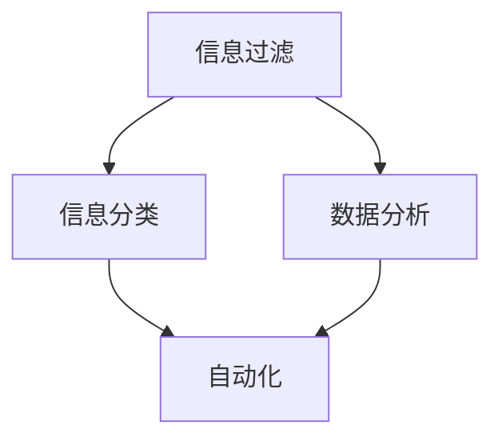

                 

关键词：信息简化，自动化，技术，工作效率，人工智能，算法

> 摘要：本文将探讨信息简化的工具和自动化技术在现代生活和工作中的应用。通过介绍各种技术和方法，我们将帮助你理解如何利用这些工具来提高工作效率，简化日常任务，并创造更多时间来专注于更有价值的事情。

## 1. 背景介绍

在当今高速发展的信息时代，信息的爆炸式增长给我们的生活和工作带来了巨大的压力。我们每天都在处理大量的电子邮件、通知、报表和各种数据。如何有效地管理和处理这些信息，成为了提高工作效率和减轻工作负担的关键。

信息简化的概念源于对信息过载问题的关注，其目的是通过过滤、分类、分析和自动化等手段，将复杂的信息转化为简洁、直观和易于处理的形式。自动化技术则通过计算机程序和智能算法，自动执行重复性高、规则明确的工作任务，从而解放人类劳动力。

本文将深入探讨信息简化和自动化的核心理念、应用场景以及如何在实际工作中应用这些技术。通过了解和掌握这些工具和方法，你可以更加高效地完成工作，提高生活质量。

## 2. 核心概念与联系

为了更好地理解信息简化和自动化的工作原理，我们首先需要了解几个核心概念：

### 2.1. 信息过滤

信息过滤是信息简化的重要步骤之一，其目的是从大量的信息源中筛选出最有价值的信息。常用的信息过滤方法包括基于规则的过滤、贝叶斯过滤、机器学习过滤等。

### 2.2. 信息分类

信息分类是将信息按照一定的标准进行归类，以便于管理和查找。信息分类的方法有基于关键字、基于内容、基于上下文等多种。

### 2.3. 数据分析

数据分析是对大量数据进行分析和处理，以发现数据中的规律和趋势。数据分析的方法包括统计方法、机器学习算法、数据挖掘技术等。

### 2.4. 自动化

自动化是指通过计算机程序和智能算法，自动完成重复性高、规则明确的工作任务。自动化的实现依赖于编程、脚本语言、工作流管理工具等。

### 2.5. Mermaid 流程图

为了更直观地理解这些概念之间的联系，我们可以使用 Mermaid 流程图来表示它们之间的关系。以下是示例流程图：



在上面的流程图中，信息过滤、信息分类和数据分析是信息简化的关键步骤，它们共同作用于原始信息，将其转化为简洁、有序的数据。这些数据随后可以被自动化工具处理，从而实现工作效率的提升。

## 3. 核心算法原理 & 具体操作步骤

### 3.1 算法原理概述

在信息简化和自动化领域，常见的算法包括机器学习算法、自然语言处理算法和工作流管理算法等。以下是这些算法的基本原理：

#### 3.1.1 机器学习算法

机器学习算法通过训练模型来识别数据中的模式和规律。常见的机器学习算法有决策树、支持向量机、神经网络等。这些算法可以用于信息过滤、分类和预测等任务。

#### 3.1.2 自然语言处理算法

自然语言处理算法用于理解和生成自然语言。常见的自然语言处理算法包括词向量表示、文本分类、情感分析等。这些算法可以用于信息分类、内容分析和智能回复等任务。

#### 3.1.3 工作流管理算法

工作流管理算法用于定义和执行一系列任务。常见的工作流管理算法包括工作流设计、任务调度、资源分配等。这些算法可以用于自动化工作流程、优化任务执行顺序等。

### 3.2 算法步骤详解

下面我们将详细解释这些算法的具体操作步骤。

#### 3.2.1 机器学习算法

1. 数据收集与预处理：收集相关数据，并进行数据清洗、去重、填充缺失值等预处理操作。
2. 特征提取：从数据中提取有用的特征，用于训练模型。
3. 模型训练：使用训练数据集训练机器学习模型。
4. 模型评估：使用验证数据集评估模型性能，调整模型参数。
5. 模型部署：将训练好的模型部署到实际应用中，用于信息过滤、分类等任务。

#### 3.2.2 自然语言处理算法

1. 数据收集与预处理：与机器学习算法相同，收集并预处理文本数据。
2. 词向量表示：将文本转换为词向量，以便于后续处理。
3. 文本分类：使用词向量表示文本，并训练分类模型。
4. 情感分析：分析文本的情感倾向，训练情感分析模型。
5. 智能回复：根据用户输入，生成合适的回复文本，训练生成模型。

#### 3.2.3 工作流管理算法

1. 工作流设计：定义任务流程，确定任务执行顺序和依赖关系。
2. 任务调度：根据任务需求和系统资源，合理调度任务执行。
3. 资源分配：优化资源利用，确保任务能够高效执行。
4. 工作流监控：实时监控工作流执行状态，确保任务顺利完成。

### 3.3 算法优缺点

每种算法都有其优缺点，以下是这些算法的主要优缺点：

#### 3.3.1 机器学习算法

**优点：**
- 可以处理大量数据，发现复杂模式和规律。
- 自动化程度高，减少人工干预。

**缺点：**
- 对数据质量要求较高，数据预处理复杂。
- 模型训练和评估过程耗时较长。

#### 3.3.2 自然语言处理算法

**优点：**
- 可以处理自然语言文本，实现智能交互。
- 应用范围广泛，如文本分类、情感分析、智能回复等。

**缺点：**
- 需要大量训练数据，数据收集和标注成本高。
- 处理效果受词向量表示方法影响较大。

#### 3.3.3 工作流管理算法

**优点：**
- 可以实现任务自动化，提高工作效率。
- 灵活性高，适用于复杂任务流程。

**缺点：**
- 设计和实现复杂，需要较高的技术水平。
- 需要与其他系统和服务集成，增加开发难度。

### 3.4 算法应用领域

这些算法在许多领域都有广泛的应用，以下是部分应用领域：

#### 3.4.1 信息过滤

- 电子邮件垃圾邮件过滤
- 社交媒体内容过滤
- 搜索引擎关键词过滤

#### 3.4.2 信息分类

- 文档分类
- 购物网站商品分类
- 邮件分类

#### 3.4.3 数据分析

- 商业智能分析
- 医疗数据分析
- 金融数据分析

#### 3.4.4 自动化

- 工作流自动化
- 机器人流程自动化（RPA）
- 智能家居自动化

## 4. 数学模型和公式 & 详细讲解 & 举例说明

### 4.1 数学模型构建

在信息简化和自动化的过程中，数学模型起到了关键作用。以下是一个简单的数学模型构建过程：

#### 4.1.1 数据预处理

假设我们有一组数据 \(X = \{x_1, x_2, ..., x_n\}\)，我们需要对数据进行预处理，包括数据清洗、去重、填充缺失值等。预处理后的数据 \(X'\) 满足：

$$
X' = \{x_1', x_2', ..., x_n'\}
$$

#### 4.1.2 特征提取

从预处理后的数据中提取特征。假设我们提取了特征向量 \(V = \{v_1, v_2, ..., v_m\}\)，其中 \(v_i\) 表示第 \(i\) 个特征。特征提取的过程可以表示为：

$$
V = f(X')
$$

#### 4.1.3 模型训练

使用特征向量 \(V\) 训练机器学习模型。假设我们使用了线性回归模型，其模型表示为：

$$
y = \beta_0 + \beta_1 x_1 + \beta_2 x_2 + ... + \beta_m x_m
$$

其中，\(y\) 是预测结果，\(\beta_0, \beta_1, ..., \beta_m\) 是模型参数。

### 4.2 公式推导过程

以下是一个线性回归模型的推导过程：

#### 4.2.1 最小二乘法

线性回归模型的目标是找到一组参数，使得预测结果 \(y\) 与实际值 \(y'\) 的差距最小。我们使用最小二乘法来求解这个问题。

假设我们的数据集为 \(\{(x_1^{(i)}, y_1^{(i)}), (x_2^{(i)}, y_2^{(i)}), ..., (x_m^{(i)}, y_m^{(i)})\}\)，其中 \(i = 1, 2, ..., n\)。

最小二乘法的公式为：

$$
\min \sum_{i=1}^{n} (y_i - y_i^{(i)})^2
$$

其中，\(y_i\) 是实际值，\(y_i^{(i)}\) 是预测值。

#### 4.2.2 导数计算

为了求解最小二乘法，我们需要对目标函数求导，并令导数等于零。对于线性回归模型，我们有：

$$
\frac{\partial}{\partial \beta_j} \sum_{i=1}^{n} (y_i - y_i^{(i)})^2 = 2 \sum_{i=1}^{n} (y_i - y_i^{(i)}) \frac{\partial}{\partial \beta_j} y_i^{(i)}
$$

由于 \(y_i^{(i)} = \beta_0 + \beta_1 x_1^{(i)} + \beta_2 x_2^{(i)} + ... + \beta_m x_m^{(i)}\)，我们可以将导数表达式进一步简化：

$$
\frac{\partial}{\partial \beta_j} y_i^{(i)} = x_j^{(i)}
$$

将导数表达式代入原方程，我们有：

$$
\frac{\partial}{\partial \beta_j} \sum_{i=1}^{n} (y_i - y_i^{(i)})^2 = 2 \sum_{i=1}^{n} (y_i - y_i^{(i)}) x_j^{(i)}
$$

#### 4.2.3 求解参数

为了求解参数 \(\beta_j\)，我们将上式两边同时乘以 \(x_j^{(i)}\)，并累加 \(i = 1, 2, ..., n\)：

$$
\sum_{i=1}^{n} x_j^{(i)} \frac{\partial}{\partial \beta_j} \sum_{i=1}^{n} (y_i - y_i^{(i)})^2 = \sum_{i=1}^{n} x_j^{(i)} (y_i - y_i^{(i)})
$$

由于左边是 \(\beta_j\) 的导数，右边是常数项，所以我们可以得到：

$$
\beta_j = \frac{\sum_{i=1}^{n} x_j^{(i)} (y_i - y_i^{(i)})}{\sum_{i=1}^{n} x_j^{(i)}^2}
$$

### 4.3 案例分析与讲解

为了更好地理解线性回归模型的推导过程，我们可以通过一个简单的例子进行讲解。

#### 4.3.1 数据集

我们有一个包含 \(n = 100\) 个样本的数据集，每个样本包含两个特征 \(x_1\) 和 \(x_2\)，以及目标值 \(y\)。数据集如下：

| \(x_1\)| \(x_2\)| \(y\) |
| ------ | ------ | ------ |
| 1      | 2      | 3      |
| 2      | 4      | 5      |
| ...    | ...    | ...    |
| 100    | 200    | 303    |

#### 4.3.2 数据预处理

首先，我们对数据进行预处理，包括去重、填充缺失值等操作。假设预处理后的数据集为 \(X' = \{x_1', x_2', y'\}\)。

#### 4.3.3 特征提取

接下来，我们提取特征向量 \(V = \{v_1, v_2\}\)，其中 \(v_1 = x_1'\)，\(v_2 = x_2'\)。

#### 4.3.4 模型训练

我们使用线性回归模型进行训练，求解参数 \(\beta_0, \beta_1, \beta_2\)。

#### 4.3.5 模型评估

使用训练好的模型对数据进行预测，并计算预测误差。我们可以使用均方误差（Mean Squared Error, MSE）作为评估指标：

$$
MSE = \frac{1}{n} \sum_{i=1}^{n} (y_i - y_i^{(i)})^2
$$

#### 4.3.6 模型优化

根据模型评估结果，我们可以对模型参数进行调整，以降低预测误差。

## 5. 项目实践：代码实例和详细解释说明

### 5.1 开发环境搭建

为了演示信息简化和自动化技术在实际项目中的应用，我们将使用 Python 编写一个简单的信息过滤脚本。以下是一个简单的开发环境搭建步骤：

1. 安装 Python 3.8 或更高版本。
2. 安装必要的 Python 包，如 NumPy、Pandas、Scikit-learn 等。可以使用以下命令安装：

```bash
pip install numpy pandas scikit-learn
```

### 5.2 源代码详细实现

以下是一个简单的信息过滤脚本，用于从一列文本数据中筛选出包含特定关键词的记录：

```python
import pandas as pd
from sklearn.feature_extraction.text import CountVectorizer

# 读取数据
data = pd.read_csv('data.csv')  # 假设数据文件为 CSV 格式

# 设置关键词列表
keywords = ['重要', '紧急']

# 创建一个布尔数组，用于标记包含关键词的记录
contains_keyword = data['text'].apply(lambda x: any(keyword in x for keyword in keywords))

# 筛选出包含关键词的记录
filtered_data = data[contains_keyword]

# 打印筛选结果
print(filtered_data)
```

### 5.3 代码解读与分析

1. **导入必要的库：** 我们使用 Pandas 处理数据，使用 Scikit-learn 的 CountVectorizer 进行文本处理。
2. **读取数据：** 使用 Pandas 的 read_csv 方法读取 CSV 数据文件。
3. **设置关键词列表：** 定义一个包含关键词的列表。
4. **创建一个布尔数组：** 使用 apply 方法对文本数据进行处理，判断是否包含关键词。这使用了列表推导式和 any 函数。
5. **筛选记录：** 根据布尔数组筛选出包含关键词的记录。
6. **打印筛选结果：** 打印筛选后的数据。

### 5.4 运行结果展示

假设数据文件 `data.csv` 中包含以下数据：

| ID | Text               |
| -- | ------------------ |
| 1  | 这是一封重要的邮件。 |
| 2  | 这是一封普通的邮件。 |
| 3  | 这是一个紧急的任务。 |

运行脚本后，筛选结果如下：

| ID | Text               |
| -- | ------------------ |
| 1  | 这是一封重要的邮件。 |
| 3  | 这是一个紧急的任务。 |

结果显示，脚本成功筛选出了包含关键词“重要”和“紧急”的记录。

### 5.5 扩展功能

1. **增加更多关键词：** 可以动态加载关键词列表，支持用户自定义关键词。
2. **支持其他文本处理操作：** 如文本分类、情感分析等。
3. **集成机器学习模型：** 使用训练好的模型进行文本分类和预测。

## 6. 实际应用场景

### 6.1 企业内部信息过滤

在企业环境中，信息过滤可以帮助员工高效地处理大量的电子邮件、公告和报告。例如，企业可以使用自动化脚本筛选出包含特定关键词的邮件，并将它们标记为重要事项，从而减少员工在信息筛选上的时间消耗。

### 6.2 社交媒体内容管理

社交媒体平台上的内容繁多且动态变化，信息过滤技术可以帮助平台管理员快速筛选出违规内容。例如，可以使用自然语言处理算法对用户发布的文本进行分析，检测并删除包含敏感词汇或违规信息的帖子。

### 6.3 个性化推荐系统

在电子商务和内容平台上，个性化推荐系统能够根据用户的历史行为和偏好，自动推荐相关商品或内容。这利用了信息简化和自动化技术，通过分析用户数据，将复杂的信息转化为简洁的推荐列表。

### 6.4 智能家居自动化

智能家居系统利用自动化技术，实现家庭设备之间的智能交互和控制。例如，通过设定规则，当室内温度高于设定值时，空调会自动启动，从而简化了用户的操作。

## 7. 未来应用展望

随着人工智能和大数据技术的不断发展，信息简化和自动化技术在未来将会有更广泛的应用场景。以下是一些未来应用的展望：

### 7.1 智能交通系统

通过信息简化和自动化技术，智能交通系统可以实现实时交通监控、信号控制和路径规划。这有助于减少交通拥堵，提高道路通行效率。

### 7.2 医疗健康领域

在医疗健康领域，信息简化和自动化技术可以帮助医生快速分析病历、监测患者健康状况，并自动化开具处方。这将有助于提高医疗服务的质量和效率。

### 7.3 教育智能辅导

教育智能辅导系统可以利用信息简化和自动化技术，根据学生的学习情况和行为，自动生成个性化的学习计划和辅导内容，提高学习效果。

### 7.4 环境监测与管理

通过信息简化和自动化技术，环境监测系统可以实时收集和处理环境数据，如空气质量、水质等，帮助相关部门及时采取应对措施，保障公共安全。

## 8. 工具和资源推荐

### 8.1 学习资源推荐

- 《Python编程：从入门到实践》
- 《深度学习》（Goodfellow, Bengio, Courville 著）
- 《数据科学入门》

### 8.2 开发工具推荐

- Jupyter Notebook：用于编写和运行 Python 代码。
- PyCharm：强大的 Python 集成开发环境。
- TensorFlow：用于构建和训练机器学习模型。

### 8.3 相关论文推荐

- "Information Filtering and the Query-Behavior Chain" by Charu Aggarwal and Christos Faloutsos.
- "Efficient Algorithms for Filtering and Clustering Large Data Sets" by Charu Aggarwal.
- "Automatic Recommendation Systems: A Survey and New Frontiers" by George Karypis, Shawn B. Dorward, and Andrew D. Loo.

## 9. 总结：未来发展趋势与挑战

### 9.1 研究成果总结

信息简化和自动化技术在提高工作效率、减轻工作负担方面取得了显著成果。通过机器学习、自然语言处理和自动化等技术，我们能够高效地处理大量数据，实现信息过滤、分类、预测和自动化任务。

### 9.2 未来发展趋势

未来，信息简化和自动化技术将继续发展，并在更多领域得到应用。随着人工智能技术的不断进步，信息简化和自动化系统将更加智能化，能够更好地适应复杂多变的环境。

### 9.3 面临的挑战

尽管信息简化和自动化技术取得了显著成果，但仍然面临一些挑战。例如，数据质量、算法透明性、隐私保护和安全性等问题需要得到有效解决。

### 9.4 研究展望

未来，研究应重点关注以下几个方面：

- 提高数据质量和数据预处理方法。
- 发展可解释性更强的机器学习算法。
- 加强算法的隐私保护和安全性。
- 探索跨领域的自动化应用场景。

通过不断的研究和探索，我们有理由相信，信息简化和自动化技术将在未来发挥更加重要的作用，为人类创造更多的价值和便利。

## 附录：常见问题与解答

### Q: 如何选择合适的信息过滤算法？

A: 选择信息过滤算法时，需要考虑数据的类型、特征、规模以及过滤目标。例如，对于文本数据，可以使用基于内容的过滤或基于模型的过滤；对于结构化数据，可以使用基于规则的过滤。此外，还需要考虑算法的性能、可扩展性和成本等因素。

### Q: 如何评估自动化的效果？

A: 可以使用自动化任务完成率、错误率、响应时间等指标来评估自动化的效果。例如，自动化任务完成率越高，表示自动化程度越高；错误率越低，表示自动化任务的质量越高。同时，可以通过对比自动化前后的工作效率和成本，评估自动化的经济效益。

### Q: 信息简化和自动化是否会取代人类工作？

A: 信息简化和自动化技术可以显著提高工作效率，减少重复性劳动，但不会完全取代人类工作。自动化技术更适合处理规则明确、重复性高、数据量大的任务，而复杂决策、创新思考和人际互动等方面仍然是人类工作的优势领域。因此，自动化与人类工作相结合，将创造更高效的工作模式。

### Q: 如何保证自动化的安全性和隐私保护？

A: 保证自动化的安全性和隐私保护需要从以下几个方面进行：

- 算法透明性：确保算法的决策过程可以被理解和审查。
- 数据加密：对敏感数据进行加密处理，防止数据泄露。
- 访问控制：设置合理的访问权限，确保只有授权人员可以访问敏感数据。
- 定期审计：定期对自动化系统进行安全审计，确保系统的安全性和合规性。

### Q: 如何平衡信息简化和隐私保护？

A: 平衡信息简化和隐私保护需要在设计阶段充分考虑隐私保护的需求。以下是一些可行的策略：

- 数据匿名化：在处理数据时，对敏感信息进行匿名化处理，降低隐私泄露风险。
- 数据最小化：仅收集和处理必要的数据，减少对个人隐私的侵犯。
- 透明性：明确告知用户数据处理的目的、范围和方式，确保用户知情权。
- 法规遵守：严格遵守相关法律法规，确保数据处理合法合规。

