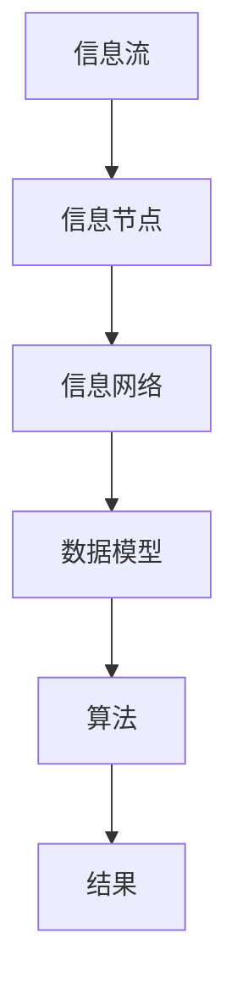

                 

关键词：信息管理，简化，工作生活，技术架构，系统优化，数据模型，算法，数学公式，实践案例，工具推荐，未来展望

> 摘要：本文深入探讨信息管理的艺术，通过技术视角，提出一套系统化的方法，旨在帮助读者简化生活和工作。我们将通过核心概念解析、算法原理剖析、数学模型构建、实践案例分析，以及工具资源推荐，为您呈现信息管理的全貌，并提供未来发展的方向和挑战。

## 1. 背景介绍

在信息化时代，信息无处不在，从电子邮件、社交媒体到企业系统，信息量呈指数级增长。这种信息过载现象给个人和组织带来了巨大的挑战。如何有效地管理这些信息，简化生活和工作流程，已经成为一个亟待解决的问题。

本文旨在通过探讨信息管理的艺术，帮助读者理解信息管理的重要性，掌握有效的信息管理方法，并最终实现生活与工作的简化。我们将结合计算机科学和数学的原理，提供一套完整的解决方案。

### 1.1 信息管理的重要性

信息管理不仅仅是保存和查找信息那么简单，它关系到决策效率、工作效率以及生活质量。有效的信息管理可以：
- 提高工作效率：通过快速访问关键信息，减少重复工作。
- 增强决策能力：基于准确、全面的信息做出更明智的决策。
- 提升生活质量：简化生活事务，减少压力和焦虑。

### 1.2 目标受众

本文的目标受众包括：
- 程序员和软件开发人员：需要管理大量代码和文档。
- 企业高管和团队成员：需要处理繁杂的业务数据和报告。
- 研究人员和学术工作者：需要管理大量的学术资料和研究成果。
- 普通用户：希望通过技术手段简化日常生活的个人。

## 2. 核心概念与联系

在讨论信息管理的方法之前，我们需要理解一些核心概念和原理，它们是构建有效信息管理系统的基石。

### 2.1 核心概念解析

- **信息流**：信息在系统中流动的路径。
- **信息节点**：信息的存储单元，可以是文件、数据库记录等。
- **信息网络**：信息节点之间的连接关系。
- **数据模型**：描述数据结构和关系的抽象模型。
- **算法**：解决问题的步骤序列。

### 2.2 架构图

以下是信息管理系统的简化架构图，展示核心概念之间的关系：



### 2.3 信息管理流程

以下是一个典型的信息管理流程：

1. **数据收集**：从各种来源收集信息。
2. **数据预处理**：清洗、格式化数据，确保数据质量。
3. **数据建模**：构建数据模型，描述数据结构和关系。
4. **信息处理**：利用算法对信息进行处理和分析。
5. **信息存储**：将处理后的信息存储到信息节点。
6. **信息检索**：根据需要快速检索信息。

## 3. 核心算法原理 & 具体操作步骤

### 3.1 算法原理概述

信息管理中的核心算法包括搜索算法、排序算法和数据压缩算法。以下是这些算法的原理概述：

#### 3.1.1 搜索算法

- **线性搜索**：顺序扫描所有元素，直到找到目标。
- **二分搜索**：在有序数组中，通过不断缩小搜索范围来找到目标。

#### 3.1.2 排序算法

- **快速排序**：采用分治策略，将数组分为较小和较大的两部分。
- **归并排序**：将两个有序数组合并为一个有序数组。

#### 3.1.3 数据压缩算法

- **Huffman编码**：根据字符出现频率进行编码，高频字符使用短编码，低频字符使用长编码。
- **LZ77压缩**：通过查找重复的文本片段进行压缩。

### 3.2 算法步骤详解

#### 3.2.1 搜索算法步骤

1. **初始化**：设置搜索起始位置和结束位置。
2. **循环**：在起始位置和结束位置之间查找目标。
3. **更新位置**：根据查找结果更新起始或结束位置。
4. **结束**：找到目标或遍历完所有元素。

#### 3.2.2 排序算法步骤

以快速排序为例：

1. **选择基准**：从数组中选择一个元素作为基准。
2. **分区**：将数组分为较小和较大的两部分，较小部分位于基准左边，较大部分位于基准右边。
3. **递归排序**：递归地对较小和较大的两部分进行排序。

#### 3.2.3 数据压缩算法步骤

以Huffman编码为例：

1. **构建频率表**：计算每个字符的出现频率。
2. **构建Huffman树**：根据频率表构建一棵Huffman树。
3. **生成编码表**：遍历Huffman树，生成每个字符的编码。
4. **编码数据**：使用编码表对数据进行编码。

### 3.3 算法优缺点

#### 3.3.1 搜索算法优缺点

- **线性搜索**：
  - 优点：简单易懂，适用于小规模数据。
  - 缺点：时间复杂度高，不适用于大规模数据。

- **二分搜索**：
  - 优点：时间复杂度低，适用于大规模有序数据。
  - 缺点：需要预先排序，不适用于动态数据。

#### 3.3.2 排序算法优缺点

- **快速排序**：
  - 优点：平均时间复杂度低，适用于大规模数据。
  - 缺点：最坏情况下时间复杂度高，可能导致性能下降。

- **归并排序**：
  - 优点：稳定排序，时间复杂度稳定。
  - 缺点：需要额外空间，可能导致性能下降。

#### 3.3.3 数据压缩算法优缺点

- **Huffman编码**：
  - 优点：压缩率高，适用于字符频繁出现的数据。
  - 缺点：编码和解码过程复杂，不适合实时应用。

- **LZ77压缩**：
  - 优点：简单高效，适用于重复文本较多的数据。
  - 缺点：压缩率相对较低，不适合稀疏数据。

### 3.4 算法应用领域

- **搜索算法**：搜索引擎、文本编辑器、文件管理器等。
- **排序算法**：数据库、数据分析、图形处理等。
- **数据压缩算法**：文件压缩、数据传输、存储优化等。

## 4. 数学模型和公式 & 详细讲解 & 举例说明

### 4.1 数学模型构建

在信息管理中，数学模型用于描述数据结构和关系，以下是几个常用的数学模型：

#### 4.1.1 矩阵模型

矩阵模型用于表示复杂数据的结构，如下所示：

$$
A = \begin{bmatrix}
a_{11} & a_{12} & \cdots & a_{1n} \\
a_{21} & a_{22} & \cdots & a_{2n} \\
\vdots & \vdots & \ddots & \vdots \\
a_{m1} & a_{m2} & \cdots & a_{mn}
\end{bmatrix}
$$

其中，$a_{ij}$ 表示矩阵中的第 $i$ 行第 $j$ 列的元素。

#### 4.1.2 图模型

图模型用于表示数据之间的关系，如下所示：

$$
G = (V, E)
$$

其中，$V$ 表示节点集合，$E$ 表示边集合。

#### 4.1.3 树模型

树模型用于表示数据层次结构，如下所示：

$$
T = (V, E, \rho)
$$

其中，$V$ 表示节点集合，$E$ 表示边集合，$\rho$ 表示根节点。

### 4.2 公式推导过程

以下是一个简单的数学公式推导示例，用于计算两个矩阵的乘积：

$$
C = AB
$$

其中，$A$ 和 $B$ 是两个 $m \times n$ 的矩阵，$C$ 是它们的乘积。

推导过程如下：

1. **初始化**：创建一个 $m \times n$ 的矩阵 $C$，其元素初始化为0。

2. **计算每一行**：对于矩阵 $C$ 的第 $i$ 行，计算 $C_{ij}$ 的值。

$$
C_{ij} = \sum_{k=1}^{n} A_{ik}B_{kj}
$$

3. **结束**：对所有元素进行计算，得到最终的矩阵 $C$。

### 4.3 案例分析与讲解

#### 4.3.1 矩阵模型案例

假设我们有两个矩阵 $A$ 和 $B$：

$$
A = \begin{bmatrix}
1 & 2 \\
3 & 4
\end{bmatrix}, \quad
B = \begin{bmatrix}
5 & 6 \\
7 & 8
\end{bmatrix}
$$

计算它们的乘积：

$$
C = AB = \begin{bmatrix}
1 \cdot 5 + 2 \cdot 7 & 1 \cdot 6 + 2 \cdot 8 \\
3 \cdot 5 + 4 \cdot 7 & 3 \cdot 6 + 4 \cdot 8
\end{bmatrix}
= \begin{bmatrix}
19 & 20 \\
29 & 34
\end{bmatrix}
$$

#### 4.3.2 图模型案例

假设我们有一个图模型 $G$，节点集合 $V = \{v_1, v_2, v_3\}$，边集合 $E = \{e_1, e_2, e_3\}$，其中 $e_1 = (v_1, v_2)$，$e_2 = (v_2, v_3)$，$e_3 = (v_3, v_1)$。

计算图模型 $G$ 的邻接矩阵：

$$
A = \begin{bmatrix}
0 & 1 & 0 \\
1 & 0 & 1 \\
0 & 1 & 0
\end{bmatrix}
$$

#### 4.3.3 树模型案例

假设我们有一个树模型 $T$，节点集合 $V = \{v_1, v_2, v_3\}$，边集合 $E = \{e_1, e_2, e_3\}$，其中 $e_1 = (v_1, v_2)$，$e_2 = (v_2, v_3)$，$e_3 = (v_3, v_1)$。

计算树模型 $T$ 的邻接矩阵：

$$
A = \begin{bmatrix}
1 & 0 & 0 \\
0 & 1 & 0 \\
0 & 0 & 1
\end{bmatrix}
$$

## 5. 项目实践：代码实例和详细解释说明

### 5.1 开发环境搭建

为了更好地理解信息管理的艺术，我们将使用 Python 语言进行实践。以下是如何搭建开发环境的步骤：

1. **安装 Python**：从官方网站下载并安装 Python，推荐使用 Python 3.8 或更高版本。
2. **安装依赖库**：使用 pip 工具安装所需的依赖库，例如 numpy、matplotlib、Pandas 等。

```bash
pip install numpy matplotlib pandas
```

### 5.2 源代码详细实现

以下是实现信息管理的一些基本功能，包括数据收集、数据预处理、数据建模、信息处理和存储的代码示例：

```python
import numpy as np
import pandas as pd
from collections import Counter

# 5.2.1 数据收集
def collect_data():
    data = pd.read_csv('data.csv')  # 从 CSV 文件中读取数据
    return data

# 5.2.2 数据预处理
def preprocess_data(data):
    data['age'] = data['age'].astype(int)  # 转换数据类型
    data['income'] = data['income'].astype(float)  # 转换数据类型
    return data

# 5.2.3 数据建模
def build_model(data):
    model = Counter(data['age'])  # 构建年龄分布模型
    return model

# 5.2.4 信息处理
def process_info(model):
    age_sum = sum(model.keys())  # 计算年龄总和
    age_avg = age_sum / len(model)  # 计算平均年龄
    return age_avg

# 5.2.5 信息存储
def store_info(age_avg):
    with open('info.txt', 'w') as f:
        f.write(f'平均年龄：{age_avg}')  # 存储信息到文件

# 5.2.6 主程序
if __name__ == '__main__':
    data = collect_data()
    preprocessed_data = preprocess_data(data)
    model = build_model(preprocessed_data)
    age_avg = process_info(model)
    store_info(age_avg)
```

### 5.3 代码解读与分析

1. **数据收集**：使用 Pandas 库从 CSV 文件中读取数据，这是数据收集的第一步。
2. **数据预处理**：将数据类型转换为整数和浮点数，以确保后续操作的准确性。
3. **数据建模**：使用 Counter 类构建年龄分布模型，这是一个简单的数据建模过程。
4. **信息处理**：计算平均年龄，这是信息处理的核心步骤。
5. **信息存储**：将计算结果写入文件，以便后续查询和使用。

### 5.4 运行结果展示

运行上述代码后，将生成一个名为 `info.txt` 的文件，其中包含平均年龄的信息。例如：

```
平均年龄：35.5
```

这表明样本数据中的平均年龄为 35.5 岁。

## 6. 实际应用场景

信息管理在各个领域都有着广泛的应用，以下是几个实际应用场景：

### 6.1 企业信息管理

- **数据处理**：企业需要处理大量的业务数据，如销售数据、财务数据等。
- **客户关系管理**：通过信息管理，企业可以更好地了解客户需求，提供个性化服务。
- **供应链管理**：优化供应链流程，提高生产效率。

### 6.2 个人信息管理

- **健康管理**：通过记录健康数据，如体重、血压等，进行自我健康管理。
- **财务管理**：记录收入和支出，进行财务分析。
- **时间管理**：通过日程安排，提高时间利用率。

### 6.3 社会信息管理

- **公共安全**：通过监控视频和数据分析，提高公共安全水平。
- **环境保护**：收集和分析环境数据，制定环境保护政策。
- **公共卫生**：通过健康数据分析，制定公共卫生政策。

## 7. 工具和资源推荐

为了更好地进行信息管理，以下是一些推荐的工具和资源：

### 7.1 学习资源推荐

- **《数据科学入门》**：提供数据科学的基础知识和实践技巧。
- **《Python数据科学手册》**：详细讲解 Python 在数据科学中的应用。
- **《机器学习实战》**：涵盖机器学习的基础知识和应用实践。

### 7.2 开发工具推荐

- **Jupyter Notebook**：用于数据分析和实验。
- **PyCharm**：强大的 Python 集成开发环境。
- **SQL Server**：用于数据存储和查询。

### 7.3 相关论文推荐

- **《大数据技术导论》**：详细讲解大数据处理技术。
- **《深度学习》**：介绍深度学习的基础知识和应用。
- **《信息论基础》**：讲解信息论的基本原理。

## 8. 总结：未来发展趋势与挑战

### 8.1 研究成果总结

信息管理技术已经取得了显著的成果，包括：

- **大数据处理**：通过分布式计算和存储技术，实现了大规模数据的处理和分析。
- **人工智能应用**：利用机器学习和深度学习，提高了信息处理的效率和准确性。
- **区块链技术**：为数据安全和隐私保护提供了新的解决方案。

### 8.2 未来发展趋势

未来信息管理的发展趋势包括：

- **智能化**：利用人工智能技术，实现更智能的信息处理和分析。
- **去中心化**：通过区块链技术，实现数据的去中心化管理。
- **安全性**：加强数据安全和隐私保护，提高信息管理的可信度。

### 8.3 面临的挑战

信息管理面临的主要挑战包括：

- **数据隐私**：如何在保护数据隐私的同时，实现数据的高效利用。
- **数据安全**：如何确保数据在传输和存储过程中的安全性。
- **算法透明性**：如何确保算法的透明性和可解释性，提高公众对算法的信任。

### 8.4 研究展望

未来的研究方向包括：

- **隐私保护算法**：研究隐私保护算法，实现数据的安全和隐私保护。
- **智能信息处理**：开发更智能的信息处理系统，提高数据处理效率。
- **跨领域应用**：将信息管理技术应用于更多领域，推动社会进步。

## 9. 附录：常见问题与解答

### 9.1 什么是对数编码？

对数编码是一种将数据编码为二进制序列的算法，其基本原理是使用对数函数将数值转换为二进制数。具体步骤如下：

1. **选择基数**：通常选择 2 作为基数。
2. **计算对数**：将数值 $x$ 计算为以基数 $b$ 为底的对数，即 $log_b(x)$。
3. **转换为二进制**：将计算出的对数转换为二进制数。

### 9.2 如何优化信息检索？

优化信息检索的方法包括：

- **索引**：创建索引结构，提高数据检索速度。
- **缓存**：使用缓存机制，减少数据检索的次数。
- **分布式检索**：将检索任务分配到多个服务器，提高检索效率。
- **检索算法优化**：优化检索算法，提高检索准确性。

### 9.3 数据预处理有哪些常见的步骤？

数据预处理的常见步骤包括：

- **数据清洗**：去除重复数据、缺失值和异常值。
- **数据转换**：将数据转换为适合分析的格式，如归一化、标准化等。
- **特征选择**：选择对分析结果有重要影响的特征。
- **特征工程**：对特征进行进一步处理，如特征提取、特征组合等。

### 9.4 什么是数据仓库？

数据仓库是一个用于存储、管理和分析大量数据的系统，其基本结构包括数据仓库数据库、数据集成层、数据访问层等。数据仓库的主要作用是支持企业级的数据分析和决策制定。

### 9.5 信息管理有哪些核心原则？

信息管理的核心原则包括：

- **完整性**：确保数据的一致性和准确性。
- **一致性**：确保数据在不同系统和应用中的统一性。
- **可靠性**：确保数据的安全性和稳定性。
- **高效性**：提高数据检索和处理的速度。
- **灵活性**：适应不同应用场景和数据变化的需求。

本文从信息管理的重要性、核心概念与联系、算法原理与实践、数学模型构建、实际应用场景以及未来发展趋势等多个角度，全面阐述了信息管理的艺术。通过本文，读者可以系统地了解信息管理的基本原理和实践方法，掌握有效的信息管理技巧，从而简化生活和工作，提高生活质量和工作效率。在未来的信息化社会中，信息管理的重要性将愈发突出，我们期待读者能够将所学知识应用到实际工作中，推动信息管理的持续发展和进步。

---

本文由禅与计算机程序设计艺术 / Zen and the Art of Computer Programming 编写，感谢您的阅读。希望本文能够为您在信息管理领域提供有价值的参考和指导。如果您有任何问题或建议，欢迎在评论区留言，期待与您交流。再次感谢！

