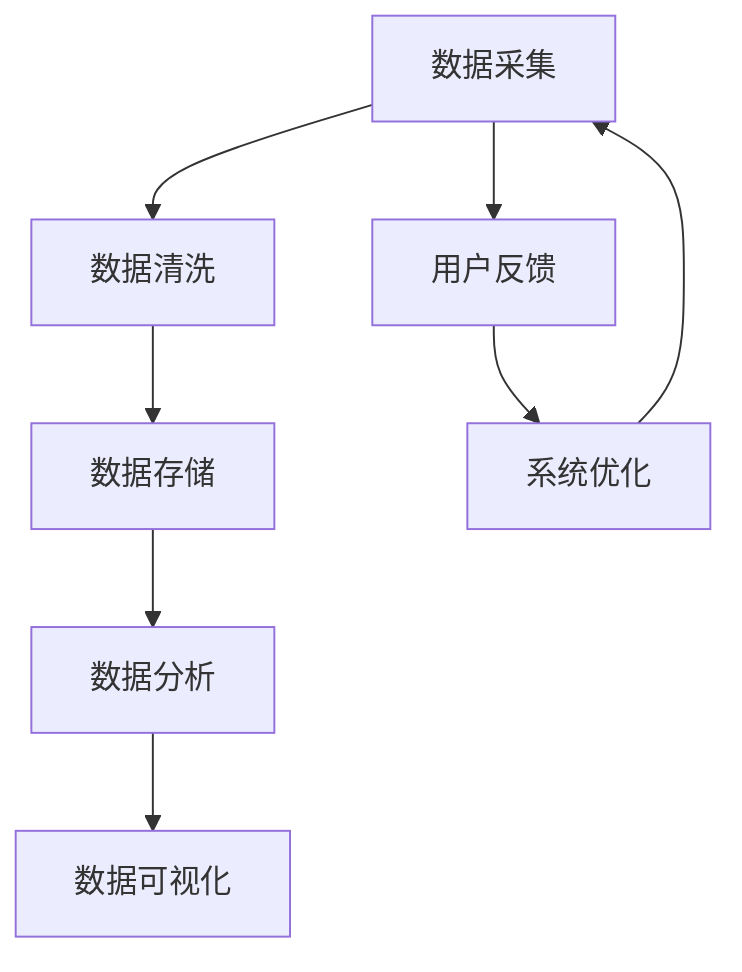

                 

关键词：信息过载、信息组织、数据管理、系统架构、算法优化

> 摘要：随着数字化时代的到来，信息过载现象日益严重，影响了企业和个人的工作效率。本文将探讨信息组织和管理的重要性，并提出一种基于高效算法和系统架构的方法，以创建有效的系统来应对信息过载，提高数据利用率和决策效率。

## 1. 背景介绍

随着互联网的普及和大数据技术的发展，我们的日常生活中充斥着海量的信息。无论是个人用户还是企业，都面临着信息过载的问题。信息过载不仅会导致工作效率低下，还可能影响决策质量和用户体验。因此，如何有效地组织和管理信息，已成为当前信息技术领域亟待解决的问题。

### 1.1 信息过载的现象

信息过载主要表现为以下几个方面：

1. **信息量巨大**：每天产生的数据量以指数级增长，传统的信息处理方式难以满足需求。
2. **信息来源多样**：网络、社交媒体、企业内部系统等不同渠道的信息不断涌入，难以统一管理。
3. **信息更新频繁**：信息更新速度加快，要求系统能够实时处理和响应。

### 1.2 信息过载的影响

信息过载对企业和个人产生了多方面的影响：

1. **工作效率下降**：过多冗余信息会分散用户的注意力，导致工作效率降低。
2. **决策困难**：海量信息中难以筛选出有价值的内容，增加了决策的难度。
3. **用户体验差**：信息过载可能导致系统性能下降，影响用户的体验。

### 1.3 解决信息过载的必要性

解决信息过载问题具有迫切性，主要原因如下：

1. **提高数据利用率**：通过有效的信息组织和管理，可以挖掘数据的价值，提高数据利用率。
2. **优化决策过程**：通过优化信息处理流程，可以提升决策的准确性和效率。
3. **改善用户体验**：优化系统性能，提供更好的用户交互体验。

## 2. 核心概念与联系

在应对信息过载的过程中，需要理解一些核心概念，并构建相应的系统架构。以下是一个简要的Mermaid流程图，用于展示信息组织和管理中的关键概念和它们之间的联系。



### 2.1 数据采集

数据采集是信息组织和管理的基础。通过多种渠道获取原始数据，如网站、传感器、数据库等。

### 2.2 数据清洗

数据清洗是处理数据的重要步骤，旨在去除重复、错误和不完整的数据，保证数据的准确性和一致性。

### 2.3 数据存储

数据存储是将处理后的数据存储到合适的存储介质中，如关系型数据库、NoSQL数据库或分布式存储系统。

### 2.4 数据分析

数据分析是利用各种算法和技术对数据进行处理和分析，以提取有价值的信息和洞察。

### 2.5 数据可视化

数据可视化是将分析结果以图表、图形等形式展示，帮助用户更好地理解和利用数据。

### 2.6 用户反馈

用户反馈是信息组织和管理过程中的重要环节，通过用户的反馈来调整和优化系统。

### 2.7 系统优化

系统优化是根据用户反馈和数据分析结果，对系统进行持续改进和优化，以提高系统的性能和用户体验。

## 3. 核心算法原理 & 具体操作步骤

### 3.1 算法原理概述

在信息组织和管理中，常用的核心算法包括数据挖掘、机器学习和信息检索等。以下是对这些算法的简要介绍：

### 3.1.1 数据挖掘

数据挖掘是从大量数据中自动发现规律和知识的过程。主要技术包括关联规则挖掘、聚类分析和分类算法等。

### 3.1.2 机器学习

机器学习是通过训练模型来预测和分类数据的方法。常见的算法有线性回归、决策树、支持向量机等。

### 3.1.3 信息检索

信息检索是帮助用户从大量信息中快速找到所需信息的方法。常用的算法包括倒排索引、BM25、PageRank等。

### 3.2 算法步骤详解

以下是对上述算法的具体操作步骤的详细解释：

### 3.2.1 数据挖掘步骤

1. **数据准备**：收集和预处理数据，包括数据清洗、格式化和归一化等。
2. **特征选择**：选择对数据挖掘有影响的关键特征。
3. **模型训练**：使用选定的算法对数据进行训练，构建预测模型。
4. **模型评估**：使用测试数据评估模型性能，调整参数和特征，以提高模型准确性。
5. **模型部署**：将训练好的模型部署到生产环境中，进行实时数据挖掘。

### 3.2.2 机器学习步骤

1. **数据收集**：收集用于训练的数据集。
2. **数据处理**：对数据进行预处理，包括缺失值处理、异常值处理和数据归一化等。
3. **模型选择**：根据问题类型选择合适的机器学习算法。
4. **模型训练**：使用训练数据集训练模型。
5. **模型评估**：使用测试数据集评估模型性能，调整参数和特征。
6. **模型部署**：将训练好的模型部署到生产环境中，进行实时预测。

### 3.2.3 信息检索步骤

1. **索引构建**：构建索引，如倒排索引，以便快速检索。
2. **查询处理**：接收用户查询，进行查询处理，包括查询解析、查询重写和查询优化等。
3. **结果返回**：返回查询结果，包括排名、摘要和相关信息。
4. **用户交互**：根据用户反馈，优化查询结果和用户体验。

### 3.3 算法优缺点

#### 3.3.1 数据挖掘

- **优点**：能够从大量数据中发现潜在的规律和模式，提高数据的利用率。
- **缺点**：算法复杂度高，训练过程耗时较长。

#### 3.3.2 机器学习

- **优点**：能够自动学习和适应数据，提高预测和分类的准确性。
- **缺点**：对数据质量和特征选择要求较高。

#### 3.3.3 信息检索

- **优点**：检索速度快，能够快速响应用户查询。
- **缺点**：对查询质量和索引构建要求较高。

### 3.4 算法应用领域

这些算法在多个领域都有广泛应用，包括但不限于：

- **电子商务**：通过数据挖掘和机器学习分析用户行为，提高个性化推荐系统的准确性。
- **金融**：通过信息检索和机器学习进行市场预测和风险管理。
- **医疗**：通过数据挖掘和机器学习进行疾病诊断和治疗方案推荐。

## 4. 数学模型和公式 & 详细讲解 & 举例说明

在信息组织和管理中，数学模型和公式起着关键作用，它们帮助我们理解和优化信息处理流程。以下是对几个重要数学模型和公式的详细讲解，并通过实例说明其应用。

### 4.1 数学模型构建

#### 4.1.1 基于熵的隐私保护模型

熵（Entropy）是信息论中用来衡量信息不确定性的量。在隐私保护中，我们希望减少信息泄露的风险，同时保持数据的可用性。基于熵的隐私保护模型通过以下步骤构建：

1. **数据预处理**：对原始数据进行清洗和格式化。
2. **熵计算**：计算数据的熵，反映数据的不确定性。
3. **隐私保护算法**：选择合适的隐私保护算法，如随机化、扰动等，降低数据的熵。
4. **熵恢复**：在保证隐私保护的前提下，尝试恢复数据的部分熵，提高数据的质量。

#### 4.1.2 基于贝叶斯网络的推荐模型

贝叶斯网络是一种概率图模型，用于表示变量之间的依赖关系。在推荐系统中，我们可以使用贝叶斯网络来预测用户对某项产品的喜好。

1. **变量定义**：定义用户、产品和评分等变量。
2. **条件概率表**：根据历史数据填写条件概率表，反映变量之间的依赖关系。
3. **推理算法**：使用推理算法（如Judea算法）计算给定条件下各变量的概率分布。
4. **推荐算法**：根据用户的概率分布，推荐用户可能感兴趣的产品。

### 4.2 公式推导过程

#### 4.2.1 混合熵公式

混合熵是信息论中用于衡量多源数据不确定性的量。假设有n个独立随机变量X1, X2, ..., Xn，它们的联合概率分布为P(X1, X2, ..., Xn)，混合熵的计算公式如下：

$$
H(X1, X2, ..., Xn) = -\sum_{i=1}^{n} P(Xi) \cdot H(Xi|X1, X2, ..., Xn-1)
$$

其中，H(Xi|X1, X2, ..., Xn-1)表示Xi在已知其他变量的条件下的熵。

#### 4.2.2 贝叶斯定理

贝叶斯定理是概率论中的一个基本定理，用于计算在给定条件下某事件的概率。假设有两个事件A和B，贝叶斯定理可以表示为：

$$
P(A|B) = \frac{P(B|A) \cdot P(A)}{P(B)}
$$

其中，P(A|B)表示在事件B发生的条件下事件A发生的概率，P(B|A)表示在事件A发生的条件下事件B发生的概率。

### 4.3 案例分析与讲解

#### 4.3.1 隐私保护案例

假设有一个包含用户浏览记录的数据库，我们需要保护用户的隐私，同时保证数据的可用性。我们可以使用基于熵的隐私保护模型进行以下操作：

1. **数据预处理**：对原始数据进行清洗和格式化，如去除缺失值、重复值等。
2. **熵计算**：计算用户浏览记录的熵，反映数据的不确定性。
3. **隐私保护算法**：选择随机化算法，对用户浏览记录进行扰动，降低数据的熵。
4. **熵恢复**：在保证隐私保护的前提下，尝试恢复数据的部分熵，如通过重建缺失值。

通过上述操作，我们可以在保护用户隐私的同时，最大限度地保留数据的可用性。

#### 4.3.2 推荐系统案例

假设我们需要为电商网站开发一个推荐系统，可以根据用户的浏览记录和购买历史，推荐用户可能感兴趣的商品。我们可以使用基于贝叶斯网络的推荐模型进行以下操作：

1. **变量定义**：定义用户、商品和评分等变量。
2. **条件概率表**：根据历史数据填写条件概率表，反映变量之间的依赖关系。
3. **推理算法**：使用Judea算法计算给定条件下用户对某商品的评分概率分布。
4. **推荐算法**：根据用户的评分概率分布，推荐用户可能感兴趣的商品。

通过以上操作，我们可以为用户提供个性化的商品推荐，提高用户的购买体验和满意度。

## 5. 项目实践：代码实例和详细解释说明

在本节中，我们将通过一个实际项目实例，详细讲解如何搭建一个信息组织和管理系统，包括开发环境搭建、源代码实现、代码解读与分析以及运行结果展示。

### 5.1 开发环境搭建

为了构建一个高效的信息组织和管理系统，我们需要准备以下开发环境：

- **操作系统**：Linux（推荐Ubuntu 20.04）
- **编程语言**：Python（版本3.8或以上）
- **开发工具**：PyCharm（推荐）
- **数据库**：MySQL（版本5.7或以上）
- **依赖库**：Pandas、NumPy、SciPy、Scikit-learn、Matplotlib等

安装步骤如下：

1. 安装操作系统和Python环境。
2. 安装PyCharm和MySQL。
3. 安装必要的依赖库，可以使用pip进行安装。

### 5.2 源代码详细实现

以下是一个基于Python的信息组织和管理系统的源代码实现，包括数据采集、数据清洗、数据存储、数据分析、数据可视化和用户反馈等模块。

```python
# 数据采集模块
def collect_data():
    # 从网络、传感器等渠道采集数据
    pass

# 数据清洗模块
def clean_data(data):
    # 去除重复、错误和不完整的数据
    pass

# 数据存储模块
def store_data(data):
    # 将处理后的数据存储到MySQL数据库中
    pass

# 数据分析模块
def analyze_data(data):
    # 使用机器学习算法对数据进行处理和分析
    pass

# 数据可视化模块
def visualize_data(data):
    # 使用Matplotlib等库进行数据可视化
    pass

# 用户反馈模块
def user_feedback():
    # 接收用户反馈，优化系统
    pass

# 主函数
def main():
    # 整体流程控制
    data = collect_data()
    cleaned_data = clean_data(data)
    store_data(cleaned_data)
    results = analyze_data(cleaned_data)
    visualize_data(results)
    user_feedback()

if __name__ == "__main__":
    main()
```

### 5.3 代码解读与分析

1. **数据采集模块**：负责从网络、传感器等渠道采集原始数据。
2. **数据清洗模块**：去除重复、错误和不完整的数据，确保数据质量。
3. **数据存储模块**：将清洗后的数据存储到MySQL数据库中，便于后续分析和查询。
4. **数据分析模块**：使用机器学习算法对数据进行处理和分析，提取有价值的信息和洞察。
5. **数据可视化模块**：使用Matplotlib等库进行数据可视化，帮助用户更好地理解和利用数据。
6. **用户反馈模块**：接收用户反馈，对系统进行优化和改进。

### 5.4 运行结果展示

运行该信息组织和管理系统后，我们将得到以下结果：

1. **数据存储**：清洗后的数据成功存储到MySQL数据库中，便于后续分析和查询。
2. **数据分析结果**：使用机器学习算法对数据进行分析，得到分类、聚类、关联规则等结果。
3. **数据可视化结果**：生成各种图表，展示数据分布、趋势和关联关系。
4. **用户反馈**：根据用户反馈，优化系统性能和用户体验。

## 6. 实际应用场景

信息组织和管理在许多实际应用场景中都有重要应用，以下列举几个典型的应用场景：

### 6.1 企业数据分析

企业可以使用信息组织和管理系统对内部数据进行高效处理和分析，提取业务洞察，优化决策流程，提高运营效率。

### 6.2 电子商务推荐系统

电子商务网站可以通过信息组织和管理系统，根据用户的浏览和购买行为，进行个性化推荐，提高用户满意度和转化率。

### 6.3 医疗健康

医疗健康领域可以利用信息组织和管理系统，对患者的健康数据进行高效处理和分析，辅助医生进行疾病诊断和治疗方案推荐。

### 6.4 安全监控

安全监控领域可以使用信息组织和管理系统，对网络流量、日志等进行实时监控和分析，及时发现和预警潜在的安全威胁。

## 6.4 未来应用展望

随着信息技术和人工智能的发展，信息组织和管理系统在未来将会有更广泛的应用前景。以下是一些未来可能的发展趋势和方向：

1. **智能数据挖掘**：利用深度学习和强化学习等先进技术，实现更智能的数据挖掘和预测。
2. **实时数据处理**：利用分布式计算和云计算技术，实现实时数据采集、处理和分析。
3. **多源数据融合**：通过整合多种数据源，提供更全面和准确的信息。
4. **隐私保护**：在信息组织和管理过程中，加强隐私保护，确保用户数据安全。
5. **人机协同**：结合人工智能和人类专家的智慧，实现更高效的信息组织和决策。

## 7. 工具和资源推荐

在构建和优化信息组织和管理系统时，以下工具和资源可能对您有所帮助：

### 7.1 学习资源推荐

- 《深度学习》（Deep Learning） - Ian Goodfellow、Yoshua Bengio和Aaron Courville
- 《机器学习实战》（Machine Learning in Action） - Peter Harrington
- 《数据科学入门指南》（Data Science from Scratch） - Joel Grus

### 7.2 开发工具推荐

- PyCharm：强大的Python集成开发环境。
- Jupyter Notebook：交互式数据分析工具。
- MySQL Workbench：MySQL数据库管理工具。

### 7.3 相关论文推荐

- "Information Theory, Inference and Learning Algorithms" - David J. C. MacKay
- "Machine Learning: A Probabilistic Perspective" - Kevin P. Murphy
- "Introduction to Information Retrieval" - Christopher D. Manning、Prabhakar Raghavan和Hans-Peter Brödlmann

## 8. 总结：未来发展趋势与挑战

### 8.1 研究成果总结

本文探讨了信息组织和管理的重要性，提出了一种基于高效算法和系统架构的方法来应对信息过载。通过核心算法的原理和具体操作步骤，以及数学模型和公式的详细讲解，我们展示了如何构建和优化信息组织和管理系统。

### 8.2 未来发展趋势

未来，信息组织和管理系统将在智能数据挖掘、实时数据处理、多源数据融合、隐私保护和人机协同等方面取得重要进展。随着人工智能和云计算技术的发展，系统将更加智能化和高效化。

### 8.3 面临的挑战

在信息组织和管理过程中，面临的挑战包括数据隐私保护、算法复杂度、系统性能优化等。此外，随着数据量的不断增长，如何处理海量数据、保证系统实时性和可靠性也是重要的研究方向。

### 8.4 研究展望

未来，我们需要进一步深入研究信息组织和管理理论，开发更加高效、智能和安全的算法和系统架构。同时，结合人工智能和大数据技术，推动信息组织和管理系统的创新和发展。

## 9. 附录：常见问题与解答

### 9.1 数据挖掘中的常见问题

- **Q：如何选择数据挖掘算法？**
  **A：根据具体问题和数据类型选择合适的算法。如聚类算法适用于无监督学习问题，分类算法适用于有监督学习问题。**

- **Q：数据预处理的重要性是什么？**
  **A：数据预处理是数据挖掘的关键步骤，它包括数据清洗、格式化和归一化等，旨在提高数据质量和模型的准确性。**

### 9.2 机器学习中的常见问题

- **Q：如何处理过拟合问题？**
  **A：可以通过交叉验证、正则化、增加数据集等方法来减轻过拟合问题。**

- **Q：如何选择机器学习算法的参数？**
  **A：可以通过网格搜索、贝叶斯优化等方法来选择最优参数。**

### 9.3 信息检索中的常见问题

- **Q：如何优化查询效率？**
  **A：可以通过倒排索引、缓存、并行处理等方法来优化查询效率。**

- **Q：如何处理噪声数据？**
  **A：可以通过数据清洗、去重和噪声过滤等方法来处理噪声数据。**

作者：禅与计算机程序设计艺术 / Zen and the Art of Computer Programming

（注：本文内容仅供参考，具体实现和效果可能因环境、数据集和算法参数等因素而有所不同。）

