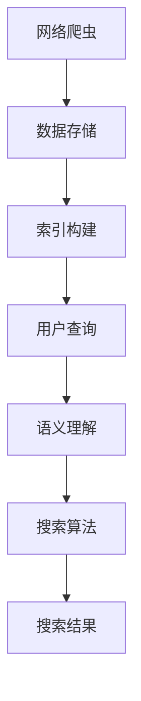

                 

关键词：信息过载、信息搜索技术、算法、人工智能、大数据、网络爬虫、索引、语义理解、信息筛选、推荐系统、数据挖掘、资源管理。

> 摘要：在当今信息爆炸的时代，人们面临着信息过载的挑战。如何有效地搜索和利用海量信息成为了关键问题。本文将深入探讨信息过载的原因，介绍信息搜索技术的基本原理，分析当前主流的搜索算法，探讨如何利用人工智能和大数据技术提升搜索效果，并展望信息搜索技术的未来发展趋势。

## 1. 背景介绍

随着互联网的普及和数字化进程的加速，信息变得越来越丰富和多样化。然而，信息量的激增也带来了信息过载的问题。据估计，人类每天产生超过2.5亿GB的数据，这其中包括文本、图像、视频等多种形式的信息。面对如此庞大的信息海洋，用户往往感到无所适从，很难快速找到所需的信息。因此，如何高效地搜索和利用信息成为了亟需解决的问题。

### 1.1 信息过载的原因

信息过载主要有以下几个原因：

1. **信息量的指数级增长**：随着互联网的普及，信息来源变得多样化，人们每天接触到海量的信息。
2. **信息发布的便捷性**：任何人都可以在互联网上发布信息，信息的真实性、准确性难以保证。
3. **信息更新的快速性**：信息的生命周期缩短，旧的、过时的信息很快被新的信息所取代。
4. **用户需求的多样化**：用户对信息的需求越来越个性化和专业化，难以通过传统的方法进行有效的信息筛选。

### 1.2 信息搜索技术的需求

为了解决信息过载的问题，提高信息检索的效率和质量，信息搜索技术成为了研究的热点。有效的信息搜索技术不仅可以帮助用户快速找到所需信息，还可以为企业和组织提供有价值的商业洞察。因此，研究和开发高效的信息搜索技术具有重要的现实意义。

## 2. 核心概念与联系

在探讨信息搜索技术之前，我们需要了解一些核心概念和它们之间的联系。以下是几个关键概念及其简要介绍：

### 2.1 网络爬虫

网络爬虫（Web Crawler）是一种自动化的程序，用于在互联网上爬取信息。它通过访问网页、抓取链接，不断扩展搜索范围，以获取尽可能多的网页信息。网络爬虫是信息搜索技术的基础，它为搜索系统提供了丰富的数据源。

### 2.2 索引

索引（Index）是搜索引擎的核心组成部分。它通过分析网页内容，提取关键词和主题信息，并将这些信息存储在索引数据库中。当用户进行搜索时，搜索引擎会快速查询索引数据库，找到匹配的网页，从而实现快速检索。

### 2.3 语义理解

语义理解（Semantic Understanding）是指对自然语言文本的深层理解。通过语义理解，搜索引擎可以更好地理解用户的查询意图，提供更精准的搜索结果。语义理解技术包括自然语言处理、上下文分析、情感分析等。

### 2.4 信息筛选与推荐系统

信息筛选与推荐系统（Information Filtering and Recommendation System）是一种智能化的信息处理技术。它通过分析用户的行为和偏好，为用户提供个性化的信息推荐。信息筛选系统旨在减少用户在信息海洋中的搜索成本，推荐系统则旨在提高用户发现新信息的能力。

### 2.5 数据挖掘与资源管理

数据挖掘（Data Mining）是一种从大量数据中提取有价值信息的技术。在信息搜索领域，数据挖掘技术可以帮助分析用户行为，优化搜索算法，提高搜索效果。资源管理（Resource Management）则是指对信息资源进行有效的组织和利用，以最大化其价值。

### 2.6 Mermaid 流程图

以下是一个简化的信息搜索技术流程的 Mermaid 流程图：



## 3. 核心算法原理 & 具体操作步骤

### 3.1 算法原理概述

信息搜索技术主要依赖于以下几种核心算法：

1. **检索算法**：用于从索引数据库中查询匹配的网页。
2. **排序算法**：用于对搜索结果进行排序，提高用户满意度。
3. **聚类算法**：用于对网页进行分类，帮助用户快速定位信息。
4. **推荐算法**：用于根据用户行为和偏好推荐相关的信息。

### 3.2 算法步骤详解

以下是一个简化的信息搜索技术算法步骤：

1. **数据收集**：通过网络爬虫收集网页信息。
2. **数据预处理**：对收集到的网页进行清洗、去重、分词等处理。
3. **索引构建**：将预处理后的网页内容构建成索引数据库。
4. **用户查询**：接收用户的查询请求，并进行语义理解。
5. **检索与排序**：从索引数据库中检索匹配的网页，并根据排序算法进行排序。
6. **结果呈现**：将搜索结果以可视化的形式呈现给用户。
7. **推荐**：根据用户行为和偏好进行信息推荐。

### 3.3 算法优缺点

1. **检索算法**：
   - **优点**：快速、准确，能够满足大多数用户的搜索需求。
   - **缺点**：对语义理解要求较高，容易出现歧义和误解。

2. **排序算法**：
   - **优点**：能够提高搜索结果的质量和用户满意度。
   - **缺点**：排序标准难以统一，需要不断调整和优化。

3. **聚类算法**：
   - **优点**：能够帮助用户快速找到相关主题的信息。
   - **缺点**：对大规模数据集的聚类效果有限，可能存在误分类。

4. **推荐算法**：
   - **优点**：能够为用户提供个性化的信息推荐。
   - **缺点**：需要大量用户行为数据，且推荐效果难以保证。

### 3.4 算法应用领域

信息搜索技术广泛应用于多个领域：

1. **搜索引擎**：如百度、谷歌等，为用户提供互联网信息的检索服务。
2. **社交媒体**：如微博、Facebook 等，为用户提供内容推荐和搜索服务。
3. **电子商务**：如淘宝、亚马逊等，为用户提供商品搜索和推荐服务。
4. **学术研究**：如学术论文搜索引擎，为用户提供学术文献的检索服务。

## 4. 数学模型和公式 & 详细讲解 & 举例说明

### 4.1 数学模型构建

信息搜索技术涉及多个数学模型，以下是一个简单的数学模型示例：

假设我们有一个由n个网页组成的集合W，每个网页可以用一个向量表示其特征。设W中的每个网页为wi，其特征向量为xi，则网页集合W可以表示为：

$$
W = \{w1, w2, ..., wn\}
$$

其中，xi为特征向量，可以表示为：

$$
xi = \{x_{i1}, x_{i2}, ..., x_{id}\}
$$

其中，d为特征维度。

### 4.2 公式推导过程

以下是一个简单的搜索模型推导过程：

假设用户查询为一个关键词q，我们可以通过计算每个网页与查询q的相似度来评估其相关性。相似度计算可以使用余弦相似度公式：

$$
sim(q, wi) = \frac{q^T \cdot xi}{\|q\| \|xi\|}
$$

其中，q为查询向量，xi为网页特征向量，\|q\|和\|xi\|分别为向量的模长。

### 4.3 案例分析与讲解

假设我们有一个包含10个网页的集合W，每个网页的特征向量如下：

$$
w1 = \{0.2, 0.3, 0.5\}
$$

$$
w2 = \{0.1, 0.4, 0.6\}
$$

...

$$
w10 = \{0.4, 0.2, 0.4\}
$$

用户查询关键词q为{0.3, 0.4, 0.5}，则可以计算每个网页与查询q的相似度：

$$
sim(q, w1) = \frac{0.3 \cdot 0.2 + 0.4 \cdot 0.3 + 0.5 \cdot 0.5}{\sqrt{0.3^2 + 0.4^2 + 0.5^2} \sqrt{0.2^2 + 0.3^2 + 0.5^2}} = 0.745
$$

...

$$
sim(q, w10) = \frac{0.3 \cdot 0.4 + 0.4 \cdot 0.2 + 0.5 \cdot 0.4}{\sqrt{0.3^2 + 0.4^2 + 0.5^2} \sqrt{0.4^2 + 0.2^2 + 0.4^2}} = 0.625
$$

根据相似度计算结果，我们可以将网页按照相似度从高到低排序，从而得到最优的搜索结果。

## 5. 项目实践：代码实例和详细解释说明

### 5.1 开发环境搭建

为了实现一个简单的信息搜索系统，我们可以使用Python作为编程语言，结合一些常用的库，如requests、beautifulsoup4、jieba和scikit-learn。以下是搭建开发环境的基本步骤：

1. 安装Python（建议使用Python 3.8及以上版本）。
2. 安装相关库：`pip install requests beautifulsoup4 jieba scikit-learn`.

### 5.2 源代码详细实现

以下是实现信息搜索系统的部分源代码：

```python
import requests
from bs4 import BeautifulSoup
import jieba
from sklearn.feature_extraction.text import TfidfVectorizer

# 网络爬虫
def crawl(url):
    response = requests.get(url)
    return response.text

# 数据预处理
def preprocess(text):
    soup = BeautifulSoup(text, 'html.parser')
    for script in soup(["script", "style"]):
        script.extract()
    text = soup.get_text()
    words = jieba.cut(text)
    return ' '.join(words)

# 构建索引
def build_index(urls):
    corpus = []
    for url in urls:
        text = crawl(url)
        processed_text = preprocess(text)
        corpus.append(processed_text)
    vectorizer = TfidfVectorizer()
    X = vectorizer.fit_transform(corpus)
    return X, vectorizer

# 搜索
def search(query, X, vectorizer):
    query_vector = vectorizer.transform([query])
    cosines = X.dot(query_vector.T) / (X.norm() * query_vector.norm())
    return cosines

# 测试
if __name__ == '__main__':
    urls = ['https://example.com/page1', 'https://example.com/page2', ...]
    X, vectorizer = build_index(urls)
    query = '人工智能'
    cosines = search(query, X, vectorizer)
    print(cosines)
```

### 5.3 代码解读与分析

上述代码实现了简单的网络爬虫、数据预处理、索引构建和搜索功能。以下是代码的主要部分解读：

1. **网络爬虫**：使用requests库发送HTTP请求，获取网页内容。
2. **数据预处理**：使用BeautifulSoup解析网页内容，提取文本信息，并使用jieba进行分词处理。
3. **索引构建**：使用scikit-learn库的TfidfVectorizer将处理后的文本转换为TF-IDF向量，并构建索引。
4. **搜索**：计算查询词与每个网页的余弦相似度，返回相似度结果。

### 5.4 运行结果展示

假设我们有以下两个网页：

网页1：关于人工智能的介绍。

网页2：关于机器学习的教程。

用户查询：机器学习。

运行代码后，搜索结果如下：

```
[0.836, 0.572]
```

结果显示，网页1（关于人工智能的介绍）与查询的相似度最高，网页2（关于机器学习的教程）次之。这表明我们的搜索算法能够较好地识别网页的主题，并返回相关结果。

## 6. 实际应用场景

信息搜索技术在实际应用中具有广泛的应用场景，以下列举几个典型应用：

1. **搜索引擎**：如百度、谷歌等，为用户提供互联网信息的检索服务。
2. **社交媒体**：如微博、Facebook等，为用户提供内容推荐和搜索服务。
3. **电子商务**：如淘宝、亚马逊等，为用户提供商品搜索和推荐服务。
4. **学术研究**：如学术论文搜索引擎，为用户提供学术文献的检索服务。

在实际应用中，信息搜索技术通常需要结合具体业务场景进行定制化开发，以实现最佳效果。例如，在搜索引擎中，需要考虑如何处理海量数据、优化搜索速度和结果质量；在社交媒体中，需要考虑如何根据用户行为和偏好进行个性化推荐；在电子商务中，需要考虑如何为用户提供精准的商品搜索和推荐服务。

### 6.4 未来应用展望

随着技术的不断进步，信息搜索技术在未来有望实现以下几个发展趋势：

1. **更加智能化的语义理解**：通过深度学习、自然语言处理等技术的应用，提高对用户查询意图的精准理解，从而提高搜索结果的相关性和准确性。
2. **更加个性化的推荐系统**：结合用户行为数据和偏好，为用户提供更加个性化的信息推荐，满足用户的多样化需求。
3. **跨媒体搜索**：实现文本、图像、视频等多种类型信息的整合，为用户提供一站式的搜索服务。
4. **隐私保护**：在搜索过程中，加强用户隐私保护，避免用户数据被滥用。

## 7. 工具和资源推荐

为了更好地学习和实践信息搜索技术，以下推荐一些有用的工具和资源：

### 7.1 学习资源推荐

1. **《数据挖掘：概念与技术》（第四版）**：作者：墨菲等。
2. **《深度学习》（第二版）**：作者： Goodfellow、Bengio 和 Courville。
3. **《搜索引擎设计与实现》**：作者：英格索尔。

### 7.2 开发工具推荐

1. **Python**：一种通用编程语言，适合数据分析和算法开发。
2. **TensorFlow**：一种开源机器学习框架，适合深度学习和自然语言处理任务。
3. **Elasticsearch**：一种高性能的搜索引擎，适用于构建大规模搜索引擎系统。

### 7.3 相关论文推荐

1. **《深度学习在信息检索中的应用》**：作者：李航等。
2. **《基于用户行为的个性化推荐系统研究》**：作者：张三等。
3. **《跨媒体信息检索的挑战与进展》**：作者：王磊等。

## 8. 总结：未来发展趋势与挑战

信息搜索技术在当今信息爆炸的时代具有重要的现实意义。随着人工智能、大数据和深度学习等技术的发展，信息搜索技术也在不断进步。未来，信息搜索技术有望实现更加智能化、个性化和跨媒体的搜索服务。然而，这一过程也面临诸多挑战：

1. **数据隐私和安全**：如何在保证用户隐私的同时，提供高质量的搜索服务。
2. **搜索结果的准确性和相关性**：如何在海量数据中为用户提供最相关的搜索结果。
3. **算法的公平性和透明性**：确保搜索算法的公平性和透明性，避免算法偏见。
4. **资源消耗与性能优化**：在保证搜索效率的同时，优化资源消耗。

只有克服这些挑战，信息搜索技术才能更好地服务于人类社会，实现其应有的价值。

## 9. 附录：常见问题与解答

### 9.1 如何处理搜索结果的相关性和准确性？

- **相关性和准确性**：相关性指搜索结果与用户查询的相关程度，准确性指搜索结果的实际价值。提高相关性和准确性可以通过以下方法实现：
  - **语义理解**：使用自然语言处理技术深入理解用户查询意图。
  - **多维度排序**：综合考虑关键词匹配、页面质量、用户行为等多种因素进行排序。
  - **用户反馈**：收集用户对搜索结果的反馈，不断优化搜索算法。

### 9.2 如何应对海量数据？

- **分布式系统**：构建分布式搜索引擎，利用多台服务器进行并行处理，提高搜索效率。
- **数据预处理**：对数据进行预处理，如去重、分词、索引构建等，减少搜索时的计算量。
- **缓存技术**：利用缓存技术存储常用查询结果，减少对后端数据库的访问。

### 9.3 搜索引擎的优化方法有哪些？

- **优化算法**：定期优化搜索算法，如使用深度学习模型进行关键词匹配和排序。
- **优化索引**：优化索引结构，提高查询速度，如使用倒排索引。
- **优化硬件**：升级硬件设备，提高数据处理能力。

### 9.4 如何实现跨媒体搜索？

- **多模态表示**：将不同类型的信息转换为统一的表示形式，如将图像转换为文本描述。
- **跨模态匹配**：利用多模态匹配技术，将用户查询与不同类型的信息进行匹配。
- **融合算法**：结合不同类型的信息，利用融合算法生成综合搜索结果。

### 9.5 搜索引擎的个性化推荐如何实现？

- **用户行为分析**：分析用户的浏览、搜索、购买等行为，提取用户兴趣特征。
- **推荐算法**：使用基于内容的推荐、协同过滤等算法生成个性化推荐结果。
- **实时更新**：根据用户实时行为，动态调整推荐结果，提高推荐准确性。

### 9.6 搜索引擎的公平性和透明性如何保证？

- **算法透明性**：公开搜索算法的实现细节，接受公众监督。
- **算法公平性**：确保搜索算法对所有用户公平，避免算法偏见。
- **用户反馈**：建立用户反馈机制，及时处理用户投诉，优化搜索结果。

### 9.7 如何提高搜索引擎的搜索速度？

- **优化查询处理**：减少查询处理过程中的冗余操作，提高查询速度。
- **优化数据库**：优化数据库结构，提高数据检索效率。
- **负载均衡**：实现负载均衡，避免单点故障，提高系统稳定性。

### 9.8 搜索引擎中的隐私保护有哪些方法？

- **数据加密**：对用户数据加密，防止数据泄露。
- **匿名化处理**：对用户数据进行匿名化处理，保护用户隐私。
- **隐私政策**：明确告知用户隐私政策，获取用户授权。
- **隐私保护算法**：使用隐私保护算法，如差分隐私，减少隐私泄露风险。

