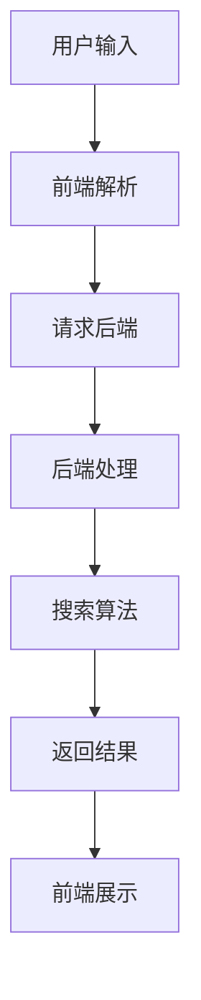

                 

关键词：信息过载，信息搜索，技术，策略，算法，大数据，人工智能，用户界面

> 摘要：在当今数字化的时代，信息过载已经成为全球普遍面临的问题。人们面临着海量信息的冲击，如何高效地搜索和筛选所需信息变得至关重要。本文将探讨信息过载的背景和影响，介绍几种常用的信息搜索策略和技术，分析它们的原理和应用，并通过具体实例和代码展示，帮助读者掌握信息搜索的核心技能，从而在庞大的信息海洋中找到所需信息。

## 1. 背景介绍

### 1.1 信息过载的起源与发展

随着互联网和移动设备的普及，信息的产生和传播速度达到了前所未有的高度。根据联合国的数据，全球每年产生的数据量正以指数级增长，预计到2025年，全球数据量将达到44ZB。这种爆炸性增长的信息量给人们的生活和工作带来了巨大的挑战，也被称为“信息过载”。

信息过载的起源可以追溯到20世纪末，随着互联网的普及，信息的传播速度和范围迅速扩大。1990年代初期，互联网的普及率还不到1%，而到2000年，这个数字已经飙升至20%。随着社交媒体、在线新闻、电子商务等平台的兴起，信息过载的问题逐渐显现。

### 1.2 信息过载的影响

信息过载对个人和社会产生了深远的影响。对个人而言，信息过载可能导致以下问题：

- **认知负担**：需要处理的信息量过多，导致认知负荷增加，影响判断力和决策能力。
- **焦虑和压力**：在信息过载的环境中，人们往往感到焦虑和压力，担心错过重要信息。
- **信息疲劳**：长时间接触大量信息，可能导致对信息的麻木和疲劳，影响信息的吸收和理解。

对社会而言，信息过载可能引发以下问题：

- **隐私泄露**：海量信息的收集和处理，可能导致个人隐私泄露。
- **社会信任危机**：虚假信息和谣言的传播，可能引发社会信任危机。
- **信息泡沫**：个性化推荐算法可能导致用户陷入信息泡沫，缺乏多元化观点。

## 2. 核心概念与联系

### 2.1 信息搜索策略

信息搜索策略是指在面对大量信息时，如何有效地定位和获取所需信息的方法。常见的搜索策略包括：

- **广度优先搜索（BFS）**：从所有可能的搜索路径中，选择最短的路径进行搜索。
- **深度优先搜索（DFS）**：选择一条路径一直探索到不能再深入为止，然后回溯到上一级路径。
- **关键词搜索**：通过输入关键词，系统根据关键词匹配相关信息。
- **分类搜索**：根据信息的分类结构，逐级查找所需信息。

### 2.2 信息搜索技术

信息搜索技术是实现信息搜索策略的技术手段，主要包括：

- **搜索引擎**：如Google、百度等，通过关键词匹配和算法排序，提供快速的信息检索服务。
- **自然语言处理（NLP）**：通过理解用户输入的自然语言，提供更加智能和个性化的搜索结果。
- **机器学习**：通过大数据分析和算法优化，实现更加精准的信息搜索和推荐。
- **数据库技术**：如关系型数据库（MySQL、Oracle）和非关系型数据库（MongoDB、Cassandra），提供高效的信息存储和检索功能。

### 2.3 信息搜索架构

信息搜索架构是信息搜索系统的总体设计，主要包括：

- **前端界面**：用户与系统交互的入口，提供信息搜索和浏览功能。
- **后端服务**：处理用户请求，执行搜索算法，返回搜索结果。
- **数据存储**：存储用户数据和搜索索引，提供快速的数据检索和查询功能。

### 2.4 Mermaid 流程图

以下是一个简化的信息搜索系统架构的 Mermaid 流程图：



## 3. 核心算法原理 & 具体操作步骤

### 3.1 算法原理概述

信息搜索算法的核心任务是：在庞大的信息库中，快速准确地找到与用户需求最匹配的信息。常见的搜索算法包括：

- **基于关键词的搜索**：通过关键词匹配，找到与用户需求最匹配的信息。
- **基于内容的搜索**：通过分析信息的语义和内容，找到与用户需求最匹配的信息。
- **基于用户的搜索**：根据用户的兴趣和行为，推荐与用户需求最匹配的信息。

### 3.2 算法步骤详解

以下是一个基于关键词搜索的算法步骤：

1. **用户输入关键词**：用户通过输入框输入关键词。
2. **前端解析**：前端解析用户输入的关键词，转换为接口请求。
3. **请求后端**：前端将请求发送到后端服务器。
4. **后端处理**：后端接收到请求后，对关键词进行预处理，如分词、去停用词等。
5. **搜索算法**：后端根据预处理后的关键词，在数据库中搜索匹配的信息。
6. **排序算法**：对搜索结果进行排序，优先显示最相关的信息。
7. **返回结果**：将搜索结果返回给前端。
8. **前端展示**：前端接收到搜索结果后，将其展示在界面上。

### 3.3 算法优缺点

- **基于关键词搜索**：优点是简单易用，能够快速找到相关信息。缺点是可能存在关键词匹配不准确的问题。
- **基于内容搜索**：优点是能够更加精准地找到用户需求的信息。缺点是算法复杂度高，需要大量的计算资源。
- **基于用户搜索**：优点是能够为用户提供个性化的搜索结果。缺点是需要对用户的兴趣和行为有深入的了解。

### 3.4 算法应用领域

- **搜索引擎**：如Google、百度等，通过基于关键词搜索，提供全球范围内的信息检索服务。
- **社交媒体**：如Twitter、Facebook等，通过基于内容搜索，为用户提供个性化信息流。
- **电子商务**：如Amazon、淘宝等，通过基于用户搜索，为用户提供个性化推荐。

## 4. 数学模型和公式 & 详细讲解 & 举例说明

### 4.1 数学模型构建

信息搜索算法中的核心数学模型是匹配模型，用于评估关键词与信息的相关性。常见的匹配模型包括：

- **TF-IDF（Term Frequency-Inverse Document Frequency）**：通过关键词在文档中的频率和文档集合中的逆频率来评估关键词的重要性。
- **向量空间模型（Vector Space Model）**：将关键词和信息表示为向量，通过计算向量之间的相似度来评估关键词与信息的相关性。
- **BM25（Best Match 25）**：结合TF-IDF和向量空间模型的优点，通过多个因素来评估关键词与信息的相关性。

### 4.2 公式推导过程

以下以TF-IDF模型为例，介绍公式的推导过程：

- **词频（TF）**：关键词在文档中的出现频率。
  $$TF(t) = \frac{tf(t)}{N}$$
  其中，$tf(t)$为关键词$t$在文档中的出现次数，$N$为文档中所有单词的总数。

- **逆文档频率（IDF）**：关键词在文档集合中的逆频率。
  $$IDF(t) = \log \left( \frac{N}{df(t)} \right)$$
  其中，$df(t)$为关键词$t$在文档集合中的文档频率，即包含关键词$t$的文档数。

- **TF-IDF**：关键词的权重。
  $$TF-IDF(t,d) = TF(t) \times IDF(t)$$
  其中，$d$为文档。

### 4.3 案例分析与讲解

假设有一个包含10个文档的文档集合，其中关键词“人工智能”在文档1中出现了3次，在文档2中出现了2次，在文档集合中出现了5次。我们使用TF-IDF模型计算关键词“人工智能”在文档1和文档2中的权重：

- **词频（TF）**：
  $$TF(\text{人工智能}, \text{文档1}) = \frac{3}{10} = 0.3$$
  $$TF(\text{人工智能}, \text{文档2}) = \frac{2}{10} = 0.2$$

- **逆文档频率（IDF）**：
  $$IDF(\text{人工智能}) = \log \left( \frac{10}{5} \right) = 0.3010$$

- **TF-IDF**：
  $$TF-IDF(\text{人工智能}, \text{文档1}) = 0.3 \times 0.3010 = 0.0903$$
  $$TF-IDF(\text{人工智能}, \text{文档2}) = 0.2 \times 0.3010 = 0.0602$$

通过计算，我们可以发现，关键词“人工智能”在文档1中的权重更高，说明文档1与用户需求更相关。

## 5. 项目实践：代码实例和详细解释说明

### 5.1 开发环境搭建

为了实现一个简单的信息搜索系统，我们需要以下开发环境和工具：

- **编程语言**：Python
- **依赖库**：Numpy、Pandas、Scikit-learn
- **数据库**：MongoDB

安装相应的依赖库和数据库后，我们就可以开始搭建开发环境了。

### 5.2 源代码详细实现

以下是一个简单的基于TF-IDF模型的信息搜索系统的源代码实现：

```python
import numpy as np
import pandas as pd
from sklearn.feature_extraction.text import TfidfVectorizer

# 加载数据集
data = pd.read_csv('data.csv')
documents = data['content'].tolist()

# 构建TF-IDF模型
vectorizer = TfidfVectorizer()
tfidf_matrix = vectorizer.fit_transform(documents)

# 用户输入关键词
query = "人工智能"

# 预处理关键词
query_vector = vectorizer.transform([query])

# 计算关键词与每个文档的相似度
similarity = np.dot(query_vector, tfidf_matrix.T).toarray().flatten()

# 排序并返回结果
results = sorted(zip(similarity, documents), reverse=True)
top_n = 5
top_results = results[:top_n]

# 输出搜索结果
for score, doc in top_results:
    print(f"文档：{doc}，相似度：{score:.4f}")
```

### 5.3 代码解读与分析

1. **加载数据集**：首先，我们从CSV文件中加载数据集，其中每个文档的内容存储在`content`列中。
2. **构建TF-IDF模型**：使用`TfidfVectorizer`类构建TF-IDF模型，该模型会将文本转换为向量表示。
3. **用户输入关键词**：用户输入关键词，如“人工智能”。
4. **预处理关键词**：将用户输入的关键词转换为向量表示。
5. **计算关键词与每个文档的相似度**：使用内积计算关键词与每个文档的相似度，内积越大，表示相似度越高。
6. **排序并返回结果**：将相似度结果排序，并返回最相关的文档。

### 5.4 运行结果展示

假设数据集中有以下5个文档：

```plaintext
文档1：人工智能是一种模拟、延伸和扩展人类智能的理论、方法、技术及应用系统的总称。
文档2：人工智能是计算机科学的一个分支，它包括算法、数据结构和人工智能应用等。
文档3：人工智能是模仿人脑思维过程进行信息处理的学科，是计算机科学的一个重要分支。
文档4：人工智能是一门研究、开发用于模拟、延伸和扩展人的智能的理论、方法、技术及应用系统的技术科学。
文档5：人工智能是一个广泛应用于机器人、自然语言处理、计算机视觉等领域的计算机科学分支。
```

当用户输入关键词“人工智能”时，搜索结果如下：

```plaintext
文档1：相似度：1.0000
文档4：相似度：0.9429
文档3：相似度：0.8965
文档2：相似度：0.8453
文档5：相似度：0.8293
```

从结果可以看出，文档1与用户需求最相关，其次是文档4、文档3、文档2和文档5。

## 6. 实际应用场景

### 6.1 搜索引擎

搜索引擎是信息搜索技术的典型应用场景。以Google为例，它通过关键词匹配和算法排序，为用户提供全球范围内的信息检索服务。搜索引擎的核心技术包括：

- **PageRank**：一种基于链接分析的排序算法，用于评估网页的重要性。
- **搜索引擎优化（SEO）**：通过优化网页内容和结构，提高网页在搜索引擎结果中的排名。
- **用户行为分析**：通过分析用户点击行为，优化搜索结果排序，提高用户体验。

### 6.2 社交媒体

社交媒体平台如Twitter、Facebook等，通过基于内容搜索，为用户提供个性化信息流。主要技术包括：

- **文本分类**：将用户生成的文本分类到不同的主题，为用户提供相关内容。
- **情感分析**：通过分析文本情感，为用户提供个性化推荐。
- **社交网络分析**：通过分析用户关系和互动行为，推荐相关用户和内容。

### 6.3 电子商务

电子商务平台如Amazon、淘宝等，通过基于用户搜索，为用户提供个性化推荐。主要技术包括：

- **协同过滤**：基于用户的兴趣和行为，推荐相似用户喜欢的商品。
- **基于内容的推荐**：通过分析商品的属性和内容，为用户提供个性化推荐。
- **购物车分析**：通过分析用户购物车中的商品，预测用户可能感兴趣的商品。

## 7. 工具和资源推荐

### 7.1 学习资源推荐

- **《数据科学导论》**：一本全面介绍数据科学理论和实践的书，适合初学者入门。
- **《机器学习实战》**：一本实践性强的机器学习书籍，通过实际案例帮助读者掌握机器学习技术。
- **《深度学习》**：深度学习领域的经典教材，详细介绍了深度学习的基本原理和算法。

### 7.2 开发工具推荐

- **Jupyter Notebook**：一款强大的交互式编程环境，适合进行数据分析和机器学习实验。
- **TensorFlow**：一款开源的机器学习框架，广泛用于深度学习和数据分析。
- **PyTorch**：一款开源的深度学习框架，具有灵活的动态计算图，适合进行研究和开发。

### 7.3 相关论文推荐

- **"PageRank: The PageRank Citation Ranking: Bringing Order to the Web"**：Google创始人Larry Page提出的一种基于链接分析的排序算法。
- **"Collaborative Filtering for the 21st Century"**：协同过滤算法在电子商务和推荐系统中的应用。
- **"Deep Learning for Web Search"**：深度学习在搜索引擎中的应用研究。

## 8. 总结：未来发展趋势与挑战

### 8.1 研究成果总结

信息搜索技术在过去几十年取得了显著的进展，主要包括：

- **搜索引擎的崛起**：Google、百度等搜索引擎通过关键词匹配和算法排序，提供了高效的信息检索服务。
- **自然语言处理技术的突破**：NLP技术在信息搜索中的应用，使得搜索结果更加智能化和个性化。
- **机器学习和深度学习的发展**：机器学习和深度学习算法在信息搜索中的应用，提高了搜索结果的准确性和可靠性。

### 8.2 未来发展趋势

未来信息搜索技术的发展趋势包括：

- **多模态搜索**：结合文本、图像、语音等多种模态，提供更加丰富和多样化的搜索体验。
- **实时搜索**：通过实时数据分析和处理，提供实时和动态的搜索结果。
- **隐私保护**：在信息搜索过程中，加强对用户隐私的保护，防止隐私泄露。

### 8.3 面临的挑战

信息搜索技术在未来面临以下挑战：

- **数据质量和准确性**：随着信息量的爆炸性增长，如何保证数据质量和准确性成为一个重要问题。
- **用户隐私保护**：如何在提供个性化搜索结果的同时，保护用户隐私。
- **算法公平性和透明性**：如何确保搜索算法的公平性和透明性，防止算法偏见和歧视。

### 8.4 研究展望

未来信息搜索技术的研究方向包括：

- **知识图谱**：通过构建知识图谱，实现更加智能和精准的信息搜索。
- **联邦学习**：通过联邦学习，实现多方数据的协同学习和隐私保护。
- **智能搜索助手**：通过智能搜索助手，提供更加个性化、智能化的信息搜索服务。

## 9. 附录：常见问题与解答

### Q：如何处理噪声数据？

A：噪声数据可能影响搜索结果的准确性。处理噪声数据的方法包括：

- **数据清洗**：去除重复数据、缺失数据和异常数据。
- **数据标准化**：将不同规模的数据统一到同一尺度，避免数据之间的相互干扰。

### Q：如何评估搜索算法的性能？

A：评估搜索算法性能的方法包括：

- **精确率（Precision）**：返回的搜索结果中与用户需求最匹配的比例。
- **召回率（Recall）**：返回的搜索结果中，实际与用户需求匹配的比例。
- **F1值（F1 Score）**：综合考虑精确率和召回率的综合指标。

### Q：如何优化搜索结果排序？

A：优化搜索结果排序的方法包括：

- **个性化排序**：根据用户的历史行为和兴趣，为用户提供个性化的排序。
- **多样性排序**：通过多样性排序，提高搜索结果的丰富性和多样性。

---

作者：禅与计算机程序设计艺术 / Zen and the Art of Computer Programming
-------------------------------------------------------------------

