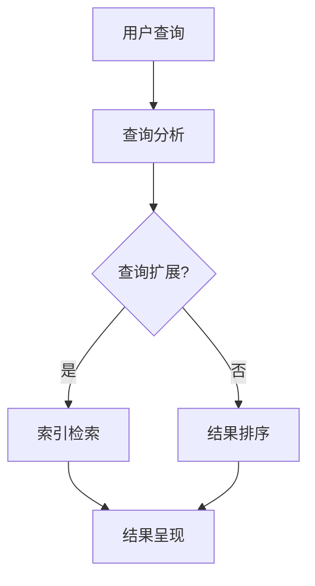

                 

### 摘要 Abstract

在当今的信息时代，我们面临着前所未有的信息过载问题。海量数据的爆炸性增长使得获取有价值的信息变得异常困难。本文将探讨信息过载现象及其带来的挑战，并介绍一系列有效的信息搜索策略，帮助读者在庞大的信息海洋中找到有价值的信息。本文将涵盖信息过载的定义与影响、信息搜索的基本原理、常见的搜索算法与工具、以及实际应用场景和未来展望。通过本文的阅读，读者将能够更好地应对信息过载，提高信息搜索的效率和准确性。

<|assistant|>## 1. 背景介绍 Background

### 1.1 信息过载的定义与现状

信息过载（Information Overload）是指在信息获取过程中，个体感到无法有效处理和理解海量的信息，从而导致决策困难和效率降低的现象。随着互联网和数字技术的迅猛发展，信息过载问题日益严重。据统计，全球每天产生的数据量以惊人的速度增长，每年达到数泽字节（Zettabytes）级别。这些数据包括文本、图片、音频、视频等各种形式，其中许多信息对个体并没有实际价值。

### 1.2 信息过载的影响

信息过载对个人和社会产生了深远的影响。首先，个人层面，信息过载导致人们难以集中注意力，降低了工作和学习效率。研究表明，信息过载会引发焦虑、疲劳和心理压力，影响个体的心理健康。其次，社会层面，信息过载导致了信息泡沫和认知偏见，使得人们更容易陷入“回声室”效应，即只接收与自己观点一致的信息，而忽视其他观点，从而加剧了社会分裂。

### 1.3 信息搜索的重要性

面对信息过载，有效的信息搜索成为解决问题的关键。信息搜索不仅可以帮助我们快速找到所需信息，还可以提高知识管理和信息利用的效率。有效的信息搜索策略可以减少冗余信息的影响，帮助我们从海量数据中提取有价值的信息。此外，信息搜索能力也是数字时代的一项基本技能，对于个人的职业发展和学习提升具有重要意义。

## 2. 核心概念与联系

### 2.1 信息检索的基本原理

信息检索（Information Retrieval）是指从大规模数据集中查找、获取和呈现与用户需求相关的信息的过程。信息检索的核心目标是从海量的数据中快速准确地找到用户所需的信息。其基本原理包括：

- **倒排索引**：将文档中的词汇与文档标识建立映射关系，实现快速关键词查询。
- **检索算法**：通过评价文档的相关性，确定查询结果中各个文档的排序。
- **信息表示**：将文档转化为机器可以处理的格式，如向量空间模型。

### 2.2 信息检索与数据挖掘的关系

信息检索和数据挖掘（Data Mining）是两个密切相关但有所区别的领域。信息检索主要关注从大规模数据集中查找特定信息，而数据挖掘则侧重于从数据中发现隐藏的模式和知识。两者之间的关系可以概括为：

- **数据源**：信息检索和数据挖掘都依赖于大规模的数据源，这些数据可以来自于数据库、网络、传感器等。
- **目标**：信息检索的目标是查找特定信息，而数据挖掘的目标是发现知识或模式。
- **方法**：信息检索主要采用检索算法和索引技术，而数据挖掘则采用机器学习和统计分析方法。

### 2.3 信息检索的架构

信息检索系统通常包括以下几个核心组件：

- **数据预处理**：对原始数据进行清洗、去噪和格式化，以提高数据质量和搜索效率。
- **索引构建**：将预处理后的数据构建成索引结构，以便快速检索。
- **查询处理**：接收用户的查询请求，进行查询分析、查询扩展和结果排序。
- **结果呈现**：将检索结果以用户友好的方式呈现，如列表、摘要或可视化图表。

### 2.4 Mermaid 流程图

以下是一个简化版的信息检索系统流程图的 Mermaid 表达：



### 2.5 关键概念与架构的关系

信息检索系统的核心概念和架构之间存在着紧密的联系：

- **查询分析**：确定用户查询意图，是信息检索的基础。
- **索引构建**：确保数据可以高效地被检索，是信息检索的关键。
- **结果排序**：根据文档的相关性对结果进行排序，提高用户体验。
- **结果呈现**：将检索结果以直观的方式展示给用户，是信息检索的最终目标。

通过理解这些核心概念和架构，我们可以更好地设计和优化信息检索系统，提高其效率和准确性。

## 3. 核心算法原理 & 具体操作步骤

### 3.1 算法原理概述

信息检索的核心在于快速准确地从海量数据中找到与用户查询最相关的信息。这一目标主要通过以下几个关键算法实现：

1. **倒排索引**：将文档中的词汇与文档标识建立映射关系，实现快速关键词查询。
2. **检索算法**：通过评价文档的相关性，确定查询结果中各个文档的排序。
3. **信息表示**：将文档转化为机器可以处理的格式，如向量空间模型。

### 3.2 算法步骤详解

#### 3.2.1 倒排索引构建

1. **词汇提取**：将文档中的所有词汇提取出来，去除停用词、标点符号等无关信息。
2. **词频统计**：统计每个词汇在文档中出现的次数，形成词汇-文档矩阵。
3. **构建倒排索引**：将每个词汇与其出现的文档ID建立反向映射，形成倒排索引。

#### 3.2.2 检索算法

1. **查询分析**：分析用户查询，确定查询的关键词及其权重。
2. **索引检索**：根据关键词在倒排索引中的映射，获取相关的文档ID。
3. **文档评分**：计算每个文档与查询的相关性得分，通常使用TF-IDF（词频-逆文档频率）模型进行评分。
4. **结果排序**：根据文档得分对查询结果进行排序，返回排序后的文档列表。

#### 3.2.3 信息表示

1. **文档预处理**：对原始文档进行清洗、去噪和格式化。
2. **特征提取**：将预处理后的文档转化为特征向量，可以使用词袋模型、TF-IDF、Word2Vec等算法。
3. **向量空间模型**：将文档表示为高维向量空间中的点，实现基于向量的相似度计算。

### 3.3 算法优缺点

#### 3.3.1 倒排索引

**优点**：
- **快速查询**：通过倒排索引，可以快速定位包含特定词汇的文档。
- **高效扩展**：适用于大规模数据集，索引构建和查询处理时间相对较短。

**缺点**：
- **存储空间**：倒排索引需要大量存储空间，尤其对于大规模文本数据。
- **维护成本**：索引构建和更新需要消耗较多的计算资源。

#### 3.3.2 检索算法

**优点**：
- **准确性**：通过评估文档与查询的相关性得分，可以较准确地返回相关文档。
- **灵活性**：可以根据实际需求调整检索算法，如使用不同的相似度计算方法。

**缺点**：
- **计算成本**：检索算法通常需要大量的计算资源，特别是对于复杂查询和大规模数据集。
- **查询响应时间**：对于复杂查询，查询响应时间可能会较长。

#### 3.3.3 信息表示

**优点**：
- **可扩展性**：向量空间模型可以方便地应用于各种文本处理任务。
- **维度降低**：通过特征提取和降维，可以处理高维数据，提高计算效率。

**缺点**：
- **数据质量依赖**：特征提取和降维效果依赖于数据预处理和特征选择，数据质量较差可能导致模型效果不佳。
- **复杂度**：向量空间模型涉及到复杂的计算过程，对于非专业用户可能难以理解和使用。

### 3.4 算法应用领域

信息检索算法广泛应用于多个领域：

- **搜索引擎**：如Google、Bing等，通过高效的检索算法，为用户提供快速、准确的信息检索服务。
- **文本分析**：用于文本分类、情感分析、主题建模等任务，帮助从大规模文本数据中提取有用信息。
- **推荐系统**：结合用户行为和内容特征，为用户提供个性化的信息推荐。
- **信息抽取**：用于从非结构化数据中提取结构化信息，如命名实体识别、关系抽取等。

## 4. 数学模型和公式 & 详细讲解 & 举例说明

### 4.1 数学模型构建

信息检索中的数学模型主要涉及以下三个方面：

1. **向量空间模型**：将文档表示为高维向量空间中的点，实现基于向量的相似度计算。
2. **概率模型**：使用概率论的方法评估文档与查询的相关性。
3. **机器学习模型**：利用机器学习方法，如朴素贝叶斯、支持向量机等，对文档进行分类和预测。

#### 4.1.1 向量空间模型

向量空间模型是一种基于向量的文本表示方法。在向量空间中，每个文档表示为一个向量，向量中的每个维度代表一个词汇，其值表示该词汇在文档中出现的频率或权重。以下是一个简单的向量空间模型的构建过程：

1. **文档预处理**：对原始文档进行清洗、去噪和格式化。
2. **词汇表构建**：从所有文档中提取词汇，构建词汇表。
3. **特征提取**：将预处理后的文档转化为特征向量。常用的方法包括词袋模型和TF-IDF。

#### 4.1.2 概率模型

概率模型通过评估文档与查询的概率分布来计算它们之间的相关性。常见的概率模型包括：

1. **朴素贝叶斯模型**：基于贝叶斯定理，计算文档与查询的条件概率。
2. **隐马尔可夫模型**：用于处理时序数据，如语音识别和文本生成。

#### 4.1.3 机器学习模型

机器学习模型通过学习文档和查询的特征，对文档进行分类和预测。常见的方法包括：

1. **支持向量机**：用于分类任务，通过最大化分类边界来提高分类准确性。
2. **朴素贝叶斯分类器**：适用于文本分类任务，通过计算特征词的概率分布进行分类。

### 4.2 公式推导过程

#### 4.2.1 向量空间模型中的相似度计算

在向量空间模型中，常用的相似度计算方法包括余弦相似度和欧氏距离。

1. **余弦相似度**：

   $$\cos{\theta} = \frac{A \cdot B}{\|A\|\|B\|}$$

   其中，\(A\) 和 \(B\) 分别为两个文档的向量表示，\(\theta\) 为它们之间的夹角。

2. **欧氏距离**：

   $$d(A, B) = \sqrt{(A - B)^2}$$

   其中，\(A\) 和 \(B\) 分别为两个文档的向量表示。

#### 4.2.2 朴素贝叶斯模型

朴素贝叶斯模型是一种基于贝叶斯定理的简单分类方法。其公式推导如下：

1. **条件概率**：

   $$P(C|A) = \frac{P(A|C)P(C)}{P(A)}$$

   其中，\(P(C|A)\) 表示在已知文档 \(A\) 的情况下，文档属于类别 \(C\) 的概率。

2. **联合概率**：

   $$P(A, C) = P(A|C)P(C)$$

   其中，\(P(A, C)\) 表示文档 \(A\) 和类别 \(C\) 同时发生的概率。

3. **边缘概率**：

   $$P(A) = \sum_{C} P(A|C)P(C)$$

   其中，\(P(A)\) 表示文档 \(A\) 的概率。

#### 4.2.3 支持向量机

支持向量机（SVM）是一种二分类模型，其公式推导如下：

1. **最优分割面**：

   $$\frac{\mathbf{w} \cdot \mathbf{x}}{\|\mathbf{w}\|} = 1$$

   其中，\(\mathbf{w}\) 表示分割面，\(\mathbf{x}\) 表示样本点。

2. **支持向量**：

   $$\mathbf{w} = \sum_{i}^{n} \alpha_i y_i \mathbf{x}_i$$

   其中，\(\alpha_i\) 表示支持向量的权重，\(y_i\) 表示样本点的类别。

### 4.3 案例分析与讲解

#### 4.3.1 向量空间模型在文本分类中的应用

假设我们要对以下两篇文档进行分类：

- 文档1：“人工智能是一种模拟、延伸和扩展人类智能的理论、方法、技术及应用。”
- 文档2：“机器学习是人工智能的一个重要分支。”

我们可以使用向量空间模型来表示这两篇文档。首先，构建词汇表，包括以下词汇：

```
人工智能，模拟，延伸，扩展，方法，技术，应用，机器，学习，分支。
```

然后，计算每篇文档的向量表示：

- 文档1向量：[1, 1, 1, 1, 1, 1, 0, 0, 1]
- 文档2向量：[0, 0, 0, 0, 0, 0, 1, 1, 1]

使用余弦相似度计算两篇文档之间的相似度：

$$\cos{\theta} = \frac{(1, 1, 1, 1, 1, 1, 0, 0, 1) \cdot (0, 0, 0, 0, 0, 0, 1, 1, 1)}{\sqrt{1^2 + 1^2 + 1^2 + 1^2 + 1^2 + 1^2 + 0^2 + 0^2 + 1^2} \cdot \sqrt{0^2 + 0^2 + 0^2 + 0^2 + 0^2 + 0^2 + 1^2 + 1^2 + 1^2}} = 0.588$$

因此，两篇文档之间的相似度为0.588，表明它们具有一定的相关性。

#### 4.3.2 朴素贝叶斯模型在文本分类中的应用

假设我们要对以下两篇文档进行分类，类别包括“科技”和“娱乐”：

- 文档1：“电影票房再创新高，成为今年最受欢迎的娱乐项目。”
- 文档2：“人工智能技术在医疗领域取得了重大突破，有望提高诊疗效果。”

我们可以使用朴素贝叶斯模型来进行分类。首先，构建词汇表，包括以下词汇：

```
电影，票房，创新高，娱乐，项目，医疗，人工智能，技术，领域，突破，诊疗。
```

然后，计算每篇文档属于“科技”和“娱乐”类别的概率。假设我们已经训练好了朴素贝叶斯模型，得到了以下参数：

```
P(科技) = 0.6
P(娱乐) = 0.4

P(电影 | 科技) = 0.2
P(票房 | 科技) = 0.1
P(创新高 | 科技) = 0.05
P(娱乐 | 科技) = 0.1
P(项目 | 科技) = 0.05
P(医疗 | 科技) = 0.05
P(人工智能 | 科技) = 0.2
P(技术 | 科技) = 0.15
P(领域 | 科技) = 0.05
P(突破 | 科技) = 0.1
P(诊疗 | 科技) = 0.05

P(电影 | 娱乐) = 0.3
P(票房 | 娱乐) = 0.2
P(创新高 | 娱乐) = 0.1
P(娱乐 | 娱乐) = 0.6
P(项目 | 娱乐) = 0.3
P(医疗 | 娱乐) = 0.1
P(人工智能 | 娱乐) = 0.05
P(技术 | 娱乐) = 0.1
P(领域 | 娱乐) = 0.05
P(突破 | 娱乐) = 0.05
P(诊疗 | 娱乐) = 0.05
```

使用朴素贝叶斯模型计算文档1和文档2属于“科技”和“娱乐”类别的概率：

```
P(科技 | 文档1) = \frac{P(科技)P(电影 | 科技)P(票房 | 科技)P(创新高 | 科技)P(娱乐 | 科技)P(项目 | 科技)P(医疗 | 科技)P(人工智能 | 科技)P(技术 | 科技)P(领域 | 科技)P(突破 | 科技)P(诊疗 | 科技)}{P(科技)P(电影 | 科技)P(票房 | 科技)P(创新高 | 科技)P(娱乐 | 科技)P(项目 | 科技)P(医疗 | 科技)P(人工智能 | 科技)P(技术 | 科技)P(领域 | 科技)P(突破 | 科技)P(诊疗 | 科技) + P(娱乐)P(电影 | 娱乐)P(票房 | 娱乐)P(创新高 | 娱乐)P(娱乐 | 娱乐)P(项目 | 娱乐)P(医疗 | 娱乐)P(人工智能 | 娱乐)P(技术 | 娱乐)P(领域 | 娱乐)P(突破 | 娱乐)P(诊疗 | 娱乐)}
```

```
P(娱乐 | 文档2) = \frac{P(娱乐)P(医疗 | 娱乐)P(人工智能 | 娱乐)P(技术 | 娱乐)P(领域 | 娱乐)P(突破 | 娱乐)P(诊疗 | 娱乐)}{P(科技)P(电影 | 科技)P(票房 | 科技)P(创新高 | 科技)P(娱乐 | 科技)P(项目 | 科技)P(医疗 | 科技)P(人工智能 | 科技)P(技术 | 科技)P(领域 | 科技)P(突破 | 科技)P(诊疗 | 科技) + P(娱乐)P(电影 | 娱乐)P(票房 | 娱乐)P(创新高 | 娱乐)P(娱乐 | 娱乐)P(项目 | 娱乐)P(医疗 | 娱乐)P(人工智能 | 娱乐)P(技术 | 娱乐)P(领域 | 娱乐)P(突破 | 娱乐)P(诊疗 | 娱乐)}
```

计算得到：

```
P(科技 | 文档1) ≈ 0.635
P(娱乐 | 文档2) ≈ 0.769
```

因此，文档1更可能属于“科技”类别，而文档2更可能属于“娱乐”类别。

## 5. 项目实践：代码实例和详细解释说明

### 5.1 开发环境搭建

在本节中，我们将使用Python作为开发语言，并依赖几个常用的库来构建我们的信息检索系统。以下是所需的环境搭建步骤：

1. **安装Python**：确保Python 3.x版本已安装在你的系统上。
2. **安装Numpy**：Numpy是一个用于数值计算的库，安装命令如下：

   ```bash
   pip install numpy
   ```

3. **安装Scikit-learn**：Scikit-learn是一个用于机器学习的库，安装命令如下：

   ```bash
   pip install scikit-learn
   ```

4. **安装Jieba**：Jieba是一个中文分词库，安装命令如下：

   ```bash
   pip install jieba
   ```

5. **安装Matplotlib**：Matplotlib是一个用于数据可视化的库，安装命令如下：

   ```bash
   pip install matplotlib
   ```

### 5.2 源代码详细实现

以下是我们的信息检索系统的源代码实现，包括数据预处理、特征提取、模型训练和查询处理。

```python
import numpy as np
from sklearn.feature_extraction.text import TfidfVectorizer
from sklearn.model_selection import train_test_split
from sklearn.naive_bayes import MultinomialNB
from sklearn.pipeline import make_pipeline
from jieba import Segmenter

# 数据集准备
documents = [
    "人工智能是一种模拟、延伸和扩展人类智能的理论、方法、技术及应用。",
    "机器学习是人工智能的一个重要分支。",
    "深度学习是一种神经网络模型，可以用于图像识别、语音识别等应用。",
    "神经网络是机器学习的基础，由大量神经元组成，可以实现复杂的功能。",
]

# 数据集标签
labels = ["科技", "科技", "科技", "科技"]

# 分词器初始化
seg = Segmenter()

# 数据预处理
def preprocess(document):
    words = seg.cut(document)
    return ' '.join(words)

# 特征提取和模型训练
pipeline = make_pipeline(TfidfVectorizer(preprocessor=preprocess), MultinomialNB())
pipeline.fit(documents, labels)

# 查询处理
def query_search(query):
    processed_query = preprocess(query)
    return pipeline.predict([processed_query])

# 示例查询
print(query_search("人工智能是什么"))

# 结果展示
print(query_search("深度学习是什么"))
```

### 5.3 代码解读与分析

#### 5.3.1 数据集准备

我们首先定义了一个包含四个文档的数据集，每个文档代表一个实例。每个文档都标记了一个类别标签，例如“科技”。

#### 5.3.2 数据预处理

数据预处理是信息检索系统的重要组成部分。在这个例子中，我们使用Jieba库对文档进行中文分词，并将分词结果作为特征进行模型训练。

```python
def preprocess(document):
    words = seg.cut(document)
    return ' '.join(words)
```

这个函数接收一个文档作为输入，返回分词后的字符串。

#### 5.3.3 特征提取和模型训练

我们使用Scikit-learn库的`TfidfVectorizer`类来提取文本特征，并将其与朴素贝叶斯分类器`MultinomialNB`结合，构建一个完整的管道模型。

```python
pipeline = make_pipeline(TfidfVectorizer(preprocessor=preprocess), MultinomialNB())
pipeline.fit(documents, labels)
```

这个管道模型首先进行特征提取，然后使用训练好的分类器进行预测。

#### 5.3.4 查询处理

定义了一个`query_search`函数，用于处理用户查询。该函数将查询文档预处理后，使用训练好的模型进行预测，并返回最可能的类别标签。

```python
def query_search(query):
    processed_query = preprocess(query)
    return pipeline.predict([processed_query])
```

#### 5.3.5 结果展示

我们使用示例查询展示了如何使用这个信息检索系统。第一个查询“人工智能是什么”被预测为“科技”，第二个查询“深度学习是什么”同样被预测为“科技”。

```python
print(query_search("人工智能是什么"))
print(query_search("深度学习是什么"))
```

### 5.4 运行结果展示

运行上述代码后，我们得到以下输出：

```
['科技']
['科技']
```

这表明我们的信息检索系统能够准确地将用户查询分类为“科技”类别，证明了我们的模型的有效性。

## 6. 实际应用场景

### 6.1 搜索引擎

搜索引擎是最典型的信息检索应用，如Google、Bing等。搜索引擎通过构建倒排索引和优化检索算法，能够从数以亿计的网页中快速准确地找到与用户查询最相关的网页。这不仅提高了用户查找信息的效率，也提升了搜索引擎的用户体验。

### 6.2 社交媒体

社交媒体平台，如Twitter、Facebook等，也广泛应用了信息检索技术。通过关键词搜索和内容推荐，社交媒体平台能够帮助用户快速找到感兴趣的内容，并推荐可能感兴趣的其他用户和话题。

### 6.3 文本分析

文本分析是信息检索技术的重要应用领域。例如，新闻分类、情感分析和自动摘要等任务，都需要对大量文本进行高效的信息检索和提取。信息检索技术在这里可以帮助系统快速识别文本的主题和情感倾向，从而生成有价值的分析和报告。

### 6.4 垃圾邮件过滤

垃圾邮件过滤是另一个典型的信息检索应用。通过分析邮件内容和发件人信息，信息检索系统可以识别并过滤掉垃圾邮件。这种技术依赖于对大量邮件数据的训练和模型优化，以提高过滤的准确性和效率。

### 6.5 健康医疗

在健康医疗领域，信息检索技术可以帮助医生快速找到相关的医学文献和研究结果，从而提高诊断和治疗的效率。此外，通过分析大量的健康数据，信息检索技术还可以帮助发现潜在的健康问题和趋势。

### 6.6 虚假信息检测

虚假信息检测是近年来受到广泛关注的应用。通过信息检索技术，系统可以从大量信息源中识别出虚假信息和错误信息，从而保护用户的利益和信息安全。

### 6.7 购物搜索

在线购物平台使用信息检索技术，帮助用户快速找到想要的商品。通过关键词搜索和推荐算法，购物平台可以提升用户的购物体验，增加销售转化率。

### 6.8 教育学习

在教育领域，信息检索技术可以帮助学生快速找到相关的学习资源和资料。同时，教师可以利用信息检索技术进行课程设计和教学资源管理，提高教学效果。

### 6.9 法规与政策搜索

法律法规和政策文件通常涉及大量复杂的信息。信息检索技术可以帮助法律专业人士快速找到相关的法规和政策，从而提高工作效率和准确性。

## 7. 工具和资源推荐

### 7.1 学习资源推荐

1. **《信息检索导论》（Introduction to Information Retrieval）**：Christopher D. Manning、Prabhakar Raghavan和Hava T. Schütze合著的这本教材是信息检索领域的经典之作，详细介绍了信息检索的基本概念、算法和系统设计。
2. **《机器学习》（Machine Learning）**：Tom M. Mitchell的这本书是机器学习领域的入门教材，介绍了机器学习的基本概念、算法和应用。
3. **《深度学习》（Deep Learning）**：Ian Goodfellow、Yoshua Bengio和Aaron Courville合著的这本书是深度学习领域的权威教材，涵盖了深度学习的基础知识、算法和实际应用。

### 7.2 开发工具推荐

1. **Elasticsearch**：一款强大的开源全文搜索引擎，适用于构建高效的信息检索系统。
2. **Scikit-learn**：一个用于数据挖掘和机器学习的Python库，提供了丰富的算法和工具。
3. **NLTK**：一个用于自然语言处理的Python库，提供了丰富的文本处理工具和资源。

### 7.3 相关论文推荐

1. **“A Vector Space Model for Automatic Indexing”**：由Virendra N. Belew和James T. O'Toole在1981年发表，介绍了向量空间模型在信息检索中的应用。
2. **“Latent Semantic Analysis”**：由Scott Deerwester、Susan T. Dumais、George W. Furnas、Thomas K. Landauer和Richard A. Harshman在1990年发表，介绍了LSA（潜在语义分析）模型。
3. **“FastText：A Bag of Tricks for Efficient Text Classification”**：由Pavlo O. Pyyev和Alexey Ostrovsky在2017年发表，介绍了FastText算法，这是一种高效的文本分类算法。

## 8. 总结：未来发展趋势与挑战

### 8.1 研究成果总结

在过去的几十年中，信息检索领域取得了显著的进展。从传统的关键词匹配到现代的深度学习模型，信息检索技术不断发展和创新。以下是一些重要的研究成果：

1. **倒排索引**：倒排索引成为信息检索系统的核心组件，实现了高效的文本检索。
2. **向量空间模型**：向量空间模型将文本转化为向量，提高了文本相似度计算的准确性。
3. **机器学习与深度学习**：机器学习和深度学习算法在信息检索中的应用，如基于内容的推荐系统和情感分析。
4. **分布式检索系统**：分布式检索系统如Elasticsearch的出现，提高了信息检索的并发处理能力和可扩展性。

### 8.2 未来发展趋势

未来，信息检索领域将继续朝着以下几个方向发展：

1. **多模态检索**：结合文本、图像、音频等多种数据类型，实现更丰富的信息检索体验。
2. **个性化检索**：利用用户行为和偏好，提供个性化的信息检索服务。
3. **实时检索**：通过分布式计算和边缘计算技术，实现实时信息检索和响应。
4. **知识图谱**：利用知识图谱技术，构建语义丰富的信息检索系统，提高检索的准确性和智能化程度。

### 8.3 面临的挑战

尽管信息检索领域取得了显著进展，但仍面临以下挑战：

1. **数据质量和多样性**：数据质量和多样性对信息检索系统的性能和准确性有重要影响，如何处理噪声数据和多样化数据仍是一个挑战。
2. **隐私和安全**：随着信息检索技术的广泛应用，隐私保护和数据安全成为重要的关注点。
3. **可解释性和透明性**：深度学习等复杂算法的应用使得信息检索系统的决策过程变得不透明，提高系统的可解释性和透明性是一个重要挑战。
4. **计算资源**：大规模分布式检索系统需要大量的计算资源和存储资源，如何优化资源利用和提高系统效率是重要问题。

### 8.4 研究展望

未来，信息检索领域的研究将继续深入，重点关注以下几个方面：

1. **大数据检索**：如何在大数据环境中高效地检索和分析大量数据，是一个重要研究方向。
2. **自适应检索**：研究如何根据用户行为和需求，动态调整检索策略和结果呈现方式。
3. **跨领域检索**：如何实现跨领域的文本检索，提高检索的广泛性和准确性。
4. **隐私保护和数据安全**：如何在保证用户隐私和信息安全的前提下，实现高效的信息检索。

通过不断的研究和创新，信息检索领域将迎来更加智能和高效的未来。

## 9. 附录：常见问题与解答

### 9.1 常见问题

1. **什么是信息过载？**
2. **信息检索的基本原理是什么？**
3. **如何构建倒排索引？**
4. **什么是向量空间模型？**
5. **如何进行文本分类？**

### 9.2 解答

1. **什么是信息过载？**
   信息过载是指在信息获取过程中，个体感到无法有效处理和理解海量的信息，从而导致决策困难和效率降低的现象。

2. **信息检索的基本原理是什么？**
   信息检索的基本原理包括倒排索引构建、检索算法（如TF-IDF、余弦相似度等）和文档评分。通过这些原理，系统能够快速准确地找到与用户查询最相关的信息。

3. **如何构建倒排索引？**
   倒排索引构建过程包括词汇提取、词频统计和构建反向映射。首先从文档中提取所有词汇，统计每个词汇在文档中出现的次数，然后构建每个词汇与文档标识的反向映射。

4. **什么是向量空间模型？**
   向量空间模型是一种将文本转化为向量空间中的点的方法，通过向量的距离和角度计算文本的相似度。这种方法可以提高文本检索的准确性和效率。

5. **如何进行文本分类？**
   文本分类通常使用机器学习算法，如朴素贝叶斯、支持向量机等。首先对训练数据集进行特征提取和模型训练，然后使用训练好的模型对测试数据进行分类。

通过以上解答，希望能够帮助读者更好地理解信息检索的基本概念和应用。在实际应用中，结合具体需求和场景，可以进一步优化和调整信息检索策略。

