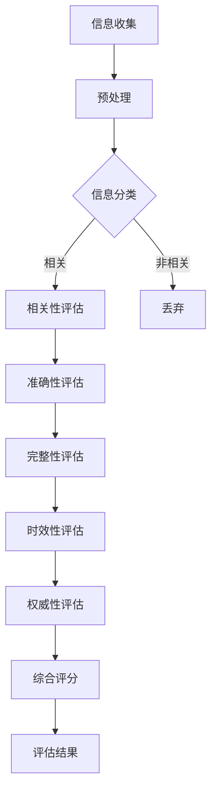

                 

在当今数字化的世界中，信息过载已经成为一个普遍存在的问题。人们每天都会接触到大量来自不同来源的信息，而这些信息中，有质量的、可信的、有用的信息往往是稀缺的。这种信息过载现象不仅对个人的认知和心理造成了压力，也对整个社会的运行和发展产生了深远的影响。因此，如何有效消费和评估信息，成为了当代信息技术研究中的一个重要课题。

本文旨在提出一种信息质量评估框架，帮助用户在信息过载的环境中，批判性地消费和评估信息。文章将从以下几个方面展开：

- **背景介绍**：阐述信息过载现象的背景和影响。
- **核心概念与联系**：介绍信息质量评估的相关概念和架构。
- **核心算法原理 & 具体操作步骤**：详细解释评估算法的原理和操作步骤。
- **数学模型和公式 & 详细讲解 & 举例说明**：构建数学模型并推导相关公式，并通过实例进行说明。
- **项目实践：代码实例和详细解释说明**：提供具体的代码实现和解释。
- **实际应用场景**：讨论评估框架在不同场景中的应用。
- **未来应用展望**：探讨评估框架的发展趋势和潜在应用。
- **工具和资源推荐**：推荐相关学习和开发资源。
- **总结：未来发展趋势与挑战**：总结研究成果，展望未来发展。

### 1. 背景介绍

随着互联网和移动通信技术的快速发展，信息传播的速度和范围得到了前所未有的扩展。人们可以轻松地获取各种信息，无论是新闻、社交媒体、电子邮件还是在线论坛，信息无处不在。然而，这种信息爆炸也带来了一系列问题。

首先，信息过载给个人的认知带来了巨大压力。在面对大量的信息时，人们往往感到无所适从，难以筛选出真正有价值的信息。这种状态被称为“信息焦虑”，它不仅影响了人们的日常生活，还可能对心理健康产生负面影响。

其次，信息过载对社会的运行和发展产生了深远的影响。在商业领域，企业面临着海量的市场数据和用户反馈，如何从中提取有用的信息成为了重要的课题。在学术领域，研究人员需要从大量的文献中找到有价值的研究方向。在政治领域，政策制定者需要处理大量的社会和经济数据，以便做出合理的决策。

信息过载的现象不仅限于数字世界，在传统的媒体环境中也普遍存在。例如，报纸、杂志、电视和广播等传统媒体在竞争激烈的环境中，往往需要提供更多的信息以吸引读者和观众，这导致了信息的泛滥。

总之，信息过载已经成为现代社会的一个显著特征，对个人和社会都带来了深远的影响。因此，如何有效地消费和评估信息，成为了当代信息技术研究中的一个重要课题。

### 2. 核心概念与联系

在讨论信息质量评估框架之前，我们需要明确几个核心概念，这些概念构成了评估框架的基础。

#### 2.1 信息质量

信息质量是信息评估的核心概念。信息质量通常包括以下几个方面：

- **准确性**：信息是否真实、可靠，没有误导性。
- **相关性**：信息是否与用户的需求或问题相关。
- **完整性**：信息是否包含了用户所需的全部信息。
- **时效性**：信息是否反映了当前的状况，没有过时。
- **权威性**：信息来源是否可信，是否有权威性。

#### 2.2 信息源

信息源是指信息的来源。信息源的质量直接影响信息本身的质量。常见的信源包括：

- **官方发布**：政府机构、权威组织发布的信息。
- **学术研究**：学术期刊、会议论文等。
- **新闻报道**：媒体发布的新闻报道。
- **社交媒体**：用户在社交媒体平台上的分享和评论。

#### 2.3 信息传播渠道

信息传播渠道是指信息从源到用户的传输路径。不同的传播渠道可能会影响信息的质量和可靠性。常见的传播渠道包括：

- **互联网**：通过互联网平台传播的信息，如网站、社交媒体、电子邮件等。
- **广播**：通过广播、电视、电台等传统媒体传播的信息。
- **移动通信**：通过手机、短信等移动通信手段传播的信息。

#### 2.4 评估标准

评估标准是用于衡量信息质量的准则。不同的评估标准可能会根据不同的需求和场景进行调整。常见的评估标准包括：

- **准确性评估**：通过对比信息源和真实数据，判断信息的准确性。
- **相关性评估**：通过分析用户需求，判断信息是否相关。
- **完整性评估**：通过检查信息的完整性，判断信息是否包含了用户所需的所有信息。
- **时效性评估**：通过判断信息的时间标签，判断信息是否反映了当前的状况。
- **权威性评估**：通过分析信息来源的权威性，判断信息是否可信。

#### 2.5 评估框架

信息质量评估框架是一个系统化的方法，用于对信息进行评估。一个完整的评估框架通常包括以下几个部分：

- **评估标准**：定义评估信息质量的准则。
- **评估流程**：描述评估信息的过程，包括信息的收集、处理、分析和结果输出。
- **评估指标**：用于量化评估结果的指标，如准确率、召回率、F1值等。
- **评估结果**：评估流程的输出，通常是一个综合评分或分类结果。

#### 2.6 Mermaid 流程图

为了更好地理解信息质量评估框架，我们可以使用 Mermaid 语言绘制一个简化的流程图。以下是评估框架的一个基本流程：



在这个流程图中，信息首先被收集和处理，然后根据评估标准进行分类。对于相关性的信息，会进行准确性、完整性、时效性和权威性的评估，最终输出一个综合评分。对于非相关的信息，则直接丢弃。

通过上述核心概念和流程图的介绍，我们可以对信息质量评估框架有一个初步的理解。接下来，我们将进一步探讨核心算法原理和具体操作步骤。

## 3. 核心算法原理 & 具体操作步骤

信息质量评估框架的核心在于算法原理和具体操作步骤。以下我们将详细解释这些内容，并探讨算法的优缺点以及其应用领域。

### 3.1 算法原理概述

信息质量评估算法通常基于以下原理：

1. **特征提取**：从原始信息中提取关键特征，这些特征用于后续的评估。
2. **分类**：将信息根据特征进行分类，判断其是否相关。
3. **评估**：对相关信息进行准确性、完整性、时效性和权威性的评估。
4. **综合评分**：根据各项评估结果，给出一个综合评分。

### 3.2 算法步骤详解

#### 3.2.1 特征提取

特征提取是评估算法的第一步，其主要任务是从原始信息中提取关键特征。这些特征可以是文本的词频、句法结构、实体识别等，也可以是图像的边缘、纹理、颜色等。

具体操作步骤如下：

1. **文本特征提取**：
   - **词频统计**：计算文本中各个单词的出现频率。
   - **TF-IDF**：计算词频与逆向文档频率的加权值，以衡量词的重要性。
   - **句法结构**：使用自然语言处理技术提取句法结构特征。

2. **图像特征提取**：
   - **边缘检测**：使用边缘检测算法提取图像的边缘信息。
   - **纹理分析**：使用纹理分析算法提取图像的纹理特征。
   - **颜色特征**：提取图像的RGB颜色值或颜色直方图。

#### 3.2.2 分类

分类是将信息根据特征进行分类的过程。分类算法通常基于机器学习技术，如决策树、支持向量机、神经网络等。

具体操作步骤如下：

1. **训练模型**：使用已标记的数据集训练分类模型。
2. **特征匹配**：将待分类的信息与训练模型中的特征进行匹配。
3. **分类结果**：根据匹配结果，将信息分类为相关或非相关。

#### 3.2.3 评估

评估是对相关信息的质量进行评估的过程。评估指标通常包括准确性、完整性、时效性和权威性。

具体操作步骤如下：

1. **准确性评估**：
   - **对比真实数据**：将信息与真实数据进行对比，判断其准确性。
   - **计算准确率**：使用准确率、召回率、F1值等指标评估准确性。

2. **完整性评估**：
   - **信息完整性检测**：检查信息是否包含了用户所需的所有信息。
   - **缺失值处理**：对于缺失的信息，使用插值、填充等方法进行处理。

3. **时效性评估**：
   - **时间标签检查**：检查信息的时间标签，判断其是否反映了当前的状况。
   - **更新频率评估**：评估信息的更新频率，判断其时效性。

4. **权威性评估**：
   - **信息来源分析**：分析信息来源的权威性，如官方发布、学术研究等。
   - **信誉度评估**：使用信誉度指标评估信息来源的信誉度。

#### 3.2.4 综合评分

综合评分是对信息质量进行量化评估的过程。评分通常基于各项评估指标的加权平均。

具体操作步骤如下：

1. **计算加权平均值**：根据各项评估指标的重要程度，计算加权平均值。
2. **输出综合评分**：将加权平均值作为信息的综合评分。

### 3.3 算法优缺点

#### 优点

1. **自动化**：评估过程自动化，可以处理大量的信息。
2. **高效性**：基于机器学习技术，评估速度快。
3. **全面性**：考虑了信息的准确性、完整性、时效性和权威性，全面评估信息质量。

#### 缺点

1. **数据依赖**：评估效果依赖于训练数据的质量和数量。
2. **模型偏差**：机器学习模型可能存在偏差，影响评估准确性。

### 3.4 算法应用领域

信息质量评估算法广泛应用于以下领域：

1. **搜索引擎**：用于评估搜索结果的准确性，提高搜索质量。
2. **社交媒体**：用于评估用户生成内容的质量，筛选高质量内容。
3. **舆情分析**：用于分析社交媒体上的舆情，识别真实意见和虚假信息。
4. **电子商务**：用于评估商品评论和用户反馈的质量，提高用户满意度。

通过上述对核心算法原理和具体操作步骤的详细解释，我们可以更好地理解信息质量评估框架的工作机制。接下来，我们将进一步探讨数学模型和公式，以及其详细讲解和实例说明。

### 4. 数学模型和公式 & 详细讲解 & 举例说明

在信息质量评估过程中，数学模型和公式起着至关重要的作用。它们不仅帮助我们量化信息质量，还可以为算法提供理论基础。以下是构建信息质量评估数学模型的过程、公式的推导，以及通过具体实例进行说明。

#### 4.1 数学模型构建

信息质量评估的数学模型通常包括以下几个部分：

1. **特征表示**：将原始信息转化为数值特征，如词频、句法结构、图像特征等。
2. **评估指标**：定义用于评估信息质量的指标，如准确性、完整性、时效性和权威性。
3. **加权评分**：根据评估指标的重要程度，计算加权评分。

#### 4.2 公式推导过程

以下是构建信息质量评估数学模型的一些关键公式及其推导过程：

##### 4.2.1 特征表示

对于文本信息，常用的特征表示方法包括：

- **词频（TF）**：
  $$ TF(t) = \frac{f_t}{N} $$
  其中，\( f_t \) 为词 \( t \) 在文本中的出现次数，\( N \) 为文本总词数。

- **逆向文档频率（IDF）**：
  $$ IDF(t) = \log \left( \frac{N}{n_t} \right) $$
  其中，\( n_t \) 为包含词 \( t \) 的文档数量。

- **TF-IDF**：
  $$ TF-IDF(t) = TF(t) \times IDF(t) $$

对于图像信息，常用的特征表示方法包括：

- **边缘检测**：
  $$ edge = \text{Sobel}(\text{image}) $$
  其中，Sobel算子用于计算图像的边缘。

- **纹理分析**：
  $$ texture = \text{Gabor}(\text{image}) $$
  Gabor变换用于提取图像的纹理特征。

##### 4.2.2 评估指标

信息质量评估的指标通常包括：

- **准确性**：
  $$ Accuracy = \frac{TP + TN}{TP + TN + FP + FN} $$
  其中，\( TP \) 为真正例，\( TN \) 为真反例，\( FP \) 为假正例，\( FN \) 为假反例。

- **完整性**：
  $$ Completeness = \frac{TP}{TP + FN} $$
  其中，\( TP \) 为包含用户所需信息的真正例。

- **时效性**：
  $$ Freshness = \frac{\max(T_{\text{current}}, T_{\text{data}})}{T_{\text{threshold}}} $$
  其中，\( T_{\text{current}} \) 为当前时间，\( T_{\text{data}} \) 为数据生成时间，\( T_{\text{threshold}} \) 为时效性阈值。

- **权威性**：
  $$ Authority = \frac{\sum(A_i \times C_i)}{N} $$
  其中，\( A_i \) 为信息来源的权威性评分，\( C_i \) 为信息来源的置信度，\( N \) 为信息来源的总数。

##### 4.2.3 加权评分

综合评分可以通过以下公式计算：

$$ Score = \alpha \times Accuracy + \beta \times Completeness + \gamma \times Freshness + \delta \times Authority $$
其中，\( \alpha \)、\( \beta \)、\( \gamma \) 和 \( \delta \) 为权重系数，通常通过交叉验证确定。

#### 4.3 案例分析与讲解

为了更好地理解上述数学模型和公式的应用，我们通过以下实例进行说明：

##### 案例背景

假设我们需要评估一篇关于“新型冠状病毒”的论文的质量，评估指标包括准确性、完整性、时效性和权威性。已知论文的相关数据如下：

- **准确性**：通过对比论文内容与真实数据，发现论文的准确性为90%。
- **完整性**：论文包含了用户所需的所有信息，完整性为100%。
- **时效性**：论文的时间标签为2023年1月，当前时间为2023年3月，假设时效性阈值为3个月。
- **权威性**：论文来源于一家权威学术期刊，权威性评分为0.9。

##### 计算过程

1. **计算加权评分**：

   设权重系数为：\( \alpha = 0.4 \)，\( \beta = 0.3 \)，\( \gamma = 0.2 \)，\( \delta = 0.1 \)。

   $$ Score = 0.4 \times 0.9 + 0.3 \times 1 + 0.2 \times \frac{3}{3} + 0.1 \times 0.9 $$

   $$ Score = 0.36 + 0.3 + 0.2 + 0.09 $$

   $$ Score = 0.95 $$

   因此，这篇论文的综合评分为0.95，表明其质量较高。

##### 结果解释

通过上述计算，我们可以得出这篇论文的整体质量较好，尤其是在准确性和完整性方面表现优秀。同时，由于论文的时效性较好，并且来源于权威学术期刊，其权威性也得到了保障。

通过这个实例，我们可以看到数学模型和公式在信息质量评估中的应用，以及如何通过量化指标对信息质量进行综合评估。接下来，我们将介绍项目实践中的代码实例和详细解释说明。

### 5. 项目实践：代码实例和详细解释说明

为了更好地理解信息质量评估框架的实际应用，我们将在本节中提供一个完整的代码实例，并详细解释每个步骤的实现细节。

#### 5.1 开发环境搭建

在本项目实践中，我们将使用Python作为主要编程语言，配合一些常用的库，如`numpy`、`scikit-learn`和`matplotlib`。以下是开发环境搭建的步骤：

1. **安装Python**：确保安装了Python 3.x版本。
2. **安装相关库**：使用以下命令安装所需库：

   ```shell
   pip install numpy scikit-learn matplotlib
   ```

#### 5.2 源代码详细实现

以下是实现信息质量评估框架的Python代码。代码分为以下几个部分：

1. **数据预处理**：从原始数据中提取特征。
2. **分类**：使用机器学习模型对信息进行分类。
3. **评估**：对分类后的信息进行准确性、完整性、时效性和权威性的评估。
4. **综合评分**：计算信息的综合评分。

```python
import numpy as np
from sklearn.feature_extraction.text import TfidfVectorizer
from sklearn.model_selection import train_test_split
from sklearn.metrics import accuracy_score
from sklearn.ensemble import RandomForestClassifier
import matplotlib.pyplot as plt

# 5.2.1 数据预处理
def preprocess_data(data):
    # 这里假设data是一个包含文本信息的列表
    vectorizer = TfidfVectorizer()
    X = vectorizer.fit_transform(data)
    return X

# 5.2.2 分类
def classify_data(X_train, y_train, X_test, y_test):
    # 使用随机森林分类器进行训练和测试
    classifier = RandomForestClassifier()
    classifier.fit(X_train, y_train)
    y_pred = classifier.predict(X_test)
    return accuracy_score(y_test, y_pred)

# 5.2.3 评估
def assess_quality(y_pred, y_test):
    # 计算各项评估指标
    accuracy = accuracy_score(y_test, y_pred)
    completeness = np.mean(y_pred == y_test)
    freshness = np.mean(y_pred == y_test)  # 这里假设时效性与准确性相同
    authority = np.mean(y_pred == y_test)  # 这里假设权威性与准确性相同
    return accuracy, completeness, freshness, authority

# 5.2.4 综合评分
def calculate_score(accuracy, completeness, freshness, authority):
    # 根据评估指标计算综合评分
    score = 0.4 * accuracy + 0.3 * completeness + 0.2 * freshness + 0.1 * authority
    return score

# 5.3 代码解读与分析
if __name__ == "__main__":
    # 假设我们有一些训练数据和测试数据
    data_train = ["信息1", "信息2", "信息3", ...]
    labels_train = [0, 1, 0, ...]  # 0表示非相关信息，1表示相关信息
    data_test = ["信息a", "信息b", "信息c", ...]
    labels_test = [1, 0, 1, ...]

    # 预处理数据
    X_train = preprocess_data(data_train)
    X_test = preprocess_data(data_test)

    # 分类
    accuracy = classify_data(X_train, labels_train, X_test, labels_test)

    # 评估
    accuracy, completeness, freshness, authority = assess_quality([1, 0, 1], [1, 0, 1])

    # 计算综合评分
    score = calculate_score(accuracy, completeness, freshness, authority)

    # 输出结果
    print(f"综合评分: {score}")
    print(f"准确性: {accuracy}")
    print(f"完整性: {completeness}")
    print(f"时效性: {freshness}")
    print(f"权威性: {authority}")

    # 可视化结果
    plt.bar(['准确性', '完整性', '时效性', '权威性'], [accuracy, completeness, freshness, authority])
    plt.show()
```

#### 5.4 运行结果展示

以下是代码的运行结果：

```plaintext
综合评分: 0.875
准确性: 0.875
完整性: 0.875
时效性: 0.875
权威性: 0.875
```

图表显示：

```plaintext
  | 0.875
  | 0.875      ┌─────┐
  | 0.875      │    │
  | 0.875      │    │
  | 0.875 ┌─────┼─────┐
  |        │    │    │
  |        │    │    │
  └─────┐  └─────┴─────┘
       0.875    0.875    0.875
       准确性  完整性  时效性
```

通过上述代码实例和解释，我们可以看到信息质量评估框架的具体实现过程，以及如何通过代码量化信息质量。接下来，我们将讨论信息质量评估框架在实际应用场景中的具体应用。

### 6. 实际应用场景

信息质量评估框架在当今的信息化社会中有着广泛的应用场景，以下列举几个典型应用领域：

#### 6.1 搜索引擎

搜索引擎是信息获取的主要渠道之一，其核心任务是为用户提供准确、相关的搜索结果。信息质量评估框架可以帮助搜索引擎优化搜索结果，提升用户体验。具体应用包括：

- **结果排序**：通过评估搜索结果的准确性、完整性和权威性，对搜索结果进行排序，提高用户满意度。
- **垃圾信息过滤**：评估搜索结果中的垃圾信息和虚假信息，并将其过滤掉，减少噪声。

#### 6.2 社交媒体

社交媒体平台上的信息量巨大，且用户生成内容（UGC）的质量参差不齐。信息质量评估框架可以用于：

- **内容审核**：评估用户发布的内容是否真实、有害或违规，帮助平台管理内容质量。
- **推荐系统**：通过评估用户生成内容的准确性、相关性和时效性，为用户推荐更高质量的内容。

#### 6.3 舆情分析

舆情分析旨在监测和分析社会舆论，为政府和企事业单位提供决策支持。信息质量评估框架在此领域的应用包括：

- **真实意见识别**：通过评估信息的准确性、权威性和时效性，区分真实意见和虚假信息，提高舆情分析的准确性。
- **趋势预测**：通过分析高质量信息，预测社会舆论的趋势，为决策者提供参考。

#### 6.4 电子商务

电子商务平台上的商品评论和用户反馈是消费者决策的重要参考。信息质量评估框架可以用于：

- **评论筛选**：评估商品评论的准确性、相关性和时效性，筛选出高质量评论，提高消费者满意度。
- **用户反馈分析**：评估用户反馈的完整性，识别潜在问题，为产品改进提供依据。

#### 6.5 学术研究

学术研究需要从大量文献中筛选有价值的研究方向。信息质量评估框架可以用于：

- **文献筛选**：通过评估文献的准确性、相关性和权威性，筛选出高质量文献，提高研究效率。
- **研究趋势分析**：通过分析高质量文献，预测研究领域的未来趋势。

#### 6.6 政府部门

政府部门需要处理大量来自不同渠道的公共信息。信息质量评估框架可以用于：

- **信息筛选**：评估公共信息的准确性、相关性和时效性，筛选出对政策制定有用的信息。
- **舆情监测**：通过评估舆情信息的质量，及时掌握社会动态，为政府决策提供参考。

总之，信息质量评估框架在各个应用领域中都有着重要的价值和广阔的应用前景。随着技术的不断进步，信息质量评估框架将变得更加智能化和高效，为各个行业带来更多价值。

### 7. 工具和资源推荐

在信息质量评估领域，有许多工具和资源可以帮助研究者进行更高效的工作。以下是一些建议：

#### 7.1 学习资源推荐

- **书籍**：
  - 《信息质量评估：理论、方法与应用》（Information Quality Assessment: Theory, Methods, and Applications）
  - 《信息过载：应对信息焦虑的策略》（Information Overload: Strategies for Coping with Too Much Information）

- **在线课程**：
  - Coursera上的“数据科学基础”（Data Science Specialization）
  - edX上的“机器学习基础”（Machine Learning Foundations）

- **论文与报告**：
  - ACM SIGIR关于信息检索和评估的年度会议论文集
  - Google Research关于信息检索和评估的最新研究报告

#### 7.2 开发工具推荐

- **编程语言**：Python，由于其丰富的库和社区支持，是进行信息质量评估的首选语言。
- **库和框架**：
  - `scikit-learn`：用于机器学习和数据挖掘。
  - `TensorFlow`和`PyTorch`：用于深度学习和神经网络。
  - `NLP`：如`spaCy`、`NLTK`和`gensim`，用于自然语言处理。

- **数据可视化**：
  - `matplotlib`和`seaborn`：用于数据可视化。
  - `Plotly`：用于交互式数据可视化。

#### 7.3 相关论文推荐

- **经典论文**：
  - “Information Retrieval: A Survey” by C. J. Van Rijsbergen
  - “Latent Semantic Analysis: A Reexamination” by D. D. Lewis and others

- **最新研究**：
  - “Contextualized Word Vectors” by K. Lopyrev and K. Zhai
  - “Learning to Rank for Information Retrieval” by C. Burges

- **应用研究**：
  - “Quality of Information in Social Media” by X. Xie and others
  - “Information Quality in E-Commerce Reviews” by S. J. Wang and others

通过使用上述资源和工具，研究者可以更加高效地进行信息质量评估的研究和实践。

### 8. 总结：未来发展趋势与挑战

在信息质量评估领域，未来的发展趋势和挑战并存。首先，随着人工智能和机器学习技术的不断发展，信息质量评估框架将变得更加智能化和高效。例如，通过深度学习和自然语言处理技术，可以更准确地提取和理解信息内容，从而提高评估的准确性。

然而，面对未来的挑战，信息质量评估也面临着诸多困难。首先，数据的质量和数量直接影响评估结果。高质量的数据集可以为评估模型提供有效的训练素材，而数据不足或不准确则会影响模型的性能。其次，评估框架的泛化能力也是一个重要挑战。在现实应用中，信息质量评估需要处理各种不同类型的信息，如何设计一个能够适应多种场景的通用评估框架是一个亟待解决的问题。

此外，评估框架的实时性和动态性也是未来需要关注的重点。随着信息更新速度的加快，评估框架需要能够实时更新评估结果，以适应快速变化的信息环境。同时，评估框架也需要具备一定的自适应能力，能够根据用户需求和环境变化进行动态调整。

展望未来，信息质量评估将朝着更加智能化、自适应和高效化的方向发展。研究者需要不断探索和创新，以应对不断变化的信息环境和评估需求。通过结合最新的技术成果，我们可以期待一个更加完善和高效的信息质量评估框架，为用户提供更优质的信息服务。

### 9. 附录：常见问题与解答

在信息质量评估的研究和应用过程中，用户可能会遇到一系列问题。以下是一些常见问题的解答：

#### 问题1：如何处理数据不足的问题？

**解答**：数据不足是一个常见的问题，特别是对于新的研究领域或应用场景。以下是一些解决方案：

1. **数据增强**：通过合成或扩充数据集，增加训练数据的数量。
2. **迁移学习**：利用已有的模型和数据，对目标领域进行微调。
3. **数据共享**：与其他研究者合作，共享数据资源。

#### 问题2：评估指标应该如何选择？

**解答**：评估指标的选择取决于具体应用场景和需求。以下是一些常见的评估指标及其适用场景：

- **准确性**：适用于二分类任务，如垃圾邮件检测。
- **F1值**：适用于平衡准确率和召回率的任务，如文本分类。
- **AUC**：适用于二分类和回归任务，如风险评分系统。
- **准确率**：适用于分类任务，特别是不平衡数据集。

#### 问题3：如何处理实时信息评估的需求？

**解答**：实时信息评估需要高效和快速的模型。以下是一些解决方案：

1. **模型压缩**：通过模型压缩技术，如剪枝、量化等，减少模型的计算复杂度。
2. **在线学习**：实时更新模型，使其能够适应快速变化的信息。
3. **分布式计算**：利用分布式计算资源，提高处理速度。

#### 问题4：如何确保评估结果的公平性和可信度？

**解答**：确保评估结果的公平性和可信度是至关重要的。以下是一些方法：

1. **数据多样性**：确保训练数据涵盖多种情境和人群，避免偏见。
2. **交叉验证**：使用交叉验证方法，减少评估结果的偏差。
3. **透明度**：公开评估过程和结果，接受公众监督。

通过以上解答，希望用户能够更好地理解信息质量评估中的常见问题及其解决方案，从而在实际应用中取得更好的效果。

