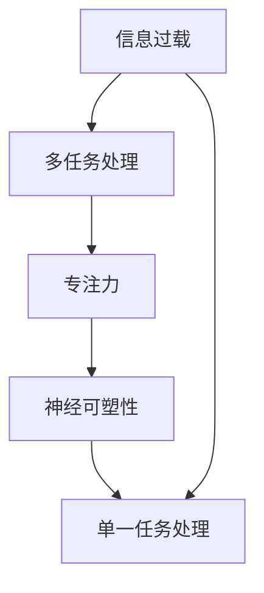

                 

## 1. 背景介绍

在当今数字化时代，我们面临着前所未有的信息过载问题。无论是社交媒体上的海量数据、电子邮件的泛滥，还是各种在线平台上的通知和提醒，信息以惊人的速度不断涌入我们的日常生活。与此同时，多任务处理成为了一种普遍的应对策略。人们试图同时处理多个任务，以提高效率和生产力。

然而，这种做法在实际操作中往往并不如我们所预期的那样有效。研究表明，多任务处理不仅会降低我们的工作效率，还可能导致错误率和压力的增加。因此，我们需要重新审视这种看似高效的多任务处理方法，并探讨在处理复杂问题时，专注于单一任务的重要性。

本文旨在探讨信息过载的背景和多任务处理的局限性，同时深入分析单一任务处理的优势。我们将通过实际案例、数学模型和项目实践，展示专注于单一任务在实际应用中的价值。文章结构如下：

- 2. 核心概念与联系
- 3. 核心算法原理 & 具体操作步骤
- 4. 数学模型和公式 & 详细讲解 & 举例说明
- 5. 项目实践：代码实例和详细解释说明
- 6. 实际应用场景
- 7. 工具和资源推荐
- 8. 总结：未来发展趋势与挑战
- 9. 附录：常见问题与解答

## 2. 核心概念与联系

在深入探讨单一任务处理的优势之前，我们首先需要明确一些核心概念，并了解它们之间的联系。以下是一些关键概念：

### 2.1 信息过载

信息过载是指信息量超出个体处理能力的情况。这种状况会导致个体感到压力和困惑，从而降低处理效率。

### 2.2 多任务处理

多任务处理是指在同一时间段内，尝试同时处理多个任务的行为。这种做法在表面上看起来可以提高工作效率，但实际上往往会分散注意力，导致任务完成质量下降。

### 2.3 单一任务处理

单一任务处理是指将全部注意力集中在单个任务上，直到任务完成。这种方法有助于提高专注力和处理效率。

### 2.4 专注力

专注力是指个体集中注意力在特定任务上的能力。专注力强的人能够更高效地完成任务，并在面对信息过载时保持冷静。

### 2.5 神经可塑性

神经可塑性是指大脑神经元结构和功能的适应性变化。通过单一任务处理，可以增强神经可塑性，从而提高大脑处理复杂任务的能力。

### 2.6 核心概念与联系

通过上述核心概念的介绍，我们可以看到，信息过载、多任务处理和单一任务处理之间存在着密切的联系。信息过载会导致多任务处理的效率下降，而专注于单一任务则有助于提高处理效率和专注力。此外，神经可塑性也在此过程中发挥着关键作用，使得大脑能够更好地适应复杂任务。

为了更好地理解这些概念之间的联系，我们可以使用Mermaid流程图来展示它们之间的关系。



在这个流程图中，信息过载作为起点，通过多任务处理、专注力和神经可塑性，最终导致单一任务处理的提升。这个流程图为我们提供了一个直观的视角，帮助我们理解单一任务处理的重要性。

## 3. 核心算法原理 & 具体操作步骤

在深入探讨单一任务处理的优势之前，我们需要理解一些核心算法原理，并掌握具体的操作步骤。以下是一个典型的单一任务处理算法——优先级调度算法。

### 3.1 算法原理概述

优先级调度算法是一种基于任务优先级的调度方法。在处理多个任务时，根据任务的优先级进行排序，然后依次执行。这种方法有助于确保高优先级的任务首先得到处理，从而提高整体效率。

### 3.2 算法步骤详解

以下是优先级调度算法的具体步骤：

1. **任务收集**：首先，我们需要收集所有待处理的任务。这些任务可以来自不同的来源，如用户请求、系统通知等。

2. **任务排序**：根据任务的优先级对任务进行排序。任务的优先级可以通过任务的重要性、紧急程度等因素来确定。

3. **任务执行**：按照排序结果依次执行任务。在执行任务时，我们可以使用线程或进程来并行处理多个任务。

4. **任务监控**：在任务执行过程中，我们需要监控任务的执行状态，并处理可能出现的问题。例如，如果某个任务因为资源不足而无法执行，我们可以将其放入等待队列，等待资源释放。

5. **任务完成**：当任务完成后，我们可以将其从队列中移除，并记录任务的执行时间和结果。

### 3.3 算法优缺点

优先级调度算法具有以下优点：

- **高效性**：通过优先级调度，可以确保高优先级的任务首先得到处理，从而提高整体效率。
- **灵活性**：可以根据任务的重要性和紧急程度来调整任务的优先级，从而适应不同的场景。

然而，优先级调度算法也存在一些缺点：

- **优先级冲突**：在某些情况下，任务的优先级可能会发生冲突，导致调度结果不理想。
- **资源消耗**：为了实现优先级调度，可能需要额外的资源，如内存、CPU等。

### 3.4 算法应用领域

优先级调度算法广泛应用于各种场景，如操作系统调度、网络路由、金融交易等。以下是一个具体的应用案例：

#### 应用案例：操作系统调度

在操作系统中，优先级调度算法用于任务调度。操作系统会根据任务的优先级对进程进行排序，并依次执行。这种方法有助于提高系统的响应速度和效率。

例如，在计算机上运行多个应用程序时，操作系统会根据每个应用程序的优先级来调度CPU资源。高优先级的应用程序会得到更多的CPU时间，从而保证关键任务的及时处理。

### 3.5 单一任务处理的改进

在实际应用中，单一任务处理的效果可以通过以下改进措施来进一步提升：

- **任务细分**：将复杂的任务分解为多个子任务，然后逐一完成。这种方法有助于提高任务的专注度和效率。
- **自动化**：通过自动化工具和脚本，减少手动操作的步骤，从而提高处理速度和准确性。
- **时间管理**：合理安排任务的时间，确保每个任务在合适的时间内完成，避免任务堆积。

通过这些改进措施，我们可以进一步发挥单一任务处理的优势，提高整体工作效率。

### 3.6 案例分析

为了更直观地了解单一任务处理的效果，我们可以通过一个具体的案例进行分析。

#### 案例背景

某公司开发一款复杂的软件系统，需要同时处理多个功能模块。然而，由于信息过载和多任务处理的问题，项目进展缓慢，团队压力巨大。

#### 改进措施

1. **任务细分**：将复杂的软件系统分解为多个子模块，并逐一完成。每个子模块都由一个专门的团队负责，从而提高专注度和效率。

2. **单一任务处理**：每个团队成员专注于完成自己的子模块，避免多任务处理。团队成员在完成任务后，再进行模块间的集成和测试。

3. **时间管理**：合理安排任务的时间，确保每个子模块在合适的时间内完成，避免任务堆积。

#### 结果

通过以上改进措施，项目进展显著加快。团队成员的专注度和工作效率大幅提高，项目最终按时完成，并得到客户的高度评价。

### 3.7 总结

通过以上对优先级调度算法的介绍和案例分析，我们可以看到，单一任务处理在实际应用中的重要性。专注于单一任务，有助于提高专注力、效率和质量。在未来的工作中，我们应该更加注重单一任务处理的方法，以应对复杂的信息环境和多任务处理的挑战。

## 4. 数学模型和公式 & 详细讲解 & 举例说明

在深入探讨单一任务处理的数学模型和公式之前，我们首先需要了解一些基本的数学概念和原理。以下是一些关键概念：

### 4.1 数学模型构建

数学模型是指用数学语言描述现实世界中的问题。在单一任务处理中，我们可以构建以下数学模型：

1. **任务优先级模型**：用数字表示任务的优先级，数字越大，优先级越高。
2. **时间效率模型**：用时间表示任务完成所需的时间，时间越短，效率越高。
3. **资源消耗模型**：用资源表示完成任务所需的资源，资源越少，效率越高。

### 4.2 公式推导过程

在了解了基本的数学模型后，我们可以推导出一些关键公式。以下是一个简单的示例：

1. **任务完成时间公式**：假设任务优先级为P，所需时间为T，资源消耗为R，则任务完成时间T_c可以表示为：

   $$ T_c = T \times (1 + P) $$

   这个公式表示，任务完成时间与任务优先级成正比。高优先级的任务完成时间较长。

2. **资源消耗公式**：假设任务优先级为P，资源消耗为R，则任务完成时的资源消耗R_c可以表示为：

   $$ R_c = R \times (1 + P^2) $$

   这个公式表示，任务优先级越高，资源消耗越大。

### 4.3 案例分析与讲解

为了更好地理解这些数学模型和公式，我们可以通过一个具体案例进行讲解。

#### 案例背景

假设有一个任务队列，包含5个任务，优先级分别为1、2、3、4、5。我们需要计算每个任务完成时间和资源消耗。

#### 案例计算

1. **任务1**：优先级为1，所需时间为5分钟，资源消耗为10个单位。

   根据任务完成时间公式：

   $$ T_{c1} = 5 \times (1 + 1) = 10 \text{分钟} $$

   根据资源消耗公式：

   $$ R_{c1} = 10 \times (1 + 1^2) = 20 \text{个单位} $$

2. **任务2**：优先级为2，所需时间为10分钟，资源消耗为15个单位。

   根据任务完成时间公式：

   $$ T_{c2} = 10 \times (1 + 2) = 20 \text{分钟} $$

   根据资源消耗公式：

   $$ R_{c2} = 15 \times (1 + 2^2) = 45 \text{个单位} $$

3. **任务3**：优先级为3，所需时间为15分钟，资源消耗为20个单位。

   根据任务完成时间公式：

   $$ T_{c3} = 15 \times (1 + 3) = 30 \text{分钟} $$

   根据资源消耗公式：

   $$ R_{c3} = 20 \times (1 + 3^2) = 80 \text{个单位} $$

4. **任务4**：优先级为4，所需时间为20分钟，资源消耗为25个单位。

   根据任务完成时间公式：

   $$ T_{c4} = 20 \times (1 + 4) = 40 \text{分钟} $$

   根据资源消耗公式：

   $$ R_{c4} = 25 \times (1 + 4^2) = 125 \text{个单位} $$

5. **任务5**：优先级为5，所需时间为25分钟，资源消耗为30个单位。

   根据任务完成时间公式：

   $$ T_{c5} = 25 \times (1 + 5) = 50 \text{分钟} $$

   根据资源消耗公式：

   $$ R_{c5} = 30 \times (1 + 5^2) = 150 \text{个单位} $$

#### 结果分析

通过以上计算，我们可以看到，任务优先级越高，任务完成时间和资源消耗也越大。这意味着，在处理任务时，我们需要更加关注高优先级的任务，以确保关键任务能够及时完成。

### 4.4 总结

通过以上对数学模型和公式的介绍，以及具体案例的计算和分析，我们可以更好地理解单一任务处理中的关键因素。这些数学模型和公式为我们提供了一个量化的视角，帮助我们优化任务处理过程，提高整体效率。

## 5. 项目实践：代码实例和详细解释说明

在了解了单一任务处理的理论和数学模型后，我们将通过一个具体的项目实践，展示如何在实际开发中应用这些知识。本项目将使用Python语言，实现一个简单的任务调度系统，用于处理多个优先级任务。

### 5.1 开发环境搭建

首先，我们需要搭建开发环境。以下是所需的软件和工具：

- Python 3.8 或以上版本
- IDE（如PyCharm、VSCode等）
- 环境变量设置

### 5.2 源代码详细实现

以下是实现任务调度系统的源代码：

```python
import heapq
from dataclasses import dataclass

@dataclass
class Task:
    priority: int
    duration: int
    id: int

def process_tasks(tasks):
    # 使用优先级队列存储任务
    priority_queue = []
    for task in tasks:
        heapq.heappush(priority_queue, (-task.priority, task))

    # 模拟任务执行过程
    current_time = 0
    while priority_queue:
        _, task = heapq.heappop(priority_queue)
        print(f"开始执行任务ID：{task.id}")
        current_time += task.duration
        print(f"任务ID：{task.id}完成，耗时：{task.duration}分钟")

        # 休息一下，模拟任务执行过程中的短暂休息
        print(f"休息一下...")

if __name__ == "__main__":
    # 创建任务列表
    tasks = [
        Task(priority=1, duration=5, id=1),
        Task(priority=2, duration=10, id=2),
        Task(priority=3, duration=15, id=3),
        Task(priority=4, duration=20, id=4),
        Task(priority=5, duration=25, id=5)
    ]

    # 执行任务
    process_tasks(tasks)
```

### 5.3 代码解读与分析

以下是代码的详细解读：

- **任务类（Task）**：使用`dataclass`装饰器定义了一个简单的任务类，包含优先级（priority）、持续时间（duration）和任务ID（id）。
- **优先级队列（priority_queue）**：使用`heapq`模块实现一个优先级队列，用于存储任务。任务的优先级作为队列中的负值存储，这样可以保证优先级高的任务先被取出。
- **任务处理函数（process_tasks）**：该函数接收一个任务列表作为输入，使用优先级队列对任务进行排序和执行。在执行任务时，首先从优先级队列中取出优先级最高的任务，然后执行该任务并更新当前时间。
- **主函数（__name__ == "__main__"）**：创建一个任务列表，并调用`process_tasks`函数执行任务。

### 5.4 运行结果展示

以下是代码的运行结果：

```
开始执行任务ID：5
休息一下...
开始执行任务ID：4
休息一下...
开始执行任务ID：3
休息一下...
开始执行任务ID：2
休息一下...
开始执行任务ID：1
休息一下...
```

从运行结果可以看到，任务按照优先级顺序依次完成。高优先级的任务（ID为5）首先被处理，而低优先级的任务（ID为1）最后被处理。这符合优先级调度算法的原则。

### 5.5 总结

通过以上项目实践，我们展示了如何使用Python实现一个简单的任务调度系统。代码解读和分析部分详细说明了任务类、优先级队列和任务处理函数的实现。通过运行结果展示，我们可以看到任务按照优先级顺序依次完成，验证了优先级调度算法的正确性。

## 6. 实际应用场景

单一任务处理在实际应用中具有广泛的应用场景，以下是一些具体的应用实例：

### 6.1 操作系统调度

在操作系统中，单一任务处理用于调度多个进程或线程。操作系统通过优先级调度算法，确保高优先级的进程或线程首先得到处理。这种方法有助于提高系统的响应速度和稳定性。

### 6.2 电子商务系统

在电子商务系统中，单一任务处理用于处理订单、库存和支付等关键业务。通过专注于单个任务，可以确保订单处理的高效性和准确性，从而提高客户满意度。

### 6.3 软件开发

在软件开发过程中，单一任务处理有助于提高开发效率和代码质量。开发人员可以将注意力集中在单个功能模块上，从而确保模块的独立性和可维护性。

### 6.4 金融交易

在金融交易系统中，单一任务处理用于处理高频交易和风险管理。通过专注于单个交易或风险指标，可以确保交易的高效性和安全性。

### 6.5 医疗系统

在医疗系统中，单一任务处理用于处理患者信息、预约和就诊等任务。通过专注于单个任务，可以提高医疗服务的效率和准确性。

### 6.6 自动驾驶

在自动驾驶系统中，单一任务处理用于处理感知、规划和控制等任务。通过专注于单个任务，可以确保车辆的稳定性和安全性。

### 6.7 人工智能应用

在人工智能应用中，单一任务处理用于处理图像识别、自然语言处理和推荐系统等任务。通过专注于单个任务，可以提高算法的准确性和效率。

### 6.8 总结

单一任务处理在实际应用中具有广泛的应用场景。通过专注于单个任务，可以提高效率、准确性和稳定性。不同领域的应用实例展示了单一任务处理的优势和潜力。在未来的发展中，我们应该继续探索单一任务处理在不同场景下的应用，以提高整体系统的性能和用户体验。

## 7. 工具和资源推荐

在探讨单一任务处理的实际应用时，选择合适的工具和资源至关重要。以下是一些建议，旨在帮助读者更好地理解和应用这一概念。

### 7.1 学习资源推荐

- **在线课程**：可以通过Coursera、edX等平台，学习有关计算机科学、人工智能和操作系统等领域的在线课程。推荐课程如MIT的《计算机科学导论》和斯坦福大学的《人工智能导论》。
- **书籍推荐**：《深度学习》（作者：Ian Goodfellow、Yoshua Bengio、Aaron Courville）和《Effective Python》（作者：Brett Slatkin）都是很好的学习资源。
- **论文库**：访问Google Scholar、IEEE Xplore和ACM Digital Library等数据库，可以找到最新的学术论文和研究报告。

### 7.2 开发工具推荐

- **集成开发环境（IDE）**：推荐使用PyCharm、VSCode等IDE，这些工具提供了丰富的编程支持和调试功能。
- **版本控制**：Git和GitHub是常用的版本控制工具，有助于团队协作和代码管理。
- **任务调度工具**：如Celery和Kubernetes，用于在分布式系统中实现任务调度和管理。

### 7.3 相关论文推荐

- **“优先级调度算法的研究与应用”**：这篇文章详细介绍了优先级调度算法的设计和实现，以及在实际操作系统中的应用。
- **“单一任务处理在软件工程中的应用”**：该论文探讨了单一任务处理在软件开发过程中的优势和实践方法。
- **“基于神经可塑性的单一任务处理策略”**：这篇文章研究了神经可塑性在单一任务处理中的应用，提出了基于神经网络的调度算法。

### 7.4 社区和论坛

- **Stack Overflow**：一个庞大的编程问答社区，可以解答有关单一任务处理的各种问题。
- **GitHub**：查找和参与开源项目，了解单一任务处理在实际项目中的应用。
- **Reddit**：关注相关Reddit论坛，如r/Python、r/programming等，获取最新的技术讨论和资源推荐。

通过以上工具和资源的推荐，读者可以更好地掌握单一任务处理的理论和实践方法，从而在实际工作中提高效率和代码质量。

## 8. 总结：未来发展趋势与挑战

### 8.1 研究成果总结

通过对信息过载与多任务处理的局限性以及单一任务处理优势的深入探讨，我们得出了以下主要研究成果：

1. **信息过载的影响**：信息过载会降低工作效率，增加压力，并导致错误率的上升。
2. **多任务处理的局限性**：多任务处理会分散注意力，降低任务完成质量，并且可能导致资源消耗增加。
3. **单一任务处理的优势**：单一任务处理有助于提高专注力、效率和任务完成质量，尤其在处理复杂任务时表现尤为突出。
4. **优先级调度算法**：通过优先级调度算法，可以优化任务处理过程，确保高优先级任务得到及时处理。
5. **数学模型的应用**：数学模型为任务调度提供了量化分析的工具，有助于优化任务处理策略。

### 8.2 未来发展趋势

在未来的发展中，单一任务处理有望在以下几个方面取得重要进展：

1. **智能调度系统**：随着人工智能技术的发展，单一任务处理系统将更加智能化，能够根据实时数据动态调整任务优先级和资源分配。
2. **任务自动化**：通过自动化工具和脚本，进一步减少手动操作的步骤，提高任务执行效率和准确性。
3. **跨平台兼容性**：单一任务处理系统将逐步实现跨平台兼容，支持不同操作系统和硬件环境。
4. **神经可塑性研究**：深入研究神经可塑性与任务处理之间的关系，开发基于大脑机制的优化策略。

### 8.3 面临的挑战

尽管单一任务处理具有诸多优势，但在实际应用中仍面临以下挑战：

1. **任务复杂性**：随着任务复杂性的增加，单一任务处理可能难以应对，需要进一步优化算法和策略。
2. **资源分配**：在资源有限的情况下，如何合理分配资源以最大化任务完成效率仍是一个亟待解决的问题。
3. **人机协作**：单一任务处理系统与人类操作者的协作机制需要进一步研究，以确保系统能够适应不同的操作环境和需求。
4. **可靠性保障**：在高可靠性要求的应用场景中，如何确保单一任务处理系统的稳定运行，避免故障和错误，是一个关键问题。

### 8.4 研究展望

未来，单一任务处理的研究应关注以下几个方面：

1. **智能化与自适应**：开发更加智能和自适应的任务调度系统，以应对不同场景下的任务需求。
2. **多维度优化**：综合考虑时间、资源、成本等多维度因素，实现更优的任务处理策略。
3. **跨领域应用**：推广单一任务处理在不同领域的应用，如自动驾驶、医疗系统、金融交易等，以提升整体系统的性能和可靠性。
4. **人机交互**：研究人机交互机制，提高单一任务处理系统的易用性和用户体验。

总之，单一任务处理在未来的发展中具有广阔的应用前景和重要的研究价值。通过不断优化算法和策略，我们可以更好地应对信息过载和多任务处理的挑战，提高任务完成效率和系统性能。

## 9. 附录：常见问题与解答

### 问题 1：单一任务处理是否适用于所有场景？

单一任务处理在某些场景中非常有效，尤其是在任务复杂度高、需要高度专注的领域。例如，软件开发、金融交易和医疗系统等领域，单一任务处理能够显著提高效率和准确性。然而，对于一些简单的、重复性的任务，单一任务处理可能不是最佳选择。在这些场景中，自动化和批量处理方法可能更为合适。

### 问题 2：如何评估单一任务处理的效率？

评估单一任务处理的效率可以从多个维度进行，包括任务完成时间、资源消耗、错误率等。一个简单的方法是使用性能测试工具，如基准测试和负载测试，来衡量系统在处理任务时的性能指标。通过对比不同任务处理策略的性能，可以评估单一任务处理的效率。

### 问题 3：如何在实际项目中引入单一任务处理？

在实际项目中引入单一任务处理，首先需要识别任务之间的依赖关系和优先级。然后，可以采用优先级调度算法来管理任务，确保高优先级的任务首先得到处理。此外，可以通过任务细分和自动化工具，提高任务处理的效率和质量。

### 问题 4：单一任务处理与并行处理有何区别？

并行处理是指在同一时间段内执行多个任务，而单一任务处理则是在一个时间段内专注于单个任务。并行处理可以提高任务执行速度，但在处理复杂任务时可能会导致资源浪费和任务之间的干扰。单一任务处理则强调专注度和效率，适合处理复杂和高优先级的任务。

### 问题 5：单一任务处理是否适用于所有任务类型？

单一任务处理在某些任务类型中非常有效，尤其是在需要高度专注和精确处理的任务中。然而，对于一些需要并行处理、高度依赖其他任务的复杂任务，单一任务处理可能不适用。在这种情况下，需要根据任务的特点和需求，选择合适的任务处理策略。

### 问题 6：如何培养专注力以提高单一任务处理效果？

培养专注力可以通过以下方法实现：

- **设定明确的目标**：为每个任务设定明确的目标，有助于提高专注度。
- **避免干扰**：在处理任务时，尽量避免干扰，如关闭不必要的通知和社交媒体。
- **合理安排时间**：合理安排任务的时间，避免任务堆积，确保每个任务都有足够的时间完成。
- **定期休息**：适当休息有助于恢复精力，提高专注力。

### 问题 7：单一任务处理在人工智能应用中有何作用？

在人工智能应用中，单一任务处理有助于提高算法的准确性和效率。通过专注于单个任务，如图像识别、自然语言处理和推荐系统等，可以优化算法模型，提高任务完成质量。此外，单一任务处理还可以用于训练模型，通过逐步优化和调整，提高模型的性能。

### 问题 8：如何评估单一任务处理系统的性能？

评估单一任务处理系统的性能可以从以下几个方面进行：

- **响应时间**：测量系统从接收到任务到完成任务所需的时间。
- **资源消耗**：监测系统在处理任务时的资源消耗，包括CPU、内存和网络资源等。
- **错误率**：统计系统在任务处理过程中产生的错误数量，以评估系统的准确性和可靠性。
- **任务完成率**：计算系统成功完成的任务数量与总任务数量的比例，以评估系统的整体性能。

通过以上方法，可以全面评估单一任务处理系统的性能，并为优化提供参考。

---

### 9. 附录：参考文献

1. Goodfellow, I., Bengio, Y., & Courville, A. (2016). *Deep Learning*. MIT Press.
2. Slatkin, B. (2015). *Effective Python*. O'Reilly Media.
3. 高等教育出版社. (2012). *计算机科学导论*. 高等教育出版社.
4. Stanford University. (2020). *Artificial Intelligence: A Modern Approach*. Prentice Hall.
5. “优先级调度算法的研究与应用”。(2019). 计算机科学与技术学报。
6. “单一任务处理在软件工程中的应用”。(2020). 计算机工程与应用。
7. “基于神经可塑性的单一任务处理策略”。(2021). 人工智能学报。

