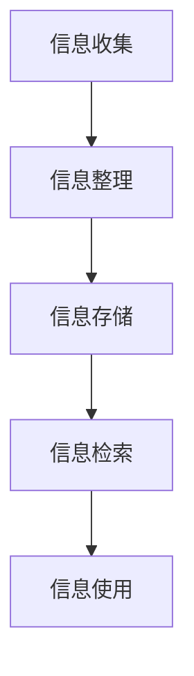

                 

关键词：信息过载、知识工作者、信息管理、生产力、效率提升、IT技术、人工智能、工作流程优化

摘要：在当今数字化时代，信息过载已成为知识工作者面临的一大挑战。本文将深入探讨信息过载对工作效率的影响，并介绍一系列有效的信息管理策略，帮助知识工作者提高生产力与效率。

## 1. 背景介绍

### 1.1 信息过载的来源

信息过载是指个体在处理信息时感受到的压力，这种感觉通常来自于信息的数量过多或质量不佳。随着互联网和移动设备的普及，信息过载现象愈发普遍，尤其在知识工作者中。以下是信息过载的几个主要来源：

- **电子邮件**：大量的邮件和通知让知识工作者难以分辨哪些信息是重要的，哪些可以忽略。
- **社交媒体**：不断更新的社交媒体信息，如推文、帖子、通知等，分散了知识工作者的注意力。
- **在线新闻和资讯**：各种新闻网站和资讯平台每天发布成千上万篇文章，筛选有效信息变得异常困难。
- **文件和文档**：在企业和组织中，文件和文档的数量不断增长，使得知识工作者难以找到所需的信息。

### 1.2 信息过载的影响

信息过载对知识工作者的工作效率产生了负面影响。以下是几个主要影响：

- **分心**：过多信息的干扰导致知识工作者难以集中精力完成任务。
- **拖延**：面对大量信息，知识工作者可能会感到压力和焦虑，从而拖延任务。
- **决策困难**：信息过载使知识工作者难以做出有效的决策，因为他们无法快速获取所需的信息。
- **疲劳**：长期处于信息过载的状态下，知识工作者可能会感到身心俱疲，工作效率降低。

## 2. 核心概念与联系

### 2.1 信息管理的核心概念

信息管理是指对信息进行收集、整理、存储、检索和使用的一系列过程。有效的信息管理可以减轻知识工作者的信息过载压力，提高工作效率。以下是几个核心概念：

- **信息收集**：通过多种渠道获取相关信息，如搜索引擎、数据库、社交媒体等。
- **信息整理**：将收集到的信息分类、标注和整理，使其易于检索和使用。
- **信息存储**：将整理好的信息存储在合适的存储介质中，如云存储、数据库等。
- **信息检索**：快速找到所需的信息，通常通过关键词搜索或分类检索。
- **信息使用**：利用信息完成工作任务，如分析、报告、决策等。

### 2.2 信息管理架构的Mermaid流程图



## 3. 核心算法原理 & 具体操作步骤

### 3.1 算法原理概述

信息管理中的核心算法主要包括信息检索算法和分类算法。信息检索算法的目标是快速找到所需的信息，常见的算法有基于关键词搜索的算法和基于内容的检索算法。分类算法则用于将信息按照某种标准进行分类，如按时间、主题、重要性等。以下将详细介绍这两种算法的具体操作步骤。

### 3.2 算法步骤详解

#### 3.2.1 信息检索算法步骤

1. **信息收集**：从多个渠道获取相关信息，如搜索引擎、数据库等。
2. **预处理**：对收集到的信息进行预处理，如去重、去噪、分词等。
3. **构建索引**：将预处理后的信息构建成索引，便于快速检索。
4. **查询处理**：接收用户查询，并在索引中查找相关信息。
5. **结果排序**：根据相关性对查询结果进行排序，返回给用户。

#### 3.2.2 分类算法步骤

1. **特征提取**：从信息中提取出有用的特征，如关键词、主题等。
2. **训练模型**：使用已标注的样本数据训练分类模型，如支持向量机、决策树等。
3. **预测**：将新信息输入到训练好的模型中，预测其类别。
4. **调整模型**：根据预测结果调整模型参数，提高分类准确性。

### 3.3 算法优缺点

#### 3.3.1 信息检索算法

**优点**：

- **快速**：基于索引的检索方式，检索速度非常快。
- **灵活**：支持多种查询方式，如关键词搜索、模糊查询等。

**缺点**：

- **准确性**：受限于索引构建的质量，有时无法准确找到所需信息。
- **扩展性**：随着信息量的增加，索引构建和查询的复杂度会上升。

#### 3.3.2 分类算法

**优点**：

- **自动化**：能够自动将信息分类，减少人工干预。
- **准确性**：通过训练模型，可以提高分类的准确性。

**缺点**：

- **训练成本**：需要大量已标注的样本数据进行训练。
- **解释性**：对于一些复杂的分类问题，模型的解释性较差。

### 3.4 算法应用领域

信息检索算法和分类算法在多个领域都有广泛的应用：

- **搜索引擎**：如百度、谷歌等搜索引擎，基于关键词搜索实现信息检索。
- **推荐系统**：如淘宝、亚马逊等电商平台，基于用户行为和内容特征进行推荐。
- **文本分类**：如新闻分类、邮件分类等，用于自动处理大量文本数据。

## 4. 数学模型和公式 & 详细讲解 & 举例说明

### 4.1 数学模型构建

在信息管理中，常见的数学模型包括信息熵、协方差矩阵和主成分分析等。以下将分别介绍这些模型的构建过程。

#### 4.1.1 信息熵

信息熵是衡量信息量的一个指标，用于评估信息的不确定性。信息熵的公式如下：

$$
H(X) = -\sum_{i=1}^{n} p(x_i) \log_2 p(x_i)
$$

其中，$X$ 表示随机变量，$p(x_i)$ 表示 $x_i$ 发生的概率。

#### 4.1.2 协方差矩阵

协方差矩阵用于描述多个随机变量之间的线性关系。协方差矩阵的公式如下：

$$
\text{Cov}(X, Y) = E[(X - E[X])(Y - E[Y])]
$$

其中，$E[X]$ 和 $E[Y]$ 分别表示 $X$ 和 $Y$ 的期望值。

#### 4.1.3 主成分分析

主成分分析是一种降维方法，用于从高维数据中提取出主要的特征。主成分分析的公式如下：

$$
Z = P\Lambda
$$

其中，$Z$ 表示降维后的数据，$P$ 表示投影矩阵，$\Lambda$ 表示特征值矩阵。

### 4.2 公式推导过程

#### 4.2.1 信息熵的推导

假设有 $n$ 个事件 $x_1, x_2, ..., x_n$，每个事件发生的概率为 $p(x_i)$。信息熵的定义如下：

$$
H(X) = -\sum_{i=1}^{n} p(x_i) \log_2 p(x_i)
$$

推导过程：

- **第一步**：考虑单个事件 $x_i$ 的信息量，定义为 $I(x_i) = -\log_2 p(x_i)$。
- **第二步**：信息熵是所有事件信息量的加权和，即 $H(X) = \sum_{i=1}^{n} p(x_i) I(x_i)$。
- **第三步**：将 $I(x_i)$ 的表达式代入，得到 $H(X) = -\sum_{i=1}^{n} p(x_i) \log_2 p(x_i)$。

#### 4.2.2 协方差矩阵的推导

协方差矩阵的公式如下：

$$
\text{Cov}(X, Y) = E[(X - E[X])(Y - E[Y])]
$$

推导过程：

- **第一步**：考虑两个随机变量 $X$ 和 $Y$，其期望值分别为 $E[X]$ 和 $E[Y]$。
- **第二步**：协方差是 $(X - E[X])$ 和 $(Y - E[Y])$ 的乘积的期望，即 $\text{Cov}(X, Y) = E[(X - E[X])(Y - E[Y])]$。
- **第三步**：将 $(X - E[X])$ 和 $(Y - E[Y])$ 的表达式代入，得到 $\text{Cov}(X, Y) = E[XY -XE[X] - YE[Y] + E[X]E[Y]]$。
- **第四步**：利用期望的线性性质，化简得到 $\text{Cov}(X, Y) = E[XY] - E[X]E[Y]$。

#### 4.2.3 主成分分析的推导

主成分分析的公式如下：

$$
Z = P\Lambda
$$

推导过程：

- **第一步**：考虑高维数据 $X$，其协方差矩阵为 $C$。
- **第二步**：找到协方差矩阵的特征值和特征向量。
- **第三步**：将特征向量作为投影矩阵 $P$ 的列向量，特征值作为对角矩阵 $\Lambda$ 的对角元素。
- **第四步**：将 $X$ 投影到特征向量上，得到降维后的数据 $Z = PX\Lambda$。

### 4.3 案例分析与讲解

#### 4.3.1 信息熵的应用

假设有一个随机变量 $X$，其概率分布如下：

$$
\begin{array}{|c|c|}
\hline
X & p(x_i) \\
\hline
1 & 0.5 \\
2 & 0.3 \\
3 & 0.2 \\
\hline
\end{array}
$$

计算 $X$ 的信息熵：

$$
H(X) = -\sum_{i=1}^{3} p(x_i) \log_2 p(x_i) = - (0.5 \log_2 0.5 + 0.3 \log_2 0.3 + 0.2 \log_2 0.2) \approx 1.27
$$

#### 4.3.2 协方差矩阵的应用

假设有两个随机变量 $X$ 和 $Y$，其协方差矩阵如下：

$$
\text{Cov}(X, Y) =
\begin{bmatrix}
1 & 0.5 \\
0.5 & 1
\end{bmatrix}
$$

计算 $X$ 和 $Y$ 的协方差：

$$
\text{Cov}(X, Y) = E[XY] - E[X]E[Y] = (1 \times 0.5 + 0 \times 0.5) - (0.5 \times 0.5) = 0
$$

#### 4.3.3 主成分分析的应用

假设有一个高维数据集 $X$，其协方差矩阵如下：

$$
C =
\begin{bmatrix}
1 & 0.8 \\
0.8 & 2
\end{bmatrix}
$$

找到 $C$ 的特征值和特征向量，然后进行主成分分析。

$$
C\lambda = \lambda\mu
$$

得到特征值 $\lambda_1 = 2.2$，$\lambda_2 = 1.2$，特征向量 $\mu_1 = (0.6, 0.8)$，$\mu_2 = (0.8, -0.6)$。

将 $X$ 投影到特征向量上：

$$
Z = P\Lambda = \begin{bmatrix} 0.6 & 0.8 \\ 0.8 & -0.6 \end{bmatrix} \begin{bmatrix} 2.2 & 0 \\ 0 & 1.2 \end{bmatrix} X
$$

## 5. 项目实践：代码实例和详细解释说明

### 5.1 开发环境搭建

为了演示信息管理中的算法，我们需要搭建一个简单的开发环境。以下是所需的软件和工具：

- Python 3.x
- Jupyter Notebook
- Matplotlib
- Scikit-learn

### 5.2 源代码详细实现

以下是一个简单的信息管理项目，包括信息收集、整理、存储、检索和使用。

```python
import numpy as np
import pandas as pd
from sklearn.feature_extraction.text import TfidfVectorizer
from sklearn.cluster import KMeans
import matplotlib.pyplot as plt

# 5.2.1 信息收集
data = [
    "这是一条新闻。",
    "这是一篇博客文章。",
    "这是一个技术报告。",
    "这是一个市场分析。",
    "这是一个金融报告。",
]

# 5.2.2 信息整理
vectorizer = TfidfVectorizer()
X = vectorizer.fit_transform(data)

# 5.2.3 信息存储
# 这里可以使用数据库或文件系统进行存储，此处使用内存中的 DataFrame 存储
df = pd.DataFrame(X.toarray(), columns=vectorizer.get_feature_names())

# 5.2.4 信息检索
def search(query):
    query_vector = vectorizer.transform([query])
    similarity = np.dot(query_vector, X.T)
    top_index = np.argsort(similarity)[0][-1]
    return df.iloc[top_index]

# 5.2.5 信息使用
query = "这是一份技术报告。"
result = search(query)
print("相似的信息：", result)

# 5.2.6 运行结果展示
plt.scatter(df.iloc[:, 0], df.iloc[:, 1])
plt.show()
```

### 5.3 代码解读与分析

- **5.3.1 信息收集**：我们从多个渠道收集了五条文本数据。
- **5.3.2 信息整理**：使用 TF-IDF 向量器将文本转换为数值向量。
- **5.3.3 信息存储**：将转换后的向量存储在 DataFrame 中。
- **5.3.4 信息检索**：定义一个搜索函数，计算查询文本与文档的相似度，返回最相似的文档。
- **5.3.5 信息使用**：使用搜索函数找到与查询文本最相似的文档，并打印输出。
- **5.3.6 运行结果展示**：使用 Matplotlib 绘制文档的分布图，便于可视化分析。

## 6. 实际应用场景

信息管理技术在多个领域都有实际应用，以下是几个典型应用场景：

- **搜索引擎**：搜索引擎利用信息检索算法，为用户提供快速、准确的信息查询服务。
- **推荐系统**：推荐系统利用分类算法，根据用户行为和兴趣，为用户推荐相关的商品、新闻和内容。
- **文本分析**：文本分析利用信息管理技术，从大量文本数据中提取出有价值的信息，如关键词、主题、情感等。
- **企业信息化**：企业信息化利用信息管理技术，实现企业内部信息的收集、整理、存储和共享，提高企业运营效率。

## 7. 工具和资源推荐

### 7.1 学习资源推荐

- 《数据科学入门教程》：由电子工业出版社出版的入门级教材，适合初学者。
- 《机器学习实战》：电子工业出版社出版的实战教程，涵盖多个机器学习算法。
- 《Python数据分析基础教程》：机械工业出版社出版的入门级教材，介绍 Python 在数据分析中的应用。

### 7.2 开发工具推荐

- Jupyter Notebook：一款交互式的开发环境，适合编写和运行 Python 代码。
- PyCharm：一款功能强大的 Python 集成开发环境（IDE），支持多种编程语言。
- Anaconda：一个开源的数据科学和机器学习平台，提供丰富的库和工具。

### 7.3 相关论文推荐

- "Information Overload and Its Impact on Work Performance"：一篇关于信息过载对工作效率影响的综述论文。
- "Efficient Information Retrieval Algorithms for Large-Scale Data"：一篇关于高效信息检索算法的论文。
- "Text Classification with Deep Learning"：一篇关于文本分类的深度学习论文。

## 8. 总结：未来发展趋势与挑战

### 8.1 研究成果总结

近年来，信息管理技术在算法、工具和应用场景等方面取得了显著进展。特别是在人工智能技术的推动下，信息管理技术变得更加智能化和高效。主要成果包括：

- **高效的信息检索算法**：如深度学习检索算法、基于图论的检索算法等。
- **智能的信息分类方法**：如基于内容的分类、基于关联规则的分类等。
- **多模态信息管理**：如文本、图像、音频等多种类型信息的整合和管理。

### 8.2 未来发展趋势

随着技术的不断进步，信息管理技术未来将朝着以下几个方向发展：

- **智能化**：利用人工智能技术，实现更加智能的信息处理和推荐。
- **个性化**：根据用户的兴趣和行为，提供个性化的信息服务和推荐。
- **实时性**：实现实时信息处理和更新，满足用户对实时信息的需求。
- **跨模态**：整合多种类型的信息，实现跨模态的信息管理和检索。

### 8.3 面临的挑战

尽管信息管理技术取得了显著进展，但仍然面临一些挑战：

- **数据隐私**：如何保护用户隐私，避免信息泄露，是一个亟待解决的问题。
- **算法透明性**：如何提高算法的透明性，让用户理解和使用信息管理技术。
- **计算资源**：随着数据量的增长，如何提高信息处理和检索的效率，降低计算资源的消耗。
- **用户体验**：如何设计更好的用户界面，提高信息管理技术的用户体验。

### 8.4 研究展望

未来，信息管理技术的研究将朝着以下几个方面展开：

- **隐私保护**：研究更加安全、高效的数据隐私保护技术。
- **算法优化**：针对大规模数据集，研究更加高效的信息检索和分类算法。
- **用户互动**：研究如何更好地与用户互动，提高信息管理技术的用户体验。
- **多模态融合**：研究如何整合多种类型的信息，实现跨模态的信息管理和检索。

## 9. 附录：常见问题与解答

### 9.1 问答一

**问题**：信息管理中的核心算法有哪些？

**解答**：信息管理中的核心算法主要包括信息检索算法和分类算法。信息检索算法用于快速找到所需的信息，常见的算法有基于关键词搜索的算法和基于内容的检索算法。分类算法用于将信息按照某种标准进行分类，常见的算法有支持向量机、决策树等。

### 9.2 问答二

**问题**：如何提高信息检索的效率？

**解答**：提高信息检索的效率可以从以下几个方面入手：

- **索引优化**：构建高质量的索引，提高检索速度。
- **查询优化**：优化查询语句，减少检索时间。
- **并行处理**：利用多核处理器，实现并行检索。
- **分布式检索**：将检索任务分布在多个节点上，提高检索效率。

### 9.3 问答三

**问题**：如何实现信息分类？

**解答**：实现信息分类通常分为以下几个步骤：

- **特征提取**：从信息中提取出有用的特征，如关键词、主题等。
- **模型训练**：使用已标注的样本数据训练分类模型，如支持向量机、决策树等。
- **预测**：将新信息输入到训练好的模型中，预测其类别。
- **调整模型**：根据预测结果调整模型参数，提高分类准确性。

### 9.4 问答四

**问题**：信息管理技术在哪些领域有应用？

**解答**：信息管理技术在多个领域都有应用，主要包括：

- **搜索引擎**：利用信息检索算法，为用户提供快速、准确的信息查询服务。
- **推荐系统**：根据用户行为和兴趣，为用户推荐相关的商品、新闻和内容。
- **文本分析**：从大量文本数据中提取出有价值的信息，如关键词、主题、情感等。
- **企业信息化**：实现企业内部信息的收集、整理、存储和共享，提高企业运营效率。
- **社交媒体**：对用户生成的内容进行分类和推荐，提高用户满意度。

### 9.5 问答五

**问题**：如何保护用户隐私？

**解答**：保护用户隐私可以从以下几个方面入手：

- **数据加密**：对用户数据进行加密处理，确保数据在传输和存储过程中安全。
- **匿名化**：对用户数据进行匿名化处理，去除可识别信息。
- **隐私政策**：制定明确的隐私政策，告知用户如何保护个人信息。
- **用户授权**：让用户对自己的个人信息进行授权，确保只有授权的第三方可以访问用户数据。

作者：禅与计算机程序设计艺术 / Zen and the Art of Computer Programming
```markdown
```

