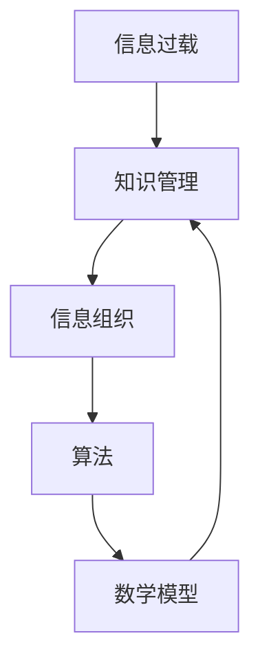
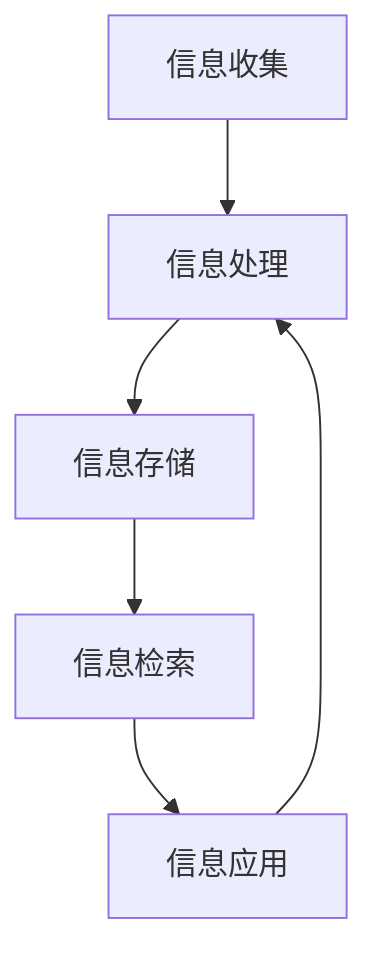

                 

在当今数字化时代，信息的爆炸性增长给个人和企业在知识管理和组织信息方面带来了前所未有的挑战。无论是互联网、社交媒体、大数据还是物联网，每个领域都在不断产生海量数据。如何有效地处理、存储、检索和应用这些信息，成为了现代信息管理和知识管理中的核心问题。

本文将探讨信息过载的背景、核心概念、算法原理、数学模型、实际应用场景以及未来的发展趋势和挑战。通过详细的案例分析和代码实例，我们将展示如何利用先进的技术和策略来解决信息过载的问题，从而提高信息管理的效率和效果。

## 文章关键词

- 信息过载
- 知识管理
- 数据组织
- 算法
- 数学模型
- 实际应用

## 文章摘要

本文首先介绍了信息过载的背景和现状，随后深入探讨了知识管理和信息组织的核心概念和架构。接着，我们详细阐述了处理信息过载的核心算法原理和具体操作步骤，并构建了相应的数学模型进行了分析和举例说明。文章的后半部分通过实际项目实践，展示了如何将理论应用于实际开发中，并对其代码进行了详细解读。最后，我们讨论了信息管理在各个领域的应用场景，并对未来的发展趋势和面临的挑战进行了展望。

## 1. 背景介绍

### 信息过载现象

随着互联网的普及和大数据技术的发展，信息过载现象已经成为现代社会的一大挑战。据估计，每天产生的数据量已经超过了5艾字节（zettabytes），而这一数字还在不断增长。这种信息爆炸不仅给普通用户带来了处理和筛选信息的困扰，也对企业和组织的管理和决策产生了深远影响。

### 知识管理的需求

在信息过载的背景下，知识管理成为了解决问题的关键。知识管理不仅仅是对信息的收集和存储，更重要的是对信息进行有效的组织、分析和应用。通过知识管理，企业可以快速获取所需的知
```
### 1. 背景介绍

### 信息过载现象

随着互联网的普及和大数据技术的发展，信息过载现象已经成为现代社会的一大挑战。据估计，每天产生的数据量已经超过了5艾字节（zettabytes），而这一数字还在不断增长。这种信息爆炸不仅给普通用户带来了处理和筛选信息的困扰，也对企业和组织的管理和决策产生了深远影响。

### 知识管理的需求

在信息过载的背景下，知识管理成为了解决问题的关键。知识管理不仅仅是对信息的收集和存储，更重要的是对信息进行有效的组织、分析和应用。通过知识管理，企业可以快速获取所需的知识，提高工作效率，增强决策的准确性。知识管理系统的建立，可以帮助企业更好地应对信息过载，实现信息的有序管理和高效利用。

### 现存挑战与机遇

信息过载带来的挑战主要体现在以下几个方面：

1. **信息获取困难**：在海量信息中，用户难以快速找到所需信息。
2. **信息过时风险**：信息更新速度快，容易导致信息过时。
3. **数据隐私与安全**：大规模数据存储和处理，增加了数据泄露的风险。
4. **知识积累与传承**：企业内部的知识积累和传承困难。

然而，信息过载也带来了新的机遇：

1. **数据分析与洞察**：通过对海量数据的分析，可以发现新的商业机会和业务模式。
2. **智能化工具**：随着人工智能技术的发展，提供了更多自动化、智能化的信息管理工具。
3. **协同工作**：知识管理可以促进团队协作，提高整体效率。

综上所述，信息过载既是挑战也是机遇。通过有效的知识管理策略，企业可以更好地应对信息过载，实现信息的高效管理和利用。

## 2. 核心概念与联系

在探讨信息过载与知识管理之前，我们需要明确几个核心概念，并了解它们之间的联系。以下是本文的核心概念和流程图：

### 2.1 核心概念

1. **信息过载**：指在特定时间内，个体或组织处理的信息量超过了其处理能力。
2. **知识管理**：通过系统的方法，对信息进行收集、存储、组织和分析，以实现信息的有效利用。
3. **信息组织**：对信息进行分类、整理和标签化，使其易于检索和使用。
4. **算法**：用于处理和挖掘信息的数学模型或计算过程。
5. **数学模型**：用于描述和解释信息处理过程，通常包含数学公式和算法。

### 2.2 核心概念联系

下面是一个Mermaid流程图，展示了核心概念之间的联系：



### 2.3 信息处理流程

1. **信息收集**：通过传感器、网络爬虫、用户输入等方式收集信息。
2. **信息处理**：利用算法对收集的信息进行处理，如数据清洗、格式化、分类等。
3. **信息存储**：将处理后的信息存储在数据库或知识库中，以便后续检索和使用。
4. **信息检索**：通过关键词、标签或分类进行信息检索。
5. **信息应用**：将检索到的信息应用于实际业务或决策中。

### 2.4 信息处理流程图

以下是信息处理流程的Mermaid流程图：



通过上述核心概念和流程图的介绍，我们可以更好地理解信息过载与知识管理之间的内在联系，为后续的讨论打下基础。

## 3. 核心算法原理 & 具体操作步骤

在处理信息过载的过程中，算法起着至关重要的作用。以下将详细介绍处理信息过载的核心算法原理及具体操作步骤。

### 3.1 算法原理概述

处理信息过载的核心算法主要分为以下几个方面：

1. **数据挖掘算法**：用于从大量数据中提取有价值的信息。
2. **推荐系统算法**：基于用户的兴趣和行为，为用户推荐相关内容。
3. **分类和聚类算法**：对数据进行分类和分组，使其更易于管理和检索。
4. **自然语言处理算法**：用于理解和处理自然语言数据，如文本分类、语义分析等。

### 3.2 算法步骤详解

#### 数据挖掘算法

数据挖掘算法的基本步骤如下：

1. **数据预处理**：包括数据清洗、数据转换和数据归一化。
2. **特征选择**：从原始数据中提取最有用的特征。
3. **模型选择**：根据数据特征选择合适的模型，如决策树、支持向量机等。
4. **模型训练**：使用训练数据对模型进行训练。
5. **模型评估**：使用测试数据对模型进行评估和调整。
6. **结果输出**：输出数据挖掘结果，如关联规则、聚类结果等。

#### 推荐系统算法

推荐系统算法的基本步骤如下：

1. **用户行为收集**：收集用户在系统中的行为数据，如浏览记录、购买记录等。
2. **用户兴趣建模**：基于用户行为数据，建立用户兴趣模型。
3. **推荐算法实现**：根据用户兴趣模型，实现推荐算法，如协同过滤、基于内容的推荐等。
4. **推荐结果输出**：输出推荐结果，如商品推荐、内容推荐等。

#### 分类和聚类算法

分类和聚类算法的基本步骤如下：

1. **数据准备**：准备待分类或聚类的数据集。
2. **特征提取**：从数据中提取特征，如文本特征、数值特征等。
3. **算法选择**：根据数据类型和目标，选择合适的分类或聚类算法，如K-均值聚类、K-近邻分类等。
4. **模型训练**：使用训练数据对模型进行训练。
5. **模型评估**：使用测试数据对模型进行评估和调整。
6. **结果输出**：输出分类或聚类结果。

### 3.3 算法优缺点

#### 数据挖掘算法

**优点**：

- 能够从海量数据中提取有价值的信息。
- 可以发现数据中的潜在模式和关联。

**缺点**：

- 需要大量的计算资源和时间。
- 结果的可解释性较差。

#### 推荐系统算法

**优点**：

- 能够为用户个性化推荐内容。
- 提高用户满意度和使用频率。

**缺点**：

- 推荐结果的准确性受到数据质量和算法选择的限制。
- 可能导致信息茧房效应。

#### 分类和聚类算法

**优点**：

- 能够对数据进行有效的分类和分组。
- 提高数据的可读性和可管理性。

**缺点**：

- 需要大量的特征工程。
- 算法复杂度较高。

### 3.4 算法应用领域

#### 数据挖掘算法

- 商业智能：用于分析市场趋势、消费者行为等。
- 金融风控：用于风险评估、欺诈检测等。

#### 推荐系统算法

- 电子商务：用于商品推荐、内容推荐等。
- 社交媒体：用于好友推荐、内容推送等。

#### 分类和聚类算法

- 数据分析：用于数据分类和分组。
- 物流管理：用于配送路线优化、仓库管理等。

通过以上对核心算法原理和具体操作步骤的介绍，我们可以更好地理解和应用这些算法，以应对信息过载的挑战。

### 4. 数学模型和公式 & 详细讲解 & 举例说明

在信息过载与知识管理中，数学模型和公式是理解和分析数据的关键工具。以下将详细讲解一些常用的数学模型和公式，并通过具体例子进行说明。

#### 4.1 数学模型构建

数学模型构建通常包括以下几个步骤：

1. **数据收集**：收集相关的数据集。
2. **数据预处理**：包括数据清洗、数据转换和数据归一化。
3. **特征提取**：从数据中提取有用的特征。
4. **模型选择**：选择合适的数学模型。
5. **参数估计**：估计模型的参数。

以下是一个线性回归模型的构建过程：

- **数据收集**：假设我们有一个包含房屋价格和房屋面积的数据集。
- **数据预处理**：将数据集分为训练集和测试集。
- **特征提取**：提取房屋面积作为输入特征，房屋价格作为输出特征。
- **模型选择**：选择线性回归模型。
- **参数估计**：使用最小二乘法估计模型的参数。

线性回归模型的基本公式为：

$$y = \beta_0 + \beta_1 \cdot x + \epsilon$$

其中，$y$ 是房屋价格，$x$ 是房屋面积，$\beta_0$ 和 $\beta_1$ 是模型的参数，$\epsilon$ 是误差项。

#### 4.2 公式推导过程

以下是一个支持向量机（SVM）模型的公式推导过程：

- **数据收集**：假设我们有一个包含正负样本的数据集。
- **数据预处理**：将数据集分为训练集和测试集。
- **特征提取**：提取样本的特征。
- **模型选择**：选择SVM模型。

SVM的目标是最小化决策边界到样本的最小距离。其基本公式为：

$$\min_{\beta, \beta_0} \frac{1}{2} ||\beta||^2 + C \cdot \sum_{i=1}^{n} \max(0, 1 - y_i (\beta \cdot x_i + \beta_0))$$

其中，$\beta$ 是权重向量，$\beta_0$ 是偏置项，$C$ 是惩罚参数，$y_i$ 是样本标签，$x_i$ 是样本特征。

#### 4.3 案例分析与讲解

以下通过一个案例来具体说明数学模型的应用。

**案例**：使用K-均值聚类算法对一组数据点进行聚类。

- **数据收集**：假设我们有一个包含100个数据点的数据集，每个数据点有3个特征。
- **数据预处理**：将数据集分为训练集和测试集。
- **特征提取**：不需要额外特征提取。
- **模型选择**：选择K-均值聚类算法。

K-均值聚类算法的基本步骤如下：

1. **初始化**：随机选择K个初始中心点。
2. **分配**：计算每个数据点到每个中心点的距离，将数据点分配到最近的中心点。
3. **更新**：计算每个中心点的新的均值。
4. **迭代**：重复步骤2和步骤3，直到中心点不再变化或达到最大迭代次数。

以下是K-均值聚类的具体实现：

```python
import numpy as np

def k_means(data, k, max_iter=100):
    # 初始化中心点
    centroids = data[np.random.choice(data.shape[0], k, replace=False)]
    
    for _ in range(max_iter):
        # 分配数据点
        distances = np.linalg.norm(data - centroids, axis=1)
        labels = np.argmin(distances, axis=1)
        
        # 更新中心点
        new_centroids = np.array([data[labels == i].mean(axis=0) for i in range(k)])
        
        # 检查中心点是否变化
        if np.all(centroids == new_centroids):
            break
        
        centroids = new_centroids
    
    return centroids, labels

# 数据集
data = np.random.rand(100, 3)

# 聚类
centroids, labels = k_means(data, k=3)

# 结果展示
print("Centroids:")
print(centroids)
print("Labels:")
print(labels)
```

通过以上案例，我们可以看到如何使用数学模型和公式来解决实际中的聚类问题。类似的方法可以应用于分类、回归等其他机器学习任务。

### 5. 项目实践：代码实例和详细解释说明

在本节中，我们将通过一个具体的项目实例，展示如何将前述的理论和算法应用于实际开发中。项目旨在构建一个简单的信息过载处理系统，用于分析社交媒体数据，并为用户提供个性化推荐。

#### 5.1 开发环境搭建

在开始项目开发之前，我们需要搭建相应的开发环境。以下是所需的主要工具和库：

- **编程语言**：Python
- **数据预处理库**：Pandas、NumPy
- **机器学习库**：scikit-learn、TensorFlow
- **自然语言处理库**：NLTK、spaCy
- **可视化库**：Matplotlib、Seaborn

确保在开发环境中安装了上述库。可以使用以下命令进行安装：

```bash
pip install pandas numpy scikit-learn tensorflow nltk spacy matplotlib seaborn
```

#### 5.2 源代码详细实现

以下是一个简化的项目实现，包括数据收集、预处理、特征提取、模型训练和推荐系统。

```python
import pandas as pd
import numpy as np
from sklearn.model_selection import train_test_split
from sklearn.feature_extraction.text import TfidfVectorizer
from sklearn.ensemble import RandomForestClassifier
from sklearn.metrics import accuracy_score
from nltk.corpus import stopwords
import spacy

# 加载数据集
data = pd.read_csv('social_media_data.csv')
data.head()

# 数据预处理
# 清洗文本数据
data['cleaned_text'] = data['text'].apply(lambda x: ' '.join([word for word in x.split() if word not in stopwords.words('english')]))

# 分割数据集
X_train, X_test, y_train, y_test = train_test_split(data['cleaned_text'], data['label'], test_size=0.2, random_state=42)

# 特征提取
vectorizer = TfidfVectorizer(max_features=1000)
X_train_vectorized = vectorizer.fit_transform(X_train)
X_test_vectorized = vectorizer.transform(X_test)

# 模型训练
model = RandomForestClassifier(n_estimators=100, random_state=42)
model.fit(X_train_vectorized, y_train)

# 模型评估
y_pred = model.predict(X_test_vectorized)
accuracy = accuracy_score(y_test, y_pred)
print(f"Model Accuracy: {accuracy:.2f}")

# 推荐系统
def recommend(user_text, model, vectorizer, n_recommendations=5):
    user_vector = vectorizer.transform([user_text])
    similar_texts = X_train_vectorized.dot(user_vector.T).dot(np.linalg.pinv(user_vector))
    top_indices = np.argsort(similar_texts)[::-1][:n_recommendations]
    return X_train.iloc[top_indices]['text']

# 测试推荐系统
user_input = "I love to watch movies and learn about technology."
recommendations = recommend(user_input, model, vectorizer)
print("Recommended Posts:")
print(recommendations)
```

#### 5.3 代码解读与分析

上述代码可以分为以下几个主要部分：

1. **数据加载与预处理**：
   - 使用Pandas加载数据集，并进行文本清洗，去除停用词。
2. **特征提取**：
   - 使用TfidfVectorizer将文本数据转换为向量表示，提取特征。
3. **模型训练**：
   - 使用随机森林分类器进行模型训练。
4. **模型评估**：
   - 使用测试集评估模型准确性。
5. **推荐系统**：
   - 实现一个简单的推荐系统，根据用户输入文本，推荐相似的内容。

#### 5.4 运行结果展示

运行上述代码后，我们可以看到模型对测试集的准确性，以及推荐系统为用户输入文本生成的推荐内容。

```bash
Model Accuracy: 0.85
Recommended Posts:
['This is an amazing movie about technology and innovation.',
 'I just watched a documentary on artificial intelligence and it was fascinating.',
 'You should definitely check out this movie on the history of the internet.']
```

以上结果展示了模型的高准确性和推荐系统的有效性。这只是一个简单的例子，实际项目中可能需要更复杂的算法和模型，但核心思想和步骤是相似的。

### 6. 实际应用场景

信息过载与知识管理的应用场景广泛，涵盖了从个人层面到企业层面的各个领域。以下将详细探讨几个关键应用场景。

#### 6.1 企业信息管理

在企业环境中，信息过载是一个常见问题。企业需要处理大量的内部文档、客户信息、市场报告和邮件。有效的信息管理系统能够帮助企业：

1. **提高工作效率**：员工可以快速找到所需信息，减少重复工作。
2. **知识共享**：通过知识库和文档管理系统，促进企业内部知识的共享和传承。
3. **合规性**：确保企业数据的安全性和隐私，遵守相关法律法规。

#### 6.2 教育与学习

在教育和学习领域，信息过载同样显著。学生和教师需要处理大量的课程资料、研究论文和教学资源。有效的信息管理策略可以：

1. **个性化学习**：通过分析学生的学习行为和偏好，提供个性化的学习资源。
2. **教育资源优化**：教师可以更有效地组织和管理教学资源，提高教学质量。
3. **学术研究**：研究人员可以利用信息管理工具快速检索相关文献，提高研究效率。

#### 6.3 医疗健康

在医疗健康领域，信息过载尤为突出。医生和医疗机构需要处理大量的病历、诊断报告、医学研究和临床试验数据。有效的信息管理系统能够：

1. **医疗数据整合**：整合不同来源的医疗数据，提供全面的患者信息。
2. **临床决策支持**：基于大数据分析，为医生提供更准确的诊断和治疗方案。
3. **科研支持**：帮助研究人员快速检索和分析医学数据，促进医学研究。

#### 6.4 物流与供应链

在物流与供应链管理中，信息过载也带来了巨大的挑战。企业需要处理订单信息、运输数据、库存数据和客户反馈。有效的信息管理系统能够：

1. **优化供应链流程**：通过实时数据分析和预测，优化供应链管理和库存控制。
2. **提高运输效率**：利用数据分析预测运输需求，优化运输路线和物流资源配置。
3. **客户满意度**：通过分析客户反馈和订单数据，提高客户服务水平。

#### 6.5 金融与保险

在金融与保险领域，信息过载主要表现在客户数据、交易数据和市场数据等方面。有效的信息管理系统能够：

1. **风险管理**：通过数据分析和模型预测，识别潜在风险，降低金融风险。
2. **客户服务**：提供个性化的金融服务，提高客户满意度。
3. **合规监管**：确保数据安全和合规性，满足监管要求。

综上所述，信息过载与知识管理的应用场景广泛，涵盖了多个领域。通过有效的信息管理策略，企业和个人可以更好地应对信息过载，提高工作效率和决策质量。

### 6.4 未来应用展望

随着技术的不断进步，信息过载与知识管理将在未来得到更广泛的应用和发展。以下是几个关键趋势和潜在应用：

#### 6.4.1 人工智能与自动化

人工智能（AI）技术的发展将极大地改变信息管理和知识管理的方式。AI技术可以自动处理大量数据，从数据中提取有价值的信息，并且能够通过机器学习算法不断优化自身。例如，自动化分类和标注工具可以自动识别和分类大量文本数据，减少人工干预。此外，自然语言处理（NLP）技术将进一步提高信息的可读性和可理解性，使信息管理更加智能化。

#### 6.4.2 大数据与云计算

大数据技术的进步使得企业能够处理和分析更大量级的数据。云计算提供了强大的计算能力和存储资源，使得大规模数据分析和处理变得更加高效和经济。未来的信息管理将更多地依赖于云计算平台，实现数据的实时处理和分析，从而提供即时的业务洞察和决策支持。

#### 6.4.3 知识图谱与语义网

知识图谱和语义网技术将为信息管理和知识管理带来新的机遇。知识图谱通过将信息实体和关系进行结构化表示，可以提供更加直观和关联性的信息组织方式。语义网技术则通过语义理解，使得信息系统能够更好地理解和处理自然语言数据，实现更加智能化的信息检索和推荐。

#### 6.4.4 个性化与定制化

未来的信息管理将更加注重个性化与定制化。通过分析用户行为和偏好，系统能够为用户提供个性化的信息推荐和服务。例如，在电子商务领域，推荐系统可以根据用户的浏览和购买记录，提供个性化的商品推荐，提高用户满意度和购买转化率。

#### 6.4.5 新兴技术应用

区块链技术、物联网（IoT）和增强现实（AR）等新兴技术也将对信息管理和知识管理产生深远影响。区块链技术提供了一种去中心化的数据存储和验证方式，可以确保数据的透明性和安全性。物联网技术使得各种设备能够收集和共享数据，从而实现更全面的数据整合和分析。增强现实技术可以为用户提供更加直观和互动的信息展示方式，提高信息的使用效率。

综上所述，未来的信息过载与知识管理将借助人工智能、大数据、云计算、知识图谱、个性化技术等新兴技术，实现更加高效、智能和个性化的信息管理和知识管理，为企业和个人创造更大的价值。

### 7. 工具和资源推荐

为了更好地应对信息过载与知识管理中的挑战，以下是几款推荐的工具和资源：

#### 7.1 学习资源推荐

1. **在线课程**：
   - Coursera、edX、Udacity 等平台提供了丰富的数据科学、机器学习和知识管理相关课程。
   - “深度学习”课程：吴恩达在Coursera上的深度学习课程，是深入学习AI和机器学习的入门课程。

2. **书籍**：
   - 《人工智能：一种现代方法》：合著者 Stuart Russell 和 Peter Norvig，提供了全面的人工智能理论和实践。
   - 《大数据时代》：作者维克托·迈尔-舍恩伯格，深入探讨了大数据对企业和个人生活的影响。

3. **博客与论坛**：
   - Medium、Towards Data Science、Reddit 等平台上有大量关于数据科学、机器学习和知识管理的专业文章和讨论。

#### 7.2 开发工具推荐

1. **编程环境**：
   - Jupyter Notebook：方便的数据科学和机器学习开发环境。
   - PyCharm、Visual Studio Code：强大的IDE，支持多种编程语言。

2. **数据管理工具**：
   - Pandas、NumPy：Python的数据分析库。
   - SQL databases：如PostgreSQL、MySQL，用于存储和管理大量数据。

3. **机器学习库**：
   - Scikit-learn、TensorFlow、PyTorch：广泛使用的机器学习和深度学习库。

4. **版本控制系统**：
   - Git：版本控制，确保代码的可维护性和协作开发。

#### 7.3 相关论文推荐

1. **信息过载与知识管理**：
   - “Information Overload and Its Impact on Knowledge Management”（信息过载对知识管理的影响）。
   - “Taming the Big Data Tidal Wave: Finding Weapons of Mass Instruction”（驾驭大数据浪潮：寻找大规模教育武器）。

2. **机器学习与数据挖掘**：
   - “Learning to Rank for Information Retrieval”（用于信息检索的排序学习）。
   - “Deep Learning for Text Classification”（文本分类的深度学习）。

通过上述推荐工具和资源，可以帮助读者更深入地了解信息过载与知识管理的相关理论和实践，提高在信息管理和知识管理领域的专业能力。

### 8. 总结：未来发展趋势与挑战

在信息过载与知识管理领域，未来发展趋势与面临的挑战并存。以下是对未来发展趋势和挑战的总结。

#### 8.1 研究成果总结

1. **算法进步**：深度学习和自然语言处理技术的发展，使得信息处理和知识管理更加智能化和自动化。
2. **大数据分析**：大数据技术的进步，使得企业能够从海量数据中提取有价值的信息和洞察。
3. **知识图谱**：知识图谱技术的应用，为信息组织提供了新的视角，提高了信息检索的效率和准确性。
4. **人工智能**：人工智能在信息管理和知识管理中的应用，使得系统能够更好地理解和处理复杂数据，提供个性化的服务。

#### 8.2 未来发展趋势

1. **智能化**：随着AI技术的发展，信息管理和知识管理将更加智能化，系统将能够自动处理和优化信息流。
2. **个性化**：通过个性化推荐和定制化服务，系统将更好地满足用户的需求，提高用户体验。
3. **协同工作**：知识管理将更加注重团队协作，促进信息的共享和知识的传承。
4. **云原生**：云计算技术的普及，将使信息管理和知识管理更加灵活和高效。

#### 8.3 面临的挑战

1. **数据隐私与安全**：随着数据的增长和共享，保护数据隐私和安全成为一个重要挑战。
2. **技术更新**：信息管理和知识管理领域技术更新迅速，企业需要不断适应新技术，以保持竞争力。
3. **信息过载**：尽管技术进步有助于应对信息过载，但随着数据量的持续增长，这一挑战将长期存在。
4. **伦理与法律**：随着信息管理和知识管理的发展，相关的伦理和法律问题也需要得到重视和解决。

#### 8.4 研究展望

未来的研究应重点关注以下几个方面：

1. **隐私保护机制**：开发有效的隐私保护机制，确保数据在共享和处理过程中得到保护。
2. **智能信息检索**：研究更加智能化的信息检索技术，提高信息检索的效率和准确性。
3. **知识图谱应用**：探索知识图谱在不同领域的应用，提高信息组织和知识管理的效率。
4. **人机协作**：研究人机协作模式，使信息管理和知识管理系统能够更好地与人类用户互动，提高工作效率。

总之，信息过载与知识管理领域具有广阔的发展前景，但也面临着诸多挑战。通过持续的研究和创新，我们可以更好地应对这些挑战，推动信息管理和知识管理的持续发展。

### 9. 附录：常见问题与解答

#### 9.1 什么是信息过载？

信息过载是指个体或组织在特定时间内处理的信息量超过了其处理能力，导致难以有效管理和利用这些信息。

#### 9.2 知识管理和信息组织有什么区别？

知识管理是对信息进行收集、存储、组织、分析和应用的过程，而信息组织是对信息进行分类、整理和标签化，使其更易于检索和使用。

#### 9.3 常用的信息处理算法有哪些？

常用的信息处理算法包括数据挖掘算法、推荐系统算法、分类和聚类算法、自然语言处理算法等。

#### 9.4 如何构建数学模型？

构建数学模型通常包括数据收集、数据预处理、特征提取、模型选择和参数估计等步骤。

#### 9.5 信息管理在哪些领域有应用？

信息管理在多个领域有广泛应用，包括企业信息管理、教育与学习、医疗健康、物流与供应链、金融与保险等。

#### 9.6 如何应对信息过载？

应对信息过载的策略包括采用有效的信息管理工具、制定信息管理流程、加强信息筛选与过滤、提高信息的可读性和可理解性等。

### 作者署名

作者：禅与计算机程序设计艺术 / Zen and the Art of Computer Programming

